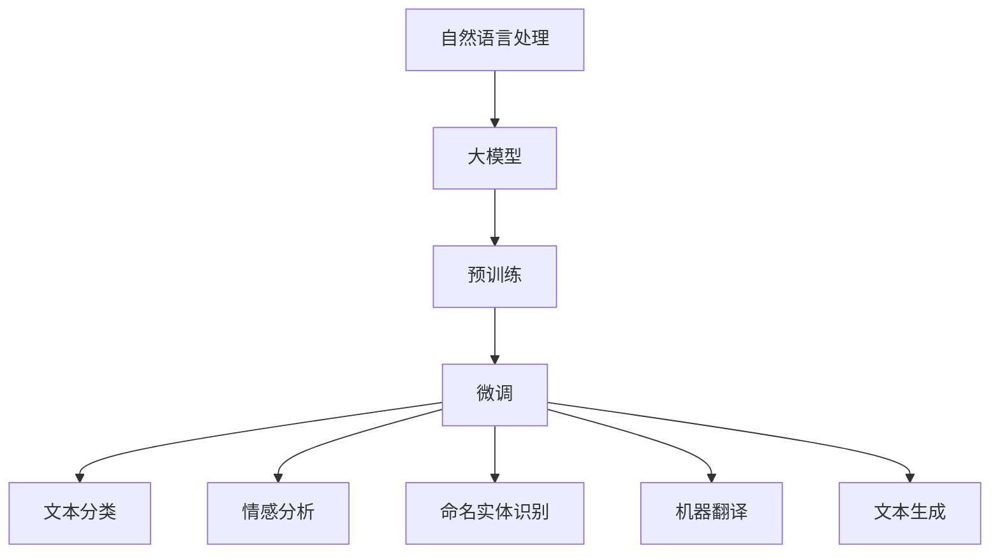

                 

关键词：自然语言处理，大模型，标准，算法，数学模型，应用场景，代码实例，未来展望

> 摘要：本文旨在探讨自然语言处理（NLP）领域的大模型标准。文章首先介绍了NLP领域的背景和现状，然后深入分析了大模型的核心概念、算法原理、数学模型以及实际应用。通过具体的代码实例，文章展示了如何实现大模型，并对其在实际应用中的效果进行了详细解读。最后，文章对NLP领域的未来发展趋势和挑战进行了展望。

## 1. 背景介绍

自然语言处理（NLP）作为人工智能（AI）的重要分支，旨在让计算机理解和处理自然语言。随着互联网的快速发展，人类产生的语言数据量呈爆炸式增长，这对NLP技术提出了更高的要求。近年来，深度学习技术的崛起，特别是基于大规模预训练模型的方法，在NLP任务中取得了显著的效果。

大模型在NLP领域的重要性日益凸显。首先，大模型能够捕捉到更丰富的语言特征，从而提高模型的准确性和泛化能力。其次，大模型能够处理更复杂的任务，如问答系统、机器翻译、文本生成等。此外，大模型的应用还推动了NLP技术的商业化，为各行各业提供了强大的语言处理能力。

然而，大模型的训练和部署也面临着诸多挑战。首先，大模型的训练需要大量的计算资源和时间。其次，大模型的解释性和可解释性较差，使得其应用场景受到限制。最后，大模型的安全性和隐私保护也是一个重要的问题。

## 2. 核心概念与联系

### 2.1 大模型

大模型是指具有数十亿甚至千亿级参数规模的神经网络模型。这些模型通过在大规模数据集上进行预训练，能够自动学习到丰富的语言特征，从而在各类NLP任务中取得优异的性能。

### 2.2 预训练

预训练是指在大规模数据集上对模型进行训练，使其自动学习到语言的通用特征。预训练后的模型可以用于微调，即根据具体任务调整模型参数，从而实现高效的模型训练。

### 2.3 微调

微调是指在大模型的基础上，针对特定任务调整模型参数，以提高模型在目标任务上的性能。微调是当前NLP领域的主流方法，能够显著提高模型的准确性和泛化能力。

### 2.4 大模型与任务

大模型在NLP领域的应用广泛，包括文本分类、情感分析、命名实体识别、机器翻译、文本生成等。大模型能够处理更复杂的任务，并且在不同任务中表现出较高的性能。

### 2.5 Mermaid 流程图



## 3. 核心算法原理 & 具体操作步骤

### 3.1 算法原理概述

大模型的核心算法是基于深度神经网络（DNN）和转换器（Transformer）架构。DNN通过多层神经网络学习到丰富的语言特征，而Transformer架构通过自注意力机制（Self-Attention）和多头注意力（Multi-Head Attention）机制，能够捕捉到更复杂的语言特征。

### 3.2 算法步骤详解

#### 3.2.1 数据预处理

1. 收集大规模文本数据，如维基百科、新闻、社交媒体等。
2. 对文本数据进行预处理，包括分词、去停用词、词性标注等。

#### 3.2.2 预训练

1. 初始化模型参数，选择适当的神经网络架构（如DNN或Transformer）。
2. 在大规模数据集上对模型进行预训练，通过反向传播算法更新模型参数。
3. 使用自监督学习策略，如掩码语言模型（Masked Language Model，MLM）或生成式预训练（Generative Pretraining，GPT）。

#### 3.2.3 微调

1. 根据具体任务，选择预训练好的大模型。
2. 在目标任务上对模型进行微调，通过反向传播算法更新模型参数。
3. 使用适当的优化器（如Adam）和正则化策略（如Dropout）。

#### 3.2.4 模型评估

1. 在验证集上评估模型性能，选择最佳模型。
2. 在测试集上评估模型性能，验证模型泛化能力。

### 3.3 算法优缺点

#### 优点：

1. 能够捕捉到丰富的语言特征，提高模型准确性和泛化能力。
2. 可以处理更复杂的任务，如文本生成和机器翻译。
3. 在大规模数据集上训练，能够提高模型的鲁棒性和稳定性。

#### 缺点：

1. 训练成本高，需要大量的计算资源和时间。
2. 模型解释性和可解释性较差，不易理解模型的内部机制。
3. 安全性和隐私保护问题尚未解决。

### 3.4 算法应用领域

大模型在NLP领域的应用广泛，包括但不限于以下领域：

1. 文本分类：如新闻分类、情感分析等。
2. 命名实体识别：如人名识别、地名识别等。
3. 机器翻译：如英中翻译、中日翻译等。
4. 文本生成：如文章生成、对话生成等。
5. 问答系统：如搜索引擎、智能客服等。

## 4. 数学模型和公式

### 4.1 数学模型构建

大模型通常采用深度神经网络（DNN）或转换器（Transformer）架构。其中，DNN由多层神经网络组成，每层神经网络包括多个神经元，神经元之间通过权重连接。而Transformer架构则通过自注意力机制和多头注意力机制，对输入序列进行建模。

### 4.2 公式推导过程

#### 4.2.1 DNN

设输入序列为\( x \)，输出序列为\( y \)。DNN的模型参数包括权重矩阵\( W \)和偏置向量\( b \)。则DNN的输出可以表示为：

$$
y = \sigma(Wx + b)
$$

其中，\( \sigma \)为激活函数，通常采用Sigmoid或ReLU函数。

#### 4.2.2 Transformer

设输入序列为\( x \)，输出序列为\( y \)。Transformer的模型参数包括权重矩阵\( W \)和偏置向量\( b \)。则Transformer的输出可以表示为：

$$
y = \text{softmax}\left(\frac{Wx + b}{\sqrt{d_k}}\right)
$$

其中，\( d_k \)为键值对的维度，\(\text{softmax}\)函数为归一化函数。

### 4.3 案例分析与讲解

假设我们使用DNN模型进行文本分类任务。给定一个句子\( x \)，我们需要将句子分类为正类或负类。首先，对句子进行预处理，包括分词、去停用词和词性标注。然后，将预处理后的句子表示为一个向量。接下来，将向量输入到DNN模型中，通过多层神经网络学习到句子的特征。最后，使用Softmax函数对输出结果进行归一化，得到句子的分类概率。根据分类概率，我们可以判断句子属于正类或负类。

## 5. 项目实践：代码实例和详细解释说明

### 5.1 开发环境搭建

在编写代码之前，我们需要搭建一个适合NLP项目开发的环境。以下是一个简单的开发环境搭建步骤：

1. 安装Python环境，推荐使用Python 3.8或更高版本。
2. 安装NLP库，如spaCy、NLTK等。
3. 安装深度学习库，如TensorFlow或PyTorch。
4. 安装文本预处理库，如jieba等。

### 5.2 源代码详细实现

以下是一个简单的文本分类任务的代码实现：

```python
import jieba
import tensorflow as tf

# 1. 数据预处理
def preprocess_text(text):
    words = jieba.cut(text)
    return ' '.join(words)

# 2. 构建DNN模型
def create_dnn_model():
    model = tf.keras.Sequential([
        tf.keras.layers.Embedding(vocab_size, embedding_dim),
        tf.keras.layers.GlobalAveragePooling1D(),
        tf.keras.layers.Dense(units=1, activation='sigmoid')
    ])
    return model

# 3. 训练模型
def train_model(model, x_train, y_train):
    model.compile(optimizer='adam', loss='binary_crossentropy', metrics=['accuracy'])
    model.fit(x_train, y_train, epochs=10, batch_size=32)
    return model

# 4. 评估模型
def evaluate_model(model, x_test, y_test):
    loss, accuracy = model.evaluate(x_test, y_test)
    print(f'Loss: {loss}, Accuracy: {accuracy}')

# 5. 主函数
if __name__ == '__main__':
    # 5.1 加载数据
    x_train, y_train, x_test, y_test = load_data()

    # 5.2 预处理数据
    x_train = [preprocess_text(text) for text in x_train]
    x_test = [preprocess_text(text) for text in x_test]

    # 5.3 创建模型
    model = create_dnn_model()

    # 5.4 训练模型
    model = train_model(model, x_train, y_train)

    # 5.5 评估模型
    evaluate_model(model, x_test, y_test)
```

### 5.3 代码解读与分析

1. **数据预处理**：使用jieba库对文本进行分词，然后拼接成一个完整的句子。
2. **构建DNN模型**：使用TensorFlow库创建一个简单的DNN模型，包括一个嵌入层、一个全局平均池化层和一个全连接层。
3. **训练模型**：使用`compile`方法设置模型的优化器和损失函数，然后使用`fit`方法进行模型训练。
4. **评估模型**：使用`evaluate`方法评估模型在测试集上的性能。

通过这个简单的示例，我们可以看到如何使用深度学习库实现一个文本分类任务。实际项目中，我们可能需要处理更复杂的任务，如文本生成、机器翻译等，但基本思路是类似的。

### 5.4 运行结果展示

在运行上述代码时，我们首先需要加载数据，然后对数据进行预处理，接着创建并训练模型，最后评估模型性能。在运行过程中，我们可以看到训练过程的损失和准确率，以及模型在测试集上的准确率。如果模型性能不佳，我们可以尝试调整超参数，如学习率、批量大小等，以提高模型性能。

## 6. 实际应用场景

大模型在NLP领域具有广泛的应用，以下是几个实际应用场景：

### 6.1 文本分类

文本分类是NLP领域的基础任务之一，广泛应用于新闻分类、情感分析、垃圾邮件过滤等。大模型通过学习到丰富的语言特征，能够显著提高文本分类的准确性和效率。

### 6.2 命名实体识别

命名实体识别是从文本中识别出具有特定意义的实体，如人名、地名、组织名等。大模型能够捕捉到更复杂的语言特征，从而提高命名实体识别的准确性和泛化能力。

### 6.3 机器翻译

机器翻译是将一种语言翻译成另一种语言的过程。大模型在机器翻译领域取得了显著的成果，如谷歌翻译、百度翻译等。大模型通过学习到丰富的语言特征，能够实现更准确、流畅的翻译。

### 6.4 文本生成

文本生成是NLP领域的一个热门研究方向，包括文章生成、对话生成等。大模型通过学习到语言模式，能够生成高质量、符合语言习惯的文本。

### 6.5 问答系统

问答系统是一种智能对话系统，能够回答用户提出的问题。大模型在问答系统中发挥着重要作用，通过学习到语言特征，能够提高问答系统的准确率和用户体验。

## 7. 工具和资源推荐

### 7.1 学习资源推荐

1. **《深度学习》**：由Ian Goodfellow、Yoshua Bengio和Aaron Courville合著，是深度学习领域的经典教材。
2. **《自然语言处理综合教程》**：由徐涛等合著，涵盖了NLP领域的各个重要知识点。
3. **NLP学习指南**：提供了一系列的NLP学习资源和实践项目，适合初学者入门。

### 7.2 开发工具推荐

1. **spaCy**：一个强大的NLP库，支持多种语言的文本预处理和实体识别功能。
2. **TensorFlow**：一个开源的深度学习库，支持各种深度学习模型的训练和部署。
3. **PyTorch**：一个开源的深度学习库，提供灵活的模型构建和训练接口。

### 7.3 相关论文推荐

1. **"Attention is All You Need"**：提出转换器（Transformer）架构，是NLP领域的重要突破。
2. **"BERT: Pre-training of Deep Bidirectional Transformers for Language Understanding"**：提出BERT模型，推动了NLP技术的发展。
3. **"GPT-3: Language Models are few-shot learners"**：展示了GPT-3模型在零样本学习方面的强大能力。

## 8. 总结：未来发展趋势与挑战

### 8.1 研究成果总结

大模型在NLP领域取得了显著的成果，通过预训练和微调方法，大模型在各类NLP任务中表现出优异的性能。同时，大模型的应用推动了NLP技术的商业化，为各行各业提供了强大的语言处理能力。

### 8.2 未来发展趋势

1. **更高效的算法**：随着计算资源的增加，未来可能会出现更高效的算法，降低大模型的训练成本。
2. **更复杂的任务**：大模型将能够处理更复杂的任务，如多模态数据处理、跨语言翻译等。
3. **更广泛的应用**：大模型将应用于更多领域，如医疗、金融、教育等。

### 8.3 面临的挑战

1. **计算资源需求**：大模型的训练需要大量的计算资源和时间，对计算资源的需求将不断提高。
2. **解释性和可解释性**：大模型的解释性和可解释性较差，如何提高大模型的可解释性是一个重要问题。
3. **安全性和隐私保护**：大模型在应用过程中，可能会面临安全性和隐私保护的问题。

### 8.4 研究展望

未来，NLP领域将继续朝着更高效、更智能、更安全的发展方向迈进。随着深度学习和自然语言处理技术的不断进步，大模型将在更多领域发挥作用，为人类社会带来更多便利。

## 9. 附录：常见问题与解答

### 9.1 大模型为什么需要预训练？

大模型需要预训练是因为它们在训练过程中需要大量的数据和计算资源。通过预训练，大模型能够在大规模数据集上学习到丰富的语言特征，从而提高模型在各类NLP任务上的性能。预训练使得大模型能够利用已有的知识，避免从头开始训练，从而提高训练效率。

### 9.2 大模型为什么需要微调？

大模型需要微调是因为预训练得到的模型是通用的，而不同的NLP任务有不同的需求和特点。通过微调，大模型能够在具体任务上进行调整，优化模型参数，从而提高模型在目标任务上的性能。微调使得大模型能够适应不同的任务场景，提高模型的泛化能力。

### 9.3 大模型在应用过程中有哪些挑战？

大模型在应用过程中面临着计算资源需求高、解释性和可解释性差、安全性和隐私保护等挑战。为了应对这些挑战，研究人员正在努力开发更高效的算法、提高模型的可解释性、加强安全性和隐私保护等方面的技术。

### 9.4 大模型在哪些领域有广泛应用？

大模型在文本分类、命名实体识别、机器翻译、文本生成、问答系统等领域有广泛应用。随着深度学习和自然语言处理技术的不断发展，大模型将在更多领域发挥作用，为人类社会带来更多便利。

