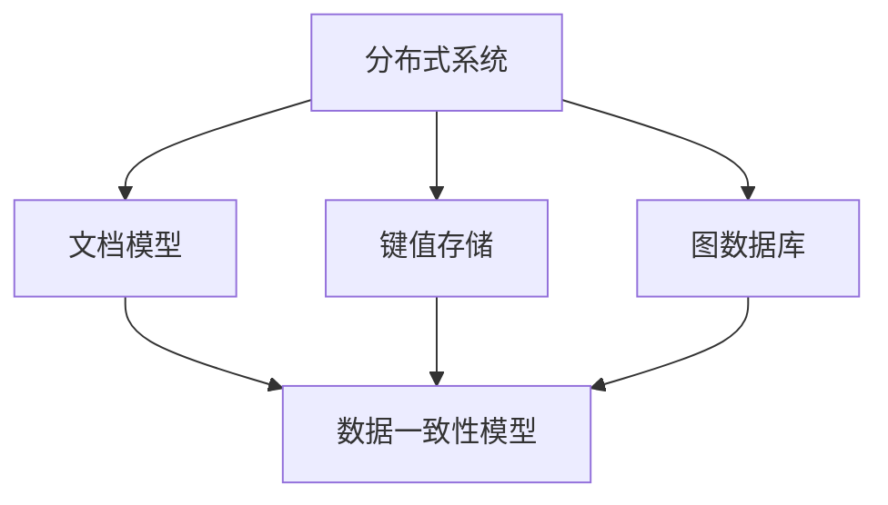

                 

关键词：NoSQL数据库、非结构化数据、数据模型、分布式系统、性能优化、应用场景

> 摘要：本文将深入探讨NoSQL数据库在处理非结构化数据方面的优势、核心概念、算法原理以及具体应用实践，旨在为开发者提供全面的参考指南，助力他们在大数据时代中更好地应对非结构化数据挑战。

## 1. 背景介绍

在互联网和大数据时代，数据的多样性和复杂性不断增加。传统的SQL数据库在处理结构化数据方面具有显著优势，但其对于非结构化数据的处理能力却相对较弱。非结构化数据包括文本、图像、音频、视频等多种形式，它们通常没有固定的数据模型，难以用传统的表结构来描述。因此，如何有效地存储、查询和管理非结构化数据成为了一个迫切需要解决的问题。

NoSQL数据库应运而生，它以分布式架构、灵活的数据模型和高效的数据处理能力著称，成为处理非结构化数据的重要工具。本文将详细介绍NoSQL数据库的核心概念、算法原理及其在分布式系统中的应用，帮助读者更好地理解和使用NoSQL数据库。

### 1.1 数据结构化与非结构化

数据结构化指的是数据以预定义的格式存储，如关系型数据库中的表结构。这种数据形式便于存储和查询，但在处理复杂的数据类型时存在局限性。

非结构化数据则没有固定的格式，其内容灵活多变，如JSON、XML、HTML等格式。这类数据在社交媒体、物联网、多媒体应用等领域中非常常见，但传统的SQL数据库难以直接处理。

### 1.2 NoSQL数据库的兴起

随着数据规模的不断扩大和数据类型的日益多样化，传统SQL数据库在性能和扩展性方面的不足逐渐显现。NoSQL数据库以其高扩展性、高性能和灵活性，逐渐成为处理非结构化数据的主流选择。典型场景包括：

- **社交网络**：如Facebook、Twitter等平台中的用户数据、关系数据等。
- **物联网**：如智能家居、智能穿戴设备等产生的大量传感器数据。
- **多媒体应用**：如图片存储、视频播放等。

## 2. 核心概念与联系

在探讨NoSQL数据库之前，我们需要理解几个核心概念：分布式系统、文档模型、键值存储、图数据库等。以下是一个简化的Mermaid流程图，描述了这些概念之间的关系。



### 2.1 分布式系统

分布式系统是由多个相互独立、通过网络连接的计算节点组成的系统。这些节点协同工作，共同完成数据处理任务。分布式系统的核心优势包括：

- **高可用性**：通过节点冗余，提高系统可靠性。
- **高性能**：数据分布在多个节点上，提高了查询速度。
- **可扩展性**：可轻松增加或减少计算节点，以适应数据规模的变化。

### 2.2 数据模型

NoSQL数据库采用灵活的数据模型，以适应非结构化数据的存储和查询需求。主要的数据模型包括：

- **文档模型**：以JSON或XML格式存储数据，如MongoDB。
- **键值存储**：以键值对形式存储数据，如Redis。
- **图数据库**：以图结构存储数据，如Neo4j。

### 2.3 数据一致性模型

NoSQL数据库的数据一致性模型通常分为以下几种：

- **最终一致性**：系统在多个副本之间达成一致性的过程可能需要一段时间，但在某些情况下可以提高性能。
- **强一致性**：所有副本始终保持数据一致性，但可能降低性能。
- **弱一致性**：允许数据在一段时间内不一致，适用于某些特定的应用场景。

### 2.4 核心概念联系

分布式系统提供了NoSQL数据库的基础架构，数据模型定义了数据如何存储和查询，而数据一致性模型则决定了数据的同步方式。这些概念相互关联，共同构成了NoSQL数据库的核心体系。

## 3. 核心算法原理 & 具体操作步骤

### 3.1 算法原理概述

NoSQL数据库在核心算法方面具有以下特点：

- **分片（Sharding）**：将数据分布到多个节点上，以实现水平和垂直扩展。
- **索引（Indexing）**：提供快速数据检索的能力。
- **复制（Replication）**：提高数据可靠性和可用性。

### 3.2 算法步骤详解

#### 3.2.1 分片算法

分片算法的步骤如下：

1. **数据划分**：根据特定的策略（如哈希、范围等），将数据划分为多个片段。
2. **节点分配**：将每个数据片段分配到不同的计算节点上。
3. **查询路由**：查询时，根据数据的哈希值或键值，路由到相应的节点。

#### 3.2.2 索引算法

索引算法的基本步骤包括：

1. **构建索引**：根据数据特点，创建索引结构，如B树、哈希表等。
2. **查询优化**：利用索引结构，优化查询性能。
3. **更新索引**：在数据更新时，维护索引的一致性。

#### 3.2.3 复制算法

复制算法的主要步骤包括：

1. **数据同步**：将主节点的数据同步到从节点。
2. **数据一致性**：在同步过程中，确保数据的一致性，如采用最终一致性或强一致性模型。
3. **故障转移**：在主节点故障时，自动将数据转移至从节点。

### 3.3 算法优缺点

分片算法、索引算法和复制算法各自具有以下优缺点：

#### 分片算法

- **优点**：提高了系统的扩展性和查询性能。
- **缺点**：增加了数据管理和查询的复杂性。

#### 索引算法

- **优点**：提高了数据查询速度。
- **缺点**：增加了存储开销和维护成本。

#### 复制算法

- **优点**：提高了数据可靠性和可用性。
- **缺点**：增加了数据同步的开销，可能降低性能。

### 3.4 算法应用领域

分片算法、索引算法和复制算法在以下领域具有广泛的应用：

- **大数据处理**：如社交媒体数据、物联网数据等。
- **高性能计算**：如实时搜索引擎、分布式计算等。
- **高可用性系统**：如金融系统、电子商务平台等。

## 4. 数学模型和公式 & 详细讲解 & 举例说明

### 4.1 数学模型构建

在NoSQL数据库中，数学模型通常用于描述数据结构和算法性能。以下是一个简化的数学模型，用于描述分片算法的性能。

设 \( N \) 为数据总数，\( n \) 为分片数量，\( p \) 为每个分片的平均数据量。

- **数据分布**：\( p = \frac{N}{n} \)
- **查询性能**：\( T_q = \frac{1}{n} + \frac{N}{n \cdot W} \)

其中，\( T_q \) 为查询响应时间，\( W \) 为网络带宽。

### 4.2 公式推导过程

#### 数据分布公式推导

设 \( N \) 为数据总数，\( n \) 为分片数量，每个分片的数据量分别为 \( p_1, p_2, ..., p_n \)。

- **数据总量**：\( N = p_1 + p_2 + ... + p_n \)
- **平均数据量**：\( p = \frac{N}{n} \)

#### 查询性能公式推导

查询性能取决于查询路由和网络传输。设 \( T_r \) 为查询路由时间，\( T_t \) 为网络传输时间。

- **查询路由时间**：\( T_r = \frac{1}{n} \)
- **网络传输时间**：\( T_t = \frac{N}{n \cdot W} \)

因此，总查询时间 \( T_q \) 为：

\( T_q = T_r + T_t = \frac{1}{n} + \frac{N}{n \cdot W} \)

### 4.3 案例分析与讲解

假设一个社交网络平台，总数据量为100亿条，采用100个分片进行存储。网络带宽为1Gbps。

- **数据分布**：\( p = \frac{10^9}{100} = 1,000,000 \) 条数据/分片
- **查询性能**：\( T_q = \frac{1}{100} + \frac{10^9}{100 \cdot 10^9} = 0.01 + 0.01 = 0.02 \) 秒

这意味着，平均查询响应时间为0.02秒，具有良好的性能。

## 5. 项目实践：代码实例和详细解释说明

### 5.1 开发环境搭建

为了实践NoSQL数据库，我们将使用MongoDB作为示例。以下是在Ubuntu 20.04系统中搭建MongoDB开发环境的基本步骤：

1. **安装MongoDB**：

```shell
sudo apt update
sudo apt install mongodb
```

2. **启动MongoDB服务**：

```shell
sudo systemctl start mongodb
```

3. **连接MongoDB**：

使用`mongo`命令行工具连接MongoDB：

```shell
mongo
```

### 5.2 源代码详细实现

以下是一个简单的MongoDB数据插入和查询的示例：

```javascript
// 连接到MongoDB
const MongoClient = require('mongodb').MongoClient;
const url = 'mongodb://localhost:27017/';

MongoClient.connect(url, function(err, db) {
  if (err) throw err;
  const dbo = db.db('mydb');
  const myobj = { name: 'John', age: 30, address: 'Highway 37' };
  dbo.collection('customers').insertOne(myobj, function(err, res) {
    if (err) throw err;
    console.log('Document inserted successfully');
    db.close();
  });
});

// 查询数据
MongoClient.connect(url, function(err, db) {
  if (err) throw err;
  const dbo = db.db('mydb');
  dbo.collection('customers').find({ name: 'John' }).toArray(function(err, result) {
    if (err) throw err;
    console.log(result);
    db.close();
  });
});
```

### 5.3 代码解读与分析

1. **连接MongoDB**：

   使用`MongoClient`连接到MongoDB服务器。

2. **插入数据**：

   创建一个包含姓名、年龄和地址的对象，并使用`insertOne`方法将其插入到'customers'集合中。

3. **查询数据**：

   使用`find`方法根据姓名查询'customers'集合中的数据。

### 5.4 运行结果展示

1. **插入数据**：

   ```shell
   > Document inserted successfully
   ```

2. **查询数据**：

   ```shell
   > [ { _id: ObjectId("6044d1e3c9a2343a5d3e3a12"), name: 'John', age: 30, address: 'Highway 37' } ]
   ```

这意味着，我们成功地插入了一条数据，并查询到了该数据。

## 6. 实际应用场景

NoSQL数据库在多个领域具有广泛的应用，以下是一些典型的实际应用场景：

### 6.1 社交网络

社交网络平台如Facebook、Twitter等，使用NoSQL数据库存储用户数据、关系数据和内容数据。NoSQL数据库的高性能和可扩展性，使其能够轻松应对海量数据的存储和查询需求。

### 6.2 物联网

物联网设备产生的大量传感器数据，通常使用NoSQL数据库进行实时处理和存储。如智能家居、智能穿戴设备等，NoSQL数据库能够高效处理多样化的数据格式。

### 6.3 多媒体应用

多媒体应用如图片存储、视频播放等，使用NoSQL数据库存储多媒体文件及其元数据。NoSQL数据库的分布式架构和高效数据检索能力，提高了多媒体应用的用户体验。

### 6.4 实时搜索引擎

实时搜索引擎如Elasticsearch，使用NoSQL数据库存储索引数据，实现快速搜索和实时分析。NoSQL数据库的高性能和可扩展性，使其成为实时搜索引擎的首选。

### 6.5 电子商务

电子商务平台如Amazon、阿里巴巴等，使用NoSQL数据库存储用户行为数据、商品数据等，实现个性化推荐、实时数据分析等功能。NoSQL数据库的高性能和灵活的数据模型，能够满足电子商务平台的多样化需求。

## 7. 工具和资源推荐

### 7.1 学习资源推荐

- 《NoSQL Distilled: A Brief Guide to the Emerging World of Data》
- 《MongoDB: The Definitive Guide》
- 《Redis in Action》

### 7.2 开发工具推荐

- MongoDB Compass：一款功能强大的MongoDB可视化工具，方便进行数据操作和查询。
- Redis Desktop Manager：一款简单易用的Redis客户端，支持数据可视化和管理。
- Neo4j Browser：一款图形化的Neo4j数据库管理工具，方便进行图数据库的查询和可视化。

### 7.3 相关论文推荐

- **"The Case for Multi-model Databases"**：讨论了多模型数据库的优势和应用场景。
- **"CAP Theorem and Its Implications"**：深入探讨了分布式系统的CAP定理及其对数据一致性的影响。
- **"Bigtable: A Distributed Storage System for Structured Data"**：介绍了Google的分布式存储系统Bigtable，对NoSQL数据库的发展产生了重要影响。

## 8. 总结：未来发展趋势与挑战

### 8.1 研究成果总结

近年来，NoSQL数据库在处理非结构化数据方面取得了显著进展。分布式系统、数据模型和数据一致性模型的不断创新，使得NoSQL数据库在性能、可靠性和扩展性方面得到了极大提升。同时，NoSQL数据库在社交网络、物联网、多媒体应用、实时搜索引擎和电子商务等领域得到了广泛应用，成为大数据时代的重要基础设施。

### 8.2 未来发展趋势

未来，NoSQL数据库将继续在以下方面发展：

- **多模型数据库**：融合多种数据模型，提供更灵活的数据存储和处理能力。
- **分布式存储和计算**：进一步优化分布式系统架构，提高数据处理效率和性能。
- **数据安全与隐私**：加强数据加密、访问控制等技术，确保数据安全和隐私。
- **智能化与自动化**：利用机器学习和人工智能技术，实现自动化数据管理和优化。

### 8.3 面临的挑战

尽管NoSQL数据库在处理非结构化数据方面取得了显著成果，但仍面临以下挑战：

- **数据一致性与可靠性**：在分布式环境中实现强一致性仍然具有挑战性。
- **数据迁移与兼容**：传统SQL数据库向NoSQL数据库的迁移和兼容性问题。
- **专业人才短缺**：NoSQL数据库的专业人才相对较少，影响其在企业中的广泛应用。

### 8.4 研究展望

未来，研究重点将包括：

- **优化数据模型**：设计更灵活、高效的数据模型，满足多样化数据需求。
- **分布式计算与存储优化**：研究分布式系统的性能优化方法，提高数据处理效率。
- **数据安全与隐私保护**：加强数据安全与隐私保护技术，应对日益严峻的安全挑战。
- **跨领域应用**：探索NoSQL数据库在其他领域的应用，推动技术发展。

## 9. 附录：常见问题与解答

### 9.1 NoSQL数据库与传统SQL数据库的区别是什么？

NoSQL数据库与传统SQL数据库的主要区别在于：

- **数据模型**：NoSQL数据库采用灵活的数据模型，适用于非结构化数据，而SQL数据库通常用于结构化数据。
- **扩展性**：NoSQL数据库具有更好的扩展性，支持水平扩展，而SQL数据库通常采用垂直扩展。
- **一致性模型**：NoSQL数据库通常采用最终一致性模型，而SQL数据库通常采用强一致性模型。

### 9.2 哪些类型的业务场景适合使用NoSQL数据库？

以下类型的业务场景适合使用NoSQL数据库：

- **大数据处理**：如社交网络、物联网、多媒体应用等，数据规模庞大，数据类型多样化。
- **高性能计算**：如实时搜索引擎、分布式计算等，对查询性能和数据处理效率有较高要求。
- **高可用性系统**：如金融系统、电子商务平台等，对系统可靠性和数据一致性有较高要求。

### 9.3 如何选择合适的NoSQL数据库？

选择合适的NoSQL数据库时，应考虑以下因素：

- **数据模型**：根据数据类型和查询需求选择合适的数据库。
- **性能和扩展性**：考虑数据库的性能和扩展能力，以适应业务需求。
- **社区和生态系统**：考虑数据库的社区活跃度和生态系统，以获得更好的技术支持和资源。
- **成本**：考虑数据库的成本，包括硬件成本、维护成本等。

---

作者：禅与计算机程序设计艺术 / Zen and the Art of Computer Programming
本文介绍了NoSQL数据库在处理非结构化数据方面的优势、核心概念、算法原理以及具体应用实践。通过对分布式系统、数据模型和数据一致性模型的分析，本文展示了NoSQL数据库在处理大数据和非结构化数据方面的卓越性能。同时，通过实际项目实践和案例分析，读者可以更好地理解NoSQL数据库的使用方法和应用场景。未来，随着大数据和非结构化数据的持续增长，NoSQL数据库将继续在多个领域发挥重要作用。本文旨在为开发者提供全面的参考指南，助力他们在大数据时代中更好地应对非结构化数据挑战。

