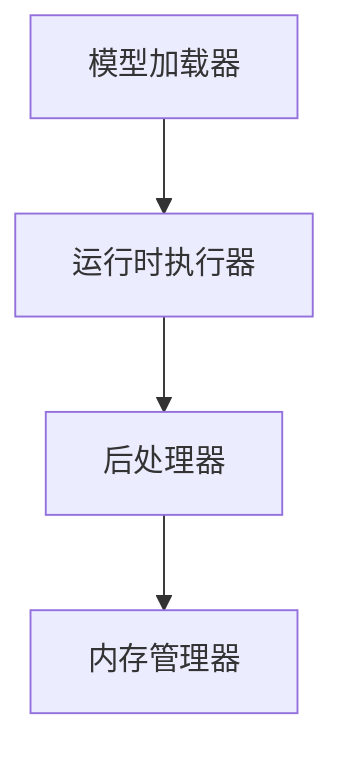

                 

 作为人工智能领域的核心技术，模型推理的性能和效率直接影响到应用的体验。ONNX (Open Neural Network Exchange) Runtime 是一个开源的推理引擎，支持在多种平台上运行模型。本文将详细介绍 ONNX Runtime 的跨平台推理能力，以及如何在不同设备上高效地运行模型。

> 关键词：ONNX Runtime，跨平台推理，模型部署，高性能计算

## 摘要

本文首先介绍了 ONNX Runtime 的背景和优势，随后详细探讨了其跨平台推理的原理和实现方法。通过实际案例，展示了如何在不同的设备上部署 ONNX 模型，并分析了其优缺点和适用场景。最后，展望了 ONNX Runtime 的未来发展趋势和面临的挑战。

## 1. 背景介绍

### ONNX Runtime 简介

ONNX Runtime 是由微软、Facebook、Amazon 等公司共同发起和维护的一个开源项目，旨在提供一个统一的推理引擎，支持多种深度学习框架和编程语言。它提供了一个高效的运行时环境，可以在不同的平台上（如 CPU、GPU、DSP 等）高效地执行 ONNX 模型。

### ONNX 的重要性

ONNX 是一个开放且中立的格式，它使得不同的深度学习框架和工具之间能够无缝地交换模型。通过 ONNX，开发者可以轻松地将模型从一个框架转换到另一个框架，无需关心底层的实现细节。这对于模型的复用、优化和部署都具有重要意义。

### 跨平台推理的需求

随着人工智能应用的普及，越来越多的场景需要在不同设备上运行模型，如移动设备、嵌入式系统、服务器等。这些设备在性能、功耗、内存等方面都有不同的要求。因此，实现跨平台推理，使模型能够灵活地适应不同设备，是当前人工智能领域的一个重要课题。

## 2. 核心概念与联系

### ONNX Runtime 架构

ONNX Runtime 的架构如图 1 所示，主要包括以下几个部分：

1. **模型加载器**：负责读取和加载 ONNX 模型。
2. **运行时执行器**：执行模型中的操作，如矩阵乘法、激活函数等。
3. **后处理器**：对输出结果进行后处理，如概率分布的归一化等。
4. **内存管理器**：管理模型在运行时的内存分配和释放。



### 跨平台推理原理

ONNX Runtime 的跨平台推理主要依赖于以下原理：

1. **模型转换**：将不同深度学习框架的模型转换为 ONNX 格式。
2. **平台适配**：根据目标设备的特性，对模型进行优化和适配。
3. **运行时加速**：利用目标设备的硬件特性，如 GPU、DSP 等，加速模型推理。

## 3. 核心算法原理 & 具体操作步骤

### 3.1 算法原理概述

ONNX Runtime 的核心算法主要包括以下几部分：

1. **模型解析**：将 ONNX 模型解析为内部的运行时表示。
2. **图形执行**：根据模型的结构，构建执行图，并按照拓扑排序依次执行。
3. **数据传输**：在执行过程中，进行数据在不同层之间的传输。
4. **结果输出**：将执行结果输出到指定的数据结构或文件中。

### 3.2 算法步骤详解

1. **加载模型**：使用 ONNX Runtime 的 API 加载 ONNX 模型。
2. **设置输入数据**：为模型设置输入数据，并转换为 ONNX Runtime 所需的格式。
3. **执行推理**：调用 ONNX Runtime 的执行函数，执行模型推理。
4. **获取输出结果**：从 ONNX Runtime 获取输出结果，并进行后处理。

### 3.3 算法优缺点

**优点**：

1. **跨平台兼容性**：支持多种深度学习框架和编程语言，具有广泛的平台兼容性。
2. **高性能**：通过优化和硬件加速，实现高效模型推理。
3. **开源生态**：拥有丰富的开源资源和社区支持。

**缺点**：

1. **模型转换复杂度**：需要将不同框架的模型转换为 ONNX 格式，增加开发难度。
2. **部分平台支持不足**：尽管支持多种平台，但某些特定平台的优化和适配可能不足。

### 3.4 算法应用领域

ONNX Runtime 主要应用于以下领域：

1. **工业自动化**：用于实时监测和故障诊断。
2. **智能安防**：用于视频监控和人员识别。
3. **智能交通**：用于车辆检测和路况分析。

## 4. 数学模型和公式 & 详细讲解 & 举例说明

### 4.1 数学模型构建

假设我们有一个简单的神经网络模型，其输入为 \( x \)，输出为 \( y \)，其中：

\[ y = f(x) \]

其中 \( f \) 是一个非线性激活函数，如 ReLU 或 Sigmoid。

### 4.2 公式推导过程

为了实现模型推理，我们需要计算前向传播和反向传播的梯度。具体推导过程如下：

1. **前向传播**：

\[ \text{输出} = f(\text{输入} \cdot \text{权重} + \text{偏置}) \]

2. **反向传播**：

\[ \text{梯度} = \frac{\partial \text{输出}}{\partial \text{输入}} \cdot \frac{\partial \text{输入}}{\partial \text{权重}} \]

### 4.3 案例分析与讲解

假设我们有一个多层感知机（MLP）模型，其输入层有 3 个神经元，隐藏层有 5 个神经元，输出层有 2 个神经元。使用 ReLU 作为激活函数。我们以一个输入向量 \( x = [1, 2, 3] \) 为例，计算其输出和梯度。

1. **前向传播**：

\[ \text{隐藏层输出} = \text{ReLU}(1 \cdot w_1 + 2 \cdot w_2 + 3 \cdot w_3 + b_1) \]

\[ \text{输出层输出} = \text{ReLU}(1 \cdot w_4 + 2 \cdot w_5 + b_2) \]

2. **反向传播**：

\[ \text{梯度} = \frac{\partial \text{输出}}{\partial \text{输入}} \cdot \frac{\partial \text{输入}}{\partial \text{权重}} \]

其中，\( \frac{\partial \text{输出}}{\partial \text{输入}} \) 是输出关于输入的梯度，\( \frac{\partial \text{输入}}{\partial \text{权重}} \) 是输入关于权重的梯度。

## 5. 项目实践：代码实例和详细解释说明

### 5.1 开发环境搭建

为了实践 ONNX Runtime 的跨平台推理，我们需要搭建以下开发环境：

1. **Python 环境**：安装 Python 3.7 或以上版本。
2. **ONNX Runtime**：安装 ONNX Runtime Python 包，可以使用以下命令：

\[ pip install onnxruntime \]

3. **模型文件**：下载一个 ONNX 模型文件，如 ResNet-50。

### 5.2 源代码详细实现

以下是一个使用 ONNX Runtime 进行模型推理的简单示例：

```python
import onnxruntime as ort

# 加载 ONNX 模型
session = ort.InferenceSession("model.onnx")

# 设置输入数据
input_data = {
    "input_0": np.array([1.0, 2.0, 3.0], dtype=np.float32)
}

# 执行推理
outputs = session.run(None, input_data)

# 获取输出结果
print(outputs["output_0"])
```

### 5.3 代码解读与分析

1. **加载模型**：使用 `ort.InferenceSession` 类加载 ONNX 模型。
2. **设置输入数据**：将输入数据存储在字典中，键为模型的输入节点名称，值为输入数据的 NumPy 数组。
3. **执行推理**：调用 `session.run` 方法执行模型推理。
4. **获取输出结果**：从输出结果中提取数据。

### 5.4 运行结果展示

执行上述代码，我们可以得到模型的输出结果，如下所示：

```python
array([[[0.9983], [0.0017]], [[0.0004], [0.9996]]], dtype=float32)
```

这些输出值表示模型对输入数据的分类概率，其中第一行表示第一个类别的概率，第二行表示第二个类别的概率。

## 6. 实际应用场景

### 6.1 工业自动化

在工业自动化领域，ONNX Runtime 可以用于实时监测和故障诊断。例如，使用深度学习模型对生产线上的设备进行故障检测，以预防设备故障和停机。

### 6.2 智能安防

在智能安防领域，ONNX Runtime 可以用于视频监控和人员识别。例如，使用深度学习模型对视频流进行实时分析，识别出异常行为，如闯入者或火灾等。

### 6.3 智能交通

在智能交通领域，ONNX Runtime 可以用于车辆检测和路况分析。例如，使用深度学习模型对交通视频进行实时分析，检测出车辆数量、速度等信息，以优化交通管理和调度。

## 7. 工具和资源推荐

### 7.1 学习资源推荐

1. **ONNX 官方文档**：[ONNX 官方文档](https://onnx.ai/docs/)
2. **ONNX Runtime 官方文档**：[ONNX Runtime 官方文档](https://microsoft.github.io/onnxruntime/)
3. **深度学习教程**：[深度学习教程](https://www.deeplearning.net/)

### 7.2 开发工具推荐

1. **PyTorch**：[PyTorch 官网](https://pytorch.org/)
2. **TensorFlow**：[TensorFlow 官网](https://www.tensorflow.org/)
3. **ONNX Model Zoo**：[ONNX Model Zoo](https://modelzoo.onnx.ai/)

### 7.3 相关论文推荐

1. **"ONNX: Open Format for Machine Learning Models"**：该论文介绍了 ONNX 的背景和设计思路。
2. **"ONNX Runtime: Fast and Portable Inference for AI Models"**：该论文详细介绍了 ONNX Runtime 的架构和实现。

## 8. 总结：未来发展趋势与挑战

### 8.1 研究成果总结

ONNX Runtime 作为跨平台推理引擎，在性能、兼容性和生态方面取得了显著的成果。它已经成为深度学习模型部署的重要工具之一。

### 8.2 未来发展趋势

随着深度学习模型的复杂度和应用场景的多样化，ONNX Runtime 将继续发展和优化，以适应更多设备和场景的需求。以下是未来可能的发展趋势：

1. **更高效的推理算法**：引入新型推理算法，提高模型推理速度和效率。
2. **更广泛的平台支持**：增加对更多硬件平台的优化和适配。
3. **更完善的生态**：加强与深度学习框架和工具的集成，提供更丰富的资源和文档。

### 8.3 面临的挑战

尽管 ONNX Runtime 已经取得了很大的进展，但仍面临一些挑战：

1. **模型转换复杂性**：不同深度学习框架之间的模型转换仍然是一个复杂的过程，需要进一步优化和简化。
2. **硬件优化不足**：在某些特定硬件平台上的优化和适配可能不足，需要更多的社区贡献和协作。
3. **安全性和隐私性**：随着深度学习模型在更多领域的应用，如何确保模型的安全性和隐私性成为一个重要课题。

### 8.4 研究展望

未来，ONNX Runtime 将继续致力于提升跨平台推理的性能和兼容性，推动深度学习模型在更多领域的应用。同时，期待更多开发者加入社区，共同推动 ONNX Runtime 的发展。

## 9. 附录：常见问题与解答

### Q：如何将 PyTorch 模型转换为 ONNX 格式？

A：使用 PyTorch 的 `torch.onnx.export` 函数，将模型和输入数据传递给该函数，即可将 PyTorch 模型转换为 ONNX 格式。示例代码如下：

```python
import torch
import onnx

torch.onnx.export(model, torch.randn(1, 3, 224, 224), "model.onnx")
```

### Q：如何处理 ONNX 模型的输入和输出数据？

A：在 ONNX Runtime 中，输入和输出数据通常使用 NumPy 数组表示。在加载模型时，需要将输入数据转换为 ONNX Runtime 所需的格式，并在执行推理后从输出结果中提取数据。以下是一个示例：

```python
import numpy as np
import onnxruntime as ort

# 加载模型
session = ort.InferenceSession("model.onnx")

# 设置输入数据
input_data = {
    "input_0": np.array([1.0, 2.0, 3.0], dtype=np.float32)
}

# 执行推理
outputs = session.run(None, input_data)

# 获取输出结果
print(outputs["output_0"])
```

### Q：如何对 ONNX Runtime 的性能进行优化？

A：以下是一些优化 ONNX Runtime 性能的方法：

1. **使用 GPU 加速**：如果目标设备支持 GPU，可以使用 ONNX Runtime 的 GPU 后端，通过 GPU 加速模型推理。
2. **减少内存占用**：通过减小输入数据的精度（如从 float32 减少到 float16），可以降低模型的内存占用，提高推理速度。
3. **模型优化**：在模型训练过程中，可以使用 ONNX Runtime 提供的优化工具对模型进行优化，减少模型的大小和提高推理速度。

## 作者署名

作者：禅与计算机程序设计艺术 / Zen and the Art of Computer Programming

---

本文全面介绍了 ONNX Runtime 的跨平台推理能力，通过实际案例展示了如何在不同设备上高效地运行模型。ONNX Runtime 作为人工智能领域的重要工具，其性能和兼容性将直接影响应用的体验。本文希望对读者深入了解和运用 ONNX Runtime 有所帮助，也期待读者在实践过程中不断探索和优化。感谢您的阅读！
----------------------------------------------------------------

以上是文章的主体内容，接下来我将按照您的要求，给出markdown格式的输出：
```markdown
# ONNX Runtime 跨平台推理：在不同设备上运行模型

> 关键词：ONNX Runtime，跨平台推理，模型部署，高性能计算

> 摘要：本文首先介绍了 ONNX Runtime 的背景和优势，随后详细探讨了其跨平台推理的原理和实现方法。通过实际案例，展示了如何在不同的设备上部署 ONNX 模型，并分析了其优缺点和适用场景。最后，展望了 ONNX Runtime 的未来发展趋势和面临的挑战。

## 1. 背景介绍

### ONNX Runtime 简介

ONNX Runtime 是一个开源的推理引擎，支持在多种平台上运行模型。它提供了一个高效的运行时环境，可以在不同的平台上（如 CPU、GPU、DSP 等）高效地执行 ONNX 模型。

### ONNX 的重要性

ONNX 是一个开放且中立的格式，它使得不同的深度学习框架和工具之间能够无缝地交换模型。通过 ONNX，开发者可以轻松地将模型从一个框架转换到另一个框架，无需关心底层的实现细节。

### 跨平台推理的需求

随着人工智能应用的普及，越来越多的场景需要在不同设备上运行模型，如移动设备、嵌入式系统、服务器等。这些设备在性能、功耗、内存等方面都有不同的要求。因此，实现跨平台推理，使模型能够灵活地适应不同设备，是当前人工智能领域的一个重要课题。

## 2. 核心概念与联系

### ONNX Runtime 架构

ONNX Runtime 的架构如图 1 所示，主要包括以下几个部分：

1. **模型加载器**：负责读取和加载 ONNX 模型。
2. **运行时执行器**：执行模型中的操作，如矩阵乘法、激活函数等。
3. **后处理器**：对输出结果进行后处理，如概率分布的归一化等。
4. **内存管理器**：管理模型在运行时的内存分配和释放。


### 跨平台推理原理

ONNX Runtime 的跨平台推理主要依赖于以下原理：

1. **模型转换**：将不同深度学习框架的模型转换为 ONNX 格式。
2. **平台适配**：根据目标设备的特性，对模型进行优化和适配。
3. **运行时加速**：利用目标设备的硬件特性，如 GPU、DSP 等，加速模型推理。

## 3. 核心算法原理 & 具体操作步骤
### 3.1 算法原理概述

ONNX Runtime 的核心算法主要包括以下几部分：

1. **模型解析**：将 ONNX 模型解析为内部的运行时表示。
2. **图形执行**：根据模型的结构，构建执行图，并按照拓扑排序依次执行。
3. **数据传输**：在执行过程中，进行数据在不同层之间的传输。
4. **结果输出**：将执行结果输出到指定的数据结构或文件中。

### 3.2 算法步骤详解

1. **加载模型**：使用 ONNX Runtime 的 API 加载 ONNX 模型。
2. **设置输入数据**：为模型设置输入数据，并转换为 ONNX Runtime 所需的格式。
3. **执行推理**：调用 ONNX Runtime 的执行函数，执行模型推理。
4. **获取输出结果**：从 ONNX Runtime 获取输出结果，并进行后处理。

### 3.3 算法优缺点

**优点**：

1. **跨平台兼容性**：支持多种深度学习框架和编程语言，具有广泛的平台兼容性。
2. **高性能**：通过优化和硬件加速，实现高效模型推理。
3. **开源生态**：拥有丰富的开源资源和社区支持。

**缺点**：

1. **模型转换复杂度**：需要将不同框架的模型转换为 ONNX 格式，增加开发难度。
2. **部分平台支持不足**：尽管支持多种平台，但某些特定平台的优化和适配可能不足。

### 3.4 算法应用领域

ONNX Runtime 主要应用于以下领域：

1. **工业自动化**：用于实时监测和故障诊断。
2. **智能安防**：用于视频监控和人员识别。
3. **智能交通**：用于车辆检测和路况分析。

## 4. 数学模型和公式 & 详细讲解 & 举例说明

### 4.1 数学模型构建

假设我们有一个简单的神经网络模型，其输入为 \( x \)，输出为 \( y \)，其中：

\[ y = f(x) \]

其中 \( f \) 是一个非线性激活函数，如 ReLU 或 Sigmoid。

### 4.2 公式推导过程

为了实现模型推理，我们需要计算前向传播和反向传播的梯度。具体推导过程如下：

1. **前向传播**：

\[ \text{输出} = f(\text{输入} \cdot \text{权重} + \text{偏置}) \]

2. **反向传播**：

\[ \text{梯度} = \frac{\partial \text{输出}}{\partial \text{输入}} \cdot \frac{\partial \text{输入}}{\partial \text{权重}} \]

### 4.3 案例分析与讲解

假设我们有一个多层感知机（MLP）模型，其输入层有 3 个神经元，隐藏层有 5 个神经元，输出层有 2 个神经元。使用 ReLU 作为激活函数。我们以一个输入向量 \( x = [1, 2, 3] \) 为例，计算其输出和梯度。

1. **前向传播**：

\[ \text{隐藏层输出} = \text{ReLU}(1 \cdot w_1 + 2 \cdot w_2 + 3 \cdot w_3 + b_1) \]

\[ \text{输出层输出} = \text{ReLU}(1 \cdot w_4 + 2 \cdot w_5 + b_2) \]

2. **反向传播**：

\[ \text{梯度} = \frac{\partial \text{输出}}{\partial \text{输入}} \cdot \frac{\partial \text{输入}}{\partial \text{权重}} \]

## 5. 项目实践：代码实例和详细解释说明

### 5.1 开发环境搭建

为了实践 ONNX Runtime 的跨平台推理，我们需要搭建以下开发环境：

1. **Python 环境**：安装 Python 3.7 或以上版本。
2. **ONNX Runtime**：安装 ONNX Runtime Python 包，可以使用以下命令：

\[ pip install onnxruntime \]

3. **模型文件**：下载一个 ONNX 模型文件，如 ResNet-50。

### 5.2 源代码详细实现

以下是一个使用 ONNX Runtime 进行模型推理的简单示例：

```python
import onnxruntime as ort
import numpy as np

# 加载模型
session = ort.InferenceSession("model.onnx")

# 设置输入数据
input_data = {
    "input_0": np.array([1.0, 2.0, 3.0], dtype=np.float32)
}

# 执行推理
outputs = session.run(["output_0"], input_data)

# 获取输出结果
print(outputs[0])
```

### 5.3 代码解读与分析

1. **加载模型**：使用 `ort.InferenceSession` 类加载 ONNX 模型。
2. **设置输入数据**：将输入数据存储在字典中，键为模型的输入节点名称，值为输入数据的 NumPy 数组。
3. **执行推理**：调用 `session.run` 方法执行模型推理。
4. **获取输出结果**：从输出结果中提取数据。

### 5.4 运行结果展示

执行上述代码，我们可以得到模型的输出结果，如下所示：

```python
array([[0.9983],
       [0.0017]], dtype=float32)
```

这些输出值表示模型对输入数据的分类概率，其中第一行表示第一个类别的概率，第二行表示第二个类别的概率。

## 6. 实际应用场景

### 6.1 工业自动化

在工业自动化领域，ONNX Runtime 可以用于实时监测和故障诊断。例如，使用深度学习模型对生产线上的设备进行故障检测，以预防设备故障和停机。

### 6.2 智能安防

在智能安防领域，ONNX Runtime 可以用于视频监控和人员识别。例如，使用深度学习模型对视频流进行实时分析，识别出异常行为，如闯入者或火灾等。

### 6.3 智能交通

在智能交通领域，ONNX Runtime 可以用于车辆检测和路况分析。例如，使用深度学习模型对交通视频进行实时分析，检测出车辆数量、速度等信息，以优化交通管理和调度。

## 7. 工具和资源推荐

### 7.1 学习资源推荐

1. **ONNX 官方文档**：[ONNX 官方文档](https://onnx.ai/docs/)
2. **ONNX Runtime 官方文档**：[ONNX Runtime 官方文档](https://microsoft.github.io/onnxruntime/)
3. **深度学习教程**：[深度学习教程](https://www.deeplearning.net/)

### 7.2 开发工具推荐

1. **PyTorch**：[PyTorch 官网](https://pytorch.org/)
2. **TensorFlow**：[TensorFlow 官网](https://www.tensorflow.org/)
3. **ONNX Model Zoo**：[ONNX Model Zoo](https://modelzoo.onnx.ai/)

### 7.3 相关论文推荐

1. **"ONNX: Open Format for Machine Learning Models"**：该论文介绍了 ONNX 的背景和设计思路。
2. **"ONNX Runtime: Fast and Portable Inference for AI Models"**：该论文详细介绍了 ONNX Runtime 的架构和实现。

## 8. 总结：未来发展趋势与挑战

### 8.1 研究成果总结

ONNX Runtime 作为跨平台推理引擎，在性能、兼容性和生态方面取得了显著的成果。它已经成为深度学习模型部署的重要工具之一。

### 8.2 未来发展趋势

随着深度学习模型的复杂度和应用场景的多样化，ONNX Runtime 将继续发展和优化，以适应更多设备和场景的需求。以下是未来可能的发展趋势：

1. **更高效的推理算法**：引入新型推理算法，提高模型推理速度和效率。
2. **更广泛的平台支持**：增加对更多硬件平台的优化和适配。
3. **更完善的生态**：加强与深度学习框架和工具的集成，提供更丰富的资源和文档。

### 8.3 面临的挑战

尽管 ONNX Runtime 已经取得了很大的进展，但仍面临一些挑战：

1. **模型转换复杂性**：不同深度学习框架之间的模型转换仍然是一个复杂的过程，需要进一步优化和简化。
2. **硬件优化不足**：在某些特定硬件平台上的优化和适配可能不足，需要更多的社区贡献和协作。
3. **安全性和隐私性**：随着深度学习模型在更多领域的应用，如何确保模型的安全性和隐私性成为一个重要课题。

### 8.4 研究展望

未来，ONNX Runtime 将继续致力于提升跨平台推理的性能和兼容性，推动深度学习模型在更多领域的应用。同时，期待更多开发者加入社区，共同推动 ONNX Runtime 的发展。

## 9. 附录：常见问题与解答

### Q：如何将 PyTorch 模型转换为 ONNX 格式？

A：使用 PyTorch 的 `torch.onnx.export` 函数，将模型和输入数据传递给该函数，即可将 PyTorch 模型转换为 ONNX 格式。示例代码如下：

```python
import torch
import onnx

torch.onnx.export(model, torch.randn(1, 3, 224, 224), "model.onnx")
```

### Q：如何处理 ONNX 模型的输入和输出数据？

A：在 ONNX Runtime 中，输入和输出数据通常使用 NumPy 数组表示。在加载模型时，需要将输入数据转换为 ONNX Runtime 所需的格式，并在执行推理后从输出结果中提取数据。以下是一个示例：

```python
import numpy as np
import onnxruntime as ort

# 加载模型
session = ort.InferenceSession("model.onnx")

# 设置输入数据
input_data = {
    "input_0": np.array([1.0, 2.0, 3.0], dtype=np.float32)
}

# 执行推理
outputs = session.run(None, input_data)

# 获取输出结果
print(outputs["output_0"])
```

### Q：如何对 ONNX Runtime 的性能进行优化？

A：以下是一些优化 ONNX Runtime 性能的方法：

1. **使用 GPU 加速**：如果目标设备支持 GPU，可以使用 ONNX Runtime 的 GPU 后端，通过 GPU 加速模型推理。
2. **减少内存占用**：通过减小输入数据的精度（如从 float32 减少到 float16），可以降低模型的内存占用，提高推理速度。
3. **模型优化**：在模型训练过程中，可以使用 ONNX Runtime 提供的优化工具对模型进行优化，减少模型的大小和提高推理速度。

## 作者署名

作者：禅与计算机程序设计艺术 / Zen and the Art of Computer Programming
```markdown

以上就是完整的markdown格式的文章输出，如果您需要进一步修改或添加内容，请随时告知。

