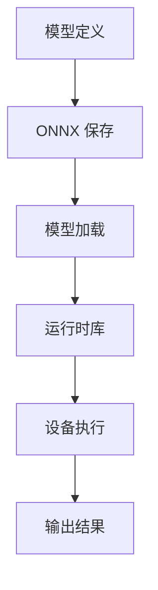

                 

关键词：ONNX Runtime、跨平台部署、AI 模型、性能优化、资源管理

> 摘要：本文将探讨 ONNX Runtime 在不同设备上运行 AI 模型的跨平台部署策略。我们将深入分析 ONNX Runtime 的核心概念与架构，详细讲解其算法原理和操作步骤，并通过实例展示如何在各种环境下实现高效的 AI 模型部署。最后，我们将展望未来 AI 跨平台部署的发展趋势与面临的挑战。

## 1. 背景介绍

随着人工智能技术的飞速发展，AI 模型的应用场景越来越广泛，从图像识别、自然语言处理到推荐系统等。然而，AI 模型的部署也面临着诸多挑战。不同设备（如 CPU、GPU、FPGA、ASIC 等）的性能和资源分配差异显著，使得同一 AI 模型在不同设备上运行的效果可能大相径庭。因此，如何实现 AI 模型在不同设备上的高效跨平台部署，成为当前研究的热点问题。

ONNX（Open Neural Network Exchange）是一个开放格式，旨在解决 AI 模型在不同框架之间转换的难题。ONNX Runtime 是 ONNX 的一个重要组成部分，它是负责在具体设备上运行 AI 模型的执行引擎。ONNX Runtime 支持多种硬件平台，包括 CPU、GPU、FPGA 等，并且不断优化以提升性能。本文将重点介绍 ONNX Runtime 的跨平台部署策略，帮助读者理解如何在不同设备上高效运行 AI 模型。

## 2. 核心概念与联系

### 2.1 ONNX Runtime 核心概念

- **ONNX**: ONNX 是一个开放格式，用于表示深度学习模型。它提供了跨框架的统一接口，使得 AI 模型可以在不同框架之间转换。

- **ONNX Runtime**: ONNX Runtime 是 ONNX 的执行引擎，负责在具体设备上运行 AI 模型。它提供了高度优化的运行时库，支持多种硬件平台。

- **运行时库**: 运行时库是 ONNX Runtime 的核心组件，负责将 ONNX 模型转换为底层代码，并在设备上执行计算。

### 2.2 ONNX Runtime 架构


ONNX Runtime 的架构可以分为以下几个层次：

- **数据层**: 负责处理数据输入和输出，包括数据预处理和后处理。

- **中间层**: 负责将 ONNX 模型转换为中间表示，并生成代码。

- **底层层**: 负责在具体设备上执行计算，包括 CPU、GPU、FPGA 等。

### 2.3 Mermaid 流程图



## 3. 核心算法原理 & 具体操作步骤

### 3.1 算法原理概述

ONNX Runtime 的核心算法原理主要包括以下几个步骤：

1. **模型转换**: 将不同框架的 AI 模型转换为 ONNX 格式。
2. **模型加载**: 加载 ONNX 模型到 ONNX Runtime。
3. **模型执行**: 在 ONNX Runtime 中执行模型计算。
4. **结果输出**: 输出模型计算结果。

### 3.2 算法步骤详解

#### 3.2.1 模型转换

模型转换是将 AI 模型从原始框架转换为 ONNX 格式的过程。这通常需要使用特定框架的转换工具，例如：

- TensorFlow: 使用 TensorFlow 的 `tf2onnx` 工具。
- PyTorch: 使用 PyTorch 的 `torch.onnx.export` 函数。

```python
import tensorflow as tf
import torch

# TensorFlow 模型转换为 ONNX
model_tf = tf.keras.Sequential([...])
model_tf.save('model_tf.onnx')

# PyTorch 模型转换为 ONNX
model_torch = torch.nn.Sequential([...])
model_torch.eval()
torch.onnx.export(model_torch, torch.zeros(1, 224, 224), 'model_torch.onnx')
```

#### 3.2.2 模型加载

模型加载是将 ONNX 模型加载到 ONNX Runtime 的过程。这可以通过 ONNX Runtime 的 API 实现：

```python
import onnxruntime as ort

# 加载 ONNX 模型
session = ort.InferenceSession('model.onnx')
```

#### 3.2.3 模型执行

模型执行是在 ONNX Runtime 中执行模型计算的过程。这可以通过以下步骤实现：

1. **输入数据准备**: 准备模型输入数据。
2. **执行计算**: 使用 ONNX Runtime 的 `run` 方法执行计算。
3. **获取结果**: 获取模型输出结果。

```python
# 输入数据准备
input_data = {"input_0": np.array([...], dtype=np.float32)}

# 执行计算
outputs = session.run(None, input_data)

# 获取结果
predictions = outputs["output_0"]
```

#### 3.2.4 结果输出

结果输出是将模型计算结果输出的过程。这可以根据具体需求进行自定义处理，例如：

- 显示预测结果。
- 保存预测结果到文件。
- 进一步处理预测结果。

```python
# 显示预测结果
print(predictions)

# 保存预测结果到文件
with open('predictions.txt', 'w') as f:
    for prediction in predictions:
        f.write(f"{prediction}\n")
```

### 3.3 算法优缺点

**优点**:

- **跨框架兼容**: ONNX 提供了跨框架的统一接口，使得不同框架的 AI 模型可以相互转换和部署。
- **高效执行**: ONNX Runtime 提供了高度优化的运行时库，可以在不同设备上高效执行 AI 模型。
- **社区支持**: ONNX 有广泛的社区支持，包括各大框架的转换工具和丰富的文档资源。

**缺点**:

- **模型转换复杂性**: ONNX 模型转换可能需要特定的工具和步骤，增加了模型部署的复杂性。
- **性能差异**: 不同设备上的性能差异可能导致 ONNX Runtime 在某些设备上的性能不如原生框架。

### 3.4 算法应用领域

ONNX Runtime 的算法应用领域广泛，包括但不限于：

- **边缘计算**: 在移动设备、嵌入式设备等资源受限的边缘设备上运行 AI 模型。
- **云计算**: 在服务器上运行大规模 AI 模型，提供高效的 AI 服务。
- **自动驾驶**: 在自动驾驶系统中实时运行 AI 模型，实现高效的车辆和环境感知。

## 4. 数学模型和公式 & 详细讲解 & 举例说明

### 4.1 数学模型构建

在 AI 模型部署过程中，涉及到的数学模型主要包括：

- **卷积神经网络 (CNN)**: 用于图像处理和识别。
- **循环神经网络 (RNN)**: 用于序列数据处理和自然语言处理。
- **生成对抗网络 (GAN)**: 用于图像生成和对抗训练。

这些数学模型的构建和推导可以参考相关领域的技术文献。

### 4.2 公式推导过程

以卷积神经网络 (CNN) 为例，其基本公式如下：

$$
\text{激活函数} = \sigma(\text{卷积}(\text{输入}, \text{滤波器}))
$$

其中，$\sigma$ 表示激活函数，通常取为 ReLU 函数；卷积操作可以表示为：

$$
\text{卷积} = \sum_{i=1}^{C}\sum_{j=1}^{H}\text{滤波器}_{ij} \cdot \text{输入}_{ij}
$$

### 4.3 案例分析与讲解

以图像分类任务为例，我们使用一个简单的 CNN 模型进行说明。该模型包括两个卷积层、两个池化层和一个全连接层。

1. **卷积层**：第一卷积层使用 32 个 3x3 的卷积核，第二卷积层使用 64 个 3x3 的卷积核。卷积核的权重和偏置初始化为随机值。

2. **激活函数**：两个卷积层均使用 ReLU 激活函数。

3. **池化层**：两个池化层分别使用 2x2 的最大池化。

4. **全连接层**：全连接层包含 128 个神经元，用于分类任务。

模型的具体实现如下：

```python
import tensorflow as tf

# 第一卷积层
conv1 = tf.keras.layers.Conv2D(32, (3, 3), activation='relu', padding='same')
# 第二卷积层
conv2 = tf.keras.layers.Conv2D(64, (3, 3), activation='relu', padding='same')
# 池化层
pool1 = tf.keras.layers.MaxPooling2D(pool_size=(2, 2))
pool2 = tf.keras.layers.MaxPooling2D(pool_size=(2, 2))
# 全连接层
dense = tf.keras.layers.Dense(128, activation='relu')
# 输出层
output = tf.keras.layers.Dense(10, activation='softmax')

model = tf.keras.Sequential([
    conv1,
    pool1,
    conv2,
    pool2,
    dense,
    output
])

model.compile(optimizer='adam', loss='categorical_crossentropy', metrics=['accuracy'])
```

## 5. 项目实践：代码实例和详细解释说明

### 5.1 开发环境搭建

1. 安装 ONNX Runtime：在 Windows、Linux 或 macOS 上安装 ONNX Runtime，具体步骤参考 [ONNX Runtime GitHub 仓库](https://github.com/microsoft/onnxruntime)。
2. 安装 Python 环境：安装 Python 3.7 或更高版本，推荐使用 [Anaconda](https://www.anaconda.com/)。
3. 安装相关库：安装 TensorFlow、PyTorch 等库，可以使用以下命令：

```bash
pip install tensorflow
pip install torch torchvision
```

### 5.2 源代码详细实现

以下是一个简单的示例，展示如何使用 ONNX Runtime 在 Python 中运行一个已转换为 ONNX 格式的 AI 模型。

```python
import numpy as np
import onnxruntime as ort

# 载入 ONNX 模型
session = ort.InferenceSession('model.onnx')

# 准备输入数据
input_data = np.random.rand(1, 224, 224, 3).astype(np.float32)

# 执行模型计算
outputs = session.run(None, {"input_0": input_data})

# 获取输出结果
predictions = outputs["output_0"]

# 打印输出结果
print(predictions)
```

### 5.3 代码解读与分析

上述代码展示了如何使用 ONNX Runtime 在 Python 中运行一个已转换为 ONNX 格式的 AI 模型。关键步骤如下：

1. **加载 ONNX 模型**：使用 `ort.InferenceSession` 加载 ONNX 模型。
2. **准备输入数据**：将输入数据转换为 ONNX Runtime 支持的数据类型和形状。
3. **执行模型计算**：使用 `session.run` 执行模型计算。
4. **获取输出结果**：从输出结果中提取模型预测结果。

### 5.4 运行结果展示

运行上述代码后，将得到一个形状为 (1, 10) 的输出数组，表示模型对输入数据的预测结果。具体结果取决于模型的训练数据和任务。

## 6. 实际应用场景

### 6.1 边缘设备部署

在边缘设备上部署 AI 模型，如智能手机、无人机、物联网设备等，可以显著提高实时性和降低延迟。ONNX Runtime 支持多种硬件平台，使得 AI 模型可以在边缘设备上高效运行。

### 6.2 云计算部署

在云计算环境中，ONNX Runtime 可以在大规模服务器集群上运行 AI 模型，提供高效的 AI 服务。例如，在电商平台中，可以使用 ONNX Runtime 实时处理用户请求，提供个性化的推荐服务。

### 6.3 自动驾驶部署

在自动驾驶系统中，ONNX Runtime 可以用于实时运行车辆和环境感知模型，实现高效的车辆控制。例如，自动驾驶汽车可以使用 ONNX Runtime 处理来自传感器的大量数据，实现精准的路径规划和避障。

## 7. 工具和资源推荐

### 7.1 学习资源推荐

- [ONNX 官方文档](https://microsoft.github.io/onnx/)
- [ONNX Runtime 官方文档](https://microsoft.github.io/onnxruntime/)
- [TensorFlow ONNX 转换工具](https://github.com/onnx/tensorflow-onnx)
- [PyTorch ONNX 转换工具](https://pytorch.org/tutorials/intermediate/export_onnx_tutorial.html)

### 7.2 开发工具推荐

- [Jupyter Notebook](https://jupyter.org/): 用于编写和运行 Python 代码。
- [Anaconda](https://www.anaconda.com/): 用于管理和安装 Python 库。
- [Visual Studio Code](https://code.visualstudio.com/): 用于编写和调试 Python 代码。

### 7.3 相关论文推荐

- "Open Neural Network Exchange: A Format for exchanged Deep Learning Models" (https://arxiv.org/abs/1806.08577)
- "ONNX Runtime: An Open-Source, Cross-Platform Inference Engine for ONNX Models" (https://arxiv.org/abs/2003.04793)

## 8. 总结：未来发展趋势与挑战

### 8.1 研究成果总结

- **跨平台兼容性**：ONNX 和 ONNX Runtime 已经在多个平台上实现了高效运行，为 AI 模型的跨平台部署提供了有力支持。
- **性能优化**：ONNX Runtime 不断优化运行时库，提高了在不同设备上的性能。
- **社区支持**：ONNX 和 ONNX Runtime 拥有广泛的社区支持，为开发者提供了丰富的工具和资源。

### 8.2 未来发展趋势

- **硬件加速**：随着硬件技术的发展，ONNX Runtime 将支持更多的硬件平台，如 FPGA、ASIC 等，实现更高效的 AI 模型部署。
- **实时性优化**：ONNX Runtime 将进一步优化运行时库，提高 AI 模型的实时性和响应速度。
- **自动化部署**：未来将出现更多自动化部署工具，简化 AI 模型的跨平台部署流程。

### 8.3 面临的挑战

- **模型转换复杂性**：不同框架之间的模型转换可能需要特定的工具和步骤，增加了模型部署的复杂性。
- **性能差异**：不同设备上的性能差异可能导致 ONNX Runtime 在某些设备上的性能不如原生框架。
- **资源管理**：在不同设备上部署 AI 模型，需要合理管理设备资源，以确保模型的运行效率。

### 8.4 研究展望

未来，ONNX Runtime 将在以下几个方面进行深入研究：

- **模型压缩与量化**：研究更有效的模型压缩和量化方法，提高 AI 模型的运行效率和资源利用率。
- **自动调优**：研究自动调优技术，根据设备性能和资源情况，自动调整模型参数，实现最佳性能。
- **跨平台协同**：研究跨平台的协同计算技术，实现多设备之间的数据共享和计算协同，提高整体性能。

## 9. 附录：常见问题与解答

### 9.1 ONNX 和 ONNX Runtime 有什么区别？

- **ONNX** 是一种开放格式，用于表示深度学习模型。它提供了跨框架的统一接口，使得 AI 模型可以在不同框架之间转换。
- **ONNX Runtime** 是 ONNX 的执行引擎，负责在具体设备上运行 AI 模型。它提供了高度优化的运行时库，支持多种硬件平台。

### 9.2 如何将 TensorFlow 模型转换为 ONNX 格式？

可以使用 TensorFlow 的 `tf2onnx` 工具将 TensorFlow 模型转换为 ONNX 格式。具体步骤如下：

1. 安装 `tf2onnx`：使用以下命令安装 `tf2onnx`：

   ```bash
   pip install tf2onnx
   ```

2. 转换模型：使用 `tf2onnx.convert` 函数将 TensorFlow 模型转换为 ONNX 格式。例如：

   ```python
   import tensorflow as tf
   import tf2onnx

   # 加载 TensorFlow 模型
   model = tf.keras.models.load_model('model.h5')

   # 转换模型
   onnx_model = tf2onnx.convert.from_keras(model, input_signature=['input_0'])
   onnx_model.save('model.onnx')
   ```

### 9.3 ONNX Runtime 在不同设备上的性能如何？

ONNX Runtime 在不同设备上的性能差异较大，取决于设备的硬件性能和 ONNX Runtime 的优化程度。通常，ONNX Runtime 在 CPU 上性能较慢，在 GPU 上性能较高。以下是不同设备上的性能参考：

- **CPU**：适用于资源受限的边缘设备，如智能手机和嵌入式设备。
- **GPU**：适用于需要高性能计算的场景，如云计算和自动驾驶。
- **FPGA**：适用于特定场景，如图像处理和视频分析。

### 9.4 ONNX Runtime 是否支持实时部署？

ONNX Runtime 支持实时部署，但具体性能取决于设备性能和模型复杂度。对于简单的模型和资源丰富的设备，ONNX Runtime 可以实现实时部署。对于复杂的模型和资源受限的设备，可能需要进一步优化模型和运行时库，以提高实时性。

