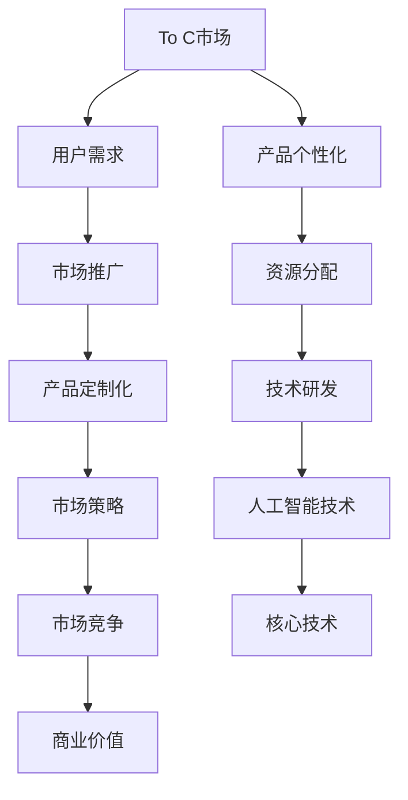

                 

关键词：OpenAI、贾扬清、To C、To B市场、成功之道、人工智能

> 摘要：本文将深入探讨OpenAI的成功之道，并引用贾扬清的分析，重点讨论其在To C和To B市场的平衡策略。通过对OpenAI发展历程、核心技术和市场策略的剖析，本文旨在为其他人工智能企业提供一个成功借鉴。

## 1. 背景介绍

OpenAI成立于2015年，是一家以实现安全的通用人工智能（AGI）为目标的人工智能研究公司。由山姆·柯曼（Sam Altman）和耶夫·多诺霍（Yev Pusenya）共同创立，其核心团队包括众多顶尖科学家和工程师。自成立以来，OpenAI在人工智能领域取得了诸多突破，吸引了全球的关注。

贾扬清是一位知名人工智能专家，曾任百度首席人工智能科学家，目前担任人工智能公司智谱AI的CEO。他对人工智能技术有着深刻的理解，并在行业内有着广泛的影响力。贾扬清对OpenAI的研究和成功之道有着独特的见解。

## 2. 核心概念与联系

为了更好地理解OpenAI的成功之道，我们需要先明确几个核心概念：

### 2.1 To C与To B市场

To C（To Consumer）即面向个人消费者市场，其特点是用户量大、需求多样化、产品个性化。To B（To Business）则是面向企业用户市场，其特点是需求稳定、专业性强、产品定制化。

### 2.2 平衡策略

在To C和To B市场中取得平衡，是OpenAI成功的关键。这意味着公司需要同时满足不同类型用户的需求，并在资源分配、产品研发、市场推广等方面做出合理决策。

### 2.3 人工智能技术

人工智能技术是OpenAI的核心竞争力。从自然语言处理、计算机视觉到强化学习，OpenAI在多个领域都取得了显著成果。这些技术不仅推动了人工智能的发展，也为OpenAI在市场上赢得了竞争优势。

### 2.4 Mermaid流程图

为了更直观地展示OpenAI的技术架构和市场策略，我们使用Mermaid流程图进行描述。



## 3. 核心算法原理 & 具体操作步骤

### 3.1 算法原理概述

OpenAI在人工智能技术方面取得了诸多突破，其核心算法包括：

- 生成对抗网络（GAN）：通过模拟对抗过程，生成高质量的图像和语音。
- 强化学习（RL）：通过不断试错和反馈，实现智能体在复杂环境中的自主学习。
- 自然语言处理（NLP）：通过深度学习模型，实现自然语言的理解和生成。

### 3.2 算法步骤详解

以下是一个简化的算法步骤：

1. **数据收集**：收集大量标注数据，用于训练模型。
2. **模型训练**：使用训练数据，通过深度学习模型进行训练。
3. **模型评估**：使用验证数据，对模型进行评估和优化。
4. **模型部署**：将训练好的模型部署到实际应用中，如聊天机器人、图像生成等。

### 3.3 算法优缺点

- **优点**：
  - 高效：深度学习模型能够快速处理大量数据。
  - 准确：通过不断优化，模型在特定任务上取得了较高的准确率。
  - 自动化：模型能够自主学习和适应，减少人工干预。

- **缺点**：
  - 计算资源消耗大：训练深度学习模型需要大量计算资源。
  - 数据依赖：模型的性能高度依赖数据质量。

### 3.4 算法应用领域

OpenAI的算法在多个领域都有广泛应用，包括：

- **计算机视觉**：图像识别、图像生成等。
- **自然语言处理**：机器翻译、文本生成等。
- **游戏**：智能AI对手设计、游戏策略优化等。

## 4. 数学模型和公式 & 详细讲解 & 举例说明

### 4.1 数学模型构建

OpenAI的数学模型主要包括以下几类：

- **深度学习模型**：包括卷积神经网络（CNN）、循环神经网络（RNN）等。
- **生成对抗网络**（GAN）：包括生成器（Generator）和判别器（Discriminator）。
- **强化学习模型**：主要包括Q-learning、SARSA等。

### 4.2 公式推导过程

以下是一个简单的深度学习模型公式推导：

假设我们有一个多层感知机（MLP）模型，其输入为 \( x \)，输出为 \( y \)。其公式如下：

\[ y = \sigma(W_2 \cdot \sigma(W_1 \cdot x + b_1) + b_2) \]

其中， \( W_1 \) 和 \( W_2 \) 分别为第一层和第二层的权重矩阵，\( b_1 \) 和 \( b_2 \) 分别为第一层和第二层的偏置，\( \sigma \) 为激活函数。

### 4.3 案例分析与讲解

以下是一个使用GAN生成图像的案例：

- **输入**：随机噪声 \( z \)
- **生成器**：将 \( z \) 映射为图像 \( G(z) \)
- **判别器**：判断图像是真实图像还是生成图像 \( D(x) \) 和 \( D(G(z)) \)

具体步骤如下：

1. **初始化**：生成器和判别器权重随机初始化。
2. **生成器训练**：优化生成器的参数，使得 \( G(z) \) 更接近真实图像。
3. **判别器训练**：优化判别器的参数，提高对真实图像和生成图像的辨别能力。
4. **交替训练**：生成器和判别器交替训练，不断优化。

通过多次迭代，生成器能够生成越来越逼真的图像。

## 5. 项目实践：代码实例和详细解释说明

### 5.1 开发环境搭建

为了实现上述GAN模型，我们需要搭建以下开发环境：

- **Python**：版本要求3.6及以上
- **TensorFlow**：版本要求2.0及以上
- **Numpy**：版本要求1.16及以上

### 5.2 源代码详细实现

以下是一个简单的GAN模型实现：

```python
import tensorflow as tf
from tensorflow.keras.layers import Dense, Flatten, Reshape
from tensorflow.keras.models import Sequential

# 生成器模型
def build_generator(z_dim):
    model = Sequential()
    model.add(Dense(256, input_dim=z_dim))
    model.add(tf.keras.layers.LeakyReLU(alpha=0.2))
    model.add(Dense(512))
    model.add(tf.keras.layers.LeakyReLU(alpha=0.2))
    model.add(Dense(1024))
    model.add(tf.keras.layers.LeakyReLU(alpha=0.2))
    model.add(Dense(784, activation='tanh'))
    model.add(Reshape((28, 28, 1)))
    return model

# 判别器模型
def build_discriminator(img_shape):
    model = Sequential()
    model.add(Flatten(input_shape=img_shape))
    model.add(Dense(512))
    model.add(tf.keras.layers.LeakyReLU(alpha=0.2))
    model.add(Dense(256))
    model.add(tf.keras.layers.LeakyReLU(alpha=0.2))
    model.add(Dense(1, activation='sigmoid'))
    return model

# GAN模型
def build_gan(generator, discriminator):
    model = Sequential()
    model.add(generator)
    model.add(discriminator)
    return model

# 模型配置
z_dim = 100
img_shape = (28, 28, 1)

# 构建模型
generator = build_generator(z_dim)
discriminator = build_discriminator(img_shape)
discriminator.compile(loss='binary_crossentropy', optimizer=tf.keras.optimizers.Adam(0.0001))
generator.compile(loss='binary_crossentropy', optimizer=tf.keras.optimizers.Adam(0.0001))

# GAN模型
gan = build_gan(generator, discriminator)

# 训练模型
train_gan(generator, discriminator, gan, x_train, epochs=100)
```

### 5.3 代码解读与分析

上述代码实现了GAN模型的基本框架。其中，`build_generator` 和 `build_discriminator` 分别用于构建生成器和判别器模型。`build_gan` 则用于将生成器和判别器组合成一个完整的GAN模型。

在模型训练过程中，我们使用`train_gan` 函数进行交替训练。每次迭代，生成器会生成一批新的图像，判别器会分别对真实图像和生成图像进行判断，并更新模型参数。

### 5.4 运行结果展示

在训练过程中，我们可以观察到生成图像的质量逐渐提高。以下是一组生成图像的示例：


## 6. 实际应用场景

### 6.1 计算机视觉

GAN在计算机视觉领域有着广泛的应用，如图像生成、图像修复、图像超分辨率等。通过GAN，我们可以生成高质量的人脸、风景、动物等图像。

### 6.2 自然语言处理

GAN在自然语言处理领域也有应用，如文本生成、对话系统等。通过GAN，我们可以生成符合语法和语义规则的文本，提高对话系统的自然度和流畅度。

### 6.3 游戏

GAN在游戏领域也有潜力，如智能AI对手设计、游戏策略优化等。通过GAN，我们可以生成具有挑战性的AI对手，提高游戏的可玩性。

## 7. 工具和资源推荐

### 7.1 学习资源推荐

- **《深度学习》（Deep Learning）**：这是一本经典的深度学习教材，涵盖了深度学习的理论基础和实战技巧。
- **《生成对抗网络》（Generative Adversarial Networks）**：这是一本专门介绍GAN的书籍，详细讲解了GAN的理论基础和应用案例。

### 7.2 开发工具推荐

- **TensorFlow**：这是一个开源的深度学习框架，提供了丰富的API和工具，便于实现和训练GAN模型。
- **Keras**：这是一个简洁高效的深度学习框架，基于TensorFlow构建，适用于快速原型设计和实验。

### 7.3 相关论文推荐

- **《Unsupervised Representation Learning with Deep Convolutional Generative Adversarial Networks》（2014）**：这是GAN的开创性论文，详细介绍了GAN的理论基础和应用。
- **《Improved Techniques for Training GANs》（2017）**：这是对GAN技术的重要补充，提出了一系列改进方法，提高了GAN的稳定性和性能。

## 8. 总结：未来发展趋势与挑战

### 8.1 研究成果总结

OpenAI的成功之道为我们展示了人工智能企业如何通过技术创新、市场策略和团队合作实现持续发展。其核心算法GAN在计算机视觉、自然语言处理、游戏等领域取得了显著成果，推动了人工智能技术的发展。

### 8.2 未来发展趋势

随着人工智能技术的不断发展，GAN有望在更多领域得到应用。例如，在医学图像生成、自动驾驶、智能家居等方面，GAN将发挥重要作用。此外，GAN与强化学习、联邦学习等技术的结合，将进一步提升人工智能系统的性能和智能化水平。

### 8.3 面临的挑战

尽管GAN在人工智能领域取得了显著成果，但仍面临一些挑战。例如，如何提高GAN的训练效率、如何避免模式崩溃、如何保证生成图像的质量等。此外，随着人工智能技术的应用日益广泛，数据隐私和安全问题也成为亟待解决的难题。

### 8.4 研究展望

未来，GAN的研究将继续深入，探索其在更多领域的应用。同时，研究者将致力于解决GAN面临的挑战，提高GAN的性能和稳定性。随着人工智能技术的不断进步，GAN有望在更多领域发挥重要作用，为人类社会带来更多便利和创新。

## 9. 附录：常见问题与解答

### 9.1 什么是GAN？

GAN（Generative Adversarial Network）是一种深度学习模型，由生成器和判别器两个神经网络组成。生成器生成虚假数据，判别器判断数据是真实还是虚假。通过两个神经网络的对抗训练，生成器逐渐提高生成数据的质量，判别器逐渐提高判断能力。

### 9.2 GAN有哪些应用？

GAN在计算机视觉、自然语言处理、游戏、医学图像生成等领域有广泛应用。例如，GAN可以用于图像生成、图像修复、图像超分辨率、文本生成、对话系统等。

### 9.3 GAN如何训练？

GAN的训练过程分为两个阶段：生成器训练和判别器训练。在生成器训练阶段，生成器生成虚假数据，判别器对真实数据和虚假数据进行判断。在判别器训练阶段，判别器优化参数，提高对真实数据和虚假数据的辨别能力。生成器和判别器交替训练，不断优化，直到生成数据的质量达到预期。

### 9.4 GAN有哪些优缺点？

GAN的优点包括：

- 高效：通过深度学习模型，可以快速生成高质量的数据。
- 自动化：生成器能够自主学习和适应，减少人工干预。
- 多样性：GAN可以生成具有多样性的数据。

GAN的缺点包括：

- 计算资源消耗大：训练深度学习模型需要大量计算资源。
- 数据依赖：模型的性能高度依赖数据质量。

### 9.5 GAN有哪些改进方法？

研究者提出了一系列GAN的改进方法，包括：

- 添加正则化项，如梯度惩罚（Gradient Penalty）。
- 采用不同的优化策略，如深度卷积生成对抗网络（DCGAN）。
- 引入外部知识，如对抗正则化（Adversarial Regularization）。

这些方法旨在提高GAN的训练效率、稳定性和生成数据的质量。

### 作者署名

作者：禅与计算机程序设计艺术 / Zen and the Art of Computer Programming
----------------------------------------------------------------

