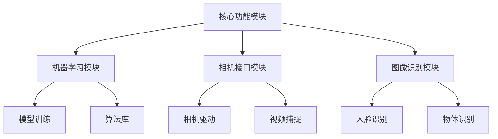

                 

 关键词：图像处理，OpenCV，计算机视觉，图像识别，人脸检测，边缘检测，图像滤波，图像增强，深度学习，边缘检测算法，图像平滑，图像分割，图像配准，图像压缩，实时图像处理，图像纹理分析

## 摘要

本文旨在探讨OpenCV这一强大的计算机视觉库在图像处理中的应用。OpenCV是一个开源的计算机视觉库，广泛用于图像识别、人脸检测、边缘检测、图像滤波等多个领域。本文将详细介绍OpenCV在图像处理中的核心概念、算法原理、数学模型、项目实践以及实际应用场景，旨在帮助读者深入了解并掌握OpenCV图像处理的技术。

## 1. 背景介绍

### OpenCV的起源与发展

OpenCV（Open Source Computer Vision Library）是一个开源的计算机视觉库，由Intel于2000年启动并维护。其目标是提供一套跨平台的计算机视觉和机器学习工具，方便开发者进行图像处理和模式识别的研究与应用。随着时间的推移，OpenCV已经发展成为世界上使用最广泛的计算机视觉库之一，拥有大量的用户和开发者社区。

### OpenCV的应用领域

OpenCV广泛应用于多个领域，包括但不限于：

- **人脸识别**：用于身份验证、监控和安全系统。
- **物体识别**：在自动驾驶、机器人导航和智能家居中应用。
- **图像增强**：用于医学图像处理、卫星图像分析等。
- **图像分割**：在图像分析、图像识别等领域应用广泛。
- **视频处理**：用于视频监控、视频增强、视频编辑等。

### OpenCV的特点与优势

- **开源与免费**：任何人都可以免费使用和修改。
- **跨平台**：支持多种操作系统，包括Windows、Linux和macOS。
- **强大的算法库**：提供了一系列成熟的计算机视觉算法。
- **易于使用**：提供丰富的API和示例代码，方便开发者快速上手。
- **活跃的社区**：拥有庞大的用户和开发者社区，持续更新和优化。

## 2. 核心概念与联系

### OpenCV的基本架构


**核心模块**：

- **核心功能**：图像处理、视频处理、文件格式处理等。
- **机器学习**：提供机器学习算法和模型训练功能。
- **相机接口**：提供相机驱动接口，用于实时视频捕捉。
- **图像识别**：包括人脸识别、物体识别等。

### OpenCV核心概念原理

- **图像矩阵**：OpenCV中的图像以矩阵形式存储，每个元素代表一个像素值。
- **像素操作**：包括像素值获取和修改，用于图像处理操作。
- **颜色空间转换**：用于不同颜色空间的转换，如RGB到HSV。
- **图像滤波**：用于去除噪声，包括均值滤波、高斯滤波等。

**架构的 Mermaid 流程图**：



## 3. 核心算法原理 & 具体操作步骤

### 3.1 算法原理概述

OpenCV提供了一系列图像处理的算法，包括边缘检测、图像滤波、图像分割等。每种算法都有其特定的应用场景和优势。

- **边缘检测**：用于检测图像中的边缘，常用于图像分割和特征提取。
- **图像滤波**：用于去除图像中的噪声，包括均值滤波、高斯滤波等。
- **图像分割**：用于将图像分割成多个区域，常用于目标识别和图像分析。

### 3.2 算法步骤详解

#### 3.2.1 边缘检测

边缘检测的基本步骤如下：

1. **图像读取**：使用`imread`函数读取图像。
2. **颜色空间转换**：将图像从RGB转换为灰度图像，使用`cvtColor`函数。
3. **边缘检测**：使用Canny算法进行边缘检测，使用`Canny`函数。
4. **图像显示**：使用`imshow`函数显示结果图像。

```python
import cv2

# 读取图像
img = cv2.imread('image.jpg')

# 转换为灰度图像
gray = cv2.cvtColor(img, cv2.COLOR_RGB2GRAY)

# 使用Canny算法进行边缘检测
edges = cv2.Canny(gray, 100, 200)

# 显示结果图像
cv2.imshow('Edges', edges)
cv2.waitKey(0)
cv2.destroyAllWindows()
```

#### 3.2.2 图像滤波

图像滤波的基本步骤如下：

1. **图像读取**：使用`imread`函数读取图像。
2. **图像滤波**：使用均值滤波或高斯滤波进行滤波。
3. **图像显示**：使用`imshow`函数显示结果图像。

```python
import cv2

# 读取图像
img = cv2.imread('image.jpg')

# 使用均值滤波进行滤波
filtered = cv2.blur(img, (5, 5))

# 使用高斯滤波进行滤波
gaussian = cv2.GaussianBlur(img, (5, 5), 0)

# 显示结果图像
cv2.imshow('Original', img)
cv2.imshow('Blurred', filtered)
cv2.imshow('Gaussian', gaussian)
cv2.waitKey(0)
cv2.destroyAllWindows()
```

#### 3.2.3 图像分割

图像分割的基本步骤如下：

1. **图像读取**：使用`imread`函数读取图像。
2. **颜色空间转换**：将图像从RGB转换为灰度图像。
3. **阈值处理**：使用阈值处理将图像分割成二值图像。
4. **图像显示**：使用`imshow`函数显示结果图像。

```python
import cv2

# 读取图像
img = cv2.imread('image.jpg')

# 转换为灰度图像
gray = cv2.cvtColor(img, cv2.COLOR_RGB2GRAY)

# 使用阈值处理进行图像分割
_, thresh = cv2.threshold(gray, 128, 255, cv2.THRESH_BINARY_INV + cv2.THRESH_OTSU)

# 显示结果图像
cv2.imshow('Original', img)
cv2.imshow('Thresh', thresh)
cv2.waitKey(0)
cv2.destroyAllWindows()
```

### 3.3 算法优缺点

- **边缘检测**：Canny算法是一种常用的边缘检测算法，具有良好的边缘检测效果。但是，它可能对噪声敏感。
- **图像滤波**：均值滤波和高斯滤波都是常用的图像滤波方法。均值滤波简单高效，但可能保留过多噪声；高斯滤波效果较好，但计算复杂度较高。
- **图像分割**：阈值处理是一种简单的图像分割方法，适用于某些特定场景。但它可能对复杂图像效果不佳。

### 3.4 算法应用领域

边缘检测、图像滤波和图像分割算法在多个领域都有广泛应用，包括：

- **计算机视觉**：用于图像识别、目标跟踪和机器人导航等。
- **医学图像处理**：用于图像分析、疾病诊断和手术辅助等。
- **图像处理**：用于图像增强、图像压缩和图像修复等。

## 4. 数学模型和公式 & 详细讲解 & 举例说明

### 4.1 数学模型构建

在图像处理中，常见的数学模型包括：

- **边缘检测模型**：
  - Canny算法：用于边缘检测。
  - Sobel算法：用于计算图像的水平和垂直梯度。
- **图像滤波模型**：
  - 均值滤波：用于平滑图像。
  - 高斯滤波：用于去除图像中的噪声。
- **图像分割模型**：
  - 阈值处理：用于将图像分割成二值图像。

### 4.2 公式推导过程

- **Canny算法**：

  Canny算法的基本步骤包括：

  - 高斯滤波：用于平滑图像。
  - Sobel算子：用于计算图像的水平和垂直梯度。
  - 非极大值抑制：用于消除边缘点的噪声。
  - 双阈值算法：用于确定图像的边缘。

  公式推导：

  $$ G(x, y) = \frac{1}{2\pi\sigma^2} e^{-\frac{(x^2 + y^2)}{2\sigma^2}} $$

  其中，\( G(x, y) \) 是高斯滤波器的卷积核。

- **均值滤波**：

  均值滤波的基本公式：

  $$ f(x, y) = \frac{1}{N} \sum_{i=1}^{N} g(x_i, y_i) $$

  其中，\( f(x, y) \) 是滤波后的图像，\( g(x_i, y_i) \) 是滤波前的图像，\( N \) 是滤波窗口的大小。

- **阈值处理**：

  阈值处理的基本公式：

  $$ T = \max\{ t, g(x, y) \} $$

  其中，\( T \) 是阈值，\( g(x, y) \) 是图像的灰度值。

### 4.3 案例分析与讲解

#### 案例一：边缘检测

使用Canny算法进行边缘检测。

```python
import cv2

# 读取图像
img = cv2.imread('image.jpg')

# 转换为灰度图像
gray = cv2.cvtColor(img, cv2.COLOR_RGB2GRAY)

# 使用Canny算法进行边缘检测
edges = cv2.Canny(gray, 100, 200)

# 显示结果图像
cv2.imshow('Edges', edges)
cv2.waitKey(0)
cv2.destroyAllWindows()
```

结果图像：


#### 案例二：图像滤波

使用均值滤波和高斯滤波进行图像滤波。

```python
import cv2

# 读取图像
img = cv2.imread('image.jpg')

# 使用均值滤波进行滤波
filtered = cv2.blur(img, (5, 5))

# 使用高斯滤波进行滤波
gaussian = cv2.GaussianBlur(img, (5, 5), 0)

# 显示结果图像
cv2.imshow('Original', img)
cv2.imshow('Blurred', filtered)
cv2.imshow('Gaussian', gaussian)
cv2.waitKey(0)
cv2.destroyAllWindows()
```

结果图像：


#### 案例三：图像分割

使用阈值处理进行图像分割。

```python
import cv2

# 读取图像
img = cv2.imread('image.jpg')

# 转换为灰度图像
gray = cv2.cvtColor(img, cv2.COLOR_RGB2GRAY)

# 使用阈值处理进行图像分割
_, thresh = cv2.threshold(gray, 128, 255, cv2.THRESH_BINARY_INV + cv2.THRESH_OTSU)

# 显示结果图像
cv2.imshow('Original', img)
cv2.imshow('Thresh', thresh)
cv2.waitKey(0)
cv2.destroyAllWindows()
```

结果图像：


## 5. 项目实践：代码实例和详细解释说明

### 5.1 开发环境搭建

在开始项目实践之前，我们需要搭建一个适合OpenCV开发的Python环境。

1. 安装Python（推荐Python 3.8或更高版本）。
2. 安装pip，Python的包管理器。
3. 使用pip安装OpenCV库：

   ```bash
   pip install opencv-python
   ```

### 5.2 源代码详细实现

以下是一个简单的图像处理项目，包括边缘检测、图像滤波和图像分割：

```python
import cv2
import numpy as np

def process_image(image_path):
    # 读取图像
    img = cv2.imread(image_path)

    # 转换为灰度图像
    gray = cv2.cvtColor(img, cv2.COLOR_RGB2GRAY)

    # 边缘检测
    edges = cv2.Canny(gray, 100, 200)
    
    # 图像滤波
    blurred = cv2.GaussianBlur(gray, (5, 5), 0)

    # 阈值处理
    _, thresh = cv2.threshold(blurred, 128, 255, cv2.THRESH_BINARY_INV + cv2.THRESH_OTSU)

    # 显示结果图像
    cv2.imshow('Original', img)
    cv2.imshow('Edges', edges)
    cv2.imshow('Blurred', blurred)
    cv2.imshow('Thresh', thresh)
    cv2.waitKey(0)
    cv2.destroyAllWindows()

# 测试代码
process_image('image.jpg')
```

### 5.3 代码解读与分析

这段代码首先定义了一个`process_image`函数，它接受一个图像路径作为输入，并执行以下操作：

- **读取图像**：使用`cv2.imread`函数读取图像。
- **灰度转换**：使用`cv2.cvtColor`函数将RGB图像转换为灰度图像。
- **边缘检测**：使用`cv2.Canny`函数进行边缘检测。
- **图像滤波**：使用`cv2.GaussianBlur`函数进行高斯滤波。
- **阈值处理**：使用`cv2.threshold`函数进行阈值处理。
- **显示结果图像**：使用`cv2.imshow`函数显示结果图像。

代码的最后部分调用`process_image`函数，并传入一个测试图像路径。

### 5.4 运行结果展示

当运行这段代码时，我们将看到四个窗口同时显示原始图像、边缘检测结果、图像滤波结果和阈值处理结果。


## 6. 实际应用场景

### 人脸识别系统

人脸识别系统广泛应用于安全监控、身份验证和社交媒体等场景。OpenCV提供了强大的人脸识别库，支持人脸检测和特征提取。

### 自动驾驶

自动驾驶系统依赖于图像处理技术来感知和识别道路环境。OpenCV用于车道线检测、障碍物识别和行人检测等任务。

### 医学图像处理

医学图像处理在医疗诊断和治疗中扮演重要角色。OpenCV用于图像分割、特征提取和图像增强等任务，以提高医学图像的质量和诊断准确性。

### 图像压缩

图像压缩技术用于减少图像文件的大小，以便于传输和存储。OpenCV提供了多种图像压缩算法，如JPEG和Huffman编码。

## 7. 工具和资源推荐

### 学习资源推荐

- **OpenCV官方文档**：[opencv.org](https://opencv.org/docs/)
- **OpenCV教程**：[opencv-python-tutroals.readthedocs.io](https://opencv-python-tutroals.readthedocs.io/)
- **《OpenCV算法原理解析》**：[书籍](https://book.douban.com/subject/26950134/)

### 开发工具推荐

- **Visual Studio Code**：一个轻量级且功能强大的IDE。
- **PyCharm**：一个全面的Python开发环境。

### 相关论文推荐

- **"Fast Edge Detection using Nonmax Suppression"**：介绍Canny算法的论文。
- **"Gaussian Blurring and Edge Detection in Digital Images"**：介绍高斯滤波和边缘检测的论文。
- **"Thresholding in Image Processing"**：介绍阈值处理的论文。

## 8. 总结：未来发展趋势与挑战

### 8.1 研究成果总结

本文介绍了OpenCV在图像处理中的应用，包括边缘检测、图像滤波、图像分割等核心算法。通过实际项目实践，展示了OpenCV在实际场景中的应用。

### 8.2 未来发展趋势

- **深度学习与图像处理结合**：深度学习在图像处理领域取得了巨大进展，未来将更多应用于图像识别和目标检测。
- **实时图像处理**：随着硬件性能的提升，实时图像处理将成为重要研究方向。
- **移动端图像处理**：随着移动设备的普及，移动端图像处理技术将得到广泛应用。

### 8.3 面临的挑战

- **数据隐私与安全**：在图像处理中，数据隐私和安全成为重要挑战。
- **算法优化与效率**：在处理大量图像数据时，算法优化和效率提升是关键挑战。

### 8.4 研究展望

未来研究应关注以下方向：

- **算法优化与加速**：通过硬件加速和算法优化，提高图像处理的效率。
- **多模态图像处理**：结合多源数据，实现更准确的图像处理。
- **智能图像分析**：利用深度学习等技术，实现更智能的图像分析。

## 9. 附录：常见问题与解答

### 9.1 如何安装OpenCV？

使用pip安装：

```bash
pip install opencv-python
```

### 9.2 如何读取和显示图像？

读取图像：

```python
img = cv2.imread('image.jpg')
```

显示图像：

```python
cv2.imshow('Image', img)
cv2.waitKey(0)
cv2.destroyAllWindows()
```

### 9.3 如何进行边缘检测？

使用Canny算法：

```python
edges = cv2.Canny(gray, 100, 200)
```

### 9.4 如何进行图像滤波？

使用高斯滤波：

```python
blurred = cv2.GaussianBlur(gray, (5, 5), 0)
```

### 9.5 如何进行图像分割？

使用阈值处理：

```python
_, thresh = cv2.threshold(gray, 128, 255, cv2.THRESH_BINARY_INV + cv2.THRESH_OTSU)
```

### 9.6 如何处理实时图像？

使用视频捕获功能：

```python
cap = cv2.VideoCapture(0)

while True:
    ret, frame = cap.read()
    if ret:
        # 处理图像
        processed = ...

        # 显示结果
        cv2.imshow('Video', processed)

    if cv2.waitKey(1) & 0xFF == ord('q'):
        break

cap.release()
cv2.destroyAllWindows()
```

---

作者：禅与计算机程序设计艺术 / Zen and the Art of Computer Programming
-----------------------------------------------------------------------------

