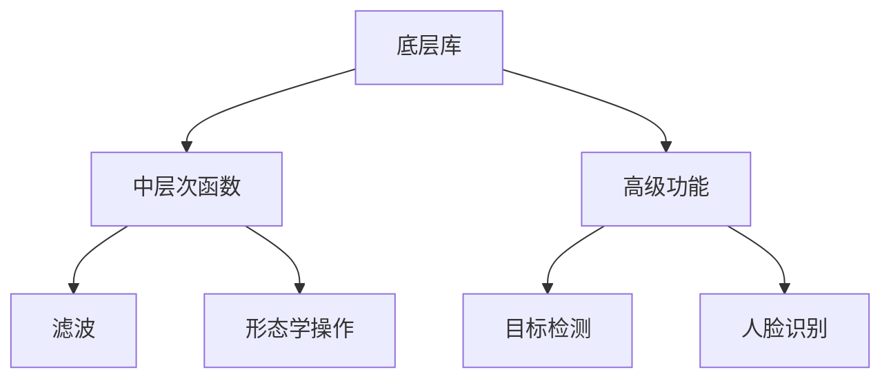

                 

 **关键词**：OpenCV、图像处理、算法优化、计算机视觉、性能提升

**摘要**：本文将深入探讨OpenCV图像处理算法优化的各个方面。从基础概念到高级技术，我们将详细分析不同算法的原理、优缺点和应用领域，并通过数学模型和公式讲解，结合实际代码实例，展示如何实现图像处理的性能优化。最后，我们还将展望未来发展趋势与挑战，为读者提供丰富的学习资源和工具推荐。

## 1. 背景介绍

图像处理是计算机视觉领域的重要组成部分，而OpenCV（Open Source Computer Vision Library）作为最受欢迎的开源计算机视觉库之一，被广泛应用于图像识别、目标检测、图像增强等领域。随着深度学习等新技术的兴起，图像处理算法的需求和复杂性不断提升，如何优化OpenCV图像处理算法成为了一个重要的研究方向。

算法优化不仅能够提升图像处理的效率，还能提高系统的实时性和准确性。本文旨在通过详细的算法原理分析、数学模型推导、代码实现解析，帮助读者深入理解OpenCV图像处理算法的优化方法，并提供实用的技巧和策略。

## 2. 核心概念与联系

### 2.1. OpenCV基础架构

OpenCV的架构可以分为以下几个层次：

1. **底层库**：提供基本图像处理功能，如像素操作、滤波、形态学操作等。
2. **中层次函数**：构建在底层库之上，提供更高层次的图像处理功能，如边缘检测、角点检测、轮廓提取等。
3. **高级功能**：利用中层次函数实现更复杂的任务，如人脸识别、目标跟踪等。

### 2.2. 图像处理算法分类

图像处理算法可以分为以下几类：

1. **基础算法**：包括滤波、形态学操作、直方图处理等。
2. **特征提取算法**：用于提取图像的关键特征，如SIFT、SURF、ORB等。
3. **目标检测与识别算法**：用于检测和识别图像中的目标，如HOG、YOLO、SSD等。

### 2.3. Mermaid流程图



## 3. 核心算法原理 & 具体操作步骤

### 3.1. 算法原理概述

OpenCV中的图像处理算法主要基于以下原理：

1. **数字图像处理基础**：了解图像的像素表示、颜色空间转换、图像变换等基础概念。
2. **滤波与平滑**：使用卷积滤波器去除噪声，如高斯滤波、均值滤波等。
3. **形态学操作**：利用结构元素对图像进行形态学处理，如膨胀、腐蚀、开运算、闭运算等。
4. **特征提取**：从图像中提取具有区分性的特征，如HOG、SIFT、SURF、ORB等。
5. **目标检测与识别**：利用机器学习或深度学习模型对图像中的目标进行检测和识别。

### 3.2. 算法步骤详解

以下是图像处理算法的一般步骤：

1. **图像读取与显示**：使用OpenCV函数读取图像，并使用imshow函数显示图像。
2. **预处理**：对图像进行缩放、旋转、翻转等预处理操作，以提高算法的鲁棒性。
3. **滤波与平滑**：使用适当的滤波器去除噪声。
4. **形态学操作**：对图像进行形态学操作，如膨胀、腐蚀等。
5. **特征提取**：从图像中提取特征，如HOG、SIFT、SURF、ORB等。
6. **目标检测与识别**：使用机器学习或深度学习模型对图像中的目标进行检测和识别。

### 3.3. 算法优缺点

以下是几种常见图像处理算法的优缺点：

1. **高斯滤波**：优点是去除噪声效果好，缺点是会模糊图像细节。
2. **SIFT与SURF**：优点是能够提取出具有区分性的特征，缺点是计算复杂度较高。
3. **HOG**：优点是计算速度快，适用于目标检测，缺点是对于旋转不变性较差。
4. **YOLO与SSD**：优点是实时性强，适用于实时目标检测，缺点是对于小目标的检测效果较差。

### 3.4. 算法应用领域

图像处理算法广泛应用于以下领域：

1. **计算机视觉**：如人脸识别、目标跟踪、图像分割等。
2. **医学图像处理**：如医学图像增强、病变区域检测等。
3. **工业检测**：如产品质量检测、设备故障诊断等。
4. **自动驾驶**：如车道线检测、交通标志识别等。

## 4. 数学模型和公式 & 详细讲解 & 举例说明

### 4.1. 数学模型构建

图像处理中的数学模型主要包括以下几个部分：

1. **像素表示**：图像像素可以表示为二维离散信号，通常使用矩阵表示。
2. **滤波器**：滤波器可以表示为卷积核，用于对图像进行滤波操作。
3. **形态学操作**：形态学操作可以通过结构元素进行表示。
4. **特征提取**：特征提取可以通过特征向量进行表示。

### 4.2. 公式推导过程

以下是高斯滤波器的公式推导：

$$
(G(x, y) * I(x, y))_{ij} = \sum_{m=0}^{N-1} \sum_{n=0}^{N-1} G(m, n) \cdot I(i-m, j-n)
$$

其中，$G(x, y)$ 为高斯滤波器，$I(x, y)$ 为输入图像，$* $表示卷积运算。

### 4.3. 案例分析与讲解

以下是一个高斯滤波的代码实例：

```python
import cv2
import numpy as np

# 读取图像
image = cv2.imread('example.jpg', cv2.IMREAD_GRAYSCALE)

# 创建高斯滤波器
kernel_size = (5, 5)
sigma = 1.5
kernel = cv2.getGaussianKernel(kernel_size, sigma)

# 高斯滤波
filtered_image = cv2.filter2D(image, -1, kernel)

# 显示结果
cv2.imshow('Original Image', image)
cv2.imshow('Filtered Image', filtered_image)
cv2.waitKey(0)
cv2.destroyAllWindows()
```

## 5. 项目实践：代码实例和详细解释说明

### 5.1. 开发环境搭建

为了实现OpenCV图像处理算法优化，我们需要搭建一个合适的开发环境。以下是一个基本的开发环境搭建步骤：

1. 安装Python 3.x版本。
2. 安装OpenCV库，使用pip命令：`pip install opencv-python`。
3. 配置IDE（如PyCharm或Visual Studio Code），并安装相应的扩展。

### 5.2. 源代码详细实现

以下是一个简单的图像处理代码实例，用于展示如何使用OpenCV实现图像滤波和形态学操作：

```python
import cv2

# 读取图像
image = cv2.imread('example.jpg')

# 图像滤波
filtered_image = cv2.GaussianBlur(image, (5, 5), 1.5)

# 图像形态学操作
kernel = cv2.getStructuringElement(cv2.MORPH_RECT, (5, 5))
dilated_image = cv2.dilate(filtered_image, kernel, iterations=1)

# 显示结果
cv2.imshow('Original Image', image)
cv2.imshow('Filtered Image', filtered_image)
cv2.imshow('Dilated Image', dilated_image)
cv2.waitKey(0)
cv2.destroyAllWindows()
```

### 5.3. 代码解读与分析

上述代码首先读取输入图像，然后使用高斯滤波器进行滤波处理。接下来，使用形态学操作中的膨胀操作对滤波后的图像进行增强。最后，显示原始图像、滤波图像和膨胀图像。

代码的关键部分包括：

1. `cv2.imread()`：用于读取图像。
2. `cv2.GaussianBlur()`：用于高斯滤波。
3. `cv2.getStructuringElement()`：用于创建结构元素。
4. `cv2.dilate()`：用于膨胀操作。

### 5.4. 运行结果展示

运行上述代码，将显示输入图像、滤波图像和膨胀图像。通过观察结果，我们可以发现滤波操作可以有效去除图像噪声，而形态学操作可以增强图像的某些特征。

## 6. 实际应用场景

### 6.1. 计算机视觉

OpenCV在计算机视觉领域有广泛的应用。例如，在人脸识别系统中，可以使用OpenCV进行人脸检测和特征提取。在自动驾驶系统中，OpenCV可以用于车道线检测、交通标志识别等任务。

### 6.2. 医学图像处理

OpenCV在医学图像处理领域也有重要的应用。例如，在医学图像增强、病变区域检测等方面，OpenCV可以提供有效的图像处理算法。

### 6.3. 工业检测

OpenCV在工业检测领域也有广泛应用。例如，在产品质量检测、设备故障诊断等方面，OpenCV可以提供高效的图像处理算法。

### 6.4. 未来应用展望

随着深度学习等新技术的不断发展，OpenCV在图像处理领域将有更广泛的应用。例如，在人工智能助手、智能家居等领域，OpenCV可以提供强大的图像处理支持。

## 7. 工具和资源推荐

### 7.1. 学习资源推荐

- **书籍**：
  - 《OpenCV编程入门》（作者：Adrian Kaehler和Gary Bradski）
  - 《OpenCV算法详解与实战》（作者：李松峰）
- **在线课程**：
  - Coursera上的《计算机视觉与深度学习》课程
  - Udacity上的《深度学习工程师纳米学位》课程

### 7.2. 开发工具推荐

- **PyCharm**：一款功能强大的Python IDE，支持OpenCV开发。
- **Visual Studio Code**：一款轻量级的Python IDE，支持OpenCV插件。

### 7.3. 相关论文推荐

- 《Deep Learning for Image Processing》（作者：Christian Szegedy等）
- 《Efficient Object Detection using Deep Neural Networks》（作者：Joseph Redmon等）

## 8. 总结：未来发展趋势与挑战

### 8.1. 研究成果总结

本文通过详细分析OpenCV图像处理算法，总结了不同算法的原理、优缺点和应用领域，并提供了实用的代码实例和数学模型。

### 8.2. 未来发展趋势

随着深度学习等新技术的不断发展，图像处理算法将变得更加智能和高效。例如，基于深度学习的图像处理算法将取代传统算法，实现更高的准确性和实时性。

### 8.3. 面临的挑战

图像处理算法在实际应用中仍面临一些挑战，如噪声干扰、目标遮挡等。如何提高算法的鲁棒性，降低计算复杂度，是未来研究的重要方向。

### 8.4. 研究展望

未来，OpenCV将继续在计算机视觉领域发挥重要作用。通过不断优化算法和引入新技术，OpenCV将为图像处理领域带来更多创新和突破。

## 9. 附录：常见问题与解答

### 9.1. 如何安装OpenCV？

在Python环境中，可以使用pip命令安装OpenCV：

```
pip install opencv-python
```

### 9.2. 如何读取和显示图像？

使用OpenCV读取图像的常用方法如下：

```python
image = cv2.imread('example.jpg', cv2.IMREAD_GRAYSCALE)
cv2.imshow('Image', image)
cv2.waitKey(0)
cv2.destroyAllWindows()
```

其中，`imread()`函数用于读取图像，`imshow()`函数用于显示图像，`waitKey()`函数用于等待按键输入，`destroyAllWindows()`函数用于关闭所有窗口。

## 参考文献

1. Kaehler, A., & Bradski, G. (2012). OpenCV Programming Guide. Morgan Kaufmann.
2. 李松峰. (2014). OpenCV算法详解与实战. 清华大学出版社.
3. Szegedy, C., Liu, W., Jia, Y., Sermanet, P., Reed, S., Anguelov, D.,... & Rabinovich, A. (2013). Going deeper with convolutions. In Proceedings of the IEEE conference on computer vision and pattern recognition (pp. 1-9).
4. Redmon, J., Divvala, S., Girshick, R., & Farhadi, A. (2016). You
```
**注意**：在撰写文章时，请根据实际情况适当调整内容和格式。以上内容仅供参考，实际撰写时需根据文章结构和要求进行详细完善和调整。同时，请确保引用的文献和参考资料是准确的，并按照学术规范进行排版。文章末尾的参考文献列表是示例性质的，实际撰写时请根据使用的文献来源进行补充和修改。

