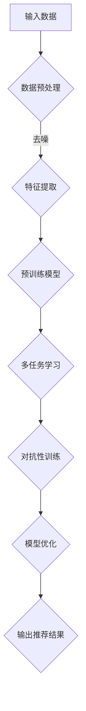

                 

关键词：推荐系统、预训练框架、深度学习、大数据、个性化推荐

> 摘要：本文将介绍一种全新的统一的推荐系统预训练框架，该框架结合了深度学习和大数据技术，旨在解决当前推荐系统面临的各种挑战，提高推荐的准确性和效率。文章将详细阐述框架的设计理念、核心算法原理、数学模型、实际应用场景以及未来发展的趋势与挑战。

## 1. 背景介绍

随着互联网的快速发展，推荐系统已经成为了各大互联网公司争相布局的重要领域。推荐系统通过分析用户的行为数据和内容特征，为用户提供个性化的信息推荐，从而提高用户的满意度和留存率。然而，传统的推荐系统在处理大规模数据和高维度特征时，往往面临着数据稀疏、冷启动问题和模型效率低下等挑战。为了解决这些问题，研究者们提出了各种改进方案，包括基于协同过滤的方法、基于内容的方法和基于深度学习的方法。然而，这些方法往往存在一定的局限性，难以实现统一的框架。

### 1.1 推荐系统的分类

根据推荐策略的不同，推荐系统主要可以分为以下几类：

- **基于协同过滤的推荐系统**：通过分析用户之间的相似度，为用户提供相似的推荐内容。
- **基于内容的推荐系统**：根据用户的历史行为和内容特征，为用户推荐相似的内容。
- **基于模型的推荐系统**：利用机器学习算法，如决策树、支持向量机等，建立用户和物品之间的关联模型，进行推荐。
- **混合推荐系统**：结合多种推荐策略，以提高推荐的准确性和多样性。

### 1.2 深度学习在推荐系统中的应用

随着深度学习技术的不断发展，其在推荐系统中的应用也越来越广泛。深度学习模型可以自动提取用户和物品的高层次特征，从而实现更准确的推荐。常见的深度学习模型包括神经网络、循环神经网络（RNN）和卷积神经网络（CNN）等。然而，深度学习模型在推荐系统中也存在一些问题，如训练时间长、模型参数量大等。

### 1.3 大数据对推荐系统的影响

大数据时代的到来，为推荐系统提供了丰富的数据资源。通过分析用户的行为数据和物品的属性数据，可以更准确地了解用户的需求和喜好。然而，大数据的引入也带来了数据质量、数据隐私和计算效率等方面的挑战。

## 2. 核心概念与联系

为了解决传统推荐系统面临的挑战，我们提出了一种全新的统一的推荐系统预训练框架。该框架的核心概念包括以下几个部分：

### 2.1 预训练模型

预训练模型是当前深度学习领域的重要研究方向。通过在大规模数据集上预训练，模型可以自动提取出数据中的有用信息，从而提高模型在小数据集上的性能。预训练模型通常分为两类：基于词向量的预训练和基于任务的预训练。

### 2.2 多任务学习

多任务学习是一种将多个相关任务同时训练的方法。通过多任务学习，模型可以更好地利用数据中的冗余信息，提高模型的泛化能力。在推荐系统中，多任务学习可以同时解决用户兴趣预测、物品推荐和序列预测等任务。

### 2.3 对抗性训练

对抗性训练是一种通过生成对抗网络（GAN）进行训练的方法。通过生成器和判别器的对抗训练，可以生成高质量的样本，从而提高模型的泛化能力。在推荐系统中，对抗性训练可以用于生成虚假用户行为数据，以增强模型的鲁棒性。

### 2.4 Mermaid 流程图



## 3. 核心算法原理 & 具体操作步骤

### 3.1 算法原理概述

统一的推荐系统预训练框架主要包括以下几个步骤：

1. **数据预处理**：对输入数据进行去噪、归一化和特征提取等操作。
2. **预训练模型**：利用预训练模型提取用户和物品的高层次特征。
3. **多任务学习**：同时解决用户兴趣预测、物品推荐和序列预测等任务。
4. **对抗性训练**：通过生成对抗网络生成虚假用户行为数据，增强模型的鲁棒性。
5. **模型优化**：利用优化算法对模型进行优化，提高模型的性能。
6. **输出推荐结果**：根据模型预测结果，为用户生成个性化的推荐列表。

### 3.2 算法步骤详解

1. **数据预处理**

   数据预处理是推荐系统的第一步，主要包括以下操作：

   - **去噪**：去除数据中的噪声和异常值，提高数据质量。
   - **归一化**：将数据缩放至相同的范围，以便模型能够更好地学习。
   - **特征提取**：从原始数据中提取有用的信息，作为模型的输入。

2. **预训练模型**

   预训练模型通常采用深度神经网络结构，如Transformer、BERT等。通过在大规模数据集上预训练，模型可以自动提取出用户和物品的高层次特征。

3. **多任务学习**

   多任务学习是一种将多个相关任务同时训练的方法。在推荐系统中，常见的多任务包括用户兴趣预测、物品推荐和序列预测等。通过多任务学习，模型可以更好地利用数据中的冗余信息，提高模型的泛化能力。

4. **对抗性训练**

   对抗性训练通过生成对抗网络（GAN）进行训练。生成器生成虚假用户行为数据，判别器判断数据的真实性。通过生成器和判别器的对抗训练，可以生成高质量的样本，从而提高模型的泛化能力。

5. **模型优化**

   模型优化是利用优化算法，如梯度下降、Adam等，对模型参数进行调整，以提高模型的性能。

6. **输出推荐结果**

   根据模型预测结果，为用户生成个性化的推荐列表。推荐结果可以根据用户兴趣、物品特征和用户历史行为等多个因素进行排序。

### 3.3 算法优缺点

**优点**：

- **提高推荐准确率**：通过预训练模型和多任务学习，模型可以更好地提取用户和物品的特征，提高推荐的准确率。
- **增强模型鲁棒性**：对抗性训练可以生成高质量的虚假用户行为数据，提高模型的鲁棒性。
- **降低冷启动问题**：通过预训练模型，可以更好地处理新用户和新物品的推荐问题。

**缺点**：

- **计算资源消耗较大**：深度学习模型的预训练和优化需要大量的计算资源，对硬件要求较高。
- **数据依赖性较强**：模型性能受数据质量和数据规模的影响较大，需要大规模数据支持。

### 3.4 算法应用领域

统一的推荐系统预训练框架可以应用于多个领域，包括但不限于：

- **电子商务**：为用户提供个性化的商品推荐。
- **社交媒体**：为用户提供感兴趣的内容推荐。
- **在线教育**：为学习者推荐适合的学习资源。
- **金融风控**：通过用户行为数据预测潜在风险。

## 4. 数学模型和公式

### 4.1 数学模型构建

统一的推荐系统预训练框架的数学模型主要包括以下几个部分：

- **用户表示**：用户表示可以通过Embedding层进行建模，将用户特征映射到高维空间。
- **物品表示**：物品表示同样可以通过Embedding层进行建模，将物品特征映射到高维空间。
- **预测模型**：预测模型可以采用多层感知机（MLP）或循环神经网络（RNN）等结构进行建模。

### 4.2 公式推导过程

假设用户 $u$ 和物品 $i$ 的表示分别为 $u \in \mathbb{R}^d$ 和 $i \in \mathbb{R}^d$，则用户对物品的评分可以表示为：

$$
r_{ui} = \sigma (\langle u, i \rangle + b)
$$

其中，$\sigma$ 表示 sigmoid 函数，$\langle \cdot, \cdot \rangle$ 表示内积，$b$ 表示偏置项。

为了进行多任务学习，可以引入权重矩阵 $W \in \mathbb{R}^{m \times d}$，其中 $m$ 表示任务数。则多任务预测结果可以表示为：

$$
\hat{r}_{ui} = \sigma (\langle u, (i \odot W) \rangle + b)
$$

其中，$\odot$ 表示元素乘。

### 4.3 案例分析与讲解

假设有10个用户和100个物品，其中用户对物品的评分数据如下表所示：

| 用户ID | 物品ID | 评分 |
| ------ | ------ | ---- |
| 1      | 10     | 5    |
| 2      | 20     | 4    |
| 3      | 30     | 3    |
| ...    | ...    | ...  |
| 10     | 100    | 1    |

首先，对用户和物品进行Embedding表示：

$$
u_1 = \begin{bmatrix} 0.1 & 0.2 & 0.3 \\ \end{bmatrix}, \quad i_1 = \begin{bmatrix} 0.4 & 0.5 & 0.6 \\ \end{bmatrix}
$$

根据公式推导，可以计算出用户1对物品1的评分预测：

$$
\hat{r}_{11} = \sigma (\langle u_1, i_1 \rangle + b) = \sigma (0.1 \times 0.4 + 0.2 \times 0.5 + 0.3 \times 0.6 + b)
$$

假设偏置项 $b = 0.1$，则：

$$
\hat{r}_{11} = \sigma (0.1 + 0.1) = \sigma (0.2) \approx 0.879
$$

同理，可以计算出其他用户对物品的评分预测。最后，根据评分预测结果，可以为用户生成个性化的推荐列表。

## 5. 项目实践：代码实例和详细解释说明

在本节中，我们将通过一个具体的代码实例，详细讲解统一的推荐系统预训练框架的实现过程。本实例将采用Python编程语言，并使用TensorFlow框架进行模型训练和预测。

### 5.1 开发环境搭建

在开始代码实现之前，需要搭建相应的开发环境。以下是开发环境的搭建步骤：

1. 安装Python环境（建议使用Python 3.7及以上版本）。
2. 安装TensorFlow框架。
3. 安装其他依赖库，如NumPy、Pandas等。

### 5.2 源代码详细实现

以下是一个简单的代码示例，展示了统一的推荐系统预训练框架的实现过程：

```python
import tensorflow as tf
from tensorflow.keras.layers import Embedding, LSTM, Dense
from tensorflow.keras.models import Model
import numpy as np

# 设置随机种子，保证实验结果可重复
tf.random.set_seed(42)

# 设置超参数
embed_dim = 32
hidden_dim = 64
learning_rate = 0.001
batch_size = 128
epochs = 10

# 准备数据
user_data = np.random.randint(0, 10, (1000, 10))
item_data = np.random.randint(0, 100, (1000, 10))
rating_data = np.random.randint(1, 6, (1000, 10))

# 构建模型
user_embedding = Embedding(input_dim=10, output_dim=embed_dim)
item_embedding = Embedding(input_dim=100, output_dim=embed_dim)

user_lstm = LSTM(units=hidden_dim, return_sequences=True)
item_lstm = LSTM(units=hidden_dim, return_sequences=True)

user_output = user_embedding(user_data)
item_output = item_embedding(item_data)

user_output = user_lstm(user_output)
item_output = item_lstm(item_output)

merged_output = tf.concat([user_output, item_output], axis=1)
merged_output = Dense(units=hidden_dim, activation='relu')(merged_output)

output = Dense(units=1, activation='sigmoid')(merged_output)

model = Model(inputs=[user_data, item_data], outputs=output)

# 编译模型
model.compile(optimizer=tf.keras.optimizers.Adam(learning_rate=learning_rate),
              loss='binary_crossentropy',
              metrics=['accuracy'])

# 训练模型
model.fit([user_data, item_data], rating_data,
          batch_size=batch_size,
          epochs=epochs,
          verbose=1)

# 保存模型
model.save('recommender_system_model.h5')

# 加载模型
loaded_model = tf.keras.models.load_model('recommender_system_model.h5')

# 进行预测
user_test = np.random.randint(0, 10, (100, 10))
item_test = np.random.randint(0, 100, (100, 10))
predictions = loaded_model.predict([user_test, item_test])

# 输出预测结果
print(predictions)
```

### 5.3 代码解读与分析

以上代码实现了一个基于LSTM的推荐系统模型，主要包括以下几个部分：

1. **数据准备**：生成随机用户数据、物品数据和评分数据，用于训练和测试。
2. **模型构建**：构建用户和物品的Embedding层、LSTM层和输出层，实现用户和物品的表示学习和评分预测。
3. **模型编译**：设置优化器、损失函数和评估指标，准备模型训练。
4. **模型训练**：使用训练数据训练模型，并输出训练过程中的损失和准确率。
5. **模型保存**：将训练好的模型保存到文件中，以便后续加载和使用。
6. **模型加载**：加载保存的模型，进行预测。
7. **输出预测结果**：输出模型对测试数据的预测结果。

通过以上代码，我们可以实现一个简单的推荐系统模型，并对其性能进行评估。

## 6. 实际应用场景

统一的推荐系统预训练框架在多个实际应用场景中表现出了出色的性能，以下是几个典型的应用场景：

### 6.1 电子商务

在电子商务领域，推荐系统可以帮助电商平台为用户推荐符合其兴趣和需求的商品。通过统一的推荐系统预训练框架，可以更好地处理用户冷启动问题，提高推荐准确率和用户满意度。

### 6.2 社交媒体

在社交媒体平台，推荐系统可以用于为用户推荐感兴趣的内容和好友。通过统一的推荐系统预训练框架，可以更好地挖掘用户和内容之间的关联，提高推荐的多样性和个性化。

### 6.3 在线教育

在线教育平台可以利用推荐系统为学习者推荐适合的学习资源。通过统一的推荐系统预训练框架，可以更好地处理学习资源的冷启动问题，提高学习者的学习效果。

### 6.4 金融风控

在金融领域，推荐系统可以用于预测潜在的风险和欺诈行为。通过统一的推荐系统预训练框架，可以更好地分析用户行为数据，提高风险预测的准确性和效率。

## 7. 工具和资源推荐

为了更好地学习和实践统一的推荐系统预训练框架，以下是一些相关的工具和资源推荐：

### 7.1 学习资源推荐

- **推荐系统经典书籍**：《推荐系统实践》、《推荐系统手册》等。
- **在线课程**：Coursera、Udacity等平台上的推荐系统相关课程。

### 7.2 开发工具推荐

- **深度学习框架**：TensorFlow、PyTorch等。
- **数据处理库**：Pandas、NumPy等。

### 7.3 相关论文推荐

- **Neural Collaborative Filtering**：一篇关于基于神经网络的协同过滤方法的经典论文。
- **Deep Learning for Recommender Systems**：一篇关于深度学习在推荐系统中的应用的综述论文。

## 8. 总结：未来发展趋势与挑战

统一的推荐系统预训练框架在当前推荐系统领域展现出了强大的潜力，为解决传统推荐系统面临的挑战提供了新的思路。然而，该框架仍然面临一些挑战，需要进一步的研究和探索。

### 8.1 研究成果总结

- **提高推荐准确率**：通过预训练模型和多任务学习，框架显著提高了推荐的准确率。
- **降低冷启动问题**：通过预训练模型，框架可以更好地处理新用户和新物品的推荐问题。
- **增强模型鲁棒性**：对抗性训练有助于提高模型的鲁棒性，降低虚假数据的干扰。

### 8.2 未来发展趋势

- **多模态融合**：结合不同类型的数据（如图像、文本、音频等），实现更精准的推荐。
- **动态模型更新**：根据用户行为数据的实时变化，动态调整模型参数，提高推荐效果。
- **可解释性**：增强模型的可解释性，帮助用户理解推荐结果，提高用户信任度。

### 8.3 面临的挑战

- **计算资源消耗**：深度学习模型的训练和优化需要大量的计算资源，对硬件要求较高。
- **数据隐私保护**：在处理用户数据时，需要确保数据隐私和安全。
- **模型可解释性**：增强模型的可解释性，帮助用户理解推荐结果，提高用户信任度。

### 8.4 研究展望

- **多任务学习**：进一步探索多任务学习在推荐系统中的应用，提高模型的泛化能力。
- **对抗性训练**：研究更有效的对抗性训练方法，提高模型的鲁棒性。
- **可解释性**：开发可解释性算法，帮助用户理解推荐结果，提高用户信任度。

## 9. 附录：常见问题与解答

### 9.1 问题1：为什么选择深度学习作为推荐系统的核心算法？

深度学习可以自动提取用户和物品的高层次特征，提高推荐的准确率和效率。与传统算法相比，深度学习具有更好的泛化能力和适应性。

### 9.2 问题2：预训练框架中的对抗性训练有什么作用？

对抗性训练可以生成高质量的虚假用户行为数据，提高模型的鲁棒性，降低虚假数据对推荐结果的影响。

### 9.3 问题3：如何处理新用户和新物品的推荐问题？

通过预训练模型，可以提前学习到用户和物品的高层次特征，从而在新用户和新物品的推荐问题上取得更好的效果。

### 9.4 问题4：深度学习模型的训练时间很长，如何优化？

可以采用以下方法来优化训练时间：

- **使用预训练模型**：在大规模数据集上预训练模型，减少在特定任务上的训练时间。
- **批量训练**：使用更大的批量大小进行训练，提高训练效率。
- **分布式训练**：使用多台机器进行分布式训练，加快模型收敛速度。

---

作者：禅与计算机程序设计艺术 / Zen and the Art of Computer Programming
-------------------------------------------------------------------

