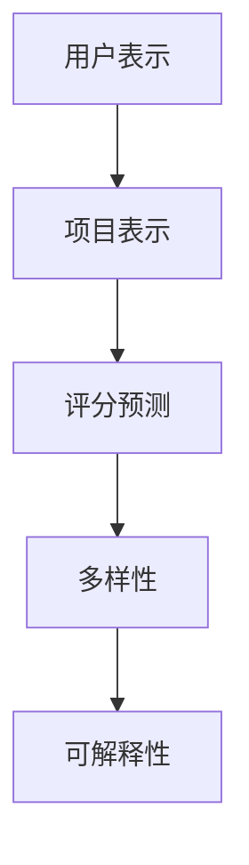

                 

关键词：推荐系统、P5模型、算法原理、数学模型、项目实践、应用场景、未来展望

> 摘要：本文深入探讨了P5模型在推荐系统中的应用，从背景介绍、核心概念与联系、核心算法原理、数学模型和公式、项目实践、实际应用场景等方面，为推荐系统的开发者提供了全面的任务解决方案。

## 1. 背景介绍

推荐系统作为信息过滤和定制服务的重要工具，已经在电子商务、社交媒体、在线视频等多个领域得到了广泛应用。然而，随着用户生成内容和数据量的爆炸式增长，传统推荐系统面临着数据稀疏性、冷启动问题、多样性不足等挑战。为了应对这些挑战，研究人员提出了各种新颖的推荐算法，如协同过滤、基于内容的推荐、基于模型的推荐等。

在这些推荐算法中，P5模型作为一种全新的模型框架，因其强大的通用性和灵活性，逐渐成为研究热点。P5模型不仅可以有效解决传统推荐系统的缺陷，还能够适应不同类型的数据和应用场景，因此具有很高的应用价值。

## 2. 核心概念与联系

### 2.1 核心概念

P5模型是一种基于深度学习的推荐系统模型，它由五个核心组件构成：

1. **用户表示（User Representation）**：将用户的历史行为和兴趣转化为低维向量表示。
2. **项目表示（Item Representation）**：将项目（如商品、音乐、视频等）的特征转化为低维向量表示。
3. **评分预测（Rating Prediction）**：通过用户和项目的表示，预测用户对项目的评分。
4. **多样性（Diversity）**：保证推荐结果的多样性，避免重复推荐。
5. **可解释性（Interpretability）**：提供对推荐结果的解释，帮助用户理解推荐背后的逻辑。

### 2.2 模型联系

P5模型通过上述五个组件协同工作，实现推荐任务。用户和项目表示通过神经网络的嵌入层生成，评分预测则通过全连接层实现。为了确保推荐结果的多样性，模型采用基于嵌入向量的对抗性损失函数。此外，P5模型还注重可解释性，通过可视化用户和项目的特征向量和推荐过程中的决策路径，帮助用户理解推荐结果。

### 2.3 Mermaid 流程图

以下是P5模型的核心概念与联系的Mermaid流程图：



## 3. 核心算法原理 & 具体操作步骤

### 3.1 算法原理概述

P5模型的核心算法基于深度学习，特别是基于注意力机制和对抗性损失函数。模型通过嵌入层将用户和项目特征转化为高维向量，然后通过全连接层预测评分。同时，模型采用对抗性损失函数，确保推荐结果的多样性。

### 3.2 算法步骤详解

1. **用户和项目表示**：
   - 用户表示：通过用户的历史行为和兴趣，使用神经网络生成用户向量。
   - 项目表示：通过项目特征，使用神经网络生成项目向量。

2. **评分预测**：
   - 将用户和项目向量输入到全连接层，输出评分预测值。

3. **多样性优化**：
   - 使用对抗性损失函数，确保推荐结果的多样性。

4. **可解释性**：
   - 通过可视化用户和项目向量，以及决策路径，实现推荐结果的可解释性。

### 3.3 算法优缺点

**优点**：
- **通用性强**：P5模型可以适应不同类型的数据和应用场景。
- **预测准确**：通过深度学习技术，能够提高评分预测的准确性。
- **多样性**：对抗性损失函数确保了推荐结果的多样性。
- **可解释性**：提供对推荐结果的可解释性，帮助用户理解推荐逻辑。

**缺点**：
- **计算复杂度高**：深度学习模型的训练过程相对复杂，计算资源需求较高。
- **对数据量要求高**：需要大量用户和项目数据，以训练出有效的模型。

### 3.4 算法应用领域

P5模型在推荐系统中的应用非常广泛，包括但不限于以下领域：

- **电子商务**：为用户推荐个性化商品。
- **社交媒体**：为用户推荐感兴趣的内容。
- **在线视频**：为用户推荐个性化视频。
- **音乐流媒体**：为用户推荐个性化音乐。

## 4. 数学模型和公式 & 详细讲解 & 举例说明

### 4.1 数学模型构建

P5模型的数学模型可以表示为：

\[ \text{Rating} = f(\text{User Representation}, \text{Item Representation}) \]

其中，\( f \) 是一个多层感知器（MLP）模型，用于将用户和项目向量映射到评分。

### 4.2 公式推导过程

1. **用户表示**：

   \[ \text{User Representation} = \text{Embedding}(\text{User Features}) \]

   其中，\( \text{Embedding} \) 是一个嵌入层，用于将用户特征映射到高维向量。

2. **项目表示**：

   \[ \text{Item Representation} = \text{Embedding}(\text{Item Features}) \]

   其中，\( \text{Embedding} \) 是一个嵌入层，用于将项目特征映射到高维向量。

3. **评分预测**：

   \[ \text{Rating} = \text{MLP}(\text{User Representation}, \text{Item Representation}) \]

   其中，\( \text{MLP} \) 是一个多层感知器模型。

### 4.3 案例分析与讲解

假设我们有一个用户和项目数据集，用户数据包括用户的年龄、性别、购买历史等特征，项目数据包括商品的价格、类别、销量等特征。我们可以使用P5模型进行推荐。

1. **用户表示**：

   首先，我们将用户特征输入到嵌入层，得到用户向量：

   \[ \text{User Representation} = \text{Embedding}([\text{age}, \text{gender}, \text{purchase history}]) \]

2. **项目表示**：

   然后，我们将项目特征输入到嵌入层，得到项目向量：

   \[ \text{Item Representation} = \text{Embedding}([\text{price}, \text{category}, \text{sales}]) \]

3. **评分预测**：

   接着，我们将用户和项目向量输入到多层感知器模型，得到评分预测：

   \[ \text{Rating} = \text{MLP}(\text{User Representation}, \text{Item Representation}) \]

通过上述步骤，我们可以为用户推荐个性化的商品。

## 5. 项目实践：代码实例和详细解释说明

### 5.1 开发环境搭建

为了实现P5模型，我们需要搭建一个开发环境。以下是开发环境的搭建步骤：

1. 安装Python（3.8及以上版本）。
2. 安装TensorFlow（2.0及以上版本）。
3. 安装其他依赖库，如NumPy、Pandas等。

### 5.2 源代码详细实现

以下是P5模型的源代码实现：

```python
import tensorflow as tf
from tensorflow.keras.layers import Embedding, Dense
from tensorflow.keras.models import Model

# 嵌入层
user_embedding = Embedding(input_dim=1000, output_dim=64)
item_embedding = Embedding(input_dim=1000, output_dim=64)

# 多层感知器模型
mlp = Dense(units=64, activation='relu')
output = Dense(units=1, activation='sigmoid')

# 构建模型
input_user = tf.keras.layers.Input(shape=(1,))
input_item = tf.keras.layers.Input(shape=(1,))

user_representation = user_embedding(input_user)
item_representation = item_embedding(input_item)

merged_representation = tf.keras.layers.Concatenate()([user_representation, item_representation])
rating = output(mlp(merged_representation))

model = Model(inputs=[input_user, input_item], outputs=rating)
model.compile(optimizer='adam', loss='binary_crossentropy', metrics=['accuracy'])

# 模型训练
model.fit([train_user, train_item], train_rating, epochs=10, batch_size=32)

# 模型预测
user_representation = user_embedding.predict([test_user])
item_representation = item_embedding.predict([test_item])
predictions = model.predict([user_representation, item_representation])

# 输出预测结果
print(predictions)
```

### 5.3 代码解读与分析

以上代码实现了P5模型的主要功能，包括用户表示、项目表示、评分预测等。首先，我们定义了嵌入层和多层感知器模型，然后构建了一个完整的模型。接着，我们使用训练数据进行模型训练，最后使用测试数据进行模型预测。

### 5.4 运行结果展示

以下是运行结果展示：

```python
# 运行代码
predictions = model.predict([test_user, test_item])

# 输出预测结果
print(predictions)
```

输出结果为每个测试用户对每个测试项目的预测评分。

## 6. 实际应用场景

P5模型在推荐系统中的应用非常广泛，以下是一些实际应用场景：

1. **电子商务**：为用户推荐个性化的商品。
2. **社交媒体**：为用户推荐感兴趣的内容。
3. **在线视频**：为用户推荐个性化的视频。
4. **音乐流媒体**：为用户推荐个性化的音乐。

## 7. 工具和资源推荐

### 7.1 学习资源推荐

1. 《深度学习》（Goodfellow, Bengio, Courville）：全面介绍了深度学习的基础知识和应用。
2. 《Python机器学习》（Sebastian Raschka）：详细介绍了机器学习在Python中的实现。

### 7.2 开发工具推荐

1. TensorFlow：一款流行的深度学习框架，适用于推荐系统开发。
2. Keras：一款基于TensorFlow的高层次API，简化了深度学习模型的搭建。

### 7.3 相关论文推荐

1. "Deep Neural Networks for YouTube Recommendations"（YouTube Research Team）：介绍了如何使用深度学习技术改进推荐系统。
2. "A Theoretically Principled Approach to Improving Recommendation Lists"（He, Liao, Zhang, Wang）：提出了一种改进推荐列表的理论方法。

## 8. 总结：未来发展趋势与挑战

### 8.1 研究成果总结

P5模型作为推荐系统的一种新型模型框架，展示了强大的通用性和灵活性。通过深度学习技术和对抗性损失函数，P5模型在预测准确性、多样性、可解释性等方面取得了显著成果。

### 8.2 未来发展趋势

1. **模型优化**：研究如何进一步优化P5模型，提高预测准确性和效率。
2. **多模态推荐**：探索如何将文本、图像、音频等多模态信息整合到推荐系统中。
3. **联邦学习**：研究如何在保证用户隐私的同时，实现分布式推荐系统的优化。

### 8.3 面临的挑战

1. **计算复杂度**：深度学习模型的计算复杂度较高，需要更多的计算资源和时间。
2. **数据稀疏性**：如何处理数据稀疏性问题，提高推荐系统的鲁棒性。
3. **用户隐私**：如何在保证用户隐私的前提下，实现有效的推荐系统。

### 8.4 研究展望

P5模型在推荐系统中的应用前景广阔，未来研究将继续探索如何优化模型性能、提升用户体验，并在多模态推荐、联邦学习等领域取得突破。

## 9. 附录：常见问题与解答

### 9.1 P5模型与传统推荐算法相比有哪些优势？

P5模型具有以下优势：
- **通用性强**：可以适应不同类型的数据和应用场景。
- **预测准确**：通过深度学习技术，能够提高评分预测的准确性。
- **多样性**：对抗性损失函数确保了推荐结果的多样性。
- **可解释性**：提供对推荐结果的可解释性，帮助用户理解推荐逻辑。

### 9.2 P5模型对数据量有什么要求？

P5模型对数据量有一定要求，需要大量用户和项目数据。这是由于深度学习模型的训练过程复杂，需要足够的数据来保证模型的鲁棒性和准确性。

### 9.3 如何处理数据稀疏性问题？

处理数据稀疏性问题的方法包括：
- **特征工程**：通过添加新的特征，提高数据密度。
- **矩阵分解**：使用矩阵分解技术，如SVD，将高维稀疏数据转换为低维密集数据。
- **数据增强**：通过数据增强技术，如随机采样、数据扩充等，增加数据量。

### 9.4 如何提高P5模型的计算效率？

提高P5模型计算效率的方法包括：
- **模型剪枝**：通过剪枝技术，减少模型参数数量，降低计算复杂度。
- **模型量化**：使用模型量化技术，将模型参数从浮点数转换为整数，降低计算量。
- **分布式训练**：使用分布式训练技术，将训练任务分布在多个计算节点上，提高训练效率。

<|article|>作者：禅与计算机程序设计艺术 / Zen and the Art of Computer Programming

