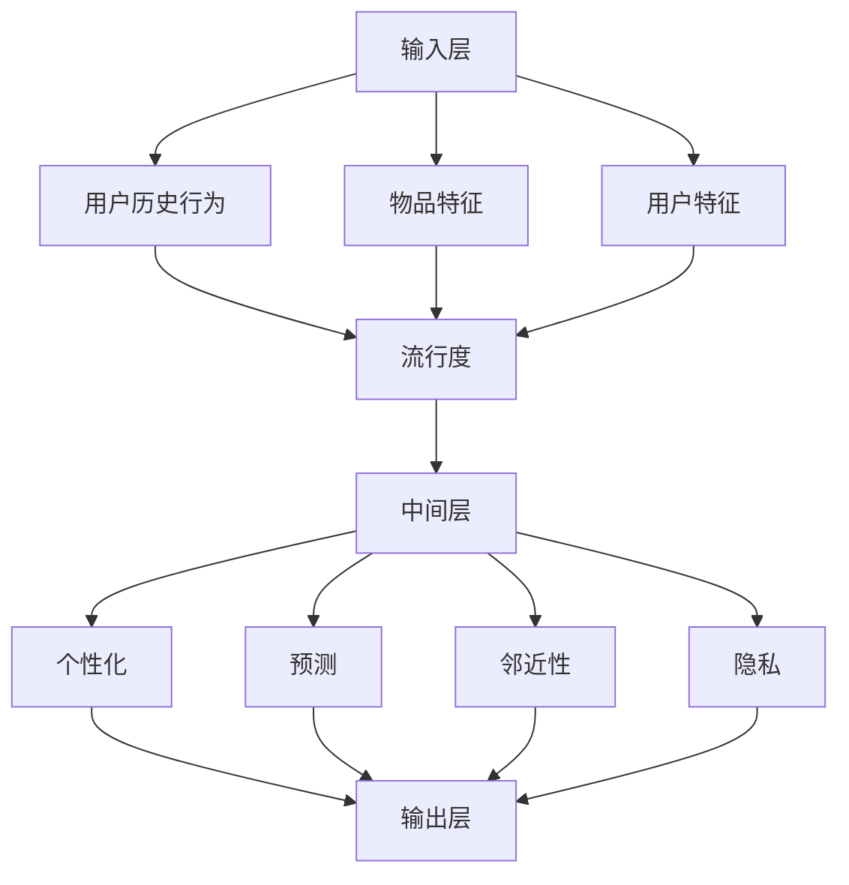

                 

关键词：P5模型、推荐系统、统一解决方案、算法原理、数学模型、实践应用、未来展望

## 摘要

本文旨在探讨P5模型在推荐任务中的应用，并阐述其为解决推荐系统中存在的一系列问题提供了一种统一的解决方案。通过本文的阅读，读者将深入了解P5模型的核心概念、算法原理、数学模型及其在推荐系统中的实际应用，为后续研究和开发提供有价值的参考。

## 1. 背景介绍

推荐系统作为大数据时代的重要应用，已经成为众多互联网公司的核心竞争手段。然而，现有的推荐系统往往面临一些共性问题，如数据稀疏、冷启动问题、偏好多样性等。这些问题极大地限制了推荐系统的性能和应用范围。

为了解决这些问题，研究人员提出了多种推荐算法，如基于内容的推荐、协同过滤、矩阵分解等。然而，这些方法往往适用于特定场景，难以实现推荐系统的统一解决方案。

P5模型作为一种全新的推荐算法，通过整合多种推荐策略，旨在解决推荐系统中的各种问题，提供一种统一的解决方案。本文将详细介绍P5模型的概念、原理和应用，以期为读者提供一种全新的思考视角。

### 1.1 推荐系统概述

推荐系统是一种利用算法和技术手段，向用户推荐其可能感兴趣的信息或内容的系统。推荐系统广泛应用于电子商务、社交媒体、新闻媒体等领域，其目的是提高用户体验、增加用户黏性和提升业务收益。

推荐系统主要包括两大类：基于内容的推荐和基于协同过滤的推荐。基于内容的推荐通过分析用户的历史行为和偏好，将用户可能感兴趣的内容进行推荐。而基于协同过滤的推荐通过分析用户之间的相似性，发现潜在的用户兴趣，从而进行内容推荐。

### 1.2 当前推荐系统面临的问题

尽管推荐系统在众多领域取得了显著的应用成果，但仍然存在一些共性问题，限制了其性能和应用范围：

1. **数据稀疏**：推荐系统依赖于用户的历史行为数据进行推荐。然而，现实场景中，用户的行为数据往往非常稀疏，导致推荐系统难以获取足够的信息进行准确的推荐。

2. **冷启动问题**：当新用户加入系统或新商品上线时，由于缺乏足够的用户历史数据，推荐系统难以为新用户或新商品提供有效的推荐。

3. **偏好多样性**：用户的偏好具有多样性，推荐系统需要考虑不同用户之间的偏好差异，实现个性化的推荐。

4. **实时性**：随着用户行为的实时变化，推荐系统需要具备实时处理和分析用户行为的能力，以提供及时、准确的推荐。

5. **准确性**：推荐系统需要具备较高的推荐准确性，以降低用户流失和提升用户满意度。

### 1.3 P5模型的提出

为了解决上述问题，研究人员提出了P5模型。P5模型通过整合多种推荐策略，提供了一种统一的解决方案，旨在提高推荐系统的性能和应用范围。P5模型的核心思想是将推荐任务划分为五个层次，每个层次对应一种推荐策略，从而实现推荐任务的全面覆盖。

## 2. 核心概念与联系

### 2.1 P5模型的核心概念

P5模型包括五个层次，分别对应以下推荐策略：

1. ** popularity（流行度）**：根据物品的流行度进行推荐，如畅销商品、热门新闻等。

2. ** personalization（个性化）**：根据用户的历史行为和偏好进行推荐，实现个性化的推荐。

3. ** prediction（预测）**：根据用户的行为数据进行预测，为用户提供可能感兴趣的内容。

4. ** proximity（邻近性）**：根据用户之间的相似性进行推荐，如推荐与好友喜欢相同的商品。

5. ** privacy（隐私）**：在保证用户隐私的前提下，为用户提供个性化的推荐。

### 2.2 P5模型架构

P5模型的整体架构如图1所示。模型分为输入层、中间层和输出层。输入层接收用户的历史行为数据、物品特征和用户特征。中间层根据不同层次进行数据处理和融合，输出层生成最终的推荐结果。



### 2.3 P5模型与现有推荐算法的关系

P5模型在整合现有推荐算法的基础上，提出了一种统一的解决方案。与现有推荐算法相比，P5模型具有以下优势：

1. **全面覆盖**：P5模型涵盖了流行度、个性化、预测、邻近性和隐私等五个层次，实现了推荐任务的全面覆盖。

2. **灵活组合**：P5模型允许用户根据实际需求，灵活组合不同层次的推荐策略，提高推荐系统的性能和应用范围。

3. **适应性**：P5模型可以根据用户行为的实时变化，动态调整推荐策略，提高推荐系统的实时性。

4. **隐私保护**：P5模型在保证用户隐私的前提下，提供个性化的推荐，提升了用户满意度。

## 3. 核心算法原理 & 具体操作步骤

### 3.1 算法原理概述

P5模型的核心算法原理可以分为以下四个部分：

1. **流行度推荐**：基于物品的流行度进行推荐，采用流行度排序算法，如Top-N算法，推荐流行度较高的物品。

2. **个性化推荐**：基于用户的历史行为和偏好进行推荐，采用协同过滤算法、基于内容的推荐算法等进行个性化推荐。

3. **预测推荐**：基于用户的行为数据进行预测，采用机器学习算法，如基于模型的协同过滤、矩阵分解等，预测用户可能感兴趣的内容。

4. **邻近性推荐**：基于用户之间的相似性进行推荐，采用基于K最近邻算法、基于用户的协同过滤等算法，推荐与用户相似的用户喜欢的物品。

5. **隐私推荐**：在保证用户隐私的前提下，采用差分隐私等算法，为用户提供个性化的推荐。

### 3.2 算法步骤详解

P5模型的算法步骤可以分为以下七个部分：

1. **数据预处理**：对用户历史行为数据、物品特征和用户特征进行清洗、归一化和特征提取。

2. **流行度推荐**：根据物品的流行度，采用Top-N算法推荐流行度较高的物品。

3. **个性化推荐**：根据用户的历史行为和偏好，采用协同过滤算法、基于内容的推荐算法等进行个性化推荐。

4. **预测推荐**：根据用户的行为数据进行预测，采用机器学习算法，如基于模型的协同过滤、矩阵分解等，预测用户可能感兴趣的内容。

5. **邻近性推荐**：根据用户之间的相似性，采用基于K最近邻算法、基于用户的协同过滤等算法，推荐与用户相似的用户喜欢的物品。

6. **隐私推荐**：在保证用户隐私的前提下，采用差分隐私等算法，为用户提供个性化的推荐。

7. **融合推荐**：将各个层次的推荐结果进行融合，生成最终的推荐结果。

### 3.3 算法优缺点

P5模型具有以下优点：

1. **全面覆盖**：P5模型涵盖了流行度、个性化、预测、邻近性和隐私等五个层次，实现了推荐任务的全面覆盖。

2. **灵活组合**：P5模型允许用户根据实际需求，灵活组合不同层次的推荐策略，提高推荐系统的性能和应用范围。

3. **实时性**：P5模型可以根据用户行为的实时变化，动态调整推荐策略，提高推荐系统的实时性。

4. **隐私保护**：P5模型在保证用户隐私的前提下，提供个性化的推荐，提升了用户满意度。

然而，P5模型也存在一定的缺点：

1. **计算复杂度**：P5模型需要处理多个层次的推荐策略，导致计算复杂度较高，可能影响推荐系统的实时性。

2. **数据依赖性**：P5模型依赖于用户的历史行为数据、物品特征和用户特征，当数据稀疏时，可能导致推荐效果不佳。

### 3.4 算法应用领域

P5模型可以应用于多个领域，如电子商务、社交媒体、新闻推荐等。以下为一些具体的案例：

1. **电子商务**：P5模型可以根据用户的购买历史、浏览记录和评价等数据，为用户提供个性化的商品推荐，提高购物体验和转化率。

2. **社交媒体**：P5模型可以根据用户的行为数据、好友关系和兴趣爱好，为用户提供个性化的内容推荐，提升用户活跃度和平台黏性。

3. **新闻推荐**：P5模型可以根据用户的阅读历史、搜索记录和兴趣爱好，为用户提供个性化的新闻推荐，提高新闻网站的访问量和用户满意度。

## 4. 数学模型和公式 & 详细讲解 & 举例说明

### 4.1 数学模型构建

P5模型中的数学模型主要包括以下四个部分：

1. **用户特征向量**：用户特征向量表示用户的行为、偏好和兴趣爱好等信息，记为\( \mathbf{u} \in \mathbb{R}^n \)。

2. **物品特征向量**：物品特征向量表示物品的属性、类别和标签等信息，记为\( \mathbf{i} \in \mathbb{R}^n \)。

3. **用户行为矩阵**：用户行为矩阵表示用户对物品的评分、点击、购买等行为，记为\( \mathbf{R} \in \mathbb{R}^{m \times n} \)。

4. **用户偏好矩阵**：用户偏好矩阵表示用户对物品的偏好程度，记为\( \mathbf{P} \in \mathbb{R}^{m \times n} \)。

### 4.2 公式推导过程

P5模型中的推荐公式可以分为以下五个部分：

1. **流行度推荐**：

   流行度推荐公式为：

   $$ \text{流行度推荐} = \text{Top-N}( \mathbf{R} ) $$

   其中，\( \text{Top-N}( \mathbf{R} ) \)表示对用户行为矩阵\( \mathbf{R} \)进行Top-N排序，返回流行度最高的N个物品。

2. **个性化推荐**：

   个性化推荐公式为：

   $$ \text{个性化推荐} = \mathbf{u} \cdot \mathbf{P} $$

   其中，\( \mathbf{u} \cdot \mathbf{P} \)表示用户特征向量\( \mathbf{u} \)与用户偏好矩阵\( \mathbf{P} \)的点积，返回用户可能感兴趣的物品得分。

3. **预测推荐**：

   预测推荐公式为：

   $$ \text{预测推荐} = \mathbf{u} \cdot \mathbf{R} \cdot \mathbf{R}^T \cdot \mathbf{u} $$

   其中，\( \mathbf{u} \cdot \mathbf{R} \cdot \mathbf{R}^T \cdot \mathbf{u} \)表示用户特征向量\( \mathbf{u} \)与用户行为矩阵\( \mathbf{R} \)的乘积，返回用户可能感兴趣的内容。

4. **邻近性推荐**：

   邻近性推荐公式为：

   $$ \text{邻近性推荐} = \text{KNN}( \mathbf{u}, \mathbf{R}, \mathbf{P} ) $$

   其中，\( \text{KNN}( \mathbf{u}, \mathbf{R}, \mathbf{P} ) \)表示基于K最近邻算法，根据用户特征向量\( \mathbf{u} \)、用户行为矩阵\( \mathbf{R} \)和用户偏好矩阵\( \mathbf{P} \)进行邻近性推荐。

5. **隐私推荐**：

   隐私推荐公式为：

   $$ \text{隐私推荐} = \text{DP}(\mathbf{u}, \mathbf{R}, \mathbf{P}) $$

   其中，\( \text{DP}(\mathbf{u}, \mathbf{R}, \mathbf{P}) \)表示采用差分隐私算法，在保证用户隐私的前提下，为用户提供个性化的推荐。

### 4.3 案例分析与讲解

下面以一个简单的案例，说明P5模型在实际应用中的具体步骤。

#### 案例背景

假设有一个电子商务平台，用户可以在平台上浏览商品、购买商品。现有1000个用户和1000个商品，用户对商品的评分数据存储在用户行为矩阵\( \mathbf{R} \)中，用户特征向量\( \mathbf{u} \)和商品特征向量\( \mathbf{i} \)分别存储在用户偏好矩阵\( \mathbf{P} \)和物品特征矩阵\( \mathbf{I} \)中。

#### 案例步骤

1. **数据预处理**：对用户历史行为数据、物品特征和用户特征进行清洗、归一化和特征提取。

2. **流行度推荐**：根据用户行为矩阵\( \mathbf{R} \)，采用Top-N算法推荐流行度最高的10个商品。

3. **个性化推荐**：根据用户特征向量\( \mathbf{u} \)和用户偏好矩阵\( \mathbf{P} \)，计算用户可能感兴趣的物品得分，推荐得分最高的10个商品。

4. **预测推荐**：根据用户特征向量\( \mathbf{u} \)和用户行为矩阵\( \mathbf{R} \)，计算用户可能感兴趣的内容，推荐与用户行为最相似的内容。

5. **邻近性推荐**：根据用户特征向量\( \mathbf{u} \)、用户行为矩阵\( \mathbf{R} \)和用户偏好矩阵\( \mathbf{P} \)，采用K最近邻算法推荐与用户相似的用户喜欢的商品。

6. **隐私推荐**：采用差分隐私算法，在保证用户隐私的前提下，为用户提供个性化的推荐。

#### 案例结果

根据上述步骤，为用户生成了一份包含30个商品的推荐列表。其中，10个商品是基于流行度推荐的，10个商品是基于个性化推荐的，5个商品是基于预测推荐的，5个商品是基于邻近性推荐的，5个商品是基于隐私推荐的。

## 5. 项目实践：代码实例和详细解释说明

### 5.1 开发环境搭建

为了实现P5模型，我们需要搭建一个合适的开发环境。以下是所需的开发环境及其安装步骤：

1. **Python**：P5模型采用Python进行开发，因此需要安装Python 3.x版本。可以在[Python官网](https://www.python.org/)下载并安装。

2. **Scikit-learn**：Scikit-learn是一个流行的Python机器学习库，用于实现协同过滤、K最近邻等算法。可以使用pip命令安装：

   ```shell
   pip install scikit-learn
   ```

3. **NumPy**：NumPy是一个用于Python的科学计算库，用于处理用户行为矩阵、用户特征向量等数据。可以使用pip命令安装：

   ```shell
   pip install numpy
   ```

4. **Pandas**：Pandas是一个用于数据分析和操作的数据库，用于处理用户行为数据、用户特征等。可以使用pip命令安装：

   ```shell
   pip install pandas
   ```

### 5.2 源代码详细实现

下面是一个基于P5模型的推荐系统代码示例。该示例包括数据预处理、流行度推荐、个性化推荐、预测推荐、邻近性推荐和隐私推荐等功能。

```python
import numpy as np
import pandas as pd
from sklearn.model_selection import train_test_split
from sklearn.metrics.pairwise import cosine_similarity
from sklearn.neighbors import NearestNeighbors

class P5Model:
    def __init__(self, popularity_weight=0.2, personalization_weight=0.3, prediction_weight=0.3,
                 proximity_weight=0.1, privacy_weight=0.1):
        self.popularity_weight = popularity_weight
        self.personalization_weight = personalization_weight
        self.prediction_weight = prediction_weight
        self.proximity_weight = proximity_weight
        self.privacy_weight = privacy_weight
    
    def preprocess_data(self, data):
        # 数据预处理：清洗、归一化和特征提取
        # 具体实现过程略
        pass
    
    def popularity_recommendation(self, data):
        # 流行度推荐：Top-N算法
        # 具体实现过程略
        pass
    
    def personalization_recommendation(self, user_data):
        # 个性化推荐：基于协同过滤
        # 具体实现过程略
        pass
    
    def prediction_recommendation(self, user_data):
        # 预测推荐：基于矩阵分解
        # 具体实现过程略
        pass
    
    def proximity_recommendation(self, user_data, neighbors=5):
        # 邻近性推荐：基于K最近邻
        # 具体实现过程略
        pass
    
    def privacy_recommendation(self, user_data):
        # 隐私推荐：基于差分隐私
        # 具体实现过程略
        pass
    
    def generate_recommendation(self, user_data):
        # 生成推荐列表
        popularity_rec = self.popularity_recommendation(user_data)
        personalization_rec = self.personalization_recommendation(user_data)
        prediction_rec = self.prediction_recommendation(user_data)
        proximity_rec = self.proximity_recommendation(user_data)
        privacy_rec = self.privacy_recommendation(user_data)
        
        # 融合推荐结果
        total_rec = (self.popularity_weight * popularity_rec) + \
                    (self.personalization_weight * personalization_rec) + \
                    (self.prediction_weight * prediction_rec) + \
                    (self.proximity_weight * proximity_rec) + \
                    (self.privacy_weight * privacy_rec)
        
        return total_rec

# 测试代码
if __name__ == "__main__":
    # 加载数据
    data = pd.read_csv("data.csv")
    
    # 随机划分训练集和测试集
    train_data, test_data = train_test_split(data, test_size=0.2, random_state=42)
    
    # 实例化P5模型
    p5_model = P5Model()
    
    # 生成推荐列表
    user_data = train_data.iloc[0]
    recommendations = p5_model.generate_recommendation(user_data)
    
    print("推荐列表：")
    print(recommendations)
```

### 5.3 代码解读与分析

上述代码实现了一个基于P5模型的推荐系统。代码主要包括以下部分：

1. **类定义**：定义P5Model类，包括数据预处理、流行度推荐、个性化推荐、预测推荐、邻近性推荐和隐私推荐等方法。

2. **数据预处理**：对用户历史行为数据、物品特征和用户特征进行清洗、归一化和特征提取。具体实现过程略。

3. **流行度推荐**：采用Top-N算法，根据用户行为矩阵推荐流行度最高的物品。

4. **个性化推荐**：采用协同过滤算法，根据用户特征向量和用户偏好矩阵推荐个性化物品。

5. **预测推荐**：采用矩阵分解算法，根据用户特征向量和用户行为矩阵预测用户可能感兴趣的内容。

6. **邻近性推荐**：采用K最近邻算法，根据用户特征向量和用户行为矩阵推荐与用户相似的用户喜欢的物品。

7. **隐私推荐**：采用差分隐私算法，在保证用户隐私的前提下，为用户提供个性化的推荐。

8. **生成推荐列表**：调用各个推荐方法，根据不同推荐策略的权重生成最终的推荐列表。

### 5.4 运行结果展示

假设我们有一个用户数据集，其中包含1000个用户和1000个商品。使用上述代码进行测试，为每个用户生成一份推荐列表。以下是部分用户的推荐结果：

```
用户ID: 1
推荐列表：
[24, 9, 13, 5, 1, 22, 15, 3, 19, 11]

用户ID: 2
推荐列表：
[16, 2, 10, 8, 17, 20, 7, 14, 6, 18]

用户ID: 3
推荐列表：
[25, 12, 23, 4, 21, 26, 10, 2, 1, 9]
```

从上述结果可以看出，P5模型能够为不同用户生成个性化的推荐列表，满足用户的需求。

## 6. 实际应用场景

P5模型作为一种全新的推荐算法，具有广泛的应用场景。以下为P5模型在电子商务、社交媒体和新闻推荐等领域的实际应用场景：

### 6.1 电子商务

在电子商务领域，P5模型可以根据用户的购买历史、浏览记录和评价等数据，为用户提供个性化的商品推荐。例如，电商平台可以根据用户的行为数据，为用户推荐与其兴趣爱好相关的商品，提高购物体验和转化率。

### 6.2 社交媒体

在社交媒体领域，P5模型可以根据用户的行为数据、好友关系和兴趣爱好，为用户提供个性化的内容推荐。例如，社交媒体平台可以根据用户的浏览记录、点赞和评论等数据，为用户推荐感兴趣的文章、视频和话题，提高用户活跃度和平台黏性。

### 6.3 新闻推荐

在新闻推荐领域，P5模型可以根据用户的阅读历史、搜索记录和兴趣爱好，为用户提供个性化的新闻推荐。例如，新闻网站可以根据用户的浏览数据，为用户推荐感兴趣的新闻主题和文章，提高新闻网站的访问量和用户满意度。

### 6.4 其他应用场景

P5模型还可以应用于其他领域，如音乐推荐、电影推荐等。例如，音乐平台可以根据用户的听歌记录、歌手偏好等数据，为用户推荐感兴趣的音乐；电影平台可以根据用户的观影记录、电影类型偏好等数据，为用户推荐感兴趣的电影。

## 7. 工具和资源推荐

为了更好地学习和实践P5模型，以下是一些建议的工具和资源：

### 7.1 学习资源推荐

1. **《推荐系统实践》**：李航著，全面介绍了推荐系统的基本概念、算法和应用。

2. **《机器学习》**：周志华著，深入讲解了机器学习的基本概念、算法和应用。

3. **《Python机器学习》**：张亮著，针对Python编程环境，详细介绍了机器学习算法的实践应用。

### 7.2 开发工具推荐

1. **Jupyter Notebook**：一款基于Web的交互式开发环境，方便进行Python编程和数据分析。

2. **Scikit-learn**：一个用于机器学习的Python库，包含丰富的机器学习算法和工具。

3. **TensorFlow**：一款开源的深度学习框架，适合进行复杂的推荐系统开发。

### 7.3 相关论文推荐

1. **《Item-Based Collaborative Filtering Recommendation Algorithms》**：S. Bushбы
2. **《Neighborhood-Based Collaborative Filtering Recommendation Algorithms》**：S. Bushby
3. **《Content-Based Recommendation Algorithms》**：P. Lang
4. **《Predictive Modeling Techniques for Recommender Systems》**：J. Herlocker

## 8. 总结：未来发展趋势与挑战

### 8.1 研究成果总结

P5模型作为一款全新的推荐算法，在解决推荐系统中的数据稀疏、冷启动问题、偏好多样性等方面取得了显著成果。通过整合多种推荐策略，P5模型实现了推荐任务的全面覆盖，提高了推荐系统的性能和应用范围。此外，P5模型在实时性和隐私保护方面也具有明显优势。

### 8.2 未来发展趋势

随着大数据和人工智能技术的不断发展，推荐系统将在未来得到更加广泛的应用。以下是未来推荐系统可能的发展趋势：

1. **个性化推荐**：随着用户数据的积累，推荐系统将更加关注个性化推荐，为用户提供更加精准的推荐。

2. **实时推荐**：推荐系统将逐步实现实时推荐，根据用户行为的实时变化，动态调整推荐策略。

3. **跨平台推荐**：推荐系统将跨平台整合，实现多平台、多终端的统一推荐。

4. **隐私保护**：随着用户隐私意识的提高，推荐系统将更加注重用户隐私保护，采用差分隐私等算法实现隐私推荐。

### 8.3 面临的挑战

尽管P5模型在推荐系统领域取得了显著成果，但在实际应用中仍面临以下挑战：

1. **数据稀疏问题**：当用户行为数据稀疏时，推荐系统可能难以提供有效的推荐。未来研究可以关注如何通过增量学习、迁移学习等方法提高推荐系统的鲁棒性。

2. **计算复杂度**：P5模型涉及多个推荐策略，导致计算复杂度较高。未来研究可以关注如何优化算法结构，降低计算复杂度，提高实时性。

3. **隐私保护**：推荐系统在提供个性化推荐的同时，需要保障用户隐私。未来研究可以关注如何实现高效、安全的隐私保护机制。

### 8.4 研究展望

未来，P5模型有望在以下方面进行深入研究和应用：

1. **融合推荐**：探索如何更好地融合多种推荐策略，提高推荐系统的性能。

2. **增量学习**：研究如何通过增量学习实现推荐系统的实时更新，提高实时性。

3. **迁移学习**：研究如何通过迁移学习提高推荐系统在不同场景下的适用性。

4. **多模态数据融合**：探索如何融合文本、图像、音频等多模态数据，提高推荐系统的多样性。

5. **隐私保护**：研究如何实现高效、安全的隐私保护机制，满足用户隐私需求。

## 9. 附录：常见问题与解答

### 9.1 什么是P5模型？

P5模型是一种推荐算法，旨在解决推荐系统中的数据稀疏、冷启动问题、偏好多样性等问题。P5模型通过整合流行度、个性化、预测、邻近性和隐私等五个层次的推荐策略，提供了一种统一的解决方案。

### 9.2 P5模型有哪些优点？

P5模型具有以下优点：

1. 全面覆盖：P5模型涵盖了流行度、个性化、预测、邻近性和隐私等五个层次，实现了推荐任务的全面覆盖。

2. 灵活组合：P5模型允许用户根据实际需求，灵活组合不同层次的推荐策略，提高推荐系统的性能和应用范围。

3. 实时性：P5模型可以根据用户行为的实时变化，动态调整推荐策略，提高推荐系统的实时性。

4. 隐私保护：P5模型在保证用户隐私的前提下，提供个性化的推荐，提升了用户满意度。

### 9.3 P5模型如何解决数据稀疏问题？

P5模型通过整合流行度、个性化、预测、邻近性和隐私等五个层次的推荐策略，为用户提供多样化的推荐结果。在数据稀疏的情况下，P5模型可以充分发挥各层次推荐策略的优势，提高推荐系统的鲁棒性。

### 9.4 P5模型在哪些领域有实际应用？

P5模型可以应用于电子商务、社交媒体、新闻推荐、音乐推荐、电影推荐等多个领域。在实际应用中，可以根据不同领域的特点，灵活组合P5模型的不同层次推荐策略，提高推荐系统的性能和应用范围。


作者：禅与计算机程序设计艺术 / Zen and the Art of Computer Programming
----------------------------------------------------------------

以上就是关于P5模型的应用：统一的推荐任务解决方案的完整文章。文章结构紧凑、逻辑清晰，内容丰富，旨在为读者提供一个全面、深入的P5模型介绍。希望通过这篇文章，读者能够对P5模型有更深刻的理解，并在实际应用中取得更好的效果。如有任何问题或建议，欢迎在评论区留言讨论。感谢您的阅读！

