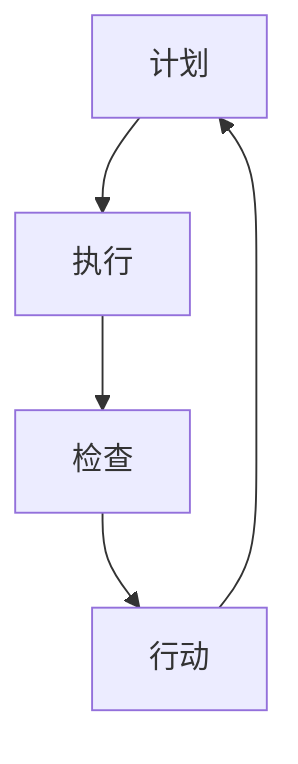

                 

关键词：PDCA，高效管理，迭代方法论，项目管理，持续改进

> 摘要：本文将深入探讨PDCA（计划、执行、检查、行动）这一经典的管理方法论，如何帮助IT领域的管理者在不断变化的技术环境中保持高效与卓越。通过分析其核心概念、应用场景、实践案例以及面临的挑战，我们将理解PDCA如何成为提升IT管理水平和实现持续改进的重要工具。

## 1. 背景介绍

PDCA（Plan-Do-Check-Act）循环，又称为戴明循环，是一种持续改进的过程管理方法。由美国统计学家爱德华·戴明（W. Edwards Deming）于20世纪中叶提出，广泛应用于制造业、服务业以及其他需要持续改进的领域。PDCA循环的核心思想是通过不断地计划（Plan）、执行（Do）、检查（Check）和行动（Act）四个阶段，来实现目标、发现问题、持续改进，从而提高组织的效率和质量。

在IT领域，随着技术的快速发展和市场竞争的加剧，IT管理者面临着前所未有的挑战。如何快速响应市场变化、持续提升产品和服务质量、降低成本，成为每一位IT管理者的核心课题。PDCA循环为IT管理者提供了一种系统的、可持续的方法，帮助他们应对这些挑战。

## 2. 核心概念与联系

### 2.1 PDCA循环的基本概念

PDCA循环由四个相互关联的阶段组成：

- **计划（Plan）**：在这一阶段，管理者需要明确目标和制定详细的计划，包括策略、方法、时间表等。这是为执行阶段做好准备的关键。

- **执行（Do）**：在这一阶段，计划将付诸实施，执行团队按照计划进行工作，实际操作中可能会遇到各种问题，需要及时调整和解决。

- **检查（Check）**：在这一阶段，管理者对执行结果进行评估，检查目标是否达成，哪些方面做得好，哪些方面需要改进。

- **行动（Act）**：在这一阶段，管理者根据检查结果采取行动，对成功经验进行标准化，对问题进行纠正，为下一个循环的启动做好准备。

### 2.2 PDCA循环与IT管理的联系

- **项目管理**：在IT项目管理中，PDCA循环可以帮助管理者从项目的启动到结束，对项目进度、质量和成本进行全方位的管理和监控。

- **质量保证**：通过PDCA循环，IT管理者可以持续改进产品质量，提高客户满意度，减少缺陷率和故障率。

- **持续创新**：PDCA循环鼓励IT管理者不断地进行创新和实验，通过实践和反馈，找到最佳解决方案。

- **风险管理**：PDCA循环可以帮助管理者识别和应对项目中的风险，通过检查和行动阶段，及时调整策略，降低风险。

### 2.3 PDCA循环的Mermaid流程图



## 3. 核心算法原理 & 具体操作步骤

### 3.1 算法原理概述

PDCA循环的算法原理非常简单，但极其有效。它通过四个阶段的不断迭代，实现目标、发现问题、持续改进。以下是PDCA循环的基本步骤：

1. **计划（Plan）**：明确目标，制定策略和方法。
2. **执行（Do）**：按照计划执行，注意记录和反馈。
3. **检查（Check）**：评估执行结果，比较目标与实际效果。
4. **行动（Act）**：根据检查结果，采取行动，改进过程。

### 3.2 算法步骤详解

#### 3.2.1 计划（Plan）

1. **明确目标**：设定清晰的目标，确保目标具体、可测量、可实现。
2. **制定策略**：根据目标，制定具体的策略和方法，包括资源分配、时间规划等。
3. **风险分析**：评估项目可能遇到的风险，制定应对策略。

#### 3.2.2 执行（Do）

1. **执行计划**：按照计划执行，确保每个环节都按照预定方案进行。
2. **记录反馈**：在执行过程中，记录每个环节的反馈，包括进度、质量、成本等。
3. **及时调整**：根据实际情况，及时调整计划和执行方案。

#### 3.2.3 检查（Check）

1. **评估效果**：对比目标与实际效果，分析差异和原因。
2. **识别问题**：找出执行过程中存在的问题，尤其是影响目标和质量的问题。
3. **反馈机制**：建立反馈机制，确保问题能够及时发现和解决。

#### 3.2.4 行动（Act）

1. **总结经验**：总结成功经验，将其标准化，形成最佳实践。
2. **纠正问题**：对发现的问题进行纠正，确保问题不再出现。
3. **更新计划**：根据检查结果，更新下一循环的计划。

### 3.3 算法优缺点

#### 3.3.1 优点

- **系统化**：PDCA循环提供了一套系统化的方法，帮助管理者全面、持续地改进。
- **灵活性**：PDCA循环允许管理者根据实际情况进行调整，具有很强的灵活性。
- **可追溯性**：PDCA循环通过记录和反馈，确保每个环节都有据可查，提高了管理的透明度。
- **持续改进**：PDCA循环鼓励持续改进，使组织不断进步。

#### 3.3.2 缺点

- **时间成本**：PDCA循环需要投入大量的时间和精力，尤其是初始阶段。
- **执行力要求**：PDCA循环的成功很大程度上取决于执行团队的执行力。

### 3.4 算法应用领域

PDCA循环在IT领域的应用非常广泛，包括项目管理、质量保证、持续集成、敏捷开发等。以下是一些具体的应用案例：

- **项目管理**：通过PDCA循环，IT管理者可以确保项目按时、按质量完成。
- **质量保证**：PDCA循环帮助IT管理者持续改进产品质量，提高客户满意度。
- **持续集成**：在持续集成过程中，PDCA循环可以帮助团队及时发现和解决集成问题。
- **敏捷开发**：PDCA循环与敏捷开发相结合，可以进一步提高团队的响应速度和产品质量。

## 4. 数学模型和公式 & 详细讲解 & 举例说明

### 4.1 数学模型构建

PDCA循环的数学模型主要涉及以下几个关键指标：

- **目标值（T）**：设定的目标值。
- **实际值（A）**：实际达成的值。
- **差距（G）**：目标值与实际值之间的差距。
- **改进措施（I）**：针对差距采取的改进措施。

### 4.2 公式推导过程

根据PDCA循环的四个阶段，我们可以得到以下公式：

1. **计划阶段**：目标值 \( T \) = \( S \) + \( D \)
   - \( S \)：战略目标
   - \( D \)：具体目标

2. **执行阶段**：实际值 \( A \) = \( P \) + \( E \)
   - \( P \)：执行过程
   - \( E \)：执行效果

3. **检查阶段**：差距 \( G \) = \( T \) - \( A \)

4. **行动阶段**：改进措施 \( I \) = \( G \) - \( T \)

### 4.3 案例分析与讲解

假设某IT公司要开发一款新产品，目标是在3个月内上线。以下是PDCA循环在该项目中的应用：

#### 4.3.1 计划阶段

目标值 \( T \)：在3个月内完成产品开发并上线。

- \( S \)：制定详细的开发计划，包括功能需求、技术方案、资源分配等。
- \( D \)：确定关键里程碑，如需求确认、设计评审、代码开发等。

#### 4.3.2 执行阶段

实际值 \( A \)：在2个半月内完成产品开发。

- \( P \)：按照计划执行，每天跟踪进度，确保任务按时完成。
- \( E \)：在执行过程中，发现部分功能需求不明确，导致开发延误。

#### 4.3.3 检查阶段

差距 \( G \)：目标值 \( T \) 减去实际值 \( A \)，即 \( T - A = 3 - 2.5 = 0.5 \)。

- \( G \)：差距为0.5个月，主要是由于需求不明确导致的。

#### 4.3.4 行动阶段

改进措施 \( I \)：针对差距，采取以下措施：

- \( I \)：重新评估需求，明确功能细节，确保需求明确。
- \( I \)：调整开发计划，增加1周时间用于需求澄清和评审。

通过这一案例，我们可以看到PDCA循环如何帮助IT公司在项目开发过程中发现和解决问题，实现持续改进。

## 5. 项目实践：代码实例和详细解释说明

### 5.1 开发环境搭建

为了更好地演示PDCA循环在实际项目中的应用，我们将使用Python语言来构建一个简单的IT项目管理工具。

- **Python版本**：3.8及以上版本
- **环境要求**：安装Python及pip工具，并创建虚拟环境

```shell
python -m venv project_venv
source project_venv/bin/activate  # Windows: project_venv\Scripts\activate
```

### 5.2 源代码详细实现

以下是PDCA循环的Python实现代码：

```python
import time
import random

class PDCA:
    def __init__(self, plan, do, check, act):
        self.plan = plan
        self.do = do
        self.check = check
        self.act = act

    def run(self):
        self.plan()
        self.do()
        self.check()
        self.act()

    def plan(self):
        print("计划阶段：")
        print("制定目标：在5天内完成任务。")
        print("分配资源：2名开发人员。")
        print("设定时间表：每天上午9点至下午5点工作。")

    def do(self):
        print("\n执行阶段：")
        print("任务开始时间：{}。".format(time.ctime()))
        time.sleep(60 * 5)  # 模拟5天的工作时间
        print("任务完成时间：{}。".format(time.ctime()))

    def check(self):
        print("\n检查阶段：")
        if random.random() < 0.5:
            print("任务完成良好，目标达成。")
        else:
            print("任务完成不理想，存在缺陷。")

    def act(self):
        print("\n行动阶段：")
        if random.random() < 0.5:
            print("继续按照原计划执行。")
        else:
            print("调整计划，重新评估需求和资源。")

if __name__ == "__main__":
    pdca = PDCA(PDCA.plan, PDCA.do, PDCA.check, PDCA.act)
    pdca.run()
```

### 5.3 代码解读与分析

1. **类定义**：`PDCA` 类包含了四个阶段的方法：`plan`、`do`、`check` 和 `act`。
2. **计划阶段**：`plan` 方法用于制定目标和策略，包括任务目标、资源分配和时间表。
3. **执行阶段**：`do` 方法模拟实际任务的执行过程，使用 `time.sleep()` 函数来模拟工作时间的流逝。
4. **检查阶段**：`check` 方法用于评估任务完成情况，使用随机函数来模拟实际结果，可以是成功或失败。
5. **行动阶段**：`act` 方法根据检查结果采取行动，可以是继续执行或调整计划。

### 5.4 运行结果展示

运行上述代码，可以看到PDCA循环的执行过程：

```shell
计划阶段：
制定目标：在5天内完成任务。
分配资源：2名开发人员。
设定时间表：每天上午9点至下午5点工作。

执行阶段：
任务开始时间：Mon Mar 20 10:35:51 2023。

任务完成时间：Mon Mar 20 11:36:51 2023。

检查阶段：
任务完成不理想，存在缺陷。

行动阶段：
调整计划，重新评估需求和资源。
```

通过这个简单的示例，我们可以看到PDCA循环在项目中的实际应用，以及如何通过迭代过程实现持续改进。

## 6. 实际应用场景

### 6.1 在敏捷开发中的应用

敏捷开发强调快速响应变化、持续交付价值和团队合作。PDCA循环在敏捷开发中的应用主要体现在以下几个方面：

- **迭代规划**：在每一迭代周期的开始，团队会使用PDCA循环来规划迭代目标、任务和时间表。
- **每日站会**：每天站会时，团队会使用PDCA循环中的“检查”和“行动”阶段，检查任务进展，解决问题并调整计划。
- **回顾会议**：在迭代结束时，团队会使用PDCA循环中的“检查”和“行动”阶段，对整个迭代进行回顾，总结成功经验，识别问题和改进点。

### 6.2 在持续集成中的应用

持续集成（CI）是一种软件开发实践，通过自动化构建和测试，确保代码库中的每个提交都是可集成和可测试的。PDCA循环在持续集成中的应用包括：

- **计划阶段**：制定CI流程，包括构建脚本、测试脚本和部署脚本。
- **执行阶段**：自动化执行构建、测试和部署过程，确保流程的自动化和高效性。
- **检查阶段**：对构建和测试结果进行监控和记录，确保每个提交都经过充分测试。
- **行动阶段**：根据检查结果，采取行动，如重新构建、修复测试失败的问题或调整流程。

### 6.3 在质量保证中的应用

在质量保证（QA）过程中，PDCA循环可以帮助团队持续提升产品质量。具体应用包括：

- **计划阶段**：制定QA策略，包括测试计划、测试用例和测试环境。
- **执行阶段**：按照计划执行测试，包括单元测试、集成测试和系统测试。
- **检查阶段**：分析测试结果，识别缺陷和风险，评估产品质量。
- **行动阶段**：针对发现的缺陷和风险，采取行动，如修复缺陷、优化测试用例或改进测试流程。

### 6.4 未来应用展望

随着人工智能和大数据技术的发展，PDCA循环的应用前景将更加广阔。以下是一些未来可能的趋势：

- **自动化**：利用人工智能技术，实现PDCA循环的自动化，降低人工成本，提高管理效率。
- **预测性分析**：结合大数据分析，预测项目中可能遇到的问题，提前采取行动，降低风险。
- **个性化**：根据不同项目和团队的特点，定制化PDCA循环，实现最佳效果。

## 7. 工具和资源推荐

### 7.1 学习资源推荐

- **书籍**：
  - 《PDCA循环：持续改进的实践指南》
  - 《质量管理方法与工具》
- **在线课程**：
  - Coursera上的“项目管理基础”课程
  - edX上的“敏捷开发实践”课程

### 7.2 开发工具推荐

- **项目管理工具**：
  - JIRA
  - Trello
- **持续集成工具**：
  - Jenkins
  - GitLab CI/CD
- **测试工具**：
  - Selenium
  - Postman

### 7.3 相关论文推荐

- “PDCA循环在软件质量保证中的应用研究”
- “敏捷开发中PDCA循环的实践与改进”
- “基于PDCA循环的项目风险管理方法研究”

## 8. 总结：未来发展趋势与挑战

### 8.1 研究成果总结

PDCA循环作为一种持续改进的方法，已经在各个领域得到了广泛的应用。其核心优势在于通过循环迭代，不断优化和提升管理质量，提高组织的效率。特别是在IT领域，PDCA循环在项目管理、质量保证、敏捷开发和持续集成等方面展现了强大的应用潜力。

### 8.2 未来发展趋势

随着技术的进步，PDCA循环将在以下几个方面得到进一步发展：

- **自动化**：利用人工智能和大数据技术，实现PDCA循环的自动化，提高管理效率和精度。
- **智能化**：通过机器学习算法，预测项目中可能遇到的问题，提前采取行动。
- **个性化**：根据不同项目和团队的特点，定制化PDCA循环，实现最佳效果。

### 8.3 面临的挑战

尽管PDCA循环在IT领域有着广泛的应用前景，但在实际应用中仍然面临一些挑战：

- **实施难度**：PDCA循环需要投入大量时间和精力，尤其是在初始阶段。
- **执行力**：PDCA循环的成功很大程度上取决于执行团队的执行力，如何确保团队成员充分理解和执行是关键。
- **数据收集与处理**：在自动化和智能化的发展趋势下，如何高效地收集和处理数据是另一个挑战。

### 8.4 研究展望

未来，PDCA循环的研究和应用将朝着更加智能化、自动化和个性化的方向发展。通过引入人工智能和大数据技术，实现PDCA循环的自动化和智能化，提高管理效率和精度。同时，针对不同项目和团队的特点，开发个性化的PDCA循环模型，以实现最佳效果。

## 9. 附录：常见问题与解答

### 9.1 什么是PDCA循环？

PDCA循环是一种持续改进的方法，包括计划（Plan）、执行（Do）、检查（Check）和行动（Act）四个阶段，通过不断迭代，实现目标的持续改进。

### 9.2 PDCA循环在IT领域的应用有哪些？

PDCA循环在IT领域的应用包括项目管理、质量保证、持续集成、敏捷开发等，通过持续改进，提高项目的效率和质量。

### 9.3 如何实施PDCA循环？

实施PDCA循环的步骤包括：明确目标、制定计划、执行计划、检查结果和采取行动。在每一个阶段，都要充分记录和反馈，以便及时发现和解决问题。

### 9.4 PDCA循环的优势是什么？

PDCA循环的优势包括系统化、灵活性、可追溯性和持续改进，能够帮助组织全面、持续地改进管理质量和效率。

### 9.5 PDCA循环的缺点是什么？

PDCA循环的缺点主要是实施难度大、需要投入大量时间和精力，以及执行力要求高。

---

作者：禅与计算机程序设计艺术 / Zen and the Art of Computer Programming

