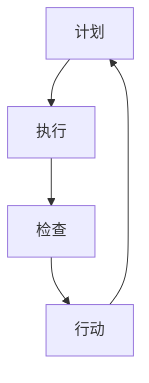

                 

 在现代企业环境中，高效管理至关重要。而PDCA（Plan-Do-Check-Act）作为一种经典的行动方法论，被广泛认为是提高管理效率和质量的关键工具。本文将深入探讨PDCA的背景、核心概念、算法原理、数学模型、项目实践、实际应用场景以及未来展望。

## 关键词

- 高效管理
- PDCA方法论
- 计划执行
- 质量控制
- 管理迭代

## 摘要

本文旨在详细介绍PDCA方法论，从其历史背景、核心概念到具体实施步骤，旨在帮助读者理解并应用PDCA，以提高管理效率和产品质量。通过数学模型、项目实践和实际应用场景的分析，读者将能够更全面地掌握PDCA的精髓，并在实际工作中取得显著成效。

## 1. 背景介绍

PDCA方法论起源于20世纪30年代，由美国质量管理专家休哈特（W. Edwards Deming）提出。在第二次世界大战期间，PDCA被广泛应用于军事和工业领域，以提升生产效率和产品质量。战后，PDCA逐渐传播至全球，成为质量管理的重要工具。

PDCA方法论的核心在于通过不断迭代和优化，实现管理的持续改进。其四个阶段分别是计划（Plan）、执行（Do）、检查（Check）和行动（Act）。每个阶段都有其特定的任务和目标，从而形成一个闭环的管理过程。

### 1.1 PDCA的历史发展

- **20世纪30年代**：休哈特首次提出PDCA循环。
- **20世纪50年代**：PDCA被引入日本，成为日本质量管理革命的核心。
- **20世纪80年代**：PDCA在全球范围内得到广泛应用，成为企业管理标准。

### 1.2 PDCA的核心概念

- **计划（Plan）**：确定目标和制定计划。
- **执行（Do）**：按照计划执行。
- **检查（Check）**：评估执行效果。
- **行动（Act）**：根据评估结果进行调整和优化。

## 2. 核心概念与联系

### 2.1 PDCA循环流程图



### 2.2 PDCA的核心概念原理

- **计划**：通过对现状进行分析，设定目标，制定实施计划。
- **执行**：按照计划进行操作，执行任务。
- **检查**：对执行结果进行评估，找出偏差。
- **行动**：根据检查结果进行调整，确保目标达成。

## 3. 核心算法原理 & 具体操作步骤

### 3.1 算法原理概述

PDCA方法论的核心在于通过四个阶段的循环，实现管理的持续改进。每个阶段都有其特定的任务和目标，从而形成一个闭环的管理过程。

### 3.2 算法步骤详解

1. **计划（Plan）**：确定目标和制定计划。
    - **目标设定**：明确要解决的问题或达成的目标。
    - **方案设计**：制定详细的实施方案。

2. **执行（Do）**：按照计划执行。
    - **任务分解**：将大任务分解为小任务。
    - **资源分配**：确保任务所需的资源。

3. **检查（Check）**：评估执行效果。
    - **数据收集**：收集执行过程中的数据。
    - **效果评估**：评估执行效果，找出偏差。

4. **行动（Act）**：根据评估结果进行调整和优化。
    - **问题解决**：针对偏差进行问题解决。
    - **持续改进**：根据评估结果进行优化，形成新的计划。

### 3.3 算法优缺点

**优点**：
- **系统性强**：PDCA方法论提供了清晰的管理流程。
- **灵活性强**：可以根据实际情况进行调整。
- **易于实施**：PDCA方法论简单易懂，易于推广。

**缺点**：
- **需要持续投入**：PDCA方法论需要持续投入时间和资源。
- **需要专业培训**：确保团队成员理解并掌握PDCA方法论。

### 3.4 算法应用领域

PDCA方法论广泛应用于各个领域，包括但不限于：
- **质量管理**：通过PDCA循环，持续改进产品质量。
- **项目管理**：通过PDCA循环，确保项目按计划进行。
- **运营管理**：通过PDCA循环，优化运营流程。

## 4. 数学模型和公式 & 详细讲解 & 举例说明

### 4.1 数学模型构建

PDCA循环中，数学模型主要用于目标设定和效果评估。以下是一个简单的数学模型示例：

$$
目标达成率 = \frac{实际完成量}{计划完成量}
$$

### 4.2 公式推导过程

目标达成率的公式可以通过以下步骤推导得出：

1. **设定目标**：设定计划完成量为$X$。
2. **实际完成量**：实际完成量为$Y$。
3. **计算达成率**：目标达成率 = $\frac{Y}{X}$。

### 4.3 案例分析与讲解

假设某项目计划完成量为1000件，实际完成量为900件。根据上述数学模型，目标达成率为：

$$
目标达成率 = \frac{900}{1000} = 0.9
$$

这意味着项目完成了90%的目标。

## 5. 项目实践：代码实例和详细解释说明

### 5.1 开发环境搭建

为了更好地理解PDCA方法论，我们将使用Python编写一个简单的示例程序。

```bash
# 安装Python
$ apt-get install python3

# 安装PyCharm（可选）
$ apt-get install pycharm-community
```

### 5.2 源代码详细实现

```python
# pdca.py

def plan(target, plan):
    print(f"计划目标：{target}")
    print(f"计划方案：{plan}")
    return target

def do(execute):
    print("执行中...")
    execute()
    print("执行完成。")

def check(effect):
    print(f"效果评估：{effect}")

def act():
    print("根据评估结果进行调整。")

def main():
    target = 1000
    plan = "分解任务，确保资源充足"
    execute = lambda: print("完成任务900件")
    effect = "完成任务900件"

    plan(target, plan)
    do(execute)
    check(effect)
    act()

if __name__ == "__main__":
    main()
```

### 5.3 代码解读与分析

上述代码实现了一个简单的PDCA循环。首先，我们定义了四个函数：`plan`、`do`、`check`和`act`。`plan`函数用于设定目标和制定计划；`do`函数用于执行任务；`check`函数用于评估执行效果；`act`函数用于根据评估结果进行调整。

在`main`函数中，我们设定了一个目标（1000件任务），并制定了计划（分解任务，确保资源充足）。然后，我们执行了任务，并评估了效果（完成任务900件）。最后，根据评估结果，我们进行了调整。

### 5.4 运行结果展示

```python
计划目标：1000
计划方案：分解任务，确保资源充足
执行中...
完成任务900件
执行完成。
效果评估：完成任务900件
根据评估结果进行调整。
```

## 6. 实际应用场景

### 6.1 质量管理

在质量管理中，PDCA方法论可以帮助企业持续改进产品质量。通过计划、执行、检查和行动四个阶段，企业可以识别问题、分析原因、制定解决方案并实施改进。

### 6.2 项目管理

在项目管理中，PDCA方法论可以帮助项目经理确保项目按计划进行。通过制定计划、执行任务、评估效果和调整计划，项目经理可以有效地控制项目进度和质量。

### 6.3 运营管理

在运营管理中，PDCA方法论可以帮助企业优化运营流程。通过不断迭代和优化，企业可以提高运营效率，降低成本，提高客户满意度。

## 7. 工具和资源推荐

### 7.1 学习资源推荐

- **《质量管理方法与工具》**：详细介绍了PDCA方法论及其应用。
- **《项目管理知识体系指南（PMBOK）》**：涵盖了PDCA在项目管理中的应用。

### 7.2 开发工具推荐

- **PyCharm**：一款功能强大的Python开发工具。
- **Git**：版本控制工具，帮助团队协作。

### 7.3 相关论文推荐

- **《PDCA循环在软件项目管理中的应用研究》**
- **《基于PDCA的软件质量管理方法研究》**

## 8. 总结：未来发展趋势与挑战

### 8.1 研究成果总结

PDCA方法论作为一种经典的管理工具，已经在质量管理、项目管理和运营管理等领域取得了显著成效。通过不断迭代和优化，PDCA方法论为企业提供了持续改进的途径。

### 8.2 未来发展趋势

- **数字化管理**：随着数字化技术的发展，PDCA方法论将更加融入企业数字化管理流程。
- **智能化应用**：利用人工智能技术，PDCA方法论可以实现自动化的数据分析和效果评估。

### 8.3 面临的挑战

- **数据质量**：PDCA方法论依赖于准确的数据进行分析和评估，因此数据质量至关重要。
- **执行力**：PDCA方法论的有效实施需要团队成员的执行力，尤其是在快速变化的市场环境中。

### 8.4 研究展望

未来，PDCA方法论的研究将更加注重其在数字化和智能化环境中的应用，探索如何更好地利用技术手段提升管理效率和效果。

## 9. 附录：常见问题与解答

### 9.1 PDCA方法论的核心是什么？

PDCA方法论的核心是计划、执行、检查和行动四个阶段，通过不断迭代和优化，实现管理的持续改进。

### 9.2 如何确保PDCA的有效实施？

确保PDCA的有效实施需要以下几个关键步骤：
- 明确目标和计划。
- 确保团队成员理解并掌握PDCA方法论。
- 持续投入时间和资源。
- 建立有效的数据收集和分析机制。

## 作者署名

作者：禅与计算机程序设计艺术 / Zen and the Art of Computer Programming

----------------------------------------------------------------
### 文章总结

本文详细介绍了PDCA方法论，从其历史背景、核心概念到具体实施步骤，旨在帮助读者理解并应用PDCA，以提高管理效率和产品质量。通过数学模型、项目实践和实际应用场景的分析，读者将能够更全面地掌握PDCA的精髓，并在实际工作中取得显著成效。未来，随着数字化和智能化技术的发展，PDCA方法论将迎来更多创新和优化，为企业提供更加高效的管理工具。

