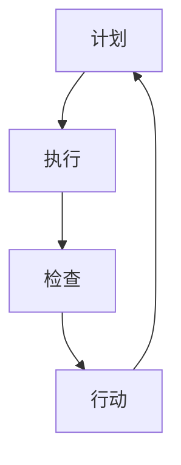

                 

关键词：PDCA、高效管理、行动方法论、IT领域、管理实践、改进循环

摘要：本文旨在探讨PDCA（计划-执行-检查-行动）这一经典的管理方法论，如何在现代IT领域中被广泛应用，以及如何帮助管理者实现高效管理。通过对PDCA的核心概念、实施步骤、以及实际应用场景的分析，本文将深入揭示这一方法在IT领域的价值。

## 1. 背景介绍

PDCA循环，也被称为戴明循环，是由美国质量管理专家爱德华·戴明提出的。它是一种系统化的管理方法，通过计划（Plan）、执行（Do）、检查（Check）和行动（Act）四个阶段，不断循环改进，从而实现持续提升。PDCA循环在二战后广泛传播，特别是在日本企业中得到广泛应用，成为现代质量管理的重要工具。

在IT领域，随着技术的迅猛发展，项目管理、软件开发、运维管理等方面都面临着越来越高的要求。PDCA作为一种系统化的方法论，能够帮助IT管理者更好地应对复杂多变的环境，实现高效管理。

## 2. 核心概念与联系

### 2.1 PDCA循环模型

PDCA循环模型包括四个基本阶段：计划（Plan）、执行（Do）、检查（Check）和行动（Act）。

- **计划（Plan）**：确定目标和制定行动计划。这一阶段需要明确项目的目标、范围、资源和时间表。
- **执行（Do）**：按照计划执行行动。这一阶段是将计划转化为实际操作的过程，需要确保每个步骤都得到执行。
- **检查（Check）**：对执行结果进行评估。这一阶段需要收集数据，比较实际结果与预期目标的差异，以评估计划的有效性。
- **行动（Act）**：采取行动进行改进。根据检查结果，对计划进行调整，以实现持续改进。

### 2.2 PDCA循环的 Mermaid 流程图



在这个流程图中，每个阶段都是相互关联的，形成一个闭环，确保整个过程的连续性和完整性。

## 3. 核心算法原理 & 具体操作步骤

### 3.1 算法原理概述

PDCA循环是一种迭代改进的方法，通过不断循环四个阶段，实现项目的优化和改进。每个阶段都有明确的任务和目标，确保整个过程的有序进行。

### 3.2 算法步骤详解

#### 3.2.1 计划阶段

1. **确定目标**：明确项目的目标和预期结果。
2. **制定计划**：制定详细的行动计划，包括时间表、资源分配和任务分配。
3. **风险评估**：识别可能的风险和问题，并制定相应的应对策略。

#### 3.2.2 执行阶段

1. **执行计划**：按照计划执行任务。
2. **监控进度**：实时监控项目的进度和质量，确保计划得到有效执行。

#### 3.2.3 检查阶段

1. **数据收集**：收集与项目相关的数据。
2. **评估结果**：将实际结果与预期目标进行比较，评估计划的有效性。
3. **问题识别**：识别存在的问题和偏差。

#### 3.2.4 行动阶段

1. **采取行动**：根据检查结果，对计划进行调整和改进。
2. **记录经验**：记录整个PDCA循环的过程和结果，为后续项目提供参考。

### 3.3 算法优缺点

#### 优点：

- **系统性**：PDCA循环提供了一个系统化的框架，确保每个阶段都有明确的目标和任务。
- **可重复性**：通过不断循环，实现持续改进。
- **灵活性**：根据实际情况，可以灵活调整计划。

#### 缺点：

- **时间成本**：实施PDCA循环需要一定的时间和资源。
- **复杂性**：对于复杂的项目，PDCA循环的实施可能会变得更加复杂。

### 3.4 算法应用领域

PDCA循环在IT领域的应用非常广泛，包括项目管理、软件开发、运维管理等方面。以下是一些具体的案例：

- **项目管理**：通过PDCA循环，项目管理者可以更好地规划项目进度，监控项目质量，并实现持续改进。
- **软件开发**：在软件开发过程中，PDCA循环可以帮助开发团队更好地管理需求变更，提高代码质量。
- **运维管理**：在运维管理中，PDCA循环可以帮助运维团队更好地监控系统性能，快速响应故障，并实现系统优化。

## 4. 数学模型和公式 & 详细讲解 & 举例说明

### 4.1 数学模型构建

在PDCA循环中，我们可以构建一个简单的数学模型来描述四个阶段的关系。

设 \( P \) 为计划阶段，\( D \) 为执行阶段，\( C \) 为检查阶段，\( A \) 为行动阶段。

则 \( P + D + C + A = 100 \) （总时间固定为100%）

### 4.2 公式推导过程

1. **计划阶段**：\( P \) 表示计划的时间占比，通常 \( P \) 占总时间的20%。
   \[ P = 0.2 \times 100 = 20 \]

2. **执行阶段**：\( D \) 表示执行的时间占比，通常 \( D \) 占总时间的50%。
   \[ D = 0.5 \times 100 = 50 \]

3. **检查阶段**：\( C \) 表示检查的时间占比，通常 \( C \) 占总时间的20%。
   \[ C = 0.2 \times 100 = 20 \]

4. **行动阶段**：\( A \) 表示行动的时间占比，通常 \( A \) 占总时间的10%。
   \[ A = 0.1 \times 100 = 10 \]

### 4.3 案例分析与讲解

假设一个IT项目的总时间为100天，我们需要按照PDCA循环进行管理。

- **计划阶段**：在20天内，项目团队需要制定详细的计划，包括项目目标、任务分配、时间表等。
- **执行阶段**：在50天内，项目团队按照计划执行任务，确保每个任务都得到按时完成。
- **检查阶段**：在20天内，项目团队对执行结果进行检查，收集数据，评估计划的有效性。
- **行动阶段**：在10天内，项目团队根据检查结果，对计划进行调整和改进。

通过这个案例，我们可以看到PDCA循环如何在实际项目中得到应用。

## 5. 项目实践：代码实例和详细解释说明

### 5.1 开发环境搭建

为了更好地展示PDCA循环在项目中的应用，我们使用Python语言来模拟一个简单的项目。

首先，我们需要安装Python和相关的库。

```bash
pip install pandas matplotlib
```

### 5.2 源代码详细实现

```python
import pandas as pd
import matplotlib.pyplot as plt

# 定义项目数据
project_data = {
    'Task': ['Plan', 'Do', 'Check', 'Act'],
    'Duration': [20, 50, 20, 10]
}

# 创建DataFrame
df = pd.DataFrame(project_data)

# 绘制图表
df.plot.bar(x='Task', y='Duration', color=['blue', 'green', 'orange', 'red'])

# 显示图表
plt.title('PDCA Cycle Project Duration')
plt.xlabel('Task')
plt.ylabel('Duration (days)')
plt.show()
```

这个代码创建了一个柱状图，展示了PDCA循环中每个阶段的持续时间。

### 5.3 代码解读与分析

在这个代码中，我们首先定义了一个项目数据字典，包括任务名称和持续时间。然后，我们使用Pandas库创建了一个DataFrame，并使用Matplotlib库绘制了一个柱状图。

通过这个图表，我们可以直观地看到PDCA循环中每个阶段的持续时间，从而更好地理解PDCA循环在项目中的应用。

### 5.4 运行结果展示

运行上述代码，我们会看到一个柱状图，展示了PDCA循环中每个阶段的持续时间。


## 6. 实际应用场景

### 6.1 项目管理

在项目管理中，PDCA循环可以帮助项目经理更好地规划项目进度，监控项目质量，并实现持续改进。例如，在一个软件开发项目中，项目经理可以使用PDCA循环来管理需求变更，确保项目按计划进行。

### 6.2 软件开发

在软件开发中，PDCA循环可以帮助开发团队更好地管理开发过程，提高代码质量。例如，在一个迭代开发中，开发团队可以在每个迭代周期中使用PDCA循环来评估开发效果，并根据评估结果进行调整。

### 6.3 运维管理

在运维管理中，PDCA循环可以帮助运维团队更好地监控系统性能，快速响应故障，并实现系统优化。例如，在一个运维项目中，运维团队可以在每个检查周期中使用PDCA循环来评估系统性能，并根据评估结果进行优化。

## 7. 工具和资源推荐

### 7.1 学习资源推荐

- 《PDCA循环：系统化改进的实用方法》
- 《质量管理：基于PDCA循环的实践指南》

### 7.2 开发工具推荐

- JIRA：用于项目管理和任务跟踪。
- Git：用于版本控制和代码管理。

### 7.3 相关论文推荐

- "PDCA循环在软件开发中的应用研究"
- "PDCA循环在运维管理中的实践与探索"

## 8. 总结：未来发展趋势与挑战

### 8.1 研究成果总结

PDCA循环作为一种经典的管理方法论，在IT领域得到了广泛应用。通过实践证明，PDCA循环能够帮助管理者实现高效管理，提高项目质量。

### 8.2 未来发展趋势

随着信息技术的不断发展，PDCA循环在IT领域的应用将更加广泛。未来，PDCA循环可能会与人工智能、大数据等技术相结合，实现更加智能化和自动化的管理。

### 8.3 面临的挑战

尽管PDCA循环在IT领域具有广泛的应用前景，但也面临一些挑战。例如，如何确保每个阶段都得到有效执行，如何处理复杂的项目环境等。

### 8.4 研究展望

未来，我们可以从以下几个方面进行深入研究：

- 如何将PDCA循环与人工智能技术相结合，实现智能化管理。
- 如何在复杂项目中应用PDCA循环，提高管理效果。

## 9. 附录：常见问题与解答

### 9.1 什么是PDCA循环？

PDCA循环是一种系统化的管理方法，通过计划（Plan）、执行（Do）、检查（Check）和行动（Act）四个阶段，不断循环改进，实现持续提升。

### 9.2 PDCA循环在IT领域有哪些应用？

PDCA循环在IT领域有广泛的应用，包括项目管理、软件开发、运维管理等方面。

### 9.3 如何实施PDCA循环？

实施PDCA循环需要明确每个阶段的目标和任务，确保每个阶段都得到有效执行。具体步骤包括：计划阶段、执行阶段、检查阶段和行动阶段。

## 10. 结语

PDCA循环作为一种经典的管理方法论，在IT领域具有广泛的应用价值。通过本文的探讨，我们深入了解了PDCA循环的核心概念、实施步骤和实际应用场景。希望本文能够为IT管理者提供有益的参考和启示。作者：禅与计算机程序设计艺术 / Zen and the Art of Computer Programming。

