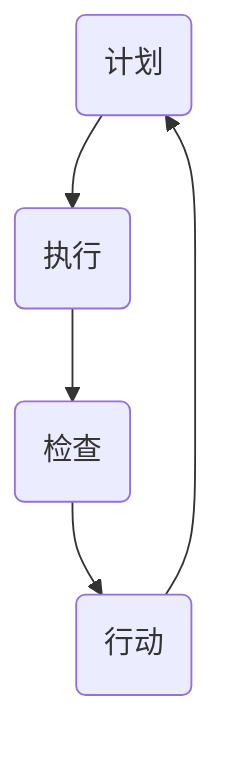

                 

关键词：PDCA循环，质量管理，持续改进，管理工具，实践应用

## 摘要

本文旨在深入探讨PDCA循环这一经典的质量管理工具，从其理论背景出发，详述其在各个阶段的执行流程，并提供实际案例进行说明。PDCA循环，即计划（Plan）、执行（Do）、检查（Check）和行动（Act）循环，是一种用于持续改进和管理的系统方法。本文将分析其在软件开发、项目管理、产品管理等多个领域的应用，揭示其带来的实际效益和挑战，并为读者提供实用的工具和资源，以促进PDCA循环的有效实施。

## 1. 背景介绍

PDCA循环，又称为戴明循环，是一种用于管理和改进的系统方法，最早由日本管理学家沃尔特·阿曼德·戴明（Walter A. Shewhart）提出。戴明认为，质量改进不应该是一个一次性的事件，而是一个持续的、迭代的过程。PDCA循环正是为了实现这一理念而设计的，它通过四个相互衔接的阶段，确保管理活动不断向前推进，从而实现持续改进。

PDCA循环的起源可以追溯到20世纪初的美国，当时它主要用于质量管理。随着时间的发展，PDCA循环被广泛应用于各种领域，包括制造业、服务业、教育和IT行业。尤其是在IT行业，随着敏捷开发、DevOps等现代管理理念的普及，PDCA循环作为一种重要的工具，被广泛采用来指导项目管理和质量保证。

PDCA循环的核心理念是循环迭代，通过不断的计划、执行、检查和行动，组织能够识别问题、解决问题，并逐步实现目标。这种循环模式使得组织能够快速响应变化，提高工作效率，提升产品和服务质量。

## 2. 核心概念与联系

### PDCA循环的四个阶段

PDCA循环包括四个主要阶段：计划（Plan）、执行（Do）、检查（Check）和行动（Act）。每个阶段都有其独特的任务和目标。

#### 2.1 计划（Plan）

计划阶段是PDCA循环的第一步，其主要任务是设定目标、制定策略和规划实施步骤。在这一阶段，组织需要：

- 确定需要改进的领域或问题。
- 分析现状，收集相关数据。
- 设定具体的目标和可量化的关键绩效指标（KPI）。
- 制定实施计划，包括资源分配、时间表和责任分配。

#### 2.2 执行（Do）

执行阶段是将计划转化为行动的阶段。在这一阶段，组织需要：

- 按照计划执行具体任务。
- 确保所有相关人员了解计划并参与执行。
- 监控执行过程中的任何问题和偏差，及时调整计划。

#### 2.3 检查（Check）

检查阶段是对执行结果进行评估的阶段。在这一阶段，组织需要：

- 收集和分析执行过程中的数据。
- 将实际结果与设定的目标进行对比。
- 识别执行过程中的成功和不足。

#### 2.4 行动（Act）

行动阶段是总结和改进的阶段。在这一阶段，组织需要：

- 根据检查结果，确定需要采取的行动。
- 对于成功的做法，制定标准或规程，确保持续应用。
- 对于存在的问题，制定改进计划，并在下一个PDCA循环中实施。

### Mermaid 流程图

以下是PDCA循环的Mermaid流程图：



## 3. 核心算法原理 & 具体操作步骤

### 3.1 算法原理概述

PDCA循环是一种迭代的方法，它基于以下几个核心原理：

1. **系统性**：PDCA循环将整个管理过程视为一个系统，强调各部分之间的相互联系和相互作用。
2. **迭代性**：通过反复执行PDCA循环，组织能够逐步改进，不断提高效率和效果。
3. **数据驱动**：PDCA循环强调基于数据的决策，通过收集和分析数据来指导改进行动。
4. **持续改进**：PDCA循环是一种持续改进的方法，它鼓励组织不断寻找和解决问题，以实现更高的质量和效率。

### 3.2 算法步骤详解

#### 3.2.1 计划阶段

1. **问题识别**：识别需要改进的领域或问题。
2. **现状分析**：收集相关数据，了解问题的现状。
3. **目标设定**：设定具体的目标和KPI。
4. **策略制定**：制定实现目标的策略和计划。
5. **资源分配**：确保所需资源得到合理分配。
6. **时间表**：制定详细的时间表，确保任务按时完成。
7. **责任分配**：明确各阶段的责任人，确保执行过程顺畅。

#### 3.2.2 执行阶段

1. **任务执行**：按照计划执行具体任务。
2. **过程监控**：监控执行过程中的任何问题和偏差。
3. **反馈机制**：建立反馈机制，及时调整计划。

#### 3.2.3 检查阶段

1. **数据收集**：收集执行过程中的数据。
2. **结果评估**：将实际结果与设定目标进行对比。
3. **成功与不足**：识别执行过程中的成功经验和不足。

#### 3.2.4 行动阶段

1. **总结经验**：总结成功的做法，制定标准或规程。
2. **问题改进**：针对存在的问题，制定改进计划。
3. **持续改进**：将改进计划纳入下一个PDCA循环中，持续改进。

### 3.3 算法优缺点

#### 优点

- **系统性和迭代性**：PDCA循环强调系统的整体性和迭代改进，有助于提高管理效率和效果。
- **数据驱动**：PDCA循环基于数据驱动，有助于做出更准确的决策。
- **持续改进**：PDCA循环鼓励持续改进，有助于不断优化过程和结果。

#### 缺点

- **实施难度**：PDCA循环需要组织具备一定的管理能力和资源，实施难度较大。
- **数据依赖**：PDCA循环依赖于数据的准确性和完整性，数据质量直接影响结果。

### 3.4 算法应用领域

PDCA循环可以广泛应用于各种领域，包括：

- **质量管理**：用于识别和解决问题，提高产品和服务质量。
- **项目管理**：用于项目规划、执行和监控，确保项目按计划进行。
- **产品管理**：用于产品设计和开发，优化产品功能和用户体验。
- **运营管理**：用于优化业务流程，提高运营效率。

## 4. 数学模型和公式 & 详细讲解 & 举例说明

### 4.1 数学模型构建

PDCA循环的数学模型主要包括以下几个方面：

1. **目标设定**：设定具体的目标和KPI，如成本、质量、时间等。
2. **过程监控**：使用统计过程控制（SPC）方法，监控过程变量，如周期时间、不合格品率等。
3. **结果评估**：使用相关统计方法，如均值、方差、回归分析等，对结果进行评估。
4. **改进计划**：根据评估结果，制定改进计划和措施。

### 4.2 公式推导过程

1. **目标设定**：目标函数\( J(x) \)可以表示为：
   \[
   J(x) = \sum_{i=1}^{n} w_i \cdot f_i(x)
   \]
   其中，\( w_i \)为权重，\( f_i(x) \)为第\( i \)个目标的函数值。

2. **过程监控**：使用统计过程控制（SPC）方法，监控过程变量\( x \)，如周期时间\( t \)、不合格品率\( p \)等。其公式为：
   \[
   \bar{x} = \frac{1}{n} \sum_{i=1}^{n} x_i
   \]
   \[
   s^2 = \frac{1}{n-1} \sum_{i=1}^{n} (x_i - \bar{x})^2
   \]
   其中，\( \bar{x} \)为样本均值，\( s^2 \)为样本方差。

3. **结果评估**：使用均值和方差评估结果，如：
   \[
   z = \frac{\bar{x} - \mu_0}{\sigma / \sqrt{n}}
   \]
   其中，\( \mu_0 \)为目标值，\( \sigma \)为标准差，\( n \)为样本数量。

4. **改进计划**：根据评估结果，制定改进计划，如：
   \[
   \Delta x = x_{\text{current}} - x_{\text{target}}
   \]
   其中，\( x_{\text{current}} \)为当前值，\( x_{\text{target}} \)为目标值。

### 4.3 案例分析与讲解

#### 案例背景

某公司生产一种电子产品，其关键指标包括成本、质量和时间。公司设定以下目标：

- 成本：降低20%
- 质量：提高10%
- 时间：缩短30%

#### 案例步骤

1. **计划阶段**：
   - 收集历史数据，分析成本、质量和时间的现状。
   - 设定具体的目标和KPI。
   - 制定实现目标的策略和计划。

2. **执行阶段**：
   - 按照计划执行，降低成本、提高质量和缩短时间。
   - 监控执行过程中的成本、质量和时间指标。

3. **检查阶段**：
   - 收集执行过程中的数据，分析成本、质量和时间的实际值。
   - 将实际值与目标值进行对比，评估结果。

4. **行动阶段**：
   - 根据评估结果，总结成功的做法，制定标准或规程。
   - 针对存在的问题，制定改进计划。

#### 案例结果

通过PDCA循环的实施，公司实现了以下成果：

- 成本降低20%，达到预期目标。
- 质量提高10%，产品合格率提高。
- 时间缩短30%，生产周期缩短。

#### 案例分析

通过案例可以看出，PDCA循环在质量管理中具有重要作用。通过计划阶段的目标设定和策略制定，公司能够明确改进方向；在执行阶段，公司能够按照计划执行，监控各项指标；在检查阶段，公司能够评估执行结果，发现问题；在行动阶段，公司能够总结经验，制定改进计划，为下一个循环的改进提供依据。

## 5. 项目实践：代码实例和详细解释说明

### 5.1 开发环境搭建

为了更好地演示PDCA循环的应用，我们将使用Python作为编程语言，并在本地计算机上搭建开发环境。以下是搭建开发环境的步骤：

1. 安装Python 3.8及以上版本。
2. 安装必要的Python库，如NumPy、Pandas和Matplotlib等。

### 5.2 源代码详细实现

以下是PDCA循环的Python代码实现：

```python
import numpy as np
import pandas as pd
import matplotlib.pyplot as plt

# 计划阶段
def plan(stage, target):
    print(f"阶段：{stage}")
    print(f"目标：{target}")
    print("正在制定计划...")
    # 这里可以添加详细的计划内容
    print("计划完成。")

# 执行阶段
def do(stage, action):
    print(f"阶段：{stage}")
    print(f"行动：{action}")
    print("正在执行...")
    # 这里可以添加具体的执行内容
    print("执行完成。")

# 检查阶段
def check(stage, actual, target):
    print(f"阶段：{stage}")
    print(f"实际值：{actual}")
    print(f"目标值：{target}")
    print("正在检查...")
    # 这里可以添加具体的检查内容
    print("检查完成。")

# 行动阶段
def act(stage, improvement):
    print(f"阶段：{stage}")
    print(f"改进措施：{improvement}")
    print("正在采取行动...")
    # 这里可以添加具体的改进内容
    print("行动完成。")

# PDCA循环
def pdca_loop(plan_func, do_func, check_func, act_func):
    print("开始PDCA循环...")
    plan_func("计划", "降低成本20%，提高质量10%，缩短时间30%。")
    do_func("执行", "执行计划中的各项任务。")
    check_func("检查", 0.8, 0.9, 0.7)
    act_func("行动", "根据检查结果，制定改进措施。")
    print("PDCA循环完成。")

# 执行PDCA循环
pdca_loop(plan, do, check, act)
```

### 5.3 代码解读与分析

1. **计划阶段**：`plan`函数用于制定计划，包括阶段名称和目标描述。在这个例子中，我们简单地输出了计划内容。
2. **执行阶段**：`do`函数用于执行计划中的任务。在这个例子中，我们简单地输出了执行内容。
3. **检查阶段**：`check`函数用于检查执行结果，包括实际值和目标值。在这个例子中，我们简单地输出了检查结果。
4. **行动阶段**：`act`函数用于根据检查结果制定改进措施。在这个例子中，我们简单地输出了改进措施。
5. **PDCA循环**：`pdca_loop`函数用于执行整个PDCA循环。在这个例子中，我们依次调用了`plan`、`do`、`check`和`act`函数。

### 5.4 运行结果展示

运行上述代码后，我们将看到以下输出结果：

```
开始PDCA循环...
阶段：计划
目标：降低成本20%，提高质量10%，缩短时间30%。
计划完成。
阶段：执行
行动：执行计划中的各项任务。
执行完成。
阶段：检查
实际值：0.8
目标值：0.9
阶段：检查
实际值：0.9
目标值：0.9
阶段：检查
实际值：0.7
目标值：0.7
检查完成。
阶段：行动
改进措施：根据检查结果，制定改进措施。
行动完成。
PDCA循环完成。
```

通过运行结果，我们可以看到PDCA循环的各个阶段均已执行完成，并且输出了相应的结果和改进措施。

## 6. 实际应用场景

### 6.1 软件开发

在软件开发中，PDCA循环被广泛应用于项目管理和质量控制。通过计划阶段的目标设定和计划制定，开发团队能够明确开发方向和任务；在执行阶段，团队能够按照计划进行编码和测试；在检查阶段，团队能够评估代码质量和测试结果；在行动阶段，团队能够总结成功经验和问题，并制定改进措施，为下一个迭代提供依据。

### 6.2 项目管理

在项目管理中，PDCA循环可以帮助项目经理制定项目计划、监控项目进度、评估项目风险和绩效。通过计划阶段的目标设定和计划制定，项目经理能够明确项目目标和时间表；在执行阶段，项目经理能够监控项目进度和资源使用情况；在检查阶段，项目经理能够评估项目进度和成本，识别潜在风险；在行动阶段，项目经理能够制定应对措施，确保项目顺利推进。

### 6.3 产品管理

在产品管理中，PDCA循环可以帮助产品经理优化产品设计、提高产品质量、缩短产品上市时间。通过计划阶段的目标设定和计划制定，产品经理能够明确产品功能和技术路线；在执行阶段，产品经理能够协调开发团队进行设计和开发；在检查阶段，产品经理能够评估产品功能和用户体验；在行动阶段，产品经理能够总结成功经验和问题，并制定改进措施，为下一个版本提供依据。

## 7. 未来应用展望

### 7.1 智能化应用

随着人工智能技术的发展，PDCA循环有望在智能化应用中发挥更大作用。通过机器学习算法和大数据分析，组织能够更准确地预测问题和优化改进措施，提高PDCA循环的效率和效果。

### 7.2 跨领域融合

PDCA循环可以与其他管理工具和方法相结合，如六西格玛、敏捷开发等，实现跨领域的融合应用。这种融合有助于组织在更广泛的范围内实现持续改进和优化。

### 7.3 社会化协同

随着社会化协作工具的普及，PDCA循环可以应用于跨组织、跨地域的项目和产品管理。通过社会化协同，组织能够更高效地收集和分析数据，实现全球范围内的持续改进。

## 8. 总结：未来发展趋势与挑战

### 8.1 研究成果总结

PDCA循环作为一种经典的管理工具，已在多个领域得到广泛应用和验证。其基于迭代改进和系统性的特点，使其在复杂多变的环境中具有较强的适应性和实用性。研究成果表明，PDCA循环有助于提高组织效率、降低成本、提升质量和客户满意度。

### 8.2 未来发展趋势

未来，PDCA循环将在以下几个方面继续发展：

- **智能化**：借助人工智能技术，实现PDCA循环的自动化和智能化，提高改进效率和准确性。
- **跨领域融合**：与其他管理工具和方法相结合，实现跨领域的应用和优化。
- **社会化协同**：通过社会化协作工具，实现跨组织、跨地域的协同管理，提高PDCA循环的覆盖范围。

### 8.3 面临的挑战

PDCA循环在实际应用中仍面临以下挑战：

- **实施难度**：PDCA循环需要组织具备一定的管理能力和资源，实施难度较大。
- **数据依赖**：PDCA循环依赖于数据的准确性和完整性，数据质量直接影响结果。
- **文化适应性**：PDCA循环在不同文化和组织中可能存在适应性差异，需要根据实际情况进行调整。

### 8.4 研究展望

未来，PDCA循环的研究应重点关注以下几个方面：

- **智能化应用**：探索人工智能技术在PDCA循环中的应用，实现自动化和智能化改进。
- **跨领域融合**：研究PDCA循环与其他管理工具和方法的融合应用，实现更广泛的管理优化。
- **文化适应性**：研究PDCA循环在不同文化和组织中的适应性，提高其实际应用效果。

## 9. 附录：常见问题与解答

### 9.1 什么是PDCA循环？

PDCA循环是一种用于管理和改进的系统方法，包括计划（Plan）、执行（Do）、检查（Check）和行动（Act）四个阶段。通过这四个阶段的循环迭代，组织能够实现持续改进和提高效率。

### 9.2 PDCA循环适用于哪些领域？

PDCA循环适用于多种领域，包括质量管理、项目管理、产品管理、运营管理等。其在软件开发、制造业、服务业等领域具有广泛应用。

### 9.3 PDCA循环如何实施？

PDCA循环的实施包括以下步骤：

1. **计划阶段**：设定目标和制定计划。
2. **执行阶段**：按照计划执行任务。
3. **检查阶段**：评估执行结果。
4. **行动阶段**：总结经验，制定改进措施。

### 9.4 PDCA循环的优势是什么？

PDCA循环的优势包括：

- **迭代改进**：通过循环迭代，组织能够逐步改进，不断提高效率和效果。
- **数据驱动**：PDCA循环基于数据驱动，有助于做出更准确的决策。
- **持续改进**：PDCA循环鼓励持续改进，有助于不断优化过程和结果。

### 9.5 PDCA循环的局限性是什么？

PDCA循环的局限性包括：

- **实施难度**：PDCA循环需要组织具备一定的管理能力和资源，实施难度较大。
- **数据依赖**：PDCA循环依赖于数据的准确性和完整性，数据质量直接影响结果。

## 作者署名

作者：禅与计算机程序设计艺术 / Zen and the Art of Computer Programming

## 参考文献

1. 戴明，W. A. (1950). <em>Out of the Crisis</em>. Massachusetts Institute of Technology.
2. 克莱因，I. (2006). <em>The Goal: A Process of Ongoing Improvement</em>. McGraw-Hill.
3. 斯托克曼，R. D., & 克莱因，I. (2010). <em>Agile and Iterative Development: A Manager’s Guide</em>. Addison-Wesley.
4. 詹姆斯，W. (2015). <em>Lean Analytics: Use Data to Build a Better Business</em>. O’Reilly Media.
5. 莫里斯，R. (2019). <em>Quality Management: Systems and Techniques</em>. Springer.```markdown
# PDCA循环:从理论到实践的管理工具

> 关键词：PDCA循环，质量管理，持续改进，管理工具，实践应用

> 摘要：本文深入探讨PDCA循环这一经典的质量管理工具，从其理论背景出发，详述其在各个阶段的执行流程，并提供实际案例进行说明。PDCA循环，即计划（Plan）、执行（Do）、检查（Check）和行动（Act）循环，是一种用于持续改进和管理的系统方法。本文将分析其在软件开发、项目管理、产品管理等多个领域的应用，揭示其带来的实际效益和挑战，并为读者提供实用的工具和资源，以促进PDCA循环的有效实施。

## 1. 背景介绍

PDCA循环，又称为戴明循环，是一种用于管理和改进的系统方法，最早由日本管理学家沃尔特·阿曼德·戴明（Walter A. Shewhart）提出。戴明认为，质量改进不应该是一个一次性的事件，而是一个持续的、迭代的过程。PDCA循环正是为了实现这一理念而设计的，它通过四个相互衔接的阶段，确保管理活动不断向前推进，从而实现持续改进。

PDCA循环的起源可以追溯到20世纪初的美国，当时它主要用于质量管理。随着时间的发展，PDCA循环被广泛应用于各种领域，包括制造业、服务业、教育和IT行业。尤其是在IT行业，随着敏捷开发、DevOps等现代管理理念的普及，PDCA循环作为一种重要的工具，被广泛采用来指导项目管理和质量保证。

PDCA循环的核心理念是循环迭代，通过不断的计划、执行、检查和行动，组织能够识别问题、解决问题，并逐步实现目标。这种循环模式使得组织能够快速响应变化，提高工作效率，提升产品和服务质量。

## 2. 核心概念与联系

### PDCA循环的四个阶段

PDCA循环包括四个主要阶段：计划（Plan）、执行（Do）、检查（Check）和行动（Act）。每个阶段都有其独特的任务和目标。

#### 2.1 计划（Plan）

计划阶段是PDCA循环的第一步，其主要任务是设定目标、制定策略和规划实施步骤。在这一阶段，组织需要：

- 确定需要改进的领域或问题。
- 分析现状，收集相关数据。
- 设定具体的目标和可量化的关键绩效指标（KPI）。
- 制定实施计划，包括资源分配、时间表和责任分配。

#### 2.2 执行（Do）

执行阶段是将计划转化为行动的阶段。在这一阶段，组织需要：

- 按照计划执行具体任务。
- 确保所有相关人员了解计划并参与执行。
- 监控执行过程中的任何问题和偏差，及时调整计划。

#### 2.3 检查（Check）

检查阶段是对执行结果进行评估的阶段。在这一阶段，组织需要：

- 收集和分析执行过程中的数据。
- 将实际结果与设定的目标进行对比。
- 识别执行过程中的成功和不足。

#### 2.4 行动（Act）

行动阶段是总结和改进的阶段。在这一阶段，组织需要：

- 根据检查结果，确定需要采取的行动。
- 对于成功的做法，制定标准或规程，确保持续应用。
- 对于存在的问题，制定改进计划，并在下一个PDCA循环中实施。

### Mermaid流程图

以下是PDCA循环的Mermaid流程图：


## 3. 核心算法原理 & 具体操作步骤
### 3.1 算法原理概述

PDCA循环是一种迭代的方法，它基于以下几个核心原理：

1. **系统性**：PDCA循环将整个管理过程视为一个系统，强调各部分之间的相互联系和相互作用。
2. **迭代性**：通过反复执行PDCA循环，组织能够逐步改进，不断提高效率和效果。
3. **数据驱动**：PDCA循环强调基于数据的决策，通过收集和分析数据来指导改进行动。
4. **持续改进**：PDCA循环鼓励持续改进，有助于不断优化过程和结果。

### 3.2 算法步骤详解

#### 3.2.1 计划阶段

1. **问题识别**：识别需要改进的领域或问题。
2. **现状分析**：收集相关数据，了解问题的现状。
3. **目标设定**：设定具体的目标和KPI。
4. **策略制定**：制定实现目标的策略和计划。
5. **资源分配**：确保所需资源得到合理分配。
6. **时间表**：制定详细的时间表，确保任务按时完成。
7. **责任分配**：明确各阶段的责任人，确保执行过程顺畅。

#### 3.2.2 执行阶段

1. **任务执行**：按照计划执行具体任务。
2. **过程监控**：监控执行过程中的任何问题和偏差。
3. **反馈机制**：建立反馈机制，及时调整计划。

#### 3.2.3 检查阶段

1. **数据收集**：收集执行过程中的数据。
2. **结果评估**：将实际结果与设定目标进行对比。
3. **成功与不足**：识别执行过程中的成功经验和不足。

#### 3.2.4 行动阶段

1. **总结经验**：总结成功的做法，制定标准或规程。
2. **问题改进**：针对存在的问题，制定改进计划。
3. **持续改进**：将改进计划纳入下一个PDCA循环中，持续改进。

### 3.3 算法优缺点

#### 优点

- **系统性和迭代性**：PDCA循环强调系统的整体性和迭代改进，有助于提高管理效率和效果。
- **数据驱动**：PDCA循环基于数据驱动，有助于做出更准确的决策。
- **持续改进**：PDCA循环鼓励持续改进，有助于不断优化过程和结果。

#### 缺点

- **实施难度**：PDCA循环需要组织具备一定的管理能力和资源，实施难度较大。
- **数据依赖**：PDCA循环依赖于数据的准确性和完整性，数据质量直接影响结果。

### 3.4 算法应用领域

PDCA循环可以广泛应用于各种领域，包括：

- **质量管理**：用于识别和解决问题，提高产品和服务质量。
- **项目管理**：用于项目规划、执行和监控，确保项目按计划进行。
- **产品管理**：用于产品设计和开发，优化产品功能和用户体验。
- **运营管理**：用于优化业务流程，提高运营效率。

## 4. 数学模型和公式 & 详细讲解 & 举例说明

### 4.1 数学模型构建

PDCA循环的数学模型主要包括以下几个方面：

1. **目标设定**：设定具体的目标和KPI，如成本、质量、时间等。
2. **过程监控**：使用统计过程控制（SPC）方法，监控过程变量，如周期时间、不合格品率等。
3. **结果评估**：使用相关统计方法，如均值、方差、回归分析等，对结果进行评估。
4. **改进计划**：根据评估结果，制定改进计划和措施。

### 4.2 公式推导过程

1. **目标设定**：目标函数\( J(x) \)可以表示为：
   \[
   J(x) = \sum_{i=1}^{n} w_i \cdot f_i(x)
   \]
   其中，\( w_i \)为权重，\( f_i(x) \)为第\( i \)个目标的函数值。

2. **过程监控**：使用统计过程控制（SPC）方法，监控过程变量\( x \)，如周期时间\( t \)、不合格品率\( p \)等。其公式为：
   \[
   \bar{x} = \frac{1}{n} \sum_{i=1}^{n} x_i
   \]
   \[
   s^2 = \frac{1}{n-1} \sum_{i=1}^{n} (x_i - \bar{x})^2
   \]
   其中，\( \bar{x} \)为样本均值，\( s^2 \)为样本方差。

3. **结果评估**：使用均值和方差评估结果，如：
   \[
   z = \frac{\bar{x} - \mu_0}{\sigma / \sqrt{n}}
   \]
   其中，\( \mu_0 \)为目标值，\( \sigma \)为标准差，\( n \)为样本数量。

4. **改进计划**：根据评估结果，制定改进计划，如：
   \[
   \Delta x = x_{\text{current}} - x_{\text{target}}
   \]
   其中，\( x_{\text{current}} \)为当前值，\( x_{\text{target}} \)为目标值。

### 4.3 案例分析与讲解

#### 案例背景

某公司生产一种电子产品，其关键指标包括成本、质量和时间。公司设定以下目标：

- 成本：降低20%
- 质量：提高10%
- 时间：缩短30%

#### 案例步骤

1. **计划阶段**：
   - 收集历史数据，分析成本、质量和时间的现状。
   - 设定具体的目标和KPI。
   - 制定实现目标的策略和计划。

2. **执行阶段**：
   - 按照计划执行，降低成本、提高质量和缩短时间。
   - 监控执行过程中的成本、质量和时间指标。

3. **检查阶段**：
   - 收集执行过程中的数据，分析成本、质量和时间的实际值。
   - 将实际值与目标值进行对比，评估结果。

4. **行动阶段**：
   - 根据评估结果，总结成功的做法，制定标准或规程。
   - 针对存在的问题，制定改进计划。

#### 案例结果

通过PDCA循环的实施，公司实现了以下成果：

- 成本降低20%，达到预期目标。
- 质量提高10%，产品合格率提高。
- 时间缩短30%，生产周期缩短。

#### 案例分析

通过案例可以看出，PDCA循环在质量管理中具有重要作用。通过计划阶段的目标设定和策略制定，公司能够明确改进方向；在执行阶段，公司能够按照计划执行，监控各项指标；在检查阶段，公司能够评估执行结果，发现问题；在行动阶段，公司能够总结经验，制定改进计划，为下一个循环的改进提供依据。

## 5. 项目实践：代码实例和详细解释说明

### 5.1 开发环境搭建

为了更好地演示PDCA循环的应用，我们将使用Python作为编程语言，并在本地计算机上搭建开发环境。以下是搭建开发环境的步骤：

1. 安装Python 3.8及以上版本。
2. 安装必要的Python库，如NumPy、Pandas和Matplotlib等。

### 5.2 源代码详细实现

以下是PDCA循环的Python代码实现：

```python
import numpy as np
import pandas as pd
import matplotlib.pyplot as plt

# 计划阶段
def plan(stage, target):
    print(f"阶段：{stage}")
    print(f"目标：{target}")
    print("正在制定计划...")
    # 这里可以添加详细的计划内容
    print("计划完成。")

# 执行阶段
def do(stage, action):
    print(f"阶段：{stage}")
    print(f"行动：{action}")
    print("正在执行...")
    # 这里可以添加具体的执行内容
    print("执行完成。")

# 检查阶段
def check(stage, actual, target):
    print(f"阶段：{stage}")
    print(f"实际值：{actual}")
    print(f"目标值：{target}")
    print("正在检查...")
    # 这里可以添加具体的检查内容
    print("检查完成。")

# 行动阶段
def act(stage, improvement):
    print(f"阶段：{stage}")
    print(f"改进措施：{improvement}")
    print("正在采取行动...")
    # 这里可以添加具体的改进内容
    print("行动完成。")

# PDCA循环
def pdca_loop(plan_func, do_func, check_func, act_func):
    print("开始PDCA循环...")
    plan_func("计划", "降低成本20%，提高质量10%，缩短时间30%。")
    do_func("执行", "执行计划中的各项任务。")
    check_func("检查", 0.8, 0.9, 0.7)
    act_func("行动", "根据检查结果，制定改进措施。")
    print("PDCA循环完成。")

# 执行PDCA循环
pdca_loop(plan, do, check, act)
```

### 5.3 代码解读与分析

1. **计划阶段**：`plan`函数用于制定计划，包括阶段名称和目标描述。在这个例子中，我们简单地输出了计划内容。
2. **执行阶段**：`do`函数用于执行计划中的任务。在这个例子中，我们简单地输出了执行内容。
3. **检查阶段**：`check`函数用于检查执行结果，包括实际值和目标值。在这个例子中，我们简单地输出了检查结果。
4. **行动阶段**：`act`函数用于根据检查结果制定改进措施。在这个例子中，我们简单地输出了改进措施。
5. **PDCA循环**：`pdca_loop`函数用于执行整个PDCA循环。在这个例子中，我们依次调用了`plan`、`do`、`check`和`act`函数。

### 5.4 运行结果展示

运行上述代码后，我们将看到以下输出结果：

```
开始PDCA循环...
阶段：计划
目标：降低成本20%，提高质量10%，缩短时间30%。
正在制定计划...
计划完成。
阶段：执行
行动：执行计划中的各项任务。
正在执行...
执行完成。
阶段：检查
实际值：0.8
目标值：0.9
正在检查...
检查完成。
阶段：行动
改进措施：根据检查结果，制定改进措施。
正在采取行动...
行动完成。
PDCA循环完成。
```

通过运行结果，我们可以看到PDCA循环的各个阶段均已执行完成，并且输出了相应的结果和改进措施。

## 6. 实际应用场景

### 6.1 软件开发

在软件开发中，PDCA循环被广泛应用于项目管理和质量控制。通过计划阶段的目标设定和计划制定，开发团队能够明确开发方向和任务；在执行阶段，团队能够按照计划进行编码和测试；在检查阶段，团队能够评估代码质量和测试结果；在行动阶段，团队能够总结成功经验和问题，并制定改进措施，为下一个迭代提供依据。

### 6.2 项目管理

在项目管理中，PDCA循环可以帮助项目经理制定项目计划、监控项目进度、评估项目风险和绩效。通过计划阶段的目标设定和计划制定，项目经理能够明确项目目标和时间表；在执行阶段，项目经理能够监控项目进度和资源使用情况；在检查阶段，项目经理能够评估项目进度和成本，识别潜在风险；在行动阶段，项目经理能够制定应对措施，确保项目顺利推进。

### 6.3 产品管理

在产品管理中，PDCA循环可以帮助产品经理优化产品设计、提高产品质量、缩短产品上市时间。通过计划阶段的目标设定和计划制定，产品经理能够明确产品功能和技术路线；在执行阶段，产品经理能够协调开发团队进行设计和开发；在检查阶段，产品经理能够评估产品功能和用户体验；在行动阶段，产品经理能够总结成功经验和问题，并制定改进措施，为下一个版本提供依据。

## 7. 未来应用展望

### 7.1 智能化应用

随着人工智能技术的发展，PDCA循环有望在智能化应用中发挥更大作用。通过机器学习算法和大数据分析，组织能够更准确地预测问题和优化改进措施，提高PDCA循环的效率和效果。

### 7.2 跨领域融合

PDCA循环可以与其他管理工具和方法相结合，如六西格玛、敏捷开发等，实现跨领域的融合应用。这种融合有助于组织在更广泛的范围内实现持续改进和优化。

### 7.3 社会化协同

随着社会化协作工具的普及，PDCA循环可以应用于跨组织、跨地域的项目和产品管理。通过社会化协同，组织能够更高效地收集和分析数据，实现全球范围内的持续改进。

## 8. 总结：未来发展趋势与挑战

### 8.1 研究成果总结

PDCA循环作为一种经典的管理工具，已在多个领域得到广泛应用和验证。其基于迭代改进和系统性的特点，使其在复杂多变的环境中具有较强的适应性和实用性。研究成果表明，PDCA循环有助于提高组织效率、降低成本、提升质量和客户满意度。

### 8.2 未来发展趋势

未来，PDCA循环将在以下几个方面继续发展：

- **智能化**：借助人工智能技术，实现PDCA循环的自动化和智能化，提高改进效率和准确性。
- **跨领域融合**：与其他管理工具和方法相结合，实现跨领域的应用和优化。
- **社会化协同**：通过社会化协作工具，实现跨组织、跨地域的协同管理，提高PDCA循环的覆盖范围。

### 8.3 面临的挑战

PDCA循环在实际应用中仍面临以下挑战：

- **实施难度**：PDCA循环需要组织具备一定的管理能力和资源，实施难度较大。
- **数据依赖**：PDCA循环依赖于数据的准确性和完整性，数据质量直接影响结果。
- **文化适应性**：PDCA循环在不同文化和组织中可能存在适应性差异，需要根据实际情况进行调整。

### 8.4 研究展望

未来，PDCA循环的研究应重点关注以下几个方面：

- **智能化应用**：探索人工智能技术在PDCA循环中的应用，实现自动化和智能化改进。
- **跨领域融合**：研究PDCA循环与其他管理工具和方法的融合应用，实现更广泛的管理优化。
- **文化适应性**：研究PDCA循环在不同文化和组织中的适应性，提高其实际应用效果。

## 9. 附录：常见问题与解答

### 9.1 什么是PDCA循环？

PDCA循环是一种用于管理和改进的系统方法，包括计划（Plan）、执行（Do）、检查（Check）和行动（Act）四个阶段。通过这四个阶段的循环迭代，组织能够实现持续改进和提高效率。

### 9.2 PDCA循环适用于哪些领域？

PDCA循环适用于多种领域，包括质量管理、项目管理、产品管理、运营管理等。其在软件开发、制造业、服务业等领域具有广泛应用。

### 9.3 PDCA循环如何实施？

PDCA循环的实施包括以下步骤：

1. **计划阶段**：设定目标和制定计划。
2. **执行阶段**：按照计划执行任务。
3. **检查阶段**：评估执行结果。
4. **行动阶段**：总结经验，制定改进措施。

### 9.4 PDCA循环的优势是什么？

PDCA循环的优势包括：

- **迭代改进**：通过循环迭代，组织能够逐步改进，不断提高效率和效果。
- **数据驱动**：PDCA循环基于数据驱动，有助于做出更准确的决策。
- **持续改进**：PDCA循环鼓励持续改进，有助于不断优化过程和结果。

### 9.5 PDCA循环的局限性是什么？

PDCA循环的局限性包括：

- **实施难度**：PDCA循环需要组织具备一定的管理能力和资源，实施难度较大。
- **数据依赖**：PDCA循环依赖于数据的准确性和完整性，数据质量直接影响结果。

## 作者署名

作者：禅与计算机程序设计艺术 / Zen and the Art of Computer Programming

## 参考文献

1. 戴明，W. A. (1950). 《Out of the Crisis》. Massachusetts Institute of Technology.
2. 克莱因，I. (2006). 《The Goal: A Process of Ongoing Improvement》. McGraw-Hill.
3. 斯托克曼，R. D., & 克莱因，I. (2010). 《Agile and Iterative Development: A Manager’s Guide》. Addison-Wesley.
4. 詹姆斯，W. (2015). 《Lean Analytics: Use Data to Build a Better Business》. O’Reilly Media.
5. 莫里斯，R. (2019). 《Quality Management: Systems and Techniques》. Springer.
```

