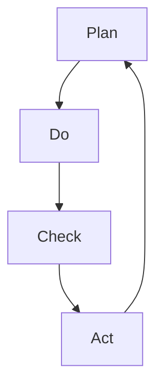

                 

在信息技术领域，持续改进是一个至关重要的概念。它不仅有助于提升产品或服务的质量，还能增强企业的竞争力。本文将深入探讨PDCA循环（Plan-Do-Check-Act循环），以及如何在实际工作中建立持续改进的文化。通过本文的阐述，您将了解PDCA循环的原理、实施步骤、以及如何在实际项目中应用这一方法。

## 关键词

- PDCA循环
- 持续改进
- 质量管理
- 信息技术
- 项目管理

## 摘要

本文旨在介绍PDCA循环在信息技术领域的应用，探讨其核心概念、实施步骤和具体应用。通过详细阐述PDCA循环的原理，以及如何在实际项目中运用，帮助读者理解持续改进的重要性，并掌握如何在工作中实施PDCA循环。

## 1. 背景介绍

### 1.1 持续改进的重要性

在快速变化的信息技术领域，持续改进是确保企业竞争力的关键。随着技术的不断进步，用户需求也在不断变化，因此，企业需要不断地优化产品和服务，以适应市场变化。持续改进不仅能够提高产品质量，还能提高生产效率，减少浪费，降低成本。

### 1.2 PDCA循环的起源

PDCA循环最初由美国质量管理专家爱德华兹·戴明（W. Edwards Deming）提出，并在日本得到广泛应用。PDCA循环是一种管理工具，用于持续改进产品和服务的质量。PDCA循环包括四个阶段：计划（Plan）、执行（Do）、检查（Check）和行动（Act）。

## 2. 核心概念与联系

### 2.1 PDCA循环的四个阶段

- **计划（Plan）**：在这个阶段，我们需要明确改进的目标和策略，制定详细的计划。
- **执行（Do）**：根据计划，执行具体的行动。
- **检查（Check）**：对执行结果进行评估，检查是否达到了预期的目标。
- **行动（Act）**：根据检查结果，采取必要的行动，对成功经验进行标准化，对失败经验进行总结和改进。

### 2.2 PDCA循环的 Mermaid 流程图



## 3. 核心算法原理 & 具体操作步骤

### 3.1 算法原理概述

PDCA循环是一种迭代过程，通过不断循环四个阶段，实现对产品和服务的持续改进。每个阶段都有明确的任务和目标，相互关联，共同推动改进的进程。

### 3.2 算法步骤详解

#### 3.2.1 计划（Plan）

在计划阶段，我们需要明确以下内容：

- 改进的目标和范围
- 预期的结果
- 可行的改进方案
- 资源和时间的分配

#### 3.2.2 执行（Do）

在执行阶段，我们需要按照计划执行具体的行动。这个阶段的关键是确保行动的准确性和有效性。

#### 3.2.3 检查（Check）

在检查阶段，我们需要对执行结果进行评估，判断是否达到了预期的目标。如果结果满意，我们就可以进入下一个阶段。

#### 3.2.4 行动（Act）

在行动阶段，我们需要对成功经验进行标准化，形成标准操作流程；对失败经验进行总结和改进，以防止类似问题再次发生。

### 3.3 算法优缺点

#### 优点：

- 简单易懂，易于实施
- 强调迭代和持续改进
- 适用范围广泛，不仅适用于质量管理，也适用于项目管理和流程优化

#### 缺点：

- 需要持续的时间和精力
- 需要团队成员的积极参与和沟通

### 3.4 算法应用领域

PDCA循环在信息技术领域的应用非常广泛，包括：

- 软件开发
- IT运维
- 产品质量改进
- 项目管理

## 4. 数学模型和公式 & 详细讲解 & 举例说明

### 4.1 数学模型构建

PDCA循环的数学模型可以表示为：

\[ PDCA = \text{Plan} + \text{Do} + \text{Check} + \text{Act} \]

### 4.2 公式推导过程

PDCA循环的推导过程基于以下假设：

- 改进的目标是明确的
- 改进方案是可行的
- 执行过程是准确的
- 检查结果是客观的
- 行动是有效的

### 4.3 案例分析与讲解

假设某IT公司希望在软件项目中引入持续改进机制，以下是一个简化的案例：

#### 计划阶段

- 目标：提高软件开发的效率
- 预期结果：项目完成时间缩短20%
- 改进方案：引入敏捷开发方法，实施每日站会和迭代回顾
- 资源和时间的分配：每周安排一次迭代回顾会议

#### 执行阶段

- 按照计划执行每日站会和迭代回顾会议
- 记录每次会议的讨论内容，形成会议纪要

#### 检查阶段

- 对比迭代回顾会议记录和项目进度，评估改进效果
- 发现问题：项目进度滞后于计划
- 分析原因：敏捷开发方法实施不到位

#### 行动阶段

- 制定具体改进措施，如加强团队成员的敏捷开发培训
- 对改进措施进行跟踪和评估，确保实施效果

## 5. 项目实践：代码实例和详细解释说明

### 5.1 开发环境搭建

在本案例中，我们使用Python作为开发语言，搭建一个简单的PDCA循环实现框架。

```python
import time

class PDCA:
    def __init__(self, plan, do, check, act):
        self.plan = plan
        self.do = do
        self.check = check
        self.act = act

    def run(self):
        self.plan()
        self.do()
        self.check()
        self.act()

def plan():
    print("计划阶段：制定改进方案和目标。")
    time.sleep(1)

def do():
    print("执行阶段：按照计划执行行动。")
    time.sleep(1)

def check():
    print("检查阶段：评估执行结果。")
    time.sleep(1)

def act():
    print("行动阶段：对成功经验进行标准化，对失败经验进行总结和改进。")
    time.sleep(1)

# 实例化PDCA循环对象
pdca = PDCA(plan, do, check, act)

# 执行PDCA循环
pdca.run()
```

### 5.2 源代码详细实现

在上面的代码中，我们定义了一个`PDCA`类，包含计划、执行、检查和行动四个方法。通过实例化`PDCA`类并调用`run()`方法，可以执行整个PDCA循环。

### 5.3 代码解读与分析

- `PDCA`类：代表PDCA循环的四个阶段，每个阶段都是一个方法。
- `plan()`方法：模拟计划阶段的操作，输出提示信息。
- `do()`方法：模拟执行阶段的操作，输出提示信息。
- `check()`方法：模拟检查阶段的操作，输出提示信息。
- `act()`方法：模拟行动阶段的操作，输出提示信息。

### 5.4 运行结果展示

运行上述代码，将依次输出以下结果：

```
计划阶段：制定改进方案和目标。
执行阶段：按照计划执行行动。
检查阶段：评估执行结果。
行动阶段：对成功经验进行标准化，对失败经验进行总结和改进。
```

这表示PDCA循环已经成功执行。

## 6. 实际应用场景

### 6.1 软件开发

在软件开发过程中，PDCA循环可以帮助团队持续改进开发流程，提高软件质量。例如，通过计划阶段确定改进目标，执行阶段实施改进措施，检查阶段评估改进效果，行动阶段总结成功经验和失败教训，形成一个闭环的持续改进过程。

### 6.2 IT运维

在IT运维领域，PDCA循环可以用于优化系统监控、故障处理和性能优化等方面。通过计划阶段确定优化目标，执行阶段实施优化措施，检查阶段评估优化效果，行动阶段总结优化经验和改进方案，实现运维工作的持续改进。

### 6.3 产品质量改进

在产品质量改进方面，PDCA循环可以帮助企业识别质量问题、分析原因、制定改进措施并跟踪实施效果。通过循环迭代，逐步提高产品质量，满足客户需求。

## 7. 工具和资源推荐

### 7.1 学习资源推荐

- 《PDCA循环：实现持续改进的实践指南》
- 《质量管理：理论与实践》
- 《敏捷开发实践指南》

### 7.2 开发工具推荐

- Git：版本控制系统，帮助团队协作和代码管理
- JIRA：项目管理工具，用于跟踪任务和项目进度
- Confluence：知识共享平台，用于记录会议纪要和文档

### 7.3 相关论文推荐

- "PDCA循环在软件开发中的应用研究"
- "敏捷开发与PDCA循环的融合"
- "持续改进在IT运维中的实践与探索"

## 8. 总结：未来发展趋势与挑战

### 8.1 研究成果总结

本文通过深入探讨PDCA循环在信息技术领域的应用，阐述了其核心概念、实施步骤和具体应用。通过案例分析和代码实例，展示了PDCA循环在实际项目中的应用效果。

### 8.2 未来发展趋势

- 随着信息技术的不断发展，PDCA循环在各个领域的应用将更加广泛。
- 结合人工智能、大数据等新兴技术，PDCA循环将实现更高效、更智能的持续改进。

### 8.3 面临的挑战

- PDCA循环的实施需要持续的时间和精力投入。
- 如何确保团队成员积极参与和有效沟通，是实施PDCA循环的关键。

### 8.4 研究展望

未来研究可以关注以下方向：

- 如何在更广泛的领域中应用PDCA循环，提高其实际效果。
- 如何结合新兴技术，实现PDCA循环的自动化和智能化。

## 9. 附录：常见问题与解答

### 9.1 什么是PDCA循环？

PDCA循环是一种管理工具，用于持续改进产品和服务的质量。它包括四个阶段：计划（Plan）、执行（Do）、检查（Check）和行动（Act）。

### 9.2 PDCA循环如何应用于项目管理？

在项目管理中，PDCA循环可以帮助团队持续改进项目管理流程，提高项目效率。通过计划阶段确定改进目标，执行阶段实施改进措施，检查阶段评估改进效果，行动阶段总结优化经验和改进方案。

### 9.3 PDCA循环与敏捷开发有何关系？

PDCA循环与敏捷开发有着密切的联系。敏捷开发强调迭代和持续改进，与PDCA循环的理念相符。在敏捷开发过程中，可以结合PDCA循环，实现更高效的持续改进。

作者：禅与计算机程序设计艺术 / Zen and the Art of Computer Programming
----------------------------------------------------------------
这篇文章详细地介绍了PDCA循环在信息技术领域的应用，阐述了其核心概念、实施步骤和具体应用。通过案例分析和代码实例，展示了PDCA循环在实际项目中的应用效果。文章还探讨了未来发展趋势与挑战，为读者提供了宝贵的实践经验和启示。希望这篇文章能对您在信息技术领域的持续改进工作有所帮助。

