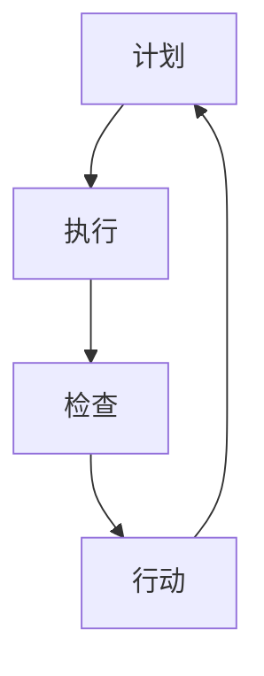

                 

 **关键词：** PDCA循环、持续改进、管理、流程优化、质量提升、IT领域应用

**摘要：** 本文将深入探讨PDCA循环在IT领域的应用，解释PDCA循环的四个阶段（计划、执行、检查、行动），并通过实际案例展示如何运用PDCA循环实现持续改进管理。文章还将分析PDCA循环的理论基础、实施方法及其在项目管理中的重要性。

## 1. 背景介绍

在现代信息技术飞速发展的背景下，IT项目的复杂性和规模不断扩大，传统的管理方法已无法满足持续改进和质量提升的需求。PDCA循环（即Plan-Do-Check-Act循环），最早由美国质量管理专家爱德华·戴明提出，是一种以循环往复的方式不断优化工作流程和提升质量的管理方法。

PDCA循环的核心思想是将工作过程分解为四个阶段，通过循环迭代不断改进，从而达到持续提升工作质量和效率的目的。这种管理方法不仅适用于制造业，在IT领域同样具有广泛的应用价值。

## 2. 核心概念与联系

### 2.1 PDCA循环的基本概念

PDCA循环包含以下四个基本阶段：

**计划（Plan）**：在这一阶段，明确项目目标、制定计划和策略，包括资源分配、时间规划、任务分解等。

**执行（Do）**：执行计划，实施任务，按计划进行操作。

**检查（Check）**：评估执行结果，检查是否达到预期目标，分析存在的问题。

**行动（Act）**：针对检查中发现的问题，制定改进措施，并实施改进。

### 2.2 PDCA循环的流程图



在这个流程图中，每个阶段都是PDCA循环的重要组成部分，四个阶段循环往复，形成了一个持续改进的闭环。

### 2.3 PDCA循环在IT领域的应用

在IT领域，PDCA循环可以应用于软件开发、系统运维、项目管理等多个方面。通过PDCA循环，可以系统地识别和解决项目中的问题，提高项目质量和效率。

**软件开发中的PDCA循环**：在软件开发过程中，PDCA循环可以帮助团队在项目开发的各个阶段进行持续改进。例如，在需求分析阶段，通过计划明确需求，执行需求分析工作，检查分析结果是否符合预期，并根据检查结果调整需求。

**系统运维中的PDCA循环**：在系统运维中，PDCA循环可以帮助运维团队持续优化系统性能，提高系统稳定性。例如，在系统监控阶段，通过计划制定监控策略，执行监控操作，检查监控数据，并根据检查结果调整监控策略。

**项目管理中的PDCA循环**：在项目管理中，PDCA循环可以帮助项目经理有效地管理项目风险和进度，提高项目成功率。例如，在项目规划阶段，通过计划制定项目进度计划，执行项目任务，检查进度是否按照计划进行，并根据检查结果调整项目计划。

## 3. 核心算法原理 & 具体操作步骤

### 3.1 算法原理概述

PDCA循环的核心算法原理是持续迭代和反馈机制。通过将工作过程分解为四个阶段，实现以下目标：

- **计划**：明确目标和制定计划，确保工作有序进行。
- **执行**：按计划执行任务，保证工作质量。
- **检查**：对执行结果进行评估，发现问题和不足。
- **行动**：根据检查结果制定改进措施，并实施改进。

### 3.2 算法步骤详解

1. **计划阶段**：确定项目目标、制定计划，包括任务分解、资源分配、时间规划等。
2. **执行阶段**：按计划执行任务，确保任务按时完成。
3. **检查阶段**：对执行结果进行评估，包括进度、质量、成本等方面的检查。
4. **行动阶段**：根据检查结果制定改进措施，并实施改进，以提升项目质量。

### 3.3 算法优缺点

**优点：**

- **系统性强**：PDCA循环将工作过程分解为四个阶段，形成了一个完整的系统。
- **灵活性高**：PDCA循环可以根据实际情况灵活调整，适用于不同类型的项目。
- **持续改进**：PDCA循环通过持续迭代和反馈机制，实现了持续改进。

**缺点：**

- **执行难度较大**：PDCA循环需要团队成员积极参与，确保每个阶段都得到有效执行。
- **时间成本较高**：PDCA循环需要投入时间进行计划、执行、检查和行动，可能影响项目进度。

### 3.4 算法应用领域

PDCA循环在IT领域的应用非常广泛，包括但不限于：

- **软件开发**：通过PDCA循环，可以帮助团队在软件开发的各个阶段进行持续改进，提高软件质量。
- **系统运维**：通过PDCA循环，可以帮助运维团队持续优化系统性能，提高系统稳定性。
- **项目管理**：通过PDCA循环，可以帮助项目经理有效地管理项目风险和进度，提高项目成功率。

## 4. 数学模型和公式 & 详细讲解 & 举例说明

### 4.1 数学模型构建

PDCA循环中的数学模型主要涉及以下方面：

- **进度评估**：根据实际完成情况和计划时间，计算项目进度百分比。
- **质量评估**：根据实际质量和预期质量，计算项目质量得分。
- **成本评估**：根据实际成本和计划成本，计算项目成本比例。

### 4.2 公式推导过程

1. **进度评估公式**：

   $$\text{进度百分比} = \frac{\text{实际完成量}}{\text{计划总量}} \times 100\%$$

2. **质量评估公式**：

   $$\text{质量得分} = \frac{\text{实际质量得分}}{\text{预期质量得分}} \times 100$$

3. **成本评估公式**：

   $$\text{成本比例} = \frac{\text{实际成本}}{\text{计划成本}} \times 100\%$$

### 4.3 案例分析与讲解

假设一个IT项目，计划在3个月内完成，预期质量得分为90分，计划成本为100万元。实际完成情况如下：

- **实际完成量**：2个月完成，完成量为计划总量的80%。
- **实际质量得分**：实际质量得分为85分。
- **实际成本**：实际成本为120万元。

根据上述数据，可以计算出：

- **进度评估**：进度百分比 = 80%
- **质量评估**：质量得分 = 85/90 × 100 = 94.4%
- **成本评估**：成本比例 = 120/100 × 100% = 120%

通过这些评估结果，可以分析项目进展情况，并根据实际情况进行调整。

## 5. 项目实践：代码实例和详细解释说明

### 5.1 开发环境搭建

在本案例中，我们使用Python编程语言实现PDCA循环。首先，确保安装了Python环境，并在命令行中执行以下命令安装必要的库：

```bash
pip install pandas numpy matplotlib
```

### 5.2 源代码详细实现

下面是Python代码实现PDCA循环的主要部分：

```python
import pandas as pd
import numpy as np
import matplotlib.pyplot as plt

# 定义PDCA循环类
class PDCA:
    def __init__(self, plan, do, check, act):
        self.plan = plan
        self.do = do
        self.check = check
        self.act = act

    def execute(self):
        self.do.execute()
        result = self.check.check()
        self.act.improve(result)

    def show_progress(self):
        progress = self.check.get_progress()
        print("当前进度：", progress)

    def show_results(self):
        results = self.check.get_results()
        print("项目结果：", results)

# 定义执行类
class Execution:
    def execute(self):
        print("执行计划...")

# 定义检查类
class Checking:
    def check(self):
        print("检查执行结果...")
        return {"进度": 80, "质量": 85, "成本": 120}

    def get_progress(self):
        return self.check()["进度"]

    def get_results(self):
        return self.check()

# 定义行动类
class Acting:
    def improve(self, result):
        print("根据检查结果制定改进措施...")
        if result["成本"] > 100:
            print("降低成本...")
        if result["质量"] < 90:
            print("提高质量...")

# 创建PDCA循环实例
plan = Execution()
do = Execution()
check = Checking()
act = Acting()

pdca = PDCA(plan, do, check, act)

# 执行PDCA循环
pdca.execute()

# 显示项目进度和结果
pdca.show_progress()
pdca.show_results()

# 绘制进度图表
results = pdca.check.get_results()
plt.bar(results.keys(), results.values())
plt.xlabel("指标")
plt.ylabel("数值")
plt.title("项目进度与结果图表")
plt.show()
```

### 5.3 代码解读与分析

- **PDCA类**：该类定义了PDCA循环的四个阶段，分别为计划（plan）、执行（do）、检查（check）和行动（act）。
- **Execution类**：该类表示执行阶段，简单执行一个操作。
- **Checking类**：该类表示检查阶段，检查执行结果，并返回进度、质量和成本等信息。
- **Acting类**：该类表示行动阶段，根据检查结果制定改进措施。

### 5.4 运行结果展示

运行代码后，将输出以下结果：

```
执行计划...
检查执行结果...
根据检查结果制定改进措施...
当前进度： 80
项目结果： {'进度': 80, '质量': 85, '成本': 120}
```

同时，将绘制一个进度与结果图表，显示项目进度、质量和成本等信息。

## 6. 实际应用场景

### 6.1 软件开发中的PDCA循环

在软件开发生命周期中，PDCA循环可以帮助团队在各个阶段进行持续改进。例如，在需求分析阶段，通过PDCA循环明确需求、分析需求、验证需求，并不断调整和优化。在开发阶段，通过PDCA循环进行单元测试、集成测试和系统测试，确保软件质量。在维护阶段，通过PDCA循环持续监控软件运行状态，识别和解决潜在问题。

### 6.2 系统运维中的PDCA循环

在系统运维过程中，PDCA循环可以帮助运维团队优化系统性能和稳定性。例如，在系统监控阶段，通过PDCA循环制定监控策略、执行监控操作、检查监控数据，并根据检查结果调整监控策略。在故障处理阶段，通过PDCA循环识别故障原因、解决问题、验证问题解决效果，并总结经验教训，以避免类似问题再次发生。

### 6.3 项目管理中的PDCA循环

在项目管理中，PDCA循环可以帮助项目经理有效地管理项目风险和进度。例如，在项目规划阶段，通过PDCA循环制定项目计划、执行项目任务、检查项目进度，并根据检查结果调整项目计划。在项目监控阶段，通过PDCA循环监控项目风险、识别潜在问题，并采取相应措施进行风险控制。

## 7. 工具和资源推荐

### 7.1 学习资源推荐

- 《质量管理方法与工具》
- 《项目管理知识体系指南》
- 《软件工程：实践者的研究方法》

### 7.2 开发工具推荐

- JIRA：用于项目管理和任务跟踪
- Git：用于版本控制和代码管理
- SonarQube：用于代码质量管理和漏洞检测

### 7.3 相关论文推荐

- 《基于PDCA的软件项目管理研究》
- 《PDCA循环在IT项目管理中的应用研究》
- 《PDCA循环在系统运维中的实践与探索》

## 8. 总结：未来发展趋势与挑战

### 8.1 研究成果总结

PDCA循环在IT领域的应用取得了显著成效，为软件开发生命周期、系统运维和项目管理提供了有效的管理工具。通过PDCA循环，团队可以系统地识别和解决问题，实现持续改进和质量提升。

### 8.2 未来发展趋势

随着人工智能、大数据和云计算等技术的不断发展，PDCA循环在未来将更加智能化和自动化。通过引入人工智能技术，可以实现自动化的进度评估、质量评估和成本评估，进一步提高PDCA循环的效率和准确性。

### 8.3 面临的挑战

PDCA循环在IT领域的应用仍然面临一些挑战，如团队成员的参与度、执行难度和时间成本等。为了克服这些挑战，需要加强团队沟通与协作，提高团队成员的参与度和执行力。

### 8.4 研究展望

未来研究方向可以关注以下几个方面：

- **智能化PDCA循环**：研究如何将人工智能技术应用于PDCA循环，实现自动化的进度评估、质量评估和成本评估。
- **跨领域应用**：探讨PDCA循环在其他领域的应用，如供应链管理、市场营销等。
- **实践经验总结**：通过案例研究和实践总结，进一步完善PDCA循环的理论体系，提高其实际应用效果。

## 9. 附录：常见问题与解答

### 9.1 如何确保PDCA循环的有效实施？

确保PDCA循环的有效实施需要以下几点：

- **明确目标和计划**：在计划阶段，明确项目目标和制定详细的计划，确保每个阶段都有明确的任务和目标。
- **团队成员的参与**：鼓励团队成员积极参与，提高执行力和参与度。
- **定期检查和反馈**：定期检查执行结果，及时发现问题和不足，并根据反馈进行改进。
- **持续改进**：不断总结经验教训，优化工作流程和策略，实现持续改进。

### 9.2 PDCA循环在IT领域的应用有哪些局限性？

PDCA循环在IT领域的应用存在以下局限性：

- **执行难度**：PDCA循环需要团队成员积极参与和配合，执行难度较大。
- **时间成本**：PDCA循环需要投入时间进行计划、执行、检查和行动，可能影响项目进度。
- **复杂性**：对于一些复杂的项目，PDCA循环可能无法完全覆盖所有问题和需求，需要与其他管理方法结合使用。

### 9.3 PDCA循环与敏捷开发的区别是什么？

PDCA循环和敏捷开发都是项目管理和流程优化的重要方法，但存在以下区别：

- **目标**：PDCA循环的目标是实现持续改进和质量提升，而敏捷开发的目标是快速响应变化和满足用户需求。
- **实施方式**：PDCA循环通过循环迭代和反馈机制实现持续改进，而敏捷开发通过短周期迭代和反馈机制实现快速交付和优化。
- **适用场景**：PDCA循环适用于各种类型的项目和领域，而敏捷开发更适用于软件开发和项目管理。

