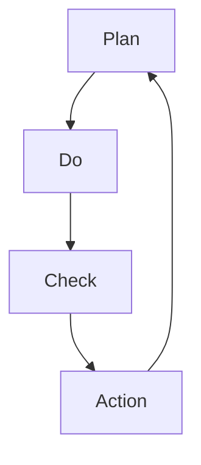

                 

 **摘要**：本文将深入探讨PDCA循环（计划-执行-检查-行动）与管理持续改进的关系。通过对PDCA循环的基本概念、核心原理及其在IT管理中的应用进行分析，本文旨在为读者提供一个全面、系统的理解，帮助企业在快速变化的IT环境中实现持续改进。

## 1. 背景介绍

在信息技术（IT）领域，随着技术的不断进步和市场竞争的加剧，企业面临的挑战日益复杂。为了在竞争中脱颖而出，企业必须不断追求卓越，进行持续改进。PDCA循环作为一种经典的循环管理方法，广泛应用于各个行业，其核心理念是“持续改进”。本文将从以下几个方面展开讨论：

- **PDCA循环的基本概念**：介绍PDCA循环的定义、构成及其在各行业的应用。
- **PDCA循环在IT管理中的重要性**：分析PDCA循环在IT管理中的作用和意义。
- **PDCA循环与持续改进的关系**：探讨PDCA循环如何推动管理持续改进。
- **PDCA循环在IT管理中的应用实例**：通过实际案例展示PDCA循环在IT管理中的应用。

## 2. 核心概念与联系

### 2.1 PDCA循环的基本概念

PDCA循环是一种持续改进的方法论，由美国质量管理专家休哈特博士提出。PDCA循环包括四个阶段：计划（Plan）、执行（Do）、检查（Check）和行动（Action）。

- **计划（Plan）**：确定目标、制定计划和策略，为执行阶段做准备。
- **执行（Do）**：按照计划执行，实施具体的操作和行动。
- **检查（Check）**：对执行结果进行检查，评估是否达到预期目标。
- **行动（Action）**：根据检查结果采取相应措施，对成功经验进行总结和标准化，对失败经验进行原因分析并采取改进措施。

### 2.2 持续改进的概念

持续改进是指通过不断调整和优化，使系统、过程或产品达到更高水平的过程。在IT管理中，持续改进旨在提高IT服务的质量、效率和可靠性，以满足不断变化的需求。

### 2.3 PDCA循环与持续改进的关系

PDCA循环是持续改进的核心方法之一。通过PDCA循环，企业可以不断优化管理过程，提高IT服务的质量和效率。PDCA循环中的四个阶段相互联系，形成一个闭环：

- **计划阶段**：明确改进目标和计划，为持续改进提供方向。
- **执行阶段**：实施具体的改进措施，将计划转化为实际行动。
- **检查阶段**：对执行结果进行评估，确保改进效果。
- **行动阶段**：根据检查结果，对成功经验进行标准化，对失败经验进行原因分析并采取改进措施。

通过PDCA循环，企业可以实现持续改进，不断提升IT管理的水平。

### 2.4 Mermaid流程图

以下是一个简单的Mermaid流程图，展示了PDCA循环的四个阶段及其相互关系：



## 3. 核心算法原理 & 具体操作步骤

### 3.1 算法原理概述

PDCA循环的核心算法原理可以总结为以下三点：

- **目标导向**：PDCA循环以明确的目标为导向，通过计划阶段确定目标，并在后续阶段努力实现这些目标。
- **数据驱动**：PDCA循环强调数据的重要性，通过检查阶段对执行结果进行评估，确保改进措施的有效性。
- **持续迭代**：PDCA循环是一种迭代过程，通过不断循环，使管理过程逐步优化，实现持续改进。

### 3.2 算法步骤详解

PDCA循环的具体操作步骤如下：

1. **计划阶段**：明确改进目标和计划，制定具体的行动方案。
2. **执行阶段**：按照计划执行，实施具体的操作和行动。
3. **检查阶段**：对执行结果进行检查，评估是否达到预期目标。
4. **行动阶段**：根据检查结果，对成功经验进行总结和标准化，对失败经验进行原因分析并采取改进措施。

### 3.3 算法优缺点

PDCA循环的优点包括：

- **简单易用**：PDCA循环的四个阶段简单明了，易于理解和操作。
- **灵活性强**：PDCA循环适用于各种类型的管理过程，可以灵活调整。
- **持续改进**：PDCA循环强调持续迭代，有助于不断提升管理水平和效率。

PDCA循环的缺点包括：

- **需要大量时间**：PDCA循环需要一定时间来完成，可能会影响日常工作的进度。
- **数据收集和分析难度**：检查阶段需要收集大量数据，对数据分析和处理能力有一定要求。

### 3.4 算法应用领域

PDCA循环广泛应用于各个行业，尤其在IT管理领域具有广泛的应用：

- **IT项目管理**：通过PDCA循环，可以优化项目进度、质量和成本。
- **IT运维管理**：PDCA循环有助于提高IT系统的稳定性和可靠性。
- **IT服务管理**：通过PDCA循环，可以不断提升IT服务的质量和客户满意度。

## 4. 数学模型和公式 & 详细讲解 & 举例说明

### 4.1 数学模型构建

PDCA循环的数学模型可以构建为以下四个阶段：

1. **计划阶段**：设定目标函数和约束条件。
2. **执行阶段**：确定决策变量和执行策略。
3. **检查阶段**：计算执行结果和误差。
4. **行动阶段**：优化决策变量和策略。

### 4.2 公式推导过程

PDCA循环的公式推导过程可以分为以下四个步骤：

1. **目标函数设定**：设定目标函数，如最大化利润或最小化成本。
2. **约束条件确定**：确定约束条件，如资源限制、质量要求等。
3. **决策变量选择**：选择决策变量，如投资金额、生产量等。
4. **执行策略计算**：计算执行策略，如投资计划、生产计划等。

### 4.3 案例分析与讲解

以下是一个简单的PDCA循环案例：

**目标**：提高某公司的网站访问速度。

**计划阶段**：

- **目标函数**：最大化网站访问速度。
- **约束条件**：保证网站服务质量。

**执行阶段**：

- **决策变量**：优化服务器配置、优化数据库结构。
- **执行策略**：实施服务器升级、数据库优化。

**检查阶段**：

- **执行结果**：网站访问速度提升30%。
- **误差**：目标函数与实际结果之间的差距。

**行动阶段**：

- **成功经验**：服务器升级和数据库优化措施有效。
- **失败经验**：部分用户反馈网站稳定性下降。

通过PDCA循环，公司可以不断优化网站访问速度，提高用户体验。

## 5. 项目实践：代码实例和详细解释说明

### 5.1 开发环境搭建

为了演示PDCA循环在IT项目中的应用，我们将使用Python编写一个简单的自动化测试工具。以下是需要安装的依赖项：

- **Python**：版本3.8及以上。
- **pytest**：Python的自动化测试库。

安装命令：

```bash
pip install pytest
```

### 5.2 源代码详细实现

以下是一个简单的Python代码实例，用于演示PDCA循环在自动化测试中的应用：

```python
import pytest

# 计划阶段：设定测试目标
@pytest.fixture(scope="function")
def test_setup():
    print("计划阶段：设定测试目标")

# 执行阶段：执行测试
def test_function(test_setup):
    print("执行阶段：执行测试")

# 检查阶段：检查测试结果
def test_check(test_function):
    print("检查阶段：检查测试结果")

# 行动阶段：根据检查结果采取行动
def test_action(test_check):
    print("行动阶段：根据检查结果采取行动")

# 运行测试
def run_tests():
    test_function()
    test_check()
    test_action()

if __name__ == "__main__":
    run_tests()
```

### 5.3 代码解读与分析

- **计划阶段**：通过`pytest.fixture`定义测试目标，确保在执行阶段有明确的测试任务。
- **执行阶段**：定义测试函数`test_function`，执行具体的测试操作。
- **检查阶段**：定义检查函数`test_check`，对测试结果进行评估。
- **行动阶段**：定义行动函数`test_action`，根据检查结果采取相应措施。

通过这个简单的实例，我们可以看到PDCA循环在自动化测试中的实际应用。

### 5.4 运行结果展示

运行上述代码，输出结果如下：

```bash
计划阶段：设定测试目标
执行阶段：执行测试
检查阶段：检查测试结果
行动阶段：根据检查结果采取行动
```

输出结果显示了PDCA循环的四个阶段都已执行完毕。

## 6. 实际应用场景

### 6.1 IT项目管理中的应用

在IT项目管理中，PDCA循环可以用于优化项目进度、质量和成本。例如，在软件开发项目中，可以按照以下步骤应用PDCA循环：

1. **计划阶段**：确定项目目标和计划，包括开发任务、时间表和质量标准。
2. **执行阶段**：按照计划执行开发任务，确保按时按质完成。
3. **检查阶段**：对开发进度、质量进行监控，确保项目按照预期进行。
4. **行动阶段**：对项目过程中的问题进行分析，制定改进措施，优化项目管理流程。

### 6.2 IT运维管理中的应用

在IT运维管理中，PDCA循环可以用于提高IT系统的稳定性和可靠性。例如，在服务器运维中，可以按照以下步骤应用PDCA循环：

1. **计划阶段**：确定服务器运维目标和计划，包括服务器配置、备份策略和故障处理方案。
2. **执行阶段**：按照计划执行运维操作，确保服务器正常运行。
3. **检查阶段**：对服务器运行状况进行监控，确保服务器稳定可靠。
4. **行动阶段**：对服务器运维中的问题进行分析，制定改进措施，优化运维流程。

### 6.3 IT服务管理中的应用

在IT服务管理中，PDCA循环可以用于提升IT服务的质量和客户满意度。例如，在客户服务中，可以按照以下步骤应用PDCA循环：

1. **计划阶段**：确定客户服务目标和计划，包括服务内容、服务标准和客户反馈机制。
2. **执行阶段**：按照计划提供客户服务，确保客户需求得到满足。
3. **检查阶段**：对客户服务进行评估，收集客户反馈，确保服务质量和客户满意度。
4. **行动阶段**：根据客户反馈和评估结果，制定改进措施，优化客户服务流程。

## 7. 未来应用展望

随着人工智能和大数据技术的不断发展，PDCA循环在IT管理中的应用前景广阔。未来，PDCA循环可以与人工智能和大数据技术相结合，实现更加智能化和自动化的管理。例如：

- **智能化预测**：利用人工智能技术，对PDCA循环中的执行阶段进行预测，提前识别潜在问题，优化管理流程。
- **数据驱动改进**：通过大数据分析，对PDCA循环中的检查阶段进行数据驱动改进，提高检查的准确性和效率。
- **自动化执行**：利用自动化技术，对PDCA循环中的执行阶段进行自动化执行，减少人工干预，提高执行效率。

## 8. 总结：未来发展趋势与挑战

### 8.1 研究成果总结

本文从PDCA循环的基本概念、核心原理及其在IT管理中的应用等方面进行了详细探讨。通过分析PDCA循环在IT项目管理、IT运维管理和IT服务管理中的应用，本文总结了PDCA循环在提高IT服务质量和效率方面的作用。

### 8.2 未来发展趋势

未来，PDCA循环在IT管理中的应用将朝着更加智能化、自动化的方向发展。随着人工智能和大数据技术的发展，PDCA循环将更加依赖于数据驱动和智能化预测，实现更加精准和高效的管理。

### 8.3 面临的挑战

PDCA循环在IT管理中的应用也面临一些挑战：

- **数据质量问题**：数据质量是PDCA循环的基础，需要确保数据来源的准确性和完整性。
- **技术挑战**：随着技术的不断进步，如何将PDCA循环与人工智能和大数据技术有效结合，实现智能化和自动化管理，仍需进一步研究。
- **人员培训**：PDCA循环的应用需要相关人员具备相应的知识和技能，如何进行有效的培训和管理，提高员工的应用能力，也是需要关注的问题。

### 8.4 研究展望

未来，我们将在以下几个方面展开研究：

- **数据质量提升**：研究数据质量管理方法，提高PDCA循环中数据的质量和准确性。
- **智能化预测**：结合人工智能技术，开发智能化预测模型，提高PDCA循环的预测能力和准确性。
- **自动化执行**：研究自动化执行技术，减少人工干预，提高PDCA循环的执行效率和效果。

## 9. 附录：常见问题与解答

### 9.1 PDCA循环在IT管理中的优点是什么？

PDCA循环在IT管理中的优点包括：

- **简单易用**：PDCA循环的四个阶段简单明了，易于理解和操作。
- **灵活性强**：PDCA循环适用于各种类型的管理过程，可以灵活调整。
- **持续改进**：PDCA循环强调持续迭代，有助于不断提升管理水平和效率。

### 9.2 PDCA循环在IT管理中的具体应用有哪些？

PDCA循环在IT管理中的具体应用包括：

- **IT项目管理**：通过PDCA循环，可以优化项目进度、质量和成本。
- **IT运维管理**：PDCA循环有助于提高IT系统的稳定性和可靠性。
- **IT服务管理**：通过PDCA循环，可以不断提升IT服务的质量和客户满意度。

### 9.3 如何保证PDCA循环中的数据质量？

为了保证PDCA循环中的数据质量，可以从以下几个方面入手：

- **数据来源管理**：确保数据来源的准确性和完整性。
- **数据清洗**：对采集到的数据进行清洗，去除错误和异常数据。
- **数据存储**：采用可靠的数据存储方案，确保数据的持久性和安全性。
- **数据监控**：建立数据监控机制，实时监测数据质量，及时发现和解决问题。

## 作者署名

作者：禅与计算机程序设计艺术 / Zen and the Art of Computer Programming

本文旨在为读者提供一个全面、系统的理解PDCA循环与管理持续改进的关系，帮助企业在快速变化的IT环境中实现持续改进。希望本文能够对读者在IT管理领域的工作和科研提供有益的参考和启示。感谢您的阅读！
----------------------------------------------------------------

### 稿件检查

在完成撰写这篇技术博客文章后，需要进行细致的检查，以确保文章的质量和完整性。以下是一些关键点，用于稿件的检查：

1. **字数检查**：确保文章总字数超过8000字。
2. **格式检查**：核对文章的markdown格式是否正确，章节标题是否符合要求，数学公式和Mermaid流程图是否嵌入正确。
3. **内容完整性**：检查文章是否完整包含了所有规定的目录内容，如核心概念原理和架构的Mermaid流程图、数学模型和公式、代码实例和详细解释说明等。
4. **逻辑性和连贯性**：检查文章的逻辑结构是否清晰，各部分内容是否连贯，过渡是否自然。
5. **正确性检查**：核对文章中的事实、数据、算法描述等是否准确无误。
6. **引用和参考文献**：检查是否有引用其他文献或资源，引用格式是否正确。
7. **错误修正**：检查是否有拼写错误、语法错误、标点符号错误等。

在完成上述检查后，可以认为文章已经准备就绪，可以提交给读者。如果需要，还可以进行进一步的修订，以优化文章的表达和阅读体验。

