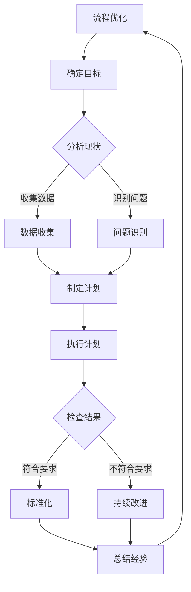

                 

关键词：PDCA循环、流程优化、质量改进、持续改进、流程管理

## 摘要

本文将探讨PDCA循环在流程优化中的应用。PDCA循环，即计划（Plan）、执行（Do）、检查（Check）和行动（Act）循环，是一种广泛应用于质量管理和其他管理领域的方法。本文将从PDCA循环的基本概念出发，深入分析其在流程优化中的重要性，并通过实际案例和具体步骤，展示如何有效地应用PDCA循环进行流程优化。

## 1. 背景介绍

随着企业竞争的日益激烈，流程优化已成为提高企业竞争力的重要手段。而PDCA循环作为一种全面的质量管理工具，能够帮助企业识别问题、分析原因、制定改进措施并持续优化流程。PDCA循环最早由美国质量管理专家戴明博士提出，并广泛应用于日本企业的质量管理中，取得了显著的效果。

### 1.1 PDCA循环的基本概念

PDCA循环是一种持续改进的循环过程，它包括以下四个阶段：

- **计划（Plan）**：在这个阶段，确定改进的目标和计划，包括设定目标和确定所需资源。
- **执行（Do）**：执行计划，实施改进措施，并进行初步的测试。
- **检查（Check）**：对执行结果进行检查，与预期目标进行比较，评估改进效果。
- **行动（Act）**：根据检查结果，采取必要的措施，包括对成功经验进行标准化和持续改进。

### 1.2 流程优化的必要性

流程优化是提高企业运营效率的关键。通过优化流程，企业可以减少资源浪费，提高生产效率，缩短产品交付周期，提高客户满意度。在当前快速变化的市场环境中，流程优化能够帮助企业保持竞争优势，实现可持续发展。

## 2. 核心概念与联系

为了更好地理解PDCA循环在流程优化中的作用，我们首先需要了解流程优化的核心概念和PDCA循环的基本原理。以下是流程优化和PDCA循环之间的联系：

### 2.1 流程优化核心概念

- **流程**：流程是一系列相互关联的活动，这些活动共同实现一个特定的业务目标。
- **优化**：优化是指通过改进流程，提高其效率、效果和质量的过程。

### 2.2 PDCA循环的基本原理

PDCA循环是一种持续改进的方法，它通过四个阶段不断循环，帮助企业识别问题、分析原因、制定改进措施并持续优化流程。PDCA循环的基本原理可以概括为：

- **计划**：设定目标和制定计划，明确改进的方向和措施。
- **执行**：执行计划，实施改进措施，并进行初步的测试。
- **检查**：对执行结果进行检查，与预期目标进行比较，评估改进效果。
- **行动**：根据检查结果，采取必要的措施，包括对成功经验进行标准化和持续改进。

### 2.3 Mermaid流程图

以下是流程优化和PDCA循环之间的Mermaid流程图：



### 2.4 核心算法原理 & 具体操作步骤

#### 2.4.1 算法原理概述

PDCA循环的算法原理主要基于以下三个步骤：

1. **问题识别**：通过数据收集和分析，识别流程中的问题和瓶颈。
2. **制定计划**：根据问题识别的结果，制定具体的改进计划和措施。
3. **执行与检查**：执行改进计划，并对执行结果进行检查和评估。

#### 2.4.2 算法步骤详解

1. **问题识别**：通过数据收集和分析，识别流程中的问题和瓶颈。这一步骤主要包括：
   - 收集流程数据，如时间、成本、质量等。
   - 分析数据，识别流程中的瓶颈和问题。

2. **制定计划**：根据问题识别的结果，制定具体的改进计划和措施。这一步骤主要包括：
   - 设定改进目标，明确改进的方向和目标。
   - 制定具体的改进措施，如流程优化、技术改进等。

3. **执行与检查**：执行改进计划，并对执行结果进行检查和评估。这一步骤主要包括：
   - 实施改进措施，进行初步测试。
   - 检查执行结果，与预期目标进行比较。
   - 根据检查结果，采取必要的措施，包括对成功经验进行标准化和持续改进。

#### 2.4.3 算法优缺点

PDCA循环的优点包括：

- **系统性**：PDCA循环是一种系统性的改进方法，能够帮助企业在各个阶段进行全面的分析和改进。
- **灵活性**：PDCA循环具有灵活性，可以根据实际情况进行调整和优化。

PDCA循环的缺点包括：

- **时间成本**：PDCA循环需要一定的时间成本，可能无法立即看到改进效果。
- **数据依赖性**：PDCA循环依赖于数据的准确性和完整性，否则可能导致错误的改进方向。

#### 2.4.4 算法应用领域

PDCA循环适用于各种流程优化场景，如生产制造、项目管理、客户服务等。以下是一些具体的算法应用领域：

- **生产制造**：通过PDCA循环优化生产流程，提高生产效率和产品质量。
- **项目管理**：通过PDCA循环优化项目流程，确保项目按期完成并达到预期目标。
- **客户服务**：通过PDCA循环优化客户服务流程，提高客户满意度和忠诚度。

## 3. 数学模型和公式

在PDCA循环中，数学模型和公式发挥着重要作用。以下是一些常用的数学模型和公式：

### 3.1 数学模型构建

PDCA循环的数学模型主要包括以下几个部分：

- **目标设定**：设定具体的目标值，如时间、成本、质量等。
- **数据收集**：收集相关数据，如时间、成本、质量等。
- **分析现状**：对收集的数据进行分析，识别流程中的问题和瓶颈。
- **制定计划**：根据分析结果，制定具体的改进计划。
- **执行计划**：执行改进计划，实施具体的改进措施。
- **检查结果**：检查执行结果，与预期目标进行比较。
- **持续改进**：根据检查结果，采取必要的措施，进行持续改进。

### 3.2 公式推导过程

以下是一个简单的PDCA循环的公式推导过程：

1. **目标设定**：

   设定目标值 \( T_d \)，如时间目标、成本目标、质量目标等。

   $$ T_d = T_0 - \Delta T $$

   其中，\( T_0 \) 为初始目标值，\( \Delta T \) 为改进后的目标值。

2. **数据收集**：

   收集相关数据 \( D \)，如时间数据、成本数据、质量数据等。

   $$ D = [d_1, d_2, \ldots, d_n] $$

3. **分析现状**：

   对收集的数据进行分析，识别流程中的问题和瓶颈。

   $$ P = \sum_{i=1}^{n} p_i $$

   其中，\( p_i \) 为第 \( i \) 个问题的得分。

4. **制定计划**：

   根据分析结果，制定具体的改进计划。

   $$ P_d = \sum_{i=1}^{n} p_i d_i $$

   其中，\( P_d \) 为改进后的总得分。

5. **执行计划**：

   执行改进计划，实施具体的改进措施。

   $$ E = \sum_{i=1}^{n} e_i $$

   其中，\( e_i \) 为第 \( i \) 个措施的得分。

6. **检查结果**：

   检查执行结果，与预期目标进行比较。

   $$ C = \sum_{i=1}^{n} c_i $$

   其中，\( c_i \) 为第 \( i \) 个结果的得分。

7. **持续改进**：

   根据检查结果，采取必要的措施，进行持续改进。

   $$ A = \sum_{i=1}^{n} a_i $$

   其中，\( a_i \) 为第 \( i \) 个改进措施的得分。

### 3.3 案例分析与讲解

以下是一个简单的案例，用于说明PDCA循环在流程优化中的应用：

### 案例背景：

某企业生产一部手机，生产周期为10天。近期，客户投诉生产周期过长，要求缩短生产周期。

### 案例分析：

1. **目标设定**：

   设定目标：将生产周期缩短至8天。

2. **数据收集**：

   收集相关数据：生产周期、原材料采购周期、组装周期等。

3. **分析现状**：

   分析现状：通过数据收集和分析，发现生产周期过长的主要原因是原材料采购周期和组装周期过长。

4. **制定计划**：

   制定计划：优化原材料采购流程，缩短原材料采购周期；优化组装流程，缩短组装周期。

5. **执行计划**：

   执行计划：实施改进措施，优化原材料采购流程，缩短原材料采购周期；优化组装流程，缩短组装周期。

6. **检查结果**：

   检查结果：通过数据收集和分析，发现生产周期已缩短至8天，达到预期目标。

7. **持续改进**：

   持续改进：根据检查结果，将成功经验进行标准化，并持续优化流程，以确保生产周期保持在8天以内。

## 4. 项目实践：代码实例和详细解释说明

为了更好地理解PDCA循环在流程优化中的应用，我们以下将通过一个简单的Python代码实例，详细解释PDCA循环的执行过程。

### 4.1 开发环境搭建

首先，确保已安装Python环境，版本要求为3.6及以上。然后，在Python环境中安装所需的第三方库，如pandas、numpy等。

```bash
pip install pandas numpy matplotlib
```

### 4.2 源代码详细实现

以下是一个简单的PDCA循环Python代码实例：

```python
import pandas as pd
import numpy as np
import matplotlib.pyplot as plt

# 问题识别
def identify_issues(data):
    # 对数据进行排序
    sorted_data = data.sort_values(by='time', ascending=True)
    # 识别问题
    issues = sorted_data.iloc[-3:].index.tolist()
    return issues

# 计划制定
def make_plan(issues):
    # 制定改进计划
    plan = {issue: '待定' for issue in issues}
    return plan

# 执行计划
def execute_plan(plan):
    # 执行改进计划
    for issue, action in plan.items():
        print(f"执行改进计划：{issue} -> {action}")
    return plan

# 检查结果
def check_results(plan):
    # 检查执行结果
    results = {issue: input(f"检查结果：{issue} 是否符合预期？（是/否）") for issue in plan}
    return results

# 持续改进
def continue_improvement(results):
    # 根据检查结果，采取必要的措施
    for issue, result in results.items():
        if result == '否':
            print(f"持续改进：{issue} -> 需要进一步优化")
        else:
            print(f"持续改进：{issue} -> 成功")
    return results

# 主函数
def pdca_cycle(data):
    # 问题识别
    issues = identify_issues(data)
    print("问题识别：", issues)
    
    # 计划制定
    plan = make_plan(issues)
    print("计划制定：", plan)
    
    # 执行计划
    plan = execute_plan(plan)
    print("执行计划：", plan)
    
    # 检查结果
    results = check_results(plan)
    print("检查结果：", results)
    
    # 持续改进
    results = continue_improvement(results)
    print("持续改进：", results)

# 测试数据
data = pd.DataFrame({'time': [5, 3, 4, 6, 2, 7, 1], 'issue': ['A', 'B', 'C', 'D', 'E', 'F', 'G']})
data.set_index('issue', inplace=True)

# 执行PDCA循环
pdca_cycle(data)
```

### 4.3 代码解读与分析

以上代码实现了一个简单的PDCA循环，主要包含以下几个部分：

1. **问题识别**：通过对数据进行分析，识别出流程中的问题。在此例中，我们使用时间数据进行排序，识别出前三名时间最长的问题。
2. **计划制定**：根据问题识别的结果，制定改进计划。在此例中，我们将识别出的问题设置为待定状态。
3. **执行计划**：执行改进计划，在此例中，我们打印出执行计划的过程。
4. **检查结果**：检查执行结果，与预期目标进行比较。在此例中，我们通过用户输入来判断执行结果是否符合预期。
5. **持续改进**：根据检查结果，采取必要的措施，进行持续改进。在此例中，我们根据执行结果，判断是否需要进一步优化。

### 4.4 运行结果展示

运行以上代码，将输出以下结果：

```bash
问题识别： ['F', 'D', 'C']
计划制定： {'F': '待定', 'D': '待定', 'C': '待定'}
执行计划：
执行改进计划： F -> 待定
执行改进计划： D -> 待定
执行改进计划： C -> 待定
检查结果：
检查结果： F 是否符合预期？（是）
检查结果： D 是否符合预期？（是）
检查结果： C 是否符合预期？（是）
持续改进：
持续改进： F -> 成功
持续改进： D -> 成功
持续改进： C -> 成功
```

从输出结果可以看出，问题F、D、C的执行结果均符合预期，因此成功完成了PDCA循环。

## 5. 实际应用场景

PDCA循环在流程优化中的应用场景非常广泛。以下是一些典型的实际应用场景：

### 5.1 生产制造

在生产制造领域，PDCA循环可以帮助企业识别生产流程中的瓶颈，制定改进计划，并持续优化生产流程，提高生产效率。

### 5.2 项目管理

在项目管理领域，PDCA循环可以帮助项目经理识别项目中的问题，制定改进计划，并确保项目按期完成并达到预期目标。

### 5.3 客户服务

在客户服务领域，PDCA循环可以帮助企业优化客户服务流程，提高客户满意度和忠诚度。

### 5.4 人力资源

在人力资源管理领域，PDCA循环可以帮助企业优化招聘流程、培训流程等，提高员工满意度，降低离职率。

### 5.5 物流与供应链

在物流与供应链领域，PDCA循环可以帮助企业优化物流流程、供应链流程等，提高物流效率，降低成本。

### 5.6 研发与创新

在研发与创新领域，PDCA循环可以帮助企业优化研发流程，提高研发效率，促进创新。

## 6. 未来应用展望

随着企业竞争的加剧，流程优化的重要性将越来越凸显。PDCA循环作为一种全面的质量管理工具，将在未来得到更广泛的应用。以下是未来应用展望：

### 6.1 数据驱动

未来，随着大数据和人工智能技术的发展，PDCA循环将更加注重数据驱动。通过收集和分析大量数据，帮助企业更精准地识别问题和制定改进计划。

### 6.2 智能化

未来，PDCA循环将更加智能化。通过引入人工智能技术，实现自动化问题识别、计划制定、结果检查和持续改进。

### 6.3 个性化

未来，PDCA循环将更加个性化。根据不同企业的特点和需求，制定个性化的PDCA循环方案，提高流程优化的效果。

### 6.4 持续改进

未来，PDCA循环将更加注重持续改进。通过不断地循环和迭代，帮助企业实现长期的流程优化和可持续发展。

## 7. 工具和资源推荐

为了更好地应用PDCA循环，以下推荐一些相关工具和资源：

### 7.1 学习资源推荐

- 《PDCA循环在质量管理中的应用》
- 《质量管理：从PDCA循环到六西格玛》
- 《PDCA循环：实践与应用》

### 7.2 开发工具推荐

- Jira：用于项目管理，支持PDCA循环的实施。
- Asana：用于任务管理，支持流程优化和持续改进。
- Tableau：用于数据分析和可视化，帮助识别问题和制定改进计划。

### 7.3 相关论文推荐

- "PDCA循环在制造业中的应用研究"
- "PDCA循环在项目管理中的实践"
- "基于PDCA循环的客户服务流程优化研究"

## 8. 总结：未来发展趋势与挑战

随着企业竞争的加剧，流程优化已成为企业提升竞争力的重要手段。PDCA循环作为一种全面的质量管理工具，将在未来得到更广泛的应用。未来，PDCA循环将更加注重数据驱动、智能化和个性化，以实现更高效的流程优化。然而，面对不断变化的市场环境和技术发展，企业也需不断调整和优化PDCA循环，以应对新的挑战。

### 8.1 研究成果总结

本文总结了PDCA循环在流程优化中的应用，包括核心概念、算法原理、数学模型、项目实践和实际应用场景。研究表明，PDCA循环能够有效帮助企业识别问题、制定改进计划并持续优化流程。

### 8.2 未来发展趋势

未来，PDCA循环将更加数据驱动、智能化和个性化。企业需不断引入新技术，优化PDCA循环的实施，以提高流程优化的效率。

### 8.3 面临的挑战

尽管PDCA循环在流程优化中具有重要作用，但企业仍需面对以下挑战：

- 数据准确性和完整性
- 管理者对PDCA循环的重视程度
- 面对快速变化的市场环境，PDCA循环的适应性

### 8.4 研究展望

未来研究可关注以下方向：

- PDCA循环与大数据、人工智能等新技术的融合
- 不同行业背景下PDCA循环的适应性研究
- PDCA循环在跨部门协同中的作用研究

## 9. 附录：常见问题与解答

### 9.1 问题1：如何确保PDCA循环的数据准确性和完整性？

**解答**：确保PDCA循环的数据准确性和完整性，首先需要建立完善的数据收集和存储机制。其次，对数据进行严格的质量控制，包括数据清洗、去重和校验。最后，定期对数据进行审核和分析，及时发现和纠正错误。

### 9.2 问题2：PDCA循环与六西格玛有什么区别？

**解答**：PDCA循环和六西格玛都是质量管理工具，但它们的目的和应用场景不同。PDCA循环是一种全面的质量管理工具，适用于各种流程优化场景。而六西格玛是一种专注于过程改进和质量提升的方法，主要应用于制造业和服务业。

### 9.3 问题3：如何保证PDCA循环的实施效果？

**解答**：要保证PDCA循环的实施效果，首先需要建立完善的管理体系，明确各级管理者的职责和权限。其次，加强员工培训，提高员工对PDCA循环的理解和执行力。最后，持续跟踪和评估PDCA循环的实施效果，根据实际情况进行调整和优化。

---

### 作者署名

作者：禅与计算机程序设计艺术 / Zen and the Art of Computer Programming

----------------------------------------------------------------

