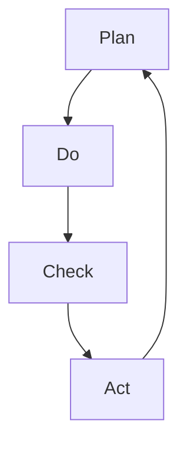

                 

在项目管理中，有效的流程管理和持续改进是确保项目成功的关键。PDCA循环（Plan-Do-Check-Act，即计划-执行-检查-行动循环）作为一种广泛应用于各种领域的管理工具，为项目管理提供了一套系统的、可操作的改进方法。本文将探讨PDCA循环在项目管理中的具体应用，以帮助项目经理和团队更好地实施和管理项目。

## 关键词

- 项目管理
- PDCA循环
- 持续改进
- 流程管理
- 风险控制

## 摘要

本文通过介绍PDCA循环的基本概念，详细阐述了其在项目管理中的应用步骤和注意事项。通过实际案例分析，展示了PDCA循环在提高项目管理效率和项目成功率方面的作用。最后，对PDCA循环的未来发展趋势和面临的挑战进行了展望，为项目经理提供了实用的指导和建议。

## 1. 背景介绍

### 1.1 项目管理的挑战

项目管理是一个复杂的过程，涉及到资源的规划、进度的控制、风险的识别和应对等多方面的内容。随着项目的复杂性不断增加，传统的管理方法往往难以满足现代项目的要求。项目经理需要面对的挑战包括：

- 项目目标不明确：项目范围和目标模糊，导致项目执行过程中出现偏差。
- 资源管理困难：人力资源、时间资源、预算资源等分配不合理，影响项目进度和质量。
- 风险管理不足：对潜在风险的识别和应对措施不足，可能导致项目延期或失败。
- 沟通不畅：团队成员之间的沟通不充分，影响协作效率。

### 1.2 PDCA循环的概念

PDCA循环是一种由质量管理专家沃特·阿曼德·休哈特（Walter A. Shewhart）提出的质量管理方法，后被爱德华兹·戴明（Edwards Deming）进一步发展并推广。PDCA循环由四个相互关联的阶段组成：

- **Plan（计划）**：确定项目目标、范围、资源需求，制定详细的计划和策略。
- **Do（执行）**：按照计划执行项目活动，确保各项任务按时完成。
- **Check（检查）**：对执行过程进行监控和评估，确保项目按照计划进行。
- **Act（行动）**：根据检查结果采取行动，对成功经验进行标准化，对问题进行改进。

## 2. 核心概念与联系

### 2.1 PDCA循环的四个阶段

PDCA循环的四个阶段形成一个闭环，每个阶段都有其独特的任务和目标。以下是一个简化的Mermaid流程图，展示了PDCA循环的架构：



### 2.2 PDCA循环的核心原则

- **系统化**：PDCA循环提供了一套系统的管理流程，使项目管理更加规范化。
- **循环性**：PDCA循环是一个不断迭代的过程，每个阶段都是对前一个阶段的反馈和改进。
- **透明性**：通过PDCA循环，项目进展和问题可以清晰地展示出来，便于团队沟通和决策。
- **灵活性**：PDCA循环允许项目经理根据实际情况调整计划和策略，提高项目的适应性。

## 3. 核心算法原理 & 具体操作步骤

### 3.1 算法原理概述

PDCA循环的核心在于通过循环反馈实现持续改进。以下是PDCA循环的基本原理：

1. **Plan**：通过需求分析和规划，确定项目目标、范围、资源和时间计划。
2. **Do**：按照计划执行项目任务，确保每个任务按时完成。
3. **Check**：对执行过程进行监控和评估，确保项目按照计划进行，及时发现和解决问题。
4. **Act**：根据检查结果采取行动，对成功的经验进行标准化，对问题进行改进，并形成新的计划。

### 3.2 算法步骤详解

1. **Plan阶段**：
   - 确定项目目标：明确项目需要实现的具体目标和预期成果。
   - 定义项目范围：确定项目涉及的工作范围，明确项目的边界。
   - 资源规划：根据项目需求，合理安排人力资源、时间资源和预算资源。
   - 制定详细计划：制定项目的时间表、任务分配和关键里程碑。

2. **Do阶段**：
   - 按照计划执行任务：确保每个任务按照既定的时间表和标准执行。
   - 实施质量管理：通过质量控制措施确保项目交付物的质量符合要求。
   - 沟通协作：确保团队成员之间的沟通畅通，协调资源，共同推进项目。

3. **Check阶段**：
   - 监控项目进展：通过关键指标和进度报告监控项目执行情况。
   - 问题识别：及时发现项目执行中的问题和偏差，分析原因。
   - 持续改进：根据监控结果调整项目计划和策略，确保项目按计划进行。

4. **Act阶段**：
   - 成功经验标准化：对成功的管理方法和实践进行记录和分享，形成标准操作流程。
   - 问题改进：对识别出的问题进行改进，制定相应的纠正措施。
   - 形成新的计划：根据本次PDCA循环的结果，制定新的计划和策略，为下一个循环做好准备。

### 3.3 算法优缺点

**优点**：
- 系统化：PDCA循环提供了一套系统的管理流程，使项目管理更加规范化。
- 持续改进：PDCA循环通过循环反馈实现持续改进，提高项目质量。
- 灵活性：PDCA循环允许项目经理根据实际情况调整计划和策略，提高项目的适应性。

**缺点**：
- 需要时间：PDCA循环是一个长期的过程，需要一定的时间来实现持续改进。
- 需要持续投入：为了确保PDCA循环的有效实施，需要持续投入时间和资源。

### 3.4 算法应用领域

PDCA循环可以应用于各种类型的项目管理，包括软件开发、系统集成、市场营销等。以下是一些具体的应用领域：

- **软件开发**：通过PDCA循环实现软件开发的流程管理，提高软件质量和交付效率。
- **系统集成**：在系统集成项目中，PDCA循环可以帮助识别和解决系统集成过程中的问题。
- **市场营销**：PDCA循环可以应用于市场营销活动，通过循环反馈优化营销策略。

## 4. 数学模型和公式 & 详细讲解 & 举例说明

### 4.1 数学模型构建

PDCA循环中的数学模型主要涉及项目管理中的关键指标和统计分析。以下是一个简化的数学模型：

$$
\text{关键指标} = \frac{\text{实际完成量}}{\text{计划完成量}} \times 100\%
$$

这个公式表示关键指标，反映了项目实际完成量与计划完成量的比例。

### 4.2 公式推导过程

关键指标的推导过程如下：

1. **实际完成量**：根据项目执行过程中实际完成的任务量计算。
2. **计划完成量**：根据项目计划中预计完成的任务量计算。
3. **比例计算**：将实际完成量除以计划完成量，得到关键指标的百分比。

### 4.3 案例分析与讲解

假设一个软件开发项目，计划在4个月内完成，预计完成量为100个功能点。实际在4个月内完成了80个功能点。根据上述公式，我们可以计算关键指标：

$$
\text{关键指标} = \frac{80}{100} \times 100\% = 80\%
$$

这个结果表明，项目的完成度只有80%，说明项目存在一定的偏差。项目经理需要分析原因，并采取相应的改进措施。

## 5. 项目实践：代码实例和详细解释说明

### 5.1 开发环境搭建

在本节中，我们将以一个简单的软件开发项目为例，介绍如何在实际项目中应用PDCA循环。首先，我们需要搭建一个基本的开发环境。

#### 5.1.1 软件要求

- 操作系统：Windows 10或更高版本
- 编程语言：Python 3.8或更高版本
- 开发工具：PyCharm

#### 5.1.2 环境配置

1. 安装操作系统：在计算机上安装Windows 10。
2. 安装Python：从官方网站下载Python安装包，并按照安装向导完成安装。
3. 安装PyCharm：从PyCharm官方网站下载社区版安装包，并按照安装向导完成安装。

### 5.2 源代码详细实现

在开发环境中，我们将创建一个简单的Python程序，用于计算两个数的和。以下是代码实现：

```python
# pdca_example.py

def calculate_sum(a, b):
    """
    计算两个数的和
    :param a: 第一个数
    :param b: 第二个数
    :return: 两个数的和
    """
    return a + b

if __name__ == "__main__":
    # 测试代码
    print("计算结果：", calculate_sum(3, 4))
```

### 5.3 代码解读与分析

#### 5.3.1 功能解读

1. **函数定义**：`calculate_sum` 函数用于计算两个数的和。
2. **参数传递**：函数接收两个参数 `a` 和 `b`，分别表示两个要相加的数。
3. **返回值**：函数返回两个数的和。

#### 5.3.2 分析

1. **功能单一**：代码实现的功能非常简单，只涉及两个数的相加。
2. **测试代码**：通过在 `if __name__ == "__main__":` 下的测试代码，我们可以验证函数的正确性。

### 5.4 运行结果展示

在PyCharm中运行程序，输出结果如下：

```
计算结果： 7
```

这表明程序成功计算出了两个数的和，功能实现正确。

## 6. 实际应用场景

### 6.1 软件开发

在软件开发项目中，PDCA循环可以帮助团队在开发过程中持续改进代码质量，优化开发流程。以下是一个具体的应用场景：

#### 6.1.1 Plan阶段

- 确定项目目标：开发一个具有用户友好的界面，功能完善的财务管理系统。
- 定义项目范围：系统包括用户注册、登录、账单管理、报表生成等功能。
- 资源规划：分配开发人员、测试人员、项目经理等资源，并制定详细的时间表。

#### 6.1.2 Do阶段

- 按照计划进行开发：按照功能模块划分，逐步实现系统功能。
- 实施质量管理：通过代码审查、单元测试等手段确保代码质量。
- 沟通协作：定期召开团队会议，确保团队成员之间的信息畅通。

#### 6.1.3 Check阶段

- 监控项目进展：通过进度报告和关键指标监控项目执行情况。
- 问题识别：及时发现开发过程中的问题和缺陷，分析原因。
- 持续改进：根据监控结果调整开发计划，优化开发流程。

#### 6.1.4 Act阶段

- 成功经验标准化：对成功的管理方法和实践进行记录，形成标准操作流程。
- 问题改进：对识别出的问题进行改进，制定相应的纠正措施。
- 形成新的计划：根据本次PDCA循环的结果，制定新的计划和策略，为下一个循环做好准备。

### 6.2 市场营销

在市场营销项目中，PDCA循环可以帮助团队优化营销策略，提高营销效果。以下是一个具体的应用场景：

#### 6.2.1 Plan阶段

- 确定项目目标：提高品牌知名度，增加潜在客户数量。
- 定义项目范围：包括线上推广、线下活动、社交媒体营销等。
- 资源规划：制定预算，分配营销人员、广告投放人员等资源。

#### 6.2.2 Do阶段

- 执行营销活动：按照计划执行各项营销活动，包括广告投放、活动策划等。
- 监控效果：通过数据分析监控营销活动的效果，如点击率、转化率等。
- 沟通协作：确保营销团队之间的信息畅通，协调资源。

#### 6.2.3 Check阶段

- 分析效果：对营销活动效果进行统计分析，识别成功和失败的要素。
- 优化策略：根据分析结果调整营销策略，优化广告投放、活动策划等。
- 持续改进：不断优化营销策略，提高营销效果。

#### 6.2.4 Act阶段

- 成功经验标准化：对成功的营销策略进行记录和分享，形成标准操作流程。
- 问题改进：对识别出的问题进行改进，制定相应的纠正措施。
- 形成新的计划：根据本次PDCA循环的结果，制定新的计划和策略，为下一个循环做好准备。

## 7. 工具和资源推荐

### 7.1 学习资源推荐

- 《项目管理知识体系指南》（PMBOK指南）：由美国项目管理协会（PMI）发布的权威项目管理指南，详细介绍了项目管理的方法和流程。
- 《质量管理方法与实践》：由戴明博士所著，介绍了PDCA循环在质量管理中的应用。

### 7.2 开发工具推荐

- PyCharm：一款功能强大的Python开发工具，支持代码自动补全、调试和测试。
- Jira：一款流行的项目管理工具，可以帮助团队监控项目进度、任务分配和团队协作。

### 7.3 相关论文推荐

- "A Framework for Process Improvement Using PDCA Cycle"：该论文详细介绍了PDCA循环在过程改进中的应用。
- "The Application of PDCA Cycle in Software Project Management"：该论文探讨了PDCA循环在软件开发项目管理中的具体应用。

## 8. 总结：未来发展趋势与挑战

### 8.1 研究成果总结

PDCA循环作为一种系统化的管理工具，已经在项目管理中得到了广泛应用。通过实践证明，PDCA循环可以提高项目效率、优化项目流程、增强团队协作，从而提高项目的成功率。随着项目管理方法的不断发展和完善，PDCA循环在未来有望在更广泛的领域得到应用。

### 8.2 未来发展趋势

- **智能化**：随着人工智能技术的发展，PDCA循环有望与人工智能技术结合，实现更加智能化和自动化的项目管理。
- **数字化**：通过大数据分析和数字化工具，PDCA循环可以更加精准地监控项目进展和效果，提高项目管理水平。
- **全球化**：随着全球化进程的加速，PDCA循环将在跨国项目管理中发挥重要作用，促进国际间的协作与合作。

### 8.3 面临的挑战

- **实施难度**：PDCA循环的顺利实施需要团队成员的积极配合和高度的责任心，实施难度较大。
- **持续改进**：持续改进是PDCA循环的核心，但如何在实际操作中实现持续改进仍是一个挑战。
- **资源投入**：PDCA循环需要一定的资源投入，包括时间、人力和资金，这对一些企业来说可能是一个负担。

### 8.4 研究展望

未来的研究可以重点关注以下几个方面：

- **算法优化**：通过研究更高效的算法，提高PDCA循环的执行效率和效果。
- **应用拓展**：探讨PDCA循环在其他领域的应用，如教育、医疗等。
- **案例研究**：通过收集和分析更多的实际案例，总结PDCA循环在不同类型项目中的应用效果和最佳实践。

## 9. 附录：常见问题与解答

### 9.1 PDCA循环与循环经济的关系

PDCA循环与循环经济是两个不同的概念。PDCA循环是一种管理工具，主要用于项目管理和流程改进。而循环经济是一种经济模式，强调资源的循环利用和可持续发展。尽管两者概念不同，但PDCA循环的理念可以应用于循环经济的管理中，促进资源的有效利用和环境的保护。

### 9.2 PDCA循环与质量管理的关系

PDCA循环是质量管理的重要工具之一。质量管理强调通过系统化的管理和持续改进提高产品和服务的质量。PDCA循环可以帮助企业实现这一目标，通过计划、执行、检查和行动四个阶段的循环，不断优化质量管理流程，提高产品和服务的质量。

### 9.3 PDCA循环在企业文化建设中的作用

PDCA循环不仅是一种管理工具，也是一种企业文化建设的手段。通过PDCA循环，企业可以培养员工的团队协作精神、责任心和创新意识。同时，PDCA循环的持续改进理念可以激励员工不断追求卓越，形成积极向上的企业文化氛围。

## 作者署名

作者：禅与计算机程序设计艺术 / Zen and the Art of Computer Programming

本文旨在探讨PDCA循环在项目管理中的应用，通过详细的案例分析，展示了PDCA循环在提高项目管理效率和项目成功率方面的作用。随着项目管理方法的不断发展和完善，PDCA循环将在未来发挥更加重要的作用，为企业和团队带来更大的价值。希望本文能够为项目经理和团队提供有价值的参考和指导。  


