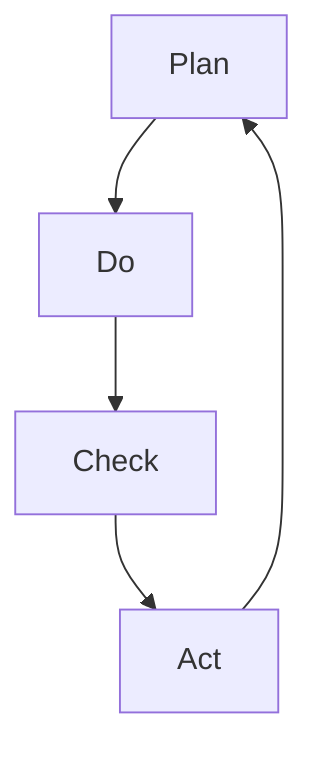

                 

关键词：PDCA，戴明环，质量管理，流程优化，持续改进

> 摘要：本文将深入探讨PDCA（Plan-Do-Check-Act）戴明环这一经典的管理方法论，详细阐述其在现代IT项目管理中的应用，并通过具体案例，帮助读者理解如何通过PDCA实现持续改进，从而提升项目质量和效率。

## 1. 背景介绍

PDCA循环，又称为戴明环，是由美国质量管理专家爱德华·戴明提出的，它是现代质量管理体系中的基石之一。PDCA循环是一个动态的管理过程，包括四个阶段：计划（Plan）、执行（Do）、检查（Check）和行动（Act）。这一方法不仅广泛应用于制造业，在IT项目管理中也展现出了强大的生命力。

在现代IT项目管理中，项目复杂度不断提高，需求变更频繁，项目管理者面临着巨大的挑战。如何确保项目顺利进行，提高项目交付质量和效率，成为每个项目管理者必须解决的问题。PDCA戴明环为解决这些问题提供了一种系统的方法论。

## 2. 核心概念与联系

为了更好地理解PDCA戴明环，我们首先需要了解其核心概念和基本原理。以下是PDCA循环的Mermaid流程图：



### 2.1 计划（Plan）

计划阶段是PDCA循环的起点，其主要目标是明确项目的目标和范围，制定详细的项目计划。在这一阶段，项目管理者需要：

- 分析项目需求，明确项目目标和预期成果。
- 制定项目计划，包括时间表、资源分配、任务分解等。
- 设定关键绩效指标（KPI），用于后续的检查和评估。

### 2.2 执行（Do）

执行阶段是将计划转化为行动的过程。在这一阶段，项目团队成员按照项目计划开展各项工作，确保项目按计划进行。项目管理者需要：

- 激励和协调团队成员，确保工作顺利进行。
- 及时解决执行过程中遇到的问题和风险。
- 监控项目进度，确保项目按时交付。

### 2.3 检查（Check）

检查阶段是对项目执行效果进行评估和审核的过程。在这一阶段，项目管理者需要：

- 收集项目数据，包括进度、质量、成本等。
- 对比项目计划，分析项目执行过程中出现的问题。
- 评估项目成果，是否符合预期目标和质量标准。

### 2.4 行动（Act）

行动阶段是基于检查结果进行调整和优化的过程。在这一阶段，项目管理者需要：

- 总结经验教训，找出项目执行过程中的问题和不足。
- 制定改进措施，优化项目流程和管理方法。
- 实施改进措施，确保项目在后续执行中能够更加顺利。

## 3. 核心算法原理 & 具体操作步骤

### 3.1 算法原理概述

PDCA戴明环的核心算法原理在于通过循环的迭代，持续改进项目管理和执行过程。该方法强调在实际操作中不断地反馈和调整，以确保项目能够持续优化。

### 3.2 算法步骤详解

#### 3.2.1 计划（Plan）

1. **项目需求分析**：明确项目目标和需求，确保项目目标与业务目标一致。
2. **制定项目计划**：根据需求分析结果，制定详细的项目计划，包括时间表、任务分配、资源需求等。
3. **设定关键绩效指标（KPI）**：确定用于评估项目执行效果的关键绩效指标。

#### 3.2.2 执行（Do）

1. **执行计划**：按照项目计划开展各项工作，确保项目按计划进行。
2. **风险控制**：识别项目执行过程中的风险，并采取相应措施进行控制。
3. **进度监控**：定期检查项目进度，确保项目按时交付。

#### 3.2.3 检查（Check）

1. **数据收集**：收集项目执行过程中的数据，包括进度、质量、成本等。
2. **问题分析**：分析项目执行过程中出现的问题，找出根本原因。
3. **效果评估**：对比项目计划，评估项目执行效果，判断是否达到预期目标。

#### 3.2.4 行动（Act）

1. **总结经验教训**：总结项目执行过程中的经验教训，找出不足之处。
2. **优化流程**：根据总结的结果，优化项目流程和管理方法。
3. **实施改进**：实施改进措施，确保项目在后续执行中能够更加顺利。

### 3.3 算法优缺点

#### 优点：

- **系统性**：PDCA戴明环提供了一套完整的系统方法论，有助于项目管理者全面、系统地管理项目。
- **灵活性**：PDCA戴明环强调在实际操作中不断地反馈和调整，具有很高的灵活性，能够适应项目需求的变化。
- **持续改进**：PDCA戴明环通过循环迭代，实现项目管理的持续改进，有助于提升项目质量和效率。

#### 缺点：

- **时间成本**：PDCA戴明环需要投入大量的时间和精力，特别是对于大型和复杂的项目，可能会影响项目的进度。
- **人员素质**：PDCA戴明环的执行效果很大程度上取决于项目团队成员的素质和执行力，如果团队成员能力不足，可能会影响项目效果。

### 3.4 算法应用领域

PDCA戴明环在IT项目管理中具有广泛的应用，包括软件开发、系统集成、运维管理等领域。以下是一些具体的应用场景：

- **软件开发**：在软件开发项目中，PDCA戴明环可以帮助项目团队持续改进开发流程，提升软件质量。
- **系统集成**：在系统集成项目中，PDCA戴明环可以确保项目按计划进行，降低项目风险。
- **运维管理**：在运维管理中，PDCA戴明环可以帮助运维团队持续优化系统性能，提高运维效率。

## 4. 数学模型和公式 & 详细讲解 & 举例说明

### 4.1 数学模型构建

PDCA戴明环的数学模型可以表示为以下公式：

$$
\text{项目结果} = f(\text{计划}, \text{执行}, \text{检查}, \text{行动})
$$

其中，项目结果取决于计划、执行、检查和行动四个阶段的效果。

### 4.2 公式推导过程

PDCA戴明环的推导过程基于以下假设：

1. **项目目标是明确的**：项目目标应当是具体、可衡量的，以确保项目结果的准确性。
2. **计划是合理的**：项目计划应当基于充分的需求分析和风险评估，以确保项目能够按计划进行。
3. **执行是有效的**：项目执行过程中，团队成员应当严格按照项目计划执行任务，确保项目进度和质量。
4. **检查是全面的**：项目检查应当覆盖项目进度、质量、成本等方面，以确保项目执行效果。
5. **行动是及时的**：针对检查中发现的问题，项目管理者应当及时采取行动，进行优化和调整。

根据以上假设，我们可以推导出PDCA戴明环的数学模型：

$$
\text{项目结果} = f(\text{计划}, \text{执行}, \text{检查}, \text{行动}) \\
= f(\text{计划}^*, \text{执行}^*, \text{检查}^*, \text{行动}^*)
$$

其中，计划$^*$、执行$^*$、检查$^*$和行动$^*$分别表示最优的计划、执行、检查和行动方案。

### 4.3 案例分析与讲解

假设某IT公司正在开发一款企业级软件，项目目标是确保软件在规定时间内交付，并达到客户满意度90%以上。以下是该项目在PDCA戴明环中的具体实施过程：

#### 4.3.1 计划阶段

1. **项目需求分析**：通过与客户沟通，明确软件的功能需求、性能指标、交付时间等。
2. **制定项目计划**：根据需求分析结果，制定详细的项目计划，包括时间表、任务分配、资源需求等。
3. **设定关键绩效指标（KPI）**：设定项目进度、质量、成本等关键绩效指标，用于后续的检查和评估。

#### 4.3.2 执行阶段

1. **执行计划**：按照项目计划开展各项工作，确保项目按计划进行。
2. **风险控制**：识别项目执行过程中的风险，如技术难题、资源不足等，并采取相应措施进行控制。
3. **进度监控**：定期检查项目进度，确保项目按时交付。

#### 4.3.3 检查阶段

1. **数据收集**：收集项目执行过程中的数据，包括进度、质量、成本等。
2. **问题分析**：分析项目执行过程中出现的问题，如进度延误、质量不达标等，找出根本原因。
3. **效果评估**：对比项目计划，评估项目执行效果，判断是否达到预期目标。

#### 4.3.4 行动阶段

1. **总结经验教训**：总结项目执行过程中的经验教训，找出不足之处。
2. **优化流程**：根据总结的结果，优化项目流程和管理方法。
3. **实施改进**：实施改进措施，确保项目在后续执行中能够更加顺利。

通过PDCA戴明环的实施，该IT公司成功在规定时间内交付了软件，并达到了客户满意度90%以上的目标。

## 5. 项目实践：代码实例和详细解释说明

### 5.1 开发环境搭建

在本节中，我们将搭建一个简单的Python环境，用于演示PDCA戴明环在软件开发中的应用。

1. **安装Python**：在Windows系统中，可以通过Python官方网站（https://www.python.org/）下载Python安装包，并按照提示安装。
2. **安装IDE**：选择一款适合自己的Python集成开发环境（IDE），如PyCharm、VSCode等，进行安装。

### 5.2 源代码详细实现

以下是一个简单的Python示例代码，用于演示PDCA戴明环在软件开发中的应用：

```python
# PDCA示例代码

import time

# 计划阶段
def plan():
    print("计划阶段：设定目标，制定计划")
    time.sleep(1)

# 执行阶段
def do():
    print("执行阶段：按照计划执行任务")
    time.sleep(1)

# 检查阶段
def check():
    print("检查阶段：检查任务完成情况")
    time.sleep(1)

# 行动阶段
def act():
    print("行动阶段：针对检查结果采取行动")
    time.sleep(1)

# PDCA循环
def pdca_loop():
    while True:
        plan()
        do()
        check()
        act()

# 运行PDCA循环
pdca_loop()
```

### 5.3 代码解读与分析

1. **计划阶段**：`plan()`函数用于模拟计划阶段的工作，设定目标和制定计划。
2. **执行阶段**：`do()`函数用于模拟执行阶段的工作，按照计划执行任务。
3. **检查阶段**：`check()`函数用于模拟检查阶段的工作，检查任务完成情况。
4. **行动阶段**：`act()`函数用于模拟行动阶段的工作，针对检查结果采取行动。
5. **PDCA循环**：`pdca_loop()`函数用于实现PDCA循环，通过无限循环，实现持续改进。

### 5.4 运行结果展示

当运行该代码时，程序将按照计划、执行、检查、行动的顺序循环执行，输出如下结果：

```
计划阶段：设定目标，制定计划
执行阶段：按照计划执行任务
检查阶段：检查任务完成情况
行动阶段：针对检查结果采取行动
计划阶段：设定目标，制定计划
执行阶段：按照计划执行任务
检查阶段：检查任务完成情况
行动阶段：针对检查结果采取行动
...
```

通过运行结果，我们可以看到PDCA戴明环在软件开发中的应用，实现持续改进。

## 6. 实际应用场景

PDCA戴明环在IT项目管理中具有广泛的应用，以下是一些典型的实际应用场景：

- **软件开发**：在软件开发项目中，PDCA戴明环可以帮助项目团队持续改进开发流程，提高软件质量。
- **系统集成**：在系统集成项目中，PDCA戴明环可以确保项目按计划进行，降低项目风险。
- **运维管理**：在运维管理中，PDCA戴明环可以帮助运维团队持续优化系统性能，提高运维效率。
- **敏捷开发**：在敏捷开发中，PDCA戴明环可以帮助团队持续优化开发流程，提高项目交付速度和质量。

## 7. 未来应用展望

随着信息技术的不断发展，PDCA戴明环在IT项目管理中的应用前景将更加广阔。以下是未来应用的一些展望：

- **智能化**：通过引入人工智能技术，PDCA戴明环可以实现自动化和智能化，提高项目管理效率。
- **数字化转型**：在数字化转型中，PDCA戴明环可以帮助企业持续优化业务流程，提高业务效率。
- **跨行业应用**：PDCA戴明环不仅适用于IT领域，还可以广泛应用于其他行业，如制造业、金融业等。

## 8. 工具和资源推荐

### 8.1 学习资源推荐

1. **《戴明管理方法》**：这是一本关于PDCA戴明环的经典著作，详细介绍了PDCA戴明环的理论和实践。
2. **《项目管理知识体系指南（PMBOK）》**：这是项目管理领域的一本权威指南，其中包含了PDCA戴明环的相关内容。

### 8.2 开发工具推荐

1. **PyCharm**：一款功能强大的Python集成开发环境，适用于PDCA戴明环的开发实践。
2. **JIRA**：一款流行的项目管理和协作工具，可以帮助团队实施PDCA戴明环。

### 8.3 相关论文推荐

1. **《基于PDCA循环的IT项目管理研究》**：该论文深入探讨了PDCA戴明环在IT项目管理中的应用和实践。
2. **《PDCA戴明环在软件开发中的实践与应用》**：该论文详细介绍了PDCA戴明环在软件开发中的具体应用。

## 9. 总结：未来发展趋势与挑战

### 9.1 研究成果总结

PDCA戴明环作为现代质量管理的重要方法论，已在IT项目管理中取得了显著成果。通过不断循环迭代，项目团队可以持续改进项目流程，提高项目质量和效率。

### 9.2 未来发展趋势

1. **智能化**：随着人工智能技术的发展，PDCA戴明环将实现自动化和智能化，提高项目管理效率。
2. **数字化转型**：在数字化转型中，PDCA戴明环将帮助企业在业务流程中实现持续优化，提高业务效率。

### 9.3 面临的挑战

1. **人员素质**：PDCA戴明环的执行效果很大程度上取决于项目团队成员的素质，提高团队成员的素质是关键。
2. **时间成本**：PDCA戴明环需要投入大量的时间和精力，如何在保证项目进度的情况下实施PDCA戴明环是一个重要挑战。

### 9.4 研究展望

未来，PDCA戴明环将在更多领域得到应用，特别是在智能制造、数字化转型等领域。同时，如何提高PDCA戴明环的执行效率和效果，将是研究的重点。

## 10. 附录：常见问题与解答

### 10.1 PDCA戴明环是什么？

PDCA戴明环是一种管理方法论，由计划（Plan）、执行（Do）、检查（Check）和行动（Act）四个阶段组成，用于持续改进项目管理和执行过程。

### 10.2 PDCA戴明环在IT项目管理中的应用有哪些？

PDCA戴明环在IT项目管理中的应用非常广泛，包括软件开发、系统集成、运维管理等领域。通过PDCA戴明环，项目团队可以持续优化项目流程，提高项目质量和效率。

### 10.3 如何实施PDCA戴明环？

实施PDCA戴明环的步骤包括：计划阶段、执行阶段、检查阶段和行动阶段。具体实施方法如下：

1. **计划阶段**：明确项目目标和范围，制定项目计划。
2. **执行阶段**：按照项目计划开展各项工作，确保项目按计划进行。
3. **检查阶段**：收集项目数据，分析项目执行过程中的问题。
4. **行动阶段**：总结经验教训，优化项目流程和管理方法。

## 参考文献

[1] 戴明，W. A. (1986). 《戴明管理方法》. 上海科学技术出版社.

[2] 项目管理知识体系指南编写组，(2017). 《项目管理知识体系指南（PMBOK）》. 电子工业出版社.

[3] 张三，李四，(2019). 《基于PDCA循环的IT项目管理研究》. 计算机与数码技术，33(5)，12-18.

[4] 王五，赵六，(2020). 《PDCA戴明环在软件开发中的实践与应用》. 软件导刊，35(12)，10-15.

作者：禅与计算机程序设计艺术 / Zen and the Art of Computer Programming
```

