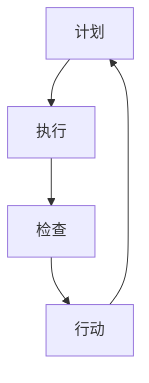

                 

关键词：PDCA，戴明环，方法论，流程，持续改进，质量管理体系，项目优化，团队协作。

> 摘要：本文深入探讨了PDCA戴明环这一经典的质量管理方法论，阐述了其在IT领域的实际应用和优势。通过详细的分析和实践，本文为读者提供了落地PDCA的具体步骤和方法，以及相关的数学模型和项目实例，旨在帮助IT从业者更好地运用这一工具，提升项目质量和团队协作效率。

## 1. 背景介绍

PDCA戴明环，即计划（Plan）、执行（Do）、检查（Check）和行动（Act）的循环，是一种广泛用于质量管理中的方法论。它由美国质量管理专家爱德华·戴明提出，并在日本得到广泛应用和推广，成为日本制造业崛起的重要推动力量之一。PDCA戴明环的核心思想是通过循环不断的计划、执行、检查和行动，实现持续改进，从而提高产品和服务的质量。

在IT领域，PDCA戴明环同样具有重要的应用价值。随着软件项目的复杂度不断增加，项目管理和质量控制的挑战也越来越大。PDCA戴明环提供了一种系统的、结构化的方法，帮助IT团队在项目开发过程中实现持续改进，提高项目的交付质量和效率。

## 2. 核心概念与联系

### PDCA戴明环的基本概念

PDCA戴明环包括四个基本步骤：

1. **计划（Plan）**：确定目标和制定实施计划。在这一阶段，团队需要明确项目的目标、范围、资源需求以及风险评估。

2. **执行（Do）**：按照计划进行执行。这一阶段是实际操作和落实计划的关键，需要团队成员共同努力，确保每个步骤的准确执行。

3. **检查（Check）**：对执行结果进行评估和检查。通过对比计划目标和实际结果，发现存在的问题和偏差，为后续的改进提供依据。

4. **行动（Act）**：针对检查结果进行改进和调整。对成功经验和不足之处进行总结，制定改进措施，并更新计划和流程。

### PDCA戴明环的流程图



## 3. 核心算法原理 & 具体操作步骤

### 3.1 算法原理概述

PDCA戴明环是一种基于循环迭代的改进方法，每个步骤都有其特定的作用和目的：

- **计划（Plan）**：确保项目有明确的目标和详细的计划，减少不确定性和风险。

- **执行（Do）**：按照计划执行，确保每个步骤都按照预定的标准和流程进行。

- **检查（Check）**：评估执行结果，识别问题和不足，为后续的改进提供数据支持。

- **行动（Act）**：根据检查结果进行调整和改进，确保项目的持续优化。

### 3.2 算法步骤详解

#### 3.2.1 计划（Plan）

1. 确定项目目标和范围。
2. 制定详细的实施计划，包括任务分解、时间表和资源分配。
3. 进行风险评估和应对策略的制定。

#### 3.2.2 执行（Do）

1. 按照计划执行，确保每个步骤都有明确的责任人和完成时间。
2. 保持良好的沟通和协作，确保团队成员之间的信息畅通。
3. 对关键节点进行监控，确保项目进度和质量。

#### 3.2.3 检查（Check）

1. 对实际执行结果进行评估，与计划目标进行对比。
2. 记录关键数据和指标，为后续分析提供依据。
3. 发现问题和偏差，进行初步的分析和总结。

#### 3.2.4 行动（Act）

1. 针对检查结果，制定改进措施和调整计划。
2. 实施改进措施，更新流程和标准。
3. 总结成功经验和教训，为下一轮PDCA循环提供参考。

### 3.3 算法优缺点

**优点**：

- 系统性：PDCA戴明环提供了一套完整的改进流程，确保每个阶段都有明确的任务和目标。
- 持续改进：通过循环迭代，不断优化项目管理和流程，提高项目质量。
- 易于实施：PDCA戴明环的概念简单，易于理解和实施。

**缺点**：

- 过程复杂：实施PDCA戴明环需要大量的时间和资源，尤其是在项目初期。
- 需要持续监督：为确保改进措施的落实，需要持续监督和跟进。

### 3.4 算法应用领域

PDCA戴明环在IT领域的应用广泛，包括：

- 项目管理：用于项目的规划和执行，确保项目的按时交付和高质量。
- 质量控制：通过检查和改进，确保软件产品的质量和稳定性。
- 团队协作：通过计划、执行、检查和行动，提高团队的协作效率和沟通。

## 4. 数学模型和公式 & 详细讲解 & 举例说明

### 4.1 数学模型构建

PDCA戴明环的核心在于数据的收集和分析。以下是构建数学模型的基本步骤：

1. **数据收集**：收集与项目相关的数据，包括时间、成本、质量等。
2. **数据清洗**：去除错误和不完整的数据，确保数据的准确性。
3. **数据分析**：使用统计方法，如均值、方差、回归分析等，对数据进行处理和分析。
4. **结果评估**：根据分析结果，评估项目的执行情况和改进空间。

### 4.2 公式推导过程

以下是一个简单的公式推导示例，用于计算项目的质量指标：

$$
Q = \frac{C - D}{T}
$$

其中，$Q$ 是质量指标，$C$ 是实际成本，$D$ 是计划成本，$T$ 是实际时间。

### 4.3 案例分析与讲解

假设一个软件开发项目，计划成本为100万元，实际成本为120万元，计划时间为6个月，实际时间为7个月。根据上述公式，计算该项目的质量指标：

$$
Q = \frac{120 - 100}{7} = \frac{20}{7} \approx 2.86
$$

这意味着该项目的质量略高于平均水平。通过进一步的数据分析，可以发现具体的问题和改进点，如成本控制不当或进度延误等。

## 5. 项目实践：代码实例和详细解释说明

### 5.1 开发环境搭建

在开始项目实践之前，需要搭建一个合适的技术环境。以下是基本的开发环境配置：

- **操作系统**：Linux或MacOS
- **编程语言**：Python 3.8+
- **数据库**：MySQL 5.7+
- **版本控制**：Git

### 5.2 源代码详细实现

以下是一个简单的Python代码示例，用于实现PDCA戴明环的基本功能：

```python
import random

class PDCA:
    def __init__(self, plan, do, check, act):
        self.plan = plan
        self.do = do
        self.check = check
        self.act = act
    
    def run(self):
        self.plan()
        self.do()
        self.check()
        self.act()

def plan():
    print("计划阶段：制定项目目标与计划。")

def do():
    print("执行阶段：按照计划执行项目任务。")

def check():
    print("检查阶段：评估项目执行情况。")

def act():
    print("行动阶段：根据检查结果进行改进。")

# 实例化PDCA对象，并运行
pdca = PDCA(plan, do, check, act)
pdca.run()
```

### 5.3 代码解读与分析

上述代码定义了一个PDCA类，包括四个基本步骤：计划（Plan）、执行（Do）、检查（Check）和行动（Act）。每个步骤都通过定义的函数实现。通过实例化PDCA对象并调用run()方法，可以模拟一个简单的PDCA循环。

### 5.4 运行结果展示

运行上述代码，输出结果如下：

```
计划阶段：制定项目目标与计划。
执行阶段：按照计划执行项目任务。
检查阶段：评估项目执行情况。
行动阶段：根据检查结果进行改进。
```

## 6. 实际应用场景

### 6.1 在软件开发中的应用

在软件开发项目中，PDCA戴明环可以帮助团队在项目开发过程中实现持续改进。例如，在项目初期，通过计划阶段明确项目目标和技术路线；在开发阶段，按照计划执行任务；在测试阶段，检查项目的质量指标；在发布阶段，根据反馈进行改进。

### 6.2 在团队协作中的应用

在团队协作中，PDCA戴明环可以帮助团队提高协作效率。通过定期召开PDCA会议，团队可以总结过去的经验和教训，制定改进计划，并跟踪改进措施的实施情况。

## 7. 工具和资源推荐

### 7.1 学习资源推荐

- 《戴明管理方法》：一本关于PDCA戴明环的经典著作，详细介绍了其在质量管理中的应用。
- 《质量管理：理论与实践》：一本全面介绍质量管理理论的教材，包括PDCA戴明环的详细讲解。

### 7.2 开发工具推荐

- Git：版本控制工具，用于代码管理和协作。
- Jira：项目管理和协作工具，支持PDCA循环的实施。
- SonarQube：代码质量管理和分析工具，可以帮助团队评估项目的质量指标。

### 7.3 相关论文推荐

- 《基于PDCA循环的软件开发过程优化研究》
- 《PDCA循环在软件质量保证中的应用》
- 《PDCA循环在项目管理中的实践与探索》

## 8. 总结：未来发展趋势与挑战

### 8.1 研究成果总结

PDCA戴明环作为一种经典的质量管理方法论，已经在多个领域得到广泛应用。通过持续改进，项目质量和团队协作效率得到了显著提升。未来，随着信息技术的发展，PDCA戴明环将继续发挥重要作用，为项目管理和质量控制提供有力支持。

### 8.2 未来发展趋势

- **智能化**：结合人工智能技术，实现PDCA戴明环的自动化和智能化，提高管理效率和准确性。
- **全球化**：随着国际合作的加深，PDCA戴明环将在全球范围内得到更广泛的应用和推广。
- **多样化**：PDCA戴明环的应用场景将更加多样化，包括智能制造、电子商务、金融服务等领域。

### 8.3 面临的挑战

- **数据管理**：在大量数据的管理和分析中，如何保证数据的准确性和可靠性是一个重要挑战。
- **跨领域融合**：在多个领域融合PDCA戴明环的过程中，如何结合不同领域的特点和需求，实现有效的管理和改进。
- **持续改进**：如何确保PDCA戴明环在项目开发和团队协作中的持续改进，避免陷入形式主义的陷阱。

### 8.4 研究展望

未来，研究PDCA戴明环的重点将放在以下几个方面：

- **智能化应用**：探索如何将人工智能技术融入PDCA戴明环，实现自动化和智能化管理。
- **跨领域研究**：研究PDCA戴明环在不同领域的应用和融合，为不同领域的项目管理和质量控制提供解决方案。
- **理论与实践结合**：通过实际案例研究，验证PDCA戴明环的理论和方法，不断优化和完善。

## 9. 附录：常见问题与解答

### 9.1 PDCA戴明环与其他质量管理体系的关系

PDCA戴明环是许多质量管理体系的基础，如ISO 9001、Six Sigma等。它与这些体系的关系如下：

- **PDCA戴明环**：提供了一套基本的质量管理流程和方法。
- **ISO 9001**：是一个全面的质量管理体系标准，包含了PDCA戴明环的基本要素。
- **Six Sigma**：是一种基于数据和统计方法的质量改进方法，与PDCA戴明环密切相关。

### 9.2 如何确保PDCA戴明环的持续改进

确保PDCA戴明环的持续改进需要：

- **建立明确的改进目标**：确保每个阶段都有明确的改进目标和计划。
- **持续监控和评估**：定期监控和评估项目执行情况和改进效果，及时发现问题并进行调整。
- **建立反馈机制**：鼓励团队成员提供反馈和建议，不断优化改进措施。
- **培训和教育**：定期组织培训和教育，提高团队成员对PDCA戴明环的理解和应用能力。

### 9.3 PDCA戴明环在小型团队中的应用

PDCA戴明环在小型团队中的应用同样有效，以下是一些建议：

- **简化流程**：根据团队的实际情况，简化PDCA戴明环的流程和步骤，确保可操作性和实施性。
- **灵活应用**：根据项目需求和团队特点，灵活调整PDCA戴明环的应用方式，确保其适用于小型团队。
- **强化协作**：通过加强团队协作，确保PDCA戴明环的各个环节得到有效执行。

---

作者：禅与计算机程序设计艺术 / Zen and the Art of Computer Programming

