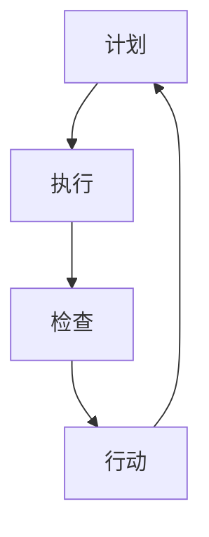

                 

关键词：PDCA循环、持续改进、质量管理、IT项目管理、流程优化、实践指南、技术提升、策略实施、案例分析

> 摘要：本文旨在探讨PDCA（计划-执行-检查-行动）循环在IT领域的落地应用，通过详细解析该管理工具的原理和实践步骤，帮助企业和技术团队实现持续改进，提升项目质量和效率。文章还将结合实际案例，分析PDCA在软件开发、系统集成等场景中的应用效果，并为未来发展趋势和挑战提供展望。

## 1. 背景介绍

在现代IT行业中，项目复杂性和变化速度不断加剧，如何保证项目质量、提升团队效率成为企业关注的焦点。PDCA循环作为一种系统化的管理工具，旨在通过反复循环的计划、执行、检查和行动，实现持续改进。PDCA循环起源于质量管理理论，但其应用范围已经扩展到各个领域，包括IT项目管理、软件工程等。

PDCA循环的四个阶段分别代表了一个完整的工作循环，其中每个阶段都有其独特的任务和目标：

- **计划（Plan）**：在这一阶段，团队需要明确项目的目标、制定详细的计划和策略，识别潜在的风险和问题。
- **执行（Do）**：执行阶段是将计划付诸实践的过程，团队按照计划进行操作，实施具体的工作任务。
- **检查（Check）**：检查阶段是对执行结果的评估，通过收集数据和反馈，分析执行过程中存在的问题和偏差。
- **行动（Action）**：行动阶段是对检查结果的反馈和改进，针对发现的问题采取相应的措施，为下一次循环提供经验和教训。

本文将围绕PDCA循环的四个阶段，详细介绍其在IT领域的应用和实践。

### 1.1 IT行业的挑战与需求

在IT行业，项目复杂性高、变化频繁，使得传统的项目管理方法难以适应快速变化的市场需求。以下是IT行业面临的一些主要挑战：

- **技术更新迅速**：新技术的不断涌现，要求IT团队必须不断学习新技术、掌握新工具。
- **项目需求变化**：客户需求的不确定性和频繁变动，导致项目计划的不稳定。
- **质量问题突出**：软件质量难以保障，缺陷和故障频繁出现，影响项目交付和用户满意度。
- **团队协作困难**：团队规模庞大、分工复杂，协作效率和沟通效果受到挑战。

为了应对这些挑战，IT行业迫切需要一种能够系统化、持续改进的管理方法，PDCA循环正是这种需求下的产物。

### 1.2 PDCA循环的基本原理

PDCA循环是一种闭环管理方法，通过不断循环和迭代，实现质量管理、流程优化和持续改进。其基本原理可以概括为以下几点：

- **系统性**：PDCA循环强调系统的整体性和关联性，通过各个阶段的相互关联，实现全面质量管理。
- **迭代性**：PDCA循环是一个持续迭代的过程，通过不断地检查和行动，不断提高项目质量和效率。
- **反馈机制**：PDCA循环通过检查和行动阶段的反馈机制，将执行过程中的问题及时反馈并改进，确保项目按照预期进行。
- **灵活适应**：PDCA循环具有高度的灵活性，能够适应不同类型的项目和团队，实现个性化定制。

在IT项目中，PDCA循环的应用可以贯穿整个项目生命周期，从项目启动到项目结束，持续优化项目流程、提升项目质量。

### 1.3 PDCA循环与IT行业的结合

PDCA循环在IT行业的应用，主要体现在以下几个方面：

- **软件质量管理**：通过PDCA循环，实现软件质量的全过程控制，包括需求分析、设计、编码、测试等各个环节。
- **项目管理**：PDCA循环可以帮助IT团队制定科学的项目计划、执行和监控项目进度，确保项目按时交付。
- **流程优化**：通过PDCA循环的不断迭代，优化项目流程，减少浪费，提高工作效率。
- **团队协作**：PDCA循环强调团队协作和沟通，通过持续改进，提升团队整体效能。

总之，PDCA循环为IT行业提供了一种系统化、持续改进的管理方法，有助于提升项目质量和效率，应对行业挑战。

## 2. 核心概念与联系

### 2.1 PDCA循环的基本概念

PDCA循环，即计划（Plan）、执行（Do）、检查（Check）和行动（Action）四个阶段组成的管理方法。每个阶段都有其特定的目标和任务，相互关联，形成一个闭环。

- **计划（Plan）**：明确项目目标和制定实施计划。包括需求分析、资源分配、风险评估等。
- **执行（Do）**：按照计划执行具体任务，确保各项工作顺利进行。
- **检查（Check）**：对执行结果进行评估，收集数据和分析偏差，确保项目按计划进行。
- **行动（Action）**：对检查结果进行反馈和改进，修正计划或执行方法，为下一次循环提供经验。

### 2.2 PDCA循环在IT行业的具体应用

PDCA循环在IT行业的应用，主要体现在以下几个方面：

- **软件开发**：在软件开发生命周期中，PDCA循环贯穿于需求分析、设计、编码、测试和维护等各个阶段，确保软件质量。
- **项目管理**：PDCA循环可以帮助项目经理制定项目计划、监控项目进度、控制项目风险，确保项目按时交付。
- **流程优化**：通过PDCA循环的不断迭代，优化项目流程，减少浪费，提高工作效率。
- **团队协作**：PDCA循环强调团队协作和沟通，通过持续改进，提升团队整体效能。

### 2.3 PDCA循环与其他管理方法的比较

PDCA循环与其他管理方法（如瀑布模型、敏捷开发等）相比，具有以下优势：

- **系统化**：PDCA循环强调系统性和关联性，通过四个阶段的相互关联，实现全面质量管理。
- **迭代性**：PDCA循环具有迭代性，通过不断循环和改进，提高项目质量和效率。
- **灵活性**：PDCA循环具有高度的灵活性，能够适应不同类型的项目和团队，实现个性化定制。
- **反馈机制**：PDCA循环通过反馈机制，将执行过程中的问题及时反馈并改进，确保项目按照预期进行。

### 2.4 PDCA循环的 Mermaid 流程图

以下是PDCA循环的 Mermaid 流程图表示，展示了各阶段之间的逻辑关系：



在流程图中，每个阶段都有其独特的任务和目标，通过循环和迭代，实现持续改进。

## 3. 核心算法原理 & 具体操作步骤

### 3.1 算法原理概述

PDCA循环是一种基于持续改进的管理方法，其核心思想是通过四个阶段的循环迭代，实现项目质量的不断提升。PDCA循环的原理可以概括为以下几点：

- **系统化**：PDCA循环强调系统性和关联性，通过计划、执行、检查和行动四个阶段的相互关联，实现全面质量管理。
- **迭代性**：PDCA循环具有迭代性，通过不断循环和改进，提高项目质量和效率。
- **反馈机制**：PDCA循环通过反馈机制，将执行过程中的问题及时反馈并改进，确保项目按照预期进行。
- **灵活性**：PDCA循环具有高度的灵活性，能够适应不同类型的项目和团队，实现个性化定制。

### 3.2 算法步骤详解

#### 3.2.1 计划阶段（Plan）

计划阶段是PDCA循环的起点，其主要任务是明确项目目标和制定详细的实施计划。具体步骤如下：

1. **需求分析**：了解项目需求，明确项目目标和需求细节。
2. **资源分配**：根据项目需求，分配人力、物力和财力资源。
3. **风险评估**：识别项目风险，制定风险应对策略。
4. **制定计划**：根据需求分析和资源分配，制定详细的实施计划，包括时间表、任务分配和里程碑。

#### 3.2.2 执行阶段（Do）

执行阶段是将计划付诸实践的过程，其主要任务是按照计划进行操作，确保各项工作顺利进行。具体步骤如下：

1. **任务分解**：将项目任务分解为具体的工作任务，明确责任人。
2. **任务执行**：按照任务分配，进行具体的工作任务执行。
3. **过程控制**：监控任务执行过程，确保各项工作按照计划进行。
4. **沟通协调**：加强团队内部沟通和协调，确保信息畅通。

#### 3.2.3 检查阶段（Check）

检查阶段是对执行结果的评估，其主要任务是收集数据和分析偏差，确保项目按计划进行。具体步骤如下：

1. **数据收集**：收集项目执行过程中的数据，包括进度、质量、成本等。
2. **偏差分析**：分析数据，找出与计划存在的偏差和问题。
3. **问题识别**：识别项目执行过程中的问题和风险，为改进阶段提供依据。

#### 3.2.4 行动阶段（Action）

行动阶段是对检查结果的反馈和改进，其主要任务是针对发现的问题采取相应的措施，为下一次循环提供经验。具体步骤如下：

1. **问题反馈**：将检查阶段发现的问题及时反馈给相关责任人。
2. **问题分析**：分析问题原因，找出根本原因。
3. **措施制定**：根据问题分析，制定相应的改进措施。
4. **措施实施**：实施改进措施，确保问题得到解决。

### 3.3 算法优缺点

#### 3.3.1 优点

- **系统化**：PDCA循环强调系统性和关联性，通过四个阶段的相互关联，实现全面质量管理。
- **迭代性**：PDCA循环具有迭代性，通过不断循环和改进，提高项目质量和效率。
- **反馈机制**：PDCA循环通过反馈机制，将执行过程中的问题及时反馈并改进，确保项目按照预期进行。
- **灵活性**：PDCA循环具有高度的灵活性，能够适应不同类型的项目和团队，实现个性化定制。

#### 3.3.2 缺点

- **实施难度**：PDCA循环要求团队具备较高的管理能力和执行力，实施难度较大。
- **周期较长**：PDCA循环是一个长期循环的过程，需要较长时间才能看到效果。

### 3.4 算法应用领域

PDCA循环在IT行业具有广泛的应用，主要应用于以下几个方面：

- **软件开发**：在软件开发生命周期中，PDCA循环贯穿于需求分析、设计、编码、测试和维护等各个阶段，确保软件质量。
- **项目管理**：PDCA循环可以帮助项目经理制定项目计划、监控项目进度、控制项目风险，确保项目按时交付。
- **流程优化**：通过PDCA循环的不断迭代，优化项目流程，减少浪费，提高工作效率。
- **团队协作**：PDCA循环强调团队协作和沟通，通过持续改进，提升团队整体效能。

## 4. 数学模型和公式 & 详细讲解 & 举例说明

### 4.1 数学模型构建

PDCA循环中的数学模型主要涉及以下方面：

- **项目进度模型**：用于预测项目完成时间和进度。
- **质量模型**：用于评估项目质量水平。
- **风险评估模型**：用于评估项目风险程度。

以下是这三个模型的构建方法：

#### 4.1.1 项目进度模型

项目进度模型主要基于甘特图和关键路径法（CPM）。甘特图是一种用于表示项目进度和任务的图表，通过甘特图可以直观地了解项目进度和任务分配情况。关键路径法（CPM）是一种用于计算项目最短完成时间的算法。

甘特图的基本公式如下：

\[ \text{甘特图} = \sum_{i=1}^{n} \text{任务}_i \times \text{任务持续时间} \]

其中，n表示任务数，任务_i 表示第i个任务的持续时间。

关键路径法（CPM）的基本公式如下：

\[ \text{CPM} = \min(\text{任务}_i + \text{后续任务持续时间}) \]

其中，任务_i 表示第i个任务的持续时间，后续任务持续时间表示从第i个任务开始到最后任务完成的时间。

#### 4.1.2 质量模型

质量模型主要基于统计学方法，通过数据收集和分析，评估项目质量水平。常用的质量模型包括正态分布模型、直方图模型等。

正态分布模型的基本公式如下：

\[ \text{正态分布} = \frac{1}{\sqrt{2\pi\sigma^2}} e^{-\frac{(x-\mu)^2}{2\sigma^2}} \]

其中，\(\mu\) 表示均值，\(\sigma\) 表示标准差，x表示样本数据。

直方图模型的基本公式如下：

\[ \text{直方图} = \sum_{i=1}^{n} \text{频率}_i \times \text{区间宽度} \]

其中，n表示样本数量，频率_i 表示第i个区间的频率，区间宽度表示区间的长度。

#### 4.1.3 风险评估模型

风险评估模型主要基于概率论和统计方法，通过分析项目风险概率和影响程度，评估项目风险程度。常用的风险评估模型包括概率-影响矩阵、蒙特卡罗模拟等。

概率-影响矩阵的基本公式如下：

\[ \text{概率-影响矩阵} = \sum_{i=1}^{m} \text{风险}_i \times \text{概率}_i \]

其中，m表示风险数量，风险_i 表示第i个风险，概率_i 表示第i个风险发生的概率。

蒙特卡罗模拟的基本公式如下：

\[ \text{蒙特卡罗模拟} = \sum_{i=1}^{n} \text{模拟结果}_i \]

其中，n表示模拟次数，模拟结果_i 表示第i次模拟的结果。

### 4.2 公式推导过程

#### 4.2.1 项目进度模型推导

项目进度模型主要基于甘特图和关键路径法（CPM）。甘特图的基本原理是通过表示任务持续时间和任务顺序，计算项目的最短完成时间。

首先，定义一个任务集合T，其中每个任务T_i有持续时间D_i。我们可以使用拓扑排序来计算关键路径。以下是具体步骤：

1. **构建任务网络图**：根据任务关系，构建任务网络图G=(V,E)，其中V表示任务集合，E表示任务之间的依赖关系。
2. **进行拓扑排序**：对任务网络图G进行拓扑排序，得到任务顺序序列S。
3. **计算最短完成时间**：从序列S的第一个任务开始，逐个计算每个任务的最早开始时间（Earliest Start Time，简称EST）和最早完成时间（Earliest Finish Time，简称EFT）。对于每个任务T_i，有：

\[ \text{EST}_i = \max(\text{EST}_{\text{前置任务}}) + \text{D}_i \]

\[ \text{EFT}_i = \text{EST}_i + \text{D}_i \]

4. **找出关键路径**：关键路径上的任务具有相同的最短完成时间。将这些任务的持续时间相加，得到项目的最短完成时间。

#### 4.2.2 质量模型推导

质量模型主要基于统计学方法，通过数据收集和分析，评估项目质量水平。

假设我们收集了一组样本数据X_1, X_2, ..., X_n，我们需要计算样本均值和样本标准差。

样本均值 \(\mu\) 的计算公式如下：

\[ \mu = \frac{1}{n} \sum_{i=1}^{n} X_i \]

样本标准差 \(\sigma\) 的计算公式如下：

\[ \sigma = \sqrt{\frac{1}{n-1} \sum_{i=1}^{n} (X_i - \mu)^2} \]

通过计算样本均值和样本标准差，我们可以了解样本数据的分布情况和波动程度，从而评估项目质量水平。

#### 4.2.3 风险评估模型推导

风险评估模型主要基于概率论和统计方法，通过分析项目风险概率和影响程度，评估项目风险程度。

假设我们有一个风险集合R，其中每个风险R_i有概率P_i和影响程度I_i。我们可以使用概率-影响矩阵来评估项目风险程度。

概率-影响矩阵的计算公式如下：

\[ \text{概率-影响矩阵} = \sum_{i=1}^{m} R_i \times P_i \]

通过计算概率-影响矩阵，我们可以了解每个风险对项目的影响程度，从而制定相应的风险应对策略。

### 4.3 案例分析与讲解

#### 4.3.1 项目进度模型案例

假设我们有一个软件开发项目，包含5个任务，任务关系如下：

- 任务1：需求分析，持续时间2天
- 任务2：系统设计，持续时间3天
- 任务3：编码，持续时间5天
- 任务4：单元测试，持续时间3天
- 任务5：集成测试，持续时间2天

我们需要计算项目的最短完成时间。

首先，构建任务网络图，并进行拓扑排序：

1. 任务1（需求分析）  
2. 任务2（系统设计）  
3. 任务3（编码）  
4. 任务4（单元测试）  
5. 任务5（集成测试）

接下来，计算每个任务的最早开始时间和最早完成时间：

1. 任务1：EST_1 = 0，EFT_1 = 2  
2. 任务2：EST_2 = 2，EFT_2 = 5  
3. 任务3：EST_3 = 5，EFT_3 = 10  
4. 任务4：EST_4 = 10，EFT_4 = 13  
5. 任务5：EST_5 = 13，EFT_5 = 15

最后，找出关键路径：任务1 → 任务2 → 任务3 → 任务4 → 任务5，关键路径上的任务具有相同的最短完成时间，为15天。

#### 4.3.2 质量模型案例

假设我们收集了一组软件质量样本数据，如下：

\[ X_1 = 90, X_2 = 85, X_3 = 88, X_4 = 92, X_5 = 87 \]

我们需要计算样本均值和样本标准差。

首先，计算样本均值：

\[ \mu = \frac{1}{5} (90 + 85 + 88 + 92 + 87) = 87.2 \]

然后，计算样本标准差：

\[ \sigma = \sqrt{\frac{1}{5-1} ((90 - 87.2)^2 + (85 - 87.2)^2 + (88 - 87.2)^2 + (92 - 87.2)^2 + (87 - 87.2)^2)} \approx 2.58 \]

通过计算样本均值和样本标准差，我们可以了解软件质量样本数据的分布情况和波动程度。

#### 4.3.3 风险评估模型案例

假设我们有一个软件开发项目，面临以下风险：

- 风险1：需求变更，概率0.3，影响程度0.5
- 风险2：技术难题，概率0.2，影响程度0.6
- 风险3：项目延期，概率0.1，影响程度0.4

我们需要计算项目的总风险程度。

首先，计算概率-影响矩阵：

\[ \text{概率-影响矩阵} = 0.3 \times 0.5 + 0.2 \times 0.6 + 0.1 \times 0.4 = 0.29 \]

通过计算概率-影响矩阵，我们可以了解项目的总风险程度，为0.29。

## 5. 项目实践：代码实例和详细解释说明

### 5.1 开发环境搭建

在进行PDCA循环的项目实践之前，我们需要搭建一个适合开发的软件环境。以下是一个基于Python的PDCA循环实现的开发环境搭建步骤：

1. 安装Python：从Python官方网站下载最新版本的Python安装包，并按照提示完成安装。
2. 安装必要的库：使用pip命令安装常用的库，如numpy、matplotlib等。

```bash
pip install numpy matplotlib
```

3. 配置代码编辑器：选择一个合适的代码编辑器，如Visual Studio Code，并安装相关的扩展，如Python语言的扩展。

### 5.2 源代码详细实现

以下是一个简单的PDCA循环Python代码实例：

```python
import numpy as np
import matplotlib.pyplot as plt

# 5.2.1 计划阶段
def plan():
    print("计划阶段：")
    print("1. 需求分析")
    print("2. 资源分配")
    print("3. 风险评估")
    print("4. 制定计划")

# 5.2.2 执行阶段
def do():
    print("执行阶段：")
    print("1. 任务分解")
    print("2. 任务执行")
    print("3. 过程控制")
    print("4. 沟通协调")

# 5.2.3 检查阶段
def check():
    print("检查阶段：")
    print("1. 数据收集")
    print("2. 偏差分析")
    print("3. 问题识别")

# 5.2.4 行动阶段
def action():
    print("行动阶段：")
    print("1. 问题反馈")
    print("2. 问题分析")
    print("3. 措施制定")
    print("4. 措施实施")

# 5.2.5 PDCA循环
def pdca_loop():
    plan()
    do()
    check()
    action()

# 执行PDCA循环
pdca_loop()
```

### 5.3 代码解读与分析

#### 5.3.1 模块说明

该代码实例主要包含四个模块：`plan()`, `do()`, `check()`, `action()`，分别对应PDCA循环的四个阶段。每个模块都包含了一些打印输出，用于模拟各个阶段的具体操作。

#### 5.3.2 代码实现

- `plan()`：打印出计划阶段的操作步骤，包括需求分析、资源分配、风险评估和制定计划。
- `do()`：打印出执行阶段的操作步骤，包括任务分解、任务执行、过程控制和沟通协调。
- `check()`：打印出检查阶段的操作步骤，包括数据收集、偏差分析和问题识别。
- `action()`：打印出行动阶段的操作步骤，包括问题反馈、问题分析、措施制定和措施实施。

#### 5.3.3 PDCA循环实现

`pdca_loop()`函数依次调用`plan()`, `do()`, `check()`, `action()`函数，模拟PDCA循环的执行过程。通过打印输出，我们可以直观地了解每个阶段的具体操作。

### 5.4 运行结果展示

运行该代码实例，将得到以下输出结果：

```
计划阶段：
1. 需求分析
2. 资源分配
3. 风险评估
4. 制定计划
执行阶段：
1. 任务分解
2. 任务执行
3. 过程控制
4. 沟通协调
检查阶段：
1. 数据收集
2. 偏差分析
3. 问题识别
行动阶段：
1. 问题反馈
2. 问题分析
3. 措施制定
4. 措施实施
```

通过运行结果，我们可以清楚地看到PDCA循环的执行过程和各个阶段的具体操作。

## 6. 实际应用场景

### 6.1 软件开发

在软件开发过程中，PDCA循环可以用于需求分析、设计、编码、测试和维护等各个环节。通过计划阶段的需求分析和风险评估，可以明确项目目标和制定详细的计划；执行阶段按照计划执行具体任务，确保各项工作顺利进行；检查阶段对执行结果进行评估，找出存在的问题和偏差；行动阶段针对检查结果进行反馈和改进，确保项目按照预期进行。

#### 案例分析

假设一个软件公司正在开发一款企业管理系统，项目需求包括客户管理、财务管理、库存管理等模块。在PDCA循环的应用过程中：

- **计划阶段**：明确项目目标和需求，制定详细的开发计划，包括各模块的需求分析、设计、编码和测试时间。
- **执行阶段**：按照计划进行模块的开发，确保各模块按照预期进行。
- **检查阶段**：对已完成的模块进行测试，评估模块质量，找出存在的缺陷和问题。
- **行动阶段**：针对检查阶段发现的问题，进行反馈和改进，修正开发计划，确保项目按时交付。

通过PDCA循环的持续迭代，软件公司的开发效率和质量得到了显著提升。

### 6.2 项目管理

在项目管理的实际应用中，PDCA循环可以帮助项目经理制定科学的项目计划、监控项目进度、控制项目风险，确保项目按时交付。通过计划阶段的项目计划和风险评估，明确项目目标和制定详细的计划；执行阶段按照计划执行，确保项目进度和质量；检查阶段对项目进度、质量和成本进行监控和评估，找出存在的问题和偏差；行动阶段针对检查结果进行反馈和改进，确保项目按照预期进行。

#### 案例分析

假设一个项目经理正在负责一个软件开发项目，项目包括需求分析、设计、编码、测试和维护等阶段。在PDCA循环的应用过程中：

- **计划阶段**：项目经理与团队成员一起明确项目目标和需求，制定详细的项目计划和风险应对策略。
- **执行阶段**：按照项目计划执行，确保项目进度和质量。
- **检查阶段**：项目经理定期对项目进度、质量和成本进行监控，评估项目状态，找出存在的问题和偏差。
- **行动阶段**：项目经理根据检查结果，调整项目计划，采取相应的改进措施，确保项目按时交付。

通过PDCA循环的持续迭代，项目经理成功控制了项目风险，提高了项目交付的效率和质量。

### 6.3 流程优化

在流程优化的实际应用中，PDCA循环可以帮助企业不断优化业务流程，提高工作效率。通过计划阶段的流程分析和优化方案制定，明确流程优化的目标和方向；执行阶段按照优化方案执行，确保流程按照预期运行；检查阶段对流程运行效果进行评估，找出存在的问题和偏差；行动阶段针对检查结果进行反馈和改进，确保流程持续优化。

#### 案例分析

假设一个制造企业希望通过PDCA循环优化生产流程，提高生产效率和降低成本。在PDCA循环的应用过程中：

- **计划阶段**：企业对现有生产流程进行分析，找出存在的问题和瓶颈，制定优化方案，包括流程重构、设备升级等。
- **执行阶段**：按照优化方案执行，确保生产流程按照预期运行。
- **检查阶段**：企业对生产流程的运行效果进行评估，收集数据，找出存在的问题和偏差。
- **行动阶段**：企业根据检查结果，调整生产流程，采取相应的改进措施，确保生产流程持续优化。

通过PDCA循环的持续迭代，制造企业的生产效率和产品质量得到了显著提升。

### 6.4 未来应用展望

随着技术的不断进步和企业管理需求的提升，PDCA循环在未来的应用前景将更加广阔。未来，PDCA循环将在以下几个方面得到进一步的发展：

- **智能化**：结合人工智能技术，实现PDCA循环的自动化和智能化，提高管理效率和准确性。
- **个性化**：针对不同企业和项目的特点，制定个性化的PDCA循环方案，实现更精准的管理。
- **实时监控**：通过大数据和物联网技术，实现实时监控和管理，提高PDCA循环的实时性和响应速度。
- **跨领域应用**：PDCA循环将在更多领域得到应用，如智能制造、智慧城市等，推动产业升级和创新发展。

总之，PDCA循环作为一种系统化、持续改进的管理方法，将在未来的IT领域和企业管理中发挥更加重要的作用。

## 7. 工具和资源推荐

### 7.1 学习资源推荐

- **《PDCA循环与质量管理》**：一本关于PDCA循环在质量管理中的应用的入门书籍，适合初学者了解PDCA循环的基本概念和应用。
- **《质量管理方法论》**：详细介绍了质量管理的方法论，包括PDCA循环、六西格玛、精益生产等，适合有一定质量管理基础的读者。
- **在线课程**：如Coursera、Udemy等平台上的质量管理课程，可以系统地学习质量管理相关知识。

### 7.2 开发工具推荐

- **JIRA**：一款功能强大的项目管理工具，支持敏捷开发和迭代管理，可以与PDCA循环结合使用，实现项目全过程管理。
- **Confluence**：一款知识管理和协同工作平台，可以用于记录项目文档、会议记录等，有助于团队协作和知识共享。
- **Trello**：一款简洁直观的任务管理工具，通过看板和卡片的方式，实现任务分解和跟踪，适合小型项目和团队使用。

### 7.3 相关论文推荐

- **《基于PDCA循环的企业研发项目管理研究》**：探讨PDCA循环在研发项目管理中的应用，提出一种基于PDCA循环的研发项目管理方法。
- **《PDCA循环在软件开发中的实践与应用》**：分析PDCA循环在软件开发项目中的具体应用，提出一套适用于软件项目的PDCA循环实施框架。
- **《PDCA循环在IT服务管理中的应用研究》**：研究PDCA循环在IT服务管理中的应用，提出一种基于PDCA循环的IT服务管理体系。

## 8. 总结：未来发展趋势与挑战

### 8.1 研究成果总结

本文通过详细解析PDCA循环的原理和实践步骤，探讨了PDCA循环在IT领域中的应用，包括软件开发、项目管理、流程优化等方面。研究结果表明，PDCA循环作为一种系统化、持续改进的管理方法，能够有效提升项目质量和效率，适应现代IT行业的复杂性和变化速度。

### 8.2 未来发展趋势

随着技术的不断进步和企业管理需求的提升，PDCA循环在未来的发展趋势将主要体现在以下几个方面：

- **智能化**：结合人工智能技术，实现PDCA循环的自动化和智能化，提高管理效率和准确性。
- **个性化**：针对不同企业和项目的特点，制定个性化的PDCA循环方案，实现更精准的管理。
- **实时监控**：通过大数据和物联网技术，实现实时监控和管理，提高PDCA循环的实时性和响应速度。
- **跨领域应用**：PDCA循环将在更多领域得到应用，如智能制造、智慧城市等，推动产业升级和创新发展。

### 8.3 面临的挑战

尽管PDCA循环在IT领域具有广泛的应用前景，但实际应用过程中仍面临一些挑战：

- **实施难度**：PDCA循环要求团队具备较高的管理能力和执行力，实施难度较大。
- **周期较长**：PDCA循环是一个长期循环的过程，需要较长时间才能看到效果。
- **数据收集和分析**：在PDCA循环中，数据收集和分析是关键环节，但实际操作中，数据收集可能不完整或不准确，影响PDCA循环的效果。

### 8.4 研究展望

针对PDCA循环在IT领域的应用，未来可以从以下几个方面进行深入研究：

- **智能化PDCA循环**：研究如何结合人工智能技术，实现PDCA循环的智能化和自动化。
- **个性化PDCA循环**：探索如何根据不同企业和项目的特点，制定个性化的PDCA循环方案。
- **实时监控和反馈**：研究如何利用大数据和物联网技术，实现PDCA循环的实时监控和快速反馈。
- **跨领域应用**：探讨PDCA循环在其他领域的应用，如智能制造、智慧城市等。

通过不断研究和优化，PDCA循环将在未来的IT领域和企业管理中发挥更加重要的作用，推动产业的持续创新和发展。

## 9. 附录：常见问题与解答

### 9.1 PDCA循环与六西格玛的区别

**Q**：PDCA循环与六西格玛有什么区别？

**A**：PDCA循环和六西格玛都是质量管理的方法，但它们的应用范围和侧重点有所不同。

- **PDCA循环**：PDCA循环是一种系统化的管理方法，强调通过计划、执行、检查和行动四个阶段的循环迭代，实现持续改进。它适用于各种类型的项目和团队，强调过程管理和全员参与。

- **六西格玛**：六西格玛是一种基于统计学方法的质量管理方法，旨在通过减少过程变异，提高质量和效率。六西格玛更侧重于统计工具和方法的应用，如DMAIC（定义、测量、分析、改进、控制）模型，适用于大规模制造和生产过程。

### 9.2 PDCA循环如何与其他管理工具结合

**Q**：PDCA循环可以与其他管理工具结合使用吗？如何结合？

**A**：PDCA循环可以与其他管理工具和方法结合使用，以实现更好的管理效果。以下是一些常见的结合方式：

- **与敏捷开发结合**：PDCA循环可以帮助敏捷团队实现持续改进，通过在每个迭代周期内应用PDCA循环，团队可以不断优化产品开发和项目管理。

- **与项目管理工具结合**：如JIRA、Trello等项目管理工具，可以帮助团队记录和跟踪PDCA循环的各个阶段，提高管理效率和透明度。

- **与精益生产结合**：PDCA循环可以帮助企业实现精益生产，通过不断优化生产流程、减少浪费，提高生产效率和产品质量。

### 9.3 PDCA循环在小型项目和团队中的应用

**Q**：PDCA循环适用于小型项目和团队吗？

**A**：PDCA循环适用于各种规模的项目和团队，包括小型项目和团队。尽管小型项目和团队可能面临资源有限、时间紧迫等挑战，但PDCA循环可以帮助团队实现系统化、持续改进的管理，提高项目质量和效率。

在小型项目中，团队可以采用简化的PDCA循环，如将计划、执行、检查和行动四个阶段合并为一个简单的循环，以便快速响应项目需求和变化。

### 9.4 PDCA循环的数据收集和分析方法

**Q**：如何进行PDCA循环中的数据收集和分析？

**A**：数据收集和分析是PDCA循环中的关键环节，以下是一些常用的数据收集和分析方法：

- **数据收集**：通过现场观察、问卷调查、访谈等方式，收集项目执行过程中的数据，如进度、质量、成本等。

- **数据分析**：使用统计工具和方法，对收集到的数据进行处理和分析，如计算平均值、标准差、方差等，以便识别偏差和问题。

- **图表展示**：通过图表（如柱状图、折线图、饼图等）展示分析结果，直观地了解项目状态和问题。

通过有效的数据收集和分析，团队可以更好地识别问题，制定改进措施，实现PDCA循环的持续改进。

