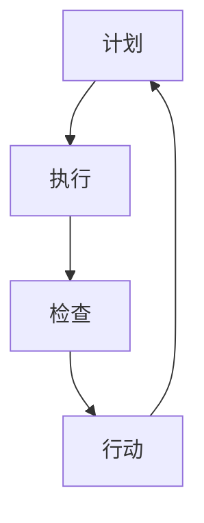

                 

关键字：PDCA、持续改进、质量管理体系、问题解决、效率提升

> 摘要：本文将深入探讨PDCA（计划-执行-检查-行动）这一经典的质量管理循环，详细阐述其在现代IT项目管理中的应用。通过理论讲解、案例分析及具体操作步骤，帮助读者掌握PDCA方法，实现项目持续改进。

## 1. 背景介绍

PDCA循环，也称为戴明循环，是由美国质量管理专家爱德华·戴明提出的一种用于持续改进的循环方法。PDCA循环包括四个阶段：计划（Plan）、执行（Do）、检查（Check）和行动（Act）。这种方法被广泛应用于制造业、服务业和IT领域，以帮助组织不断改进过程，提高产品和服务的质量。

在现代IT项目管理中，PDCA循环被广泛采用，因为它提供了一种系统化、结构化的方法来识别问题、分析原因、制定解决方案并实施改进。通过PDCA循环，IT项目团队能够更好地应对变化，提高项目的效率和成功率。

## 2. 核心概念与联系

为了更好地理解PDCA循环，我们需要先了解每个阶段的核心概念及其相互关系。以下是一个简化的Mermaid流程图，展示了PDCA循环中的各个阶段及其关联：



### 2.1 计划（Plan）

计划阶段是PDCA循环的起点。在这个阶段，团队需要明确项目的目标、确定所需资源、制定详细的计划和时间表。计划阶段的关键任务是：

- **目标设定**：明确项目目标和期望结果。
- **资源分配**：确定完成项目所需的资源，包括人员、设备和资金。
- **风险分析**：识别潜在的风险并制定应对措施。
- **任务分解**：将项目目标分解为可操作的任务和里程碑。

### 2.2 执行（Do）

执行阶段是将计划付诸实践的过程。在这个阶段，团队需要按照计划执行任务，确保项目按照预定的时间表和预算进行。执行阶段的关键任务是：

- **任务执行**：按照计划执行任务，确保所有活动都得到有效执行。
- **团队协作**：确保团队成员之间的沟通和协作顺畅，共同完成项目任务。
- **问题解决**：在执行过程中，如果遇到问题，需要及时解决，确保项目能够继续推进。

### 2.3 检查（Check）

检查阶段是对执行阶段的结果进行评估和审核。在这个阶段，团队需要收集数据、分析结果，并与计划目标进行比较，以确定项目是否达到了预期效果。检查阶段的关键任务是：

- **结果评估**：评估项目执行的结果，分析是否符合计划目标。
- **数据收集**：收集与项目相关的数据，为后续的分析提供基础。
- **问题识别**：通过对比分析，识别项目中的问题和不足。

### 2.4 行动（Act）

行动阶段是根据检查结果采取行动的过程。在这个阶段，团队需要根据检查阶段的结果，对成功的经验和失败的教训进行总结，并制定相应的改进措施。行动阶段的关键任务是：

- **经验总结**：总结项目中的成功经验和教训。
- **改进措施**：制定改进措施，以防止问题再次发生。
- **持续改进**：将改进措施纳入到下一个PDCA循环中，实现持续改进。

## 3. 核心算法原理 & 具体操作步骤

### 3.1 算法原理概述

PDCA循环的核心算法原理是基于持续改进和迭代的思想。通过计划、执行、检查和行动四个阶段，团队可以不断优化项目过程，提高项目质量和效率。

### 3.2 算法步骤详解

#### 3.2.1 计划阶段

1. 确定项目目标和期望结果。
2. 分析现有资源和需求，制定资源分配计划。
3. 识别潜在风险并制定应对措施。
4. 将项目目标分解为可操作的任务和里程碑。

#### 3.2.2 执行阶段

1. 按照计划执行任务，确保项目按照预定的时间表和预算进行。
2. 保持团队成员之间的沟通和协作，共同完成项目任务。
3. 及时解决执行过程中遇到的问题。

#### 3.2.3 检查阶段

1. 收集与项目相关的数据，分析项目执行的结果。
2. 评估项目是否达到了计划目标。
3. 识别项目中的问题和不足。

#### 3.2.4 行动阶段

1. 总结项目中的成功经验和教训。
2. 制定改进措施，以防止问题再次发生。
3. 将改进措施纳入到下一个PDCA循环中，实现持续改进。

### 3.3 算法优缺点

#### 优点：

- **系统化**：PDCA循环提供了一种系统化的方法，有助于团队更好地管理和改进项目过程。
- **迭代性**：通过不断迭代，团队可以逐步优化项目过程，提高项目质量和效率。
- **灵活性**：PDCA循环具有灵活性，可以根据项目需求和实际情况进行调整。

#### 缺点：

- **时间成本**：PDCA循环需要投入一定的时间和精力，特别是计划阶段和检查阶段。
- **实施难度**：在某些情况下，团队可能难以准确识别问题和制定有效的改进措施。

### 3.4 算法应用领域

PDCA循环广泛应用于制造业、服务业和IT领域。在IT项目中，PDCA循环可以帮助团队提高项目质量、缩短项目周期、降低项目风险。

## 4. 数学模型和公式 & 详细讲解 & 举例说明

### 4.1 数学模型构建

PDCA循环中的数学模型主要包括以下几个关键指标：

1. **项目进度**：表示项目实际完成情况与计划进度之间的差距。
2. **资源利用率**：表示项目实际资源消耗与计划资源消耗之间的比例。
3. **质量指标**：表示项目实际质量与计划质量之间的差距。

### 4.2 公式推导过程

#### 4.2.1 项目进度公式

$$
项目进度 = \frac{已完成工作量}{计划工作量}
$$

#### 4.2.2 资源利用率公式

$$
资源利用率 = \frac{实际资源消耗}{计划资源消耗}
$$

#### 4.2.3 质量指标公式

$$
质量指标 = \frac{实际质量得分}{计划质量得分}
$$

### 4.3 案例分析与讲解

假设某个IT项目计划在30天内完成，预算为50万元。项目实际完成情况如下：

- 已完成工作量：60%
- 实际资源消耗：45万元
- 实际质量得分：85分

根据上述数据，我们可以计算出以下关键指标：

1. **项目进度**：项目进度为60%，表示项目实际完成情况超过计划进度。
2. **资源利用率**：资源利用率为90%，表示项目实际资源消耗低于计划资源消耗。
3. **质量指标**：质量指标为85%，表示项目实际质量略低于计划质量。

通过这些关键指标，项目团队可以识别出项目中的问题和不足，并制定相应的改进措施。

## 5. 项目实践：代码实例和详细解释说明

### 5.1 开发环境搭建

为了实现PDCA循环在IT项目中的应用，我们首先需要搭建一个适合的开发环境。开发环境包括以下工具：

- **项目管理工具**：如JIRA、Trello等，用于任务分配和进度跟踪。
- **代码管理工具**：如Git，用于版本控制和协作开发。
- **自动化测试工具**：如Selenium、JUnit等，用于测试代码质量和功能稳定性。

### 5.2 源代码详细实现

以下是一个简单的PDCA循环实现示例：

```java
public class PDCA {
    // 计划阶段
    public void plan() {
        System.out.println("计划阶段：确定项目目标和制定计划");
    }

    // 执行阶段
    public void doTask() {
        System.out.println("执行阶段：按照计划执行任务");
    }

    // 检查阶段
    public void check() {
        System.out.println("检查阶段：评估项目执行结果");
    }

    // 行动阶段
    public void act() {
        System.out.println("行动阶段：总结经验，制定改进措施");
    }

    public static void main(String[] args) {
        PDCA pdca = new PDCA();
        pdca.plan();
        pdca.doTask();
        pdca.check();
        pdca.act();
    }
}
```

### 5.3 代码解读与分析

上述代码实现了PDCA循环的基本功能。在main方法中，依次调用了plan、doTask、check和act方法，模拟了PDCA循环的执行过程。通过这段代码，我们可以看到PDCA循环的四个阶段是如何相互关联的。

### 5.4 运行结果展示

运行上述代码，将输出以下结果：

```
计划阶段：确定项目目标和制定计划
执行阶段：按照计划执行任务
检查阶段：评估项目执行结果
行动阶段：总结经验，制定改进措施
```

通过这段简单的代码，我们可以直观地看到PDCA循环的执行过程。在实际项目中，我们可以根据具体情况，对这段代码进行扩展和优化，以实现更复杂的PDCA应用。

## 6. 实际应用场景

PDCA循环在IT项目管理中的应用非常广泛。以下是一些常见的实际应用场景：

1. **软件开发项目**：在软件开发项目中，PDCA循环可以帮助团队提高软件质量、缩短开发周期、降低项目风险。
2. **运维管理**：在IT运维管理中，PDCA循环可以帮助团队优化运维流程、提高系统稳定性、降低故障率。
3. **网络安全**：在网络安全管理中，PDCA循环可以帮助团队识别安全威胁、制定安全策略、提高网络安全防护能力。

通过PDCA循环，IT项目团队可以不断优化项目过程，提高项目质量和效率，从而实现持续改进。

### 6.4 未来应用展望

随着技术的发展，PDCA循环在IT项目管理中的应用将越来越广泛。未来，PDCA循环可能会与人工智能、大数据分析等新兴技术相结合，实现更智能、更高效的持续改进。例如，利用机器学习算法对项目数据进行实时分析，自动识别问题和提出改进建议，从而提高PDCA循环的执行效果。

## 7. 工具和资源推荐

为了更好地应用PDCA循环，我们推荐以下工具和资源：

### 7.1 学习资源推荐

- 《质量管理方法与实践》
- 《项目管理知识体系指南》
- 《PDCA循环及其在IT项目中的应用》

### 7.2 开发工具推荐

- **项目管理工具**：JIRA、Trello、Asana
- **代码管理工具**：Git、GitHub、GitLab
- **自动化测试工具**：Selenium、JUnit、TestNG

### 7.3 相关论文推荐

- 《基于PDCA循环的IT项目管理方法研究》
- 《PDCA循环在软件开发中的应用分析》
- 《大数据背景下的PDCA循环优化策略》

## 8. 总结：未来发展趋势与挑战

### 8.1 研究成果总结

通过本文的讨论，我们可以看到PDCA循环在IT项目管理中具有重要的作用。它提供了一种系统化、结构化的方法，帮助团队不断改进项目过程，提高项目质量和效率。

### 8.2 未来发展趋势

未来，PDCA循环在IT项目管理中的应用将越来越广泛。随着人工智能、大数据等新兴技术的发展，PDCA循环有望实现更智能、更高效的持续改进。

### 8.3 面临的挑战

然而，PDCA循环在应用中也面临一些挑战，如实施难度、数据收集和分析的准确性等。这些挑战需要通过技术手段和管理优化来解决。

### 8.4 研究展望

我们期待未来的研究能够进一步探索PDCA循环在IT项目管理中的应用，结合新兴技术，为项目团队提供更智能、更高效的持续改进方案。

## 9. 附录：常见问题与解答

### 9.1 PDCA循环的具体步骤是什么？

PDCA循环的具体步骤包括：计划（Plan）、执行（Do）、检查（Check）和行动（Act）。每个阶段都有明确的任务和目标。

### 9.2 PDCA循环如何应用于IT项目管理？

PDCA循环可以应用于IT项目管理的各个阶段，包括项目规划、执行、监控和改进。通过PDCA循环，IT项目团队可以持续改进项目过程，提高项目质量和效率。

### 9.3 如何确保PDCA循环的有效实施？

确保PDCA循环有效实施的关键在于：明确每个阶段的目标和任务、建立有效的沟通和协作机制、及时收集和分析项目数据、制定并执行有效的改进措施。

## 作者署名

作者：禅与计算机程序设计艺术 / Zen and the Art of Computer Programming
----------------------------------------------------------------

以上便是文章的完整撰写。请根据要求，确保文章的格式、结构、内容均符合要求，并准确包含所有必要的章节和部分。祝撰写顺利！

