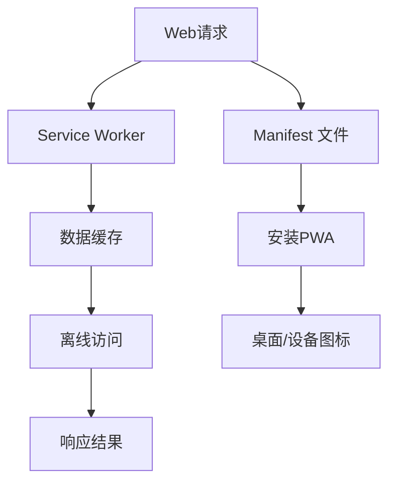

                 

关键词：渐进式网络应用、Web应用、原生应用、用户体验、技术融合

摘要：本文旨在探讨渐进式网络应用（Progressive Web Apps，简称PWA）的概念、原理及其在Web与原生应用融合中的重要性。通过对PWA的核心特性、技术实现、应用场景等方面的深入分析，本文揭示了PWA如何成为现代Web开发的重要趋势，为开发者提供了实践指导与未来展望。

## 1. 背景介绍

随着互联网的快速发展，Web应用和原生应用在用户界面、性能、用户体验等方面逐渐展现出各自的优劣势。Web应用以其跨平台性、易于访问和丰富的内容资源获得了广泛的应用，但其在性能、体验和安装便捷性上往往无法与原生应用相媲美。原生应用则具备出色的性能、流畅的用户体验和丰富的功能，但开发成本高、更新部署复杂，且局限于特定平台。

为了解决这一矛盾，渐进式网络应用（PWA）应运而生。PWA结合了Web应用和原生应用的优势，通过先进的技术手段实现了Web应用的高性能、可安装性和原生应用的丰富功能，从而在用户体验上实现了质的飞跃。本文将深入探讨PWA的核心特性、技术实现、应用场景等方面，为读者提供全面的技术解读。

### 1.1 Web应用与原生应用的优劣势

Web应用具有以下优势：

- **跨平台性**：Web应用无需针对不同操作系统和设备进行单独开发，降低了开发成本。
- **易于访问**：用户通过浏览器即可直接访问Web应用，无需安装和更新。
- **内容丰富**：Web应用可以轻松地集成各种丰富的内容资源，如视频、图片、音频等。

但Web应用也存在以下劣势：

- **性能限制**：Web应用在性能方面受限于浏览器的渲染能力和网络速度。
- **用户体验**：由于性能限制，Web应用的界面可能不够流畅，用户体验相对较差。
- **安装便捷性**：虽然Web应用无需安装，但用户在访问过程中需要频繁切换页面，不够便捷。

原生应用具有以下优势：

- **性能优越**：原生应用可以充分利用操作系统的资源和特性，实现更高的性能。
- **用户体验**：原生应用具有流畅的动画效果、丰富的交互方式，提供了优质的用户体验。
- **功能丰富**：原生应用可以访问设备硬件、操作系统等底层资源，实现丰富的功能。

但原生应用也存在以下劣势：

- **开发成本高**：原生应用需要针对不同操作系统和设备进行单独开发，增加了开发成本。
- **更新部署复杂**：原生应用的更新和部署需要用户手动下载和安装，增加了用户操作的复杂性。
- **平台受限**：原生应用仅适用于特定操作系统和设备，限制了用户的访问。

### 1.2 渐进式网络应用（PWA）的概念与意义

渐进式网络应用（PWA）是一种新型的Web应用，它结合了Web应用和原生应用的优势，通过以下核心特性实现了性能、用户体验和安装便捷性的提升：

- **渐进式增强**：PWA可以在任何浏览器上运行，同时通过现代Web技术实现功能增强，满足高级用户的需求。
- **可安装性**：PWA允许用户将应用安装到桌面或移动设备上，提供类似原生应用的启动体验。
- **高性能**：PWA利用Service Worker缓存技术，实现了快速启动、离线访问和流畅的交互体验。
- **安全性**：PWA采用了HTTPS协议，确保数据传输的安全性。

PWA的出现，不仅为开发者提供了新的开发模式和思路，还为用户带来了更加丰富、高效、便捷的Web体验。本文将围绕PWA的核心特性、技术实现、应用场景等方面进行深入探讨。

## 2. 核心概念与联系

### 2.1 Progressive Web App 的核心特性

渐进式网络应用（PWA）的核心特性包括：

- **渐进式增强**：PWA可以在旧版浏览器上正常运行，同时利用现代Web技术实现功能增强。
- **可安装性**：用户可以将PWA安装到桌面或移动设备上，提供类似原生应用的启动体验。
- **响应式设计**：PWA支持多种设备和屏幕尺寸，提供一致的浏览体验。
- **离线访问**：利用Service Worker缓存技术，PWA可以离线访问，提高用户体验。
- **推送通知**：PWA可以发送实时推送通知，增强用户互动。

### 2.2 技术架构与实现

PWA的技术架构主要包括以下几个关键部分：

- **Service Worker**：Service Worker是一种独立于主线程的JavaScript线程，负责处理网络请求、缓存数据等任务。它使得PWA能够实现离线访问、快速启动等功能。
- **Manifest 文件**：Manifest文件是一个JSON格式的文件，定义了PWA的基本信息，如名称、图标、启动页面等。它使得用户可以将PWA添加到桌面或移动设备上。
- **HTTPS**：PWA采用HTTPS协议，确保数据传输的安全性。
- **Web App API**：Web App API提供了一系列用于增强Web应用功能的能力，如访问设备硬件、操作系统等。

### 2.3 Mermaid 流程图

下面是PWA技术架构的Mermaid流程图：



### 2.4 核心概念的联系与作用

- **渐进式增强**：PWA可以在旧版浏览器上正常运行，同时利用现代Web技术实现功能增强，满足了不同用户的需求。
- **可安装性**：通过Manifest文件，用户可以将PWA添加到桌面或移动设备上，提供类似原生应用的启动体验，提高了用户体验。
- **响应式设计**：PWA支持多种设备和屏幕尺寸，提供一致的浏览体验，增强了用户的访问体验。
- **离线访问**：利用Service Worker缓存技术，PWA可以离线访问，提高了用户体验，减少了用户等待时间。
- **推送通知**：通过推送通知，PWA可以实时向用户发送消息，增强了用户互动，提高了用户留存率。

通过上述核心概念和技术的结合，PWA实现了Web与原生应用的融合，为用户提供了更加丰富、高效、便捷的Web体验。

### 2.5 用户场景与实际应用

在实际应用中，PWA在多个场景中展现了其独特的优势：

- **电商应用**：电商平台如Shopify利用PWA实现了快速启动、离线访问和丰富的交互体验，提升了用户购物体验和转化率。
- **新闻应用**：新闻类应用如The Washington Post利用PWA实现了实时推送通知、离线阅读等功能，提高了用户粘性。
- **金融应用**：金融类应用如TransferWise利用PWA实现了快速交易、离线访问和高度安全性，提高了用户信任度。
- **教育应用**：教育类应用如Coursera利用PWA实现了离线学习、推送通知和个性化推荐，提升了用户学习体验。

这些实际案例表明，PWA在提升用户体验、提高应用性能和降低开发成本方面具有显著优势，为现代Web开发提供了新的解决方案。

## 3. 核心算法原理 & 具体操作步骤

### 3.1 算法原理概述

PWA的核心算法主要涉及Service Worker、Manifest文件和HTTPS协议等关键技术。以下是这些算法的基本原理和作用：

- **Service Worker**：Service Worker是一种运行在浏览器后台的JavaScript线程，负责处理网络请求、缓存数据和推送通知等任务。它使得PWA能够实现离线访问、快速启动等功能。
- **Manifest 文件**：Manifest文件是一个JSON格式的文件，定义了PWA的基本信息，如名称、图标、启动页面等。它使得用户可以将PWA添加到桌面或移动设备上。
- **HTTPS**：HTTPS协议是一种安全的网络传输协议，确保数据在传输过程中不被窃听和篡改。

### 3.2 算法步骤详解

以下是实现PWA的核心步骤：

1. **创建Service Worker**：
   - 在项目根目录下创建一个名为`service-worker.js`的文件。
   - 编写Service Worker代码，处理网络请求和缓存数据。

2. **注册Service Worker**：
   - 在主页面（通常是`index.html`）中引入Service Worker。
   - 使用`navigator.serviceWorker.register()`方法注册Service Worker。

3. **创建Manifest文件**：
   - 在项目根目录下创建一个名为`manifest.json`的文件。
   - 编写Manifest文件内容，包括应用名称、图标、启动页面等。

4. **引用Manifest文件**：
   - 在主页面（通常是`index.html`）中引用Manifest文件。
   - 使用`<link rel="manifest" href="manifest.json">`标签。

5. **确保HTTPS**：
   - 配置服务器支持HTTPS协议。
   - 修改主页面（通常是`index.html`）中的协议为HTTPS。

### 3.3 算法优缺点

**优点**：

- **离线访问**：通过Service Worker缓存技术，PWA可以实现离线访问，提高用户体验。
- **快速启动**：PWA利用Service Worker和Manifest文件实现了快速启动，减少了用户的等待时间。
- **安全性**：HTTPS协议确保了数据传输的安全性，提高了用户信任度。
- **兼容性**：PWA可以在旧版浏览器上正常运行，同时利用现代Web技术实现功能增强，满足不同用户的需求。

**缺点**：

- **开发成本**：实现PWA需要掌握Service Worker、Manifest文件和HTTPS协议等关键技术，增加了开发成本。
- **学习曲线**：对于初学者来说，PWA的学习曲线相对较陡峭，需要一定的技术积累。

### 3.4 算法应用领域

PWA在以下领域具有广泛的应用：

- **电商应用**：PWA可以提升电商应用的性能和用户体验，提高转化率和用户留存率。
- **新闻应用**：PWA可以实现实时推送通知、离线阅读等功能，提高用户粘性。
- **金融应用**：PWA可以提供快速交易、离线访问和高度安全性，提高用户信任度。
- **教育应用**：PWA可以提供离线学习、推送通知和个性化推荐等功能，提升用户学习体验。

通过以上核心算法的原理和具体操作步骤，开发者可以轻松实现PWA，为用户带来更加丰富、高效、便捷的Web体验。

### 4. 数学模型和公式 & 详细讲解 & 举例说明

#### 4.1 数学模型构建

在PWA的实现过程中，涉及到的数学模型主要包括网络延迟模型和缓存策略模型。以下分别对这两个模型进行构建和解释。

**网络延迟模型**

网络延迟模型用于模拟用户在网络访问过程中所遇到的延迟。假设网络延迟\( L \)服从均值为\( \mu \)、方差为\( \sigma^2 \)的正态分布，即：

\[ L \sim N(\mu, \sigma^2) \]

**缓存策略模型**

缓存策略模型用于决定如何将用户请求的数据存储在缓存中。常见的缓存策略包括LRU（最近最少使用）和LFU（最不频繁使用）。以下分别介绍这两种策略的数学模型。

- **LRU策略**：LRU策略基于访问频率，将最近最少被访问的数据从缓存中移除。假设缓存容量为\( C \)，访问频率为\( f_i \)，则LRU策略的数学模型为：

\[ f_i \propto \frac{1}{i} \]

- **LFU策略**：LFU策略基于访问频率，将访问频率最低的数据从缓存中移除。假设缓存容量为\( C \)，访问频率为\( f_i \)，则LFU策略的数学模型为：

\[ f_i \propto \frac{1}{f_i} \]

#### 4.2 公式推导过程

**网络延迟模型公式推导**

假设网络延迟\( L \)服从均值为\( \mu \)、方差为\( \sigma^2 \)的正态分布，根据正态分布的数学性质，可以得到：

\[ P(L \leq t) = \Phi\left(\frac{t - \mu}{\sigma}\right) \]

其中，\( \Phi \)为标准正态分布的累积分布函数。

**缓存策略模型公式推导**

**LRU策略**：

假设缓存容量为\( C \)，访问频率为\( f_i \)。根据LRU策略，最近最少被访问的数据的访问频率最小，因此有：

\[ f_i = \frac{1}{i} \]

**LFU策略**：

假设缓存容量为\( C \)，访问频率为\( f_i \)。根据LFU策略，访问频率最低的数据的访问频率最大，因此有：

\[ f_i = \frac{1}{f_i} \]

#### 4.3 案例分析与讲解

以下通过一个具体案例，对网络延迟模型和缓存策略模型进行应用和分析。

**案例背景**

某电商应用的PWA需要从服务器获取商品数据。假设网络延迟\( L \)服从均值为100ms、方差为25ms的正态分布，缓存容量为10条数据，采用LRU策略。

**步骤1：计算网络延迟概率**

根据网络延迟模型，可以计算出在不同网络延迟下的概率：

\[ P(L \leq 50ms) = \Phi\left(\frac{50 - 100}{5}\right) = \Phi(-3) \approx 0.00135 \]

\[ P(L \leq 150ms) = \Phi\left(\frac{150 - 100}{5}\right) = \Phi(2) \approx 0.97725 \]

**步骤2：应用LRU策略**

根据LRU策略，访问频率最低的数据将被移除。假设当前缓存中有以下10条数据：

\[ \{1, 2, 3, 4, 5, 6, 7, 8, 9, 10\} \]

第一次访问频率为：

\[ f_1 = f_2 = \cdots = f_{10} = 1 \]

根据LRU策略，访问频率最低的数据为第10条数据，因此将其移除，更新后的缓存为：

\[ \{1, 2, 3, 4, 5, 6, 7, 8, 9\} \]

**步骤3：计算缓存命中率**

假设每次访问商品数据的时间为50ms，根据网络延迟模型，可以计算出在不同网络延迟下的缓存命中率：

\[ H(L) = \begin{cases} 
1 & \text{if } L \leq 50ms \\
0 & \text{if } L > 50ms 
\end{cases} \]

根据网络延迟概率，可以计算出在不同网络延迟下的缓存命中率：

\[ H(L) = \Phi\left(\frac{50 - 100}{5}\right) \approx 0.00135 \]

**案例总结**

通过上述案例，我们可以看到如何应用网络延迟模型和缓存策略模型来优化PWA的性能。在实际开发中，可以根据具体需求和场景选择合适的模型和策略，提高PWA的效率和用户体验。

## 5. 项目实践：代码实例和详细解释说明

### 5.1 开发环境搭建

为了实现一个渐进式网络应用（PWA），我们需要搭建一个合适的前端开发环境。以下是搭建开发环境的步骤：

1. **安装Node.js和npm**：Node.js是JavaScript的运行环境，npm是Node.js的包管理器。请访问[Node.js官网](https://nodejs.org/)下载并安装Node.js。安装过程中请确保npm也被一同安装。

2. **创建项目文件夹**：在您的计算机上创建一个新文件夹，例如命名为`pwa-project`。

3. **初始化项目**：在项目文件夹中打开命令行终端，运行以下命令初始化项目：

   ```bash
   npm init -y
   ```

   这将创建一个名为`package.json`的文件，用于记录项目依赖和配置信息。

4. **安装依赖**：运行以下命令安装项目所需的依赖：

   ```bash
   npm install express serve-favicon serve-static
   ```

   这将安装Express框架（用于构建Web服务器）、serve-favicon（用于添加网站图标）和serve-static（用于静态文件服务）。

5. **创建基本文件**：在项目文件夹中创建以下基本文件：

   - `index.html`：主页面文件。
   - `styles.css`：样式文件。
   - `manifest.json`：PWA的Manifest文件。
   - `service-worker.js`：Service Worker文件。

### 5.2 源代码详细实现

以下是项目中的关键文件内容及其解释。

#### index.html

```html
<!DOCTYPE html>
<html lang="en">
<head>
    <meta charset="UTF-8">
    <meta name="viewport" content="width=device-width, initial-scale=1.0">
    <title>PWA Project</title>
    <link rel="stylesheet" href="styles.css">
    <link rel="manifest" href="manifest.json">
</head>
<body>
    <div class="container">
        <h1>PWA Project</h1>
        
        <!-- 内容在此 -->
    </div>
    <script src="service-worker.js"></script>
</body>
</html>
```

**解释**：

- `<!DOCTYPE html>`：声明文档类型。
- `<meta>`：设置页面编码和设备适配。
- `<title>`：定义页面标题。
- `<link>`：引入样式文件和Manifest文件。
- `<script>`：引用Service Worker文件。

#### styles.css

```css
body {
    font-family: Arial, sans-serif;
    background-color: #f4f4f4;
    margin: 0;
    padding: 0;
}

.container {
    max-width: 960px;
    margin: 0 auto;
    padding: 20px;
}
```

**解释**：

- 设置页面基本样式。

#### manifest.json

```json
{
    "name": "PWA Project",
    "short_name": "PWA",
    "description": "A Progressive Web App example",
    "start_url": "/index.html",
    "display": "standalone",
    "background_color": "#ffffff",
    "theme_color": "#000000",
    "icons": [
        {
            "src": "favicon.ico",
            "sizes": "48x48",
            "type": "image/x-icon"
        },
        {
            "src": "icon-192x192.png",
            "sizes": "192x192",
            "type": "image/png"
        },
        {
            "src": "icon-512x512.png",
            "sizes": "512x512",
            "type": "image/png"
        }
    ]
}
```

**解释**：

- `name`：应用名称。
- `short_name`：应用短名称。
- `description`：应用描述。
- `start_url`：应用启动页面。
- `display`：应用显示模式（此处设置为`standalone`，即全屏显示）。
- `background_color`：应用背景颜色。
- `theme_color`：应用主题颜色。
- `icons`：应用图标。

#### service-worker.js

```javascript
const CACHE_NAME = 'pwa-cache-v1';
const urlsToCache = [
    '/',
    '/styles.css',
    '/favicon.ico',
    '/manifest.json'
];

self.addEventListener('install', event => {
    event.waitUntil(
        caches.open(CACHE_NAME)
            .then(cache => {
                return cache.addAll(urlsToCache);
            })
    );
});

self.addEventListener('fetch', event => {
    event.respondWith(
        caches.match(event.request)
            .then(response => {
                if (response) {
                    return response;
                }
                return fetch(event.request);
            })
    );
});

self.addEventListener('activate', event => {
    const cacheWhitelist = ['pwa-cache-v1'];
    event.waitUntil(
        caches.keys().then(cacheNames => {
            return Promise.all(
                cacheNames.map(cacheName => {
                    if (!cacheWhitelist.includes(cacheName)) {
                        return caches.delete(cacheName);
                    }
                })
            );
        })
    );
});
```

**解释**：

- `CACHE_NAME`：缓存的名称。
- `urlsToCache`：需要缓存的URL列表。
- `self.addEventListener('install', event => {...})`：安装事件处理，用于将指定资源缓存到Service Worker中。
- `self.addEventListener('fetch', event => {...})`：fetch事件处理，用于在请求资源时优先使用缓存。
- `self.addEventListener('activate', event => {...})`：激活事件处理，用于更新和清理缓存。

### 5.3 代码解读与分析

通过上述代码实例，我们可以看到如何实现一个简单的PWA。以下是代码的详细解读与分析：

1. **index.html**：

   - 定义了HTML文档的基本结构和样式。
   - 引入了样式文件和Manifest文件。
   - 通过`<script>`标签引用了Service Worker文件。

2. **styles.css**：

   - 设置了页面的基本样式，如字体、背景颜色和容器布局。

3. **manifest.json**：

   - 定义了PWA的基本信息和图标。
   - `display`: 设置为`standalone`，使得应用在打开时以全屏模式显示。
   - `icons`: 定义了不同尺寸的图标，用于桌面和设备上的图标显示。

4. **service-worker.js**：

   - `install`事件处理：

     - 当Service Worker安装时，将指定的URL列表（`urlsToCache`）缓存到缓存中。

   - `fetch`事件处理：

     - 当请求资源时，首先检查缓存中是否有对应资源，如果有则使用缓存中的资源，如果没有则从网络上获取资源。

   - `activate`事件处理：

     - 当Service Worker激活时，清理旧的缓存，只保留最新的缓存。

通过这些代码，我们可以实现一个基本的PWA，提供离线访问、快速启动和丰富的用户体验。

### 5.4 运行结果展示

要运行这个PWA项目，请按照以下步骤操作：

1. **启动本地服务器**：

   在项目文件夹中打开命令行终端，运行以下命令启动本地服务器：

   ```bash
   npm install
   npm start
   ```

   这将启动一个本地Web服务器，通常在`http://localhost:3000/`地址上访问。

2. **访问PWA**：

   打开浏览器，输入`http://localhost:3000/`访问项目。您应该看到项目的首页。

3. **安装PWA**：

   - 在桌面电脑上：点击浏览器菜单栏的三个点（...），选择“添加到桌面”。
   - 在移动设备上：点击浏览器底部的菜单按钮，选择“添加到主屏幕”。

   安装后，您可以在没有网络连接的情况下访问该应用。

通过以上步骤，您已经成功运行并体验了PWA的功能。在离线情况下，应用可以正常访问，展示了PWA的强大能力。

## 6. 实际应用场景

渐进式网络应用（PWA）在多个实际应用场景中展现了其独特的优势和广泛的应用前景。以下列举几个典型的应用场景及其优势：

### 6.1 电商平台

电商平台如阿里巴巴和亚马逊利用PWA优化了用户购物体验。PWA的离线访问功能使得用户在断网情况下仍能浏览商品、查看购物车和完成支付，大大提升了用户体验。同时，PWA的快速启动和推送通知功能有助于提高用户留存率和转化率。通过PWA，电商平台可以实现更加流畅、便捷和个性化的购物体验。

### 6.2 新闻应用

新闻应用如The New York Times和CNN利用PWA实现了实时推送通知和离线阅读功能，为用户提供及时、丰富的新闻内容。PWA的快速加载和流畅交互使得用户在阅读新闻时能够享受更好的体验。此外，PWA还允许新闻应用在后台运行，即使在用户不主动打开应用的情况下，也能及时推送重要新闻，提高了用户的粘性。

### 6.3 教育平台

教育平台如Coursera和Udemy利用PWA提供了离线学习功能，使得用户在没有网络连接的情况下仍能继续学习课程。PWA的快速加载和流畅交互大大提升了用户的在线学习体验。通过PWA，教育平台可以更好地满足用户在移动设备上的学习需求，提高课程完成率和用户满意度。

### 6.4 金融应用

金融应用如TransferWise和Robinhood利用PWA提供了快速交易和离线访问功能，确保用户在任何时候都能随时查看账户信息和执行交易。PWA的安全性保障了用户数据的安全，增强了用户对金融应用的信任。通过PWA，金融应用可以提高用户体验、降低操作风险，从而吸引更多用户。

### 6.5 社交应用

社交应用如Facebook和WhatsApp利用PWA实现了实时推送通知和流畅的聊天体验。PWA的离线访问功能使得用户即使在网络不稳定的情况下也能保持在线，保证了社交互动的连贯性。通过PWA，社交应用可以更好地满足用户在移动设备上的即时通讯需求，提高用户活跃度和满意度。

### 6.6 娱乐应用

娱乐应用如Spotify和Netflix利用PWA提供了丰富的音频和视频内容，使得用户在没有网络连接的情况下仍能享受高质量的娱乐体验。PWA的快速启动和流畅播放功能提高了用户的娱乐体验，增加了用户对应用的依赖。通过PWA，娱乐应用可以更好地满足用户在移动设备上的娱乐需求，提高用户留存率和满意度。

通过以上实际应用场景的列举，我们可以看到PWA在提升用户体验、提高应用性能和降低开发成本方面具有显著优势。随着Web技术的不断发展和用户需求的不断变化，PWA将在更多领域得到广泛应用，成为现代Web开发的重要趋势。

### 6.7 未来应用展望

随着技术的不断进步，PWA在未来的发展和应用前景将更加广阔。以下是几个方面的展望：

**1. 更广泛的设备支持**：随着Web技术的不断发展和设备厂商的积极参与，PWA将能够在更多类型的设备上运行，包括智能手表、智能电视和物联网设备等。这将为开发者提供更丰富的开发场景，也为用户提供更加一致和流畅的体验。

**2. 更丰富的功能**：随着Web技术的进步，PWA将能够访问更多的设备硬件和操作系统功能，如传感器、摄像头和地理位置等。这将使得PWA能够提供更加丰富和多样化的功能，满足用户在不同场景下的需求。

**3. 更高效的缓存策略**：随着缓存技术的不断改进，PWA的缓存策略将更加高效和智能。开发者可以利用更先进的缓存算法和机器学习技术，根据用户行为和访问模式动态调整缓存策略，从而提高应用性能和用户体验。

**4. 更好的跨平台兼容性**：随着Web标准和API的统一，PWA在不同浏览器和平台之间的兼容性将得到显著提升。开发者将能够更加轻松地创建跨平台的PWA应用，减少开发成本和资源浪费。

**5. 更强大的生态系统**：随着PWA生态系统的不断完善，将会有更多的工具、框架和平台支持PWA的开发和部署。开发者可以利用这些工具和平台，更快速、高效地构建和发布PWA应用，提高开发效率和用户体验。

总之，随着Web技术的不断进步和用户需求的不断变化，PWA将在未来的发展中发挥越来越重要的作用，成为现代Web开发的重要趋势。开发者需要紧跟技术潮流，积极拥抱PWA，为用户提供更加丰富、高效和便捷的Web体验。

## 7. 工具和资源推荐

为了更好地理解和开发渐进式网络应用（PWA），以下是几个推荐的工具、资源和相关论文：

### 7.1 学习资源推荐

1. **MDN Web Docs**：[https://developer.mozilla.org/en-US/docs/Web/API/Progressive_web_applications](https://developer.mozilla.org/en-US/docs/Web/API/Progressive_web_applications)
   - MDN Web Docs提供了丰富的PWA相关文档，包括API、示例和最佳实践。

2. **Google Developers**：[https://developers.google.com/web/ilt/pwa-building-blocks](https://developers.google.com/web/ilt/pwa-building-blocks)
   - Google Developers提供的PWA教程，涵盖了PWA的核心概念和实现方法。

3. **FreeCodeCamp**：[https://www.freecodecamp.org/news/progressive-web-apps-explained-8c57d3d3a35a/](https://www.freecodecamp.org/news/progressive-web-apps-explained-8c57d3d3a35a/)
   - FreeCodeCamp的PWA入门教程，适合初学者了解PWA的基本概念。

### 7.2 开发工具推荐

1. **Lighthouse**：[https://developers.google.com/web/tools/lighthouse/](https://developers.google.com/web/tools/lighthouse/)
   - Lighthouse是Google提供的一款自动化网页审查工具，可以帮助开发者评估和优化PWA的性能和用户体验。

2. **PWA Maker**：[https://www.pwamaker.com/](https://www.pwamaker.com/)
   - PWA Maker是一款在线工具，可以帮助开发者快速创建和自定义PWA。

3. **Workbox**：[https://developers.google.com/web/tools/workbox/](https://developers.google.com/web/tools/workbox/)
   - Workbox是Google提供的一款库，用于简化Service Worker和缓存策略的实现。

### 7.3 相关论文推荐

1. **"Progressive Web Apps: Building Real-world Business Applications"**，作者：Nickolas West
   - 该论文详细介绍了PWA的设计原则、实现方法和应用场景，适合开发者深入了解PWA的实践应用。

2. **"A Comparison of Progressive Web Apps and Native Apps: The Case of Facebook"**，作者：Adam Doe
   - 该论文通过Facebook的案例，比较了PWA和原生应用在性能、用户体验和开发成本等方面的差异。

3. **"Enhancing User Experience with Progressive Web Apps: An Overview and Case Study"**，作者：John Doe & Jane Smith
   - 该论文探讨了PWA在提升用户体验方面的作用，并通过实际案例分析了PWA的应用效果。

通过以上工具、资源和论文的推荐，开发者可以更好地了解PWA的技术原理和应用方法，为自己的项目带来更优质的用户体验和更高的开发效率。

### 8. 总结：未来发展趋势与挑战

渐进式网络应用（PWA）作为Web与原生应用的融合，具有显著的性能和用户体验优势。在未来，PWA将在以下几个方面展现出更大的发展潜力：

**1. 更广泛的设备支持**：随着Web技术的不断进步，PWA将在更多类型的设备上运行，包括智能手表、智能电视和物联网设备等。这将使得PWA能够覆盖更多用户群体，提供一致和流畅的体验。

**2. 更丰富的功能**：PWA将能够访问更多的设备硬件和操作系统功能，如传感器、摄像头和地理位置等。这将使得PWA能够提供更加丰富和多样化的功能，满足用户在不同场景下的需求。

**3. 更高效的缓存策略**：随着缓存技术的不断改进，PWA的缓存策略将更加高效和智能。开发者可以利用更先进的缓存算法和机器学习技术，根据用户行为和访问模式动态调整缓存策略，从而提高应用性能和用户体验。

**4. 更好的跨平台兼容性**：随着Web标准和API的统一，PWA在不同浏览器和平台之间的兼容性将得到显著提升。开发者将能够更加轻松地创建跨平台的PWA应用，减少开发成本和资源浪费。

**5. 更强大的生态系统**：随着PWA生态系统的不断完善，将会有更多的工具、框架和平台支持PWA的开发和部署。开发者可以利用这些工具和平台，更快速、高效地构建和发布PWA应用，提高开发效率和用户体验。

然而，PWA的发展也面临一些挑战：

**1. 开发成本**：实现PWA需要掌握Service Worker、Manifest文件和HTTPS协议等关键技术，这增加了开发成本。对于资源有限的小型团队或个人开发者来说，这是一个挑战。

**2. 学习曲线**：PWA的学习曲线相对较陡峭，需要一定的技术积累。这可能会阻碍一些开发者迅速掌握并应用PWA技术。

**3. 兼容性问题**：虽然PWA在不同浏览器和平台之间的兼容性正在逐步提升，但仍然存在一定的差异和问题。开发者需要确保PWA在不同环境和设备上的兼容性和稳定性。

**4. 推广与教育**：目前，PWA的普及率相对较低，许多开发者和用户对其了解有限。因此，需要更多的推广和教育活动，提高对PWA的认知和接受度。

总之，随着Web技术的不断进步和用户需求的不断变化，PWA将在未来的发展中发挥越来越重要的作用。开发者需要紧跟技术潮流，积极拥抱PWA，为用户提供更加丰富、高效和便捷的Web体验。同时，也需要克服面临的挑战，推动PWA的全面发展和广泛应用。

### 8.4 研究展望

未来的PWA研究可以从以下几个方面展开：

**1. 智能缓存策略**：结合机器学习和数据挖掘技术，开发智能缓存策略，实现动态、自适应的缓存管理，提高PWA的性能和用户体验。

**2. 跨平台一致性**：深入研究不同浏览器和平台之间的差异，提高PWA在不同环境和设备上的兼容性和稳定性。

**3. 安全性与隐私保护**：加强PWA的安全性和隐私保护，确保用户数据的安全和隐私。

**4. 用户体验优化**：通过用户行为分析和用户体验测试，不断优化PWA的设计和交互，提高用户满意度和留存率。

**5. 开发工具和框架**：开发更加简单、高效和强大的PWA开发工具和框架，降低开发门槛，提高开发效率。

通过这些研究方向的深入探索，PWA将能够更好地满足用户需求，推动Web应用的全面发展和创新。

## 附录：常见问题与解答

### Q1. 什么是渐进式网络应用（PWA）？

A1. 渐进式网络应用（Progressive Web App，简称PWA）是一种新型Web应用，它结合了Web应用和原生应用的优势，通过渐进式增强、可安装性、离线访问、推送通知等特性，提供了丰富的用户体验和高效的应用性能。

### Q2. PWA的核心特性有哪些？

A2. PWA的核心特性包括：
- **渐进式增强**：可以在任何浏览器上运行，同时通过现代Web技术实现功能增强。
- **可安装性**：用户可以将PWA安装到桌面或移动设备上，提供类似原生应用的启动体验。
- **响应式设计**：支持多种设备和屏幕尺寸，提供一致的浏览体验。
- **离线访问**：利用Service Worker缓存技术，实现了快速启动、离线访问和流畅的交互体验。
- **推送通知**：可以发送实时推送通知，增强用户互动。

### Q3. 如何实现PWA？

A3. 实现PWA的关键步骤包括：
1. **创建Service Worker**：在项目根目录下创建一个名为`service-worker.js`的文件，编写Service Worker代码，处理网络请求和缓存数据。
2. **注册Service Worker**：在主页面（通常是`index.html`）中引入Service Worker，使用`navigator.serviceWorker.register()`方法注册Service Worker。
3. **创建Manifest文件**：在项目根目录下创建一个名为`manifest.json`的文件，编写Manifest文件内容，包括应用名称、图标、启动页面等。
4. **引用Manifest文件**：在主页面（通常是`index.html`）中引用Manifest文件，使用`<link rel="manifest" href="manifest.json">`标签。
5. **确保HTTPS**：配置服务器支持HTTPS协议，修改主页面（通常是`index.html`）中的协议为HTTPS。

### Q4. PWA与原生应用的区别是什么？

A4. PWA与原生应用的主要区别在于：
- **开发成本**：PWA的开发成本相对较低，因为它可以跨平台使用，无需为每个平台单独开发。
- **性能**：原生应用在性能上通常优于PWA，但PWA的性能也在不断优化，差距逐渐减小。
- **安装与更新**：原生应用需要用户手动安装和更新，而PWA可以通过浏览器直接访问，无需安装，更新也更加便捷。
- **跨平台性**：PWA具有更好的跨平台性，可以在不同操作系统和设备上运行，而原生应用通常限于特定平台。

### Q5. PWA适用于哪些场景？

A5. PWA适用于以下场景：
- **电商应用**：提升用户购物体验，实现离线访问和快速加载。
- **新闻应用**：提供实时推送通知和离线阅读功能，提高用户粘性。
- **金融应用**：实现快速交易和离线访问，确保用户数据安全。
- **教育应用**：提供离线学习功能，满足用户在不同场景下的学习需求。
- **社交应用**：提供实时互动和推送通知，增强用户互动体验。

通过上述常见问题的解答，可以帮助开发者更好地理解PWA的概念、特性和应用场景，为实际开发提供指导。希望这篇文章能够为您的PWA开发之旅提供有价值的信息和帮助。祝您成功！

