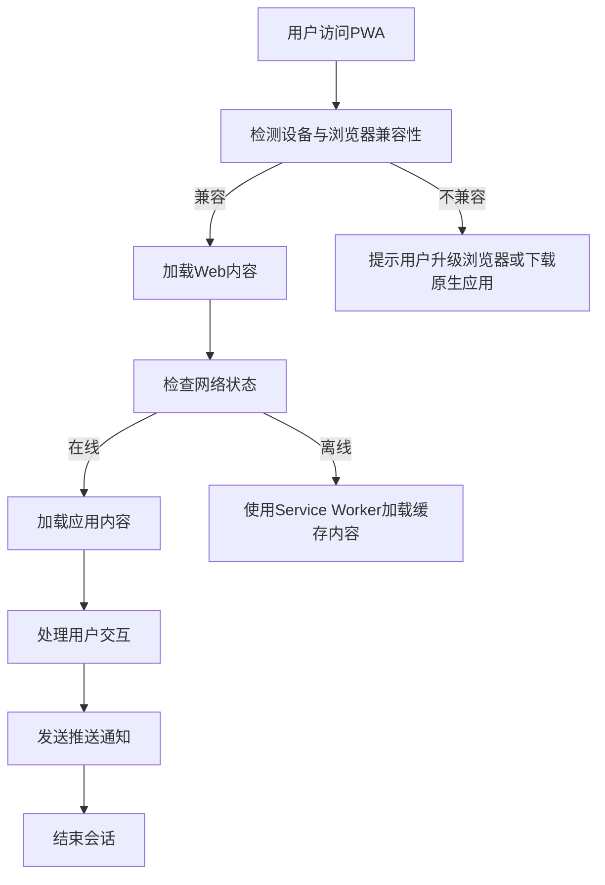

                 

关键词： Progressive Web Apps (PWA), Web应用, 原生应用, 融合, 性能优化, 用户体验

> 摘要：随着移动设备的普及和互联网的快速发展，用户对于应用性能和用户体验的要求越来越高。本文将探讨Progressive Web Apps（PWA）的概念、核心特性以及如何实现Web与原生应用的融合，从而提升用户体验和性能。

## 1. 背景介绍

随着移动互联网的迅猛发展，Web应用和原生应用在市场上都占据着重要的地位。Web应用因其跨平台、开发成本低等特点受到广泛欢迎，而原生应用则因其更好的性能和用户体验受到用户的青睐。然而，这两种应用各自存在一定的局限性。

Web应用主要面临以下挑战：
1. 性能瓶颈：由于网络延迟和浏览器性能的限制，Web应用的加载速度和响应速度常常不如原生应用。
2. 用户体验：Web应用无法提供与原生应用相同级别的用户体验，例如离线使用、推送通知等功能。

原生应用主要面临以下挑战：
1. 跨平台开发成本高：开发一个原生应用需要针对不同的平台（如iOS和Android）分别进行开发，增加了开发成本和难度。
2. 分散的用户群体：由于不同平台的应用商店规则不同，应用需要同时上架到多个平台，增加了分发和推广的难度。

为了解决这些问题，Progressive Web Apps（PWA）应运而生。PWA结合了Web应用的灵活性和原生应用的性能，为用户提供了一种全新的应用体验。

## 2. 核心概念与联系

### 2.1 PWA的核心概念

Progressive Web Apps（PWA）是一种基于Web的应用，它利用现代Web技术，提供与原生应用相似的用户体验。PWA的核心概念包括以下几个方面：

1. **渐进式增强（Progressive Enhancement）**：PWA旨在为所有用户提供一种基础的功能体验，无论用户使用的是哪种设备或浏览器。通过渐进式增强，PWA可以在用户设备的性能允许的情况下，提供更多的功能和更好的用户体验。

2. **响应式设计（Responsive Design）**：PWA采用响应式设计，能够自动适应不同尺寸的屏幕，提供一致的视觉和交互体验。

3. **离线功能（Offline Functionality）**：PWA可以使用Service Worker实现离线功能，用户即使在网络中断的情况下，也能继续使用应用的核心功能。

4. **推送通知（Push Notifications）**：PWA可以发送推送通知，实时更新用户信息，提高用户互动性。

5. **Web App Manifest**：Web App Manifest是一个JSON文件，描述了PWA的基本信息，如名称、图标、主题颜色等。通过Web App Manifest，用户可以方便地将PWA添加到主屏幕，实现类似于原生应用的操作体验。

### 2.2 PWA与Web应用、原生应用的联系

PWA是Web应用的一种演进形态，它继承了Web应用的跨平台和开发成本低等优点，同时通过引入原生应用的特性，提升了用户体验和性能。

与Web应用相比，PWA通过Service Worker和Cache API实现了离线功能，通过Web App Manifest提供了更直观的安装体验。此外，PWA还采用了响应式设计，使得应用能够自动适应不同的设备尺寸。

与原生应用相比，PWA无需针对不同平台进行开发，大大降低了开发成本和难度。同时，PWA具有更好的性能和用户体验，尤其是在网络条件较差的情况下，PWA的表现更为出色。

### 2.3 Mermaid流程图

以下是一个简化的Mermaid流程图，展示了PWA的核心概念和组成部分：



## 3. 核心算法原理 & 具体操作步骤

### 3.1 算法原理概述

PWA的核心算法主要基于Service Worker和Cache API。Service Worker是一个运行在后台的JavaScript线程，用于处理网络请求、缓存资源等操作。Cache API则用于管理缓存，使得应用可以离线使用。

### 3.2 算法步骤详解

1. **注册Service Worker**：在PWA的入口文件（如index.html）中，通过`register`方法注册Service Worker。

   ```javascript
   if ('serviceWorker' in navigator) {
     window.navigator.serviceWorker.register('/service-worker.js').then(function(registration) {
       console.log('Service Worker registered:', registration);
     }).catch(function(error) {
       console.log('Service Worker registration failed:', error);
     });
   }
   ```

2. **Service Worker生命周期**：Service Worker会在应用加载完成后开始运行，并在应用关闭或浏览器关闭时停止运行。

3. **缓存资源**：在Service Worker中，可以通过Cache API缓存应用的资源，例如HTML、CSS、JavaScript等。

   ```javascript
   self.addEventListener('install', function(event) {
     event.waitUntil(
       caches.open('my-cache').then(function(cache) {
         return cache.addAll([
           '/',
           '/styles/main.css',
           '/scripts/main.js'
         ]);
       })
     );
   });
   ```

4. **请求拦截与响应**：在Service Worker中，可以通过`fetch`事件拦截网络请求，并决定是否使用缓存响应。

   ```javascript
   self.addEventListener('fetch', function(event) {
     event.respondWith(
       caches.match(event.request).then(function(response) {
         if (response) {
           return response;
         }
         return fetch(event.request);
       })
     );
   });
   ```

5. **推送通知**：在Service Worker中，可以通过`push`事件接收推送通知，并通知用户。

   ```javascript
   self.addEventListener('push', function(event) {
     const notificationData = JSON.parse(event.data.text());
     const options = {
       body: notificationData.body,
       icon: 'images/avatar.png',
       vibrate: [100, 50, 100],
       data: {
         dateOfNotification: Date.now(),
         id: notificationData.id
       }
     };
     event.waitUntil(self.registration.showNotification(notificationData.title, options));
   });
   ```

### 3.3 算法优缺点

**优点**：
1. 提升用户体验：通过缓存资源，实现快速加载和离线功能。
2. 跨平台兼容性：无需针对不同平台进行开发，适用于所有支持Service Worker的浏览器。
3. 优化性能：通过Service Worker管理资源加载和缓存，减少服务器请求，提升应用性能。

**缺点**：
1. 兼容性问题：Service Worker并非所有浏览器都支持，部分旧版浏览器无法使用PWA特性。
2. 开发难度：虽然PWA开发相对原生应用简单，但需要掌握Service Worker和Cache API等新特性。

### 3.4 算法应用领域

PWA广泛应用于各种场景，包括电子商务、在线教育、新闻阅读等。以下是几个典型应用领域：

1. **电子商务**：通过PWA，电商应用可以实现快速加载和离线购买，提升用户购物体验。
2. **在线教育**：PWA使得在线教育平台能够在离线状态下继续学习，方便用户随时随地进行学习。
3. **新闻阅读**：PWA可以为新闻应用提供实时推送功能，用户可以在离线状态下查看最新新闻。

## 4. 数学模型和公式 & 详细讲解 & 举例说明

### 4.1 数学模型构建

PWA的性能评估可以通过以下数学模型进行分析：

- **加载时间（T）**：应用从服务器加载到用户可见的平均时间。
- **响应时间（R）**：用户发起操作到应用响应的平均时间。
- **缓存命中率（H）**：从缓存中获取资源的次数与总请求次数的比值。

### 4.2 公式推导过程

1. **加载时间公式**：

   \( T = \frac{L_1 + L_2 + L_3 + \ldots}{N} \)

   其中，\( L_1 \) 为首次加载所需时间，\( L_2 \) 为后续加载所需时间，\( N \) 为总请求次数。

2. **响应时间公式**：

   \( R = \frac{R_1 + R_2 + R_3 + \ldots}{N} \)

   其中，\( R_1 \) 为首次响应所需时间，\( R_2 \) 为后续响应所需时间，\( N \) 为总请求次数。

3. **缓存命中率公式**：

   \( H = \frac{C}{N} \)

   其中，\( C \) 为从缓存中获取资源的次数，\( N \) 为总请求次数。

### 4.3 案例分析与讲解

假设一个电商应用，总请求次数为100次，首次加载所需时间为10秒，后续加载所需时间为5秒，首次响应所需时间为2秒，后续响应所需时间为1秒，从缓存中获取资源的次数为50次。

根据上述公式，可以计算出：

- **加载时间**：\( T = \frac{10 + 50 \times 5}{100} = 2.5 \) 秒
- **响应时间**：\( R = \frac{2 + 98 \times 1}{100} = 1.02 \) 秒
- **缓存命中率**：\( H = \frac{50}{100} = 50\% \)

这个案例表明，通过使用PWA，电商应用可以显著提升加载和响应时间，同时提高缓存命中率。

## 5. 项目实践：代码实例和详细解释说明

### 5.1 开发环境搭建

1. **创建项目**：使用Webpack创建一个新项目。

   ```bash
   npx create-webpack-app my-pwa
   ```

2. **安装依赖**：安装PWA相关依赖。

   ```bash
   cd my-pwa
   npm install workbox-webpack-plugin
   ```

### 5.2 源代码详细实现

1. **配置Webpack**：在Webpack配置文件（webpack.config.js）中添加PWA插件。

   ```javascript
   const WorkboxWebpackPlugin = require('workbox-webpack-plugin');

   module.exports = {
     // ...其他配置
     plugins: [
       new WorkboxWebpackPlugin.GenerateSW({
         clientsClaim: true,
         skipWaiting: true
       })
     ]
   };
   ```

2. **创建Service Worker**：在src目录下创建service-worker.js。

   ```javascript
   importScripts('https://storage.googleapis.com/workbox-cdn/releases/6.1.5/workbox-sw.js');

   workbox.setConfig({ debug: false });

   workbox.precaching.precacheAndRoute([]);

   workbox.routing.registerRoute(
     ({ request }) => request.destination === 'image',
     new workbox.strategies.CacheFirst()
   );
   ```

3. **添加Web App Manifest**：在src目录下创建manifest.json。

   ```json
   {
     "short_name": "My PWA",
     "name": "My Progressive Web App",
     "icons": [
       {
         "src": "icon/192x192.png",
         "sizes": "192x192",
         "type": "image/png"
       },
       {
         "src": "icon/512x512.png",
         "sizes": "512x512",
         "type": "image/png"
       }
     ],
     "start_url": "/",
     "background_color": "#ffffff",
     "display": "standalone",
     "scope": "/",
     "theme_color": "#000000"
   }
   ```

4. **在HTML中引用Manifest**：在index.html中添加manifest属性。

   ```html
   <html manifest="manifest.json">
   ```

### 5.3 代码解读与分析

1. **Webpack配置**：通过WorkboxWebpackPlugin，Webpack会自动生成Service Worker文件，并配置缓存策略。

2. **Service Worker**：Service Worker文件中，使用了Workbox库提供的API进行预缓存和路由策略配置。

3. **Manifest**：Manifest文件定义了PWA的基本信息，如图标、名称等，并指定了应用的启动页面。

通过这些代码实现，我们可以将一个普通Web应用转换为PWA，为用户提供更好的性能和体验。

### 5.4 运行结果展示

1. **安装PWA**：访问应用，并在浏览器的设置中添加到主屏幕。

2. **离线使用**：在网络中断的情况下，用户可以继续使用应用的核心功能。

3. **推送通知**：应用可以发送推送通知，实时更新用户信息。

通过以上实践，我们可以看到PWA如何将Web应用转变为具有原生应用特性的应用。

## 6. 实际应用场景

### 6.1 电子商务

PWA在电子商务领域的应用非常广泛。例如，阿里巴巴旗下的淘宝和天猫都在其移动端应用中使用了PWA技术。通过PWA，用户可以在离线状态下浏览商品、添加购物车和下单，大大提升了用户体验。

### 6.2 在线教育

在线教育平台如Coursera、edX等也广泛采用了PWA技术。通过PWA，学生可以在离线状态下继续学习课程，不受网络条件的限制。此外，PWA还可以提供实时推送功能，让学生及时接收课程更新和通知。

### 6.3 新闻阅读

新闻应用如Google News、今日头条等也采用了PWA技术。通过PWA，用户可以在离线状态下阅读新闻，提高阅读体验。同时，PWA还可以发送推送通知，实时更新新闻动态。

## 7. 未来应用展望

随着5G网络的普及和Web技术的不断发展，PWA在未来的应用前景将更加广阔。以下是几个可能的发展方向：

1. **性能优化**：随着网络速度的提升，PWA的性能瓶颈将逐渐缓解，为用户提供更加流畅的应用体验。

2. **跨平台支持**：随着更多浏览器和设备的支持，PWA的跨平台能力将得到进一步提升。

3. **人工智能结合**：PWA可以与人工智能技术结合，提供个性化推荐、智能搜索等功能。

4. **云计算与边缘计算结合**：PWA可以与云计算和边缘计算结合，实现更加高效的数据处理和资源分配。

## 8. 工具和资源推荐

### 8.1 学习资源推荐

1. **《Building Progressive Web Apps》**：一本关于PWA的权威指南，详细介绍了PWA的开发方法和技术细节。
2. **MDN Web Docs**：Mozilla开发网络文档，提供了丰富的PWA相关教程和示例。

### 8.2 开发工具推荐

1. **Webpack**：一个模块打包工具，可以帮助开发者快速构建PWA。
2. **Workbox**：一个用于生成Service Worker和缓存策略的库，简化了PWA的开发过程。

### 8.3 相关论文推荐

1. **"Progressive Web Apps: Developing Fast, Reliable Web Apps for Any Device"**：一篇关于PWA的学术论文，详细探讨了PWA的优势和挑战。
2. **"An Evaluation of Progressive Web Apps: Performance, User Experience, and Developer Productivity"**：一篇关于PWA性能评估的研究论文，分析了PWA在实际应用中的表现。

## 9. 总结：未来发展趋势与挑战

### 9.1 研究成果总结

本文详细介绍了PWA的概念、核心特性、算法原理、实际应用场景和未来发展趋势。通过PWA，Web应用可以兼具原生应用的性能和用户体验，为用户提供更好的应用体验。

### 9.2 未来发展趋势

1. **性能优化**：随着网络技术的发展，PWA的性能瓶颈将逐渐缓解，为用户提供更加流畅的应用体验。
2. **跨平台支持**：更多浏览器和设备的支持将使PWA的普及范围进一步扩大。
3. **人工智能结合**：PWA与人工智能技术的结合将为用户提供更加智能化的应用体验。

### 9.3 面临的挑战

1. **兼容性问题**：虽然PWA得到了广泛支持，但仍有一些浏览器和设备无法完全兼容。
2. **开发难度**：虽然PWA开发相对原生应用简单，但仍需要开发者掌握一些新的技术和概念。

### 9.4 研究展望

未来，PWA将继续在Web应用领域发挥重要作用，结合人工智能和云计算等新技术，为用户提供更加智能和高效的在线体验。

## 10. 附录：常见问题与解答

### 10.1 PWA是否需要安装？

PWA可以通过Web App Manifest方便地安装到主屏幕，但用户不需要进行安装操作，只需在浏览器的设置中添加到主屏幕即可。

### 10.2 PWA如何实现离线功能？

PWA通过Service Worker和Cache API实现离线功能。Service Worker可以缓存应用的资源，Cache API可以管理缓存，使得应用在离线状态下可以继续使用。

### 10.3 PWA与原生应用有什么区别？

PWA是Web应用的一种演进形态，它结合了Web应用的跨平台和开发成本低等优点，同时通过引入原生应用的特性，提升了用户体验和性能。与原生应用相比，PWA无需针对不同平台进行开发，降低了开发成本和难度。但PWA在性能和用户体验上仍有提升空间。

### 10.4 PWA适用于哪些场景？

PWA适用于需要快速加载、离线使用和推送通知的Web应用场景，如电子商务、在线教育、新闻阅读等。通过PWA，应用可以提供更好的用户体验和性能，提升用户满意度。

### 10.5 如何评估PWA的性能？

可以通过加载时间、响应时间和缓存命中率等指标评估PWA的性能。这些指标可以帮助开发者了解应用的实际表现，并进行优化。

### 10.6 PWA与Web App Manifest有什么关系？

Web App Manifest是PWA的核心组成部分，它描述了PWA的基本信息，如名称、图标、主题颜色等。通过Web App Manifest，用户可以方便地将PWA添加到主屏幕，实现类似于原生应用的操作体验。

## 11. 参考资料

1. "Building Progressive Web Apps" by Jeremy Wagner.
2. "Service Worker: A Brief Introduction" by Mozilla Developer Network.
3. "Introduction to Progressive Web Apps" by Google Developers.
4. "Progressive Web Apps: A Comprehensive Guide" by Smashing Magazine.
5. "Workbox: A set of libraries to make working with service workers easier." by Google Chrome Developers. 

**作者：禅与计算机程序设计艺术 / Zen and the Art of Computer Programming**

