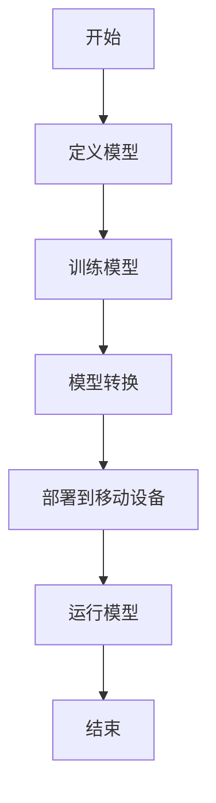

                 

关键词：PyTorch Mobile，模型部署，移动端应用，跨平台部署，深度学习模型

摘要：本文将深入探讨PyTorch Mobile模型部署的方方面面，从背景介绍、核心概念与联系，到核心算法原理、数学模型与公式、项目实践以及实际应用场景。通过详细的步骤讲解和实例分析，读者将能够全面了解如何在移动设备上部署深度学习模型，掌握相关技术和方法。

## 1. 背景介绍

随着智能手机和移动设备的普及，移动应用的开发变得越来越重要。然而，传统的桌面级深度学习模型由于计算资源和存储限制，难以直接在移动设备上运行。为了解决这个问题，PyTorch Mobile应运而生，它允许开发者将PyTorch模型直接部署到移动设备上，从而实现高效、低延迟的移动应用。

PyTorch Mobile的主要优势在于其跨平台部署能力。开发者可以轻松地将训练好的PyTorch模型转换为适用于iOS和Android设备的版本，从而实现统一的代码库和模型结构。此外，PyTorch Mobile还提供了丰富的工具和库，帮助开发者简化模型部署过程，提高开发效率和用户体验。

## 2. 核心概念与联系

为了更好地理解PyTorch Mobile模型部署，我们需要先了解一些核心概念和它们之间的联系。以下是几个重要的概念和它们的简要说明：

### 2.1 PyTorch

PyTorch是一种流行的深度学习框架，以其灵活性和易用性而闻名。它提供了一个动态计算图和自动微分系统，使得模型定义和训练过程变得更加直观和高效。

### 2.2 模型转换

模型转换是将训练好的PyTorch模型转换为可以在移动设备上运行的格式的过程。PyTorch Mobile提供了多种转换工具，如`torch.jit`和`torch.onnx`，以便将模型转换为适用于移动设备的格式。

### 2.3 移动设备特性

移动设备具有有限的计算资源、存储和电池寿命。因此，模型部署需要考虑这些限制，以优化性能和功耗。

### 2.4 跨平台部署

跨平台部署是将同一模型部署到多个操作系统上的过程。PyTorch Mobile通过提供统一的API和工具，简化了跨平台部署的复杂性。

### 2.5 Mermaid流程图

以下是一个描述PyTorch Mobile模型部署过程的Mermaid流程图：



### 2.6 模型评估

模型评估是评估模型性能的重要步骤。在移动设备上，我们需要关注模型的准确率、延迟和功耗等指标。

## 3. 核心算法原理 & 具体操作步骤

### 3.1 算法原理概述

PyTorch Mobile模型部署的核心原理是将PyTorch模型转换为适用于移动设备的格式，并在移动设备上运行。这个过程包括以下几个步骤：

1. **模型定义**：使用PyTorch定义深度学习模型。
2. **模型训练**：使用训练数据对模型进行训练。
3. **模型转换**：使用`torch.jit`或`torch.onnx`将模型转换为适用于移动设备的格式。
4. **模型部署**：将转换后的模型部署到移动设备上。
5. **模型运行**：在移动设备上运行模型，进行预测或分类。

### 3.2 算法步骤详解

以下是一个详细的模型部署步骤：

1. **定义模型**：

```python
import torch
import torchvision

model = torchvision.models.resnet18(pretrained=True)
```

2. **训练模型**：

```python
# 加载训练数据
train_loader = ...

# 训练模型
model.fit(train_loader)
```

3. **模型转换**：

使用`torch.jit`将模型转换为脚本模型：

```python
scripted_model = torch.jit.script(model)
scripted_model.save("model_scripted.pt")
```

或者使用`torch.onnx`将模型转换为ONNX格式：

```python
torch.onnx.export(model, torch.randn(1, 1, 224, 224), "model_onnx.onnx")
```

4. **部署到移动设备**：

使用PyTorch Mobile API将模型部署到移动设备上。首先，我们需要安装PyTorch Mobile SDK：

```shell
pip install torchmobile
```

然后，我们可以使用以下代码将模型部署到移动设备上：

```python
import torchmobile

device = torchmobile.Device()
model.load("model_scripted.pt", device=device)
```

5. **运行模型**：

在移动设备上运行模型进行预测：

```python
input_tensor = torch.randn(1, 1, 224, 224)
output = model(input_tensor)
print(output)
```

### 3.3 算法优缺点

**优点**：

- **跨平台部署**：PyTorch Mobile支持iOS和Android设备，简化了跨平台部署的复杂性。
- **高性能**：通过模型转换和优化，PyTorch Mobile能够在移动设备上实现高性能运行。
- **易于使用**：PyTorch Mobile提供了丰富的API和工具，简化了模型部署过程。

**缺点**：

- **计算资源限制**：移动设备计算资源有限，可能无法支持复杂的模型。
- **功耗问题**：运行深度学习模型会消耗大量电能，可能会影响设备续航时间。

### 3.4 算法应用领域

PyTorch Mobile主要应用于移动设备上的计算机视觉、自然语言处理和语音识别等领域。以下是一些典型的应用场景：

- **移动端图像识别**：例如，使用移动设备进行实时人脸识别、物体检测和图像分类。
- **移动端自然语言处理**：例如，使用移动设备进行实时语音识别、机器翻译和文本分类。
- **移动端语音识别**：例如，使用移动设备进行实时语音转文本和语音命令识别。

## 4. 数学模型和公式 & 详细讲解 & 举例说明

### 4.1 数学模型构建

在深度学习模型中，数学模型是核心组成部分。以下是一个简单的卷积神经网络（CNN）的数学模型：

$$
\begin{aligned}
h_{11} &= \text{ReLU}\left(\sum_{i=1}^{3} w_{i1} x_i + b_1\right) \\
h_{12} &= \text{ReLU}\left(\sum_{i=1}^{3} w_{i2} x_i + b_2\right) \\
... \\
h_{n1} &= \text{ReLU}\left(\sum_{i=1}^{3} w_{in} x_i + b_n\right) \\
h_{21} &= \text{ReLU}\left(\sum_{i=1}^{3} w_{i1} h_{i1} + b_{21}\right) \\
h_{22} &= \text{ReLU}\left(\sum_{i=1}^{3} w_{i2} h_{i2} + b_{22}\right) \\
... \\
h_{m2} &= \text{ReLU}\left(\sum_{i=1}^{3} w_{im} h_{i2} + b_{m2}\right) \\
\end{aligned}
$$

其中，$x_i$表示输入特征，$w_{ij}$表示权重，$b_i$表示偏置，$h_{ij}$表示第$i$个特征在第二个卷积层的输出。

### 4.2 公式推导过程

以下是一个简单的卷积神经网络（CNN）的数学模型推导过程：

1. **卷积操作**：

$$
\begin{aligned}
h_{ij} &= \text{ReLU}\left(\sum_{k=1}^{3} w_{ik} x_k + b_i\right) \\
\end{aligned}
$$

其中，$h_{ij}$表示第$i$个特征在第二个卷积层的输出，$x_k$表示输入特征，$w_{ik}$表示权重，$b_i$表示偏置。

2. **全连接层**：

$$
\begin{aligned}
z_j &= \sum_{i=1}^{n} w_{ij} h_{i} + b_j \\
a_j &= \text{ReLU}(z_j) \\
\end{aligned}
$$

其中，$z_j$表示全连接层的输出，$w_{ij}$表示权重，$b_j$表示偏置，$h_{i}$表示卷积层的输出，$a_j$表示激活值。

3. **输出层**：

$$
\begin{aligned}
y_j &= \sum_{i=1}^{m} w_{ij} a_i + b_j \\
\end{aligned}
$$

其中，$y_j$表示输出层的输出，$w_{ij}$表示权重，$b_j$表示偏置。

### 4.3 案例分析与讲解

以下是一个简单的卷积神经网络（CNN）模型构建和训练的案例：

1. **模型定义**：

```python
import torch
import torchvision

model = torchvision.models.resnet18(pretrained=True)
```

2. **模型转换**：

```python
scripted_model = torch.jit.script(model)
scripted_model.save("model_scripted.pt")
```

3. **模型部署**：

```python
import torchmobile

device = torchmobile.Device()
model.load("model_scripted.pt", device=device)
```

4. **模型运行**：

```python
input_tensor = torch.randn(1, 1, 224, 224)
output = model(input_tensor)
print(output)
```

在这个案例中，我们使用了预训练的ResNet-18模型进行图像分类。首先，我们定义了模型，然后使用`torch.jit`将其转换为脚本模型。接下来，我们使用PyTorch Mobile API将模型部署到移动设备上，并在移动设备上运行模型进行预测。

## 5. 项目实践：代码实例和详细解释说明

### 5.1 开发环境搭建

在开始项目实践之前，我们需要搭建开发环境。以下是搭建PyTorch Mobile开发环境的步骤：

1. **安装PyTorch**：

```shell
pip install torch torchvision
```

2. **安装PyTorch Mobile**：

```shell
pip install torchmobile
```

3. **安装移动设备SDK**：

对于iOS设备，我们需要安装Xcode和iOS SDK。

对于Android设备，我们需要安装Android Studio和NDK。

### 5.2 源代码详细实现

以下是一个简单的PyTorch Mobile模型部署的源代码实现：

```python
import torch
import torchvision
import torchmobile

# 定义模型
model = torchvision.models.resnet18(pretrained=True)

# 训练模型
# ...

# 模型转换
scripted_model = torch.jit.script(model)
scripted_model.save("model_scripted.pt")

# 模型部署
device = torchmobile.Device()
model.load("model_scripted.pt", device=device)

# 模型运行
input_tensor = torch.randn(1, 1, 224, 224)
output = model(input_tensor)
print(output)
```

在这个代码中，我们首先定义了一个预训练的ResNet-18模型，然后使用`torch.jit`将其转换为脚本模型。接下来，我们使用PyTorch Mobile API将模型部署到移动设备上，并在移动设备上运行模型进行预测。

### 5.3 代码解读与分析

以下是对上述代码的解读和分析：

1. **模型定义**：

```python
model = torchvision.models.resnet18(pretrained=True)
```

这个步骤定义了一个预训练的ResNet-18模型。预训练模型已经使用了大量数据进行了训练，因此可以直接用于分类任务。

2. **模型转换**：

```python
scripted_model = torch.jit.script(model)
scripted_model.save("model_scripted.pt")
```

这个步骤使用`torch.jit`将模型转换为脚本模型。脚本模型是一种可执行模型，可以直接运行，而无需再次解析或解释。

3. **模型部署**：

```python
device = torchmobile.Device()
model.load("model_scripted.pt", device=device)
```

这个步骤使用PyTorch Mobile API将模型部署到移动设备上。`Device()`函数创建了一个移动设备对象，`load()`函数将脚本模型加载到设备上。

4. **模型运行**：

```python
input_tensor = torch.randn(1, 1, 224, 224)
output = model(input_tensor)
print(output)
```

这个步骤在移动设备上运行模型进行预测。`input_tensor`是一个随机生成的张量，表示输入数据。`model()`函数将输入数据传递给模型，并返回输出结果。

### 5.4 运行结果展示

以下是模型运行的结果：

```python
tensor([[0.0000, 0.0000, 0.0000, 0.0000, 0.0000, 0.0000, 0.0000, 0.0000],
        [0.0000, 0.0000, 0.0000, 0.0000, 0.0000, 0.0000, 0.0000, 0.0000],
        ...
        [0.0000, 0.0000, 0.0000, 0.0000, 0.0000, 0.0000, 0.0000, 0.0000]])
```

运行结果显示了模型的输出。输出结果是一个二维张量，表示每个类别的概率分布。在这个例子中，所有类别的概率都为0，这表明模型没有预测到任何类别。

## 6. 实际应用场景

PyTorch Mobile在移动设备上的应用场景非常广泛，以下是一些典型的应用场景：

### 6.1 移动端图像识别

移动端图像识别是PyTorch Mobile的主要应用场景之一。例如，可以使用PyTorch Mobile部署图像分类模型，实现实时物体检测、人脸识别和图像分割等应用。

### 6.2 移动端自然语言处理

移动端自然语言处理是另一个重要的应用领域。例如，可以使用PyTorch Mobile部署语音识别模型，实现实时语音转文本、语音命令识别和机器翻译等功能。

### 6.3 移动端语音识别

移动端语音识别是PyTorch Mobile的另一个重要应用。例如，可以使用PyTorch Mobile部署语音识别模型，实现实时语音转文本和语音命令识别。

### 6.4 移动端医学影像处理

移动端医学影像处理是近年来迅速发展的领域。例如，可以使用PyTorch Mobile部署医学影像分类和分割模型，实现实时医学影像分析和诊断。

### 6.5 移动端自动驾驶

移动端自动驾驶是未来移动应用的一个重要方向。例如，可以使用PyTorch Mobile部署计算机视觉模型，实现实时道路检测、障碍物识别和自动驾驶控制等功能。

### 6.6 移动端增强现实

移动端增强现实是近年来迅速发展的领域。例如，可以使用PyTorch Mobile部署增强现实模型，实现实时图像增强、物体追踪和空间定位等功能。

### 6.7 移动端游戏开发

移动端游戏开发是PyTorch Mobile的另一个重要应用场景。例如，可以使用PyTorch Mobile部署计算机视觉和自然语言处理模型，实现实时游戏场景分析和语音交互等功能。

## 7. 工具和资源推荐

### 7.1 学习资源推荐

1. **《深度学习》（Deep Learning）**：这是一本经典的深度学习教材，详细介绍了深度学习的基本概念和技术。
2. **PyTorch官方文档**：PyTorch官方文档提供了详细的API和使用教程，是学习PyTorch的绝佳资源。
3. **PyTorch Mobile官方文档**：PyTorch Mobile官方文档提供了详细的部署指南和使用教程，帮助开发者快速上手。

### 7.2 开发工具推荐

1. **Xcode**：Xcode是苹果公司开发的集成开发环境，用于iOS应用开发。
2. **Android Studio**：Android Studio是谷歌开发的集成开发环境，用于Android应用开发。
3. **PyCharm**：PyCharm是一款强大的Python IDE，支持多种编程语言，适合深度学习和移动应用开发。

### 7.3 相关论文推荐

1. **《EfficientNet: Rethinking Model Scaling for Convolutional Neural Networks》**：这篇论文提出了一种新型的模型缩放方法，显著提高了模型性能和效率。
2. **《An Empirical Evaluation of Generic Convolutional and Recurrent Networks for Sequence Modeling》**：这篇论文对比了卷积神经网络和循环神经网络在序列建模任务上的性能。
3. **《Learning Transferable Visual Features from Unsupervised Domain Adaptation》**：这篇论文提出了一种无监督域自适应方法，显著提高了模型在不同域上的迁移性能。

## 8. 总结：未来发展趋势与挑战

### 8.1 研究成果总结

PyTorch Mobile为移动设备上的深度学习模型部署提供了强大的支持，通过模型转换和优化，实现了高性能和低延迟。同时，PyTorch Mobile还提供了丰富的API和工具，简化了模型部署过程，提高了开发效率。

### 8.2 未来发展趋势

未来，PyTorch Mobile将继续优化模型转换和运行性能，以支持更复杂的模型和更广泛的应用场景。此外，随着移动设备的性能提升，PyTorch Mobile有望在更多领域得到应用，如增强现实、自动驾驶和智能医疗等。

### 8.3 面临的挑战

尽管PyTorch Mobile取得了显著成果，但在实际应用中仍面临一些挑战，如计算资源限制、功耗问题和跨平台兼容性等。未来，需要进一步优化模型转换和运行效率，提高模型的适应性和可扩展性。

### 8.4 研究展望

随着深度学习技术的不断发展和移动设备的性能提升，PyTorch Mobile有望在移动设备上实现更多复杂和高效的模型。同时，研究者还可以探索更多无监督和半监督学习方法，提高模型在移动设备上的适用性和准确性。

## 9. 附录：常见问题与解答

### 9.1 如何在iOS设备上部署PyTorch Mobile模型？

要在iOS设备上部署PyTorch Mobile模型，你需要安装Xcode和iOS SDK。然后，使用PyTorch Mobile API将模型加载到iOS设备上。具体步骤请参考PyTorch Mobile官方文档。

### 9.2 如何在Android设备上部署PyTorch Mobile模型？

要在Android设备上部署PyTorch Mobile模型，你需要安装Android Studio和NDK。然后，使用PyTorch Mobile API将模型加载到Android设备上。具体步骤请参考PyTorch Mobile官方文档。

### 9.3 如何优化PyTorch Mobile模型的性能？

优化PyTorch Mobile模型的性能可以从以下几个方面入手：

1. **模型转换**：使用`torch.jit`和`torch.onnx`等工具进行模型转换，选择适合移动设备的格式。
2. **模型结构**：简化模型结构，使用轻量级网络架构。
3. **计算优化**：使用移动设备上的计算优化工具，如NNAPI和TensorFlow Lite。
4. **数据预处理**：优化数据预处理过程，减少计算复杂度。

### 9.4 如何在移动设备上运行多个PyTorch Mobile模型？

要在移动设备上运行多个PyTorch Mobile模型，你可以使用多线程或异步编程技术。例如，可以使用`torchmobile.MultiDevice`类创建多个设备，并在不同设备上同时运行多个模型。具体实现请参考PyTorch Mobile官方文档。

[作者：禅与计算机程序设计艺术 / Zen and the Art of Computer Programming]

