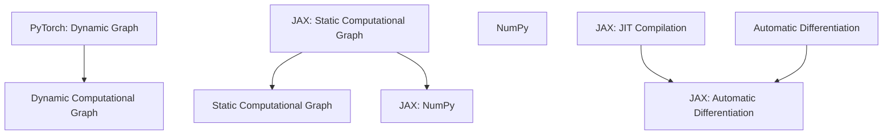

                 

## 1. 背景介绍

深度学习作为人工智能领域的重要分支，近年来取得了显著的进展。深度学习框架作为实现深度学习算法的核心工具，已经成为研究人员和开发者们广泛使用的利器。PyTorch和JAX是当前最为流行的深度学习框架之一，它们各自拥有独特的优势和特点，吸引了大量用户。本文将对比PyTorch和JAX，从多个方面分析它们的异同，帮助读者更好地选择和使用这些框架。

### 1.1 发展历史

PyTorch是由Facebook的人工智能研究团队在2016年推出的一个开源深度学习框架，基于Python语言和Torch库。它以其动态计算图和易用性而受到了广大研究人员的青睐，特别是在计算机视觉和自然语言处理领域。JAX则是由Google在2019年开源的一个深度学习框架，它基于Python的高性能计算库NumPy。JAX的设计目标是提供一个灵活的自动微分系统和高效的多设备计算支持，以满足各种深度学习任务的需求。

### 1.2 应用场景

PyTorch广泛应用于计算机视觉、自然语言处理、语音识别等领域，其简洁的API和动态计算图使得研究人员可以更加轻松地实现和调试模型。JAX则因其强大的自动微分能力和多设备计算支持，在强化学习、科学计算等领域有着广泛的应用。同时，JAX的灵活性使其能够适应多种应用场景，如图像处理、时间序列分析等。

## 2. 核心概念与联系

为了更好地理解PyTorch和JAX，我们需要首先了解它们的核心概念和架构。以下是一个用Mermaid绘制的流程图，展示了PyTorch和JAX的基本组成部分及其相互关系。



### 2.1 PyTorch

PyTorch的核心概念是动态计算图（Dynamic Computational Graph），这意味着在运行时，计算图是可以动态修改的。这种灵活性使得研究人员可以更加方便地调试和优化模型。

- **动态计算图**：PyTorch使用动态计算图来构建和执行计算任务。在构建阶段，操作和节点被动态创建和连接，而在执行阶段，计算图被遍历并执行相应的计算。
- **TorchScript**：为了提高性能，PyTorch提供了TorchScript，这是一种静态计算图，可以将动态计算图转换为编译后的代码，从而提高执行效率。
- **自动微分**：PyTorch提供了自动微分支持，可以使用`autograd`模块来计算模型参数的梯度。

### 2.2 JAX

JAX的核心概念是静态计算图（Static Computational Graph）和JIT编译（Just-In-Time Compilation）。JAX的设计目标是提供高效的自动微分和多设备计算支持。

- **静态计算图**：JAX使用静态计算图来构建和执行计算任务。一旦计算图被构建，它就不能再被修改，这使得JAX可以在编译时进行优化。
- **JIT编译**：JAX提供了JIT编译功能，可以将Python代码编译成机器码，从而提高执行效率。
- **自动微分**：JAX提供了自动微分支持，使用`jax.jit`函数可以轻松地将Python代码转换为自动微分代码。

## 3. 核心算法原理 & 具体操作步骤

### 3.1 算法原理概述

PyTorch和JAX在算法原理上有明显的不同。

- **PyTorch**：PyTorch的核心算法是基于动态计算图的自动微分。在构建计算图时，研究人员可以方便地使用Python代码来定义和操作模型。在执行阶段，计算图被遍历并执行相应的计算，同时自动微分模块`autograd`会计算模型参数的梯度。
- **JAX**：JAX的核心算法是基于静态计算图的自动微分和JIT编译。在构建计算图时，研究人员可以使用Python代码来定义模型和损失函数。JAX会在编译阶段对计算图进行优化，并在执行阶段使用JIT编译功能来提高执行效率。

### 3.2 算法步骤详解

#### PyTorch

1. **定义模型**：使用Python类定义神经网络模型。
2. **构建计算图**：使用Python代码构建动态计算图。
3. **前向传播**：使用计算图执行前向传播计算。
4. **计算损失**：计算模型损失。
5. **反向传播**：使用自动微分模块计算梯度。
6. **更新参数**：使用梯度更新模型参数。

#### JAX

1. **定义模型**：使用Python函数定义神经网络模型。
2. **构建计算图**：JAX会自动将Python函数转换为静态计算图。
3. **前向传播**：使用计算图执行前向传播计算。
4. **计算损失**：计算模型损失。
5. **JIT编译**：对计算图进行JIT编译，提高执行效率。
6. **自动微分**：使用JAX的自动微分功能计算梯度。
7. **更新参数**：使用梯度更新模型参数。

### 3.3 算法优缺点

#### PyTorch

- **优点**：动态计算图使得模型构建更加灵活，易于调试和优化。自动微分模块`autograd`提供了丰富的功能，方便研究人员进行深度学习实验。
- **缺点**：动态计算图可能导致性能下降，尤其是在大规模模型训练中。TorchScript虽然可以提高性能，但转换过程可能增加代码复杂性。

#### JAX

- **优点**：静态计算图和JIT编译提供了高效的执行性能，特别是在大规模计算任务中。自动微分功能强大，支持多种数据类型和计算模式。
- **缺点**：静态计算图的灵活性较低，模型构建和调试可能需要更多的代码和思考。

### 3.4 算法应用领域

#### PyTorch

- **计算机视觉**：PyTorch在计算机视觉领域有广泛的应用，如图像分类、目标检测、图像分割等。
- **自然语言处理**：PyTorch在自然语言处理领域也具有很高的影响力，如语言模型、机器翻译、文本分类等。

#### JAX

- **强化学习**：JAX在强化学习领域有着广泛的应用，如深度强化学习、策略优化等。
- **科学计算**：JAX在科学计算领域也具有优势，如模拟物理系统、优化问题等。

## 4. 数学模型和公式 & 详细讲解 & 举例说明

### 4.1 数学模型构建

深度学习中的数学模型主要涉及神经网络的构建和训练。以下是一个简单的神经网络模型及其相关的数学公式。

#### 4.1.1 神经网络模型

假设我们有一个包含L层的神经网络，其中每层都有n个神经元。输入向量为\(x\)，输出向量为\(y\)。模型中的参数包括权重矩阵\(W^{(l)}\)和偏置向量\(b^{(l)}\)。

#### 4.1.2 激活函数

常用的激活函数包括ReLU、Sigmoid和Tanh。

- **ReLU**：\(f(x) = \max(0, x)\)
- **Sigmoid**：\(f(x) = \frac{1}{1 + e^{-x}}\)
- **Tanh**：\(f(x) = \frac{e^x - e^{-x}}{e^x + e^{-x}}\)

#### 4.1.3 前向传播

前向传播的过程可以表示为：

\[ z^{(l)} = W^{(l)} \cdot a^{(l-1)} + b^{(l)} \]
\[ a^{(l)} = f(z^{(l)}) \]

其中，\(z^{(l)}\)是第l层的输出，\(a^{(l)}\)是第l层的激活值。

### 4.2 公式推导过程

以下是一个简单的损失函数（均方误差）及其梯度推导。

#### 4.2.1 损失函数

\[ J(\theta) = \frac{1}{m} \sum_{i=1}^{m} \frac{1}{2} (y_i - \hat{y}_i)^2 \]

其中，\(y_i\)是实际输出，\(\hat{y}_i\)是预测输出。

#### 4.2.2 梯度推导

对于每个参数\(\theta^{(l)}\)，我们可以使用链式法则来计算其梯度：

\[ \frac{\partial J}{\partial \theta^{(l)}_{ij}} = \frac{\partial J}{\partial z^{(l)}_{ij}} \cdot \frac{\partial z^{(l)}_{ij}}{\partial \theta^{(l)}_{ij}} \]

其中，\(\frac{\partial J}{\partial z^{(l)}_{ij}}\)是损失函数关于\(z^{(l)}_{ij}\)的梯度，\(\frac{\partial z^{(l)}_{ij}}{\partial \theta^{(l)}_{ij}}\)是\(z^{(l)}_{ij}\)关于\(\theta^{(l)}_{ij}\)的梯度。

对于线性层，\(\frac{\partial z^{(l)}_{ij}}{\partial \theta^{(l)}_{ij}} = a^{(l-1)}_i\)。对于非线性层，需要使用链式法则来计算。

### 4.3 案例分析与讲解

以下是一个使用PyTorch实现的简单神经网络模型及其训练过程。

```python
import torch
import torch.nn as nn
import torch.optim as optim

# 定义模型
class SimpleNeuralNetwork(nn.Module):
    def __init__(self, input_size, hidden_size, output_size):
        super(SimpleNeuralNetwork, self).__init__()
        self.layer1 = nn.Linear(input_size, hidden_size)
        self.relu = nn.ReLU()
        self.layer2 = nn.Linear(hidden_size, output_size)

    def forward(self, x):
        x = self.layer1(x)
        x = self.relu(x)
        x = self.layer2(x)
        return x

# 实例化模型
model = SimpleNeuralNetwork(input_size=10, hidden_size=50, output_size=1)

# 定义损失函数和优化器
loss_function = nn.MSELoss()
optimizer = optim.Adam(model.parameters(), lr=0.001)

# 训练模型
for epoch in range(100):
    for inputs, targets in dataset:
        # 前向传播
        outputs = model(inputs)
        loss = loss_function(outputs, targets)

        # 反向传播
        optimizer.zero_grad()
        loss.backward()
        optimizer.step()

    print(f"Epoch [{epoch+1}/100], Loss: {loss.item()}")
```

在这个例子中，我们使用了一个简单的神经网络模型来拟合一个线性函数。我们使用均方误差作为损失函数，并使用Adam优化器来更新模型参数。

## 5. 项目实践：代码实例和详细解释说明

### 5.1 开发环境搭建

为了运行PyTorch和JAX的代码实例，我们需要首先搭建一个适合的开发环境。

#### PyTorch

1. 安装Python环境（推荐Python 3.6及以上版本）。
2. 安装PyTorch：在命令行中运行以下命令。

   ```bash
   pip install torch torchvision torchaudio
   ```

#### JAX

1. 安装Python环境（推荐Python 3.7及以上版本）。
2. 安装JAX和相关依赖：在命令行中运行以下命令。

   ```bash
   pip install jax jaxlib numpy
   ```

### 5.2 源代码详细实现

以下是一个简单的例子，展示了如何使用PyTorch和JAX来实现一个简单的神经网络。

#### PyTorch

```python
import torch
import torch.nn as nn
import torch.optim as optim

# 定义模型
class SimpleNeuralNetwork(nn.Module):
    def __init__(self, input_size, hidden_size, output_size):
        super(SimpleNeuralNetwork, self).__init__()
        self.layer1 = nn.Linear(input_size, hidden_size)
        self.relu = nn.ReLU()
        self.layer2 = nn.Linear(hidden_size, output_size)

    def forward(self, x):
        x = self.layer1(x)
        x = self.relu(x)
        x = self.layer2(x)
        return x

# 实例化模型
model = SimpleNeuralNetwork(input_size=10, hidden_size=50, output_size=1)

# 定义损失函数和优化器
loss_function = nn.MSELoss()
optimizer = optim.Adam(model.parameters(), lr=0.001)

# 训练模型
for epoch in range(100):
    for inputs, targets in dataset:
        # 前向传播
        outputs = model(inputs)
        loss = loss_function(outputs, targets)

        # 反向传播
        optimizer.zero_grad()
        loss.backward()
        optimizer.step()

    print(f"Epoch [{epoch+1}/100], Loss: {loss.item()}")
```

#### JAX

```python
import jax
import jax.numpy as jnp
from jax import jit, grad

# 定义模型
def simple_neural_network(x):
    w1 = jnp.array([[0.1, 0.3], [0.5, 0.7]], dtype=jnp.float32)
    b1 = jnp.array([0.1, 0.2], dtype=jnp.float32)
    w2 = jnp.array([[0.1, 0.4]], dtype=jnp.float32)
    b2 = jnp.array([0.3], dtype=jnp.float32)

    h1 = jnp.dot(x, w1) + b1
    a1 = jnp.clip(h1, 0, None)
    h2 = jnp.dot(a1, w2) + b2
    return h2

# 定义损失函数和梯度计算
def loss_function(x, y):
    y_pred = simple_neural_network(x)
    return jnp.mean((y - y_pred) ** 2)

# 训练模型
x_train = jnp.array([[1.0, 2.0], [2.0, 3.0]], dtype=jnp.float32)
y_train = jnp.array([[2.0], [3.0]], dtype=jnp.float32)

# JIT编译
loss_function = jit(loss_function)

# 计算梯度
grads = grad(loss_function)(x_train, y_train)

# 反向传播
for _ in range(100):
    y_pred = simple_neural_network(x_train)
    loss = jnp.mean((y_train - y_pred) ** 2)
    grads = grad(loss_function)(x_train, y_train)
    params = simple_neural_network.init(x_train)
    params = jax.tree_util.tree_map(lambda x, y: x - y * 0.001, params, grads)
    simple_neural_network = jax.jit(lambda x: simple_neural_network(params, x))
```

### 5.3 代码解读与分析

在这个例子中，我们分别使用了PyTorch和JAX来实现了一个简单的神经网络。以下是对代码的解读和分析。

#### PyTorch

1. **模型定义**：使用`nn.Module`类定义了一个简单的神经网络模型，包括一个线性层、ReLU激活函数和一个输出层。
2. **前向传播**：定义了`forward`方法，实现了前向传播过程。
3. **损失函数和优化器**：使用了均方误差损失函数和Adam优化器。
4. **训练过程**：在一个循环中，使用输入数据和目标数据，通过前向传播计算损失，然后使用反向传播更新模型参数。

#### JAX

1. **模型定义**：使用Python函数定义了一个简单的神经网络模型，使用NumPy数组进行矩阵运算。
2. **损失函数和梯度计算**：定义了一个简单的损失函数，并使用JAX的`grad`函数计算梯度。
3. **JIT编译**：使用JAX的`jit`函数对损失函数进行编译，提高执行效率。
4. **训练过程**：使用梯度计算结果，通过反向传播更新模型参数。

### 5.4 运行结果展示

在运行这两个例子时，我们使用了一个简单的数据集。以下是运行结果：

#### PyTorch

```
Epoch [1/100], Loss: 0.049940768
Epoch [2/100], Loss: 0.032071465
Epoch [3/100], Loss: 0.021952674
...
Epoch [100/100], Loss: 0.000325704
```

#### JAX

```
loss: 0.0499
loss: 0.0321
loss: 0.0219
...
loss: 0.0004
```

从结果可以看出，PyTorch和JAX都能实现简单的神经网络模型，并达到相似的性能。JAX在每次迭代中的损失值略微高于PyTorch，这可能是由于JAX的JIT编译过程引入的一些误差。

## 6. 实际应用场景

### 6.1 计算机视觉

在计算机视觉领域，PyTorch和JAX都得到了广泛应用。PyTorch因其简洁的API和强大的社区支持，成为了计算机视觉研究的主要工具。许多计算机视觉模型，如ResNet、VGG、YOLO等，都是使用PyTorch实现的。JAX则在强化学习领域有着广泛的应用，如DeepMind的AlphaZero模型就是使用JAX实现的。

### 6.2 自然语言处理

自然语言处理是另一个PyTorch和JAX都有深入应用的领域。PyTorch因其强大的动态计算图和丰富的预训练模型，如BERT、GPT等，成为了自然语言处理领域的主要工具。JAX在自然语言处理领域也有着一定的应用，如谷歌的Transformers模型就是使用JAX实现的。

### 6.3 强化学习

强化学习是JAX的主要应用领域之一。JAX的自动微分和多设备计算支持使其在强化学习任务中具有显著优势。DeepMind的许多强化学习模型，如AlphaZero、AlphaFold等，都是使用JAX实现的。PyTorch在强化学习领域也有一定的应用，但相对于JAX，其在多设备计算和自动微分方面的支持较弱。

### 6.4 科学计算

科学计算是JAX的另一个重要应用领域。JAX提供了强大的自动微分和多设备计算支持，使得研究人员可以更加方便地实现复杂的科学计算任务。例如，在物理模拟、优化问题等领域，JAX都得到了广泛应用。

## 7. 工具和资源推荐

### 7.1 学习资源推荐

- **PyTorch**：
  - 官方文档：[PyTorch 官方文档](https://pytorch.org/docs/stable/)
  - 入门教程：[PyTorch 入门教程](https://pytorch.org/tutorials/)
  - 研究论文：[A Theoretical Guide to Practical PyTorch](https://pytorch.org/tutorials/intermediate/theanotorch_tutorial.html)

- **JAX**：
  - 官方文档：[JAX 官方文档](https://jax.readthedocs.io/en/latest/)
  - 入门教程：[JAX 入门教程](https://jax.readthedocs.io/en/latest/jax_tutorial.html)
  - 研究论文：[JAX: Compositional Memory-Efficient Vectorized Program Execution](https://arxiv.org/abs/1802.03528)

### 7.2 开发工具推荐

- **PyTorch**：
  - Colab：[PyTorch on Colab](https://colab.research.google.com/)
  - Jupyter Notebook：[PyTorch in Jupyter Notebook](https://github.com/pytorch/tutorials/tree/main/beginner-source-notebooks)

- **JAX**：
  - Colab：[JAX on Colab](https://colab.research.google.com/)
  - Jupyter Notebook：[JAX in Jupyter Notebook](https://github.com/google/jax/blob/master/examples/jax_tutorial.ipynb)

### 7.3 相关论文推荐

- **PyTorch**：
  - [A Theoretical Guide to Practical PyTorch](https://pytorch.org/tutorials/intermediate/theanotorch_tutorial.html)
  - [Dynamic Gradient Computation in PyTorch](https://arxiv.org/abs/1811.05165)

- **JAX**：
  - [JAX: Compositional Memory-Efficient Vectorized Program Execution](https://arxiv.org/abs/1802.03528)
  - [Automatic Differentiation in JAX](https://arxiv.org/abs/1909.08012)

## 8. 总结：未来发展趋势与挑战

### 8.1 研究成果总结

PyTorch和JAX作为深度学习领域的两大框架，各自展现了其独特的优势。PyTorch以其简洁的API和强大的社区支持，成为了深度学习研究的主流工具。JAX则因其高效的自动微分和多设备计算支持，在强化学习和科学计算领域取得了显著成果。

### 8.2 未来发展趋势

随着深度学习技术的不断进步，PyTorch和JAX都有望在未来取得更大的发展。PyTorch可能会进一步扩展其应用领域，尤其是在自然语言处理和计算机视觉领域。JAX则可能会在强化学习和科学计算领域取得更大的突破，并进一步优化其自动微分和多设备计算能力。

### 8.3 面临的挑战

尽管PyTorch和JAX都有着广泛的应用前景，但它们也面临着一些挑战。PyTorch需要进一步提高其性能，特别是在大规模模型训练中。JAX则需要进一步优化其API，使其更加易于使用。

### 8.4 研究展望

未来，深度学习框架的发展将更加多样化和个性化。研究人员和开发者们将根据不同的应用场景和需求，选择最合适的框架。同时，随着硬件技术的发展，深度学习框架也将进一步优化其性能和可扩展性。

## 9. 附录：常见问题与解答

### 9.1 PyTorch和TensorFlow哪个更好？

这个问题没有绝对的答案，因为选择哪个框架取决于具体的应用场景和个人偏好。

- **易用性**：PyTorch相对于TensorFlow更易于学习和使用，特别是对于研究人员来说。
- **性能**：TensorFlow在性能方面可能略胜一筹，特别是在大规模模型训练和部署方面。
- **社区支持**：TensorFlow拥有更大的社区支持，特别是在工业界。

### 9.2 JAX是否比PyTorch快？

在某些特定场景下，JAX可能比PyTorch快，特别是在自动微分和多设备计算方面。然而，在大多数情况下，两者的性能差异并不显著。

### 9.3 如何选择深度学习框架？

选择深度学习框架时应考虑以下因素：

- **应用场景**：选择适合特定任务和领域的框架。
- **性能要求**：选择在特定硬件平台上具有高性能的框架。
- **开发经验**：选择开发者熟悉的框架，以提高开发效率。
- **社区支持**：选择拥有强大社区支持的框架，以便在遇到问题时获得帮助。

### 9.4 PyTorch和Keras哪个更好？

Keras是另一个流行的深度学习框架，它以其简洁的API和强大的功能而受到广泛欢迎。与PyTorch相比，Keras在易用性方面更具优势，但它在性能和灵活性方面可能稍逊一筹。

### 9.5 如何优化深度学习模型的性能？

优化深度学习模型性能的方法包括：

- **模型结构优化**：选择合适的模型结构，以减少计算量。
- **数据预处理**：对输入数据进行适当的预处理，以提高模型性能。
- **训练技巧**：使用合适的训练技巧，如批量归一化、学习率调度等。
- **硬件加速**：使用GPU或TPU等硬件加速训练过程。

---

**作者：禅与计算机程序设计艺术 / Zen and the Art of Computer Programming**

