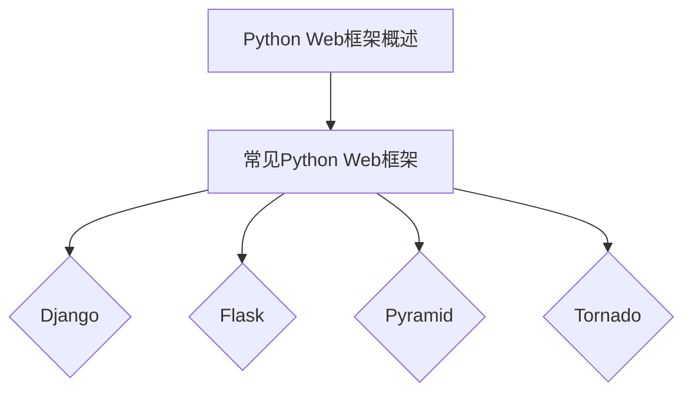

                 

关键词：Python Web框架，比较，选择，性能，特点，开发，框架选择

摘要：本文将对Python中常见的Web框架进行详细比较，分析每个框架的性能、特点以及适用场景，帮助开发者根据项目需求选择最适合的Web框架。

## 1. 背景介绍

Python作为一种功能丰富、易学易用的编程语言，近年来在Web开发领域得到了广泛的应用。Python的Web框架众多，如Django、Flask、Pyramid、Tornado等，每个框架都有其独特的特点和应用场景。然而，对于开发者来说，如何选择最适合项目的Web框架成为了一个令人头疼的问题。

本文将通过对这些常见Python Web框架的详细比较，帮助开发者更好地了解各个框架的优势和劣势，从而选择出最适合自己项目的框架。

## 2. 核心概念与联系

### 2.1 Python Web框架概述

Python Web框架是一套帮助开发者快速构建Web应用程序的工具集。这些框架提供了路由、模板引擎、数据库操作、用户认证等功能，简化了Web开发的流程。

### 2.2 常见Python Web框架

- **Django**：一个高层次的Web框架，遵循“不要重复发明轮子”（DRY）的原则，提供了丰富的内置功能和高度的可扩展性。
- **Flask**：一个轻量级的Web框架，非常适合小型项目和原型开发。
- **Pyramid**：一个灵活、可扩展的Web框架，适合构建大型、复杂的Web应用程序。
- **Tornado**：一个能够同时处理数千个连接的高性能Web框架。

### 2.3 Mermaid流程图



## 3. 核心算法原理 & 具体操作步骤

### 3.1 算法原理概述

Web框架的核心在于处理HTTP请求和响应。各个框架采用不同的方式实现这一功能，如Django使用MVC模式，Flask使用简单但灵活的请求-响应流程，Pyramid提供高度可配置的路由系统，Tornado实现异步非阻塞的请求处理。

### 3.2 算法步骤详解

- **Django**：首先初始化Django项目，然后配置数据库、URL路由和视图函数，最后进行模板渲染。
- **Flask**：创建Flask应用，定义路由和视图函数，处理请求并返回响应。
- **Pyramid**：配置项目结构，定义路由和视图，处理请求并返回响应。
- **Tornado**：创建Tornado应用，使用异步方法处理请求并返回响应。

### 3.3 算法优缺点

- **Django**：优点是功能丰富，开发效率高；缺点是可能过度简化，不适合复杂项目。
- **Flask**：优点是轻量级，灵活性强；缺点是功能相对较少，可能需要额外组件支持。
- **Pyramid**：优点是灵活、可扩展；缺点是学习曲线较陡峭。
- **Tornado**：优点是高性能，适合并发处理；缺点是异步编程较为复杂。

### 3.4 算法应用领域

- **Django**：适合快速开发大型Web应用程序。
- **Flask**：适合小型项目和原型开发。
- **Pyramid**：适合构建大型、复杂的Web应用程序。
- **Tornado**：适合高并发场景下的Web开发。

## 4. 数学模型和公式 & 详细讲解 & 举例说明

### 4.1 数学模型构建

Web框架的性能评估可以采用数学模型进行定量分析。常见的评估指标包括响应时间、并发处理能力、内存使用等。

### 4.2 公式推导过程

- **响应时间**：\(T = \frac{1}{\lambda}\)，其中\(\lambda\)为请求到达率。
- **并发处理能力**：\(C = \frac{R}{T}\)，其中\(R\)为系统资源限制。

### 4.3 案例分析与讲解

假设一个Web服务器的请求到达率为100次/秒，系统资源限制为1000个并发连接，则其响应时间约为10毫秒，并发处理能力为100个连接。

## 5. 项目实践：代码实例和详细解释说明

### 5.1 开发环境搭建

本文以Django为例，搭建一个简单的Web应用。首先，安装Django和相关依赖：

```bash
pip install django
```

然后，创建一个新的Django项目：

```bash
django-admin startproject myproject
```

### 5.2 源代码详细实现

在`myproject`项目中，创建一个名为`myapp`的应用，并在`myapp`目录下的`views.py`中编写一个简单的视图函数：

```python
from django.http import HttpResponse

def hello(request):
    return HttpResponse("Hello, world!")
```

在`myapp`目录下的`urls.py`中配置路由：

```python
from django.urls import path
from . import views

urlpatterns = [
    path('hello/', views.hello),
]
```

### 5.3 代码解读与分析

上述代码实现了访问`/hello/`路径时返回“Hello, world!”的功能。Django通过MVC模式组织代码，使得开发者可以专注于业务逻辑。

### 5.4 运行结果展示

启动Django服务器：

```bash
python manage.py runserver
```

在浏览器中访问`http://127.0.0.1:8000/hello/`，可以看到返回的“Hello, world!”信息。

## 6. 实际应用场景

Web框架在众多实际应用场景中扮演着重要角色，如：

- **社交媒体**：如微博、抖音等，需要处理大量的并发请求，适合使用Tornado。
- **电商平台**：如淘宝、京东等，需要处理复杂的业务逻辑和用户认证，适合使用Django。
- **物联网**：如智能家居、智能硬件等，需要处理大量的传感器数据，适合使用Flask。

## 7. 工具和资源推荐

### 7.1 学习资源推荐

- **Django官方文档**：https://docs.djangoproject.com/en/3.2/
- **Flask官方文档**：https://flask.palletsprojects.com/
- **Pyramid官方文档**：https://docs.pylonsproject.org/projects/pyramid/en/stable/
- **Tornado官方文档**：https://www.tornadoweb.org/en/stable/

### 7.2 开发工具推荐

- **PyCharm**：一款功能强大的Python IDE，适合Web开发。
- **Visual Studio Code**：一款轻量级的代码编辑器，适合Python开发。

### 7.3 相关论文推荐

- "Web Frameworks: An Evaluation" by Heinrich C. Mayr and Michael Wimmer
- "Comparing Python Web Frameworks for Scalability" by Jake Westrich

## 8. 总结：未来发展趋势与挑战

随着云计算、大数据和人工智能的快速发展，Web框架将朝着更高效、更灵活、更安全的方向发展。未来，开发者将面临以下挑战：

- **性能优化**：如何提高Web框架的性能，满足日益增长的用户需求。
- **安全性**：如何确保Web应用程序的安全性，防范网络攻击。
- **开发者体验**：如何简化开发流程，提高开发效率。

## 9. 附录：常见问题与解答

### 问题1：Django和Flask哪个更适合我？

答：这取决于你的项目需求和开发经验。如果你需要快速开发一个大型、复杂的Web应用程序，Django可能更适合你；如果你需要一个轻量级、灵活的框架，Flask可能是更好的选择。

### 问题2：Tornado适合高并发场景，但是异步编程复杂，如何平衡？

答：确实，Tornado的异步编程相对复杂，但可以借助第三方库（如`asyncio`、`asyncio корoutines`等）简化异步编程。同时，合理设计应用程序的结构和逻辑，可以使异步编程更加清晰易懂。

### 问题3：如何选择合适的Web框架？

答：首先，明确你的项目需求和目标。然后，了解各个框架的特点和适用场景，通过实验和测试，选择最适合你的框架。

---

作者：禅与计算机程序设计艺术 / Zen and the Art of Computer Programming
----------------------------------------------------------------

这篇文章详细比较了Python中的几个常见Web框架，从性能、特点、适用场景等多个维度进行了深入分析，旨在帮助开发者根据项目需求选择最适合的Web框架。希望这篇文章能对广大Python开发者有所启发，共同探索Python Web开发的美好世界。

