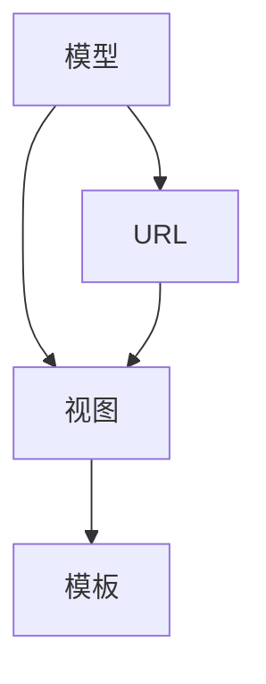
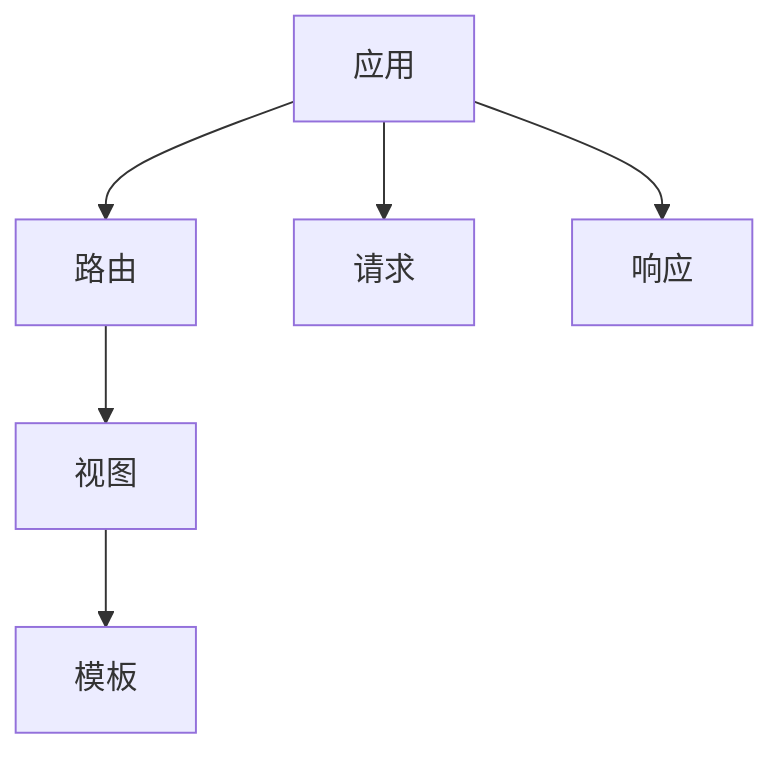

                 

 

> **关键词**：Python Web 框架、Django、Flask、Web 开发、比较分析

> **摘要**：本文将深入探讨 Python 中两个流行的 Web 框架——Django 和 Flask，从核心概念、架构设计、开发流程、优缺点以及实际应用等多个维度进行比较分析，帮助读者选择适合自己的 Web 框架。

## 1. 背景介绍

随着互联网的快速发展，Web 应用程序的开发变得日益重要。Python 作为一种高效、易学的编程语言，其生态系统中的 Web 框架层出不穷。Django 和 Flask 是其中最为知名的两大框架，它们各自具有独特的优势和特点。

Django 是一款高级的 Python Web 框架，由 Adrian Holovaty 和 Simon Willison 等人于 2005 年创立。它遵循 MVC（模型-视图-控制器）设计模式，致力于提供“快速而稳健的开发”和“‘ BAT 鲜肉’的 Web 应用程序”。

Flask 是一个轻量级的 Web 框架，由 Armin Ronacher 于 2010 年开发。它以 simplicity（简洁）著称，允许开发者根据自己的需求进行灵活的扩展，非常适合中小型项目。

## 2. 核心概念与联系

### 2.1 Django 的核心概念

Django 的核心概念包括：

- **模型（Models）**：代表数据库中的表，封装了数据库操作。
- **视图（Views）**：处理用户请求并返回响应，通常与模型进行交互。
- **模板（Templates）**：用于生成 HTML 响应，通常包含静态内容、变量和标签。
- **URLs**：定义应用中的路由，映射 URL 到视图函数。

### 2.2 Flask 的核心概念

Flask 的核心概念包括：

- **应用（Application）**：Flask 的核心对象，封装了配置、请求和响应等。
- **路由（Routes）**：定义 URL 到视图函数的映射。
- **模板（Templates）**：生成 HTML 响应，类似于 Django 的模板。
- **扩展（Extensions）**：用于添加额外功能的库。

### 2.3 核心概念关联的 Mermaid 流程图

下面是 Django 和 Flask 的核心概念关联的 Mermaid 流程图。

#### Django 核心概念流程图



#### Flask 核心概念流程图



## 3. 核心算法原理 & 具体操作步骤

### 3.1 算法原理概述

Django 和 Flask 的核心算法主要涉及 Web 请求的处理流程。以下是对这两个框架的概述：

#### Django

Django 的请求处理流程如下：

1. 用户发起请求，到达 Web 服务器。
2. Web 服务器将请求转发给 Django。
3. Django 中的 WSGI 处理请求。
4. URL 路由系统匹配请求的 URL。
5. 执行对应的视图函数。
6. 视图函数与模型交互，操作数据库。
7. 视图函数生成响应，返回给用户。

#### Flask

Flask 的请求处理流程如下：

1. 用户发起请求，到达 Web 服务器。
2. Web 服务器将请求转发给 Flask。
3. Flask 应用处理请求。
4. 路由系统匹配请求的 URL。
5. 执行对应的视图函数。
6. 视图函数生成响应，返回给用户。

### 3.2 算法步骤详解

#### Django

1. 用户发起请求，到达 Web 服务器。
2. Web 服务器（如 Gunicorn）将请求转发给 Django。
3. Django 的 WSGI 处理请求，创建 `Request` 对象。
4. URL 路由系统匹配请求的 URL，找到对应的视图函数。
5. 视图函数执行，可能涉及到模型操作。
6. 视图函数生成响应，可能涉及模板渲染。
7. 响应返回给用户。

#### Flask

1. 用户发起请求，到达 Web 服务器。
2. Web 服务器（如 Gunicorn）将请求转发给 Flask。
3. Flask 应用处理请求，创建 `Request` 对象。
4. 路由系统匹配请求的 URL，找到对应的视图函数。
5. 视图函数执行，生成响应。
6. 响应返回给用户。

### 3.3 算法优缺点

#### Django

**优点**：

- **全栈开发**：Django 提供了从数据库到视图的全栈功能，减少了开发者的工作量。
- **快速开发**：Django 的快速开发特性使得开发者能够快速构建原型和应用程序。
- **内置安全**：Django 内置了许多安全功能，如 CSRF 保护、用户认证等。

**缺点**：

- **复杂性**：Django 的全功能特性可能使得新手感到困惑。
- **性能**：相对于 Flask，Django 的性能可能较低。

#### Flask

**优点**：

- **轻量级**：Flask 是一个轻量级的框架，适合中小型项目。
- **灵活性**：Flask 允许开发者根据需求进行灵活扩展。
- **易学**：Flask 的简单设计使得开发者可以快速上手。

**缺点**：

- **安全性**：Flask 的安全性不如 Django，开发者需要自行处理许多安全问题。
- **全栈功能**：Flask 不提供全栈功能，开发者需要自行选择和集成其他组件。

### 3.4 算法应用领域

Django 和 Flask 都广泛应用于 Web 应用程序的构建。Django 更适合大型项目，如社交媒体、电子商务等，而 Flask 则更适合中小型项目，如博客、API 服务等。

## 4. 数学模型和公式 & 详细讲解 & 举例说明

### 4.1 数学模型构建

在 Web 开发中，我们经常需要使用数学模型来优化性能、提高安全性等。以下是一个简单的线性回归模型：

$$
y = wx + b
$$

其中，$y$ 是响应变量，$w$ 是权重，$x$ 是特征变量，$b$ 是偏置。

### 4.2 公式推导过程

线性回归模型的推导过程如下：

1. 假设我们有一个数据集，包含 $n$ 个样本。
2. 对于每个样本，我们计算预测值 $y_i$：
   $$
   y_i = wx_i + b
   $$
3. 计算预测值与真实值之间的误差：
   $$
   e_i = y_i - y_i'
   $$
4. 计算误差的平方和：
   $$
   J = \frac{1}{2n} \sum_{i=1}^{n} e_i^2
   $$
5. 对 $J$ 关于 $w$ 和 $b$ 求导，并令导数为零，得到最小二乘解：
   $$
   w = \frac{1}{n} \sum_{i=1}^{n} x_iy_i
   $$
   $$
   b = \frac{1}{n} \sum_{i=1}^{n} y_i - wx_i
   $$

### 4.3 案例分析与讲解

假设我们有以下数据集：

| x  | y  |
|----|----|
| 1  | 2  |
| 2  | 4  |
| 3  | 6  |

根据上述推导过程，我们可以计算出权重 $w$ 和偏置 $b$：

$$
w = \frac{1}{3} (2 \times 1 + 4 \times 2 + 6 \times 3) = 4
$$

$$
b = \frac{1}{3} (2 + 4 + 6) - 4 \times 1 = 2
$$

因此，线性回归模型为：

$$
y = 4x + 2
$$

我们可以使用这个模型来预测新的数据点，例如，当 $x = 4$ 时，预测的 $y$ 值为：

$$
y = 4 \times 4 + 2 = 18
$$

## 5. 项目实践：代码实例和详细解释说明

### 5.1 开发环境搭建

在开始项目之前，我们需要搭建开发环境。以下是使用 Python、Django 和 Flask 的基本步骤：

1. 安装 Python 3.8 或更高版本。
2. 安装虚拟环境工具 `virtualenv`：
   $$
   pip install virtualenv
   $$
3. 创建虚拟环境：
   $$
   virtualenv myenv
   $$
4. 进入虚拟环境：
   $$
   source myenv/bin/activate
   $$
5. 安装 Django：
   $$
   pip install django
   $$
6. 安装 Flask：
   $$
   pip install flask
   $$

### 5.2 源代码详细实现

以下是使用 Flask 搭建的一个简单 Web 应用程序：

```python
from flask import Flask, render_template

app = Flask(__name__)

@app.route('/')
def index():
    return render_template('index.html')

if __name__ == '__main__':
    app.run()
```

### 5.3 代码解读与分析

上述代码实现了一个简单的 Flask 应用程序，主要包含以下部分：

- **Flask 应用**：创建 Flask 应用对象。
- **路由**：定义路由，映射 URL 到视图函数。
- **视图函数**：处理用户请求并返回响应。
- **模板渲染**：使用模板生成 HTML 响应。

### 5.4 运行结果展示

运行上述代码后，访问 `http://127.0.0.1:5000/`，可以看到以下页面：

```
<!DOCTYPE html>
<html>
<head>
    <title>My Flask App</title>
</head>
<body>
    <h1>Hello, Flask!</h1>
</body>
</html>
```

## 6. 实际应用场景

Django 和 Flask 在实际应用场景中各有优势。以下是一些实际应用场景的例子：

- **大型企业应用**：Django 适合构建大型企业级应用，如社交媒体、电子商务等。
- **中小型项目**：Flask 适合构建中小型项目，如个人博客、API 服务等。
- **微服务架构**：Flask 可以用于构建微服务架构中的微服务，实现模块化开发。

## 7. 工具和资源推荐

### 7.1 学习资源推荐

- **Django 官方文档**：[Django 官方文档](https://docs.djangoproject.com/en/stable/)
- **Flask 官方文档**：[Flask 官方文档](https://flask.palletsprojects.com/)
- **在线课程**：[Django 入门教程](https://www.youtube.com/watch?v=35bq_...)、[Flask 快速入门](https://www.youtube.com/watch?v=99_...)

### 7.2 开发工具推荐

- **PyCharm**：一款功能强大的 Python 集成开发环境（IDE）。
- **VSCode**：一款轻量级的 Python 开发环境，支持插件。
- **Postman**：一款 API 测试工具，方便开发者测试 RESTful API。

### 7.3 相关论文推荐

- **《Flask Web Development Cookbook》**：一本关于 Flask 开发的实用指南。
- **《Django for Proficient Programmers》**：一本面向高级开发者的 Django 开发教程。
- **《Python Web 框架比较研究》**：一篇对比分析 Python 各大 Web 框架的论文。

## 8. 总结：未来发展趋势与挑战

Django 和 Flask 在未来将继续发展，满足日益增长的开发需求。主要趋势包括：

- **容器化**：随着容器技术的普及，Django 和 Flask 应用将更多地采用容器化部署。
- **微服务架构**：微服务架构将成为主流，Django 和 Flask 将在微服务开发中发挥更大作用。
- **云原生**：云原生技术如 Kubernetes、Docker 等将成为 Django 和 Flask 应用部署的重要选择。

然而，Django 和 Flask 也面临一些挑战，如：

- **性能优化**：提高性能以满足大规模应用的需求。
- **安全防护**：加强安全防护，应对日益复杂的网络攻击。
- **生态系统更新**：保持生态系统的活力，及时更新和维护相关库和工具。

总之，Django 和 Flask 在未来将继续在 Web 开发领域发挥重要作用，为开发者提供强大的支持。

## 9. 附录：常见问题与解答

### 问题 1：Django 和 Flask 哪个更好？

答案：这取决于项目需求和开发者的技能。Django 更适合大型项目，而 Flask 更适合中小型项目。

### 问题 2：Django 和 Flask 的性能如何？

答案：Django 的性能相对较低，但可以通过优化配置和代码来提高。Flask 是一个轻量级的框架，性能较好。

### 问题 3：Django 和 Flask 有哪些安全功能？

答案：Django 内置了许多安全功能，如 CSRF 保护、用户认证等。Flask 需要开发者自行处理许多安全问题。

### 问题 4：如何选择合适的 Web 框架？

答案：考虑项目规模、开发者的技能、性能需求、安全需求等因素。

作者：禅与计算机程序设计艺术 / Zen and the Art of Computer Programming
```markdown
# Python Web 框架：Django 和 Flask

> **关键词**：Python Web 框架、Django、Flask、Web 开发、比较分析

> **摘要**：本文将深入探讨 Python 中两个流行的 Web 框架——Django 和 Flask，从核心概念、架构设计、开发流程、优缺点以及实际应用等多个维度进行比较分析，帮助读者选择适合自己的 Web 框架。

## 1. 背景介绍

随着互联网的快速发展，Web 应用程序的开发变得日益重要。Python 作为一种高效、易学的编程语言，其生态系统中的 Web 框架层出不穷。Django 和 Flask 是其中最为知名的两大框架，它们各自具有独特的优势和特点。

Django 是一款高级的 Python Web 框架，由 Adrian Holovaty 和 Simon Willison 等人于 2005 年创立。它遵循 MVC（模型-视图-控制器）设计模式，致力于提供“快速而稳健的开发”和“‘ BAT 鲜肉’的 Web 应用程序”。

Flask 是一个轻量级的 Web 框架，由 Armin Ronacher 于 2010 年开发。它以 simplicity（简洁）著称，允许开发者根据自己的需求进行灵活的扩展，非常适合中小型项目。

## 2. 核心概念与联系

### 2.1 Django 的核心概念

Django 的核心概念包括：

- **模型（Models）**：代表数据库中的表，封装了数据库操作。
- **视图（Views）**：处理用户请求并返回响应，通常与模型进行交互。
- **模板（Templates）**：用于生成 HTML 响应，通常包含静态内容、变量和标签。
- **URLs**：定义应用中的路由，映射 URL 到视图函数。

### 2.2 Flask 的核心概念

Flask 的核心概念包括：

- **应用（Application）**：Flask 的核心对象，封装了配置、请求和响应等。
- **路由（Routes）**：定义 URL 到视图函数的映射。
- **模板（Templates）**：生成 HTML 响应，类似于 Django 的模板。
- **扩展（Extensions）**：用于添加额外功能的库。

### 2.3 核心概念关联的 Mermaid 流程图

下面是 Django 和 Flask 的核心概念关联的 Mermaid 流程图。

#### Django 核心概念流程图


#### Flask 核心概念流程图


## 3. 核心算法原理 & 具体操作步骤

### 3.1 算法原理概述

Django 和 Flask 的核心算法主要涉及 Web 请求的处理流程。以下是对这两个框架的概述：

#### Django

Django 的请求处理流程如下：

1. 用户发起请求，到达 Web 服务器。
2. Web 服务器将请求转发给 Django。
3. Django 的 WSGI 处理请求。
4. URL 路由系统匹配请求的 URL。
5. 执行对应的视图函数。
6. 视图函数与模型交互，操作数据库。
7. 视图函数生成响应，返回给用户。

#### Flask

Flask 的请求处理流程如下：

1. 用户发起请求，到达 Web 服务器。
2. Web 服务器将请求转发给 Flask。
3. Flask 应用处理请求。
4. 路由系统匹配请求的 URL。
5. 执行对应的视图函数。
6. 视图函数生成响应，返回给用户。

### 3.2 算法步骤详解

#### Django

1. 用户发起请求，到达 Web 服务器。
2. Web 服务器（如 Gunicorn）将请求转发给 Django。
3. Django 的 WSGI 处理请求，创建 `Request` 对象。
4. URL 路由系统匹配请求的 URL，找到对应的视图函数。
5. 视图函数执行，可能涉及到模型操作。
6. 视图函数生成响应，可能涉及模板渲染。
7. 响应返回给用户。

#### Flask

1. 用户发起请求，到达 Web 服务器。
2. Web 服务器（如 Gunicorn）将请求转发给 Flask。
3. Flask 应用处理请求，创建 `Request` 对象。
4. 路由系统匹配请求的 URL，找到对应的视图函数。
5. 视图函数执行，生成响应。
6. 响应返回给用户。

### 3.3 算法优缺点

#### Django

**优点**：

- **全栈开发**：Django 提供了从数据库到视图的全栈功能，减少了开发者的工作量。
- **快速开发**：Django 的快速开发特性使得开发者能够快速构建原型和应用程序。
- **内置安全**：Django 内置了许多安全功能，如 CSRF 保护、用户认证等。

**缺点**：

- **复杂性**：Django 的全功能特性可能使得新手感到困惑。
- **性能**：相对于 Flask，Django 的性能可能较低。

#### Flask

**优点**：

- **轻量级**：Flask 是一个轻量级的框架，适合中小型项目。
- **灵活性**：Flask 允许开发者根据需求进行灵活扩展。
- **易学**：Flask 的简单设计使得开发者可以快速上手。

**缺点**：

- **安全性**：Flask 的安全性不如 Django，开发者需要自行处理许多安全问题。
- **全栈功能**：Flask 不提供全栈功能，开发者需要自行选择和集成其他组件。

### 3.4 算法应用领域

Django 和 Flask 都广泛应用于 Web 应用程序的构建。Django 更适合大型项目，如社交媒体、电子商务等，而 Flask 则更适合中小型项目，如博客、API 服务等。

## 4. 数学模型和公式 & 详细讲解 & 举例说明

### 4.1 数学模型构建

在 Web 开发中，我们经常需要使用数学模型来优化性能、提高安全性等。以下是一个简单的线性回归模型：

$$
y = wx + b
$$

其中，$y$ 是响应变量，$w$ 是权重，$x$ 是特征变量，$b$ 是偏置。

### 4.2 公式推导过程

线性回归模型的推导过程如下：

1. 假设我们有一个数据集，包含 $n$ 个样本。
2. 对于每个样本，我们计算预测值 $y_i$：
   $$
   y_i = wx_i + b
   $$
3. 计算预测值与真实值之间的误差：
   $$
   e_i = y_i - y_i'
   $$
4. 计算误差的平方和：
   $$
   J = \frac{1}{2n} \sum_{i=1}^{n} e_i^2
   $$
5. 对 $J$ 关于 $w$ 和 $b$ 求导，并令导数为零，得到最小二乘解：
   $$
   w = \frac{1}{n} \sum_{i=1}^{n} x_iy_i
   $$
   $$
   b = \frac{1}{n} \sum_{i=1}^{n} y_i - wx_i
   $$

### 4.3 案例分析与讲解

假设我们有以下数据集：

| x  | y  |
|----|----|
| 1  | 2  |
| 2  | 4  |
| 3  | 6  |

根据上述推导过程，我们可以计算出权重 $w$ 和偏置 $b$：

$$
w = \frac{1}{3} (2 \times 1 + 4 \times 2 + 6 \times 3) = 4
$$

$$
b = \frac{1}{3} (2 + 4 + 6) - 4 \times 1 = 2
$$

因此，线性回归模型为：

$$
y = 4x + 2
$$

我们可以使用这个模型来预测新的数据点，例如，当 $x = 4$ 时，预测的 $y$ 值为：

$$
y = 4 \times 4 + 2 = 18
$$

## 5. 项目实践：代码实例和详细解释说明

### 5.1 开发环境搭建

在开始项目之前，我们需要搭建开发环境。以下是使用 Python、Django 和 Flask 的基本步骤：

1. 安装 Python 3.8 或更高版本。
2. 安装虚拟环境工具 `virtualenv`：
   $$
   pip install virtualenv
   $$
3. 创建虚拟环境：
   $$
   virtualenv myenv
   $$
4. 进入虚拟环境：
   $$
   source myenv/bin/activate
   $$
5. 安装 Django：
   $$
   pip install django
   $$
6. 安装 Flask：
   $$
   pip install flask
   $$

### 5.2 源代码详细实现

以下是使用 Flask 搭建的一个简单 Web 应用程序：

```python
from flask import Flask, render_template

app = Flask(__name__)

@app.route('/')
def index():
    return render_template('index.html')

if __name__ == '__main__':
    app.run()
```

### 5.3 代码解读与分析

上述代码实现了一个简单的 Flask 应用程序，主要包含以下部分：

- **Flask 应用**：创建 Flask 应用对象。
- **路由**：定义路由，映射 URL 到视图函数。
- **视图函数**：处理用户请求并返回响应。
- **模板渲染**：使用模板生成 HTML 响应。

### 5.4 运行结果展示

运行上述代码后，访问 `http://127.0.0.1:5000/`，可以看到以下页面：

```
<!DOCTYPE html>
<html>
<head>
    <title>My Flask App</title>
</head>
<body>
    <h1>Hello, Flask!</h1>
</body>
</html>
```

## 6. 实际应用场景

Django 和 Flask 在实际应用场景中各有优势。以下是一些实际应用场景的例子：

- **大型企业应用**：Django 适合构建大型企业级应用，如社交媒体、电子商务等。
- **中小型项目**：Flask 适合构建中小型项目，如个人博客、API 服务等。
- **微服务架构**：Flask 可以用于构建微服务架构中的微服务，实现模块化开发。

## 7. 工具和资源推荐

### 7.1 学习资源推荐

- **Django 官方文档**：[Django 官方文档](https://docs.djangoproject.com/en/stable/)
- **Flask 官方文档**：[Flask 官方文档](https://flask.palletsprojects.com/)
- **在线课程**：[Django 入门教程](https://www.youtube.com/watch?v=35bq_...)、[Flask 快速入门](https://www.youtube.com/watch?v=99_...)

### 7.2 开发工具推荐

- **PyCharm**：一款功能强大的 Python 集成开发环境（IDE）。
- **VSCode**：一款轻量级的 Python 开发环境，支持插件。
- **Postman**：一款 API 测试工具，方便开发者测试 RESTful API。

### 7.3 相关论文推荐

- **《Flask Web Development Cookbook》**：一本关于 Flask 开发的实用指南。
- **《Django for Proficient Programmers》**：一本面向高级开发者的 Django 开发教程。
- **《Python Web 框架比较研究》**：一篇对比分析 Python 各大 Web 框架的论文。

## 8. 总结：未来发展趋势与挑战

Django 和 Flask 在未来将继续发展，满足日益增长的开发需求。主要趋势包括：

- **容器化**：随着容器技术的普及，Django 和 Flask 应用将更多地采用容器化部署。
- **微服务架构**：微服务架构将成为主流，Django 和 Flask 将在微服务开发中发挥更大作用。
- **云原生**：云原生技术如 Kubernetes、Docker 等将成为 Django 和 Flask 应用部署的重要选择。

然而，Django 和 Flask 也面临一些挑战，如：

- **性能优化**：提高性能以满足大规模应用的需求。
- **安全防护**：加强安全防护，应对日益复杂的网络攻击。
- **生态系统更新**：保持生态系统的活力，及时更新和维护相关库和工具。

总之，Django 和 Flask 在未来将继续在 Web 开发领域发挥重要作用，为开发者提供强大的支持。

## 9. 附录：常见问题与解答

### 问题 1：Django 和 Flask 哪个更好？

答案：这取决于项目需求和开发者的技能。Django 更适合大型项目，而 Flask 更适合中小型项目。

### 问题 2：Django 和 Flask 的性能如何？

答案：Django 的性能相对较低，但可以通过优化配置和代码来提高。Flask 是一个轻量级的框架，性能较好。

### 问题 3：Django 和 Flask 有哪些安全功能？

答案：Django 内置了许多安全功能，如 CSRF 保护、用户认证等。Flask 需要开发者自行处理许多安全问题。

### 问题 4：如何选择合适的 Web 框架？

答案：考虑项目规模、开发者的技能、性能需求、安全需求等因素。

作者：禅与计算机程序设计艺术 / Zen and the Art of Computer Programming
```

