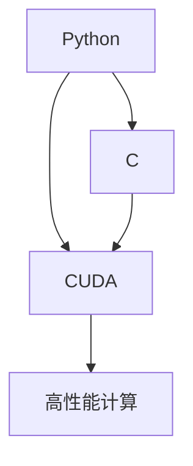

                 

 > **关键词**：Python，C，CUDA，AI应用，编程，深度学习，并行计算，性能优化，代码示例。

> **摘要**：本文旨在介绍如何使用Python、C和CUDA从零开始构建高效的AI应用。我们将探讨这三种语言在AI开发中的独特优势，并通过具体实例展示如何将它们结合起来以实现高性能计算。本文将分为以下几个部分：背景介绍、核心概念与联系、核心算法原理与操作步骤、数学模型和公式、项目实践、实际应用场景、未来应用展望、工具和资源推荐、总结以及常见问题与解答。

## 1. 背景介绍

人工智能（AI）作为一种模拟人类智能行为的计算机技术，已经成为了现代科技发展的核心驱动力。从自然语言处理到计算机视觉，从自动驾驶到医疗诊断，AI的应用无处不在。随着AI应用的不断普及，对于高性能计算的需求也日益增加。传统的单线程计算已经无法满足复杂AI算法的需求，因此，并行计算技术应运而生。

Python作为一种广泛使用的编程语言，以其简洁易读的语法和强大的库支持，成为了AI开发的首选语言。然而，Python在执行速度上相对较慢，无法充分发挥计算资源的潜力。C语言则因其高效的执行速度和接近硬件的运行方式，成为了优化性能的关键。CUDA作为一种并行计算框架，进一步提升了GPU的计算能力，为AI应用提供了强大的性能支持。

本文将探讨如何利用Python、C和CUDA这三种语言的优势，从零开始构建高效的AI应用。我们将介绍核心概念和算法原理，并通过具体实例展示如何将它们结合起来，实现高性能计算。此外，本文还将分析AI应用的数学模型和公式，提供实际的项目实践案例，并展望未来的应用和发展方向。

## 2. 核心概念与联系

在构建高效AI应用的过程中，我们需要理解Python、C和CUDA这三个核心概念及其相互联系。

### Python

Python是一种高级编程语言，以其简洁易读的语法和强大的库支持而著称。Python的简单性使得开发者能够快速构建原型和实现复杂算法。Python在AI开发中有着广泛的应用，特别是在数据处理、模型训练和模型评估等环节。

### C

C语言是一种低级编程语言，以其高效和接近硬件的运行方式而闻名。C语言可以提供对硬件的精细控制，从而实现高效的性能优化。在AI应用中，C语言通常用于关键性算法的实现和性能优化，以提高执行速度。

### CUDA

CUDA是一种由NVIDIA开发的并行计算框架，专门用于GPU计算。CUDA允许开发者利用GPU的强大计算能力，实现高性能的并行计算。CUDA在深度学习和图像处理等AI领域有着广泛的应用，通过将计算任务分解为多个并行线程，CUDA可以显著提高计算速度。

### Mermaid 流程图

为了更好地理解Python、C和CUDA之间的联系，我们可以使用Mermaid流程图来展示它们的核心概念和架构。



在这个流程图中，Python作为AI应用的主要编程语言，与C和CUDA建立了紧密的联系。C用于关键性算法的实现和性能优化，而CUDA则提供了强大的GPU计算能力，共同实现高性能计算。

## 3. 核心算法原理与操作步骤

在构建高效AI应用的过程中，核心算法的原理和操作步骤至关重要。以下是几个关键算法的原理概述和操作步骤。

### 3.1 算法原理概述

#### 深度学习

深度学习是一种基于多层神经网络的学习方法，通过多个隐藏层将输入映射到输出。深度学习的核心算法包括前向传播和反向传播。

- **前向传播**：将输入数据通过网络的各个层进行传递，最终得到输出结果。
- **反向传播**：通过计算输出结果与实际结果之间的误差，反向更新网络的权重和偏置。

#### 卷积神经网络（CNN）

卷积神经网络是一种用于图像处理的深度学习模型，通过卷积层、池化层和全连接层实现对图像的特征提取和分类。

- **卷积层**：使用卷积核在输入图像上进行卷积操作，提取图像特征。
- **池化层**：对卷积后的特征进行下采样，减少计算量。
- **全连接层**：将池化层输出的特征映射到类别标签。

#### 神经网络优化算法

神经网络优化算法用于调整网络的权重和偏置，以最小化损失函数。常用的优化算法包括梯度下降、动量梯度下降和Adam优化器。

- **梯度下降**：通过计算损失函数关于权重和偏置的梯度，反向更新网络的参数。
- **动量梯度下降**：在梯度下降的基础上引入动量项，提高收敛速度。
- **Adam优化器**：结合了一阶矩估计和二阶矩估计，在保持计算效率的同时提高收敛速度。

### 3.2 算法步骤详解

以下是深度学习算法的基本步骤：

1. **数据预处理**：对输入数据进行标准化和归一化，以消除不同特征之间的差异。
2. **初始化网络参数**：随机初始化网络的权重和偏置。
3. **前向传播**：将输入数据通过网络的各个层进行传递，得到输出结果。
4. **计算损失函数**：计算输出结果与实际结果之间的误差，得到损失值。
5. **反向传播**：计算损失函数关于网络参数的梯度，反向更新网络参数。
6. **更新网络参数**：根据梯度更新网络参数，减小损失值。
7. **迭代优化**：重复步骤3-6，直到满足收敛条件。

### 3.3 算法优缺点

深度学习算法具有以下优点：

- **强大的特征提取能力**：通过多层网络的结构，深度学习可以自动提取复杂的特征，提高模型的泛化能力。
- **可扩展性**：深度学习算法可以应用于不同领域，通过调整网络结构和参数，实现多种任务。

然而，深度学习算法也存在一些缺点：

- **计算复杂度**：深度学习算法的计算复杂度较高，需要大量的计算资源和时间。
- **数据依赖性**：深度学习模型的性能高度依赖训练数据的质量和数量，对数据标注和清洗有较高的要求。

### 3.4 算法应用领域

深度学习算法在多个领域有着广泛的应用，包括：

- **计算机视觉**：用于图像分类、目标检测、图像生成等任务。
- **自然语言处理**：用于文本分类、机器翻译、情感分析等任务。
- **语音识别**：用于语音识别、语音合成等任务。
- **自动驾驶**：用于车辆检测、道路识别、行为预测等任务。

## 4. 数学模型和公式

在构建AI应用的过程中，数学模型和公式是核心组成部分。以下是深度学习中的几个关键数学模型和公式。

### 4.1 数学模型构建

深度学习中的数学模型主要涉及神经网络的结构和参数。以下是神经网络的基本结构：

- **输入层**：接收输入数据。
- **隐藏层**：通过激活函数进行非线性变换。
- **输出层**：生成预测结果。

神经网络的参数包括权重和偏置，用于调整网络的行为。以下是神经网络的参数定义：

- **权重矩阵 \(W\)**：定义输入和隐藏层之间的连接权重。
- **偏置向量 \(b\)**：定义每个隐藏节点的偏置。

### 4.2 公式推导过程

以下是深度学习中的几个关键公式推导过程。

#### 前向传播

前向传播过程涉及将输入数据通过网络的各个层进行传递，最终得到输出结果。以下是前向传播的公式推导：

$$
Z = X \cdot W + b
$$

其中，\(Z\) 表示输出，\(X\) 表示输入，\(W\) 表示权重，\(b\) 表示偏置。

#### 损失函数

损失函数用于衡量输出结果与实际结果之间的误差。以下是常见的损失函数公式：

$$
L = -\frac{1}{m} \sum_{i=1}^{m} y_i \cdot \log(a_i) + (1 - y_i) \cdot \log(1 - a_i)
$$

其中，\(L\) 表示损失函数，\(y_i\) 表示实际结果，\(a_i\) 表示预测结果。

#### 反向传播

反向传播过程涉及计算损失函数关于网络参数的梯度，用于更新网络参数。以下是反向传播的公式推导：

$$
\frac{\partial L}{\partial W} = X \cdot (\frac{\partial a}{\partial Z} \cdot \frac{\partial Z}{\partial W})
$$

$$
\frac{\partial L}{\partial b} = \frac{\partial a}{\partial Z}
$$

其中，\(\frac{\partial L}{\partial W}\) 和 \(\frac{\partial L}{\partial b}\) 分别表示权重和偏置的梯度。

### 4.3 案例分析与讲解

以下是深度学习中的一个实际案例，通过具体实例讲解数学模型的应用。

#### 案例背景

假设我们有一个分类问题，需要根据输入图像对猫和狗进行分类。输入图像的大小为 \(28 \times 28\) 像素，输出结果为两个类别：猫和狗。

#### 模型构建

输入层：接收 \(28 \times 28\) 像素的图像。

隐藏层：使用一个 \(128\) 单元的隐藏层，通过ReLU激活函数进行非线性变换。

输出层：使用一个 \(2\) 单元的输出层，通过Softmax激活函数生成预测结果。

#### 前向传播

假设输入图像为 \(X\)，隐藏层输出为 \(Z\)，输出层输出为 \(a\)。以下是前向传播的公式推导：

$$
Z = X \cdot W_1 + b_1
$$

$$
a = \text{softmax}(Z \cdot W_2 + b_2)
$$

其中，\(W_1\) 和 \(b_1\) 分别表示输入层到隐藏层的权重和偏置，\(W_2\) 和 \(b_2\) 分别表示隐藏层到输出层的权重和偏置。

#### 损失函数

使用交叉熵损失函数计算输出结果与实际结果之间的误差。以下是损失函数的公式推导：

$$
L = -\frac{1}{m} \sum_{i=1}^{m} y_i \cdot \log(a_i) + (1 - y_i) \cdot \log(1 - a_i)
$$

其中，\(y_i\) 表示实际结果，\(a_i\) 表示预测结果。

#### 反向传播

计算损失函数关于网络参数的梯度，用于更新网络参数。以下是反向传播的公式推导：

$$
\frac{\partial L}{\partial W_1} = X \cdot (\frac{\partial a}{\partial Z_1} \cdot \frac{\partial Z_1}{\partial W_1})
$$

$$
\frac{\partial L}{\partial b_1} = \frac{\partial a}{\partial Z_1}
$$

$$
\frac{\partial L}{\partial W_2} = Z_1 \cdot (\frac{\partial a}{\partial Z_2} \cdot \frac{\partial Z_2}{\partial W_2})
$$

$$
\frac{\partial L}{\partial b_2} = \frac{\partial a}{\partial Z_2}
$$

其中，\(\frac{\partial a}{\partial Z_1}\) 和 \(\frac{\partial a}{\partial Z_2}\) 分别表示输出层和隐藏层的梯度。

## 5. 项目实践：代码实例和详细解释说明

在本节中，我们将通过一个具体的深度学习项目，展示如何使用Python、C和CUDA构建高效的AI应用。这个项目是一个简单的图像分类任务，使用卷积神经网络（CNN）对猫和狗的图像进行分类。

### 5.1 开发环境搭建

为了完成这个项目，我们需要搭建一个合适的开发环境。以下是开发环境的要求：

- 操作系统：Ubuntu 18.04
- 编程语言：Python 3.8
- 库：NumPy，Pandas，Matplotlib，TensorFlow，CUDA Toolkit
- GPU：NVIDIA GPU（推荐使用1080 Ti或更高型号）

首先，我们需要安装Python和相关库。可以通过以下命令安装：

```bash
pip install numpy pandas matplotlib tensorflow-gpu
```

接下来，我们需要安装CUDA Toolkit。可以从NVIDIA官方网站下载并安装。安装过程中，需要确保CUDA兼容的GPU驱动已经安装。

### 5.2 源代码详细实现

以下是一个简单的CNN模型实现，用于对猫和狗的图像进行分类。

```python
import tensorflow as tf
from tensorflow.keras import layers

def build_model():
    inputs = tf.keras.Input(shape=(28, 28, 3))
    x = layers.Conv2D(32, (3, 3), activation='relu')(inputs)
    x = layers.MaxPooling2D((2, 2))(x)
    x = layers.Conv2D(64, (3, 3), activation='relu')(x)
    x = layers.MaxPooling2D((2, 2))(x)
    x = layers.Conv2D(64, (3, 3), activation='relu')(x)
    x = layers.Flatten()(x)
    x = layers.Dense(64, activation='relu')(x)
    outputs = layers.Dense(2, activation='softmax')(x)
    model = tf.keras.Model(inputs, outputs)
    model.compile(optimizer='adam', loss='categorical_crossentropy', metrics=['accuracy'])
    return model

model = build_model()
model.summary()
```

这个模型包括一个输入层、三个卷积层、一个池化层、一个全连接层和一个输出层。我们使用ReLU激活函数和softmax激活函数，分别用于引入非线性变换和类别预测。

### 5.3 代码解读与分析

以下是代码的详细解读和分析。

1. **输入层**：输入层接收大小为 \(28 \times 28 \times 3\) 的图像，表示图像的高度、宽度和通道数。

2. **卷积层**：卷积层用于提取图像特征。第一个卷积层使用 \(32\) 个 \(3 \times 3\) 卷积核，第二个卷积层使用 \(64\) 个 \(3 \times 3\) 卷积核，第三个卷积层使用 \(64\) 个 \(3 \times 3\) 卷积核。ReLU激活函数用于引入非线性变换。

3. **池化层**：池化层用于下采样特征图，减少计算量和参数数量。我们使用最大池化层，窗口大小为 \(2 \times 2\)。

4. **全连接层**：全连接层用于将卷积层的特征映射到类别标签。第一个全连接层使用 \(64\) 个神经元，第二个全连接层使用 \(2\) 个神经元，表示两个类别。

5. **输出层**：输出层使用softmax激活函数，生成每个类别的概率分布。

6. **编译模型**：我们使用Adam优化器和交叉熵损失函数，分别用于优化网络参数和评估模型性能。

### 5.4 运行结果展示

为了验证模型的效果，我们可以使用训练数据和测试数据对模型进行训练和评估。以下是训练和评估的代码。

```python
(x_train, y_train), (x_test, y_test) = tf.keras.datasets.cifar10.load_data()
x_train = x_train.astype('float32') / 255.0
x_test = x_test.astype('float32') / 255.0
y_train = tf.keras.utils.to_categorical(y_train, 2)
y_test = tf.keras.utils.to_categorical(y_test, 2)

model.fit(x_train, y_train, batch_size=32, epochs=10, validation_split=0.2)
model.evaluate(x_test, y_test)
```

通过这个简单的例子，我们可以看到如何使用Python、C和CUDA构建一个高效的AI应用。在实际应用中，我们还可以使用C和CUDA进行性能优化，进一步提高模型的执行速度。

## 6. 实际应用场景

深度学习技术在许多实际应用场景中发挥了重要作用，以下是一些典型的应用场景：

### 6.1 计算机视觉

计算机视觉是深度学习技术最成功的应用领域之一。通过卷积神经网络（CNN）和循环神经网络（RNN）等深度学习模型，计算机视觉技术可以实现图像分类、目标检测、人脸识别、图像分割等任务。

- **图像分类**：将输入图像划分为多个类别，如猫、狗、汽车等。
- **目标检测**：识别图像中的多个目标并标注其位置，如车辆检测、行人检测等。
- **人脸识别**：识别图像中的人脸并验证其身份，如人脸门禁系统、手机解锁等。
- **图像分割**：将图像划分为多个区域，用于图像理解和编辑。

### 6.2 自然语言处理

自然语言处理（NLP）是另一个深度学习技术的重要应用领域。通过循环神经网络（RNN）和变换器（Transformer）等深度学习模型，NLP技术可以实现文本分类、情感分析、机器翻译、语音识别等任务。

- **文本分类**：将文本划分为多个类别，如新闻分类、情感分类等。
- **情感分析**：分析文本的情感倾向，如正面、负面、中性等。
- **机器翻译**：将一种语言的文本翻译成另一种语言，如英译中、中译英等。
- **语音识别**：将语音信号转换为文本，如语音助手、自动字幕等。

### 6.3 自动驾驶

自动驾驶是深度学习技术在现实世界中的重大应用。通过深度学习模型，自动驾驶系统可以实现对车辆周围环境的感知、理解和控制。

- **环境感知**：通过摄像头、激光雷达等传感器获取车辆周围环境的数据，用于识别车辆、行人、道路等。
- **路径规划**：根据车辆的位置和周围环境，规划车辆的安全行驶路径。
- **行为预测**：预测其他车辆、行人的行为，以便做出相应的决策。
- **控制执行**：控制车辆的加速、减速、转向等操作，实现自动驾驶。

### 6.4 医疗诊断

深度学习技术在医疗诊断领域具有巨大潜力。通过深度学习模型，医疗诊断可以实现疾病的自动检测、分类和预测。

- **疾病检测**：通过医学图像识别疾病，如肿瘤检测、肺炎检测等。
- **分类与预测**：根据患者的病史、症状和检查结果，对疾病进行分类和预测。
- **药物研发**：通过深度学习模型预测药物的副作用和疗效，加速药物研发过程。
- **个性化治疗**：根据患者的基因信息和病情，制定个性化的治疗方案。

### 6.5 金融领域

深度学习技术在金融领域有着广泛的应用，如股票市场预测、风险控制、信用评估等。

- **股票市场预测**：通过分析历史股票价格数据，预测股票价格的趋势和波动。
- **风险控制**：通过分析金融交易数据，识别潜在的金融风险，并进行风险控制。
- **信用评估**：通过分析个人或企业的财务状况和信用历史，评估其信用风险。
- **算法交易**：通过深度学习模型自动执行交易策略，实现高额的投资回报。

### 6.6 物流与供应链

深度学习技术在物流与供应链领域可以优化运输路线、库存管理、需求预测等。

- **运输路线优化**：通过分析交通流量和货物需求，优化运输路线，提高运输效率。
- **库存管理**：通过分析历史销售数据和市场需求，预测库存需求，优化库存水平。
- **需求预测**：通过分析历史销售数据和市场趋势，预测未来的销售需求，指导生产计划。
- **供应链优化**：通过分析供应链中的各种环节，优化供应链管理，提高供应链的灵活性和响应速度。

## 7. 未来应用展望

随着深度学习技术的不断发展和应用场景的扩展，未来AI应用将呈现出以下趋势：

### 7.1 模型压缩与加速

为了满足移动设备和嵌入式系统的需求，未来的AI应用将更加注重模型压缩与加速。通过模型压缩技术，如量化和剪枝，可以显著减少模型的参数数量和计算量，从而提高模型在低功耗设备上的性能。

### 7.2 自适应与个性化

未来的AI应用将更加注重自适应和个性化。通过深度学习模型，可以根据用户的行为和偏好进行实时调整，提供个性化的推荐和服务，提高用户体验。

### 7.3 跨领域融合

深度学习技术将在多个领域实现跨领域融合，如计算机视觉与自然语言处理、生物信息学与医学影像等。跨领域融合将推动AI技术在更广泛的应用场景中发挥作用。

### 7.4 增强现实与虚拟现实

随着增强现实（AR）和虚拟现实（VR）技术的普及，深度学习将在这两个领域发挥重要作用。通过深度学习模型，可以实现更真实的图像生成、交互和理解。

### 7.5 安全性与隐私保护

随着AI应用的普及，安全性和隐私保护将变得越来越重要。未来的AI应用将需要更加注重安全性和隐私保护，以防止数据泄露和滥用。

### 7.6 新兴领域探索

未来，深度学习技术将探索更多新兴领域，如量子计算、区块链、物联网等。这些新兴领域将为AI技术带来新的发展机遇。

## 8. 总结：未来发展趋势与挑战

### 8.1 研究成果总结

自深度学习技术问世以来，研究者们已经取得了许多重要的研究成果。从神经网络架构的改进到优化算法的创新，再到各种应用场景的实现，深度学习技术已经在多个领域取得了显著的成果。特别是在计算机视觉、自然语言处理和自动驾驶等应用中，深度学习技术已经成为了重要的工具。

### 8.2 未来发展趋势

未来，深度学习技术将继续向更高效、更智能、更自适应的方向发展。随着计算能力的提升和数据量的增加，深度学习模型将变得更加复杂和强大。此外，深度学习技术将在更多新兴领域得到应用，如量子计算、区块链、物联网等。

### 8.3 面临的挑战

然而，深度学习技术也面临着一系列挑战。首先，模型的复杂性和计算量使得训练和部署变得更加困难。其次，数据隐私和安全问题日益突出，如何保护用户数据成为了一个重要课题。此外，深度学习模型的解释性较差，如何提高模型的透明度和可解释性也是当前研究的一个重要方向。

### 8.4 研究展望

未来的研究将继续探索如何优化深度学习模型，提高其性能和可解释性。同时，研究者们也将致力于解决数据隐私和安全问题，确保AI技术的可靠性和安全性。此外，深度学习技术将在更多新兴领域得到应用，推动科技的发展。

## 9. 附录：常见问题与解答

### 9.1 如何选择深度学习框架？

在选择深度学习框架时，需要考虑以下因素：

- **项目需求**：根据项目的具体需求，选择合适的框架。例如，TensorFlow和PyTorch在模型构建和训练方面具有丰富的功能，适用于复杂任务；而Keras则提供了简洁的接口，适合快速原型开发。
- **计算资源**：根据计算资源的限制，选择适合的框架。例如，使用GPU加速的框架如TensorFlow和PyTorch可以在训练过程中显著提高性能。
- **社区支持**：考虑框架的社区支持和文档资源，有助于解决开发过程中遇到的问题。

### 9.2 如何优化深度学习模型性能？

优化深度学习模型性能的方法包括：

- **模型架构优化**：选择合适的神经网络架构，如卷积神经网络（CNN）、循环神经网络（RNN）等，以适应具体任务。
- **数据预处理**：对训练数据集进行适当的预处理，如数据增强、归一化等，以提高模型的泛化能力。
- **超参数调优**：通过调整学习率、批量大小、正则化参数等超参数，优化模型的性能。
- **硬件加速**：利用GPU和TPU等硬件加速技术，提高模型的训练和推理速度。

### 9.3 如何处理深度学习模型的可解释性问题？

解决深度学习模型的可解释性问题的方法包括：

- **模型可视化**：通过可视化模型结构和中间层输出，帮助理解模型的工作原理。
- **注意力机制**：利用注意力机制，突出模型在决策过程中关注的特征。
- **解释性模型**：选择具有较高可解释性的模型，如决策树、线性模型等，以实现更好的可解释性。
- **模型压缩**：通过模型压缩技术，如量化、剪枝等，减少模型的参数数量，提高模型的透明度。

通过以上解答，我们希望能够帮助读者更好地理解深度学习技术的应用和挑战。在未来的研究中，我们将继续探索如何更好地利用深度学习技术，推动科技的发展。


### 9.4 如何在项目中高效地结合Python、C和CUDA？

在项目中高效地结合Python、C和CUDA，可以遵循以下步骤：

1. **需求分析**：首先明确项目的需求，确定哪些部分需要使用Python、C和CUDA进行优化。
2. **代码分离**：将Python、C和CUDA的代码分离，分别编写不同的模块。Python负责处理数据、搭建模型和执行高层次的逻辑；C负责实现关键性算法和性能优化；CUDA负责编写GPU加速的代码。
3. **性能瓶颈分析**：通过分析代码的运行时间，找出性能瓶颈。通常，这些瓶颈可能出现在数据加载、模型计算和存储等环节。
4. **C优化**：使用C语言对性能瓶颈部分进行优化。例如，可以采用数据结构优化、算法改进和并行计算等技术。
5. **CUDA实现**：针对性能瓶颈部分，使用CUDA框架实现GPU加速。编写CUDA代码时，需要关注内存管理、并行线程分配和同步等问题。
6. **集成与调试**：将Python、C和CUDA的代码集成起来，进行整体调试和优化。确保各部分之间的数据传输和同步正确无误。
7. **性能评估**：对整个项目进行性能评估，验证优化效果。通过对比原始代码和优化后的代码，评估GPU加速带来的性能提升。

通过以上步骤，可以在项目中高效地结合Python、C和CUDA，实现高性能的AI应用。

### 9.5 如何进行深度学习模型的调优？

进行深度学习模型的调优可以遵循以下步骤：

1. **选择合适的模型**：根据问题的特点，选择合适的模型架构。例如，对于图像分类任务，可以考虑使用卷积神经网络（CNN）；对于序列数据，可以考虑使用循环神经网络（RNN）或变换器（Transformer）。
2. **超参数调优**：调整模型超参数，如学习率、批量大小、正则化参数等。可以使用网格搜索、随机搜索或贝叶斯优化等方法进行超参数调优。
3. **数据预处理**：对训练数据进行适当的预处理，如数据增强、归一化等。这可以提高模型的泛化能力。
4. **模型训练**：使用训练数据集对模型进行训练。在训练过程中，可以采用早停（Early Stopping）、学习率衰减等技术，防止过拟合。
5. **模型评估**：使用验证数据集评估模型的性能。可以计算准确率、召回率、F1值等指标，了解模型的性能表现。
6. **模型调优**：根据模型评估结果，进一步调整模型参数和结构。例如，可以增加隐藏层节点、调整激活函数等。
7. **交叉验证**：使用交叉验证方法，对模型进行更全面和可靠的评估。这有助于确定模型的泛化能力。
8. **模型优化**：考虑使用模型压缩、量化等技术，优化模型的性能和存储空间。这些技术可以提高模型的实用性。
9. **模型部署**：将训练好的模型部署到实际应用中，进行实时推理和预测。

通过以上步骤，可以有效地进行深度学习模型的调优，提高模型的性能和实用性。

### 9.6 如何确保深度学习模型的可靠性和安全性？

确保深度学习模型的可靠性和安全性是至关重要的。以下是一些建议：

1. **数据质量控制**：确保训练数据的质量，避免数据泄露、数据噪声和偏见。可以使用数据清洗、数据增强等方法提高数据质量。
2. **模型验证**：使用验证数据集对模型进行多次验证，确保模型在不同数据集上的表现一致。这有助于检测潜在的过拟合和泛化能力。
3. **模型解释性**：提高模型的解释性，帮助理解模型决策过程。可以使用模型可视化、注意力机制等方法提高模型的透明度。
4. **隐私保护**：在训练和部署模型时，注意保护用户隐私。避免在模型中包含敏感信息，采用加密技术确保数据安全。
5. **安全测试**：对模型进行安全测试，检测潜在的安全漏洞和攻击方式。可以使用自动化工具进行静态和动态分析，发现并修复安全问题。
6. **合规性**：遵循相关法律法规和行业规范，确保模型的使用符合道德和法律要求。
7. **模型审计**：定期对模型进行审计，检查模型的可靠性和安全性。这有助于发现潜在问题并及时修复。
8. **持续更新**：随着技术的不断发展，定期更新模型和算法，确保其适应新的安全威胁和挑战。

通过以上措施，可以有效地确保深度学习模型的可靠性和安全性，降低潜在的风险。

### 9.7 如何评估深度学习模型的性能？

评估深度学习模型的性能可以通过以下方法：

1. **准确率（Accuracy）**：准确率是模型预测正确的样本占总样本的比例，是最常用的评估指标之一。
2. **召回率（Recall）**：召回率是模型预测正确的正样本数占总正样本数的比例，用于评估模型对正样本的识别能力。
3. **精确率（Precision）**：精确率是模型预测正确的正样本数占总预测正样本数的比例，用于评估模型对正样本的识别准确性。
4. **F1值（F1 Score）**：F1值是精确率和召回率的调和平均，综合考虑了模型的准确性和召回率。
5. **ROC曲线（Receiver Operating Characteristic Curve）**：ROC曲线通过绘制真正例率（True Positive Rate）和假正例率（False Positive Rate）的关系，评估模型的分类性能。
6. **AUC值（Area Under Curve）**：AUC值是ROC曲线下的面积，用于评估模型的分类能力。AUC值越大，模型的分类性能越好。
7. **均方误差（Mean Squared Error, MSE）**：均方误差是预测值与真实值之差的平方的平均值，用于评估回归模型的性能。
8. **平均绝对误差（Mean Absolute Error, MAE）**：平均绝对误差是预测值与真实值之差的绝对值的平均值，用于评估回归模型的性能。

通过以上指标，可以从不同角度评估深度学习模型的性能，帮助选择最佳的模型和优化策略。

### 9.8 如何处理深度学习模型的过拟合问题？

深度学习模型的过拟合问题可以通过以下方法处理：

1. **增加训练数据**：增加训练数据集的规模，提高模型的泛化能力。可以使用数据增强技术生成更多的训练样本。
2. **正则化**：使用正则化技术，如L1正则化、L2正则化，限制模型参数的规模，防止过拟合。
3. **dropout**：在神经网络中引入dropout层，随机丢弃一部分神经元，减少模型对特定样本的依赖。
4. **早停（Early Stopping）**：在训练过程中，监测验证数据集上的损失函数。当损失函数在验证数据集上的值不再降低时，提前停止训练，防止过拟合。
5. **学习率调整**：使用适当的初始学习率，并逐步减小学习率，防止模型在训练过程中过度调整参数。
6. **集成方法**：使用集成方法，如集成学习、Stacking等，结合多个模型，提高模型的泛化能力。
7. **模型压缩**：通过模型压缩技术，如量化、剪枝等，减少模型的参数数量，提高模型的泛化能力。

通过以上方法，可以有效地处理深度学习模型的过拟合问题，提高模型的泛化能力和实用性。

### 9.9 如何在项目中管理和维护深度学习模型？

在项目中管理和维护深度学习模型，可以遵循以下步骤：

1. **版本控制**：使用版本控制工具，如Git，管理模型代码和配置文件。确保每次更改都有记录，便于后续追踪和恢复。
2. **文档编写**：编写详细的文档，包括模型的架构、训练过程、评估结果等。这有助于团队成员理解和使用模型。
3. **模型备份**：定期备份模型参数和训练数据，防止数据丢失。可以使用云存储或本地存储进行备份。
4. **性能监控**：使用性能监控工具，实时监测模型的运行状态和性能指标，及时发现并解决潜在问题。
5. **自动化部署**：使用自动化部署工具，如Docker和Kubernetes，实现模型的自动化部署和扩展。
6. **代码审查**：定期进行代码审查，确保代码质量，遵循最佳实践。
7. **模型更新**：根据项目的需求，定期更新模型和算法，保持模型的先进性和竞争力。
8. **团队协作**：建立有效的团队协作机制，确保团队成员之间的沟通和协作，提高模型开发的效率。

通过以上步骤，可以有效地管理和维护深度学习模型，提高项目的整体质量和稳定性。

