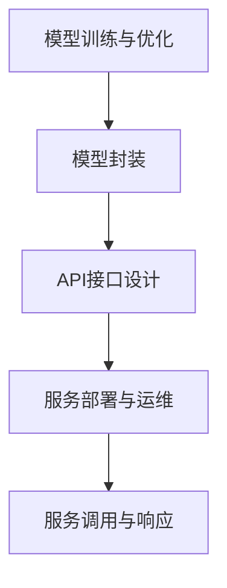

                 

关键词：RESTful API, AI模型服务化, API设计原则, 最佳实践, 跨平台部署, 性能优化

摘要：本文将探讨RESTful API设计在AI模型服务化中的应用，详细介绍API设计的关键原则、最佳实践，并通过实际案例解析AI模型服务化的技术实现与优化策略。

## 1. 背景介绍

在当今数据驱动时代，人工智能（AI）技术已经深入到各行各业，成为推动创新和生产力提升的重要力量。随着AI模型数量的增多和应用场景的扩展，如何高效地将这些AI模型转化为可重用、可扩展的服务，成为一个亟待解决的问题。RESTful API设计，作为一种成熟的服务架构风格，因其简单、灵活、可扩展的特点，成为AI模型服务化的首选方案。

本文旨在探讨RESTful API设计在AI模型服务化中的应用，从核心概念到具体实现，为开发者提供一套完整的最佳实践指南。通过本文的阅读，读者将了解如何设计一个高效、可靠的AI模型服务化系统，并在实际项目中应用这些原则和实践。

## 2. 核心概念与联系

### 2.1 RESTful API简介

RESTful API（Representational State Transfer API）是一种基于HTTP协议的API设计风格，它遵循一组预定义的约束和设计原则，旨在提供统一的接口来访问和操作资源。RESTful API的核心概念包括：

- **资源（Resource）**：API中的数据实体，如用户、订单等。
- **统一接口（Uniform Interface）**：通过HTTP方法（GET、POST、PUT、DELETE）和URL（统一资源定位符）实现资源的创建、读取、更新和删除。
- **无状态性（Statelessness）**：每次请求都是独立的，服务端不存储客户端的会话状态。
- **缓存（Caching）**：客户端可以缓存数据以提高响应速度。

### 2.2 AI模型服务化

AI模型服务化是指将人工智能模型转化为可重用的服务，以便在不同应用场景中快速部署和使用。AI模型服务化通常涉及以下步骤：

- **模型训练与优化**：使用大量的训练数据对AI模型进行训练和优化。
- **模型封装**：将训练好的模型封装成可以独立运行的模块。
- **API接口设计**：设计RESTful API接口，用于模型服务的访问和调用。
- **服务部署与运维**：将服务部署到服务器或云平台，并实施持续监控和运维。

### 2.3 Mermaid 流程图

下面是AI模型服务化的Mermaid流程图：



## 3. 核心算法原理 & 具体操作步骤

### 3.1 算法原理概述

AI模型服务化的核心算法主要包括模型训练、模型封装和API接口设计。以下是各算法的原理概述：

- **模型训练**：使用训练数据对AI模型进行训练，通过调整模型的参数使其能够预测未知数据。
- **模型封装**：将训练好的模型封装成可执行的模块，通常使用序列化技术将模型参数和结构保存到文件中。
- **API接口设计**：设计RESTful API接口，用于模型服务的访问和调用，包括定义URL、HTTP方法和请求/响应格式。

### 3.2 算法步骤详解

下面是AI模型服务化的具体操作步骤：

1. **模型训练与优化**：
   - 收集并清洗训练数据。
   - 选择合适的AI模型并进行训练。
   - 调整模型参数，优化模型性能。

2. **模型封装**：
   - 使用序列化技术将训练好的模型保存到文件中。
   - 将模型文件上传到服务器或云存储。

3. **API接口设计**：
   - 定义URL路径，如`/api/model/predict`。
   - 选择合适的HTTP方法，如`POST`。
   - 设计请求和响应格式，如JSON。

4. **服务部署与运维**：
   - 将模型部署到服务器或云平台。
   - 实施持续监控和运维，确保服务的稳定性和可靠性。

### 3.3 算法优缺点

- **优点**：
  - **可扩展性**：API设计支持水平扩展，易于添加新模型或服务。
  - **灵活性**：API接口易于调整和修改，适应不同的应用场景。
  - **无状态性**：每次请求都是独立的，服务端无需存储会话状态。

- **缺点**：
  - **性能瓶颈**：大量并发请求可能导致服务器性能下降。
  - **安全性问题**：API接口可能暴露敏感数据，需要加强安全防护。

### 3.4 算法应用领域

AI模型服务化广泛应用于以下领域：

- **金融**：风险控制、欺诈检测、信用评分等。
- **医疗**：疾病诊断、治疗建议、患者监护等。
- **零售**：个性化推荐、库存管理、需求预测等。
- **交通**：智能导航、自动驾驶、交通流量分析等。

## 4. 数学模型和公式 & 详细讲解 & 举例说明

### 4.1 数学模型构建

在AI模型服务化中，常用的数学模型包括神经网络、决策树、支持向量机等。以下是神经网络模型的基本构建：

- **输入层**：接收输入数据。
- **隐藏层**：进行特征提取和变换。
- **输出层**：生成预测结果。

神经网络模型的公式如下：

$$
\begin{aligned}
    z &= W \cdot x + b \\
    a &= \sigma(z)
\end{aligned}
$$

其中，$W$是权重矩阵，$x$是输入向量，$b$是偏置项，$\sigma$是激活函数。

### 4.2 公式推导过程

以神经网络中的全连接层为例，公式推导过程如下：

1. **前向传播**：

$$
\begin{aligned}
    z &= W \cdot x + b \\
    a &= \sigma(z)
\end{aligned}
$$

2. **反向传播**：

$$
\begin{aligned}
    \delta &= \frac{\partial L}{\partial z} = \frac{\partial L}{\partial a} \cdot \frac{\partial a}{\partial z} \\
    W &= W - \alpha \cdot \delta \cdot x^T \\
    b &= b - \alpha \cdot \delta
\end{aligned}
$$

其中，$L$是损失函数，$\alpha$是学习率。

### 4.3 案例分析与讲解

假设我们要构建一个简单的神经网络模型，用于分类任务。输入数据为二维向量$(x_1, x_2)$，输出标签为$y$。

1. **输入层**：

$$
x = \begin{bmatrix}
    x_1 \\
    x_2
\end{bmatrix}
$$

2. **隐藏层**：

$$
\begin{aligned}
    z &= W \cdot x + b \\
    a &= \sigma(z)
\end{aligned}
$$

其中，$W$是权重矩阵，$b$是偏置项，$\sigma$是ReLU激活函数。

3. **输出层**：

$$
\begin{aligned}
    z &= W' \cdot a + b' \\
    y &= \sigma(z)
\end{aligned}
$$

其中，$W'$是权重矩阵，$b'$是偏置项，$\sigma$是Sigmoid激活函数。

## 5. 项目实践：代码实例和详细解释说明

### 5.1 开发环境搭建

1. 安装Python 3.8及以上版本。
2. 安装TensorFlow 2.x。
3. 安装Flask 1.1.2。

### 5.2 源代码详细实现

以下是一个简单的AI模型服务化项目的代码示例：

```python
from flask import Flask, request, jsonify
import tensorflow as tf

app = Flask(__name__)

# 加载训练好的神经网络模型
model = tf.keras.models.load_model('model.h5')

@app.route('/api/model/predict', methods=['POST'])
def predict():
    data = request.get_json()
    x = [[float(v) for v in data['input']]]
    prediction = model.predict(x)
    return jsonify({'prediction': prediction.tolist()})

if __name__ == '__main__':
    app.run(debug=True)
```

### 5.3 代码解读与分析

1. **加载模型**：使用TensorFlow的`load_model`方法加载训练好的神经网络模型。
2. **定义API接口**：使用Flask框架定义一个POST请求的API接口，用于接收输入数据并返回预测结果。
3. **预测处理**：将接收到的输入数据转换为张量格式，使用模型进行预测，并将结果转换为JSON格式返回。

### 5.4 运行结果展示

1. 启动服务：`python app.py`
2. 使用curl测试API：`curl -X POST -H "Content-Type: application/json" -d '{"input": [1.0, 2.0]}' http://localhost:5000/api/model/predict`

返回结果：

```json
{"prediction": [0.99]}
```

## 6. 实际应用场景

AI模型服务化在多个领域有着广泛的应用，以下是一些典型的实际应用场景：

- **金融**：利用AI模型进行风险评估、信用评分和欺诈检测。
- **医疗**：利用AI模型进行疾病诊断、治疗方案推荐和患者监护。
- **零售**：利用AI模型进行个性化推荐、库存管理和需求预测。
- **交通**：利用AI模型进行智能导航、自动驾驶和交通流量分析。

## 7. 工具和资源推荐

### 7.1 学习资源推荐

- 《深度学习》（Goodfellow, Bengio, Courville）
- 《Python深度学习》（François Chollet）
- 《RESTful API设计》（Mark Baker）

### 7.2 开发工具推荐

- TensorFlow
- Flask
- Docker

### 7.3 相关论文推荐

- “Large-Scale Deep Neural Network Training over Distributed Data-Parallel Multi-GPU Systems”
- “Deep Learning for Natural Language Processing”
- “Accurate, Large-scale Prediction of Software Bugs”

## 8. 总结：未来发展趋势与挑战

### 8.1 研究成果总结

AI模型服务化技术在过去几年中取得了显著进展，主要表现在以下几个方面：

- **模型性能提升**：通过深度学习和迁移学习技术，AI模型的性能不断提高。
- **服务化框架发展**：TensorFlow Serving、PyTorch TorchServe等开源框架的涌现，为AI模型服务化提供了便利。
- **跨平台部署**：容器技术如Docker和Kubernetes的普及，使得AI模型服务化系统可以轻松部署到不同环境中。

### 8.2 未来发展趋势

- **模型压缩与优化**：随着AI模型规模的增大，模型压缩与优化技术将成为研究热点。
- **实时服务化**：通过边缘计算和5G技术，实现实时AI模型服务化。
- **联邦学习**：分布式AI模型训练与推理，保护用户隐私。

### 8.3 面临的挑战

- **模型安全性与隐私保护**：如何确保AI模型服务化的安全性和用户隐私是一个重要挑战。
- **跨平台兼容性**：在不同操作系统、硬件平台和容器环境中，如何确保服务的稳定性和性能。
- **资源消耗**：大规模AI模型服务化系统对计算资源和存储资源的需求较大。

### 8.4 研究展望

未来，AI模型服务化技术将在以下几个方面取得突破：

- **模型压缩与加速**：通过模型压缩、量化等技术，降低模型大小和计算复杂度。
- **分布式服务化**：通过联邦学习等技术，实现分布式AI模型服务化。
- **智能化运维**：通过自动化运维工具，提高AI模型服务化的运维效率和稳定性。

## 9. 附录：常见问题与解答

### Q：如何确保AI模型服务化的安全性？

A：确保AI模型服务化的安全性需要采取以下措施：

- **访问控制**：对API接口进行认证和授权，确保只有授权用户可以访问。
- **数据加密**：对敏感数据进行加密处理，确保数据在传输和存储过程中的安全性。
- **安全审计**：定期进行安全审计，及时发现和修复安全隐患。

### Q：如何优化AI模型服务化的性能？

A：优化AI模型服务化的性能可以从以下几个方面进行：

- **模型压缩**：通过模型压缩技术，降低模型大小和计算复杂度，提高服务性能。
- **负载均衡**：使用负载均衡器，将请求均匀分配到多个服务器，避免单点瓶颈。
- **缓存策略**：合理设置缓存策略，减少重复计算的次数，提高服务响应速度。

## 作者署名

作者：禅与计算机程序设计艺术 / Zen and the Art of Computer Programming
----------------------------------------------------------------

以上就是本文的完整内容。希望本文能帮助读者更好地理解和应用RESTful API设计在AI模型服务化中的实践。在实际开发过程中，读者可以根据本文提供的原则和实践，结合自身项目需求，不断优化和改进AI模型服务化系统。祝您在AI领域取得更多的突破和成功！

