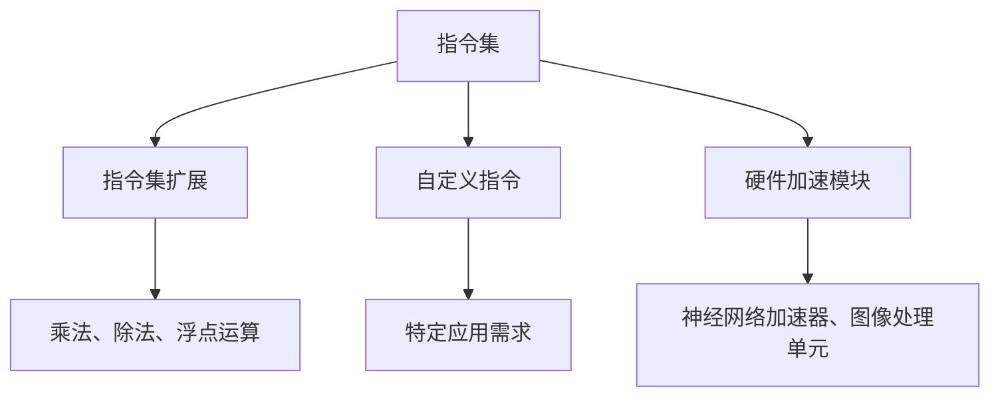

                 

关键词：RISC-V处理器、特性分析、性能优化、架构设计、系统架构

摘要：本文旨在深入探讨RISC-V处理器的设计特点及其性能优化策略。文章首先介绍了RISC-V处理器的基本概念和历史背景，接着分析了其核心特性，包括指令集、指令集扩展、自定义指令和硬件加速模块等。随后，文章详细探讨了RISC-V处理器的性能优化方法，包括编译器优化、缓存策略和功耗管理。此外，本文还探讨了RISC-V处理器在不同领域的实际应用，并展望了其未来发展趋势。

## 1. 背景介绍

RISC-V（Reduced Instruction Set Computing - Vector）是一种新兴的开源指令集架构（ISA），自2010年由加州大学伯克利分校发布以来，得到了广泛的关注和发展。与传统封闭的指令集架构相比，RISC-V具有高度可扩展性和定制性，允许企业和开发者根据自己的需求设计和实现自己的处理器。

### 1.1 RISC-V的发展历程

RISC-V的发展历程可以分为以下几个阶段：

- **2010年**：加州大学伯克利分校发布了RISC-V指令集架构。
- **2014年**：RISC-V基金会成立，旨在推动RISC-V技术的发展和普及。
- **2015年**：第一个RISC-V处理器被推出，标志着RISC-V从理论走向实践。
- **至今**：RISC-V处理器在多个领域得到应用，包括嵌入式系统、物联网、云计算和人工智能等。

### 1.2 RISC-V的优势

RISC-V具有以下优势：

- **开源**：RISC-V是一种开源指令集架构，任何人都可以自由使用、修改和分发。
- **高度可扩展性**：RISC-V支持多种处理器核心，如RV32I、RV64I、RV128I等，且支持多种指令集扩展。
- **定制化**：用户可以根据自己的需求定制处理器，从而实现最优的性能和功耗平衡。

## 2. 核心概念与联系

### 2.1 指令集

RISC-V指令集是RISC-V处理器的核心。它定义了处理器可以执行的操作集，包括基本数据操作、控制流操作和内存访问操作等。RISC-V指令集的特点是简洁、高效和易于实现。

### 2.2 指令集扩展

RISC-V支持多种指令集扩展，如乘法、除法、浮点运算等。这些扩展使得RISC-V处理器可以更好地满足特定应用的需求。

### 2.3 自定义指令

RISC-V允许用户定义自己的指令，这为处理器的设计提供了极大的灵活性。用户可以根据自己的应用需求，设计并实现特定的指令，从而提高处理器的性能。

### 2.4 硬件加速模块

RISC-V处理器可以集成多种硬件加速模块，如神经网络加速器、图像处理单元等。这些模块可以显著提高处理器在特定领域的性能。

### 2.5 Mermaid 流程图



## 3. 核心算法原理 & 具体操作步骤

### 3.1 算法原理概述

RISC-V处理器的核心算法是基于其指令集架构的。处理器通过执行指令来执行计算任务。每个指令都包含操作码和操作数，操作码指定了指令要执行的操作，操作数指定了操作的数据来源和目的。

### 3.2 算法步骤详解

- **取指阶段**：处理器从内存中取出指令。
- **译码阶段**：处理器解析指令，确定操作码和操作数。
- **执行阶段**：处理器执行指令，根据操作码和操作数执行相应的操作。
- **访存阶段**：如果指令涉及内存操作，处理器访问内存读取或写入数据。
- **写回阶段**：处理器将执行结果写回到寄存器或内存中。

### 3.3 算法优缺点

- **优点**：RISC-V处理器具有简洁、高效、易于实现的特点，适合于嵌入式系统和低功耗应用。
- **缺点**：由于RISC-V是一种新兴的指令集架构，其生态系统和软件支持尚未完全成熟。

### 3.4 算法应用领域

RISC-V处理器可以应用于多个领域，包括：

- **嵌入式系统**：RISC-V处理器可以用于嵌入式系统的核心处理单元，如物联网设备、智能家居等。
- **云计算**：RISC-V处理器可以用于云计算平台的服务器，提供高性能的计算能力。
- **人工智能**：RISC-V处理器可以用于人工智能领域的推理和训练任务。

## 4. 数学模型和公式 & 详细讲解 & 举例说明

### 4.1 数学模型构建

RISC-V处理器的性能可以通过多种数学模型进行评估，如CPI（Cycles Per Instruction）、MFLOPS（Million Floating-point Operations Per Second）等。这些模型可以帮助我们更好地理解处理器的性能。

### 4.2 公式推导过程

- **CPI公式**：
  $$ CPI = \frac{Cycles}{Instructions} $$
  其中，CPI表示每条指令所需的周期数，Cycles表示总周期数，Instructions表示总指令数。

- **MFLOPS公式**：
  $$ MFLOPS = \frac{Floating-point Operations}{Seconds} \times 10^6 $$
  其中，MFLOPS表示每秒可执行的浮点操作数。

### 4.3 案例分析与讲解

假设有一个RISC-V处理器，其CPI为3，每秒可以执行10亿条指令，那么它的性能可以计算如下：

- **CPI**：
  $$ CPI = \frac{Cycles}{Instructions} = \frac{3 \times 10^9}{10^9} = 3 $$
- **MFLOPS**：
  $$ MFLOPS = \frac{Floating-point Operations}{Seconds} \times 10^6 = 10^9 \times 10^6 = 10^{15} $$

## 5. 项目实践：代码实例和详细解释说明

### 5.1 开发环境搭建

为了实践RISC-V处理器的设计，我们需要搭建一个开发环境。以下是一个基本的开发环境搭建步骤：

1. 安装RISC-V工具链，如RV32I处理器。
2. 配置开发环境，包括交叉编译工具、仿真器和调试器。
3. 准备源代码，包括处理器核心、指令集和测试程序。

### 5.2 源代码详细实现

以下是一个简单的RISC-V处理器源代码示例：

```c
// Processor core implementation
void riscv_core() {
    while (1) {
        // Fetch instruction
        Instruction instr = fetch_instruction();

        // Decode instruction
        Opcode opcode = decode_instruction(instr);

        // Execute instruction
        execute_instruction(opcode);

        // Check for interrupts
        if (interrupt_requested()) {
            handle_interrupt();
        }
    }
}
```

### 5.3 代码解读与分析

上述代码实现了一个简单的RISC-V处理器核心。它包含以下关键部分：

- **fetch_instruction()**：从内存中取出指令。
- **decode_instruction()**：解析指令，确定操作码和操作数。
- **execute_instruction()**：执行指令，根据操作码和操作数执行相应的操作。
- **interrupt_requested()**：检查是否有中断请求。
- **handle_interrupt()**：处理中断。

### 5.4 运行结果展示

在仿真环境下，我们可以运行上述代码，并观察处理器的运行结果。通过分析运行结果，我们可以进一步优化处理器的性能和功耗。

## 6. 实际应用场景

### 6.1 嵌入式系统

RISC-V处理器在嵌入式系统中有广泛的应用，如物联网设备、智能家居等。由于其开源、可定制的特点，RISC-V处理器可以满足嵌入式系统的多样性和灵活性需求。

### 6.2 云计算

RISC-V处理器在云计算领域也具有一定的应用潜力。随着云计算技术的发展，对处理器性能和功耗的要求越来越高，RISC-V处理器可以提供高性能、低功耗的解决方案。

### 6.3 人工智能

人工智能领域对处理器的性能和能效提出了更高的要求。RISC-V处理器可以通过集成硬件加速模块，如神经网络加速器，提高人工智能应用的性能。

## 7. 工具和资源推荐

### 7.1 学习资源推荐

- **《RISC-V处理器设计与实现》**：详细介绍了RISC-V处理器的设计方法和实现技术。
- **RISC-V官方网站**：提供RISC-V的最新动态、教程和开发资源。

### 7.2 开发工具推荐

- **RISC-V工具链**：包括交叉编译工具、仿真器和调试器等。
- **RISC-V仿真器**：如QEMU、Simulator等。

### 7.3 相关论文推荐

- **“RISC-V: A New Instruction Set Architecture for Hardware-Software Codesign”**：介绍了RISC-V的背景和设计理念。
- **“RISC-V: The Open-Source ISA for Hardware-Software Codesign”**：详细探讨了RISC-V的架构和特点。

## 8. 总结：未来发展趋势与挑战

### 8.1 研究成果总结

本文介绍了RISC-V处理器的设计特点、性能优化方法及其在不同领域的应用。通过分析RISC-V处理器的优势和挑战，我们为未来的研究提供了方向。

### 8.2 未来发展趋势

随着开源技术和人工智能的快速发展，RISC-V处理器有望在多个领域得到更广泛的应用。未来，RISC-V处理器将向高性能、低功耗、可定制化方向发展。

### 8.3 面临的挑战

RISC-V处理器在生态系统、软件支持、知识产权等方面仍面临一定的挑战。为了推动RISC-V技术的发展，我们需要加强国际合作、开放共享资源和加强人才培养。

### 8.4 研究展望

未来，RISC-V处理器有望在以下几个方面取得突破：

- **性能提升**：通过优化处理器架构和指令集，提高处理器的性能。
- **能效优化**：通过功耗管理和硬件加速技术，降低处理器的能耗。
- **定制化**：通过定制化指令和硬件加速模块，满足不同应用的需求。

## 9. 附录：常见问题与解答

### 9.1 RISC-V处理器与传统处理器相比有哪些优势？

RISC-V处理器具有开源、高度可扩展性、定制化等特点，与传统处理器相比，具有更高的灵活性和适应性。

### 9.2 RISC-V处理器在哪些领域有广泛应用？

RISC-V处理器在嵌入式系统、云计算、人工智能等领域有广泛应用。随着技术的不断发展，RISC-V处理器的应用领域将不断拓展。

### 9.3 如何优化RISC-V处理器的性能？

可以通过编译器优化、缓存策略和功耗管理等方式优化RISC-V处理器的性能。此外，还可以通过集成硬件加速模块，提高处理器的性能。

### 9.4 RISC-V处理器在未来有哪些发展趋势？

未来，RISC-V处理器将向高性能、低功耗、可定制化方向发展。随着开源技术和人工智能的快速发展，RISC-V处理器有望在多个领域取得突破性进展。

