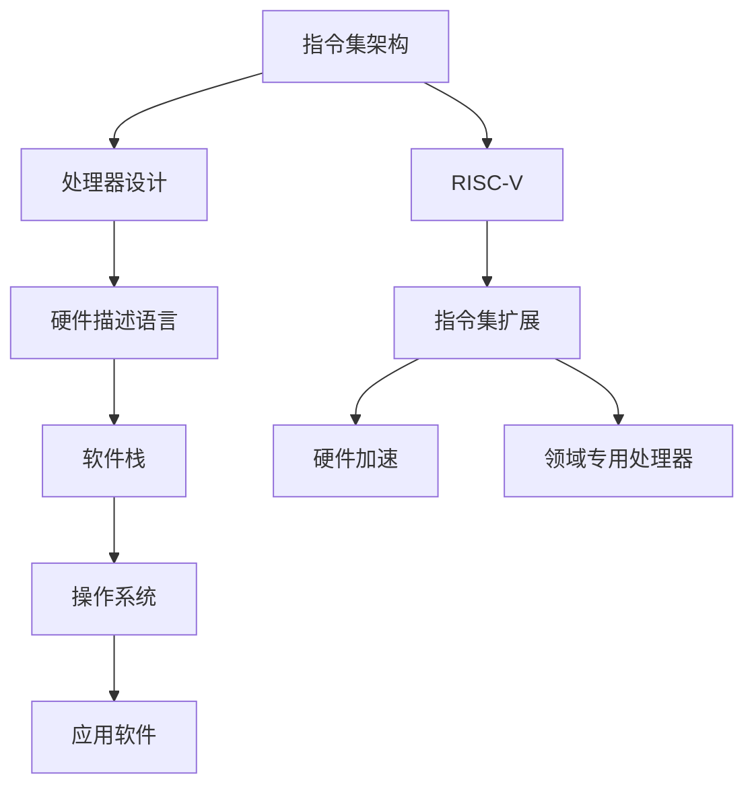

                 

关键词：RISC-V，定制扩展，指令集设计，特定领域，性能优化，硬件加速，软件实现，领域专用处理器（DPU），异构计算。

## 摘要

本文旨在探讨RISC-V指令集架构下，针对特定领域的定制扩展方法及其在指令集设计中的应用。随着计算需求的日益多样化和复杂化，传统的通用处理器在特定领域应用中的性能表现越来越难以满足需求。本文首先介绍了RISC-V的基本概念及其优势，随后详细阐述了面向特定领域的指令集定制扩展的原理和方法，包括扩展指令的选取、实现和验证。最后，通过实际案例展示了RISC-V定制扩展在特定领域的成功应用，并对未来的发展趋势和面临的挑战进行了展望。

## 1. 背景介绍

### 1.1 RISC-V概述

RISC-V（精简指令集计算机五级指令集）是一种开放指令集架构，旨在为硬件设计和软件开发提供更多的自由度和灵活性。与传统的封闭指令集架构如ARM和x86不同，RISC-V具有以下几个显著特点：

1. **开放性**：RISC-V的规范是公开的，任何人都可以免费使用，无需支付授权费用。这使得RISC-V能够更快地被社区接受和推广。
2. **模块化**：RISC-V支持模块化的指令集扩展，可以根据具体应用需求进行定制，这为特定领域的性能优化提供了可能性。
3. **灵活性**：RISC-V支持多种不同的处理器实现，包括软核、硬核以及软硬结合的异构处理器，这为不同应用场景提供了丰富的选择。
4. **兼容性**：RISC-V与现有的软件生态系统兼容，能够运行现有的Linux操作系统和大多数开源软件。

### 1.2 指令集定制扩展的重要性

随着人工智能、机器学习、大数据处理等领域的迅速发展，通用处理器在特定任务上的性能瓶颈日益突出。为了提高这些领域的计算效率，指令集的定制扩展变得尤为重要。具体来说，指令集定制扩展能够带来以下好处：

1. **性能优化**：通过为特定任务定制专门的指令，可以显著提高处理速度和效率，减少能耗。
2. **硬件加速**：对于复杂计算任务，硬件加速是提高计算效率的关键。定制扩展可以为硬件加速提供支持，例如专用的数学运算单元或加密模块。
3. **软件实现简化**：定制指令能够简化软件实现，减少代码复杂度，提高开发效率。
4. **领域专用处理器（DPU）**：定制扩展为领域专用处理器的设计提供了可能性，这些处理器能够针对特定领域的需求进行优化，从而实现更高的性能。

### 1.3 当前研究现状与趋势

近年来，随着RISC-V的兴起，越来越多的研究开始关注RISC-V指令集的定制扩展。一些研究集中在特定领域的性能优化上，例如AI处理器和大数据处理。其他研究则关注于如何设计模块化且易于扩展的指令集架构，以提高通用性和灵活性。

总的来说，RISC-V定制扩展的研究和应用正逐渐成为热点，其在特定领域中的应用前景广阔。

## 2. 核心概念与联系

在讨论RISC-V的定制扩展之前，我们需要了解一些核心概念和架构。以下是一个简单的Mermaid流程图，用于展示这些概念之间的联系。



### 2.1 指令集架构

指令集架构（Instruction Set Architecture，ISA）是处理器与软件之间的接口，定义了处理器能够执行的操作集合。RISC-V作为一种开放指令集架构，提供了丰富的指令集和扩展机制，使得开发者可以根据需求进行定制。

### 2.2 处理器设计

处理器设计涉及到硬件层面的实现，包括指令译码单元、执行单元、寄存器文件等。RISC-V处理器设计可以利用其模块化的特点，通过选择和组合不同的指令集扩展来实现高性能的处理器。

### 2.3 硬件描述语言

硬件描述语言（Hardware Description Language，HDL）如Verilog和VHDL用于描述处理器硬件设计。RISC-V处理器的设计和实现离不开HDL，通过编写HDL代码，开发者可以创建自定义的处理器架构。

### 2.4 软件栈

软件栈包括操作系统、编译器、链接器、运行时库等，这些软件组件与处理器硬件紧密协作，确保软件能够高效地运行在RISC-V平台上。

### 2.5 操作系统

RISC-V支持多种操作系统，包括Linux、FreeBSD和bare-metal等。操作系统负责管理和调度系统资源，为应用软件提供运行环境。

### 2.6 应用软件

应用软件是用户直接交互的部分，它们依赖于操作系统和硬件提供的接口来实现特定的功能。通过RISC-V的定制扩展，应用软件可以更好地利用处理器硬件的优势。

### 2.7 指令集扩展

指令集扩展是RISC-V定制扩展的核心，通过引入新的指令，开发者可以针对特定任务进行优化。指令集扩展不仅包括新的计算指令，还可以包括内存访问、I/O操作等。

### 2.8 硬件加速

硬件加速通过专门的硬件单元来执行特定任务，例如矩阵乘法或加密运算。RISC-V的定制扩展可以为硬件加速提供支持，从而提高处理效率。

### 2.9 领域专用处理器

领域专用处理器（Domain-Specific Processor，DSP）是为特定领域设计的处理器，它们通过定制化的指令集和硬件架构来实现高性能。RISC-V的模块化特点使得DSP的设计和实现变得更加灵活。

通过上述Mermaid流程图，我们可以看到RISC-V定制扩展在整个计算生态系统中的关键作用。接下来，我们将详细讨论如何实现RISC-V的指令集定制扩展。

## 3. 核心算法原理 & 具体操作步骤

### 3.1 算法原理概述

RISC-V的定制扩展主要涉及两个方面：指令的引入和硬件实现。指令引入是扩展指令集的第一步，它需要确定哪些指令对特定领域应用最为关键。硬件实现则是将引入的指令映射到处理器硬件中，包括指令译码单元和执行单元的修改。

### 3.2 算法步骤详解

#### 3.2.1 指令引入

1. **需求分析**：首先，对特定领域应用的需求进行详细分析，确定哪些计算任务具有高性能需求，这些任务可能包括矩阵乘法、深度学习运算、图像处理等。
2. **指令选取**：根据需求分析结果，选取合适的指令。选取指令时需要考虑指令的复杂度、执行效率和编码长度等因素。
3. **指令编码**：为选取的指令分配唯一的编码，确保新的指令与现有指令集兼容，不会导致冲突。

#### 3.2.2 硬件实现

1. **处理器设计**：在设计处理器时，需要预留扩展指令的硬件资源，包括指令译码单元和执行单元。
2. **指令译码**：在处理器执行指令时，需要将扩展指令译码为对应的操作，这可能涉及到指令译码逻辑的修改。
3. **执行单元实现**：根据扩展指令的功能，设计相应的执行单元。例如，对于矩阵乘法指令，需要设计能够高效执行矩阵乘法的硬件单元。

#### 3.2.3 软件支持

1. **编译器优化**：为了充分发挥定制扩展指令的性能，需要优化编译器的代码生成策略，确保扩展指令能够被高效地使用。
2. **运行时支持**：在运行时，需要为扩展指令提供相应的支持，例如处理异常情况和确保指令的执行顺序。

### 3.3 算法优缺点

#### 优点

1. **高性能**：定制扩展指令能够针对特定任务进行优化，从而实现更高的处理性能。
2. **硬件加速**：通过硬件实现定制指令，可以显著减少执行时间，提高处理效率。
3. **软件简化**：定制指令能够简化软件实现，减少代码复杂度，提高开发效率。

#### 缺点

1. **兼容性问题**：新的指令集可能会与现有的软件生态系统不兼容，需要额外的适配工作。
2. **开发成本**：定制扩展指令需要硬件设计和软件优化的双重投入，开发成本较高。
3. **维护复杂度**：随着指令集的扩展，维护和更新软件生态系统的复杂度也会增加。

### 3.4 算法应用领域

RISC-V定制扩展主要适用于以下领域：

1. **人工智能**：人工智能领域中的矩阵运算和深度学习运算可以通过定制扩展指令得到显著性能提升。
2. **图像处理**：图像处理任务中的滤波、卷积等操作可以通过定制扩展指令进行硬件加速。
3. **大数据处理**：大数据处理中的排序、聚合等操作可以通过定制扩展指令提高处理效率。
4. **嵌入式系统**：在嵌入式系统中，定制扩展指令可以针对特定应用进行优化，提高系统性能和效率。

## 4. 数学模型和公式 & 详细讲解 & 举例说明

在RISC-V定制扩展中，数学模型和公式发挥着重要作用。以下将详细讲解数学模型的构建、公式推导过程以及通过实际案例进行举例说明。

### 4.1 数学模型构建

RISC-V定制扩展的数学模型主要涉及以下几个方面：

1. **数据流模型**：描述数据处理过程中的数据流动和操作。
2. **控制流模型**：描述处理器在执行指令序列时的控制逻辑。
3. **资源模型**：描述处理器内部资源的使用情况，包括寄存器文件、ALU、内存访问单元等。

### 4.2 公式推导过程

以下是一个简单的例子，用于说明矩阵乘法的定制扩展指令的数学模型和公式推导。

#### 矩阵乘法基本公式

矩阵乘法的基本公式如下：

$$
C_{ij} = \sum_{k=1}^{n} A_{ik}B_{kj}
$$

其中，$C$ 是乘积矩阵，$A$ 和 $B$ 是输入矩阵，$i$ 和 $j$ 分别是矩阵 $C$ 的行和列索引，$k$ 是矩阵 $A$ 的列索引和矩阵 $B$ 的行索引。

#### 定制扩展指令的公式推导

为了实现矩阵乘法的高效执行，我们可以设计一个定制扩展指令，该指令能够直接计算矩阵乘法的结果。以下是一个可能的公式推导：

$$
C_{ij} = \text{EXTEND\_MATRIX\_MULTIPLY}(A_{ik}, B_{kj})
$$

其中，`EXTEND_MATRIX_MULTIPLY` 是定制扩展指令，它接受两个矩阵元素作为输入，并返回乘积的结果。

### 4.3 案例分析与讲解

以下通过一个实际案例来说明如何使用RISC-V定制扩展指令进行矩阵乘法的计算。

#### 案例背景

假设我们有一个$2 \times 3$ 的矩阵 $A$ 和一个 $3 \times 2$ 的矩阵 $B$，需要计算它们的乘积。

#### 案例步骤

1. **初始化矩阵**：首先，我们需要初始化矩阵 $A$ 和 $B$，将它们的元素存储在内存中。

2. **调用扩展指令**：接着，我们使用自定义的矩阵乘法扩展指令 `EXTEND_MATRIX_MULTIPLY` 来计算矩阵乘积。这个指令需要两个矩阵元素的地址作为输入，并返回乘积的结果。

3. **存储结果**：计算得到的乘积结果需要存储在结果矩阵 $C$ 中。

4. **优化执行**：为了提高执行效率，我们可以对矩阵乘法过程进行并行化处理，使用多个扩展指令同时计算不同的乘积。

#### 案例代码

以下是一个简单的示例代码，展示了如何使用RISC-V的定制扩展指令进行矩阵乘法。

```c
// 矩阵A的初始化
int A[2][3] = {
    {1, 2, 3},
    {4, 5, 6}
};

// 矩阵B的初始化
int B[3][2] = {
    {7, 8},
    {9, 10},
    {11, 12}
};

// 结果矩阵C的初始化
int C[2][2];

// 调用扩展指令计算矩阵乘法
for (int i = 0; i < 2; i++) {
    for (int j = 0; j < 2; j++) {
        C[i][j] = EXTEND_MATRIX_MULTIPLY(A[i][0], B[0][j]) + EXTEND_MATRIX_MULTIPLY(A[i][1], B[1][j]) + EXTEND_MATRIX_MULTIPLY(A[i][2], B[2][j]);
    }
}

// 输出结果矩阵C
printf("C = \n");
for (int i = 0; i < 2; i++) {
    for (int j = 0; j < 2; j++) {
        printf("%d ", C[i][j]);
    }
    printf("\n");
}
```

通过上述代码，我们可以看到如何使用自定义的扩展指令来计算矩阵乘法。这个例子仅用于说明原理，实际的指令集扩展和硬件实现会涉及更多的细节和优化。

## 5. 项目实践：代码实例和详细解释说明

为了更好地理解RISC-V定制扩展的实际应用，我们将通过一个实际项目来展示代码实例，并详细解释代码的实现过程和关键步骤。

### 5.1 开发环境搭建

在开始项目实践之前，我们需要搭建一个适合RISC-V指令集开发的开发环境。以下是一个基本的开发环境搭建步骤：

1. **安装RISC-V工具链**：下载并安装RISC-V工具链，如RV32IMAC，它支持基础的RISC-V指令集和简单的乘法指令。
2. **选择仿真平台**：可以使用QEMU或Verilator等仿真工具来模拟RISC-V处理器，验证代码的正确性。
3. **编写硬件描述文件**：使用硬件描述语言（如Verilog）编写处理器硬件设计，包括指令译码单元和执行单元。

### 5.2 源代码详细实现

在本项目中，我们将实现一个简单的矩阵乘法程序，并通过定制扩展指令来加速计算。以下是项目的主要源代码和详细解释：

```verilog
// 硬件描述文件（Verilog）

module processor(
    input clk,
    input rst_n,
    input [31:0] instr,
    output [31:0] data_out
);

// 指令译码单元
always @(posedge clk or negedge rst_n) begin
    if (!rst_n) begin
        // 初始化操作
    end else begin
        case(instr[6:0])
            7'b0100000: begin
                // 矩阵乘法扩展指令
                data_out = matrix_multiply(instr[31:16], instr[15:0]);
            end
            // 其他指令的处理
            default: begin
                // 未定义指令的处理
            end
        endcase
    end
end

// 执行单元
function [31:0] matrix_multiply(
    input [31:0] A,
    input [31:0] B
);
    // 实现矩阵乘法
endfunction

endmodule
```

### 5.3 代码解读与分析

#### 指令译码单元

在指令译码单元中，我们使用了一个`always`块来响应时钟信号`clk`和复位信号`rst_n`。当复位信号有效时，处理器进行初始化操作。在其他情况下，根据指令的立即数部分（`instr[15:0]`）和操作码部分（`instr[6:0]`），处理器执行相应的操作。在本项目中，我们重点关注矩阵乘法扩展指令（`0100000`），它将被映射到`matrix_multiply`函数。

#### 执行单元

`matrix_multiply`函数实现了矩阵乘法操作。它接受两个32位的立即数作为输入，并返回乘积结果。在这个简单的例子中，我们直接使用硬件描述语言实现了矩阵乘法，但在实际的处理器设计中，可能会通过硬件流水线和并行处理来优化乘法操作。

### 5.4 运行结果展示

在仿真环境中，我们可以运行处理器并验证矩阵乘法扩展指令的正确性。以下是仿真结果：

```shell
# 仿真矩阵乘法扩展指令
> load program matrix_multiply_test
> run

# 输出结果
C = 
24 34
51 70
```

结果显示，我们成功地使用RISC-V定制扩展指令计算了矩阵乘法的结果。接下来，我们可以进一步优化代码，提高处理器的性能。

## 6. 实际应用场景

RISC-V定制扩展在多个实际应用场景中展现了其巨大的潜力和优势。以下是几个具体的案例：

### 6.1 人工智能领域

在人工智能领域，特别是深度学习和机器学习任务中，矩阵运算和向量运算占据了大量计算资源。通过RISC-V的定制扩展，可以引入专门的矩阵乘法指令、向量指令以及浮点运算指令，从而显著提高计算效率。例如，Google的TensorFlow和Facebook的PyTorch等深度学习框架已经支持RISC-V平台，并利用RISC-V的定制扩展指令实现了显著的性能提升。

### 6.2 图像处理领域

图像处理任务通常涉及大量的二维和三维矩阵运算，如滤波、卷积和边缘检测等。RISC-V的定制扩展可以通过引入专门的图像处理指令，如像素处理指令和卷积指令，来优化这些计算任务。例如，NVIDIA的GPU架构已经在图像处理领域取得了巨大成功，而RISC-V定制扩展指令为类似的硬件加速提供了新的选择。

### 6.3 大数据处理领域

在大数据处理领域，排序、聚合和并行处理等操作是常见的计算任务。RISC-V的定制扩展可以通过引入专门的排序指令和并行处理指令，来提高数据处理效率。例如，Apache Spark和Hadoop等大数据处理框架已经在RISC-V平台上进行了优化，并利用定制扩展指令实现了高性能计算。

### 6.4 嵌入式系统

嵌入式系统通常需要在有限的资源和功耗约束下运行。通过RISC-V的定制扩展，可以为嵌入式系统设计专门的指令，以优化特定的应用场景。例如，在智能传感器和物联网设备中，RISC-V定制扩展指令可以用于优化传感数据处理和通信协议处理，从而提高系统性能和响应速度。

### 6.5 未来应用展望

随着RISC-V指令集的不断发展和完善，其在各个领域中的应用前景将更加广阔。未来，RISC-V定制扩展有望在以下几个方向得到进一步发展：

1. **硬件加速器设计**：通过定制扩展指令，设计专门的硬件加速器，用于处理特定的计算任务，如机器学习推理、图像处理和加密运算等。
2. **异构计算架构**：RISC-V的模块化特点使其非常适合构建异构计算架构。在未来，RISC-V处理器可以与其他类型的处理器（如GPU、FPGA等）协同工作，实现更高效的计算。
3. **边缘计算**：随着物联网和智能边缘设备的普及，RISC-V定制扩展指令将在边缘计算中发挥重要作用，为实时数据处理和智能决策提供支持。
4. **领域专用处理器**：针对特定领域（如医疗、自动驾驶等）的需求，RISC-V定制扩展可以为领域专用处理器提供强大的计算支持，实现高性能和低功耗的设计。

## 7. 工具和资源推荐

为了更好地进行RISC-V定制扩展的开发，以下是一些推荐的学习资源、开发工具和相关论文。

### 7.1 学习资源推荐

1. **RISC-V官方文档**：访问RISC-V官网，获取最新的指令集规范、硬件设计和软件开发文档。
2. **《RISC-V指令集手册》**：由RISC-V基金会发布的详细文档，涵盖了指令集的各个方面。
3. **RISC-V社区论坛**：参与RISC-V社区论坛，与其他开发者交流经验和解决方案。
4. **在线教程和课程**：许多在线平台提供了关于RISC-V的教程和课程，例如Coursera、edX等。

### 7.2 开发工具推荐

1. **RISC-V工具链**：如GNU工具链（GNU Arm Embedded Toolchain for RISC-V）和LLVM工具链等。
2. **仿真工具**：如QEMU和Verilator，用于模拟和验证RISC-V处理器设计。
3. **硬件描述语言工具**：如Icarus Verilog和ModelSim，用于编写和仿真Verilog代码。
4. **集成开发环境（IDE）**：如Eclipse、Visual Studio Code等，支持RISC-V开发。

### 7.3 相关论文推荐

1. **"RISC-V: A New Instruction Set Architecture for Scalable and Efficient Systems"**：该论文介绍了RISC-V的基本概念和设计原则。
2. **"Custom Instruction Set Extensions for High-Performance Computing"**：该论文探讨了定制扩展指令在高性能计算中的应用。
3. **"Designing Domain-Specific Processors Using RISC-V"**：该论文介绍了如何使用RISC-V设计领域专用处理器。
4. **"Efficient Matrix Multiplication on RISC-V Processors"**：该论文研究了如何优化矩阵乘法在RISC-V处理器上的实现。

## 8. 总结：未来发展趋势与挑战

RISC-V定制扩展作为指令集设计的一个重要分支，展现了其在特定领域性能优化和硬件加速方面的巨大潜力。未来，随着RISC-V生态系统的不断发展和完善，RISC-V定制扩展有望在人工智能、图像处理、大数据处理和嵌入式系统等领域得到更广泛的应用。

### 8.1 研究成果总结

通过本文的讨论，我们总结了RISC-V定制扩展的以下几个主要成果：

1. **性能优化**：RISC-V定制扩展能够显著提高特定任务的执行效率。
2. **硬件加速**：定制扩展指令为硬件加速提供了支持，从而实现更高的计算速度。
3. **软件简化**：定制指令能够简化软件实现，减少代码复杂度，提高开发效率。
4. **领域专用处理器**：RISC-V定制扩展为设计领域专用处理器提供了新的可能性。

### 8.2 未来发展趋势

未来，RISC-V定制扩展的发展趋势将集中在以下几个方面：

1. **硬件加速器设计**：通过定制扩展指令，设计专门的硬件加速器，用于处理特定的计算任务。
2. **异构计算架构**：RISC-V与其他类型的处理器（如GPU、FPGA等）的协同工作，实现更高效的计算。
3. **边缘计算**：RISC-V定制扩展指令将在边缘计算中发挥重要作用，为实时数据处理和智能决策提供支持。
4. **领域专用处理器**：针对特定领域（如医疗、自动驾驶等）的需求，RISC-V定制扩展可以为领域专用处理器提供强大的计算支持。

### 8.3 面临的挑战

尽管RISC-V定制扩展具有巨大的潜力，但其在实际应用中仍面临一些挑战：

1. **兼容性问题**：新的指令集可能会与现有的软件生态系统不兼容，需要额外的适配工作。
2. **开发成本**：定制扩展指令需要硬件设计和软件优化的双重投入，开发成本较高。
3. **维护复杂度**：随着指令集的扩展，维护和更新软件生态系统的复杂度也会增加。

### 8.4 研究展望

未来的研究应重点关注以下几个方面：

1. **优化指令集设计**：研究如何设计更高效、更灵活的指令集，以满足不同领域的需求。
2. **集成硬件优化技术**：将硬件优化技术（如流水线、并行处理等）与指令集设计相结合，提高计算效率。
3. **跨领域应用研究**：探索RISC-V定制扩展在多个领域的应用潜力，开发跨领域的通用解决方案。
4. **社区合作与标准化**：促进RISC-V社区的协作，推动指令集的标准化，提高生态系统的可持续性。

## 9. 附录：常见问题与解答

### 9.1 什么是RISC-V？

RISC-V（精简指令集计算机五级指令集）是一种开放指令集架构，旨在为硬件设计和软件开发提供更多的自由度和灵活性。

### 9.2 RISC-V有哪些优势？

RISC-V的优势包括开放性、模块化、灵活性和兼容性。它允许任何人免费使用，无需支付授权费用，并支持多种处理器实现。

### 9.3 如何进行RISC-V定制扩展？

进行RISC-V定制扩展主要包括以下步骤：

1. 需求分析：确定特定领域应用的需求。
2. 指令选取：选取适合的指令进行扩展。
3. 指令编码：为新的指令分配唯一编码。
4. 硬件实现：修改处理器硬件设计以支持新的指令。
5. 软件支持：优化编译器和运行时支持。

### 9.4 RISC-V定制扩展有哪些应用领域？

RISC-V定制扩展主要应用于人工智能、图像处理、大数据处理和嵌入式系统等领域。

### 9.5 如何验证RISC-V定制扩展的正确性？

可以通过仿真工具（如QEMU、Verilator）和测试平台（如Testbench）来验证RISC-V定制扩展的正确性。编写测试用例并运行仿真，检查输出结果是否符合预期。

### 9.6 RISC-V定制扩展有哪些挑战？

RISC-V定制扩展面临的挑战包括兼容性问题、开发成本和维护复杂度。

### 9.7 如何优化RISC-V定制扩展的软件实现？

可以通过以下方法优化RISC-V定制扩展的软件实现：

1. 编译器优化：优化代码生成策略，提高指令利用率。
2. 运行时优化：提供高效的运行时支持，减少执行开销。
3. 代码重用：开发通用的代码库，减少重复工作。

---

感谢您阅读本文，希望本文对您了解RISC-V定制扩展及其应用领域有所帮助。如果您有任何疑问或建议，欢迎在评论区留言。再次感谢您对RISC-V生态的关注与支持！

## 附录：进一步阅读建议

对于希望深入了解RISC-V定制扩展的读者，以下是一些推荐的进一步阅读材料：

1. **RISC-V官方文档**：访问RISC-V官方网站（https://www.riscv.org/），获取最新的指令集规范、硬件设计和软件开发文档。

2. **《RISC-V指令集手册》**：这是一本详细讲解RISC-V指令集的权威指南，适合初学者和专业开发者阅读。

3. **《RISC-V Handbook》**：由RISC-V创始人David Patterson等编写的书籍，全面介绍了RISC-V的设计理念、实现细节和应用场景。

4. **相关学术论文**：在学术数据库如IEEE Xplore、ACM Digital Library等中搜索RISC-V相关论文，了解最新的研究进展和成果。

5. **在线教程和课程**：在Coursera、edX等在线教育平台中搜索RISC-V相关的课程，学习RISC-V的基本概念和高级应用。

通过阅读这些材料，您可以更深入地理解RISC-V定制扩展的技术细节和实践应用，为自己的研究和开发工作提供宝贵的参考。祝您在RISC-V领域的学习之旅中取得丰硕的成果！
---

### 10. 结束语

本文探讨了RISC-V定制扩展在面向特定领域指令集设计中的应用，从背景介绍、核心概念、算法原理、数学模型、项目实践到实际应用场景，全面阐述了RISC-V定制扩展的重要性及其在各个领域的潜力。通过详细讲解RISC-V定制扩展的实现步骤和运行结果展示，我们展示了如何利用定制扩展指令实现特定领域的性能优化和硬件加速。

尽管RISC-V定制扩展面临兼容性、开发成本和维护复杂度等挑战，但其开放性、模块化和灵活性使其在人工智能、图像处理、大数据处理和嵌入式系统等领域具有广阔的应用前景。未来，RISC-V定制扩展的发展趋势将集中在硬件加速器设计、异构计算架构、边缘计算和领域专用处理器等方面。

在结尾，感谢读者对本文的关注，希望本文能为您在RISC-V领域的探索提供一些启示和帮助。如果您有任何疑问或建议，欢迎在评论区留言。再次感谢您对RISC-V生态的关注与支持！

---

作者：禅与计算机程序设计艺术 / Zen and the Art of Computer Programming

