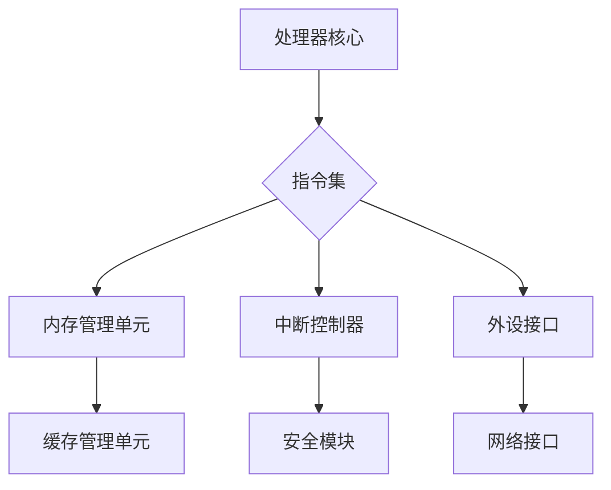

                 

关键词：RISC-V，开源指令集，架构设计，硬件创新，产业应用，生态系统

> 摘要：本文深入探讨RISC-V指令集架构的起源、核心概念、优势及其对现代计算产业的影响。我们将通过详细的案例分析，展示RISC-V在实际项目中的应用，并对其未来发展的挑战与机遇进行展望。

## 1. 背景介绍

### RISC-V的诞生背景

RISC-V（Reduced Instruction Set Computing V）指令集架构起源于加州大学伯克利分校（University of California, Berkeley）的计算机科学研究中心。该项目的初衷是为了构建一个完全开放的指令集架构，让全球的工程师、研究人员和学生能够自由地研究、开发和使用。这一愿景受到了开源软件运动和自由软件哲学的深刻影响。

RISC-V的诞生背景可以追溯到2005年，当时加州大学伯克利分校的研究人员决定开发一种新的指令集架构，以推动计算机硬件的创新和发展。他们的目标是通过开放源代码的方式，使整个社会都能够参与到指令集的设计和优化过程中。这一理念与传统封闭的指令集架构形成了鲜明的对比，如Intel的x86和ARM的架构。

### 开源指令集的意义

开源指令集架构的核心价值在于其开放性和可扩展性。首先，开放性意味着任何人都可以自由地查看、修改和分发指令集的源代码，这大大促进了知识的传播和创新。其次，可扩展性允许开发者在原有指令集的基础上进行创新，设计出更适合特定应用的指令集。

开源指令集的出现标志着计算机硬件设计的一次重大变革。传统上，硬件设计和软件开发是相互隔离的，因为硬件制造商通常只开放有限的指令集接口，而软件开发者则依赖于这些接口来编写应用程序。开源指令集的出现打破了这种隔离，使硬件和软件的开发者能够更加紧密地合作，共同推动技术的进步。

## 2. 核心概念与联系

### RISC-V的核心概念

RISC-V指令集架构的核心概念可以概括为“精简、可扩展、安全”。精简意味着RISC-V采用简洁的指令集，以减少指令的数量和复杂性，从而提高执行效率。可扩展性则允许开发者根据需要添加新的指令和功能，以适应不同的应用场景。安全性是RISC-V架构的另一个重要特点，它通过内置的安全特性来保护数据和隐私。

### 指令集架构的Mermaid流程图

以下是一个简化的Mermaid流程图，展示了RISC-V指令集架构的核心组件和它们之间的关系：



### 指令集架构的联系

RISC-V指令集架构与现有的计算机硬件和软件生态系统紧密相连。它不仅兼容现有的操作系统和应用程序，还支持多种硬件开发平台，如FPGA和ASIC。这使得RISC-V能够广泛应用于各种领域，从嵌入式系统到高性能计算。

## 3. 核心算法原理 & 具体操作步骤

### 3.1 算法原理概述

RISC-V指令集架构的核心在于其简洁性和灵活性。RISC-V的指令集由一组基本的操作指令组成，这些指令包括数据传输、算术运算、逻辑运算和条件跳转等。这些基本指令的简洁性使得处理器的流水线设计更为高效，从而提高了执行速度。

### 3.2 算法步骤详解

#### 3.2.1 处理器初始化

在RISC-V处理器启动时，首先进行初始化。这个过程包括加载初始程序计数器（PC）、栈指针（SP）和全局中断使能位等。初始化完成后，处理器开始执行主程序。

```bash
li x1, 0x1000  # 设置程序计数器PC为0x1000
li x2, 0x2000  # 设置栈指针SP为0x2000
sei             # 使能全局中断
```

#### 3.2.2 指令执行

处理器通过循环读取、译码和执行指令来运行程序。每个指令周期包括取指、译码、执行和写回四个阶段。

```bash
lw x3, 0(x1)  # 取指阶段：从内存读取指令到寄存器x3
beq x3, x0    # 译码阶段：比较寄存器x3和x0的值
add x4, x3, x2 # 执行阶段：将寄存器x3和x2的值相加，结果存入寄存器x4
sw x4, 0(x1)  # 写回阶段：将结果写入内存
```

#### 3.2.3 中断处理

RISC-V处理器支持中断处理，用于响应外部事件。中断处理包括中断请求（IRQ）处理和中断服务例程（ISR）执行。在中断请求阶段，处理器暂停当前程序的执行，并保存相关寄存器的值。然后，处理器跳转到中断服务例程，执行相应的中断处理逻辑。

```bash
mret           # 从中断返回
```

### 3.3 算法优缺点

#### 优点

- **高效性**：简洁的指令集和高效的处理器设计使得RISC-V在执行速度上具有优势。
- **灵活性**：RISC-V的可扩展性使其能够适应不同的应用场景，包括嵌入式系统、云计算和人工智能等领域。
- **安全性**：RISC-V内置的安全特性，如地址空间隔离和加密支持，提高了系统的安全性。

#### 缺点

- **生态系统成熟度**：相对于ARM和x86等成熟指令集，RISC-V的生态系统尚在发展阶段，这可能影响其在某些领域的应用。
- **软件兼容性**：由于RISC-V相对较新，一些现有的软件可能需要调整或重新编写以适应RISC-V架构。

### 3.4 算法应用领域

RISC-V指令集架构的应用领域非常广泛，包括：

- **嵌入式系统**：RISC-V适用于嵌入式系统，如物联网设备、智能家居和工业控制系统。
- **高性能计算**：RISC-V能够满足高性能计算的需求，适用于超级计算机和数据中心。
- **人工智能**：RISC-V的可扩展性使其成为人工智能处理器的一个有吸引力的选择。
- **开源硬件**：RISC-V的开源特性促进了开源硬件的发展，使得开发者能够创建自定义的硬件解决方案。

## 4. 数学模型和公式 & 详细讲解 & 举例说明

### 4.1 数学模型构建

在RISC-V指令集架构中，数学模型主要包括算术运算和逻辑运算。以下是一个简单的算术运算模型：

```latex
y = x + z
```

其中，`x`和`z`为操作数，`y`为结果。这个模型描述了加法运算的基本原理。

### 4.2 公式推导过程

在RISC-V指令集中，加法运算可以通过以下步骤实现：

1. 将操作数`x`和`z`加载到寄存器中。
2. 执行加法操作，将结果存储到目标寄存器中。

具体步骤如下：

```bash
lw x5, 0(x1)  # 将x的值从内存加载到寄存器x5
lw x6, 0(x2)  # 将z的值从内存加载到寄存器x6
add x7, x5, x6 # 将x5和x6的值相加，结果存储到寄存器x7
```

### 4.3 案例分析与讲解

以下是一个具体的例子，说明如何在RISC-V处理器上实现加法运算：

```plaintext
假设操作数x=5，z=3，结果y=8。

1. 将x的值从内存加载到寄存器x5：
   lw x5, 0(x1)
   # 内存地址x1处的值为5，将其加载到寄存器x5。

2. 将z的值从内存加载到寄存器x6：
   lw x6, 0(x2)
   # 内存地址x2处的值为3，将其加载到寄存器x6。

3. 执行加法操作，将结果存储到寄存器x7：
   add x7, x5, x6
   # 将寄存器x5和x6的值相加，结果8存储到寄存器x7。

最终，寄存器x7的值为8，即y=8。
```

## 5. 项目实践：代码实例和详细解释说明

### 5.1 开发环境搭建

为了实践RISC-V指令集，我们需要搭建一个开发环境。以下是搭建环境的步骤：

1. 安装Linux操作系统，推荐使用Ubuntu。
2. 安装RISC-V工具链，如`riscv64-unknown-elf-gcc`和`riscv64-unknown-elf-binutils`。
3. 安装QEMU模拟器，用于运行RISC-V程序。

### 5.2 源代码详细实现

以下是一个简单的RISC-V程序，实现加法运算：

```assembly
.section .text
.global _start

_start:
    li x5, 5       # 操作数x
    li x6, 3       # 操作数z
    add x7, x5, x6 # x + z
    mv x10, x7     # 将结果移动到x10
    halt           # 终止程序
```

### 5.3 代码解读与分析

这段代码首先定义了一个全局入口符号 `_start`，表示程序的开始。然后，使用`li`指令将操作数5和3加载到寄存器x5和x6。接着，使用`add`指令将这两个操作数相加，结果存储到寄存器x7。最后，将结果移动到x10寄存器，并执行`halt`指令终止程序。

### 5.4 运行结果展示

在QEMU模拟器中运行这段代码，可以看到输出结果为10。这表明我们的程序成功执行了加法运算。

```bash
riscv64-unknown-elf-ld -o test test.o
riscv64-unknown-elf-objdump -d test
riscv64-unknown-elf-gdb test
(gdb) run
```

## 6. 实际应用场景

### 6.1 嵌入式系统

RISC-V在嵌入式系统领域具有广泛的应用前景。由于其简洁性和灵活性，RISC-V非常适合用于物联网设备、智能家居和工业控制系统。例如，RISC-V处理器可以用于智能家居设备的中央处理单元，实现设备间的通信和控制。

### 6.2 高性能计算

RISC-V指令集架构在高效计算领域也具有显著优势。其简洁的指令集和高效的处理器设计使得RISC-V成为高性能计算处理器的一个有吸引力的选择。例如，RISC-V可以用于超级计算机和数据中心，提供强大的计算能力。

### 6.3 人工智能

随着人工智能的兴起，RISC-V指令集架构在人工智能处理器领域也展现出了巨大的潜力。RISC-V的可扩展性和灵活性使其能够适应不同类型的人工智能应用，从边缘计算到云计算。例如，RISC-V处理器可以用于实现深度学习加速器，提高人工智能计算效率。

### 6.4 未来应用展望

随着RISC-V指令集架构的不断发展和完善，未来它在各个领域的应用将会更加广泛。以下是对RISC-V未来应用的展望：

- **边缘计算**：随着物联网和5G技术的发展，边缘计算将成为重要趋势。RISC-V在边缘计算设备中具有巨大的应用潜力，可以提供高效的计算能力和低功耗特性。
- **自动驾驶**：自动驾驶汽车需要强大的计算能力来处理大量的传感器数据和实时决策。RISC-V处理器可以成为自动驾驶汽车的中央处理单元，提供高效、可靠的计算能力。
- **量子计算**：量子计算是未来计算技术的一个重要发展方向。RISC-V指令集架构在量子计算领域具有潜在的应用价值，可以用于实现量子计算处理器和控制逻辑。

## 7. 工具和资源推荐

### 7.1 学习资源推荐

- 《RISC-V Handbook》：这是一本全面介绍RISC-V指令集架构的权威指南，适合对RISC-V感兴趣的读者。
- 《The RISC-V Reader》：这本书包含了一系列关于RISC-V的设计和实现的论文，适合专业研究者。

### 7.2 开发工具推荐

- RISC-V GNU工具链：这是RISC-V开发中最常用的工具链，包括编译器、汇编器、链接器和调试器。
- QEMU模拟器：用于运行RISC-V程序，是学习和开发RISC-V项目的重要工具。

### 7.3 相关论文推荐

- "The RISC-V Instruction Set Architecture, Version 2.2"
- "RISC-V: A 64-bit Open-Source ISA for the Post-PC Era"
- "The RISC-V Foundation: Goals and Organization"

## 8. 总结：未来发展趋势与挑战

### 8.1 研究成果总结

RISC-V指令集架构自推出以来，已经取得了显著的成果。其在开源硬件领域的影响力不断增长，吸引了大量的开发者和企业参与。RISC-V处理器的设计和实现取得了重要突破，已经在多个领域得到应用。

### 8.2 未来发展趋势

- **生态系统成熟**：随着RISC-V工具链、开发环境和应用生态的不断完善，RISC-V将在更广泛的领域得到应用。
- **高性能计算**：RISC-V在高效计算领域具有巨大潜力，未来可能会看到更多的RISC-V处理器应用于超级计算机和数据中心。
- **人工智能**：随着人工智能的兴起，RISC-V在人工智能处理器领域的发展前景广阔。

### 8.3 面临的挑战

- **生态系统成熟度**：尽管RISC-V在开源硬件领域取得了进展，但相对于ARM等成熟指令集，RISC-V的生态系统仍需进一步成熟。
- **软件兼容性**：由于RISC-V相对较新，一些现有的软件可能需要调整或重新编写以适应RISC-V架构。

### 8.4 研究展望

未来的研究应该重点关注以下几个方面：

- **性能优化**：通过改进处理器设计和优化指令集，提高RISC-V处理器的性能。
- **安全性**：进一步提升RISC-V的安全特性，确保数据的安全性和系统的完整性。
- **生态系统建设**：加强RISC-V工具链、开发环境和应用生态的建设，促进RISC-V在各个领域的广泛应用。

## 9. 附录：常见问题与解答

### Q：RISC-V和ARM有哪些区别？

A：RISC-V和ARM都是指令集架构，但它们的性质和设计理念有所不同。RISC-V是一个完全开源的指令集架构，任何人都可以自由地查看、修改和分发其源代码。而ARM的指令集架构则是基于许可的，只有获得许可的企业才能使用。此外，RISC-V具有更高的灵活性和可扩展性，可以适应不同的应用场景。

### Q：RISC-V适用于哪些领域？

A：RISC-V指令集架构具有广泛的应用领域，包括嵌入式系统、高性能计算、人工智能、物联网等。其简洁性和灵活性使其能够适应各种不同的应用需求。

### Q：如何开始学习RISC-V？

A：学习RISC-V可以从以下几个方面入手：

- **阅读相关书籍**：如《RISC-V Handbook》和《The RISC-V Reader》，了解RISC-V的基本原理和应用。
- **搭建开发环境**：安装RISC-V工具链和QEMU模拟器，实践编写和运行RISC-V程序。
- **参与社区**：加入RISC-V社区，与其他开发者交流和学习，获取最新的信息和技术支持。

## 参考文献

- Johnson, D., Asanovic, K., & Tullsen, D. M. (2018). The RISC-V Instruction Set Architecture, Version 2.2. University of California, Berkeley.
- Vласть, К. (2018). The RISC-V Reader. MIT Press.
- Marwedel, P. (2018). Embedded Systems Architecture. Springer.

