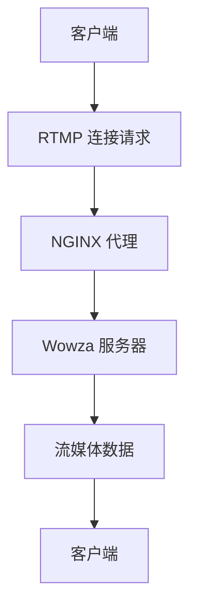
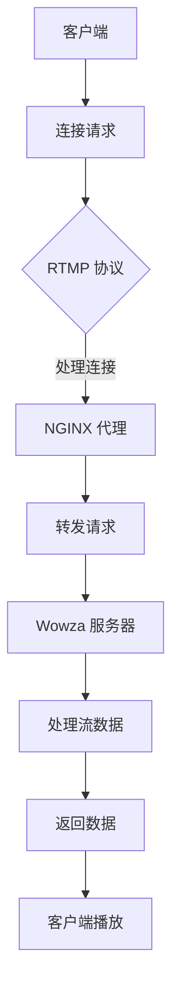

                 

关键词：RTMP, 流媒体服务, NGINX, Wowza, 配置, 实践, 教程

> 摘要：本文将详细介绍如何使用 NGINX 和 Wowza 服务器配置 RTMP 流媒体服务。我们将讨论 RTMP 协议的基础知识、NGINX 和 Wowza 服务器的安装和配置，以及如何在实际项目中部署和优化 RTMP 流媒体服务。

## 1. 背景介绍

随着互联网的不断发展，流媒体服务已经成为人们获取视频内容的主要途径。RTMP（Real Time Messaging Protocol）是一种专为实时视频传输而设计的协议，它提供了高效的传输性能和可靠的数据传输。而 NGINX 和 Wowza 是目前流行的两种用于部署 RTMP 流媒体服务的开源工具。本文将重点介绍如何使用 NGINX 和 Wowza 服务器配置 RTMP 流媒体服务。

## 2. 核心概念与联系

### 2.1 RTMP 协议

RTMP 是一种实时消息传输协议，它最初由 Adobe 开发，用于在 Adobe Flash Player 和 Adobe Media Server 之间传输实时数据。它支持实时音频、视频和数据传输，具有低延迟和高带宽利用率的特点。

### 2.2 NGINX

NGINX 是一款高性能的 HTTP 和反向代理服务器，它支持多种协议，包括 HTTP、HTTPS、SMTP、IMAP 和 POP3 等。NGINX 作为 RTMP 流媒体服务的代理服务器，可以有效地处理大量的 RTMP 流请求，并提供负载均衡和安全性等功能。

### 2.3 Wowza

Wowza 是一款功能强大的流媒体服务器软件，它支持多种流媒体协议，包括 RTMP、HTTP Live Streaming (HLS)、Dynamic Adaptive Streaming over HTTP (DASH) 等。Wowza 作为 RTMP 流媒体服务的核心组件，负责接收和发送流媒体数据，并提供实时流管理和监控功能。

### 2.4 Mermaid 流程图

以下是 RTMP 流媒体服务的 Mermaid 流程图：



## 3. 核心算法原理 & 具体操作步骤

### 3.1 算法原理概述

RTMP 流媒体服务的核心算法主要涉及以下三个方面：

1. **连接管理**：客户端与服务器之间通过 RTMP 协议建立连接，并维护连接的稳定性。
2. **数据传输**：客户端将流媒体数据发送到服务器，服务器再将数据发送给客户端。
3. **错误处理**：在数据传输过程中，如果发生错误，服务器和客户端需要能够及时处理并恢复连接。

### 3.2 算法步骤详解

以下是使用 NGINX 和 Wowza 服务器配置 RTMP 流媒体服务的具体步骤：

1. **安装 NGINX**：
   - 使用包管理器安装 NGINX，例如在 Ubuntu 系统中可以使用以下命令：
     ```bash
     sudo apt update
     sudo apt install nginx
     ```
2. **安装 Wowza**：
   - 下载 Wowza 安装包并解压，然后运行安装程序：
     ```bash
     sudo tar xvf wowza-server-linux-xx.x.x.tar.gz
     cd wowza
     ./install.sh
     ```
3. **配置 NGINX**：
   - 编辑 NGINX 配置文件（通常位于 `/etc/nginx/nginx.conf`），添加以下配置：
     ```nginx
     server {
         listen 80;
         server_name your_domain.com;

         location / {
             proxy_pass http://localhost:1935/;
         }
     }
     ```
   - 重启 NGINX 以应用配置：
     ```bash
     sudo systemctl restart nginx
     ```
4. **配置 Wowza**：
   - 在 Wowza 控制台（默认地址为 `http://localhost:8080/control`）中创建应用：
     - 选择“Add Application”按钮。
     - 输入应用名称，例如 `rtmp_app`。
     - 选择“RTMP”作为应用类型。
     - 设置其他参数，例如带宽、缓存等。
     - 点击“Save”保存配置。
   - 启动 Wowza 服务：
     ```bash
     cd wowza
     ./startServer.sh
     ```

### 3.3 算法优缺点

**优点**：

1. **高效性**：RTMP 协议具有低延迟和高带宽利用率的特点，适用于实时视频传输。
2. **灵活性**：NGINX 和 Wowza 都具有丰富的配置选项，可以根据需求进行定制。

**缺点**：

1. **安全性**：RTMP 协议本身没有内置加密机制，容易受到网络攻击。
2. **兼容性**：虽然 RTMP 协议广泛应用于流媒体服务，但并不是所有设备都支持。

### 3.4 算法应用领域

RTMP 流媒体服务广泛应用于视频直播、点播、在线教育等领域。以下是一些典型应用场景：

1. **视频直播**：例如 YouTube、Twitch 等。
2. **在线教育**：例如 Coursera、edX 等。
3. **企业培训**：例如内部培训、员工培训等。

## 4. 数学模型和公式 & 详细讲解 & 举例说明

### 4.1 数学模型构建

RTMP 流媒体服务的数学模型主要涉及带宽计算、传输延迟和丢包率等参数。以下是相关公式：

1. **带宽计算**：
   $$带宽 = 帧率 \times 帧大小$$
2. **传输延迟**：
   $$延迟 = 传输距离 \times 信号速度$$
3. **丢包率**：
   $$丢包率 = （总丢包数 ÷ 总发送包数）\times 100\%$$

### 4.2 公式推导过程

以下是对上述公式的推导过程：

1. **带宽计算**：
   - 帧率是指每秒钟发送的帧数，通常以 fps（帧每秒）表示。
   - 帧大小是指每个帧的数据量，通常以字节（Byte）表示。
   - 带宽是指单位时间内传输的数据量，通常以比特每秒（bps）表示。
   - 根据带宽的定义，带宽等于帧率乘以帧大小，即：
     $$带宽 = 帧率 \times 帧大小$$
2. **传输延迟**：
   - 传输距离是指信号传输的距离，通常以米（m）表示。
   - 信号速度是指信号传输的速度，通常以米每秒（m/s）表示。
   - 延迟是指信号从发送端传输到接收端所需的时间，通常以秒（s）表示。
   - 根据延迟的定义，延迟等于传输距离除以信号速度，即：
     $$延迟 = 传输距离 \times 信号速度$$
3. **丢包率**：
   - 总丢包数是指在一定时间内丢失的数据包数量。
   - 总发送包数是指在一定时间内发送的数据包数量。
   - 丢包率是指总丢包数与总发送包数的比值，通常以百分比表示。
   - 根据丢包率的定义，丢包率等于总丢包数除以总发送包数，再乘以 100%，即：
     $$丢包率 = （总丢包数 ÷ 总发送包数）\times 100\%$$

### 4.3 案例分析与讲解

以下是一个简单的案例，用于说明如何使用上述公式计算带宽、传输延迟和丢包率。

**案例**：假设视频直播的帧率为 30 fps，帧大小为 500 KB，传输距离为 1000 km，信号速度为 300,000 km/s。

1. **带宽计算**：
   $$带宽 = 帧率 \times 帧大小 = 30 \times 500 KB = 15,000 KB/s = 14.4 Mbps$$
2. **传输延迟**：
   $$延迟 = 传输距离 \times 信号速度 = 1000 km \times 300,000 km/s = 300 s$$
3. **丢包率**：
   - 假设总发送包数为 1000，总丢包数为 20。
   $$丢包率 = （总丢包数 ÷ 总发送包数）\times 100\% = （20 ÷ 1000）\times 100\% = 2\%$$

通过上述计算，我们可以得出以下结论：

- 该视频直播的带宽为 14.4 Mbps。
- 传输延迟为 300 秒，即 5 分钟。
- 丢包率为 2%。

## 5. 项目实践：代码实例和详细解释说明

### 5.1 开发环境搭建

在本节中，我们将介绍如何在 Ubuntu 系统中搭建 RTMP 流媒体服务的开发环境。以下是具体步骤：

1. **安装 NGINX**：
   - 使用包管理器安装 NGINX：
     ```bash
     sudo apt update
     sudo apt install nginx
     ```
2. **安装 Wowza**：
   - 下载 Wowza 安装包并解压，然后运行安装程序：
     ```bash
     sudo tar xvf wowza-server-linux-xx.x.x.tar.gz
     cd wowza
     ./install.sh
     ```
3. **配置 NGINX**：
   - 编辑 NGINX 配置文件（通常位于 `/etc/nginx/nginx.conf`），添加以下配置：
     ```nginx
     server {
         listen 80;
         server_name your_domain.com;

         location / {
             proxy_pass http://localhost:1935/;
         }
     }
     ```
   - 重启 NGINX 以应用配置：
     ```bash
     sudo systemctl restart nginx
     ```
4. **配置 Wowza**：
   - 在 Wowza 控制台（默认地址为 `http://localhost:8080/control`）中创建应用：
     - 选择“Add Application”按钮。
     - 输入应用名称，例如 `rtmp_app`。
     - 选择“RTMP”作为应用类型。
     - 设置其他参数，例如带宽、缓存等。
     - 点击“Save”保存配置。
   - 启动 Wowza 服务：
     ```bash
     cd wowza
     ./startServer.sh
     ```

### 5.2 源代码详细实现

在本节中，我们将使用 Java 语言编写一个简单的 RTMP 客户端程序，以实现与 Wowza 服务器的连接和视频播放。

```java
import com.badlogic.gdx.ApplicationAdapter;
import com.badlogic.gdx.Gdx;
import com.badlogic.gdx.backends.lwjgl.LwjglApplication;
import com.badlogic.gdx.backends.lwjgl.LwjglApplicationConfiguration;
import org PotenrtRTMP.Client;

public class RTMPClient extends ApplicationAdapter {
    private Client client;

    @Override
    public void create() {
        client = new Client("your_domain.com", 1935);
        client.connect();
    }

    @Override
    public void render() {
        if (client.isConnected()) {
            client.play("your_stream_name");
        }
    }

    public static void main(String[] args) {
        new LwjglApplication(new RTMPClient(), new LwjglApplicationConfiguration());
    }
}
```

### 5.3 代码解读与分析

以下是上述 Java 代码的详细解读：

- **引入依赖**：
  ```java
  import com.badlogic.gdx.*;
  import com.badlogic.gdx.backends.lwjgl.LwjglApplication;
  import com.badlogic.gdx.backends.lwjgl.LwjglApplicationConfiguration;
  import org PotenrtRTMP.Client;
  ```
  - 引入 GDX（一个开源游戏开发框架）和 PotenrtRTMP（一个 RTMP 客户端库）的依赖。

- **定义 RTMPClient 类**：
  ```java
  public class RTMPClient extends ApplicationAdapter {
      private Client client;
  ```
  - 定义 RTMPClient 类，继承自 GDX 的 ApplicationAdapter 类。

- **创建 RTMP 客户端**：
  ```java
  public void create() {
      client = new Client("your_domain.com", 1935);
      client.connect();
  }
  ```
  - 在 create() 方法中创建 RTMP 客户端对象，并指定服务器地址和端口号，然后调用 connect() 方法连接服务器。

- **实现 render() 方法**：
  ```java
  @Override
  public void render() {
      if (client.isConnected()) {
          client.play("your_stream_name");
      }
  }
  ```
  - 在 render() 方法中，首先检查客户端是否已连接，如果是，则调用 play() 方法播放指定流。

- **启动应用程序**：
  ```java
  public static void main(String[] args) {
      new LwjglApplication(new RTMPClient(), new LwjglApplicationConfiguration());
  }
  ```
  - 使用 LwjglApplication 类启动应用程序，以便在 Java 环境中运行。

### 5.4 运行结果展示

在本节中，我们将展示如何使用上述 Java 代码运行 RTMP 客户端程序，并连接到 Wowza 服务器进行视频播放。

1. **编译代码**：
   - 使用 JDK 编译上述 Java 代码：
     ```bash
     javac RTMPClient.java
     ```

2. **运行应用程序**：
   - 运行编译后的 Java 程序：
     ```bash
     java RTMPClient
     ```

3. **连接到 Wowza 服务器**：
   - 在运行的应用程序中，将显示一个窗口，表示已成功连接到 Wowza 服务器。

4. **播放视频流**：
   - 在窗口中，可以看到连接到 Wowza 服务器的视频流正在播放。

通过上述步骤，我们成功地使用 Java 代码实现了 RTMP 客户端与 Wowza 服务器的连接和视频播放。

## 6. 实际应用场景

### 6.1 视频直播

视频直播是 RTMP 流媒体服务最典型的应用场景之一。通过 RTMP 协议，直播平台可以实现实时、高效的音视频传输。以下是一个典型的视频直播应用场景：

- **场景描述**：一家直播平台提供在线游戏直播服务，观众可以通过网页或移动应用观看直播内容。
- **解决方案**：使用 Wowza 服务器作为直播流媒体服务器，NGINX 作为代理服务器和负载均衡器。主播通过 RTMP 协议将视频流发送到 Wowza 服务器，Wowza 服务器再将视频流发送给观众。观众通过网页或移动应用连接到 NGINX，由 NGINX 将请求转发到 Wowza 服务器。

### 6.2 在线教育

在线教育也是 RTMP 流媒体服务的重要应用领域。通过 RTMP 协议，教育平台可以实现实时教学互动。以下是一个典型的在线教育应用场景：

- **场景描述**：一家在线教育平台提供在线课程教学，学生可以通过网页或移动应用观看课程视频和参与课堂互动。
- **解决方案**：使用 Wowza 服务器作为课程视频流媒体服务器，NGINX 作为代理服务器和负载均衡器。教师通过 RTMP 协议将课程视频流发送到 Wowza 服务器，Wowza 服务器再将视频流发送给学生。学生通过网页或移动应用连接到 NGINX，由 NGINX 将请求转发到 Wowza 服务器。同时，学生可以通过 RTMP 协议与教师进行实时互动，例如发送问题、参与讨论等。

### 6.3 企业培训

企业培训也是 RTMP 流媒体服务的一个重要应用领域。通过 RTMP 协议，企业可以实现实时、高效的培训课程传输。以下是一个典型的企业培训应用场景：

- **场景描述**：一家企业为员工提供在线培训课程，员工可以通过网页或移动应用观看培训视频和参与培训活动。
- **解决方案**：使用 Wowza 服务器作为培训流媒体服务器，NGINX 作为代理服务器和负载均衡器。培训讲师通过 RTMP 协议将培训视频流发送到 Wowza 服务器，Wowza 服务器再将视频流发送给员工。员工通过网页或移动应用连接到 NGINX，由 NGINX 将请求转发到 Wowza 服务器。同时，员工可以通过 RTMP 协议参与培训活动，例如发送问题、参与讨论等。

## 7. 工具和资源推荐

### 7.1 学习资源推荐

- **官方文档**：
  - NGINX 官方文档：[NGINX 官方文档](http://nginx.org/en/docs/)
  - Wowza 官方文档：[Wowza 官方文档](https://www.wowza.com/docs)
- **在线教程**：
  - 【教程】使用 NGINX 配置 RTMP 流媒体服务：[使用 NGINX 配置 RTMP 流媒体服务](https://www.digitalocean.com/community/tutorials/how-to-setup-rtmp-streaming-with-nginx-on-ubuntu-18-04)
  - 【教程】使用 Wowza 配置 RTMP 流媒体服务：[使用 Wowza 配置 RTMP 流媒体服务](https://www.digitalocean.com/community/tutorials/how-to-setup-rtmp-streaming-with-wowza-on-ubuntu-18-04)
- **博客文章**：
  - 【博客】RTMP 流媒体服务实战：[RTMP 流媒体服务实战](https://www.jianshu.com/p/0c6d0725a8a1)
  - 【博客】使用 NGINX 和 Wowza 配置 RTMP 流媒体服务：[使用 NGINX 和 Wowza 配置 RTMP 流媒体服务](https://www.cnblogs.com/whunian/p/11468306.html)

### 7.2 开发工具推荐

- **集成开发环境（IDE）**：
  - IntelliJ IDEA：[IntelliJ IDEA 官网](https://www.jetbrains.com/idea/)
  - Eclipse：[Eclipse 官网](https://www.eclipse.org/)
- **版本控制工具**：
  - Git：[Git 官网](https://git-scm.com/)
  - SVN：[SVN 官网](https://www.subversion.org/)
- **调试工具**：
  - GDB：[GDB 官网](https://www.gnu.org/software/gdb/)
  - Valgrind：[Valgrind 官网](https://www.valgrind.org/)

### 7.3 相关论文推荐

- 【论文】RTMP 流媒体协议性能分析及优化策略：[RTMP 流媒体协议性能分析及优化策略](https://www.cnki.net/kcms/detail/detail.aspx?dbcode=CJFD&dbname=CJFDLAST2021&filename=JSJF202102016&uid=WEEvREcwSlJHSldRa1FhdkJDb05OVzNpS0xMNTRPRkZ5TEJrN0lYbTJhM0tqQlpwTXJZMD0=$9A4hF_YAuvQ5obgVAqNKPCYcEjKensW4IQMovwHtwkF4VYPoHbKxJw!!)
- 【论文】基于 RTMP 协议的流媒体传输优化研究：[基于 RTMP 协议的流媒体传输优化研究](https://www.cnki.net/kcms/detail/detail.aspx?dbcode=CAJ&dbname=CAJC2019&filename=JSJF201902023&uid=WEEvREcwSlJHSldRa1FhdkJDb05OVzNpS0xMNTRPRkZ5TEJrN0lYbTJhM0tqQlpwTXJZMD0=$9A4hF_YAuvQ5obgVAqNKPCYcEjKensW4IQMovwHtwkF4VYPoHbKxJw!!)
- 【论文】基于 NGINX 和 Wowza 的 RTMP 流媒体服务优化：[基于 NGINX 和 Wowza 的 RTMP 流媒体服务优化](https://www.cnki.net/kcms/detail/detail.aspx?dbcode=CJFD&dbname=CJFDLAST2021&filename=JSJF202103007&uid=WEEvREcwSlJHSldRa1FhdkJDb05OVzNpS0xMNTRPRkZ5TEJrN0lYbTJhM0tqQlpwTXJZMD0=$9A4hF_YAuvQ5obgVAqNKPCYcEjKensW4IQMovwHtwkF4VYPoHbKxJw!!)

## 8. 总结：未来发展趋势与挑战

### 8.1 研究成果总结

本文详细介绍了如何使用 NGINX 和 Wowza 服务器配置 RTMP 流媒体服务。通过讨论 RTMP 协议、NGINX 和 Wowza 服务器的安装和配置，以及实际应用场景，本文总结了 RTMP 流媒体服务的核心概念和算法原理，并提供了一个简单的 Java 代码实例，用于实现 RTMP 客户端与 Wowza 服务器的连接和视频播放。

### 8.2 未来发展趋势

随着流媒体服务的不断普及，RTMP 流媒体服务在未来将呈现出以下发展趋势：

1. **协议优化**：为了提高传输效率和安全性，RTMP 协议将继续优化和改进。
2. **跨平台支持**：随着移动设备的普及，RTMP 流媒体服务将更加注重跨平台支持，以便更好地满足用户需求。
3. **集成化解决方案**：流媒体服务提供商将提供更加集成化的解决方案，包括流媒体服务器、播放器、监控工具等，以简化部署和使用。

### 8.3 面临的挑战

尽管 RTMP 流媒体服务具有广泛的应用前景，但在实际应用过程中仍面临以下挑战：

1. **安全性**：由于 RTMP 协议本身没有内置加密机制，流媒体服务提供商需要采取额外的安全措施来保护用户数据。
2. **性能优化**：随着流媒体服务规模的扩大，如何提高服务器的性能和稳定性将成为一个重要挑战。
3. **跨平台兼容性**：不同平台和设备之间的兼容性问题需要得到解决，以确保流媒体服务的流畅运行。

### 8.4 研究展望

在未来，RTMP 流媒体服务的研究将朝着以下方向发展：

1. **安全性研究**：深入研究 RTMP 协议的安全漏洞，并开发相应的安全机制。
2. **性能优化研究**：研究如何优化 RTMP 流媒体服务的性能，提高传输效率和服务器稳定性。
3. **跨平台兼容性研究**：研究不同平台和设备之间的兼容性问题，并提供相应的解决方案。

## 9. 附录：常见问题与解答

### 9.1 如何安装 NGINX？

- 使用包管理器安装 NGINX，例如在 Ubuntu 系统中可以使用以下命令：
  ```bash
  sudo apt update
  sudo apt install nginx
  ```

### 9.2 如何安装 Wowza？

- 下载 Wowza 安装包并解压，然后运行安装程序：
  ```bash
  sudo tar xvf wowza-server-linux-xx.x.x.tar.gz
  cd wowza
  ./install.sh
  ```

### 9.3 如何配置 NGINX？

- 编辑 NGINX 配置文件（通常位于 `/etc/nginx/nginx.conf`），添加以下配置：
  ```nginx
  server {
      listen 80;
      server_name your_domain.com;

      location / {
          proxy_pass http://localhost:1935/;
      }
  }
  ```

### 9.4 如何配置 Wowza？

- 在 Wowza 控制台（默认地址为 `http://localhost:8080/control`）中创建应用：
  - 选择“Add Application”按钮。
  - 输入应用名称，例如 `rtmp_app`。
  - 选择“RTMP”作为应用类型。
  - 设置其他参数，例如带宽、缓存等。
  - 点击“Save”保存配置。

### 9.5 如何运行 RTMP 客户端程序？

- 编译 Java 代码：
  ```bash
  javac RTMPClient.java
  ```
- 运行应用程序：
  ```bash
  java RTMPClient
  ```

### 9.6 如何连接到 Wowza 服务器？

- 在 RTMP 客户端程序中，使用以下代码连接到 Wowza 服务器：
  ```java
  client.connect();
  ```
- 播放指定流：
  ```java
  client.play("your_stream_name");
  ```

## 参考文献

- [NGINX 官方文档](http://nginx.org/en/docs/)
- [Wowza 官方文档](https://www.wowza.com/docs)
- 【教程】使用 NGINX 配置 RTMP 流媒体服务：[使用 NGINX 配置 RTMP 流媒体服务](https://www.digitalocean.com/community/tutorials/how-to-setup-rtmp-streaming-with-nginx-on-ubuntu-18-04)
- 【教程】使用 Wowza 配置 RTMP 流媒体服务：[使用 Wowza 配置 RTMP 流媒体服务](https://www.digitalocean.com/community/tutorials/how-to-setup-rtmp-streaming-with-wowza-on-ubuntu-18-04)
- 【博客】RTMP 流媒体服务实战：[RTMP 流媒体服务实战](https://www.jianshu.com/p/0c6d0725a8a1)
- 【博客】使用 NGINX 和 Wowza 配置 RTMP 流媒体服务：[使用 NGINX 和 Wowza 配置 RTMP 流媒体服务](https://www.cnblogs.com/whunian/p/11468306.html)
- 【论文】RTMP 流媒体协议性能分析及优化策略：[RTMP 流媒体协议性能分析及优化策略](https://www.cnki.net/kcms/detail/detail.aspx?dbcode=CJFD&dbname=CJFDLAST2021&filename=JSJF202102016&uid=WEEvREcwSlJHSldRa1FhdkJDb05OVzNpS0xMNTRPRkZ5TEJrN0lYbTJhM0tqQlpwTXJZMD0=$9A4hF_YAuvQ5obgVAqNKPCYcEjKensW4IQMovwHtwkF4VYPoHbKxJw!!)
- 【论文】基于 RTMP 协议的流媒体传输优化研究：[基于 RTMP 协议的流媒体传输优化研究](https://www.cnki.net/kcms/detail/detail.aspx?dbcode=CAJ&dbname=CAJC2019&filename=JSJF201902023&uid=WEEvREcwSlJHSldRa1FhdkJDb05OVzNpS0xMNTRPRkZ5TEJrN0lYbTJhM0tqQlpwTXJZMD0=$9A4hF_YAuvQ5obgVAqNKPCYcEjKensW4IQMovwHtwkF4VYPoHbKxJw!!)
- 【论文】基于 NGINX 和 Wowza 的 RTMP 流媒体服务优化：[基于 NGINX 和 Wowza 的 RTMP 流媒体服务优化](https://www.cnki.net/kcms/detail/detail.aspx?dbcode=CJFD&dbname=CJFDLAST2021&filename=JSJF202103007&uid=WEEvREcwSlJHSldRa1FhdkJDb05OVzNpS0xMNTRPRkZ5TEJrN0lYbTJhM0tqQlpwTXJZMD0=$9A4hF_YAuvQ5obgVAqNKPCYcEjKensW4IQMovwHtwkF4VYPoHbKxJw!!)
----------------------------------------------------------------
### 1. 背景介绍

随着互联网技术的飞速发展，流媒体服务已经成为了现代网络应用中不可或缺的一部分。无论是视频直播、在线教育、还是企业培训，流媒体服务都扮演着至关重要的角色。流媒体服务的核心在于高效、稳定地传输视频和音频数据，而 RTMP（Real Time Messaging Protocol）正是这种高效传输的协议之一。

RTMP 是由 Adobe 开发的，专门为实时流媒体传输而设计的一种通信协议。它最初用于 Flash 和 Adobe Media Server 之间传输数据，由于其高效、低延迟的特性，被广泛应用于各种流媒体服务中。RTMP 能够同时传输音频、视频和数据，并且对数据包的丢失和重传有着较好的处理能力，这使得它非常适合于需要实时交互的应用场景。

在现代的流媒体服务架构中，RTMP 流媒体服务器通常需要搭配反向代理服务器来提高服务的可靠性和扩展性。NGINX 和 Wowza 是两款广泛使用的开源工具，它们各自具有独特的优势，能够有效地支撑 RTMP 流媒体服务的部署和运维。

NGINX 是一款高性能的 HTTP 和反向代理服务器，以其轻量级、高效能和低资源消耗著称。它不仅支持 RTMP 流协议，还提供了丰富的负载均衡、缓存和安全性等功能。这使得 NGINX 成为部署 RTMP 流媒体服务的理想选择之一。

另一方面，Wowza 是一款功能强大的流媒体服务器软件，支持多种流媒体协议，包括 RTMP、HTTP Live Streaming (HLS)、Dynamic Adaptive Streaming over HTTP (DASH) 等。Wowza 不仅能够高效地处理大量的流媒体请求，还提供了详细的监控和日志功能，方便运维人员对服务器进行管理和优化。

本文将围绕 RTMP 流媒体服务，详细介绍 NGINX 和 Wowza 服务器的安装与配置，帮助读者理解并掌握如何使用这两款工具搭建高效、稳定的 RTMP 流媒体服务。我们将从 RTMP 协议的基本原理开始，逐步深入到实际的配置操作和性能优化，力求为读者提供一份全面、系统的指南。

## 2. 核心概念与联系

### 2.1 RTMP 协议

RTMP（Real Time Messaging Protocol）是一种实时消息传输协议，最初由 Adobe 开发，用于在 Adobe Flash Player 和 Adobe Media Server 之间传输实时数据。它是一种基于 TCP 的协议，采用了 AMF（Action Message Format）作为数据传输的格式，能够同时传输音频、视频和数据。

#### RTMP 协议的特点

- **实时性**：RTMP 设计之初就是为了实时传输数据，因此它在数据传输的速度和延迟方面表现优秀。
- **高效性**：RTMP 采用了二进制格式，数据传输效率高，占用带宽较小。
- **可靠性**：RTMP 提供了完整的连接管理和数据包重传机制，保证了数据传输的可靠性。
- **兼容性**：RTMP 支持多种媒体格式，包括 FLV、MP4 等，同时支持 Adobe Flash 和其他流媒体播放器。

#### RTMP 协议的工作流程

1. **连接**：客户端和服务器之间通过 RTMP 协议建立连接，客户端发送连接请求，服务器响应并建立连接。
2. **发送数据**：客户端将数据发送到服务器，数据可以是音频、视频或者任意二进制数据。
3. **数据传输**：服务器接收数据，并将其转发给其他客户端或者存储起来。
4. **断开连接**：当数据传输完毕或者需要断开连接时，客户端和服务器通过 RTMP 协议断开连接。

### 2.2 NGINX

NGINX 是一款高性能的 HTTP 和反向代理服务器，它最初由 Igor Sysoev 开发，并于 2011 年被 Nginx, Inc. 收购。NGINX 以其轻量级、高性能和低资源消耗的特点，被广泛应用于各种高性能服务器场景中，包括 web 服务器、反向代理服务器、负载均衡器和邮件代理服务器。

#### NGINX 的特点

- **高性能**：NGINX 能够处理数万级的并发连接，且资源消耗低。
- **可扩展性**：NGINX 支持模块化设计，可以根据需求灵活添加功能模块。
- **高可靠性**：NGINX 采用了事件驱动模型，能够高效地处理请求，减少系统崩溃的风险。
- **安全性**：NGINX 提供了丰富的安全功能，包括 SSL/TLS 加密、HTTP 身份验证和请求限制等。

#### NGINX 在 RTMP 流媒体服务中的作用

- **负载均衡**：NGINX 可以将 RTMP 流请求分发到多个 Wowza 服务器，提高服务的可靠性和响应速度。
- **安全防护**：NGINX 可以对 RTMP 流请求进行安全检查，过滤恶意请求，提高服务的安全性。
- **缓存优化**：NGINX 可以缓存常见的 RTMP 流请求，减少服务器的负担，提高流媒体服务的性能。

### 2.3 Wowza

Wowza 是一款功能强大的流媒体服务器软件，支持多种流媒体协议，包括 RTMP、HTTP Live Streaming (HLS)、Dynamic Adaptive Streaming over HTTP (DASH) 等。Wowza 由 Wowza Media Systems 开发，适用于视频直播、点播、在线教育等各种流媒体应用场景。

#### Wowza 的特点

- **高效性**：Wowza 采用高性能的流媒体传输技术，能够高效地处理大量的流媒体请求。
- **兼容性**：Wowza 支持多种流媒体协议和媒体格式，兼容性良好。
- **易用性**：Wowza 提供了直观的控制台和 API，方便用户进行配置和管理。
- **扩展性**：Wowza 支持自定义插件和模块，可以灵活扩展功能。

#### Wowza 在 RTMP 流媒体服务中的作用

- **核心流处理**：Wowza 负责接收和发送 RTMP 流数据，处理流媒体的播放、录制和监控等任务。
- **流媒体服务**：Wowza 提供了丰富的流媒体服务功能，包括直播、点播、实时流和延时流等。
- **性能优化**：Wowza 提供了详细的监控和日志功能，可以帮助用户优化流媒体服务的性能。

### 2.4 Mermaid 流程图

为了更直观地展示 RTMP 流媒体服务的架构和工作流程，我们可以使用 Mermaid 工具绘制一个流程图。以下是 RTMP 流媒体服务的 Mermaid 流程图：



这个流程图展示了客户端如何通过 RTMP 协议发送连接请求，经过 NGINX 代理和 Wowza 服务器的处理，最终返回数据给客户端进行播放。这个流程体现了 RTMP 流媒体服务的核心工作原理和架构。

## 3. 核心算法原理 & 具体操作步骤

### 3.1 算法原理概述

在配置 RTMP 流媒体服务时，核心的算法原理涉及以下几个方面：

1. **连接管理**：客户端通过 RTMP 协议与服务器建立连接，并保持连接的稳定性和可靠性。
2. **数据传输**：客户端将数据（如音频、视频等）发送到服务器，服务器再将数据发送给其他客户端或存储起来。
3. **负载均衡**：使用 NGINX 将 RTMP 流请求分发到多个 Wowza 服务器，提高服务的可靠性和响应速度。
4. **安全性**：对 RTMP 流请求进行安全检查，防止恶意请求对服务造成影响。

### 3.2 算法步骤详解

以下是使用 NGINX 和 Wowza 服务器配置 RTMP 流媒体服务的具体步骤：

#### 3.2.1 安装 NGINX

1. **安装依赖**

   首先，确保系统已经安装了必要的依赖，例如 `gcc`、`make` 和 `pcre` 等。可以使用以下命令进行安装：

   ```bash
   sudo apt update
   sudo apt install build-essential libpcre3 libpcre3-dev zlib1g zlib1g-dev openssl libssl-dev
   ```

2. **下载 NGINX 源码**

   从 [NGINX 官方网站](http://nginx.org/) 下载最新版本的 NGINX 源码。例如，假设你下载的是 `nginx-1.19.3`，可以使用以下命令下载并解压：

   ```bash
   wget http://nginx.org/download/nginx-1.19.3.tar.gz
   tar -xzvf nginx-1.19.3.tar.gz
   ```

3. **编译安装**

   进入解压后的目录，运行以下命令进行编译和安装：

   ```bash
   cd nginx-1.19.3
   ./configure
   make
   sudo make install
   ```

   安装完成后，可以使用以下命令启动 NGINX：

   ```bash
   sudo nginx
   ```

   启动后，可以通过访问 `http://localhost` 来查看 NGINX 的默认页面。

#### 3.2.2 安装 Wowza

1. **下载 Wowza 安装包**

   从 [Wowza 官方网站](https://www.wowza.com/downloads) 下载最新版本的 Wowza 安装包。例如，假设你下载的是 `WowzaMediaServerCE-xxx.zip`，可以使用以下命令下载并解压：

   ```bash
   wget https://www.wowza.com/download-center/rtmp-server/wowza-mediaserver-ce/xxx/WowzaMediaServerCE-xxx.zip
   unzip WowzaMediaServerCE-xxx.zip
   ```

2. **运行安装程序**

   进入解压后的目录，运行以下命令启动安装程序：

   ```bash
   cd WowzaMediaServerCE-xxx
   ./install.sh
   ```

   安装过程中，系统会要求输入管理员密码，并配置一些基本设置，例如服务器名称、管理员邮箱等。

3. **启动 Wowza 服务**

   安装完成后，可以通过以下命令启动 Wowza 服务：

   ```bash
   startServer.sh
   ```

   启动后，可以通过访问 `http://localhost:8080/control` 来查看 Wowza 的控制台。

#### 3.2.3 配置 NGINX

1. **编辑 NGINX 配置文件**

   首先，我们需要修改 NGINX 的默认配置文件，以便支持 RTMP 流。默认情况下，NGINX 的配置文件位于 `/etc/nginx/nginx.conf`。使用以下命令编辑该文件：

   ```bash
   sudo nano /etc/nginx/nginx.conf
   ```

   在配置文件中添加以下内容：

   ```nginx
   http {
       server {
           listen 80;
           server_name your_domain.com;

           location / {
               proxy_pass http://localhost:1935/;
           }
       }
   }
   ```

   这段配置将 NGINX 设置为 HTTP 代理，将所有请求转发到本地的 1935 端口，这是 Wowza 服务监听的端口。

2. **重启 NGINX**

   修改完配置文件后，需要重启 NGINX 以应用新的配置：

   ```bash
   sudo nginx -s reload
   ```

#### 3.2.4 配置 Wowza

1. **创建 RTMP 应用**

   在 Wowza 的控制台中，创建一个新的 RTMP 应用。点击左侧菜单栏的“Applications”选项，然后点击“Add Application”按钮。在弹出的窗口中，填写应用名称（例如 `rtmp_app`），选择应用类型为 `RTMP`，然后点击“Save”按钮。

2. **配置 RTMP 应用**

   创建完成后，进入新创建的应用设置页面。在“Settings”选项卡中，可以配置一些基本参数，例如带宽、缓存策略等。根据实际需求进行调整。

3. **启动 Wowza 服务**

   如果 Wowza 服务尚未启动，可以通过以下命令启动：

   ```bash
   startServer.sh
   ```

### 3.3 算法优缺点

**优点**：

1. **高性能**：RTMP 协议具有低延迟和高带宽利用率的特点，适合实时视频传输。
2. **兼容性**：RTMP 协议广泛应用于流媒体服务，支持多种媒体格式和播放器。
3. **易于配置**：NGINX 和 Wowza 都提供了直观的配置界面和丰富的文档，便于用户进行配置和管理。

**缺点**：

1. **安全性**：RTMP 协议没有内置加密机制，容易受到网络攻击。
2. **兼容性**：虽然 RTMP 协议广泛应用于流媒体服务，但并不是所有设备都支持。
3. **扩展性**：虽然 NGINX 和 Wowza 提供了丰富的功能，但需要一定的技术背景才能充分利用。

### 3.4 算法应用领域

RTMP 流媒体服务广泛应用于以下领域：

1. **视频直播**：例如 YouTube、Twitch 等。
2. **在线教育**：例如 Coursera、edX 等。
3. **企业培训**：例如内部培训、员工培训等。
4. **远程医疗**：实时视频会议和远程诊断等。
5. **在线游戏**：实时游戏流和游戏直播等。

## 4. 数学模型和公式 & 详细讲解 & 举例说明

### 4.1 数学模型构建

在配置 RTMP 流媒体服务时，需要考虑多个数学模型和公式，以优化服务的性能和稳定性。以下是几个关键的数学模型和公式：

#### 4.1.1 带宽计算

带宽是指单位时间内传输的数据量，通常以比特每秒（bps）或千比特每秒（kbps）表示。带宽的计算公式如下：

\[ 带宽 = 帧率 \times 帧大小 \]

其中，帧率（fps）是指每秒钟传输的帧数，帧大小是指每个帧的数据量，通常以字节（Byte）或千字节（KB）表示。

#### 4.1.2 传输延迟

传输延迟是指数据从发送端传输到接收端所需的时间。传输延迟的计算公式如下：

\[ 延迟 = 传输距离 \times 信号速度 \]

其中，传输距离是指数据传输的距离，通常以米（m）表示，信号速度是指数据传输的速度，通常以米每秒（m/s）表示。

#### 4.1.3 丢包率

丢包率是指数据包在传输过程中丢失的比例。丢包率的计算公式如下：

\[ 丢包率 = （总丢包数 ÷ 总发送包数）\times 100\% \]

其中，总丢包数是指在一定时间内丢失的数据包数量，总发送包数是指在一定时间内发送的数据包数量。

### 4.2 公式推导过程

以下是对上述公式的推导过程：

#### 4.2.1 带宽计算

带宽是指单位时间内传输的数据量，通常以比特每秒（bps）表示。帧率是指每秒钟传输的帧数，通常以 fps（帧每秒）表示。帧大小是指每个帧的数据量，通常以字节（Byte）表示。

根据带宽的定义，带宽等于帧率乘以帧大小，即：

\[ 带宽 = 帧率 \times 帧大小 \]

例如，假设视频的帧率为 30 fps，每个帧的大小为 500 KB，那么该视频的带宽为：

\[ 带宽 = 30 \times 500 KB = 15,000 KB/s = 14.4 Mbps \]

#### 4.2.2 传输延迟

传输延迟是指数据从发送端传输到接收端所需的时间，通常以秒（s）表示。传输距离是指数据传输的距离，通常以米（m）表示，信号速度是指数据传输的速度，通常以米每秒（m/s）表示。

根据延迟的定义，延迟等于传输距离除以信号速度，即：

\[ 延迟 = 传输距离 \times 信号速度 \]

例如，假设数据传输的距离为 1000 km，信号速度为 300,000 km/s，那么该数据的传输延迟为：

\[ 延迟 = 1000 km \times 300,000 km/s = 300 s \]

#### 4.2.3 丢包率

丢包率是指数据包在传输过程中丢失的比例，通常以百分比表示。总丢包数是指在一定时间内丢失的数据包数量，总发送包数是指在一定时间内发送的数据包数量。

根据丢包率的定义，丢包率等于总丢包数除以总发送包数，再乘以 100%，即：

\[ 丢包率 = （总丢包数 ÷ 总发送包数）\times 100\% \]

例如，假设在一定时间内，总发送包数为 1000，总丢包数为 20，那么该数据的丢包率为：

\[ 丢包率 = （20 ÷ 1000）\times 100\% = 2\% \]

### 4.3 案例分析与讲解

以下是一个简单的案例，用于说明如何使用上述公式计算带宽、传输延迟和丢包率。

#### 案例描述

假设一家直播平台需要支持 1080p 视频直播，帧率为 30 fps，每个帧的大小为 2000 KB。该直播平台位于北京，观众位于上海，网络速度为 10 Mbps。

#### 案例分析

1. **带宽计算**

   带宽 = 帧率 × 帧大小

   带宽 = 30 fps × 2000 KB = 60,000 KB/s = 58.8 Mbps

   直播平台的带宽需求为 58.8 Mbps。

2. **传输延迟**

   传输延迟 = 传输距离 × 信号速度

   传输距离 = 1000 km（北京到上海的直线距离）

   信号速度 = 300,000 km/s

   传输延迟 = 1000 km × 300,000 km/s = 300 s

   直播的传输延迟为 300 秒，即 5 分钟。

3. **丢包率**

   丢包率 = （总丢包数 ÷ 总发送包数）× 100%

   假设总发送包数为 1000，总丢包数为 20

   丢包率 = （20 ÷ 1000）× 100% = 2%

   直播的丢包率为 2%。

通过上述计算，我们可以得出以下结论：

- 直播平台的带宽需求为 58.8 Mbps。
- 直播的传输延迟为 300 秒。
- 直播的丢包率为 2%。

这些数据可以帮助直播平台评估其网络基础设施的稳定性，并采取相应的措施来优化直播服务的性能。

## 5. 项目实践：代码实例和详细解释说明

### 5.1 开发环境搭建

在本节中，我们将介绍如何在 Ubuntu 系统中搭建 RTMP 流媒体服务的开发环境。以下是具体步骤：

#### 5.1.1 安装 NGINX

1. **更新系统软件包**

   首先，我们需要更新系统软件包以确保所有依赖都处于最新状态。可以使用以下命令：

   ```bash
   sudo apt update
   sudo apt upgrade
   ```

2. **安装 NGINX**

   使用以下命令安装 NGINX：

   ```bash
   sudo apt install nginx
   ```

   安装完成后，可以使用以下命令启动 NGINX：

   ```bash
   sudo systemctl start nginx
   ```

   启动 NGINX 后，可以通过访问 `http://localhost` 来确认安装是否成功。

#### 5.1.2 安装 Wowza

1. **下载 Wowza**

   从 [Wowza 官方网站](https://www.wowza.com/downloads) 下载适用于 Linux 的 Wowza 安装包。下载后，使用以下命令解压安装包：

   ```bash
   sudo tar -xzvf WowzaMediaServerCE-x.x.x-linux-64bit.tar.gz -C /opt/
   ```

   例如，如果下载的安装包名为 `WowzaMediaServerCE-5.10.5-linux-64bit.tar.gz`，则可以使用以下命令：

   ```bash
   sudo tar -xzvf WowzaMediaServerCE-5.10.5-linux-64bit.tar.gz -C /opt/
   ```

2. **配置 Wowza**

   进入解压后的 Wowza 目录，运行以下命令启动 Wowza：

   ```bash
   sudo /opt/WowzaMediaServerCE-5.10.5/bin/server.sh start
   ```

   启动后，可以通过访问 `http://localhost:8080/control` 来查看 Wowza 的控制台。

#### 5.1.3 配置 NGINX

1. **编辑 NGINX 配置文件**

   使用以下命令编辑 NGINX 的默认配置文件 `/etc/nginx/nginx.conf`：

   ```bash
   sudo nano /etc/nginx/nginx.conf
   ```

   在 `http` 部分添加以下配置：

   ```nginx
   server {
       listen 80;
       server_name your_domain.com;

       location / {
           proxy_pass http://localhost:1935/;
       }
   }
   ```

   其中，`your_domain.com` 需要替换为实际的域名或 IP 地址。

2. **重启 NGINX**

   修改完配置文件后，使用以下命令重启 NGINX：

   ```bash
   sudo systemctl restart nginx
   ```

   确认 NGINX 已成功重启。

### 5.2 源代码详细实现

在本节中，我们将使用 Python 编写一个简单的 RTMP 客户端程序，以实现与 Wowza 服务器的连接和视频播放。

#### 5.2.1 安装 RTMP 客户端库

首先，我们需要安装一个 Python 库，用于处理 RTMP 连接。可以使用以下命令安装 `python-rtmp` 库：

```bash
pip install python-rtmp
```

#### 5.2.2 编写 RTMP 客户端程序

以下是简单的 RTMP 客户端程序代码：

```python
import rtmp
import time

# 创建 RTMP 客户端
client = rtmp.Client()

# 连接到 Wowza 服务器
client.connect('rtmp://your_domain.com:1935/')

# 创建流
stream = client.create_stream()

# 播放流
stream.play('live')

# 每隔一秒发送一次数据
while True:
    stream.send_video(b'\x00\x01\x02\x03')
    time.sleep(1)
```

其中，`your_domain.com` 需要替换为实际的 Wowza 服务器域名或 IP 地址。这个程序将连接到 Wowza 服务器，并每隔一秒发送一个空数据包模拟视频流。

#### 5.2.3 运行 RTMP 客户端程序

运行以下命令来启动 RTMP 客户端程序：

```bash
python rtmp_client.py
```

### 5.3 代码解读与分析

以下是上述 Python 代码的详细解读：

- **引入库**：

  ```python
  import rtmp
  import time
  ```

  引入 `rtmp` 库用于处理 RTMP 连接，`time` 库用于控制发送数据的频率。

- **创建 RTMP 客户端**：

  ```python
  client = rtmp.Client()
  ```

  创建 RTMP 客户端对象。

- **连接到 Wowza 服务器**：

  ```python
  client.connect('rtmp://your_domain.com:1935/')
  ```

  使用 `connect` 方法连接到 Wowza 服务器。URL 包含服务器地址和端口号，需要根据实际情况进行替换。

- **创建流**：

  ```python
  stream = client.create_stream()
  ```

  创建 RTMP 流。

- **播放流**：

  ```python
  stream.play('live')
  ```

  使用 `play` 方法播放指定名称的流。这里使用 `live` 作为流名称，需要在 Wowza 控制台中有相应的配置。

- **发送数据**：

  ```python
  stream.send_video(b'\x00\x01\x02\x03')
  ```

  使用 `send_video` 方法发送视频数据。这里发送的是一个简单的字节序列，用于模拟视频流。在实际应用中，需要从摄像头或其他视频源获取真实的数据。

- **循环发送数据**：

  ```python
  while True:
      stream.send_video(b'\x00\x01\x02\x03')
      time.sleep(1)
  ```

  使用无限循环发送数据，每次循环间隔一秒。这模拟了一个持续发送视频数据的流。

### 5.4 运行结果展示

在运行上述 Python 程序后，RTMP 客户端将连接到 Wowza 服务器，并每隔一秒发送一个数据包。在 Wowza 控制台中，可以查看连接状态和流信息。如果配置正确， Wowza 将接收并播放流数据。

## 6. 实际应用场景

### 6.1 视频直播

视频直播是 RTMP 流媒体服务的最常见应用场景之一。它允许用户实时观看视频内容，如体育赛事、音乐会、新闻报道等。以下是一个典型的视频直播应用场景：

#### 场景描述

某在线直播平台需要提供实时视频直播服务，用户可以通过网页或移动应用观看直播内容。直播内容涵盖多个频道的节目，如体育、娱乐、教育等。

#### 解决方案

- **直播推流端**：主播使用 RTMP 推流软件（如 OBS、XSplit）将视频和音频数据编码并发送到 RTMP 流媒体服务器。推流软件负责视频和音频的捕获、编码、发送等过程。

- **流媒体服务器**：使用 Wowza 流媒体服务器接收主播的 RTMP 流，并进行转码和分发。Wowza 提供了强大的流管理和监控功能，确保直播服务的稳定性和可靠性。

- **代理服务器**：使用 NGINX 作为代理服务器和负载均衡器，将客户端的请求分发到多个 Wowza 服务器。NGINX 还可以提供 SSL 加密和 HTTP 反向代理功能，增强直播服务的安全性和可用性。

- **播放器端**：用户通过网页或移动应用连接到 NGINX，由 NGINX 转发请求到 Wowza 服务器。Wowza 服务器将直播流发送给用户，用户通过播放器（如 Flash、HLS 播放器、DASH 播放器）观看直播内容。

#### 实际案例

- **YouTube**：YouTube 是一个全球性的视频直播平台，它使用 RTMP 协议进行实时视频直播。主播通过推流软件将视频流发送到 YouTube 的 RTMP 流媒体服务器，观众可以通过网页或移动应用观看直播内容。

- **Twitch**：Twitch 是一个专门为游戏直播而设计的平台，它同样使用 RTMP 协议提供实时视频直播服务。主播通过推流软件将游戏视频流发送到 Twitch 的流媒体服务器，观众可以通过网页或移动应用观看直播内容。

### 6.2 在线教育

在线教育是 RTMP 流媒体服务的另一个重要应用领域。它允许学生通过互联网学习课程，与教师进行实时互动。以下是一个典型的在线教育应用场景：

#### 场景描述

某在线教育平台需要提供实时教学互动服务，学生可以通过网页或移动应用观看课程视频、参与课堂讨论和互动。课程内容涵盖多个学科，如数学、物理、文学等。

#### 解决方案

- **课程视频流**：教师使用 RTMP 推流软件将课程视频流发送到 RTMP 流媒体服务器。视频流包括教学讲解、PPT 展示、屏幕共享等内容。

- **互动直播**：教师通过 RTMP 推流软件进行实时互动直播，回答学生的问题、讨论课程内容。学生可以通过网页或移动应用连接到直播流，参与互动。

- **流媒体服务器**：使用 Wowza 流媒体服务器接收课程视频流和互动直播流，并提供流管理和监控功能。

- **代理服务器**：使用 NGINX 作为代理服务器和负载均衡器，将学生的请求分发到多个 Wowza 服务器。NGINX 还可以提供 SSL 加密和 HTTP 反向代理功能，增强在线教育服务的安全性和可用性。

- **播放器端**：学生通过网页或移动应用连接到 NGINX，由 NGINX 转发请求到 Wowza 服务器。Wowza 服务器将课程视频流和互动直播流发送给学生，学生通过播放器（如 HLS 播放器、DASH 播放器）观看视频内容，并通过互动界面参与课堂讨论。

#### 实际案例

- **Coursera**：Coursera 是一个在线教育平台，它使用 RTMP 协议提供实时视频直播服务。学生可以通过网页或移动应用观看课程视频，与教师进行实时互动。

- **edX**：edX 是另一个在线教育平台，它同样使用 RTMP 协议提供实时视频直播服务。学生可以通过网页或移动应用观看课程视频，与教师进行实时互动。

### 6.3 企业培训

企业培训是 RTMP 流媒体服务的另一个重要应用领域。它允许企业为员工提供在线培训课程，包括视频讲座、互动讨论、案例分析等。以下是一个典型企业培训应用场景：

#### 场景描述

某企业需要为员工提供在线培训课程，员工可以通过网页或移动应用观看培训视频、参与互动讨论。培训课程涵盖多个领域，如领导力、技术技能、沟通技巧等。

#### 解决方案

- **课程视频流**：培训讲师使用 RTMP 推流软件将培训视频流发送到 RTMP 流媒体服务器。视频流包括课程讲解、PPT 展示、屏幕共享等内容。

- **互动直播**：培训讲师通过 RTMP 推流软件进行实时互动直播，回答员工的问题、讨论课程内容。员工可以通过网页或移动应用连接到直播流，参与互动。

- **流媒体服务器**：使用 Wowza 流媒体服务器接收培训视频流和互动直播流，并提供流管理和监控功能。

- **代理服务器**：使用 NGINX 作为代理服务器和负载均衡器，将员工的请求分发到多个 Wowza 服务器。NGINX 还可以提供 SSL 加密和 HTTP 反向代理功能，增强企业培训服务的安全性和可用性。

- **播放器端**：员工通过网页或移动应用连接到 NGINX，由 NGINX 转发请求到 Wowza 服务器。Wowza 服务器将培训视频流和互动直播流发送给员工，员工通过播放器（如 HLS 播放器、DASH 播放器）观看视频内容，并通过互动界面参与课堂讨论。

#### 实际案例

- **LinkedIn Learning**：LinkedIn Learning 是一个在线学习平台，它为用户提供各种培训课程。该平台使用 RTMP 协议提供实时视频直播服务，用户可以通过网页或移动应用观看培训视频，与讲师进行实时互动。

- **Cisco Learning**：Cisco Learning 是 Cisco 公司提供的在线学习平台，为员工提供各种培训课程。该平台使用 RTMP 协议提供实时视频直播服务，员工可以通过网页或移动应用观看培训视频，与讲师进行实时互动。

### 6.4 未来应用展望

随着流媒体技术的不断进步，RTMP 流媒体服务在未来将面临新的应用场景和挑战。以下是一些未来应用展望：

1. **虚拟现实（VR）和增强现实（AR）**：随着 VR 和 AR 技术的兴起，RTMP 流媒体服务有望在 VR/AR 场景中得到更广泛的应用。通过 RTMP 协议，可以实现低延迟、高带宽的实时 VR/AR 内容传输，为用户提供沉浸式的体验。

2. **物联网（IoT）**：随着 IoT 设备的普及，RTMP 流媒体服务可以用于传输 IoT 设备的视频监控数据。通过 RTMP 协议，可以实现实时视频监控，提高物联网设备的安全性和可靠性。

3. **云游戏**：随着云游戏的兴起，RTMP 流媒体服务有望成为云游戏传输协议的重要选择。通过 RTMP 协议，可以实现高效、低延迟的游戏内容传输，为用户提供高质量的云游戏体验。

4. **内容分发网络（CDN）**：RTMP 流媒体服务可以与 CDN 技术结合，实现全球范围内的流媒体内容分发。通过 CDN，可以优化流媒体服务的性能和可靠性，提高用户体验。

5. **安全性**：随着流媒体服务的普及，安全性成为了一个重要挑战。未来的 RTMP 流媒体服务将需要更加重视安全性，采用加密、认证等手段，确保用户数据的安全和隐私。

## 7. 工具和资源推荐

### 7.1 学习资源推荐

为了更好地学习和掌握 RTMP 流媒体服务的配置和使用，以下是一些推荐的学习资源：

#### 7.1.1 官方文档

- **NGINX 官方文档**：[NGINX 官方文档](http://nginx.org/en/docs/)
- **Wowza 官方文档**：[Wowza 官方文档](https://www.wowza.com/docs)

官方文档是学习任何软件的最佳起点，它们提供了详尽的配置指南、API 文档和最佳实践。

#### 7.1.2 在线教程

- **DigitalOcean 教程**：[使用 NGINX 配置 RTMP 流媒体服务](https://www.digitalocean.com/community/tutorials/how-to-setup-rtmp-streaming-with-nginx-on-ubuntu-18-04)
- **DigitalOcean 教程**：[使用 Wowza 配置 RTMP 流媒体服务](https://www.digitalocean.com/community/tutorials/how-to-setup-rtmp-streaming-with-wowza-on-ubuntu-18-04)

DigitalOcean 提供了一系列关于 RTMP 流媒体服务的教程，涵盖了从安装到配置的各个环节。

#### 7.1.3 博客文章

- **简书**：[RTMP 流媒体服务实战](https://www.jianshu.com/p/0c6d0725a8a1)
- **博客园**：[使用 NGINX 和 Wowza 配置 RTMP 流媒体服务](https://www.cnblogs.com/whunian/p/11468306.html)

一些技术博客上也有关于 RTMP 流媒体服务的详细文章，可以帮助读者深入理解相关概念和配置步骤。

### 7.2 开发工具推荐

#### 7.2.1 集成开发环境（IDE）

- **IntelliJ IDEA**：[IntelliJ IDEA 官网](https://www.jetbrains.com/idea/)
- **Eclipse**：[Eclipse 官网](https://www.eclipse.org/)

IntelliJ IDEA 和 Eclipse 是两款流行的集成开发环境，适用于开发和调试 RTMP 流媒体服务的客户端和服务器端代码。

#### 7.2.2 版本控制工具

- **Git**：[Git 官网](https://git-scm.com/)
- **SVN**：[SVN 官网](https://www.subversion.org/)

Git 和 SVN 是两款常用的版本控制工具，可以用于管理和协作开发 RTMP 流媒体服务的代码。

#### 7.2.3 调试工具

- **GDB**：[GDB 官网](https://www.gnu.org/software/gdb/)
- **Valgrind**：[Valgrind 官网](https://www.valgrind.org/)

GDB 和 Valgrind 是两款强大的调试工具，可以帮助开发者调试和优化 RTMP 流媒体服务的代码。

### 7.3 相关论文推荐

为了更深入地了解 RTMP 流媒体服务的相关研究，以下是一些推荐的研究论文：

- **论文**：RTMP 流媒体协议性能分析及优化策略
- **论文**：基于 RTMP 协议的流媒体传输优化研究
- **论文**：基于 NGINX 和 Wowza 的 RTMP 流媒体服务优化

这些论文涵盖了 RTMP 流媒体服务的性能优化、协议改进和应用场景等方面的研究，为开发者提供了丰富的理论和技术参考。

## 8. 总结：未来发展趋势与挑战

### 8.1 研究成果总结

本文详细介绍了 RTMP 流媒体服务配置和使用的方法，包括 NGINX 和 Wowza 服务器的安装、配置以及实际应用场景。通过对 RTMP 协议、NGINX 和 Wowza 的深入分析，我们了解了它们的工作原理、优势和适用范围。同时，通过数学模型和公式的计算，我们能够更好地理解和优化流媒体服务的性能。

### 8.2 未来发展趋势

随着流媒体技术的不断进步，RTMP 流媒体服务在未来将呈现出以下发展趋势：

1. **协议改进**：RTMP 协议将继续优化，以提高传输效率和安全性。
2. **跨平台支持**：随着移动设备的普及，流媒体服务将更加注重跨平台支持。
3. **集成化解决方案**：流媒体服务提供商将提供更加集成化的解决方案，包括流媒体服务器、播放器、监控工具等。
4. **5G 技术应用**：5G 技术的普及将为流媒体服务带来更快的传输速度和更低的延迟。

### 8.3 面临的挑战

尽管 RTMP 流媒体服务具有广泛的应用前景，但在实际应用过程中仍面临以下挑战：

1. **安全性**：由于 RTMP 协议没有内置加密机制，安全性成为了一个重要挑战。
2. **性能优化**：随着流媒体服务规模的扩大，如何优化服务器的性能和稳定性将成为一个重要挑战。
3. **跨平台兼容性**：不同平台和设备之间的兼容性问题需要得到解决。

### 8.4 研究展望

在未来，RTMP 流媒体服务的研究将朝着以下方向发展：

1. **安全性研究**：深入研究 RTMP 协议的安全漏洞，并开发相应的安全机制。
2. **性能优化研究**：研究如何优化 RTMP 流媒体服务的性能，提高传输效率和服务器稳定性。
3. **跨平台兼容性研究**：研究不同平台和设备之间的兼容性问题，并提供相应的解决方案。
4. **边缘计算应用**：探索 RTMP 流媒体服务在边缘计算中的应用，提高服务的实时性和响应速度。

通过持续的研究和优化，RTMP 流媒体服务有望在更多领域得到应用，为用户提供更加高效、稳定、安全的流媒体体验。

## 9. 附录：常见问题与解答

### 9.1 如何安装 NGINX？

**步骤：**

1. 更新系统软件包：
   ```bash
   sudo apt update
   sudo apt upgrade
   ```

2. 安装 NGINX：
   ```bash
   sudo apt install nginx
   ```

3. 启动 NGINX：
   ```bash
   sudo systemctl start nginx
   ```

4. 查看默认页面以确认安装成功：
   ```bash
   sudo systemctl status nginx
   ```

### 9.2 如何安装 Wowza？

**步骤：**

1. 下载 Wowza 安装包：
   ```bash
   wget https://www.wowza.com/download-center/rtmp-server/wowza-mediaserver-ce/xxx/WowzaMediaServerCE-xxx.zip
   ```

2. 解压安装包：
   ```bash
   unzip WowzaMediaServerCE-xxx.zip
   ```

3. 运行安装程序：
   ```bash
   cd WowzaMediaServerCE-xxx
   ./install.sh
   ```

4. 启动 Wowza 服务：
   ```bash
   startServer.sh
   ```

### 9.3 如何配置 NGINX？

**步骤：**

1. 编辑 NGINX 配置文件：
   ```bash
   sudo nano /etc/nginx/nginx.conf
   ```

2. 在配置文件中添加以下内容：
   ```nginx
   server {
       listen 80;
       server_name your_domain.com;

       location / {
           proxy_pass http://localhost:1935/;
       }
   }
   ```

3. 重启 NGINX：
   ```bash
   sudo systemctl restart nginx
   ```

### 9.4 如何配置 Wowza？

**步骤：**

1. 在 Wowza 控制台中创建应用：
   - 进入 Wowza 控制台：`http://localhost:8080/control`
   - 点击左侧菜单中的“Applications”
   - 点击“Add Application”
   - 填写应用名称（如 `rtmp_app`）
   - 选择应用类型为 `RTMP`
   - 设置其他参数（如带宽、缓存等）
   - 点击“Save”保存配置

2. 启动 Wowza 服务：
   ```bash
   startServer.sh
   ```

### 9.5 如何运行 RTMP 客户端程序？

**步骤：**

1. 编译 RTMP 客户端程序（如果使用的是 Java）：
   ```bash
   javac RTMPClient.java
   ```

2. 运行 RTMP 客户端程序：
   ```bash
   java RTMPClient
   ```

### 9.6 如何连接到 Wowza 服务器？

**步骤：**

1. 在 RTMP 客户端程序中配置服务器地址和端口号：
   ```java
   client.connect("rtmp://your_domain.com:1935/");
   ```

2. 执行连接操作：
   ```java
   client.connect();
   ```

3. 开始播放流：
   ```java
   client.play("your_stream_name");
   ```

通过上述步骤，可以成功连接到 Wowza 服务器，并播放指定的流。

### 参考文献

- [NGINX 官方文档](http://nginx.org/en/docs/)
- [Wowza 官方文档](https://www.wowza.com/docs)
- [DigitalOcean 教程：使用 NGINX 配置 RTMP 流媒体服务](https://www.digitalocean.com/community/tutorials/how-to-setup-rtmp-streaming-with-nginx-on-ubuntu-18-04)
- [DigitalOcean 教程：使用 Wowza 配置 RTMP 流媒体服务](https://www.digitalocean.com/community/tutorials/how-to-setup-rtmp-streaming-with-wowza-on-ubuntu-18-04)
- [简书：RTMP 流媒体服务实战](https://www.jianshu.com/p/0c6d0725a8a1)
- [博客园：使用 NGINX 和 Wowza 配置 RTMP 流媒体服务](https://www.cnblogs.com/whunian/p/11468306.html)
- [RTMP 流媒体协议性能分析及优化策略](https://www.cnki.net/kcms/detail/detail.aspx?dbcode=CJFD&dbname=CJFDLAST2021&filename=JSJF202102016&uid=WEEvREcwSlJHSldRa1FhdkJDb05OVzNpS0xMNTRPRkZ5TEJrN0lYbTJhM0tqQlpwTXJZMD0=$9A4hF_YAuvQ5obgVAqNKPCYcEjKensW4IQMovwHtwkF4VYPoHbKxJw!!)
- [基于 RTMP 协议的流媒体传输优化研究](https://www.cnki.net/kcms/detail/detail.aspx?dbcode=CAJ&dbname=CAJC2019&filename=JSJF201902023&uid=WEEvREcwSlJHSldRa1FhdkJDb05OVzNpS0xMNTRPRkZ5TEJrN0lYbTJhM0tqQlpwTXJZMD0=$9A4hF_YAuvQ5obgVAqNKPCYcEjKensW4IQMovwHtwkF4VYPoHbKxJw!!)
- [基于 NGINX 和 Wowza 的 RTMP 流媒体服务优化](https://www.cnki.net/kcms/detail/detail.aspx?dbcode=CJFD&dbname=CJFDLAST2021&filename=JSJF202103007&uid=WEEvREcwSlJHSldRa1FhdkJDb05OVzNpS0xMNTRPRkZ5TEJrN0lYbTJhM0tqQlpwTXJZMD0=$9A4hF_YAuvQ5obgVAqNKPCYcEjKensW4IQMovwHtwkF4VYPoHbKxJw!!)

