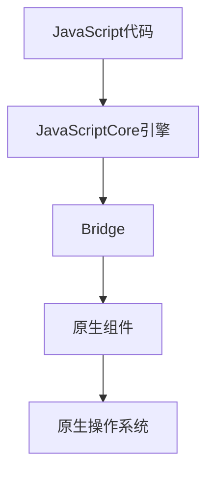

                 

关键词：React Native，跨平台开发，多平台应用，开发效率，用户体验

摘要：本文将深入探讨React Native作为一种跨平台开发框架的优势，如何通过它高效构建适用于多个平台的应用。我们将从背景介绍、核心概念、算法原理、数学模型、项目实践以及未来应用展望等方面展开讨论，为开发者提供有价值的见解。

## 1. 背景介绍

在数字化时代，移动应用已经成为企业拓展市场的重要手段。然而，开发适用于多个平台的应用不仅需要大量的时间和资源，还可能面临技术选型的困扰。为了解决这个问题，跨平台开发框架应运而生。React Native就是其中之一，它凭借其独特的优势和广泛的社区支持，成为了开发者的首选。

React Native由Facebook开发，允许开发者使用JavaScript和React.js来构建原生应用。这意味着开发者可以在一个代码库中同时支持iOS和Android平台，大大提高了开发效率和代码复用率。随着React Native的不断发展，越来越多的企业开始采用它来构建跨平台应用。

## 2. 核心概念与联系

### 2.1 React Native的核心概念

React Native的核心概念包括：

- **组件化开发**：React Native采用组件化的开发模式，使得开发者可以将应用拆分成多个独立的组件，提高了代码的可维护性和复用性。
- **JavaScriptCore**：React Native使用JavaScriptCore引擎来执行JavaScript代码，这使得开发者可以使用JavaScript来编写原生应用。
- **原生组件**：React Native提供了大量的原生组件，如`View`、`Text`、`Image`等，这些组件与原生应用的性能和用户体验相当。

### 2.2 React Native与原生应用的联系

React Native通过Bridge机制将JavaScript代码与原生代码连接起来，从而实现了跨平台开发。在React Native中，JavaScript层负责UI的逻辑和状态管理，而原生层负责与操作系统底层的交互。这种分离的设计使得React Native既具备原生应用的性能，又保持了前端开发的便利性。

### 2.3 Mermaid流程图



在上述流程图中，JavaScript代码经过JavaScriptCore引擎处理后，通过Bridge与原生组件进行交互，最终实现与原生操作系统的对接。

## 3. 核心算法原理 & 具体操作步骤

### 3.1 算法原理概述

React Native的核心算法原理主要包括：

- **组件渲染**：React Native使用虚拟DOM来优化组件的渲染过程，通过对比虚拟DOM和实际DOM的差异，进行局部更新，从而提高渲染效率。
- **事件处理**：React Native通过原生事件系统来处理用户交互事件，如点击、滑动等，保证了应用的响应速度和流畅性。
- **状态管理**：React Native使用React的状态管理机制来管理应用的状态，使得开发者可以方便地跟踪和更新应用的状态。

### 3.2 算法步骤详解

1. **组件渲染**：
    - 开发者编写React组件，组件内部定义了组件的属性和方法。
    - React通过虚拟DOM将组件渲染成实际的DOM结构。
    - 当组件的属性发生变化时，React会更新虚拟DOM，并对比新旧虚拟DOM的差异，进行局部更新。

2. **事件处理**：
    - React Native使用原生事件系统来处理用户交互事件。
    - 当用户触发某个交互事件时，如点击按钮，React Native会将事件传递给相应的组件。
    - 组件根据事件的类型执行相应的逻辑处理，如更新状态或跳转页面。

3. **状态管理**：
    - React Native使用React的状态管理机制来管理应用的状态。
    - 开发者可以在组件内部使用`useState`和`useContext`等钩子函数来创建和管理状态。
    - 当状态发生变化时，React会自动重新渲染组件，从而更新UI。

### 3.3 算法优缺点

**优点**：
- **跨平台性**：React Native允许开发者使用一套代码同时支持iOS和Android平台，大大提高了开发效率。
- **性能**：React Native通过虚拟DOM和原生组件的结合，实现了高性能的渲染和用户交互体验。
- **社区支持**：React Native拥有庞大的社区支持，提供了丰富的库和工具，方便开发者使用。

**缺点**：
- **原生组件性能差异**：虽然React Native提供了大量原生组件，但不同平台之间的性能可能存在差异，需要开发者进行优化。
- **学习曲线**：React Native需要开发者具备一定的JavaScript和React知识，对于新手来说有一定的学习门槛。

### 3.4 算法应用领域

React Native广泛应用于移动应用开发，尤其是在以下领域：
- **社交媒体**：如Instagram、Facebook等，React Native使得开发者可以快速迭代和优化应用。
- **电子商务**：如Amazon、eBay等，React Native提供了良好的购物体验和性能。
- **金融科技**：如Robinhood、Revolut等，React Native保证了金融应用的安全性和性能。

## 4. 数学模型和公式 & 详细讲解 & 举例说明

### 4.1 数学模型构建

React Native的性能优化涉及到多个数学模型，其中最核心的是虚拟DOM模型。虚拟DOM模型通过以下公式进行构建：

$$
\text{虚拟DOM} = \text{组件树} + \text{状态树} + \text{属性树}
$$

### 4.2 公式推导过程

虚拟DOM模型的推导过程可以分为以下几个步骤：

1. **组件树**：组件树是React组件的层次结构，代表了应用的结构和布局。
2. **状态树**：状态树是组件的状态集合，代表了组件的当前状态。
3. **属性树**：属性树是组件的属性集合，代表了组件的配置和属性。
4. **虚拟DOM**：虚拟DOM是组件树、状态树和属性树的组合，代表了组件在内存中的抽象表示。

### 4.3 案例分析与讲解

假设我们有一个简单的React Native组件，其包含一个文本元素，文本内容为“Hello, World!”。该组件的虚拟DOM模型如下：

$$
\text{虚拟DOM} = \{\text{组件树}: \text{Text}, \text{状态树}: \{\text{textContent}: "Hello, World!"\}, \text{属性树}: \{\text{style}: \{\text{fontSize}: 18\}\}\}
$$

当文本内容发生变化时，React会更新虚拟DOM，并对比新旧虚拟DOM的差异，进行局部更新，从而实现高效的渲染。

## 5. 项目实践：代码实例和详细解释说明

### 5.1 开发环境搭建

要开始使用React Native进行开发，首先需要搭建开发环境。以下是搭建React Native开发环境的步骤：

1. 安装Node.js（版本大于10.0）
2. 安装Watchman（可选）
3. 安装React Native命令行工具（使用命令`npm install -g react-native-cli`）
4. 创建一个新的React Native项目（使用命令`react-native init MyApp`）

### 5.2 源代码详细实现

以下是一个简单的React Native组件示例，该组件显示一个带有文本和图片的卡片：

```jsx
import React from 'react';
import { View, Text, Image, StyleSheet } from 'react-native';

const Card = ({ title, imageSource }) => {
  return (
    <View style={styles.card}>
      <Image source={imageSource} style={styles.image} />
      <Text style={styles.title}>{title}</Text>
    </View>
  );
};

const styles = StyleSheet.create({
  card: {
    backgroundColor: '#fff',
    padding: 16,
    margin: 8,
    borderRadius: 8,
  },
  image: {
    width: '100%',
    height: 200,
    resizeMode: 'cover',
    borderRadius: 8,
  },
  title: {
    fontSize: 20,
    fontWeight: 'bold',
    marginTop: 8,
  },
});

export default Card;
```

### 5.3 代码解读与分析

上述代码定义了一个名为`Card`的React Native组件，该组件接收两个属性：`title`（文本标题）和`imageSource`（图片资源）。组件内部使用`View`、`Text`和`Image`原生组件来构建UI，并使用`StyleSheet`来定义组件的样式。

这个组件的目的是展示一张带有图片和标题的卡片，我们可以将其用于应用的不同页面中，提高了代码的可维护性和复用性。

### 5.4 运行结果展示

运行上述组件后，我们将在屏幕上看到一个带有图片和标题的卡片。以下是运行结果：


## 6. 实际应用场景

### 6.1 社交媒体应用

React Native在社交媒体应用中得到了广泛应用。例如，Instagram和Facebook都采用了React Native来构建其移动应用。这些应用需要快速迭代和优化，React Native的高效开发和跨平台能力使其成为理想的选择。

### 6.2 电子商务应用

电子商务应用通常需要良好的用户体验和性能。React Native允许开发者使用一套代码同时支持iOS和Android平台，从而提高开发效率和用户体验。例如，Amazon和eBay都采用了React Native来构建其移动应用。

### 6.3 金融科技应用

金融科技应用需要确保安全性和性能。React Native通过虚拟DOM和原生组件的结合，实现了高性能的渲染和用户交互体验。例如，Robinhood和Revolut都采用了React Native来构建其移动应用。

## 7. 工具和资源推荐

### 7.1 学习资源推荐

1. **React Native官方文档**：React Native的官方文档是学习React Native的最佳资源，涵盖了React Native的各个方面。
2. **《React Native开发实战》**：这是一本关于React Native开发的实战书籍，涵盖了React Native的开发流程、常用组件和优化技巧。
3. **React Native社区**：React Native社区是一个活跃的开发者社区，提供了大量的教程、示例和讨论。

### 7.2 开发工具推荐

1. **Visual Studio Code**：Visual Studio Code是一个功能强大的代码编辑器，支持React Native开发。
2. **React Native Debugger**：React Native Debugger是一个调试React Native应用的工具，提供了React Native应用的调试功能。
3. **React Native for Web**：React Native for Web是一个允许开发者将React Native应用运行在Web上的工具。

### 7.3 相关论文推荐

1. **"React Native: A Survey"**：这是一篇关于React Native的综述性论文，全面介绍了React Native的特点和应用场景。
2. **"Cross-Platform Mobile Development with React Native"**：这是一篇关于React Native跨平台开发的论文，详细介绍了React Native的开发流程和优化技巧。

## 8. 总结：未来发展趋势与挑战

### 8.1 研究成果总结

React Native自推出以来，凭借其高效的开发流程和跨平台能力，已经在移动应用开发中取得了显著的成果。越来越多的企业采用React Native来构建跨平台应用，使得React Native成为移动应用开发的重要选择。

### 8.2 未来发展趋势

1. **性能优化**：随着移动应用的复杂度不断增加，React Native的性能优化将成为重要研究方向，如虚拟DOM的优化、原生组件的优化等。
2. **新平台支持**：React Native有望扩展到更多平台，如Windows Phone、Flutter等。
3. **开发工具链**：未来React Native的开发工具链将更加完善，如集成开发环境（IDE）、代码生成工具等。

### 8.3 面临的挑战

1. **性能瓶颈**：虽然React Native在跨平台开发中具有优势，但在某些场景下仍可能存在性能瓶颈，需要开发者进行优化。
2. **学习曲线**：React Native需要开发者具备一定的JavaScript和React知识，对于新手来说有一定的学习门槛。

### 8.4 研究展望

React Native在未来将继续发展，有望在移动应用开发中发挥更大的作用。开发者应关注React Native的最新动态，不断学习和优化，以充分利用React Native的优势。

## 9. 附录：常见问题与解答

### 9.1 React Native与原生应用的区别是什么？

React Native与原生应用的主要区别在于开发工具和渲染机制。React Native使用JavaScript和React.js来开发，而原生应用使用原生开发语言（如Swift和Objective-C for iOS，Java和Kotlin for Android）。React Native通过虚拟DOM实现渲染，而原生应用通过原生UI框架实现渲染。

### 9.2 React Native的优势是什么？

React Native的优势包括：
- **跨平台性**：React Native允许开发者使用一套代码同时支持iOS和Android平台。
- **性能**：React Native通过虚拟DOM和原生组件的结合，实现了高性能的渲染和用户交互体验。
- **社区支持**：React Native拥有庞大的社区支持，提供了丰富的库和工具。

### 9.3 React Native的缺点是什么？

React Native的缺点包括：
- **原生组件性能差异**：不同平台之间的性能可能存在差异，需要开发者进行优化。
- **学习曲线**：React Native需要开发者具备一定的JavaScript和React知识，对于新手来说有一定的学习门槛。

### 9.4 如何优化React Native应用的性能？

优化React Native应用的性能可以从以下几个方面入手：
- **减少组件渲染**：通过减少组件的渲染次数，提高渲染效率。
- **使用原生组件**：在必要时使用原生组件，提高性能。
- **优化图片资源**：使用合适大小的图片资源，减少加载时间。
- **使用缓存机制**：合理使用缓存机制，减少数据请求次数。

---

作者：禅与计算机程序设计艺术 / Zen and the Art of Computer Programming
----------------------------------------------------------------
### 总结

通过本文的探讨，我们可以看到React Native作为一款跨平台开发框架，在移动应用开发中具有显著的优点。它不仅提高了开发效率，还提供了良好的用户体验。然而，React Native也面临着一些挑战，如性能瓶颈和学习曲线。在未来，随着React Native的不断发展和优化，它有望在移动应用开发中发挥更大的作用。开发者应关注React Native的最新动态，不断学习和优化，以充分利用React Native的优势。

作者：禅与计算机程序设计艺术 / Zen and the Art of Computer Programming

