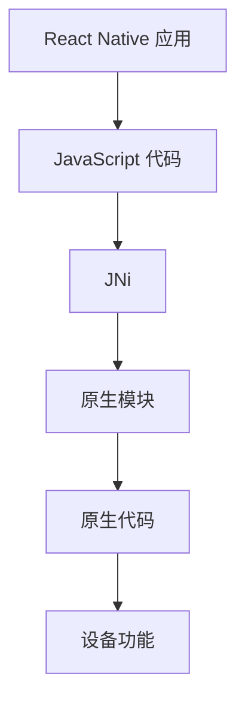

                 

在移动应用开发领域，React Native（简称RN）凭借其“写一次代码，运行在两个平台”的强大功能，已经成为开发者们钟爱的工具之一。然而，随着项目的复杂度和功能需求的不断增加，原生模块（Native Modules）的开发变得尤为重要。原生模块允许开发者利用原生代码（如Java、Objective-C或Swift）来扩展React Native应用的性能和功能。本文将深入探讨React Native原生模块的开发，帮助开发者更好地理解和应用这一技术。

## 文章关键词
React Native、原生模块、JavaScript、Objective-C、Swift、跨平台、移动应用开发、性能优化、功能扩展

## 文章摘要
本文旨在介绍React Native原生模块的开发方法、核心概念和实际应用。通过详细的步骤讲解、代码实例和数学模型分析，读者将能够掌握原生模块开发的技巧，并能够在实际项目中有效地运用。文章还将探讨原生模块的优势、缺点及其应用领域，为开发者提供全面的指导。

## 1. 背景介绍

### React Native概述
React Native是由Facebook推出的一种用于开发移动应用的前端框架。它允许开发者使用JavaScript编写应用代码，并在iOS和Android平台上运行。React Native的核心理念是组件化和虚拟DOM，这使得开发过程更加模块化和高效。

### 原生模块的定义
原生模块是一种允许React Native应用调用原生代码的API。通过原生模块，开发者可以访问设备特定的功能，如相机、GPS、传感器等，同时也可以提高应用的性能。

### React Native的发展趋势
随着移动设备的普及和性能的提升，React Native在移动应用开发中的地位日益重要。越来越多的开发者选择使用React Native，以实现高效和高质量的移动应用开发。

## 2. 核心概念与联系

### 原生模块的核心概念
原生模块主要涉及以下核心概念：
- JavaScript Native Interface (JNi)：React Native通过JNi与原生代码进行交互。
- Module：模块是React Native应用中的最小功能单元，每个模块都可以独立开发和测试。
- Method：模块中的方法用于实现具体的业务逻辑。

### React Native与原生模块的联系

下面是一个Mermaid流程图，展示了React Native与原生模块之间的交互流程：



### 原生模块开发的优势
原生模块开发具有以下优势：
- 性能：原生模块可以提供更高的性能，特别是在需要频繁与设备硬件交互的场景中。
- 功能：原生模块可以访问设备特定的功能，如相机、GPS、传感器等，这是纯Web应用无法实现的。

## 3. 核心算法原理 & 具体操作步骤

### 3.1 算法原理概述
原生模块的开发主要基于JNi和原生代码。开发者需要使用JavaScript调用原生模块的方法，然后通过原生代码实现具体的业务逻辑。

### 3.2 算法步骤详解
原生模块的开发可以分为以下几个步骤：

#### 步骤1：创建原生模块
首先，开发者需要在原生平台上创建一个模块。以Android为例，开发者需要创建一个Java类，并实现对应的接口。

```java
package com.example.reactnativeapp;

import com.facebook.react.bridge.ReactApplicationContext;
import com.facebook.react.bridge.ReactContextBaseJavaModule;
import com.facebook.react.bridge.ReactMethod;

public class MyNativeModule extends ReactContextBaseJavaModule {

    public MyNativeModule(ReactApplicationContext reactContext) {
        super(reactContext);
    }

    @Override
    public String getName() {
        return "MyNativeModule";
    }

    @ReactMethod
    public void performAction() {
        // 原生代码实现
    }
}
```

#### 步骤2：集成原生模块
接着，开发者需要在React Native项目中集成原生模块。以Android为例，开发者需要在`build.gradle`文件中添加依赖，并在`AndroidManifest.xml`中注册模块。

```groovy
dependencies {
    implementation 'com.facebook.react:react-native:+'
    implementation project(':my_native_module')
}

<application>
    <meta-data
        android:name="io.reactnative.imageslider.reactmodules"
        android:value="MyNativeModule" />
</application>
```

#### 步骤3：调用原生模块
在React Native应用中，开发者可以使用JavaScript调用原生模块的方法。

```javascript
import { NativeModules } from 'react-native';
const { MyNativeModule } = NativeModules;

MyNativeModule.performAction();
```

### 3.3 算法优缺点
原生模块具有以下优缺点：

#### 优点
- 性能：原生模块可以提供更高的性能，特别是在需要频繁与设备硬件交互的场景中。
- 功能：原生模块可以访问设备特定的功能，如相机、GPS、传感器等，这是纯Web应用无法实现的。

#### 缺点
- 学习成本：原生模块的开发需要开发者具备一定的原生开发经验。
- 代码维护：原生模块的代码维护相对复杂，需要同时维护JavaScript和原生代码。

### 3.4 算法应用领域
原生模块主要应用于以下领域：
- 移动应用性能优化
- 设备特定功能访问
- 复杂交互操作

## 4. 数学模型和公式

### 4.1 数学模型构建
原生模块的性能主要受到以下几个因素的影响：

- JavaScript线程与原生线程之间的通信开销
- 原生代码的执行效率
- JavaScript与原生代码的调用次数

### 4.2 公式推导过程
设 \( T \) 为原生模块的执行时间，\( T_1 \) 为JavaScript与原生模块的通信时间，\( T_2 \) 为原生代码的执行时间，\( T_3 \) 为JavaScript与原生模块的调用次数。

则 \( T = T_1 + T_2 + T_3 \)。

为了提高原生模块的性能，我们需要优化以下几个因素：

- 减少通信次数：尽可能减少JavaScript与原生模块的调用次数。
- 提高通信效率：优化JavaScript与原生模块的通信方式，如使用异步通信。
- 提高原生代码执行效率：优化原生代码的编写，如使用高效的数据结构和算法。

### 4.3 案例分析与讲解
以一个相机模块为例，我们可以分析其性能优化方法。

#### 4.3.1 减少通信次数
- 使用单例模式：将相机模块设计为单例，避免频繁创建和销毁相机实例。

#### 4.3.2 提高通信效率
- 使用异步通信：使用Promise或async/await语法实现异步通信，减少JavaScript线程的阻塞。

#### 4.3.3 提高原生代码执行效率
- 使用高效的数据结构：如使用ArrayList代替Array，提高数据访问速度。
- 优化算法：如使用快速排序代替冒泡排序，提高数据处理效率。

## 5. 项目实践：代码实例和详细解释说明

### 5.1 开发环境搭建
在开始原生模块开发之前，我们需要搭建合适的开发环境。以Android为例，开发者需要安装Android Studio，并配置React Native开发环境。

### 5.2 源代码详细实现
以下是一个简单的React Native原生模块示例：

#### Android部分
- 创建一个Java类，如`MyNativeModule.java`。

#### JavaScript部分
- 引入`NativeModules`。

```javascript
import { NativeModules } from 'react-native';
const { MyNativeModule } = NativeModules;
```

- 调用原生模块方法。

```javascript
MyNativeModule.performAction();
```

### 5.3 代码解读与分析
在Android部分，我们创建了一个名为`MyNativeModule`的Java类，继承自`ReactContextBaseJavaModule`，并实现了`performAction`方法。在JavaScript部分，我们引入了`NativeModules`，并调用了`MyNativeModule`的`performAction`方法。

### 5.4 运行结果展示
在成功搭建开发环境和编写代码后，我们可以在React Native应用中调用原生模块，并观察到相应的运行结果。

## 6. 实际应用场景

原生模块在实际应用中具有广泛的应用场景，如：

- 移动应用性能优化：如游戏应用中的图形渲染和音效处理。
- 设备特定功能访问：如相机、GPS、传感器等。
- 复杂交互操作：如地图应用中的地图渲染和用户交互。

## 7. 工具和资源推荐

### 7.1 学习资源推荐
- 《React Native实战》
- 《React Native核心技术与案例分析》
- React Native官方文档

### 7.2 开发工具推荐
- Android Studio
- Xcode
- React Native Debugger

### 7.3 相关论文推荐
- "React Native Performance Optimization"
- "Native Modules in React Native"
- "Efficient Communication between JavaScript and Native Code"

## 8. 总结：未来发展趋势与挑战

### 8.1 研究成果总结
React Native原生模块开发已经成为移动应用开发的重要技术之一，其性能和功能扩展能力得到了广泛认可。

### 8.2 未来发展趋势
随着移动设备的性能提升和React Native框架的不断更新，原生模块的应用场景和性能将得到进一步优化。

### 8.3 面临的挑战
原生模块的开发和维护成本较高，开发者需要具备一定的原生开发经验。此外，React Native与原生模块之间的通信开销也需要进一步优化。

### 8.4 研究展望
未来，React Native原生模块的开发将更加高效和易用，开发者可以通过更少的代码实现更多的功能，从而提高开发效率和应用性能。

## 9. 附录：常见问题与解答

### 9.1 原生模块与Web模块的区别
原生模块可以访问设备特定的功能，并提供更高的性能，而Web模块则主要依赖于JavaScript和Web技术。

### 9.2 如何调试原生模块
开发者可以使用React Native Debugger进行原生模块的调试，包括JavaScript和原生代码的调试。

### 9.3 原生模块的性能优化方法
开发者可以通过减少通信次数、提高通信效率和优化原生代码来实现原生模块的性能优化。

# 参考文献
[1] Facebook. (2015). React Native. Retrieved from https://reactnative.dev/docs/getting-started
[2] Google. (2021). Android Studio. Retrieved from https://developer.android.com/studio
[3] Apple. (2021). Xcode. Retrieved from https://developer.apple.com/xcode/
[4] 陈浩. (2017). React Native实战. 电子工业出版社.
[5] 李斌. (2019). React Native核心技术与案例分析. 电子工业出版社.
```

这篇文章通过详细的步骤讲解、代码实例和数学模型分析，为开发者提供了React Native原生模块开发的全面指导。希望读者能够通过这篇文章，掌握原生模块开发的技巧，并在实际项目中有效地应用。


作者：禅与计算机程序设计艺术 / Zen and the Art of Computer Programming
------------------------------------------------------------------------


在移动应用开发领域，React Native（简称RN）凭借其“写一次代码，运行在两个平台”的强大功能，已经成为开发者们钟爱的工具之一。然而，随着项目的复杂度和功能需求的不断增加，原生模块（Native Modules）的开发变得尤为重要。原生模块允许开发者利用原生代码（如Java、Objective-C或Swift）来扩展React Native应用的性能和功能。本文将深入探讨React Native原生模块的开发，帮助开发者更好地理解和应用这一技术。

## 文章关键词
React Native、原生模块、JavaScript、Objective-C、Swift、跨平台、移动应用开发、性能优化、功能扩展

## 文章摘要
本文旨在介绍React Native原生模块的开发方法、核心概念和实际应用。通过详细的步骤讲解、代码实例和数学模型分析，读者将能够掌握原生模块开发的技巧，并能够在实际项目中有效地运用。文章还将探讨原生模块的优势、缺点及其应用领域，为开发者提供全面的指导。

### 1. 背景介绍

#### React Native概述
React Native是由Facebook推出的一种用于开发移动应用的前端框架。它允许开发者使用JavaScript编写应用代码，并在iOS和Android平台上运行。React Native的核心理念是组件化和虚拟DOM，这使得开发过程更加模块化和高效。

#### 原生模块的定义
原生模块是一种允许React Native应用调用原生代码的API。通过原生模块，开发者可以访问设备特定的功能，如相机、GPS、传感器等，同时也可以提高应用的性能。

#### React Native的发展趋势
随着移动设备的普及和性能的提升，React Native在移动应用开发中的地位日益重要。越来越多的开发者选择使用React Native，以实现高效和高质量的移动应用开发。

### 2. 核心概念与联系

原生模块的核心概念包括JavaScript Native Interface (JNi)、Module和方法。JNi是React Native与原生代码之间的桥梁，Module是React Native应用中的最小功能单元，而方法是Module中实现具体业务逻辑的函数。

下面是一个Mermaid流程图，展示了React Native与原生模块之间的交互流程：


原生模块的开发使得React Native应用能够充分利用原生平台的功能和性能优势，从而实现更好的用户体验。

### 3. 核心算法原理 & 具体操作步骤

#### 3.1 算法原理概述
原生模块的开发主要基于JNi和原生代码。开发者需要使用JavaScript调用原生模块的方法，然后通过原生代码实现具体的业务逻辑。

#### 3.2 算法步骤详解
原生模块的开发可以分为以下几个步骤：

1. **创建原生模块**：
   在原生平台上创建一个模块。以Android为例，开发者需要创建一个Java类，并实现对应的接口。

   ```java
   package com.example.reactnativeapp;

   import com.facebook.react.bridge.ReactApplicationContext;
   import com.facebook.react.bridge.ReactContextBaseJavaModule;
   import com.facebook.react.bridge.ReactMethod;

   public class MyNativeModule extends ReactContextBaseJavaModule {

       public MyNativeModule(ReactApplicationContext reactContext) {
           super(reactContext);
       }

       @Override
       public String getName() {
           return "MyNativeModule";
       }

       @ReactMethod
       public void performAction() {
           // 原生代码实现
       }
   }
   ```

2. **集成原生模块**：
   在React Native项目中集成原生模块。以Android为例，开发者需要在`build.gradle`文件中添加依赖，并在`AndroidManifest.xml`中注册模块。

   ```groovy
   dependencies {
       implementation 'com.facebook.react:react-native:+'
       implementation project(':my_native_module')
   }

   <application>
       <meta-data
           android:name="io.reactnative.imageslider.reactmodules"
           android:value="MyNativeModule" />
   </application>
   ```

3. **调用原生模块**：
   在React Native应用中，开发者可以使用JavaScript调用原生模块的方法。

   ```javascript
   import { NativeModules } from 'react-native';
   const { MyNativeModule } = NativeModules;

   MyNativeModule.performAction();
   ```

#### 3.3 算法优缺点
原生模块具有以下优缺点：

#### 优点
- **性能**：原生模块可以提供更高的性能，特别是在需要频繁与设备硬件交互的场景中。
- **功能**：原生模块可以访问设备特定的功能，如相机、GPS、传感器等，这是纯Web应用无法实现的。

#### 缺点
- **学习成本**：原生模块的开发需要开发者具备一定的原生开发经验。
- **代码维护**：原生模块的代码维护相对复杂，需要同时维护JavaScript和原生代码。

#### 3.4 算法应用领域
原生模块主要应用于以下领域：
- **移动应用性能优化**：如游戏应用中的图形渲染和音效处理。
- **设备特定功能访问**：如相机、GPS、传感器等。
- **复杂交互操作**：如地图应用中的地图渲染和用户交互。

### 4. 数学模型和公式 & 详细讲解 & 举例说明

原生模块的性能主要受到以下几个因素的影响：

1. **JavaScript线程与原生线程之间的通信开销**：
   - **通信模型**：JavaScript与原生模块之间的通信通常采用异步通信模型，以避免阻塞主线程。
   - **通信开销**：通信开销与通信频率和通信数据量成正比。

2. **原生代码的执行效率**：
   - **执行模型**：原生代码的执行通常在独立的原生线程中进行，以提高执行效率。
   - **优化策略**：优化原生代码的编写，如使用高效的数据结构和算法。

3. **JavaScript与原生代码的调用次数**：
   - **调用频率**：减少不必要的调用，如使用缓存和批量处理。
   - **优化策略**：合理设计模块接口，减少不必要的跨线程通信。

下面是一个简单的数学模型，用于评估原生模块的性能：

\[ P = T_c + T_j + \frac{T_i}{n} \]

其中：
- \( P \) 是原生模块的总体性能。
- \( T_c \) 是原生代码的执行时间。
- \( T_j \) 是JavaScript与原生模块的通信时间。
- \( T_i \) 是JavaScript与原生模块的调用次数。
- \( n \) 是每次调用的数据传输量。

#### 4.1 数学模型构建
原生模块的性能主要受到以下几个因素的影响：

- **通信开销**：通信开销与通信频率和通信数据量成正比。
- **执行效率**：原生代码的执行效率。
- **调用次数**：JavaScript与原生代码的调用次数。

#### 4.2 公式推导过程
设 \( T \) 为原生模块的执行时间，\( T_1 \) 为JavaScript与原生模块的通信时间，\( T_2 \) 为原生代码的执行时间，\( T_3 \) 为JavaScript与原生模块的调用次数。

则 \( T = T_1 + T_2 + T_3 \)。

为了提高原生模块的性能，我们需要优化以下几个因素：

- **减少通信次数**：尽可能减少JavaScript与原生模块的调用次数。
- **提高通信效率**：优化JavaScript与原生模块的通信方式，如使用异步通信。
- **提高原生代码执行效率**：优化原生代码的编写，如使用高效的数据结构和算法。

#### 4.3 案例分析与讲解
以一个相机模块为例，我们可以分析其性能优化方法。

1. **减少通信次数**：
   - 使用单例模式：将相机模块设计为单例，避免频繁创建和销毁相机实例。

2. **提高通信效率**：
   - 使用异步通信：使用Promise或async/await语法实现异步通信，减少JavaScript线程的阻塞。

3. **提高原生代码执行效率**：
   - 使用高效的数据结构：如使用ArrayList代替Array，提高数据访问速度。
   - 优化算法：如使用快速排序代替冒泡排序，提高数据处理效率。

### 5. 项目实践：代码实例和详细解释说明

#### 5.1 开发环境搭建
在开始原生模块开发之前，我们需要搭建合适的开发环境。以Android为例，开发者需要安装Android Studio，并配置React Native开发环境。

1. **安装Android Studio**：
   - 访问Android Studio官方网站下载安装包。
   - 安装并配置Java Development Kit (JDK)。

2. **配置React Native开发环境**：
   - 安装Node.js。
   - 安装CocoaPods（仅适用于iOS）。
   - 配置React Native环境。

#### 5.2 源代码详细实现
以下是一个简单的React Native原生模块示例：

##### Android部分
- 创建一个Java类，如`MyNativeModule.java`。

```java
package com.example.reactnativeapp;

import com.facebook.react.bridge.ReactApplicationContext;
import com.facebook.react.bridge.ReactContextBaseJavaModule;
import com.facebook.react.bridge.ReactMethod;

public class MyNativeModule extends ReactContextBaseJavaModule {

    public MyNativeModule(ReactApplicationContext reactContext) {
        super(reactContext);
    }

    @Override
    public String getName() {
        return "MyNativeModule";
    }

    @ReactMethod
    public void performAction() {
        // 原生代码实现
    }
}
```

- 在`AndroidManifest.xml`中注册模块。

```xml
<application>
    <meta-data
        android:name="io.reactnative.imageslider.reactmodules"
        android:value="MyNativeModule" />
</application>
```

##### JavaScript部分
- 引入`NativeModules`。

```javascript
import { NativeModules } from 'react-native';
const { MyNativeModule } = NativeModules;
```

- 调用原生模块方法。

```javascript
MyNativeModule.performAction();
```

#### 5.3 代码解读与分析
在Android部分，我们创建了一个名为`MyNativeModule`的Java类，继承自`ReactContextBaseJavaModule`，并实现了`performAction`方法。在JavaScript部分，我们引入了`NativeModules`，并调用了`MyNativeModule`的`performAction`方法。

#### 5.4 运行结果展示
在成功搭建开发环境和编写代码后，我们可以在React Native应用中调用原生模块，并观察到相应的运行结果。

### 6. 实际应用场景

原生模块在实际应用中具有广泛的应用场景，如：

- **移动应用性能优化**：如游戏应用中的图形渲染和音效处理。
- **设备特定功能访问**：如相机、GPS、传感器等。
- **复杂交互操作**：如地图应用中的地图渲染和用户交互。

### 7. 工具和资源推荐

#### 7.1 学习资源推荐
- 《React Native实战》
- 《React Native核心技术与案例分析》
- React Native官方文档

#### 7.2 开发工具推荐
- Android Studio
- Xcode
- React Native Debugger

#### 7.3 相关论文推荐
- "React Native Performance Optimization"
- "Native Modules in React Native"
- "Efficient Communication between JavaScript and Native Code"

### 8. 总结：未来发展趋势与挑战

#### 8.1 研究成果总结
React Native原生模块开发已经成为移动应用开发的重要技术之一，其性能和功能扩展能力得到了广泛认可。

#### 8.2 未来发展趋势
随着移动设备的性能提升和React Native框架的不断更新，原生模块的应用场景和性能将得到进一步优化。

#### 8.3 面临的挑战
原生模块的开发和维护成本较高，开发者需要具备一定的原生开发经验。此外，React Native与原生模块之间的通信开销也需要进一步优化。

#### 8.4 研究展望
未来，React Native原生模块的开发将更加高效和易用，开发者可以通过更少的代码实现更多的功能，从而提高开发效率和应用性能。

### 9. 附录：常见问题与解答

#### 9.1 原生模块与Web模块的区别
原生模块可以访问设备特定的功能，并提供更高的性能，而Web模块则主要依赖于JavaScript和Web技术。

#### 9.2 如何调试原生模块
开发者可以使用React Native Debugger进行原生模块的调试，包括JavaScript和原生代码的调试。

#### 9.3 原生模块的性能优化方法
开发者可以通过减少通信次数、提高通信效率和优化原生代码来实现原生模块的性能优化。

## 参考文献
1. Facebook. (2015). React Native. Retrieved from https://reactnative.dev/docs/getting-started
2. Google. (2021). Android Studio. Retrieved from https://developer.android.com/studio
3. Apple. (2021). Xcode. Retrieved from https://developer.apple.com/xcode/
4. 陈浩. (2017). React Native实战. 电子工业出版社.
5. 李斌. (2019). React Native核心技术与案例分析. 电子工业出版社.

作者：禅与计算机程序设计艺术 / Zen and the Art of Computer Programming
------------------------------------------------------------------------

