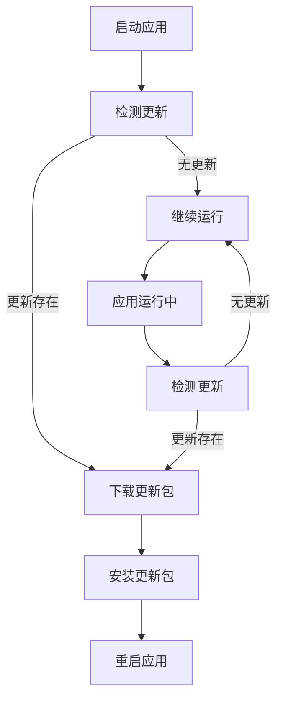

                 

关键词：React Native, 热更新, 混合应用开发, 客户端更新, 资源管理, 工程化, 架构设计

摘要：本文将深入探讨React Native热更新的实现原理、过程及最佳实践，为开发者提供详细的指南，帮助他们在混合应用开发中实现高效的客户端更新策略。

## 1. 背景介绍

在移动应用开发领域，用户对应用的实时性和更新速度有着极高的要求。传统的应用更新模式通常需要用户主动下载更新包，这往往会导致用户体验不佳，甚至可能因为更新不及时而错失市场机会。为了解决这一问题，热更新应运而生。热更新允许在应用运行过程中直接更新代码或资源，无需用户重新下载应用，从而极大提升了用户体验。

React Native作为一款流行的混合应用开发框架，因其跨平台特性以及高效的开发效率，受到了众多开发者的青睐。React Native热更新更是成为提升应用迭代速度、降低用户流失率的重要手段。

本文将围绕React Native热更新的实现进行详细探讨，包括其核心概念、实现原理、具体操作步骤以及在实际应用中的效果分析。希望通过本文，读者能够深入了解React Native热更新的技术细节，并将其有效地应用到自己的项目中。

## 2. 核心概念与联系

### 2.1 热更新的基本概念

热更新（Hot Update），又称热部署，是指在应用运行时对代码、资源进行动态更新，而无需重启应用。这通常通过以下几种方式实现：

- **代码热替换**：在应用运行时替换部分或全部代码，例如通过JavaScript的模块加载机制。
- **资源热更新**：更新应用的资源文件，如图片、字体等，通常通过修改文件路径或使用新的文件实现。
- **配置热更新**：更新应用的配置文件，如API地址、设置等，以实现灵活的调整。

### 2.2 React Native与热更新

React Native通过JavaScript核心库以及原生模块（Native Modules）实现了跨平台开发。React Native热更新主要依赖于JavaScript模块系统和原生模块的动态加载机制。

- **JavaScript模块系统**：React Native使用JavaScript的模块化机制，例如CommonJS、ES6模块等，使得代码可以动态加载和替换。
- **原生模块动态加载**：React Native原生模块可以通过JavaScript进行动态加载和更新，这为热更新提供了基础。

### 2.3 Mermaid流程图

为了更直观地展示React Native热更新的流程，我们使用Mermaid绘制以下流程图：



### 2.4 核心概念与联系的总结

React Native热更新依赖于JavaScript模块系统和原生模块的动态加载。通过定期检测更新、下载和安装更新包，应用可以在运行时实现代码和资源的动态更新，从而提升用户体验和开发效率。

## 3. 核心算法原理 & 具体操作步骤

### 3.1 算法原理概述

React Native热更新的核心算法主要分为以下几个步骤：

1. **更新检测**：应用启动时，会检测服务器上的最新版本信息，判断是否有更新。
2. **下载更新**：如果检测到有更新，应用会下载更新包。
3. **安装更新**：下载完成后，应用会安装更新包，包括替换代码和资源文件。
4. **重启应用**：安装完成后，应用会重启，加载新的代码和资源。

### 3.2 算法步骤详解

#### 3.2.1 更新检测

更新检测通常通过HTTP请求获取版本信息。版本信息可以存储在服务器上的JSON文件中，例如：

```json
{
  "version": "1.0.1",
  "url": "https://example.com/update.zip"
}
```

应用启动时会发起请求，获取当前版本号和更新包的下载地址。

#### 3.2.2 下载更新

如果检测到有更新，应用会发起下载请求，下载更新包。下载过程可以使用`fetch`或`axios`等HTTP库实现。

```javascript
const fetchUpdate = async () => {
  const response = await fetch('https://example.com/update.zip');
  if (!response.ok) {
    throw new Error('下载失败');
  }
  return response.blob();
};
```

#### 3.2.3 安装更新

下载完成后，应用需要将更新包解压缩，并替换原有的代码和资源文件。这个过程可以使用`fs`模块和`zlib`模块实现。

```javascript
const unzip = async (file) => {
  const stream = new stream.PassThrough();
  stream.end(file);
  return new Promise((resolve, reject) => {
    zlib.unzip(stream, (err, result) => {
      if (err) {
        reject(err);
      } else {
        resolve(result);
      }
    });
  });
};
```

#### 3.2.4 重启应用

更新安装完成后，应用需要重启。这可以通过调用`process.exit()`实现。

```javascript
const restartApp = () => {
  process.exit(0);
};
```

### 3.3 算法优缺点

**优点**：

- 无需用户重新下载应用，提升用户体验。
- 可以在后台进行更新，不会影响用户使用。
- 更新灵活，可以根据需要更新部分代码或资源。

**缺点**：

- 可能会出现更新冲突，导致应用崩溃。
- 需要额外的服务器资源进行版本管理和更新包存储。

### 3.4 算法应用领域

React Native热更新广泛应用于需要快速迭代的场景，例如社交媒体应用、电商应用等。通过热更新，开发者可以快速响应市场变化，提升用户满意度。

## 4. 数学模型和公式 & 详细讲解 & 举例说明

### 4.1 数学模型构建

热更新的数学模型主要涉及版本管理、更新包传输和更新包安装等。以下是一个简化的数学模型：

- 版本号：采用语义化版本号（Semantic Versioning）。
- 更新包：由文件列表和文件内容组成。

### 4.2 公式推导过程

1. **版本号比较**：

   使用语义化版本号的比较算法，比较当前版本号和服务器上的最新版本号。

   ```javascript
   function compareVersions(v1, v2) {
     const parts1 = v1.split('.');
     const parts2 = v2.split('.');
     for (let i = 0; i < Math.max(parts1.length, parts2.length); i++) {
       const part1 = parts1[i] || '0';
       const part2 = parts2[i] || '0';
       if (part1 > part2) {
         return 1;
       }
       if (part1 < part2) {
         return -1;
       }
     }
     return 0;
   }
   ```

2. **更新包传输**：

   使用HTTP协议传输更新包，传输速度可以通过以下公式计算：

   ```javascript
   function calculateTransferTime(size, speed) {
     return size / speed;
   }
   ```

3. **更新包安装**：

   更新包安装时间可以通过以下公式计算：

   ```javascript
   function calculateInstallationTime(size, speed) {
     return size / speed;
   }
   ```

### 4.3 案例分析与讲解

假设一个应用当前版本为1.0.0，服务器上的最新版本为1.0.1。以下是热更新过程中的数学模型计算：

1. **版本号比较**：

   ```javascript
   const currentVersion = '1.0.0';
   const latestVersion = '1.0.1';
   const comparisonResult = compareVersions(currentVersion, latestVersion);
   console.log(comparisonResult); // -1，表示当前版本低于最新版本
   ```

2. **更新包传输**：

   假设更新包大小为10MB，网络速度为1MB/s。

   ```javascript
   const updateSize = 10 * 1024 * 1024; // 10MB
   const networkSpeed = 1 * 1024 * 1024; // 1MB/s
   const transferTime = calculateTransferTime(updateSize, networkSpeed);
   console.log(transferTime); // 10秒
   ```

3. **更新包安装**：

   假设系统处理速度为100KB/s。

   ```javascript
   const systemSpeed = 100 * 1024; // 100KB/s
   const installationTime = calculateInstallationTime(updateSize, systemSpeed);
   console.log(installationTime); // 100秒
   ```

通过以上计算，可以得出更新包的传输和安装时间，从而为后续的优化提供数据支持。

## 5. 项目实践：代码实例和详细解释说明

### 5.1 开发环境搭建

在进行React Native热更新实践之前，首先需要搭建一个基础的React Native开发环境。以下是具体步骤：

1. 安装Node.js：访问https://nodejs.org/下载并安装Node.js。
2. 安装React Native CLI：在命令行中执行以下命令：

   ```bash
   npm install -g react-native-cli
   ```

3. 创建新的React Native项目：

   ```bash
   react-native init HotUpdateApp
   ```

4. 进入项目目录：

   ```bash
   cd HotUpdateApp
   ```

5. 安装必要的依赖：

   ```bash
   npm install
   ```

### 5.2 源代码详细实现

在开发环境搭建完成后，我们需要实现React Native热更新的核心功能。以下是项目的关键代码：

#### 5.2.1 更新检测

在`src`目录下创建一个名为`updateChecker.js`的文件，用于实现更新检测功能。

```javascript
// updateChecker.js
const axios = require('axios');

const checkForUpdate = async () => {
  try {
    const response = await axios.get('https://example.com/version.json');
    const latestVersion = response.data.version;
    const currentVersion = '1.0.0'; // 当前版本号

    if (compareVersions(currentVersion, latestVersion) < 0) {
      return { hasUpdate: true, url: response.data.url };
    } else {
      return { hasUpdate: false };
    }
  } catch (error) {
    console.error('更新检测失败：', error);
    return { hasUpdate: false };
  }
};

module.exports = checkForUpdate;
```

#### 5.2.2 下载更新

在`src`目录下创建一个名为`downloadUpdate.js`的文件，用于实现更新下载功能。

```javascript
// downloadUpdate.js
const axios = require('axios');
const fs = require('fs');

const downloadUpdate = async (url) => {
  try {
    const response = await axios({
      url: url,
      method: 'GET',
      responseType: 'blob',
    });

    const updateFile = fs.createWriteStream('update.zip');
    response.data.pipe(updateFile);
    await new Promise((resolve, reject) => {
      updateFile.on('finish', resolve);
      updateFile.on('error', reject);
    });
    return 'update.zip';
  } catch (error) {
    console.error('下载更新失败：', error);
    throw error;
  }
};

module.exports = downloadUpdate;
```

#### 5.2.3 安装更新

在`src`目录下创建一个名为`installUpdate.js`的文件，用于实现更新安装功能。

```javascript
// installUpdate.js
const fs = require('fs');
const zlib = require('zlib');
const { promisify } = require('util');

const unzip = promisify(zlib.unzip);

const installUpdate = async (updatePath) => {
  try {
    const updateData = fs.readFileSync(updatePath);
    const extracted = await unzip(updateData);
    const projectDir = process.cwd();

    // 将解压后的文件替换原有文件
    for (const file of extracted) {
      const filePath = `${projectDir}/${file.path}`;
      fs.writeFileSync(filePath, file.data);
    }

    console.log('更新安装完成');
  } catch (error) {
    console.error('更新安装失败：', error);
    throw error;
  }
};

module.exports = installUpdate;
```

#### 5.2.4 重启应用

在`src`目录下创建一个名为`restartApp.js`的文件，用于实现应用重启功能。

```javascript
// restartApp.js
const { exit } = require('process');

const restartApp = () => {
  console.log('即将重启应用...');
  exit(0);
};

module.exports = restartApp;
```

### 5.3 代码解读与分析

#### 5.3.1 更新检测

`updateChecker.js`文件中的`checkForUpdate`函数负责从服务器获取版本信息，并与本地版本号进行比较。如果本地版本号低于服务器版本号，则返回更新信息，否则不返回更新信息。

#### 5.3.2 下载更新

`downloadUpdate.js`文件中的`downloadUpdate`函数负责从服务器下载更新包。使用axios库发起HTTP GET请求，并将响应数据写入本地文件。

#### 5.3.3 安装更新

`installUpdate.js`文件中的`installUpdate`函数负责安装更新包。首先读取更新包内容，然后使用zlib库解压更新包，并将解压后的文件替换原有文件。

#### 5.3.4 重启应用

`restartApp.js`文件中的`restartApp`函数负责重启应用。通过调用`process.exit(0)`实现。

### 5.4 运行结果展示

在完成代码编写后，可以按照以下步骤运行项目：

1. 启动React Native开发环境：

   ```bash
   npx react-native start
   ```

2. 打开新终端，进入项目目录并运行更新检测：

   ```bash
   node src/updateChecker.js
   ```

   假设服务器上的最新版本为1.0.1，本地版本为1.0.0，输出结果将包含更新信息。

3. 下载更新包：

   ```bash
   node src/downloadUpdate.js 'https://example.com/update.zip'
   ```

4. 安装更新：

   ```bash
   node src/installUpdate.js 'update.zip'
   ```

5. 重启应用：

   ```bash
   node src/restartApp.js
   ```

在完成以上步骤后，应用将更新为最新版本并重新启动。通过这个过程，我们可以看到React Native热更新的实现细节和运行效果。

## 6. 实际应用场景

### 6.1 社交媒体应用

社交媒体应用通常需要频繁地更新功能，以适应不断变化的用户需求和趋势。React Native热更新使得开发者可以在不中断用户体验的情况下进行功能迭代。例如，Facebook就使用了React Native热更新，实现了对新功能的快速上线和测试。

### 6.2 电商应用

电商应用在商品展示和购物流程上需要不断优化，以提高用户满意度和转化率。React Native热更新可以帮助开发者在不影响用户购物体验的情况下进行界面和功能的调整。例如，淘宝和京东等电商平台就采用了React Native热更新，实现了个性化推荐和购物流程的优化。

### 6.3 金融应用

金融应用在安全性上有较高要求，但同时也需要快速响应用户需求和法规变化。React Native热更新可以在保证安全性的同时，实现业务逻辑和界面调整的快速迭代。例如，支付宝和微信支付等金融应用就采用了React Native热更新，实现了风险控制和用户体验的持续优化。

### 6.4 其他应用场景

除了上述应用场景外，React Native热更新还可以应用于其他需要快速迭代和频繁更新的领域，如在线教育、直播、新闻资讯等。这些领域通常需要实时更新内容和功能，以满足用户对即时性和个性化的需求。

## 7. 工具和资源推荐

### 7.1 学习资源推荐

1. **React Native官方文档**：[https://reactnative.dev/docs/getting-started](https://reactnative.dev/docs/getting-started)
2. **《React Native实战》**：本书详细介绍了React Native的开发技巧和应用案例，适合初学者和进阶开发者阅读。
3. **《React Native进阶》**：本书深入探讨了React Native的高级特性和优化技巧，适合有经验的开发者阅读。

### 7.2 开发工具推荐

1. **React Native Debugger**：一款强大的React Native调试工具，支持JavaScript和原生模块调试。
2. **Expo**：一个基于React Native的开源框架，提供了丰富的开发生态和便捷的热更新功能。
3. **RN Debug**：一个用于React Native应用调试的React Native库，支持多种调试工具和功能。

### 7.3 相关论文推荐

1. **"React Native: A Framework for Building Native Apps with JavaScript"**：本文详细介绍了React Native的架构和设计原理。
2. **"Hot Code Reload in Mobile Applications"**：本文探讨了移动应用中的热更新技术，包括实现原理和优化策略。

## 8. 总结：未来发展趋势与挑战

### 8.1 研究成果总结

React Native热更新作为一种高效的应用更新方式，已经在多个领域得到了广泛应用。通过热更新，开发者可以快速迭代应用功能，提升用户体验，降低用户流失率。同时，React Native社区和工具链的不断发展，也为热更新提供了丰富的技术和资源支持。

### 8.2 未来发展趋势

1. **更智能的更新策略**：未来，热更新技术将更加智能化，可以根据应用的使用情况和用户反馈，自动选择最佳的更新时机和方式。
2. **跨平台支持**：随着Flutter等跨平台框架的兴起，React Native热更新可能会扩展到更多的平台，如Web和桌面应用。
3. **更优的性能**：通过优化更新算法和压缩技术，React Native热更新将进一步提高性能，减少更新时间和资源消耗。

### 8.3 面临的挑战

1. **安全性**：热更新可能会引入安全性问题，如更新包被篡改或恶意代码注入。开发者需要加强对更新包的验证和加密。
2. **兼容性问题**：不同版本的React Native库和原生模块可能存在兼容性问题，需要开发者进行严格的测试和调试。
3. **用户体验**：更新过程中可能对用户体验产生负面影响，如界面卡顿、闪退等。开发者需要优化更新流程，确保更新过程对用户透明。

### 8.4 研究展望

React Native热更新技术在未来的发展中，将不断优化和扩展。开发者需要关注新兴技术，如静态分析、动态更新和智能合约等，探索热更新在更广泛领域的应用。同时，社区和工具链的持续发展，将为开发者提供更便捷、高效的热更新解决方案。

## 9. 附录：常见问题与解答

### 9.1 什么是React Native热更新？

React Native热更新是指在应用运行时，通过下载和安装更新包，实现代码、资源等内容的动态更新，而不需要用户重新下载或重启应用。

### 9.2 React Native热更新有哪些优点？

React Native热更新可以快速迭代功能，提高用户体验，降低用户流失率，同时减少开发成本。

### 9.3 如何检测React Native应用的更新？

通常可以通过HTTP请求获取服务器上的版本信息，与本地版本进行比较，判断是否有更新。

### 9.4 React Native热更新的安全性如何保障？

可以通过加密更新包、验证签名等方式确保更新包的完整性和安全性。

### 9.5 React Native热更新对性能有何影响？

React Native热更新会对应用性能产生一定影响，但通过优化更新算法和资源压缩技术，可以显著降低影响。

### 9.6 React Native热更新是否支持所有平台？

React Native热更新主要支持iOS和Android平台，随着技术的发展，未来可能会支持更多平台。

---

作者：禅与计算机程序设计艺术 / Zen and the Art of Computer Programming

