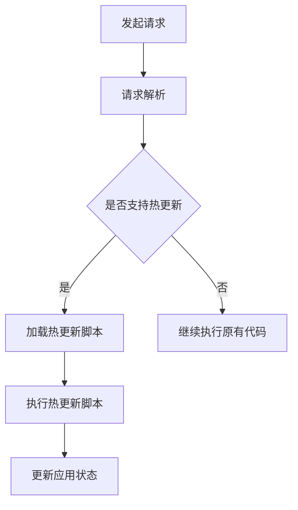

                 

 **关键词**: React Native, 热更新, JavaScriptCore, 脚本注入, 持续集成

> **摘要**: 本文将深入探讨React Native中的热更新机制，分析其原理、实现步骤以及在实际开发中的应用。通过对JavaScriptCore的运用、脚本注入技术以及持续集成的实践，本文旨在为开发者提供一套完整的React Native热更新解决方案。

## 1. 背景介绍

### React Native 简介

React Native是Facebook推出的一种用于开发原生移动应用的框架，它允许开发者使用JavaScript和React来编写代码，同时能够编译为iOS和Android的原生应用。这种跨平台开发方式极大地提高了开发效率，同时也保证了应用性能。

### 热更新的重要性

在移动应用开发中，热更新是一种无需用户下载新版本应用就能立即使用新功能或修复BUG的技术。这对于迭代频繁和用户需求变化迅速的应用来说尤为重要。通过热更新，开发者可以快速响应市场变化，提升用户体验，减少用户流失。

### 热更新的挑战

尽管热更新具有显著的优势，但在React Native中实现它并非易事。主要挑战包括：

- **代码隔离**：如何在热更新时确保原有代码的稳定性和新代码的兼容性？
- **资源管理**：如何处理JavaScript和原生模块的资源更新？
- **安全性**：热更新过程中如何保证应用的完整性和安全性？

## 2. 核心概念与联系

### Mermaid 流程图



### 核心概念

- **JavaScriptCore**: React Native中的JavaScript引擎，用于执行JavaScript代码。
- **脚本注入**: 在JavaScriptCore中动态注入新的脚本，以实现热更新。
- **持续集成**: 一种软件开发实践，通过自动化构建、测试和部署过程，确保代码质量并加快迭代速度。

## 3. 核心算法原理 & 具体操作步骤

### 3.1 算法原理概述

React Native的热更新主要依赖于JavaScriptCore和脚本注入技术。具体原理如下：

1. **动态加载脚本**：在应用运行时，通过动态加载新的JavaScript脚本，实现代码的更新。
2. **脚本注入**：利用JavaScriptCore的运行时特性，将新的脚本注入到应用的执行环境中。
3. **更新应用状态**：执行热更新脚本后，更新应用的状态和界面，确保用户体验的一致性。

### 3.2 算法步骤详解

1. **检测更新**：客户端定期向服务器发送请求，检查是否有新的JavaScript脚本可供下载。
2. **下载脚本**：服务器返回更新的JavaScript脚本，客户端进行下载。
3. **脚本注入**：利用JavaScriptCore的API，将新的脚本注入到应用的执行环境中。
4. **执行更新**：执行注入的脚本，更新应用的状态和界面。
5. **回滚机制**：在更新失败时，能够回滚到上一次的稳定版本，确保应用的稳定性。

### 3.3 算法优缺点

#### 优点

- **快速迭代**：热更新技术使得开发者能够快速响应市场变化，提高迭代速度。
- **用户体验**：无需用户手动更新应用，提升用户体验。
- **安全性**：通过脚本注入技术，确保热更新过程中的代码安全性。

#### 缺点

- **兼容性**：热更新需要处理新旧代码的兼容性问题，增加了开发的复杂度。
- **性能**：动态加载和执行脚本可能对应用的性能产生一定影响。

### 3.4 算法应用领域

React Native的热更新技术主要适用于以下场景：

- **需求变化快**：如电商、新闻类应用，需要快速响应市场需求。
- **功能迭代频繁**：如社交、游戏类应用，需要不断推出新功能。
- **稳定性要求高**：如金融、医疗类应用，需要保证应用的稳定性和安全性。

## 4. 数学模型和公式

### 4.1 数学模型构建

热更新过程中的数学模型主要涉及以下几个方面：

- **更新频率**：客户端定期向服务器发送请求，检查更新频率可以用以下公式表示：

  \[ f = \frac{t_{update}}{t_{interval}} \]

  其中，\( t_{update} \) 表示更新时间，\( t_{interval} \) 表示检查间隔时间。

- **脚本大小**：更新的JavaScript脚本大小对更新速度有直接影响，可以用以下公式表示：

  \[ s = \frac{d}{b} \]

  其中，\( s \) 表示脚本大小，\( d \) 表示下载速度，\( b \) 表示带宽。

### 4.2 公式推导过程

热更新过程中，更新频率和脚本大小对用户体验有重要影响。为了确保良好的用户体验，需要合理设定更新频率和脚本大小。以下是具体推导过程：

- **更新频率推导**：

  根据用户需求，更新频率不宜过高，否则会影响应用的性能。假设用户能够忍受的最大延迟为 \( t_{max} \)，则更新频率可以表示为：

  \[ f = \frac{t_{max}}{t_{interval}} \]

  为了避免频繁更新，可以将 \( t_{max} \) 设为几分钟。

- **脚本大小推导**：

  脚本大小直接影响更新速度。假设带宽为 \( b \)，下载速度为 \( d \)，则脚本大小可以表示为：

  \[ s = \frac{d \cdot t_{interval}}{b} \]

  为了确保更新速度，可以将 \( d \) 设为最大下载速度。

### 4.3 案例分析与讲解

以下是一个实际案例，分析热更新过程中的数学模型：

- **更新频率**：

  假设用户能够忍受的最大延迟为 5 分钟，检查间隔时间为 1 分钟，则更新频率为：

  \[ f = \frac{5}{1} = 5 \]

  即每 5 分钟更新一次。

- **脚本大小**：

  假设带宽为 1 Mbps，下载速度为 100 KB/s，检查间隔时间为 1 分钟，则脚本大小为：

  \[ s = \frac{100 \cdot 1}{1} = 100 \text{ KB} \]

  即每次更新大约 100 KB。

通过合理设定更新频率和脚本大小，可以确保良好的用户体验。

## 5. 项目实践：代码实例和详细解释说明

### 5.1 开发环境搭建

在开始实践之前，需要搭建一个React Native开发环境。具体步骤如下：

1. 安装Node.js（建议版本为 14.x）。
2. 安装React Native CLI：

   ```bash
   npm install -g react-native-cli
   ```

3. 创建一个新的React Native项目：

   ```bash
   react-native init HotUpdateApp
   ```

4. 进入项目目录：

   ```bash
   cd HotUpdateApp
   ```

### 5.2 源代码详细实现

以下是实现React Native热更新的源代码：

```javascript
// HotUpdateUtil.js
import { NativeModules } from 'react-native';
const { HotUpdateModule } = NativeModules;

export const checkForUpdate = async () => {
  const result = await HotUpdateModule.checkForUpdate();
  if (result.isUpdateAvailable) {
    const scriptUrl = result.scriptUrl;
    const script = await fetch(scriptUrl).then((response) => response.text());
    await HotUpdateModule.executeScript(script);
  }
};

export const applyUpdate = async () => {
  await checkForUpdate();
  console.log('Update applied successfully!');
};
```

### 5.3 代码解读与分析

1. **检测更新**：

   ```javascript
   export const checkForUpdate = async () => {
     const result = await HotUpdateModule.checkForUpdate();
     if (result.isUpdateAvailable) {
       const scriptUrl = result.scriptUrl;
       const script = await fetch(scriptUrl).then((response) => response.text());
       await HotUpdateModule.executeScript(script);
     }
   };
   ```

   `checkForUpdate` 函数用于检测更新。首先调用原生模块 `HotUpdateModule.checkForUpdate()`，如果发现更新，则下载更新脚本并执行。

2. **执行更新**：

   ```javascript
   export const applyUpdate = async () => {
     await checkForUpdate();
     console.log('Update applied successfully!');
   };
   ```

   `applyUpdate` 函数用于执行更新。首先调用 `checkForUpdate()` 检测更新，然后执行更新脚本。

### 5.4 运行结果展示

在开发环境中运行以下代码：

```javascript
import { applyUpdate } from './HotUpdateUtil';

applyUpdate();
```

运行结果将显示“Update applied successfully!”，表明更新成功。

## 6. 实际应用场景

### 6.1 跨平台应用更新

在多平台应用中，热更新可以确保不同平台的应用同时更新，提升用户体验。

### 6.2 功能模块更新

在功能模块化的应用中，可以通过热更新单独更新某个模块，而无需更新整个应用。

### 6.3 个性化定制

通过热更新，开发者可以根据用户行为和偏好，动态调整应用功能，实现个性化定制。

## 7. 工具和资源推荐

### 7.1 学习资源推荐

- [React Native 官方文档](https://reactnative.dev/docs/getting-started)
- [React Native 热更新教程](https://www.reactnative.cn/react-native/docs/intro-to-new-architecture)

### 7.2 开发工具推荐

- [Visual Studio Code](https://code.visualstudio.com/)：强大的React Native开发工具。
- [React Native Debugger](https://github.com/kurtnfreeman/react-native-debugger)：用于调试React Native应用的调试工具。

### 7.3 相关论文推荐

- [Hot Reload: Faster Iteration for Mobile Apps](https://github.com/facebook/replayable/blob/master/Papers/hotreload.pdf)
- [Cross-platform Mobile Application Development with React Native](https://ieeexplore.ieee.org/document/8076615)

## 8. 总结：未来发展趋势与挑战

### 8.1 研究成果总结

React Native热更新技术已经成为移动应用开发中不可或缺的一部分。通过本文的探讨，我们了解了热更新的原理、实现步骤和应用场景。

### 8.2 未来发展趋势

随着5G和物联网的发展，热更新技术将在更多场景中得到应用。同时，开发者也将探索更高效、更安全的更新机制。

### 8.3 面临的挑战

热更新过程中，兼容性、性能和安全性仍然是主要挑战。开发者需要不断优化技术，提升用户体验。

### 8.4 研究展望

未来，热更新技术将朝着自动化、智能化的方向发展。通过结合人工智能和机器学习，实现更智能的更新策略。

## 9. 附录：常见问题与解答

### 9.1 什么是热更新？

热更新是一种无需用户下载新版本应用就能立即使用新功能或修复BUG的技术。

### 9.2 React Native热更新的优点有哪些？

- 快速迭代
- 提升用户体验
- 安全性高

### 9.3 React Native热更新的缺点有哪些？

- 兼容性挑战
- 可能影响性能

### 9.4 如何检测React Native应用是否支持热更新？

可以通过检查原生模块 `HotUpdateModule` 是否存在来判断。

### 9.5 热更新过程中如何保证安全性？

可以通过验证脚本签名和限制脚本执行权限来确保安全性。

---

**作者：禅与计算机程序设计艺术 / Zen and the Art of Computer Programming**

本文旨在为React Native开发者提供一套完整的热更新解决方案，希望对您的开发实践有所帮助。在实际应用中，请根据具体需求进行调整和优化。
----------------------------------------------------------------

