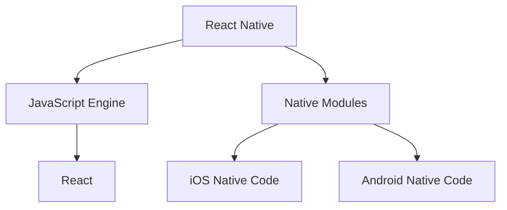

                 

关键词：React Native，跨平台开发，移动应用，UI框架，JavaScript，性能优化

> 摘要：本文将深入探讨React Native框架在构建跨平台移动应用程序中的关键角色和优势。通过介绍其核心概念、算法原理、数学模型以及实际应用场景，我们将揭示React Native为何成为移动开发者的首选工具之一。

## 1. 背景介绍

移动设备的普及带来了对移动应用的需求爆炸式增长。开发者面临着如何在多种操作系统上快速、高效地构建高质量应用程序的挑战。传统的原生开发方式需要针对iOS和Android分别编写代码，这不仅增加了开发和维护成本，也延长了上市时间。为了解决这一问题，跨平台开发框架应运而生。

React Native（简称RN）是由Facebook推出的一款开源框架，它允许开发者使用JavaScript和React编写应用程序，并在iOS和Android上运行。RN通过一套共享的代码库实现了跨平台的功能，显著降低了开发时间和成本。

## 2. 核心概念与联系

### 2.1 React Native核心概念

React Native的核心在于其组件化思想和React的虚拟DOM机制。组件是React Native的基本构建块，它们是可复用的UI元素，能够通过JSX语法轻松定义。React的虚拟DOM使得React Native能够在界面更新时进行高效的内存管理，从而提升性能。

### 2.2 架构关系图



在此架构图中，React Native使用JavaScript Engine（例如JavaScriptCore或ChakraCore）来执行JavaScript代码，并通过React框架管理虚拟DOM。Native Modules允许与原生代码交互，从而实现系统级别的功能。iOS和Android分别使用原生代码来实现特定平台的特性。

## 3. 核心算法原理 & 具体操作步骤

### 3.1 算法原理概述

React Native的核心算法是React的虚拟DOM机制。虚拟DOM是React提供的一种内存中的数据结构，它代表了实际的DOM结构。当组件的状态或属性发生变化时，React会使用一套高效的算法来更新虚拟DOM，然后将其同步到实际的DOM上，这个过程称为 reconciliation。

### 3.2 算法步骤详解

1. **差异检测**：React会检测组件的当前状态和属性与上一次渲染的差异。
2. **构建更新队列**：根据差异检测结果，构建一个更新队列。
3. **执行更新**：React按照更新队列的顺序执行DOM更新。
4. **同步虚拟DOM到实际DOM**：将更新后的虚拟DOM同步到实际的DOM结构上。

### 3.3 算法优缺点

**优点**：
- **高效性**：通过虚拟DOM和reconciliation算法，React Native能够在界面更新时进行高效的内存管理。
- **组件化**：组件化开发提高了代码的可维护性和复用性。

**缺点**：
- **性能瓶颈**：在大量复杂数据的情况下，虚拟DOM的reconciliation过程可能会变得缓慢。
- **学习曲线**：React Native要求开发者掌握React和JavaScript，这可能会增加学习成本。

### 3.4 算法应用领域

React Native广泛应用于各种移动应用程序的开发，包括社交媒体、电子商务、医疗健康等领域。其跨平台的特性使得开发者可以更快速地将产品推向市场。

## 4. 数学模型和公式 & 详细讲解 & 举例说明

### 4.1 数学模型构建

React Native的性能优化涉及到多个数学模型，其中最重要的是渲染性能模型。这个模型主要关注组件渲染的时间复杂度和内存占用。

### 4.2 公式推导过程

渲染性能模型可以表示为：

\[ P = f(N, T) \]

其中，\( P \) 是渲染性能，\( N \) 是组件数量，\( T \) 是渲染时间。

### 4.3 案例分析与讲解

假设我们有一个包含100个组件的页面，每次渲染需要2毫秒。那么，渲染性能可以表示为：

\[ P = f(100, 2ms) = \frac{100}{2ms} = 50 组件/毫秒 \]

为了提升性能，我们可以通过减少组件数量或缩短渲染时间来实现。例如，通过使用React Native的`PureComponent`或`shouldComponentUpdate`方法来避免不必要的渲染。

## 5. 项目实践：代码实例和详细解释说明

### 5.1 开发环境搭建

搭建React Native开发环境需要安装Node.js、Watchman、React Native CLI以及Xcode（对于iOS）或Android Studio（对于Android）。

```bash
npm install -g react-native-cli
react-native init MyApp
```

### 5.2 源代码详细实现

以下是使用React Native创建一个简单应用的示例代码：

```jsx
import React from 'react';
import { View, Text, Button } from 'react-native';

const MyApp = () => {
  const handlePress = () => {
    alert('按钮被点击');
  };

  return (
    <View style={{ flex: 1, justifyContent: 'center', alignItems: 'center' }}>
      <Text>Hello, React Native!</Text>
      <Button title="点击我" onPress={handlePress} />
    </View>
  );
};

export default MyApp;
```

### 5.3 代码解读与分析

此代码首先导入了React Native中的基本组件，包括`View`、`Text`和`Button`。`MyApp`组件定义了一个简单的布局，包含一个文本和一个按钮。按钮被点击时会触发`handlePress`函数，显示一个警告框。

### 5.4 运行结果展示

通过命令行运行以下命令，可以启动开发服务器并在模拟器或真实设备上查看应用：

```bash
react-native run-android
```

应用运行后，会显示一个包含文本和按钮的界面。点击按钮会触发警告框。

## 6. 实际应用场景

React Native在多个领域都有广泛应用：

- **社交媒体应用**：如Facebook、Instagram等，使用React Native实现了丰富的交互体验。
- **电子商务应用**：如Amazon、Etsy等，React Native提高了应用的用户体验和性能。
- **医疗健康应用**：如MyFitnessPal、Halo Top Foods等，React Native使得医疗健康应用更加直观和易于使用。

### 6.4 未来应用展望

随着技术的不断进步，React Native有望在以下领域取得更多突破：

- **物联网（IoT）**：React Native可以在IoT设备上运行，提供更丰富的用户体验。
- **增强现实（AR）**：React Native结合AR技术，可以开发出更加沉浸式的应用。
- **游戏开发**：通过优化性能，React Native有望进入游戏开发领域。

## 7. 工具和资源推荐

### 7.1 学习资源推荐

- **官方文档**：[React Native 官方文档](https://reactnative.dev/docs/getting-started)
- **《React Native实战》**：由李兵所著的React Native入门与实战书籍。

### 7.2 开发工具推荐

- **React Native CLI**：用于初始化项目、运行应用和进行热更新。
- **React Native Debugger**：用于调试React Native应用。

### 7.3 相关论文推荐

- **"React Native: An Overview and Future Directions"**：对React Native的历史、现状和未来进行了深入分析。

## 8. 总结：未来发展趋势与挑战

### 8.1 研究成果总结

React Native自推出以来，已经成为跨平台移动开发的事实标准。其组件化和虚拟DOM机制带来了高效的开发体验和性能优化。

### 8.2 未来发展趋势

随着移动设备性能的提升和开发工具的完善，React Native有望在更广泛的领域得到应用，特别是物联网和增强现实领域。

### 8.3 面临的挑战

React Native在性能优化、开发效率和社区支持方面仍有待提高。特别是对于复杂应用，React Native的渲染性能和原生应用相比仍有差距。

### 8.4 研究展望

未来，React Native可能会通过引入新的架构和技术来进一步提高性能和开发效率。同时，开发者社区的支持和贡献也将是React Native持续发展的关键。

## 9. 附录：常见问题与解答

- **Q：React Native适合所有移动应用开发吗？**
  - A：React Native非常适合需要快速迭代和跨平台部署的应用。但对于需要高度优化性能的应用，例如游戏，可能需要考虑其他开发框架。

- **Q：React Native与Flutter相比有哪些优缺点？**
  - A：React Native的优势在于其强大的社区支持和JavaScript开发者的广泛使用，而Flutter则以其高性能和丰富的UI组件而著称。具体选择取决于项目需求和开发团队的技能。

作者：禅与计算机程序设计艺术 / Zen and the Art of Computer Programming
```markdown
----------------------------------------------------------------
# React Native：构建跨平台移动应用程序

关键词：React Native，跨平台开发，移动应用，UI框架，JavaScript，性能优化

摘要：本文将深入探讨React Native框架在构建跨平台移动应用程序中的关键角色和优势。通过介绍其核心概念、算法原理、数学模型以及实际应用场景，我们将揭示React Native为何成为移动开发者的首选工具之一。

## 1. 背景介绍

移动设备的普及带来了对移动应用的需求爆炸式增长。开发者面临着如何在多种操作系统上快速、高效地构建高质量应用程序的挑战。传统的原生开发方式需要针对iOS和Android分别编写代码，这不仅增加了开发和维护成本，也延长了上市时间。为了解决这一问题，跨平台开发框架应运而生。

React Native（简称RN）是由Facebook推出的一款开源框架，它允许开发者使用JavaScript和React编写应用程序，并在iOS和Android上运行。RN通过一套共享的代码库实现了跨平台的功能，显著降低了开发时间和成本。

## 2. 核心概念与联系

### 2.1 React Native核心概念

React Native的核心在于其组件化思想和React的虚拟DOM机制。组件是React Native的基本构建块，它们是可复用的UI元素，能够通过JSX语法轻松定义。React的虚拟DOM使得React Native能够在界面更新时进行高效的内存管理，从而提升性能。

### 2.2 架构关系图


在此架构图中，React Native使用JavaScript Engine（例如JavaScriptCore或ChakraCore）来执行JavaScript代码，并通过React框架管理虚拟DOM。Native Modules允许与原生代码交互，从而实现系统级别的功能。iOS和Android分别使用原生代码来实现特定平台的特性。

## 3. 核心算法原理 & 具体操作步骤
### 3.1 算法原理概述

React Native的核心算法是React的虚拟DOM机制。虚拟DOM是React提供的一种内存中的数据结构，它代表了实际的DOM结构。当组件的状态或属性发生变化时，React会使用一套高效的算法来更新虚拟DOM，然后将其同步到实际的DOM上，这个过程称为 reconciliation。

### 3.2 算法步骤详解

1. **差异检测**：React会检测组件的当前状态和属性与上一次渲染的差异。
2. **构建更新队列**：根据差异检测结果，构建一个更新队列。
3. **执行更新**：React按照更新队列的顺序执行DOM更新。
4. **同步虚拟DOM到实际DOM**：将更新后的虚拟DOM同步到实际的DOM结构上。

### 3.3 算法优缺点

**优点**：
- **高效性**：通过虚拟DOM和reconciliation算法，React Native能够在界面更新时进行高效的内存管理。
- **组件化**：组件化开发提高了代码的可维护性和复用性。

**缺点**：
- **性能瓶颈**：在大量复杂数据的情况下，虚拟DOM的reconciliation过程可能会变得缓慢。
- **学习曲线**：React Native要求开发者掌握React和JavaScript，这可能会增加学习成本。

### 3.4 算法应用领域

React Native广泛应用于各种移动应用程序的开发，包括社交媒体、电子商务、医疗健康等领域。其跨平台的特性使得开发者可以更快速地将产品推向市场。

## 4. 数学模型和公式 & 详细讲解 & 举例说明

### 4.1 数学模型构建

React Native的性能优化涉及到多个数学模型，其中最重要的是渲染性能模型。这个模型主要关注组件渲染的时间复杂度和内存占用。

### 4.2 公式推导过程

渲染性能模型可以表示为：

\[ P = f(N, T) \]

其中，\( P \) 是渲染性能，\( N \) 是组件数量，\( T \) 是渲染时间。

### 4.3 案例分析与讲解

假设我们有一个包含100个组件的页面，每次渲染需要2毫秒。那么，渲染性能可以表示为：

\[ P = f(100, 2ms) = \frac{100}{2ms} = 50 组件/毫秒 \]

为了提升性能，我们可以通过减少组件数量或缩短渲染时间来实现。例如，通过使用React Native的`PureComponent`或`shouldComponentUpdate`方法来避免不必要的渲染。

## 5. 项目实践：代码实例和详细解释说明

### 5.1 开发环境搭建

搭建React Native开发环境需要安装Node.js、Watchman、React Native CLI以及Xcode（对于iOS）或Android Studio（对于Android）。

```bash
npm install -g react-native-cli
react-native init MyApp
```

### 5.2 源代码详细实现

以下是使用React Native创建一个简单应用的示例代码：

```jsx
import React from 'react';
import { View, Text, Button } from 'react-native';

const MyApp = () => {
  const handlePress = () => {
    alert('按钮被点击');
  };

  return (
    <View style={{ flex: 1, justifyContent: 'center', alignItems: 'center' }}>
      <Text>Hello, React Native!</Text>
      <Button title="点击我" onPress={handlePress} />
    </View>
  );
};

export default MyApp;
```

### 5.3 代码解读与分析

此代码首先导入了React Native中的基本组件，包括`View`、`Text`和`Button`。`MyApp`组件定义了一个简单的布局，包含一个文本和一个按钮。按钮被点击时会触发`handlePress`函数，显示一个警告框。

### 5.4 运行结果展示

通过命令行运行以下命令，可以启动开发服务器并在模拟器或真实设备上查看应用：

```bash
react-native run-android
```

应用运行后，会显示一个包含文本和按钮的界面。点击按钮会触发警告框。

## 6. 实际应用场景

React Native在多个领域都有广泛应用：

- **社交媒体应用**：如Facebook、Instagram等，使用React Native实现了丰富的交互体验。
- **电子商务应用**：如Amazon、Etsy等，React Native提高了应用的用户体验和性能。
- **医疗健康应用**：如MyFitnessPal、Halo Top Foods等，React Native使得医疗健康应用更加直观和易于使用。

### 6.4 未来应用展望

随着技术的不断进步，React Native有望在以下领域取得更多突破：

- **物联网（IoT）**：React Native可以在IoT设备上运行，提供更丰富的用户体验。
- **增强现实（AR）**：React Native结合AR技术，可以开发出更加沉浸式的应用。
- **游戏开发**：通过优化性能，React Native有望进入游戏开发领域。

## 7. 工具和资源推荐

### 7.1 学习资源推荐

- **官方文档**：[React Native 官方文档](https://reactnative.dev/docs/getting-started)
- **《React Native实战》**：由李兵所著的React Native入门与实战书籍。

### 7.2 开发工具推荐

- **React Native CLI**：用于初始化项目、运行应用和进行热更新。
- **React Native Debugger**：用于调试React Native应用。

### 7.3 相关论文推荐

- **"React Native: An Overview and Future Directions"**：对React Native的历史、现状和未来进行了深入分析。

## 8. 总结：未来发展趋势与挑战

### 8.1 研究成果总结

React Native自推出以来，已经成为跨平台移动开发的事实标准。其组件化和虚拟DOM机制带来了高效的开发体验和性能优化。

### 8.2 未来发展趋势

随着移动设备性能的提升和开发工具的完善，React Native有望在更广泛的领域得到应用，特别是物联网和增强现实领域。

### 8.3 面临的挑战

React Native在性能优化、开发效率和社区支持方面仍有待提高。特别是对于复杂应用，React Native的渲染性能和原生应用相比仍有差距。

### 8.4 研究展望

未来，React Native可能会通过引入新的架构和技术来进一步提高性能和开发效率。同时，开发者社区的支持和贡献也将是React Native持续发展的关键。

## 9. 附录：常见问题与解答

- **Q：React Native适合所有移动应用开发吗？**
  - A：React Native非常适合需要快速迭代和跨平台部署的应用。但对于需要高度优化性能的应用，例如游戏，可能需要考虑其他开发框架。

- **Q：React Native与Flutter相比有哪些优缺点？**
  - A：React Native的优势在于其强大的社区支持和JavaScript开发者的广泛使用，而Flutter则以其高性能和丰富的UI组件而著称。具体选择取决于项目需求和开发团队的技能。

作者：禅与计算机程序设计艺术 / Zen and the Art of Computer Programming
```

