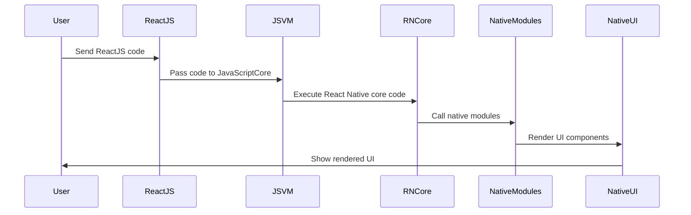

                 

  
React Native 是由 Facebook 开发的一种用于构建原生移动应用程序的开源框架，它允许开发者使用 JavaScript 和 React 的语法来编写应用，同时又能保证跨平台的一致性。随着移动设备的普及和需求的增加，React Native 成为了开发者们构建跨平台移动应用程序的首选工具之一。

## 文章关键词

React Native、跨平台、移动应用程序、JavaScript、React、原生开发

## 文摘

本文将深入探讨 React Native 的核心概念、开发流程、应用场景以及未来发展趋势。我们将从 React Native 的起源和发展历程开始，逐步深入到其技术架构、核心算法原理和实际应用案例，最后展望其未来的发展方向和面临的挑战。

---

## 1. 背景介绍

随着移动互联网的快速发展，移动应用程序的需求日益增加。传统的原生开发方式需要针对 iOS 和 Android 平台分别编写代码，这不仅增加了开发成本，也延长了开发周期。为了解决这一问题，Facebook 在2015年推出了 React Native，这是一种允许开发者使用 JavaScript 和 React 语法来编写一次代码，同时能够在多个平台上运行的框架。

React Native 的出现，不仅提高了开发效率，还保证了应用程序在不同平台上的用户体验一致性。它利用了 React 的虚拟 DOM 和组件化设计思想，使得开发者可以以更简洁的方式创建复杂的用户界面。

## 2. 核心概念与联系

### 2.1 React Native 的核心概念

React Native 的核心概念主要包括组件化开发、JavaScriptCore 引擎、原生模块以及原生渲染等。

#### 组件化开发

React Native 采用组件化开发的方式，将应用程序拆分成一个个可复用的组件。这种设计思想不仅提高了代码的可维护性，还使得组件的重用变得更加容易。

#### JavaScriptCore 引擎

React Native 使用 JavaScriptCore 引擎来执行 JavaScript 代码，这使得开发者能够使用 JavaScript 来编写应用程序的逻辑。JavaScriptCore 引擎与原生代码相互协作，使得 React Native 应用能够在原生平台上高效运行。

#### 原生模块

原生模块是 React Native 中用于调用原生代码的接口。通过原生模块，开发者可以访问原生 API，实现一些 React Native 自身无法直接实现的复杂功能。

#### 原生渲染

React Native 采用原生渲染技术，这使得应用程序在渲染性能上与原生应用相差无几。原生渲染通过原生视图组件来实现，从而保证了应用程序的流畅度和响应速度。

### 2.2 架构原理与 Mermaid 流程图

React Native 的架构可以分为三个主要部分：JavaScript 虚拟机、原生模块和原生渲染引擎。



通过上述流程图，我们可以看到，React Native 在执行 JavaScript 代码的过程中，会经过 JavaScriptCore 引擎、React Native 核心代码、原生模块以及原生渲染引擎，最终将渲染结果展示给用户。

## 3. 核心算法原理 & 具体操作步骤

### 3.1 算法原理概述

React Native 的核心算法原理主要涉及虚拟 DOM、组件生命周期、事件处理等方面。

#### 虚拟 DOM

React Native 使用虚拟 DOM 来实现高效的 UI 渲染。虚拟 DOM 是一种内存中的数据结构，用于表示实际的 DOM 结构。当组件的状态或属性发生变化时，React Native 会根据虚拟 DOM 与实际 DOM 的差异，只更新变化的部分，从而避免不必要的重渲染，提高渲染性能。

#### 组件生命周期

React Native 的组件具有明确的生命周期，包括组件的创建、挂载、更新和卸载等阶段。在不同的生命周期阶段，组件会触发不同的生命周期函数，使得开发者可以方便地执行一些初始化、更新或清理操作。

#### 事件处理

React Native 通过事件系统来处理用户交互。开发者可以为组件绑定事件处理器，当用户与组件交互时，事件处理器会被触发，从而实现相应的功能。

### 3.2 算法步骤详解

#### 虚拟 DOM 渲染

1. ReactJS 代码经过 Babel 转译，生成 React Native 代码。
2. React Native 代码被解析为虚拟 DOM 树。
3. 虚拟 DOM 树与实际 DOM 树进行比对，找出差异。
4. 更新实际 DOM 树，只更新变化的部分。

#### 组件生命周期

1. 创建组件：实例化组件，初始化状态和属性。
2. 挂载组件：将组件插入到 DOM 树中，并初始化渲染。
3. 更新组件：当组件的状态或属性发生变化时，重新渲染组件。
4. 卸载组件：将组件从 DOM 树中移除，并清理相关资源。

#### 事件处理

1. 绑定事件处理器：为组件绑定事件处理器，如点击、滑动等。
2. 事件冒泡：当事件触发时，事件会从组件的父元素开始向上冒泡。
3. 事件处理：调用事件处理器，执行相应的功能。

### 3.3 算法优缺点

#### 优点

1. 高效的虚拟 DOM 渲染，提高渲染性能。
2. 组件化开发，提高代码可维护性和复用性。
3. 原生渲染，保证应用程序的流畅度和响应速度。
4. 跨平台支持，减少开发成本。

#### 缺点

1. JavaScript 代码性能不如原生代码，尤其是在复杂场景下。
2. 原生模块调用较为复杂，需要一定的原生开发经验。
3. React Native 社区相对于原生社区较小，资源相对较少。

### 3.4 算法应用领域

React Native 主要适用于以下场景：

1. 跨平台移动应用程序开发，如电商平台、社交应用等。
2. 原生应用中需要集成 JavaScript 功能的部分。
3. 需要快速迭代和原型设计的项目。

---

## 4. 数学模型和公式 & 详细讲解 & 举例说明

React Native 的核心算法原理涉及到多个数学模型和公式。以下是其中的几个关键模型和公式的详细讲解。

### 4.1 数学模型构建

React Native 的虚拟 DOM 渲染过程中，涉及到以下数学模型：

1. **虚拟 DOM 树**：表示组件的虚拟 DOM 结构。
2. **DOM 差异树**：表示虚拟 DOM 树与实际 DOM 树的差异。
3. **重渲染函数**：用于计算 DOM 差异树并更新实际 DOM 树。

### 4.2 公式推导过程

以下是虚拟 DOM 树与实际 DOM 树差异的计算过程：

假设虚拟 DOM 树为 $T_v$，实际 DOM 树为 $T_r$，则 DOM 差异树 $T_d$ 可以通过以下公式计算：

$$
T_d = T_v \land T_r
$$

其中，$\land$ 表示交运算，用于找出虚拟 DOM 树和实际 DOM 树的差异节点。

### 4.3 案例分析与讲解

假设我们有一个简单的虚拟 DOM 树和实际 DOM 树，如下所示：

```json
虚拟 DOM 树：
{
  "type": "div",
  "props": {
    "className": "container"
  },
  "children": [
    {
      "type": "h1",
      "props": {
        "className": "title"
      },
      "children": "Hello React Native!"
    }
  ]
}

实际 DOM 树：
<div class="container">
  <h1 class="title">Hello React Native!</h1>
</div>
```

通过计算，我们可以得到 DOM 差异树：

```json
DOM 差异树：
{
  "type": "div",
  "props": {
    "className": "container"
  },
  "children": [
    {
      "type": "h1",
      "props": {
        "className": "title"
      },
      "children": "Hello React Native!"
    }
  ]
}
```

根据 DOM 差异树，我们可以更新实际 DOM 树，只更新差异部分，从而实现高效的渲染。

## 5. 项目实践：代码实例和详细解释说明

### 5.1 开发环境搭建

要开始使用 React Native 开发应用程序，我们需要首先搭建开发环境。以下是开发环境的搭建步骤：

1. 安装 Node.js：访问 [Node.js 官网](https://nodejs.org/)，下载并安装 Node.js。
2. 安装 Watchman：Watchman 是 Facebook 开发的一种用于监控文件变化的工具，它可以提高 React Native 的开发效率。在终端中执行以下命令安装 Watchman：

   ```sh
   brew install watchman
   ```

3. 安装 React Native CLI：React Native CLI 是用于初始化 React Native 项目和运行应用程序的命令行工具。在终端中执行以下命令安装：

   ```sh
   npm install -g react-native-cli
   ```

4. 创建一个新的 React Native 项目：在终端中执行以下命令创建一个新的 React Native 项目：

   ```sh
   react-native init MyReactNativeApp
   ```

5. 进入项目目录，并启动开发服务器：

   ```sh
   cd MyReactNativeApp
   react-native start
   ```

6. 打开浏览器，访问 [localhost:8081](http://localhost:8081/)，查看应用程序的运行效果。

### 5.2 源代码详细实现

以下是一个简单的 React Native 应用程序示例，它包含一个标题和一个文本段落：

```jsx
// App.js
import React from 'react';
import { View, Text, StyleSheet } from 'react-native';

const App = () => {
  return (
    <View style={styles.container}>
      <Text style={styles.title}>React Native 应用程序</Text>
      <Text style={styles.text}>这是一个跨平台的移动应用程序。</Text>
    </View>
  );
};

const styles = StyleSheet.create({
  container: {
    flex: 1,
    justifyContent: 'center',
    alignItems: 'center',
  },
  title: {
    fontSize: 24,
    fontWeight: 'bold',
  },
  text: {
    fontSize: 18,
  },
});

export default App;
```

### 5.3 代码解读与分析

在上面的示例代码中，我们定义了一个名为 `App` 的 React 函数组件。组件中包含了一个 `View` 容器和两个 `Text` 文本组件。`View` 容器用于容纳其他子组件，并设置了 `flex`、`justifyContent` 和 `alignItems` 属性，使得文本组件居中显示。`Text` 组件用于显示文本内容，并设置了 `fontSize` 和 `fontWeight` 属性，以使文本更加美观。

通过上述代码，我们可以创建一个简单的 React Native 应用程序，并实现跨平台的移动应用开发。

### 5.4 运行结果展示

在完成代码编写后，我们可以在 Android 和 iOS 平台上分别运行应用程序，查看运行效果。

在 Android 平台上，我们首先需要安装 Android Studio，并创建一个 Android 项目。然后，将 React Native 项目中的 `android/app/src/main` 目录下的 `AndroidManifest.xml` 文件和 `MainActivity.java` 文件替换为 Android 项目的相应文件。最后，在 Android Studio 中运行应用程序。

在 iOS 平台上，我们需要使用 Xcode 创建一个 iOS 项目，并将 React Native 项目中的 `ios/MyReactNativeApp.xcodeproj` 目录下的文件替换为 iOS 项目的相应文件。然后，在 Xcode 中运行应用程序。

无论是 Android 还是 iOS 平台，应用程序的运行效果都将与我们在开发环境中看到的效果一致。

## 6. 实际应用场景

React Native 在实际应用中具有广泛的应用场景，以下是一些典型的应用案例：

1. **电商平台**：React Native 可以用于构建跨平台的电商平台，如拼多多、京东等。这种架构不仅提高了开发效率，还保证了应用程序在不同平台上的用户体验一致性。

2. **社交应用**：React Native 适用于构建社交类应用程序，如微信、QQ 等。通过 React Native，开发者可以快速开发出跨平台的社交功能，同时保证应用的性能和稳定性。

3. **金融应用**：React Native 可以用于构建金融类应用程序，如支付宝、微信支付等。通过 React Native，开发者可以方便地集成各种金融功能，同时保证应用程序的安全性。

4. **娱乐应用**：React Native 适用于构建娱乐类应用程序，如抖音、快手等。通过 React Native，开发者可以快速实现视频播放、直播等功能，同时保证应用的流畅度和用户体验。

5. **教育应用**：React Native 可以用于构建教育类应用程序，如在线课程、学习平台等。通过 React Native，开发者可以方便地开发出跨平台的在线教育功能，同时保证应用程序的易用性。

---

## 7. 工具和资源推荐

### 7.1 学习资源推荐

1. **官方文档**：React Native 的官方文档是学习 React Native 的最佳资源。它详细介绍了 React Native 的核心概念、API 和最佳实践。

   [React Native 官方文档](https://reactnative.dev/docs/getting-started)

2. **《React Native 进阶指南》**：这是一本由 React Native 社区推荐的进阶书籍，涵盖了 React Native 的高级应用和实践。

   [《React Native 进阶指南》](https://www.reactnative.cn/docs/)

3. **《React Native 快速上手》**：这是一本适合初学者的 React Native 教程，以通俗易懂的方式介绍了 React Native 的基本概念和开发流程。

   [《React Native 快速上手》](https://www.reactnative.cn/docs/getting-started)

### 7.2 开发工具推荐

1. **Android Studio**：Android Studio 是官方推荐的 Android 开发工具，它提供了丰富的功能，如代码编辑、调试、模拟器等。

   [Android Studio](https://developer.android.com/studio)

2. **Xcode**：Xcode 是官方推荐的 iOS 开发工具，它提供了强大的 UI 设计工具和编译器。

   [Xcode](https://developer.apple.com/xcode/)

3. **React Native CLI**：React Native CLI 是用于初始化 React Native 项目和运行应用程序的命令行工具。

   [React Native CLI](https://reactnative.dev/docs/cli)

### 7.3 相关论文推荐

1. **《React Native 的性能优化》**：本文详细分析了 React Native 的性能瓶颈和优化策略。

   [《React Native 的性能优化》](https://engineering.reactjs.org/blog/2018/06/12/performance-optimization)

2. **《React Native 的未来趋势》**：本文探讨了 React Native 在未来可能的发展方向和趋势。

   [《React Native 的未来趋势》](https://www.infoq.com/news/react-native-trends-2019/)

3. **《React Native 与原生开发的比较》**：本文对比了 React Native 和原生开发的优缺点，为开发者提供了选择框架的参考。

   [《React Native 与原生开发的比较》](https://www.smashingmagazine.com/2017/05/react-native-native-development/)

## 8. 总结：未来发展趋势与挑战

### 8.1 研究成果总结

React Native 自推出以来，受到了广大开发者的欢迎。它不仅提高了开发效率，还保证了应用程序在不同平台上的用户体验一致性。通过虚拟 DOM、组件化开发等技术，React Native 实现了高效的渲染和良好的代码复用性。

### 8.2 未来发展趋势

1. **性能优化**：随着 React Native 的不断发展和优化，其性能将逐步接近原生应用。未来，React Native 可能会引入更多的原生渲染技术，以提高渲染性能。

2. **生态完善**：随着 React Native 的发展，其生态系统也将不断完善。未来，我们将看到更多的第三方库和工具支持 React Native，为开发者提供更多的便利。

3. **跨平台融合**：React Native 可能会与其他跨平台框架，如 Flutter、Xamarin 等，进行融合，形成更为强大的跨平台开发解决方案。

### 8.3 面临的挑战

1. **JavaScript 性能**：虽然 React Native 在性能方面有所优化，但 JavaScript 代码的性能仍不如原生代码。未来，如何进一步提高 JavaScript 的性能，是 React Native 面临的一个挑战。

2. **原生模块开发**：React Native 的原生模块开发相对复杂，需要开发者具备一定的原生开发经验。未来，如何简化原生模块的开发流程，是 React Native 需要解决的一个问题。

3. **社区支持**：尽管 React Native 社区日益壮大，但相对于原生社区，其资源和支持仍有一定差距。未来，如何进一步扩大社区规模，提高社区活跃度，是 React Native 需要关注的一个方面。

### 8.4 研究展望

React Native 作为一种新兴的跨平台开发框架，具有巨大的发展潜力。未来，随着技术的不断进步和社区的壮大，React Native 将在移动应用开发领域发挥越来越重要的作用。同时，我们也期待 React Native 能够在性能、开发体验和社区支持等方面取得更大的突破。

---

## 9. 附录：常见问题与解答

### 9.1 如何解决 React Native 应用程序在 iOS 上的编译问题？

当遇到 React Native 应用程序在 iOS 上编译失败时，可以尝试以下方法：

1. 确保已安装最新版本的 Xcode 和 React Native SDK。
2. 检查 iOS 项目中的配置文件，确保 `Podfile` 和 `Info.plist` 配置正确。
3. 如果是 React Native CLI 创建的项目，尝试使用 `react-native upgrade` 命令更新项目依赖。
4. 查看编译过程中的错误信息，根据错误信息进行相应的调试和修复。

### 9.2 如何优化 React Native 应用程序的渲染性能？

优化 React Native 应用程序的渲染性能可以从以下几个方面入手：

1. 使用纯 JavaScript 实现复杂的计算和动画，避免在渲染过程中进行。
2. 避免使用过度嵌套的组件，简化组件结构。
3. 使用 React Native 的 `FlatList` 和 `SectionList` 组件来优化列表渲染。
4. 使用 `requestAnimationFrame` 函数来优化动画效果。

### 9.3 如何解决 React Native 应用程序在 Android 上的启动延迟问题？

解决 React Native 应用程序在 Android 上的启动延迟问题可以尝试以下方法：

1. 减少启动时加载的 JavaScript 代码量。
2. 使用 React Native 的 `AppRegistry` 模块，在主线程中延迟加载主组件。
3. 使用 Android Studio 的 Profiler 工具分析启动流程，找出并优化性能瓶颈。

---

作者：禅与计算机程序设计艺术 / Zen and the Art of Computer Programming

