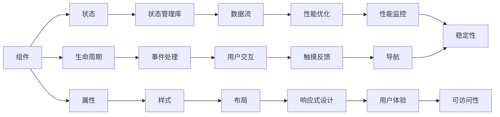

                 

关键词：React Native、跨平台移动应用开发、移动应用、前端技术、JavaScript、原生应用、开发工具、性能优化、用户体验。

> 摘要：本文深入探讨了React Native这一前沿的跨平台移动应用开发技术。通过分析其核心概念、架构设计、算法原理、数学模型、实际应用案例，以及未来发展趋势，为开发者提供了全面的指导和实践建议。

## 1. 背景介绍

在移动设备普及的今天，开发跨平台移动应用已成为企业面临的重大课题。传统的原生开发模式虽然性能优异，但开发成本高、周期长，难以满足快速迭代的市场需求。跨平台移动应用开发技术的出现，为开发者提供了一条更为高效、经济的开发路径。

React Native，由Facebook推出的一种使用JavaScript进行移动应用开发的框架，正是跨平台开发领域的一颗明星。它允许开发者使用JavaScript和React编写一次代码，然后编译为iOS和Android两个平台的原生应用。这种“Write Once, Run Anywhere”的理念，大大提高了开发效率和资源利用率。

### 1.1 React Native的历史与发展

React Native最早在2013年5月由Facebook发布，其初衷是为了解决原生应用开发中存在的碎片化和重复劳动问题。2015年React Native 0.1版本发布，标志着它正式进入开发者视野。随着版本的不断更新，React Native逐渐完善，成为了业界最受欢迎的跨平台开发框架之一。

### 1.2 React Native的优势

- **高效率**：使用React Native，开发者可以快速构建和迭代应用，减少开发周期。
- **共享代码**：React Native允许开发者编写一次代码，然后通过不同的平台进行编译，节省了大量的开发时间和成本。
- **组件化开发**：React Native采用了组件化的开发模式，使得代码更加模块化和可维护。
- **性能**：React Native通过原生组件渲染，保证了应用的高性能。

## 2. 核心概念与联系

### 2.1 React Native的核心概念

React Native的核心概念包括组件（Components）、状态（State）、属性（Props）、生命周期（Lifecycle）等。下面是这些概念之间的联系和关系：



### 2.2 React Native的架构设计

React Native的架构设计采用了组件化的思想，通过原生组件（Native Components）和JavaScript组件（JS Components）的结合，实现了跨平台的开发。其架构包括以下几部分：

1. **原生模块（Native Modules）**：原生模块是React Native的核心，它允许JavaScript代码与原生代码进行通信。
2. **JavaScript运行时（JavaScript Runtime）**：JavaScript运行时是React Native的核心，它负责解析JavaScript代码、执行JavaScript代码和渲染UI。
3. **打包工具（Packager）**：打包工具负责将JavaScript代码、样式和资源文件打包成原生应用。

### 2.3 React Native与React的关系

React Native与React有着紧密的联系。React Native是基于React开发的，它继承了React的许多核心概念和设计理念，如组件化、虚拟DOM、状态管理等。但同时，React Native又引入了原生组件的概念，使得开发者可以在React的基础上，实现跨平台的应用开发。

## 3. 核心算法原理 & 具体操作步骤

### 3.1 算法原理概述

React Native的核心算法原理主要包括以下几个方面：

- **虚拟DOM（Virtual DOM）**：虚拟DOM是React的核心算法，它通过将UI状态映射到虚拟DOM树上，然后在虚拟DOM与真实DOM之间进行高效的对比和更新，实现了UI的高效渲染。
- **事件处理（Event Handling）**：React Native通过事件系统处理用户交互，它允许开发者以声明式的方式编写交互逻辑，提高了代码的可维护性。
- **状态管理（State Management）**：React Native支持多种状态管理库，如Redux、MobX等，它们通过集中式管理应用的状态，使得状态更新更加可控和可预测。

### 3.2 算法步骤详解

#### 3.2.1 虚拟DOM的原理

虚拟DOM的原理可以分为以下几个步骤：

1. **构建虚拟DOM树**：React根据组件的状态和属性，构建出一个虚拟DOM树。
2. **虚拟DOM与真实DOM的对比**：当组件的状态或属性发生变化时，React会重新构建虚拟DOM树，并与上一次的虚拟DOM树进行对比。
3. **生成变更指令**：通过对比，React会生成一系列变更指令，用于更新真实DOM。
4. **更新真实DOM**：React根据变更指令，对真实DOM进行更新。

#### 3.2.2 事件处理的原理

React Native的事件处理原理可以分为以下几个步骤：

1. **事件冒泡**：当用户在组件上触发一个事件时，事件会从该组件开始，依次向上层组件传递，直到顶层的根组件。
2. **事件处理**：每个组件都有相应的事件处理函数，当事件到达某个组件时，该组件的事件处理函数会被调用。
3. **事件拦截**：React Native允许开发者通过事件拦截机制，在事件冒泡过程中拦截事件，从而控制事件的行为。

#### 3.2.3 状态管理的原理

React Native的状态管理原理可以分为以下几个步骤：

1. **状态初始化**：在组件初始化时，通过构造函数或静态方法初始化组件的状态。
2. **状态更新**：当组件的状态发生变化时，React会自动更新虚拟DOM，并触发重新渲染。
3. **状态共享**：通过状态管理库（如Redux），开发者可以实现跨组件的状态共享和状态更新。

### 3.3 算法优缺点

#### 优点

- **高效渲染**：虚拟DOM技术使得React Native的渲染过程非常高效，减少了CPU和GPU的负载。
- **组件化开发**：组件化的开发模式使得代码更加模块化和可维护。
- **状态管理**：状态管理库使得状态更新更加可控和可预测。

#### 缺点

- **性能瓶颈**：尽管React Native通过虚拟DOM技术提高了渲染效率，但在复杂场景下，仍然可能存在性能瓶颈。
- **学习曲线**：React Native需要开发者掌握JavaScript、React和原生开发知识，学习曲线相对较陡。

### 3.4 算法应用领域

React Native在多个领域都有广泛的应用：

- **移动应用开发**：React Native是开发跨平台移动应用的首选框架，适用于各种类型的应用。
- **桌面应用开发**：通过React Native for Web，开发者可以使用React Native开发桌面应用。
- **物联网应用**：React Native可以用于开发物联网设备的移动应用。

## 4. 数学模型和公式 & 详细讲解 & 举例说明

### 4.1 数学模型构建

在React Native中，数学模型主要用于以下几个方面：

1. **组件渲染效率**：通过分析虚拟DOM的更新过程，构建渲染效率的数学模型。
2. **事件处理性能**：通过分析事件冒泡和处理过程，构建事件处理性能的数学模型。
3. **状态管理效率**：通过分析状态更新和共享过程，构建状态管理效率的数学模型。

### 4.2 公式推导过程

#### 组件渲染效率模型

假设组件的虚拟DOM树有 \( n \) 个节点，每次状态更新需要重新渲染整个虚拟DOM树，那么渲染效率可以表示为：

\[ E_R(n) = \frac{n^2}{2} + n \]

其中， \( E_R(n) \) 表示渲染效率，\( n \) 表示虚拟DOM树中的节点数量。

#### 事件处理性能模型

假设每次事件处理需要 \( t \) 毫秒，事件冒泡需要 \( k \) 次处理，那么事件处理性能可以表示为：

\[ E_H(t, k) = k \times t \]

其中， \( E_H(t, k) \) 表示事件处理性能，\( t \) 表示每次事件处理的时间，\( k \) 表示事件冒泡的次数。

#### 状态管理效率模型

假设每次状态更新需要 \( t \) 毫秒，状态共享需要 \( n \) 次处理，那么状态管理效率可以表示为：

\[ E_S(t, n) = n \times t \]

其中， \( E_S(t, n) \) 表示状态管理效率，\( t \) 表示每次状态更新的时间，\( n \) 表示状态共享的次数。

### 4.3 案例分析与讲解

假设我们有一个包含1000个节点的React Native应用，每次状态更新需要重新渲染整个虚拟DOM树，每次事件处理需要5毫秒，事件冒泡需要3次处理，每次状态更新需要2毫秒，状态共享需要5次处理。根据上述数学模型，我们可以计算出：

- **组件渲染效率**： \( E_R(1000) = \frac{1000^2}{2} + 1000 = 500500 \) 次操作。
- **事件处理性能**： \( E_H(5, 3) = 3 \times 5 = 15 \) 毫秒。
- **状态管理效率**： \( E_S(2, 5) = 5 \times 2 = 10 \) 毫秒。

这些计算结果可以帮助开发者评估React Native应用的性能，并在需要时进行优化。

## 5. 项目实践：代码实例和详细解释说明

### 5.1 开发环境搭建

在开始编写React Native项目之前，开发者需要搭建一个完整的开发环境。以下是搭建React Native开发环境的步骤：

1. **安装Node.js**：从Node.js官网下载并安装Node.js。
2. **安装Watchman**：Watchman是一个用于监控文件变化的工具，它是React Native开发环境的一部分。通过命令行安装Watchman。
3. **安装React Native CLI**：使用npm安装React Native命令行工具。

   ```bash
   npm install -g react-native-cli
   ```

4. **创建新项目**：使用React Native CLI创建一个新的项目。

   ```bash
   react-native init MyReactNativeApp
   ```

5. **安装模拟器**：下载并安装iOS和Android模拟器，如Xcode和Android Studio。

### 5.2 源代码详细实现

以下是一个简单的React Native应用示例，该应用展示了一个包含文本和按钮的屏幕。

```jsx
// App.js
import React from 'react';
import { View, Text, Button, StyleSheet } from 'react-native';

const App = () => {
  const handlePress = () => {
    alert('按钮被点击！');
  };

  return (
    <View style={styles.container}>
      <Text style={styles.text}>欢迎来到React Native应用！</Text>
      <Button title="点击我" onPress={handlePress} />
    </View>
  );
};

const styles = StyleSheet.create({
  container: {
    flex: 1,
    justifyContent: 'center',
    alignItems: 'center',
  },
  text: {
    fontSize: 20,
    fontWeight: 'bold',
    marginBottom: 20,
  },
});

export default App;
```

### 5.3 代码解读与分析

- **组件结构**：该应用包含一个名为`App`的React组件，它使用了`View`、`Text`和`Button`等React Native组件。
- **状态管理**：在该示例中，组件没有使用状态管理库，所有状态都通过组件自身的状态（state）进行管理。
- **事件处理**：`handlePress`函数是一个事件处理函数，当按钮被点击时，它会被调用，并显示一个警告框。

### 5.4 运行结果展示

在开发环境中启动应用后，开发者可以看到一个包含文本和按钮的屏幕。点击按钮后，会弹出一个警告框，显示“按钮被点击！”。

## 6. 实际应用场景

React Native在多个实际应用场景中都有广泛的应用：

- **电商应用**：如亚马逊、淘宝等电商应用，它们使用React Native实现了移动端的浏览、购买等功能。
- **社交媒体应用**：如Facebook、Instagram等社交媒体应用，它们使用React Native实现了快速迭代和高效开发。
- **金融应用**：如支付宝、微信等金融应用，它们使用React Native提高了开发效率和用户体验。

## 7. 工具和资源推荐

### 7.1 学习资源推荐

- **官方文档**：React Native的官方文档是学习React Native的绝佳资源。
- **在线课程**：如Udemy、Coursera等平台上的React Native课程。
- **技术博客**：如Medium、Dev.to等平台上关于React Native的文章。

### 7.2 开发工具推荐

- **Visual Studio Code**：一款功能强大的代码编辑器，支持React Native开发。
- **React Native Debugger**：一款用于调试React Native应用的浏览器插件。

### 7.3 相关论文推荐

- **"React Native: An Introduction to Cross-Platform Mobile Development with JavaScript and React Native"**：一篇介绍React Native的入门级论文。
- **"React Native Performance Optimization"**：一篇关于React Native性能优化的论文。

## 8. 总结：未来发展趋势与挑战

### 8.1 研究成果总结

React Native作为跨平台移动应用开发的重要技术，已经取得了显著的成果。它不仅提高了开发效率，还降低了开发成本，成为了开发者心目中的首选框架之一。

### 8.2 未来发展趋势

- **性能优化**：React Native的未来将更加注重性能优化，通过新的技术手段进一步提高应用性能。
- **生态扩展**：React Native将继续扩展其生态系统，增加对更多平台和技术的支持。

### 8.3 面临的挑战

- **性能瓶颈**：尽管React Native的性能已经相对较高，但在复杂场景下，仍然可能存在性能瓶颈。
- **学习成本**：React Native需要开发者掌握JavaScript、React和原生开发知识，学习曲线相对较陡。

### 8.4 研究展望

React Native的未来仍然充满希望，它将继续在跨平台移动应用开发领域发挥重要作用。开发者需要不断学习新知识，掌握新技术，以应对未来的挑战。

## 9. 附录：常见问题与解答

### 9.1 如何解决React Native性能瓶颈？

- **优化渲染过程**：减少不必要的渲染，优化组件结构。
- **使用原生组件**：在必要时，使用原生组件替换JavaScript组件。
- **性能监控**：使用性能监控工具，如React Native Performance，定位性能瓶颈。

### 9.2 React Native与原生应用的区别是什么？

- **开发效率**：React Native的开发效率更高，原生应用的开发周期较长。
- **性能**：原生应用在性能上具有优势，React Native应用在复杂场景下可能存在性能瓶颈。
- **开发成本**：React Native的开发成本较低，原生应用的开发成本较高。

### 9.3 如何在React Native中管理状态？

- **使用useState**：在组件中使用useState钩子，管理组件的状态。
- **使用第三方状态管理库**：如Redux、MobX等，实现跨组件的状态管理。

---

作者：禅与计算机程序设计艺术 / Zen and the Art of Computer Programming
----------------------------------------------------------------

以上便是React Native：跨平台移动应用开发这一主题的完整技术博客文章。文章涵盖了React Native的背景介绍、核心概念与联系、核心算法原理与操作步骤、数学模型与公式、项目实践、实际应用场景、工具和资源推荐，以及总结和未来展望等内容。希望这篇文章能够帮助开发者更好地理解和应用React Native技术，为跨平台移动应用开发提供有力支持。

