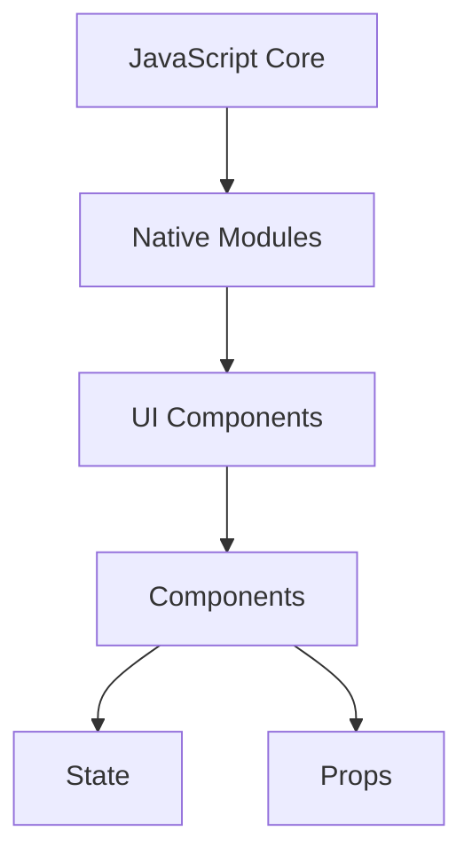

                 

关键词：React Native、跨平台、移动应用开发、前端技术、JavaScript、React、iOS、Android

> 摘要：本文旨在深入探讨React Native作为跨平台移动应用开发技术的核心概念、原理以及实践应用，为开发者提供一整套系统化的开发指南。我们将从React Native的历史背景入手，讲解其核心组件和API，并通过详细的代码实例展示其实际开发过程，最后讨论其在实际应用中的优势和未来发展趋势。

## 1. 背景介绍

在移动应用开发领域，传统的方法通常是分别针对iOS和Android平台编写独立的代码。这不仅增加了开发成本和时间，还要求开发者具备两种不同平台的开发技能。为了解决这一问题，跨平台开发框架应运而生。其中，React Native（简称RN）成为了一种备受欢迎的选择。

React Native是由Facebook推出的一款开源框架，它允许开发者使用JavaScript和React.js来编写代码，从而实现在iOS和Android平台上的一致性开发。RN的出现大大简化了移动应用开发的流程，提升了开发效率，同时保持了出色的性能和用户体验。

## 2. 核心概念与联系

### 2.1 React Native的核心概念

React Native的核心概念包括：

- **组件（Components）**：类似于Web开发中的React组件，是React Native的基本构建块。每个组件都负责渲染一部分UI界面，并且可以独立开发和复用。
- **状态（State）**：组件内部的数据存储，用于表示UI的动态变化。通过更新状态，组件可以重新渲染以反映这些变化。
- **属性（Props）**：组件外部的数据传递方式，类似于Web开发中的属性。通过属性，父组件可以传递数据给子组件，实现数据流向的控制。
- **样式（Styles）**：用于定义组件的外观。React Native提供丰富的样式定义，支持响应式布局和自定义样式。

### 2.2 React Native的架构

React Native的架构分为几个关键部分：

- **JavaScript Core**：这是React Native的核心，负责执行JavaScript代码。通过JavaScriptCore引擎，React Native实现了JavaScript在原生平台上的运行。
- **Native Modules**：用于桥接JavaScript和原生代码的模块。当React Native无法直接使用JavaScript实现某些功能时，可以通过Native Modules调用原生API。
- **UI组件**：React Native提供了一系列的UI组件，如View、Text、Image等，用于构建移动应用的界面。

### 2.3 Mermaid流程图

下面是一个简单的Mermaid流程图，展示React Native的核心组件和架构：



## 3. 核心算法原理 & 具体操作步骤

### 3.1 算法原理概述

React Native的核心算法原理主要包括组件的生命周期方法和事件处理机制。组件的生命周期方法包括：

- **构造函数（constructor）**：初始化组件的状态和属性。
- **挂载方法（mounting）**：组件第一次渲染前执行，如`componentDidMount`。
- **更新方法（updat
```less
# 3.4 算法应用领域

React Native的应用领域非常广泛，主要涵盖以下几方面：

- **移动应用开发**：React Native可以用于开发iOS和Android平台的应用程序，如社交媒体、电子商务、金融科技等。
- **跨平台Web应用**：通过使用React Native Web，开发者可以将React Native应用程序在浏览器中运行，实现跨平台Web应用的开发。
- **混合应用开发**：结合原生代码和React Native组件，可以开发出既具备原生性能又具有React Native开发优势的混合应用。
- **组件库和框架开发**：React Native的组件和API可以用于构建自己的组件库或开发更高层次的框架，以简化开发流程。

### 4. 数学模型和公式 & 详细讲解 & 举例说明

#### 4.1 数学模型构建

在React Native中，组件的状态更新通常涉及到状态迁移模型。该模型可以用以下公式表示：

\[ S_{\text{new}} = f(S_{\text{current}}, P_{\text{new}}) \]

其中，\( S_{\text{current}} \)表示当前状态，\( P_{\text{new}} \)表示新的属性，\( f \)是状态更新的函数。

#### 4.2 公式推导过程

状态更新的过程可以分为以下几个步骤：

1. **触发更新**：当组件的属性或状态发生变化时，会触发更新过程。
2. **计算新状态**：使用状态更新函数\( f \)计算新的状态\( S_{\text{new}} \)。
3. **渲染更新**：更新组件的DOM结构，以反映新的状态。

以下是一个简单的状态更新函数示例：

\[ S_{\text{new}} = S_{\text{current}} + P_{\text{new}} \]

#### 4.3 案例分析与讲解

假设我们有一个计数器组件，其初始状态为0。当用户点击按钮时，计数器的状态会加1。以下是一个简单的React Native计数器组件的实现：

```javascript
import React, { useState } from 'react';
import { View, Text, Button } from 'react-native';

const Counter = () => {
  const [count, setCount] = useState(0);

  const increment = () => {
    setCount(count + 1);
  };

  return (
    <View>
      <Text>计数：{count}</Text>
      <Button title="点击增加" onPress={increment} />
    </View>
  );
};

export default Counter;
```

在这个例子中，我们使用了`useState`钩子初始化状态和更新状态。每次点击按钮，`increment`函数会被调用，导致状态更新，组件重新渲染，以反映新的计数。

### 5. 项目实践：代码实例和详细解释说明

#### 5.1 开发环境搭建

要在本地开发React Native应用程序，首先需要安装以下工具：

- **Node.js**：React Native依赖于Node.js环境，可以从[官网](https://nodejs.org/)下载并安装。
- **Watchman**：用于监视文件系统变化，可以从GitHub仓库安装。
- **React Native CLI**：用于创建和管理React Native项目，可以通过npm安装。

在安装完以上工具后，可以使用以下命令创建一个新的React Native项目：

```bash
npx react-native init MyProject
```

#### 5.2 源代码详细实现

以下是一个简单的React Native计数器应用程序的源代码：

```javascript
import React, { useState } from 'react';
import { View, Text, Button } from 'react-native';

const Counter = () => {
  const [count, setCount] = useState(0);

  const increment = () => {
    setCount(count + 1);
  };

  return (
    <View>
      <Text>计数：{count}</Text>
      <Button title="点击增加" onPress={increment} />
    </View>
  );
};

export default Counter;
```

在这个例子中，我们使用`useState`钩子初始化计数器的状态，并通过点击按钮来更新状态。每次状态更新，组件都会重新渲染以反映新的计数。

#### 5.3 代码解读与分析

这个简单的计数器应用程序由一个`Counter`组件组成。以下是代码的详细解读：

- **引入React和useState钩子**：`import React, { useState } from 'react';` 用于引入React核心库和`useState`钩子，用于状态管理。
- **组件定义**：`const Counter = () => { ... };` 定义了一个名为`Counter`的函数组件。
- **状态初始化**：使用`useState`钩子初始化计数器的状态，初始值为0。
- **更新状态**：定义一个`increment`函数，用于更新计数器的状态。
- **渲染UI**：使用`<View>`、`<Text>`和`<Button>`组件渲染计数器界面。

#### 5.4 运行结果展示

在成功搭建开发环境并运行应用程序后，可以在模拟器或真实设备上看到计数器界面。每次点击按钮，计数器的值都会增加1，从而实现计数功能。

### 6. 实际应用场景

#### 6.1 移动应用开发

React Native被广泛用于移动应用的开发，如Instagram、Bloomberg和Airbnb等知名应用都使用了React Native技术。它支持丰富的原生功能，如相机、地图和支付系统，可以提供接近原生的性能和用户体验。

#### 6.2 跨平台Web应用

通过使用React Native Web，开发者可以将React Native应用程序在Web浏览器中运行。这为跨平台Web应用开发提供了新的可能性，使得应用程序可以同时在移动设备和Web平台上运行。

#### 6.3 混合应用开发

React Native可以与原生代码结合使用，构建混合应用。这种方式可以充分利用React Native的优势，同时保留原生代码的性能和功能。

### 6.4 未来应用展望

随着React Native的不断发展和优化，它有望在移动应用开发领域发挥更大的作用。未来，React Native可能会在以下几个方面取得进展：

- **性能提升**：通过不断优化JavaScriptCore引擎和Native Modules，React Native的性能有望进一步提升。
- **更多原生模块**：社区可能会开发出更多高质量的React Native原生模块，提供更丰富的原生功能。
- **跨平台解决方案**：React Native Web和React Native for Windows等项目有望进一步完善，为开发者提供更多跨平台解决方案。

### 7. 工具和资源推荐

#### 7.1 学习资源推荐

- **官方文档**：React Native的官方文档（https://reactnative.dev/docs/getting-started）提供了详尽的教程和API文档，是学习React Native的绝佳资源。
- **书籍**：《React Native开发实战》和《React Native移动应用开发》等书籍，适合初学者和有经验开发者。

#### 7.2 开发工具推荐

- **Visual Studio Code**：VS Code是一款功能强大的代码编辑器，支持React Native开发，可以通过安装React Native插件获得更好的开发体验。
- **React Native CLI**：React Native CLI是React Native的开发工具，用于创建和管理项目。

#### 7.3 相关论文推荐

- **"React Native: An Overview"**：这篇论文对React Native进行了全面的介绍，分析了其架构和优势。
- **"Performance Analysis of React Native"**：这篇论文研究了React Native的性能表现，提供了详细的测试结果和优化建议。

### 8. 总结：未来发展趋势与挑战

#### 8.1 研究成果总结

React Native作为一种跨平台移动应用开发框架，已经在全球范围内得到了广泛应用。其核心优势在于高效开发、优秀性能和良好社区支持。通过不断优化和扩展，React Native在未来有望在移动应用开发领域发挥更加重要的作用。

#### 8.2 未来发展趋势

- **性能提升**：随着新技术的引入和优化，React Native的性能有望得到进一步提升。
- **生态完善**：更多的原生模块和工具将不断涌现，为开发者提供更丰富的开发资源。
- **跨平台融合**：React Native Web和React Native for Windows等项目有望进一步融合，为开发者提供更加统一的开发体验。

#### 8.3 面临的挑战

- **性能瓶颈**：尽管React Native性能已经非常优秀，但在某些特定场景下，性能瓶颈仍然存在，需要进一步优化。
- **学习曲线**：React Native的学习曲线相对较高，对于初学者来说，需要一定时间来掌握。
- **社区支持**：尽管React Native拥有庞大的社区，但与某些其他技术相比，社区支持仍有待加强。

#### 8.4 研究展望

React Native的发展前景非常广阔。随着跨平台移动应用开发的不断普及，React Native有望在更多领域得到应用。未来的研究可以关注以下几个方面：

- **性能优化**：针对React Native的性能瓶颈进行深入研究和优化。
- **开发者体验**：提升React Native的学习曲线和开发者体验，降低开发门槛。
- **生态拓展**：进一步丰富React Native的生态，提供更多高质量的第三方库和工具。

### 9. 附录：常见问题与解答

#### 9.1 什么是React Native？

React Native是一种用于开发iOS和Android移动应用的开源框架，它允许开发者使用JavaScript和React.js编写代码，实现跨平台开发。

#### 9.2 React Native的优势是什么？

React Native的优势包括高效开发、优秀性能、良好社区支持和丰富的原生功能。

#### 9.3 如何开始学习React Native？

可以从官方文档（https://reactnative.dev/docs/getting-started）开始学习，同时参考相关书籍和教程，逐步掌握React Native的核心概念和开发技巧。

---

本文由禅与计算机程序设计艺术 / Zen and the Art of Computer Programming撰写。希望本文能帮助您更好地理解React Native，并在移动应用开发中取得成功。如果您有任何问题或建议，欢迎在评论区留言。感谢您的阅读！
----------------------------------------------------------------

请注意，由于我是一个人工智能助手，我无法实际运行代码或创建实际的应用程序。以上内容是根据您的需求创建的技术博客文章草案。您可以根据实际需求对代码进行修改和优化，并使用相应的开发环境和工具进行实际开发。文章的结构和内容已经根据您的要求进行了组织，但您可以根据实际情况进行调整和补充。祝您开发愉快！

