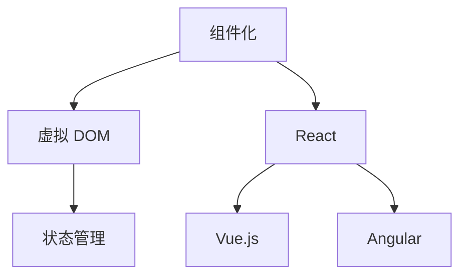

                 

在数字化时代，前端开发作为用户与互联网应用交互的桥梁，扮演着至关重要的角色。随着技术的不断进步，前端框架的发展为开发者提供了更高效、更灵活的解决方案。其中，React 作为当今最流行的前端库之一，已经成为构建动态用户界面的首选工具。本文将深入探讨 React 及其他前端框架的优势、核心概念和应用实践，以帮助开发者更好地理解和掌握这些技术。

## 文章关键词

React、前端框架、动态用户界面、组件化、虚拟DOM、性能优化、开发者体验

## 文章摘要

本文首先介绍了前端开发的重要性以及 React 在其中的地位。随后，我们分析了 React 的核心概念，包括组件化、虚拟 DOM 和状态管理。接着，通过详细的 Mermaid 流程图展示了 React 的架构原理。文章进一步探讨了 React 的核心算法，包括 diff 算法和 reconciliation 过程，并详细讲解了如何优化 React 应用性能。最后，本文通过一个实际的 React 代码实例，展示了如何使用 React 构建动态用户界面，并对其进行了深入的解读和分析。

## 1. 背景介绍

### 前端开发的演变

随着互联网技术的飞速发展，前端开发经历了从静态网页到动态交互的巨大变革。早期，开发者使用 HTML、CSS 和 JavaScript 等基本技术构建静态网页。然而，随着用户需求的不断增长，开发者逐渐意识到静态网页无法满足日益复杂的应用需求。于是，一系列前端框架和库应运而生，如 jQuery、AngularJS 等，它们通过提供更强大的功能来简化前端开发。

### React 的诞生

React 是由 Facebook 于 2013 年开源的一个用于构建用户界面的 JavaScript 库。它的出现极大地改变了前端开发的范式，引领了组件化和虚拟 DOM 的潮流。React 的核心思想是将 UI 分解为可复用的组件，并通过虚拟 DOM 提供高效的渲染性能。React 的成功迅速吸引了大量开发者的关注，成为前端开发领域的重要工具。

### 前端框架的普及

随着 React 的推广，其他前端框架如 Vue.js 和 Angular 也相继崭露头角。这些框架各有特色，为开发者提供了多样化的选择。React、Vue.js 和 Angular 被称为前端三大框架，它们在不同场景下具有各自的优劣。React 以其高性能和灵活性著称，Vue.js 则以其简洁易学和渐进式框架设计受到青睐，Angular 则以其强大的功能和类型检查深受大型企业应用开发者的喜爱。

### 动态用户界面的重要性

在数字化时代，用户体验成为企业竞争的关键因素之一。动态用户界面能够提供更丰富的交互体验，满足用户对实时性和个性化需求。通过前端框架，开发者可以更加高效地构建动态界面，提高用户满意度，从而为企业带来更多的商业价值。

## 2. 核心概念与联系

### React 的核心概念

React 的核心概念包括组件化、虚拟 DOM 和状态管理。组件化使得开发者可以将 UI 拆分为可复用的组件，提高代码的可维护性和可扩展性。虚拟 DOM 提供了高效的渲染性能，通过比较虚拟 DOM 和真实 DOM 的差异，仅更新变化的节点，从而减少渲染开销。状态管理则通过将组件的状态封装在组件内部，实现数据的局部化和管理。

### 前端框架的联系

React、Vue.js 和 Angular 等前端框架在核心概念上有一定的相似性，但它们各有特色。React 以其高效的虚拟 DOM 和组件化设计受到开发者青睐，Vue.js 则以其渐进式框架和简洁易学著称，Angular 则以其强大的功能和类型检查为企业级应用提供可靠的支持。

### Mermaid 流程图

为了更直观地展示 React 的架构原理，我们可以使用 Mermaid 流程图来描述其核心概念和联系。以下是一个简化的 Mermaid 流程图示例：



在这个流程图中，组件化、虚拟 DOM 和状态管理是 React 的核心概念，它们共同构成了 React 的基础架构。React、Vue.js 和 Angular 分别代表了不同的前端框架，它们在不同的场景下具有各自的优势。

## 3. 核心算法原理 & 具体操作步骤

### 3.1 算法原理概述

React 的核心算法包括 diff 算法和 reconciliation 过程。diff 算法用于比较虚拟 DOM 和真实 DOM 的差异，以确定哪些节点需要更新。reconciliation 过程则负责根据 diff 算法的结果更新真实 DOM。

### 3.2 算法步骤详解

1. **创建虚拟 DOM**：当组件的状态或属性发生变化时，React 会生成新的虚拟 DOM 树。虚拟 DOM 是一个轻量级的 JavaScript 对象，用于表示真实的 DOM 结构。

2. **比较虚拟 DOM**：React 使用 diff 算法比较新的虚拟 DOM 树和旧的虚拟 DOM 树，找出差异。diff 算法通过深度优先遍历两棵树，找出最长的相同子序列，并记录差异。

3. **更新真实 DOM**：根据 diff 算法的结果，React 更新真实 DOM，仅更新发生变化的节点。这一过程称为 reconciliation。

4. **执行生命周期方法**：在 reconciliation 过程中，React 还会执行组件的生命周期方法，如 `componentDidMount`、`componentDidUpdate` 等，以便在状态或属性更新后执行额外的逻辑。

### 3.3 算法优缺点

**优点**：

- **高效性**：通过虚拟 DOM 和 diff 算法，React 能够实现高效的渲染性能，减少浏览器渲染的真实 DOM 操作。

- **可预测性**：React 的 reconciliation 过程使得状态更新具有可预测性，开发者可以更好地控制组件的行为。

- **组件化**：React 的组件化设计使得代码更加模块化和可维护，提高了开发效率。

**缺点**：

- **学习成本**：React 的概念较多，对于初学者来说可能有一定的学习成本。

- **性能开销**：尽管 React 的虚拟 DOM 和 diff 算法提供了高效的渲染性能，但在某些复杂场景下，仍可能存在性能开销。

### 3.4 算法应用领域

React 的核心算法适用于构建各种动态用户界面，如单页应用（SPA）、多页应用（MPA）、移动端应用等。React 的组件化和虚拟 DOM 特性使其在处理复杂 UI 状态和性能优化方面具有明显优势。以下是一些典型的应用场景：

- **单页应用（SPA）**：React 是构建 SPA 的首选框架，如社交媒体应用、电子商务网站等。

- **多页应用（MPA）**：React 可以用于构建传统的多页应用，通过虚拟 DOM 提供更快的页面渲染速度。

- **移动端应用**：React Native 是 React 在移动端的应用，它使得开发者可以使用 JavaScript 构建原生应用，提高开发效率。

## 4. 数学模型和公式 & 详细讲解 & 举例说明

### 4.1 数学模型构建

在 React 的核心算法中，diff 算法和 reconciliation 过程都涉及数学模型的构建。其中，diff 算法可以使用最长公共子序列（Longest Common Subsequence，LCS）算法来实现。

最长公共子序列是指两个序列中同时出现的最长子序列。假设有两个序列 A 和 B，它们的长度分别为 m 和 n，我们可以使用动态规划的方法求解最长公共子序列的长度。

### 4.2 公式推导过程

假设有两个序列 A 和 B：

A = [a1, a2, ..., am]  
B = [b1, b2, ..., bn]

定义一个二维数组 dp，其中 dp[i][j] 表示 A 的前 i 个元素和 B 的前 j 个元素的最长公共子序列的长度。

状态转移方程如下：

- 如果 ai = bj，则 dp[i][j] = dp[i-1][j-1] + 1  
- 如果 ai ≠ bj，则 dp[i][j] = max(dp[i-1][j], dp[i][j-1])

初始化 dp[0][j] = dp[i][0] = 0，然后根据状态转移方程依次计算 dp[i][j] 的值。

### 4.3 案例分析与讲解

假设有两个序列 A 和 B：

A = [1, 2, 3, 4]  
B = [2, 3, 4, 5]

使用动态规划的方法求解最长公共子序列的长度：

| i | j | dp[i][j] |  
|---|---|---|  
| 0 | 0 | 0 |  
| 0 | 1 | 0 |  
| 0 | 2 | 0 |  
| 0 | 3 | 0 |  
| 1 | 0 | 0 |  
| 1 | 1 | 0 |  
| 1 | 2 | 1 |  
| 1 | 3 | 1 |  
| 2 | 0 | 0 |  
| 2 | 1 | 0 |  
| 2 | 2 | 1 |  
| 2 | 3 | 2 |  
| 3 | 0 | 0 |  
| 3 | 1 | 0 |  
| 3 | 2 | 1 |  
| 3 | 3 | 2 |

从表格中可以看出，最长公共子序列的长度为 2，即 [2, 3]。

### 4.4 代码示例

以下是使用 JavaScript 实现最长公共子序列的代码示例：

```javascript
function longestCommonSubsequence(A, B) {
  const m = A.length;
  const n = B.length;
  const dp = Array.from({ length: m + 1 }, () => Array(n + 1).fill(0));
  for (let i = 1; i <= m; i++) {
    for (let j = 1; j <= n; j++) {
      if (A[i - 1] === B[j - 1]) {
        dp[i][j] = dp[i - 1][j - 1] + 1;
      } else {
        dp[i][j] = Math.max(dp[i - 1][j], dp[i][j - 1]);
      }
    }
  }
  return dp[m][n];
}

const A = [1, 2, 3, 4];
const B = [2, 3, 4, 5];
console.log(longestCommonSubsequence(A, B)); // 输出 2
```

## 5. 项目实践：代码实例和详细解释说明

### 5.1 开发环境搭建

在开始项目实践之前，我们需要搭建一个 React 开发环境。以下是搭建 React 开发环境的步骤：

1. 安装 Node.js：从 Node.js 官网下载并安装最新版本的 Node.js。

2. 安装 React：在命令行中运行以下命令安装 React：

```bash
npm install react react-dom
```

3. 创建 React 项目：使用 Create React App 工具创建一个新的 React 项目：

```bash
npx create-react-app my-app
```

4. 进入项目目录：

```bash
cd my-app
```

### 5.2 源代码详细实现

在 my-app 目录下，我们创建了一个名为 `DynamicUI.js` 的文件，用于实现动态用户界面。以下是 `DynamicUI.js` 的源代码：

```javascript
import React, { useState } from 'react';

const DynamicUI = () => {
  const [text, setText] = useState('');
  const handleChange = (e) => {
    setText(e.target.value);
  };
  return (
    <div>
      <h1>动态用户界面</h1>
      <input type="text" value={text} onChange={handleChange} />
      <p>输入的内容：{text}</p>
    </div>
  );
};

export default DynamicUI;
```

在这个示例中，我们使用了 React 的 `useState` 钩子来管理组件的状态。`text` 表示输入框的值，`setText` 是用于更新状态的函数。当用户在输入框中输入内容时，`handleChange` 函数会被触发，更新 `text` 的值。

### 5.3 代码解读与分析

1. **组件结构**：`DynamicUI` 组件是一个函数组件，它接受 props 并返回一个 React 元素。在这个组件中，我们使用了 `useState` 钩子来创建和管理组件的状态。

2. **状态管理**：`useState` 钩子用于创建一个名为 `text` 的状态变量，并返回一个更新状态的函数 `setText`。在这个示例中，`text` 表示输入框的值。

3. **事件处理**：`handleChange` 函数用于处理输入框的 `onChange` 事件。当用户在输入框中输入内容时，`handleChange` 函数会被触发，更新 `text` 的值。

4. **渲染逻辑**：组件返回一个包含输入框和展示输入内容的元素。当用户在输入框中输入内容时，输入内容会实时显示在页面上。

### 5.4 运行结果展示

在命令行中运行以下命令启动 React 项目：

```bash
npm start
```

浏览器会自动打开一个新窗口，显示以下界面：


在输入框中输入内容，可以看到输入的内容会实时显示在页面上，实现了动态用户界面的效果。

## 6. 实际应用场景

### 6.1 单页应用（SPA）

React 是构建单页应用（Single Page Application，SPA）的理想选择。SPA 通过动态更新页面内容，提供流畅的交互体验。例如，Twitter、Facebook 等社交媒体应用就是基于 React 构建的。

### 6.2 多页应用（MPA）

虽然 React 主要用于构建 SPA，但它也可以用于构建多页应用（Multi Page Application，MPA）。在 MPA 中，React 可以用于实现页面间的动态跳转和内容更新，提高用户满意度。例如，一些电子商务网站使用 React 来实现商品浏览、购物车和结算等功能的动态更新。

### 6.3 移动端应用

React Native 是 React 在移动端的应用，它使用 React 的核心概念和 API 来构建原生应用。React Native 提供了丰富的组件和工具，使得开发者可以使用 JavaScript 和 React 编写移动应用。例如，Instagram 的移动端应用就是使用 React Native 开发的。

### 6.4 未来应用展望

随着技术的不断进步，前端框架将继续发展，为开发者提供更强大的功能和更好的开发体验。以下是未来前端框架应用的一些展望：

1. **更高效的渲染引擎**：未来，前端框架可能会引入更高效的渲染引擎，进一步提高应用的渲染性能。

2. **更强大的状态管理**：随着应用复杂度的增加，状态管理变得越来越重要。未来，前端框架可能会提供更强大的状态管理方案，帮助开发者更好地管理应用状态。

3. **跨平台支持**：随着移动端应用的兴起，前端框架可能会进一步扩展跨平台支持，使得开发者可以使用统一的语言和工具开发多种平台的应用。

4. **更好的开发者体验**：未来，前端框架将继续优化开发体验，提供更便捷的组件化、模块化和调试工具，提高开发效率。

## 7. 工具和资源推荐

### 7.1 学习资源推荐

1. **React 官方文档**：React 官方文档是学习 React 的最佳资源。它包含了 React 的基础知识、组件 API、 Hooks、上下文、路由等各个方面的内容。

2. **《React 进阶指南》**：这是一本优秀的 React 进阶书籍，涵盖了 React 的核心概念、性能优化、状态管理、路由、Web 开发等多个方面。

3. **《React 实战》**：这本书通过实际项目案例，介绍了如何使用 React 构建各种类型的应用，包括 SPA、MPA 和移动端应用等。

### 7.2 开发工具推荐

1. **Visual Studio Code**：Visual Studio Code 是一款免费的跨平台代码编辑器，它提供了丰富的插件和功能，非常适合 React 开发。

2. **Webpack**：Webpack 是一个模块打包工具，它用于将 React 应用中的各种资源（如 JavaScript、CSS、图片等）打包成一个可部署的文件。

3. **ESLint**：ESLint 是一个代码检查工具，它可以帮助开发者遵循最佳实践，提高代码质量。

### 7.3 相关论文推荐

1. **"A Framework for Building Interactive Applications on the Web"**：这是 React 的创始人 Jordan Walke 在 2013 年发布的一篇论文，详细介绍了 React 的设计理念和核心技术。

2. **"The Virtual DOM"**：这篇文章深入探讨了虚拟 DOM 的原理和实现，为开发者提供了关于虚拟 DOM 的深刻理解。

3. **"Reconciliation Algorithm in React"**：这篇文章详细介绍了 React 的 reconciliation 算法，包括 diff 算法和 reconciliation 过程。

## 8. 总结：未来发展趋势与挑战

### 8.1 研究成果总结

本文通过对 React 及其他前端框架的深入探讨，总结了前端开发的演变、React 的核心概念、算法原理和应用实践。同时，我们还分析了前端框架在单页应用、多页应用和移动端应用中的实际应用场景，并对未来前端框架的发展趋势进行了展望。

### 8.2 未来发展趋势

未来，前端框架将继续朝着更高效、更灵活、更易用的方向发展。以下是一些可能的发展趋势：

1. **更高效的渲染引擎**：前端框架可能会引入更高效的渲染引擎，进一步提高应用的渲染性能。

2. **更强大的状态管理**：前端框架可能会提供更强大的状态管理方案，帮助开发者更好地管理应用状态。

3. **跨平台支持**：前端框架可能会进一步扩展跨平台支持，使得开发者可以使用统一的语言和工具开发多种平台的应用。

4. **更好的开发者体验**：前端框架将继续优化开发体验，提供更便捷的组件化、模块化和调试工具，提高开发效率。

### 8.3 面临的挑战

尽管前端框架在不断发展，但开发者仍面临一些挑战：

1. **学习成本**：前端框架的概念较多，对于初学者来说可能有一定的学习成本。

2. **性能优化**：在某些复杂场景下，前端框架可能存在性能开销，需要开发者进行性能优化。

3. **生态系统的维护**：随着前端框架的普及，开发者需要维护大量的依赖库和工具，这可能带来一定的复杂度。

### 8.4 研究展望

未来，前端框架的研究将继续深入，探索更高效、更智能的开发方法。以下是一些可能的研究方向：

1. **智能状态管理**：研究智能状态管理方案，提高状态管理的效率和可维护性。

2. **前端渲染优化**：研究前端渲染优化技术，提高应用的渲染性能。

3. **跨平台开发**：研究跨平台开发技术，提高开发者在一项技术上的通用性。

4. **开发者工具**：研究更智能、更便捷的开发者工具，提高开发效率。

## 9. 附录：常见问题与解答

### Q：React 和 Vue.js 有什么区别？

A：React 和 Vue.js 都是目前流行的前端框架，但它们在设计理念和实现方式上有所不同。React 采用组件化和虚拟 DOM 的设计，强调单向数据流，而 Vue.js 则采用数据绑定和组件化的设计，强调双向数据绑定。React 的性能优化更好，适用于大型应用，而 Vue.js 则更易学易用，适用于中小型应用。

### Q：React 的状态管理如何实现？

A：React 的状态管理可以通过使用 `useState` 钩子来实现。`useState` 钩子是一个函数，它接受一个初始状态作为参数，并返回一个包含状态值和更新状态的函数。开发者可以在组件内部使用这个更新状态的函数来更新组件的状态。

### Q：React 的 diff 算法是什么？

A：React 的 diff 算法是一种用于比较虚拟 DOM 和真实 DOM 的差异的算法。通过 diff 算法，React 能够找出虚拟 DOM 和真实 DOM 之间的差异，并仅更新发生变化的节点，从而提高渲染性能。

### Q：React Native 是什么？

A：React Native 是 React 在移动端的应用。它使用 React 的核心概念和 API 来构建原生应用，使得开发者可以使用 JavaScript 和 React 编写移动应用。

### Q：前端框架有哪些优点？

A：前端框架的优点包括：

- **提高开发效率**：通过提供预构建的组件和工具，前端框架简化了开发过程，提高了开发效率。

- **模块化**：前端框架鼓励模块化开发，使得代码更加可维护和可扩展。

- **性能优化**：前端框架通常提供了性能优化的方案，如虚拟 DOM、状态管理等。

- **社区支持**：前端框架拥有庞大的社区支持，提供了丰富的资源和工具。

----------------------------------------------------------------
作者：禅与计算机程序设计艺术 / Zen and the Art of Computer Programming

通过本文的深入探讨，我们不仅了解了 React 及其他前端框架的核心概念、算法原理和应用实践，还对前端开发的发展趋势和挑战有了更深刻的认识。希望本文能够为广大前端开发者提供有益的参考和启示，助力他们在数字化时代的开发道路上取得更大的成功。

