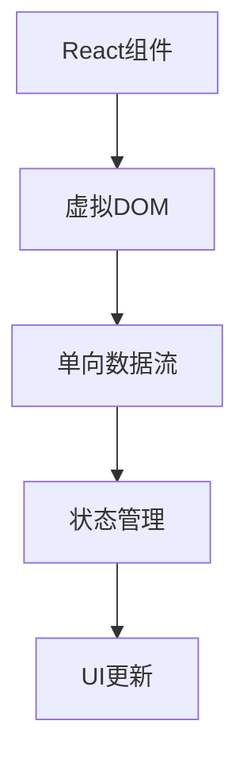

                 

关键词：React、前端开发、组件化、动态用户界面、JavaScript、虚拟DOM、单向数据流、状态管理、性能优化

> 摘要：本文将深入探讨React框架的核心概念和技术细节，包括其组件化架构、虚拟DOM、单向数据流和状态管理机制。通过实例代码和实际应用场景，我们将了解如何使用React构建高度动态且响应迅速的用户界面。

## 1. 背景介绍

在前端开发领域，随着互联网的快速发展，用户对交互体验的要求越来越高。为了满足这些需求，开发者们不断寻求更好的方式来构建动态、高性能的用户界面。React，由Facebook推出，已经成为当前最流行的前端框架之一，其组件化、虚拟DOM、单向数据流和状态管理等一系列特性，使其在构建动态用户界面方面具有显著优势。

本文将围绕React框架的核心概念和特性，通过理论讲解、代码实例和实践应用，帮助读者全面理解React的工作原理，并学会如何利用React来构建高质量的动态用户界面。

## 2. 核心概念与联系

### 2.1 React组件

React组件是构建React应用程序的基本构建块。每个组件都是一种JavaScript类或函数，它们接受输入（props）并返回一个描述用户界面（UI）的React元素。

### 2.2 虚拟DOM

虚拟DOM是React的核心特性之一。它是一个存在于内存中的数据结构，用于表示真实的DOM结构。当组件的状态或属性发生变化时，React会首先更新虚拟DOM，然后通过高效的对比算法（diffing algorithm）来更新真实的DOM。

### 2.3 单向数据流

React采用单向数据流的数据传递方式。这意味着数据只能从父组件流向子组件，而不能反过来。这种设计使得数据流更加清晰，同时也简化了状态管理的复杂性。

### 2.4 状态管理

React的状态管理机制使得开发者可以轻松地管理组件的状态。通过`useState`和`useReducer`等钩子函数，开发者可以灵活地更新组件的状态，并保持UI与状态的一致性。

### 2.5 Mermaid流程图

下面是一个使用Mermaid绘制的React核心概念流程图：



## 3. 核心算法原理 & 具体操作步骤

### 3.1 算法原理概述

React的核心算法原理主要包括：

- **虚拟DOM**: 通过虚拟DOM，React可以将应用的状态变化转换为对真实DOM的操作，从而提高性能。
- **渲染引擎**: React的渲染引擎使用高效的事件处理机制来响应用户的操作。
- **更新机制**: React采用diffing算法来比较虚拟DOM和真实DOM的差异，从而最小化重渲染的开销。

### 3.2 算法步骤详解

1. **组件初始化**：当组件被创建时，React会初始化组件的状态和属性。
2. **状态更新**：当组件的状态发生变化时，React会更新虚拟DOM。
3. **虚拟DOM对比**：React通过diffing算法对比虚拟DOM和真实DOM的差异。
4. **DOM更新**：React根据diff结果更新真实的DOM。

### 3.3 算法优缺点

**优点**：

- **高性能**：通过虚拟DOM和高效的更新机制，React可以提供高性能的用户界面。
- **组件化**：React的组件化设计使得代码更易于管理和复用。
- **单向数据流**：单向数据流使得数据流更加清晰，降低了状态管理的复杂性。

**缺点**：

- **学习曲线**：React的特性和用法相对复杂，对于新手来说可能有一定的学习难度。
- **运行时开销**：尽管React通过虚拟DOM优化了性能，但运行时仍然有一定的开销。

### 3.4 算法应用领域

React在构建各种类型的应用程序中都有广泛的应用，包括：

- **单页面应用**：如Facebook、Instagram等。
- **移动应用**：React Native允许开发者使用React来构建原生移动应用。
- **服务器端渲染**：React SSR（Server Side Rendering）可以用于优化搜索引擎优化（SEO）和初始加载速度。

## 4. 数学模型和公式 & 详细讲解 & 举例说明

### 4.1 数学模型构建

React的虚拟DOM通过以下数学模型构建：

- **虚拟DOM节点**：每个虚拟DOM节点都是一个对象，包含类型（type）、属性（props）和子节点（children）等。
- **更新队列**：React使用更新队列来记录状态变化，并按照队列顺序更新虚拟DOM。

### 4.2 公式推导过程

虚拟DOM的更新过程可以用以下公式表示：

\[ \text{diff} = \text{virtualDOM} - \text{realDOM} \]

其中，`diff`表示虚拟DOM和真实DOM之间的差异。

### 4.3 案例分析与讲解

假设我们有一个简单的组件，其虚拟DOM和真实DOM如下：

```javascript
// 虚拟DOM
const virtualDOM = {
  type: 'div',
  props: {
    children: [
      { type: 'p', props: { children: 'Hello, World!' } },
    ],
  },
};

// 真实DOM
const realDOM = <div><p>Hello, World!</p></div>;
```

当组件的状态发生变化时，React会更新虚拟DOM，并计算与真实DOM的差异。例如，如果状态更新为“Hello, React!”，则虚拟DOM将变为：

```javascript
const virtualDOM = {
  type: 'div',
  props: {
    children: [
      { type: 'p', props: { children: 'Hello, React!' } },
    ],
  },
};
```

此时，React将计算差异并更新真实的DOM：

```javascript
const realDOM = <div><p>Hello, React!</p></div>;
```

## 5. 项目实践：代码实例和详细解释说明

### 5.1 开发环境搭建

要开始使用React，首先需要搭建一个开发环境。你可以选择使用Create React App来快速搭建项目：

```bash
npx create-react-app my-app
cd my-app
npm start
```

### 5.2 源代码详细实现

下面是一个简单的React组件示例：

```jsx
import React, { useState } from 'react';

const Greeting = () => {
  const [name, setName] = useState('World');
  
  const handleChange = (event) => {
    setName(event.target.value);
  };
  
  return (
    <div>
      <h1>Hello, {name}!</h1>
      <input type="text" value={name} onChange={handleChange} />
    </div>
  );
};

export default Greeting;
```

在这个示例中，我们创建了一个名为`Greeting`的组件，它使用`useState`钩子来管理组件的状态。当用户在输入框中输入文本时，状态会更新，并触发UI的重新渲染。

### 5.3 代码解读与分析

- **组件结构**：`Greeting`组件是一个函数组件，它接受一个名为`name`的状态和一个名为`handleChange`的函数。
- **状态管理**：使用`useState`钩子来初始化状态，并通过`setName`函数更新状态。
- **事件处理**：`handleChange`函数在用户输入文本时被触发，用于更新状态。
- **UI渲染**：组件返回一个包含文本和输入框的React元素，当状态发生变化时，React会重新渲染UI。

### 5.4 运行结果展示

运行上述代码后，你将看到一个简单的欢迎界面，其中包含一个输入框。当你在输入框中输入文本并提交时，欢迎语将更新为输入的文本。

## 6. 实际应用场景

React在构建各种类型的应用程序中都有广泛的应用。以下是一些实际应用场景：

- **社交媒体平台**：如Facebook、Instagram等，React用于构建单页面应用，提供动态的用户体验。
- **电子商务网站**：如Amazon、Etsy等，React用于构建复杂的购物车和商品推荐系统。
- **企业级应用**：如Salesforce、Trello等，React用于构建高度动态和响应迅速的内部工具。

## 7. 未来应用展望

随着技术的不断发展，React框架在未来将继续发挥重要作用。以下是一些未来应用展望：

- **更高效的虚拟DOM**：随着硬件性能的提升，React的虚拟DOM可能会变得更加高效，从而进一步提高性能。
- **React Native的扩展**：React Native可能会进一步扩展其能力，使其能够构建更复杂的原生移动应用。
- **服务器端渲染（SSR）**：React SSR可能会在未来得到更多应用，以优化搜索引擎优化（SEO）和初始加载速度。

## 8. 工具和资源推荐

### 8.1 学习资源推荐

- **React官方文档**：https://reactjs.org/docs/getting-started.html
- **《React进阶之路》**：https://juejin.cn/book/6844733744458304670

### 8.2 开发工具推荐

- **Create React App**：https://create-react-app.dev/docs/getting-started/
- **React DevTools**：https://github.com/facebook/react-devtools

### 8.3 相关论文推荐

- **React的虚拟DOM实现**：https://reactjs.org/docs/reconciliation.html

## 9. 总结：未来发展趋势与挑战

React作为当前最流行的前端框架之一，将继续在构建动态用户界面方面发挥重要作用。然而，随着技术的不断发展，React也将面临一些挑战，如性能优化、开发者体验提升等。未来，React有望通过不断更新和改进，继续引领前端开发领域。

## 10. 附录：常见问题与解答

### 10.1 什么是React？

React是一个用于构建用户界面的JavaScript库，它采用组件化设计，支持虚拟DOM和单向数据流，使得开发者可以更高效地构建动态和响应迅速的界面。

### 10.2 React的主要特性是什么？

React的主要特性包括组件化、虚拟DOM、单向数据流和状态管理。这些特性使得React可以构建高度动态且性能优越的用户界面。

### 10.3 如何学习React？

学习React可以从以下几个步骤开始：

1. **阅读React官方文档**：熟悉React的基本概念和用法。
2. **实践项目**：通过实际编写React组件来加深理解。
3. **参考优秀开源项目**：学习其他开发者如何使用React构建项目。
4. **参加线上课程和社区活动**：与其他React开发者交流和学习。

### 10.4 React和Vue的区别是什么？

React和Vue都是流行的前端框架，但它们有一些关键区别：

- **设计哲学**：React更加灵活和低级，而Vue则提供更高级和更简洁的API。
- **组件化程度**：React的组件化程度更高，Vue则提供更细粒度的组件。
- **生态系统**：React有一个更大的生态系统和更丰富的第三方库。

## 11. 参考资料

- [React官方文档](https://reactjs.org/docs/getting-started.html)
- [Create React App](https://create-react-app.dev/docs/getting-started/)
- [React DevTools](https://github.com/facebook/react-devtools)
- [《React进阶之路》](https://juejin.cn/book/6844733744458304670)  
作者：禅与计算机程序设计艺术 / Zen and the Art of Computer Programming
----------------------------------------------------------------

以上就是《React 框架：构建动态用户界面》的全文内容，涵盖了React框架的背景介绍、核心概念、算法原理、数学模型、项目实践、实际应用场景、未来展望以及常见问题与解答。希望这篇文章能够帮助您更好地理解和掌握React框架，为您的项目开发带来新的思路和技巧。再次感谢您的阅读！


