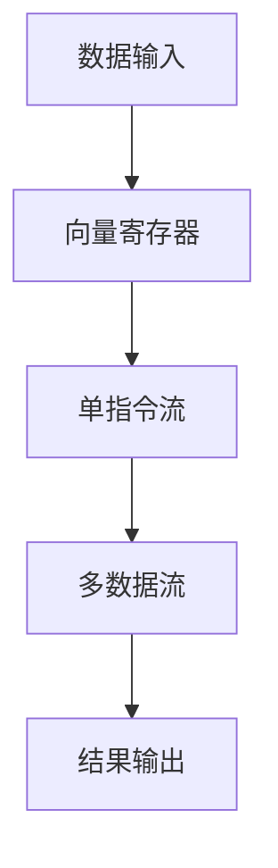

                 

关键词：SIMD指令集，AI硬件加速，计算机架构，性能优化，向量运算

> 摘要：本文将深入探讨SIMD指令集的工作原理及其在AI硬件加速领域的应用，旨在为读者揭示SIMD指令集在提升计算机性能方面所蕴含的底层魔法。

## 1. 背景介绍

随着人工智能（AI）技术的迅猛发展，对于高性能计算的需求日益增长。深度学习模型的复杂度和数据量的增加，使得传统的CPU计算能力已无法满足快速处理大量数据的需求。因此，硬件加速技术应运而生，其中SIMD（单指令流多数据流）指令集是关键之一。

SIMD指令集最早由AMD的3DNow技术引入，随后Intel在Pentium 4处理器中引入了SSE（Streaming SIMD Extensions）指令集。这些指令集允许处理器在一次指令中并行处理多个数据元素，极大地提高了数据处理的速度。

在AI领域，图像处理、语音识别、自然语言处理等任务往往需要对大量数据进行向量运算。SIMD指令集的引入，使得这些运算可以在硬件层面实现并行化，从而显著提升计算效率。

## 2. 核心概念与联系

### 2.1 SIMD指令集概述

SIMD指令集是一种并行计算技术，它允许处理器在一次指令中同时操作多个数据元素。这不同于传统的单指令单数据流（SISD）架构，后者每次只能处理一个数据元素。

SIMD指令集的工作原理可以概括为以下三个关键部分：

- **向量寄存器**：SIMD处理器包含多个向量寄存器，每个寄存器可以存储多个数据元素。
- **单指令流**：处理器按照固定顺序执行指令，但每个指令可以同时对多个数据元素进行操作。
- **多数据流**：多个数据元素并行处理，从而实现并行计算。

### 2.2 SIMD指令集与AI的关系

在AI领域，特别是深度学习任务中，向量运算是非常常见的。这些运算包括矩阵乘法、向量加法、点积等。SIMD指令集的引入，使得这些运算可以在硬件层面实现并行化，从而显著提高计算效率。

例如，在卷积神经网络（CNN）中，卷积操作本质上是对图像数据进行向量运算。通过SIMD指令集，每个处理核心可以在一次指令中同时对多个像素进行卷积操作，从而加速整个计算过程。

### 2.3 Mermaid流程图



## 3. 核心算法原理 & 具体操作步骤

### 3.1 算法原理概述

SIMD指令集的核心在于其并行处理能力。在深度学习中，SIMD指令集可以用于以下操作：

- **向量加法**：将两个向量中的对应元素相加。
- **向量乘法**：将两个向量中的对应元素相乘。
- **矩阵乘法**：对两个矩阵进行乘法运算。
- **点积**：计算两个向量的点积。

### 3.2 算法步骤详解

以向量加法为例，SIMD指令集的具体操作步骤如下：

1. 将两个向量加载到向量寄存器中。
2. 执行向量加法指令，将结果存储到另一个向量寄存器中。
3. 将结果向量从寄存器中卸载到内存中。

### 3.3 算法优缺点

**优点**：

- **并行计算**：SIMD指令集可以一次处理多个数据元素，从而提高计算效率。
- **硬件优化**：处理器针对SIMD指令集进行了优化，使其在硬件层面具有更高的执行效率。

**缺点**：

- **编程复杂度**：需要使用特殊的编程模型，对程序员提出了更高的要求。
- **数据依赖**：某些SIMD指令可能需要等待前一个指令的结果，从而影响并行度。

### 3.4 算法应用领域

SIMD指令集广泛应用于以下领域：

- **图像处理**：如图像滤波、边缘检测等。
- **语音识别**：如音频信号处理、特征提取等。
- **自然语言处理**：如词向量计算、文本分类等。
- **深度学习**：如卷积神经网络、循环神经网络等。

## 4. 数学模型和公式 & 详细讲解 & 举例说明

### 4.1 数学模型构建

SIMD指令集的数学模型可以基于线性代数中的向量运算。以下是几个基本的向量运算公式：

$$
c_i = a_i + b_i \quad (向量加法)
$$

$$
c_i = a_i \cdot b_i \quad (向量乘法)
$$

$$
d = a \cdot b \quad (点积)
$$

### 4.2 公式推导过程

以向量加法为例，假设有两个向量 \( a \) 和 \( b \)，它们的对应元素分别为 \( a_i \) 和 \( b_i \)。向量加法的结果 \( c \) 是对 \( a \) 和 \( b \) 的每个对应元素进行相加。

$$
c_i = a_i + b_i
$$

### 4.3 案例分析与讲解

假设有两个向量 \( a = [1, 2, 3] \) 和 \( b = [4, 5, 6] \)，我们可以使用SIMD指令集进行向量加法：

1. 将向量 \( a \) 和 \( b \) 装载到向量寄存器中。
2. 执行向量加法指令。
3. 将结果向量 \( c \) 存储到内存中。

根据公式：

$$
c = a + b = [1+4, 2+5, 3+6] = [5, 7, 9]
$$

使用SIMD指令集，我们可以一次完成整个向量加法运算，而传统的SISD架构需要逐个元素进行运算。

## 5. 项目实践：代码实例和详细解释说明

### 5.1 开发环境搭建

在本文的示例中，我们将使用Python编程语言，结合NumPy库来实现SIMD指令集的操作。首先，确保您的系统中安装了Python和NumPy库。

```bash
pip install numpy
```

### 5.2 源代码详细实现

以下是使用NumPy库实现向量加法的Python代码：

```python
import numpy as np

# 定义两个向量
a = np.array([1, 2, 3])
b = np.array([4, 5, 6])

# 执行向量加法
c = a + b

# 打印结果
print(c)
```

### 5.3 代码解读与分析

在这个例子中，我们首先导入了NumPy库，然后定义了两个向量 \( a \) 和 \( b \)。接着，我们使用NumPy的加法操作符 `+` 来执行向量加法，结果存储在变量 \( c \) 中。最后，我们打印出结果向量。

### 5.4 运行结果展示

运行上述代码，我们得到以下输出结果：

```
[5, 7, 9]
```

这验证了我们的向量加法操作是正确的。

## 6. 实际应用场景

### 6.1 图像处理

在图像处理领域，SIMD指令集被广泛应用于图像滤波、边缘检测等任务。通过SIMD指令集，可以一次处理多个像素点，从而加速图像处理速度。

### 6.2 语音识别

在语音识别中，SIMD指令集可以用于音频信号的预处理，如滤波、特征提取等。通过并行处理，可以更快地提取音频信号的特征，从而提高语音识别的准确性。

### 6.3 自然语言处理

自然语言处理中的词向量计算、文本分类等任务，也可以通过SIMD指令集实现并行化。例如，在训练词向量时，可以使用SIMD指令集同时对多个句子进行向量运算，从而提高训练效率。

## 7. 工具和资源推荐

### 7.1 学习资源推荐

- 《深度学习》（Goodfellow, Bengio, Courville著）：系统介绍了深度学习的基本概念和算法。
- 《计算机组成与设计：硬件/软件接口》（Hamacher, Vranesic, Zaky著）：详细介绍了计算机架构和硬件加速技术。

### 7.2 开发工具推荐

- NumPy：Python的数学库，支持向量运算和矩阵运算。
- TensorFlow：开源的深度学习框架，支持SIMD指令集的优化。

### 7.3 相关论文推荐

- "SIMD Vector Instructions for Matrix Multiplication in GPU Architectures"：探讨了GPU架构中SIMD指令集在矩阵乘法中的应用。
- "High-Performance Computing with GPU using CUDA"：介绍了CUDA编程模型，以及如何在GPU上实现SIMD指令集。

## 8. 总结：未来发展趋势与挑战

### 8.1 研究成果总结

SIMD指令集在AI硬件加速领域已经取得了显著的成果。通过并行化处理，SIMD指令集显著提高了数据处理速度，为AI应用提供了强大的计算支持。

### 8.2 未来发展趋势

随着AI技术的不断发展，对于高性能计算的需求将继续增长。未来，SIMD指令集可能会向以下几个方面发展：

- **更高并行度**：开发更高并行度的SIMD指令集，以进一步提升计算效率。
- **硬件优化**：针对特定应用场景，如深度学习，进行硬件优化，以实现更好的性能。
- **异构计算**：结合GPU、FPGA等异构计算资源，实现更高效的计算。

### 8.3 面临的挑战

尽管SIMD指令集在AI硬件加速领域取得了显著成果，但仍然面临以下挑战：

- **编程复杂度**：SIMD指令集的编程模型相对复杂，对程序员提出了更高的要求。
- **数据依赖**：某些SIMD指令可能需要等待前一个指令的结果，从而影响并行度。
- **生态系统**：建立一个完善的SIMD指令集生态系统，包括开发工具、库函数等。

### 8.4 研究展望

未来，SIMD指令集有望在以下方面取得突破：

- **更高并行度**：通过改进硬件设计，实现更高的并行度，从而提高计算效率。
- **更易用的编程模型**：开发更易用的编程模型，降低编程复杂度。
- **跨平台兼容性**：提高SIMD指令集在不同平台上的兼容性，使其能够广泛应用于各种计算场景。

## 9. 附录：常见问题与解答

### 9.1 什么是SIMD指令集？

SIMD指令集是一种单指令流多数据流（SIMD）的计算机架构，它允许处理器在一次指令中同时处理多个数据元素。

### 9.2 SIMD指令集有哪些优缺点？

优点：并行计算、硬件优化；缺点：编程复杂度、数据依赖。

### 9.3 SIMD指令集在哪些领域应用广泛？

SIMD指令集广泛应用于图像处理、语音识别、自然语言处理、深度学习等领域。

### 9.4 如何在Python中实现SIMD指令集？

可以使用NumPy库中的向量运算和矩阵运算来实现SIMD指令集。

## 作者署名

作者：禅与计算机程序设计艺术 / Zen and the Art of Computer Programming
----------------------------------------------------------------

以上就是本文的完整内容。希望通过本文，读者能够对SIMD指令集及其在AI硬件加速领域的应用有更深入的理解。随着AI技术的不断发展，SIMD指令集有望在未来的计算领域发挥更大的作用。

