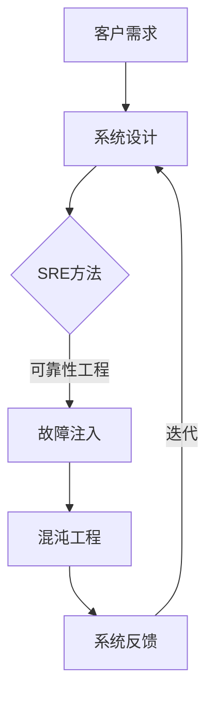
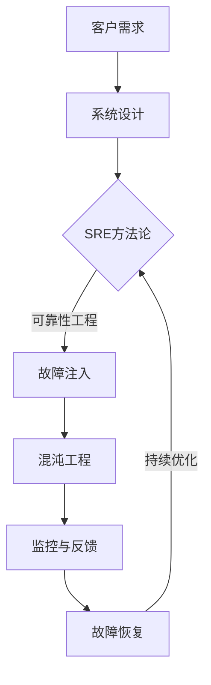

                 

  
关键词：SRE、混沌工程、应用实践、故障注入、系统稳定性、可靠性工程

摘要：随着互联网技术的发展，现代软件系统日益复杂，系统稳定性和可靠性成为至关重要的挑战。本文将深入探讨SRE（Site Reliability Engineering）中的混沌工程概念，介绍其核心概念、应用原理，并通过具体案例展示混沌工程的实施方法和效果，最终展望其在未来应用场景中的发展趋势。

## 1. 背景介绍

### 1.1 SRE的起源

SRE（Site Reliability Engineering，可靠性站点工程）起源于Google，它将工程和运营结合起来，专注于确保软件系统的可靠性和可用性。SRE团队的目标是通过工程实践和自动化工具，提高系统的稳定性和可靠性，减少故障发生率和恢复时间。

### 1.2 混沌工程的引入

混沌工程是一种通过故意引入故障和异常情况来测试和提升系统容错能力的实践。这种方法借鉴了混沌理论的原理，通过有控制的故障注入，了解系统在真实环境下的行为和反应，从而发现潜在的问题和漏洞，提升系统的健壮性。

### 1.3 SRE与混沌工程的结合

混沌工程在SRE中的应用，旨在通过模拟真实环境中的故障情况，测试系统的容错能力和恢复能力。这种结合有助于SRE团队更好地理解系统的复杂性和动态性，从而采取更有效的措施确保系统的稳定性和可靠性。

## 2. 核心概念与联系

### 2.1 核心概念

- **SRE（Site Reliability Engineering）**：一种结合工程和运维的方法论，专注于确保软件系统的可靠性和可用性。
- **混沌工程**：一种通过故意引入故障和异常情况来测试和提升系统容错能力的实践。

### 2.2 联系与架构

下面是一个Mermaid流程图，展示了SRE与混沌工程之间的联系和架构：



### 2.3 混沌工程原理

混沌工程的原理是基于混沌理论的，混沌理论揭示了复杂系统中的一种特殊行为：虽然初始条件非常相似，但系统的长期行为可以截然不同。混沌工程通过故意引入故障和异常情况，模拟这种复杂系统的行为，以测试和提升系统的容错能力。

## 3. 核心算法原理 & 具体操作步骤

### 3.1 算法原理概述

混沌工程的算法原理主要包括以下几个方面：

1. **故障注入**：通过自动化工具，有控制地引入各种故障情况，如网络延迟、硬件故障、数据库异常等。
2. **监控与反馈**：对系统在故障情况下的表现进行监控，收集相关数据，并对系统行为进行分析。
3. **故障恢复**：根据监控和分析结果，采取相应的措施进行故障恢复，并评估系统的恢复能力。

### 3.2 算法步骤详解

1. **故障场景设计**：根据系统的特点和潜在的风险，设计各种可能的故障场景，如网络分区、数据库中断、服务器故障等。
2. **故障注入**：使用混沌工程工具，如Chaos Monkey、Chaos Mesh等，有控制地引入故障。
3. **系统监控**：通过监控工具，如Prometheus、Grafana等，对系统在故障情况下的表现进行实时监控。
4. **数据分析**：对监控数据进行分析，了解系统的响应速度、故障恢复能力等。
5. **故障恢复**：根据分析结果，采取相应的措施进行故障恢复，如重启服务、切换实例等。

### 3.3 算法优缺点

**优点**：

- **提高系统容错能力**：通过模拟故障情况，可以提前发现和修复潜在的问题，提高系统的稳定性。
- **优化系统设计**：混沌工程可以帮助团队更好地理解系统的复杂性和动态性，从而优化系统设计。

**缺点**：

- **实施成本较高**：混沌工程需要专门的工具和人员，实施成本较高。
- **潜在风险**：如果故障注入不当，可能会导致系统实际故障。

### 3.4 算法应用领域

混沌工程主要应用于互联网公司、金融行业、电子商务等领域，这些领域的系统复杂度高，对稳定性和可靠性要求严格。

## 4. 数学模型和公式 & 详细讲解 & 举例说明

### 4.1 数学模型构建

混沌工程中的数学模型主要包括以下几个方面：

- **故障概率分布**：描述系统在不同故障情况下的概率分布。
- **故障恢复时间**：描述系统从故障发生到恢复正常所需的时间。

### 4.2 公式推导过程

- **故障概率分布**：

  假设系统有 \( n \) 个组件，每个组件的故障概率为 \( p \)，则系统整体的故障概率 \( P \) 可以通过以下公式计算：

  $$ P = (1 - p)^n $$

- **故障恢复时间**：

  假设系统从故障发生到恢复正常的平均时间为 \( t \)，则系统在一个时间段内发生故障的概率为 \( P \)，系统在一个时间段内恢复正常的概率为 \( 1 - P \)。则系统在一个时间段内保持正常的概率为：

  $$ Q = (1 - P) \cdot (1 - P) \cdot ... \cdot (1 - P) = (1 - P)^t $$

### 4.3 案例分析与讲解

假设一个电子商务平台，系统由 \( n = 10 \) 个组件组成，每个组件的故障概率 \( p = 0.01 \)。

- **故障概率分布**：

  $$ P = (1 - 0.01)^{10} = 0.9900... $$

- **故障恢复时间**：

  假设系统在一个时间段内（如一天）的平均故障恢复时间为 \( t = 1 \) 小时，则系统在一个时间段内保持正常的概率为：

  $$ Q = (1 - P) \cdot (1 - P) \cdot ... \cdot (1 - P) = (1 - 0.9900...)^{1} = 0.0099... $$

这意味着在一个时间段内，系统发生故障的概率约为 0.99%，而保持正常的概率约为 99%。

## 5. 项目实践：代码实例和详细解释说明

### 5.1 开发环境搭建

搭建混沌工程实践的开发环境，首先需要安装以下工具：

- Kubernetes集群
- Chaos Mesh
- Prometheus
- Grafana

具体安装步骤请参考相关文档。

### 5.2 源代码详细实现

以下是一个简单的Kubernetes配置文件，用于部署一个混沌实验：

```yaml
apiVersion: chaos-mesh.org/v1alpha1
kind: PodChaos
metadata:
  name: chaos-pod
spec:
  selector:
    matchLabels:
      app: webapp
  action: pod-failure
  mode: one
  duration: "30s"
  recovery: true
```

### 5.3 代码解读与分析

该配置文件定义了一个PodChaos对象，用于在匹配的Pod中引入故障。具体解读如下：

- **metadata**：定义了Chaos Mesh对象的基本信息，如名称、标签等。
- **spec**：定义了混沌实验的详细配置。
  - **selector**：定义了匹配的Pod的标签，这里假设所有Pod的标签为`app: webapp`。
  - **action**：定义了故障的类型，这里选择`pod-failure`，即Pod故障。
  - **mode**：定义了故障注入的模式，这里选择`one`，表示仅注入一个故障。
  - **duration**：定义了故障持续的时间，这里为30秒。
  - **recovery**：定义了故障是否可以自动恢复，这里设置为`true`，表示故障发生后可以自动恢复。

### 5.4 运行结果展示

运行上述配置文件后，Prometheus和Grafana等监控工具会收集相关数据，并在Grafana中生成可视化图表，展示系统在故障情况下的响应和行为。

## 6. 实际应用场景

### 6.1 互联网公司

互联网公司通常具有较高的系统复杂性和高并发性，混沌工程可以帮助这些公司测试和提升系统的容错能力，确保在面临大规模故障时能够快速恢复。

### 6.2 金融行业

金融行业对系统的稳定性和可靠性要求极高，混沌工程可以帮助金融公司测试和优化交易系统、支付系统等关键业务系统，确保系统的稳定运行。

### 6.3 电子商务

电子商务平台通常需要处理海量用户请求，混沌工程可以帮助这些平台测试和优化系统的性能和稳定性，确保在高峰期能够稳定运行。

## 7. 工具和资源推荐

### 7.1 学习资源推荐

- 《Chaos Engineering: The Art of Embracing Random Failure》
- 《SRE：谷歌如何将运维做到极致》

### 7.2 开发工具推荐

- Chaos Mesh
- Prometheus
- Grafana

### 7.3 相关论文推荐

- "Chaos Engineering: Systemic Testing andMitigation of  Chaos in Distributed Systems"
- "Principles of Chaos Engineering"

## 8. 总结：未来发展趋势与挑战

### 8.1 研究成果总结

混沌工程在提升系统容错能力、优化系统设计等方面取得了显著成果。未来，混沌工程将在更多领域得到应用，如物联网、区块链等。

### 8.2 未来发展趋势

- **自动化**：混沌工程的实施将更加自动化，减少人工干预，提高效率。
- **智能化**：混沌工程将结合人工智能技术，实现更精准的故障模拟和预测。

### 8.3 面临的挑战

- **复杂性**：混沌工程在复杂系统中的应用将面临更大的挑战。
- **安全风险**：混沌工程需要严格管理，以防止对生产环境造成实际损害。

### 8.4 研究展望

混沌工程将在未来继续发展，为现代软件系统的稳定性和可靠性提供更强大的保障。

## 9. 附录：常见问题与解答

### 9.1 混沌工程与DevOps的区别是什么？

混沌工程是DevOps的一种实践，旨在通过模拟故障来提升系统的容错能力。DevOps更侧重于开发和运维的整合，而混沌工程则更关注系统的稳定性。

### 9.2 混沌工程是否会影响生产环境？

混沌工程的设计初衷是模拟故障情况，不会直接影响生产环境。通过合理的配置和管理，可以确保混沌工程在测试环境中进行，不会影响实际业务。

作者：禅与计算机程序设计艺术 / Zen and the Art of Computer Programming
----------------------------------------------------------------
### 1. 背景介绍

#### 1.1 SRE的起源

SRE（Site Reliability Engineering，可靠性站点工程）起源于Google。随着互联网技术的飞速发展，软件系统变得越来越复杂，系统的可靠性和稳定性成为企业持续发展和用户满意度的重要保障。为了应对这些挑战，Google在2003年提出了SRE的概念，它是一种结合工程和运维的方法论，旨在通过工程化的手段确保软件系统的可靠性。

SRE的核心目标是通过自动化工具和工程实践，减少人为错误，提高系统的可用性和稳定性。与传统的运维（Operations）相比，SRE更注重通过数据驱动和持续改进来优化系统性能。SRE团队通常由具备深厚技术背景的工程师组成，他们不仅负责系统的维护和监控，还参与系统设计和优化。

#### 1.2 混沌工程的引入

混沌工程是一种通过故意引入故障和异常情况来测试和提升系统容错能力的实践。它起源于Netflix，旨在通过模拟真实环境中的故障情况，了解系统在异常条件下的行为和反应，从而提前发现和修复潜在的问题。混沌工程的核心思想是“拥抱故障”，即认为故障是不可避免的，通过有控制的故障注入，可以提升系统的健壮性。

混沌工程借鉴了混沌理论的原理，混沌理论揭示了复杂系统中的一种特殊行为：虽然初始条件非常相似，但系统的长期行为可以截然不同。混沌工程通过引入各种故障情况，如网络延迟、数据库故障、硬件损坏等，模拟复杂系统的行为，以测试和提升系统的容错能力。

#### 1.3 SRE与混沌工程的结合

混沌工程在SRE中的应用，旨在通过模拟真实环境中的故障情况，测试系统的容错能力和恢复能力。这种结合有助于SRE团队更好地理解系统的复杂性和动态性，从而采取更有效的措施确保系统的稳定性和可靠性。

在实际操作中，SRE团队会使用混沌工程工具来定期进行故障注入，监控系统的响应和恢复情况，并基于这些数据进行分析和优化。这种持续迭代的过程，使得系统能够在面临突发故障时，迅速恢复并保持稳定运行。

混沌工程与SRE的结合，不仅能够提升系统的可靠性，还可以优化系统的设计和架构，使其更适应变化和挑战。通过混沌工程，SRE团队能够建立一种更为积极和主动的运维模式，从而确保系统在复杂和动态的环境中持续稳定运行。

#### 1.4 混沌工程的重要性

混沌工程在SRE中的重要性不可忽视。首先，它能够帮助团队提前发现和解决潜在的系统问题，减少故障发生的概率。通过模拟各种故障场景，团队可以深入了解系统在不同情况下的表现，从而优化系统的设计和配置。

其次，混沌工程有助于提升系统的恢复能力。通过定期进行故障注入，团队可以测试和优化系统的故障恢复流程，确保在发生实际故障时，系统能够迅速恢复正常运行。

最后，混沌工程还能够提高团队的应对能力。通过不断面对和解决故障，团队成员能够积累宝贵的经验，提升对复杂问题的分析和解决能力。这种能力的提升，不仅对当前的系统维护有益，也为未来的系统迭代和扩展提供了坚实的基础。

总之，混沌工程在SRE中的应用，不仅能够提高系统的可靠性，还能够优化团队的工作流程和技能水平，为企业的长期发展提供强有力的支持。

### 2. 核心概念与联系

#### 2.1 核心概念

混沌工程与SRE的结合，依赖于几个核心概念，这些概念不仅定义了混沌工程的基本原则，也揭示了其在SRE实践中的重要性。

首先，**可靠性**是SRE的核心目标之一。可靠性指的是系统能够持续提供预期功能和服务的能力。在SRE中，可靠性不仅涉及硬件和软件的可靠性，还包括对人员、流程和工具的可靠性管理。通过确保每个组件的稳定性和协调性，SRE团队能够构建一个高度可靠的系统。

**混沌工程**则通过故意引入故障来挑战系统的可靠性。这种做法旨在暴露系统中的潜在问题，从而在真实发生故障之前加以解决。混沌工程的核心概念包括故障注入、监控和反馈、恢复和优化等。通过定期进行故障注入，SRE团队能够模拟各种可能发生的故障情况，评估系统的响应和恢复能力。

**故障注入**是混沌工程的关键步骤。故障注入指的是在系统中引入人为的故障，如网络延迟、服务中断、硬件故障等，以测试系统的容错能力。故障注入可以是完全随机的，也可以根据特定的概率分布进行，以便更真实地模拟实际情况。

**监控与反馈**是混沌工程的另一个核心概念。在故障注入之后，SRE团队需要监控系统的响应和行为，收集大量的监控数据。这些数据包括系统的性能指标、错误日志、告警信息等。通过对这些数据的分析，团队可以了解系统在故障情况下的表现，发现潜在的问题和弱点。

**恢复**是指在故障发生时，系统能够自动或手动地恢复正常运行。SRE团队需要设计并实施有效的故障恢复流程，确保系统能够在最短时间内恢复正常。这包括自动重启服务、切换到备用实例、数据恢复等措施。

**优化**是指根据故障注入和监控的结果，对系统进行持续改进。通过分析故障数据和系统的响应行为，SRE团队能够识别需要优化的方面，如代码改进、架构调整、配置优化等。这种持续优化的过程，有助于提升系统的整体可靠性。

#### 2.2 联系与架构

混沌工程与SRE的联系，可以通过一个简化的架构图来展示，该架构图描绘了两者之间的互动关系。



在该架构图中：

- **客户需求**是系统设计和运作的起点，它决定了系统的功能和性能要求。
- **系统设计**是基于客户需求进行的，它包含了系统的架构、组件和接口设计。
- **SRE方法论**是确保系统可靠性和稳定性的核心，它包括故障注入、监控、反馈、恢复和优化等步骤。
- **故障注入**是混沌工程的一部分，通过模拟真实故障，挑战系统的可靠性。
- **监控与反馈**是收集和分析系统行为的关键步骤，它为故障恢复和优化提供数据支持。
- **故障恢复**是确保系统在故障发生后能够快速恢复正常的关键环节。
- **持续优化**是基于监控和反馈结果，对系统进行改进和优化的过程。

这个架构展示了混沌工程在SRE中的关键作用。通过故障注入和监控反馈，SRE团队能够不断优化系统，确保其在面临各种不确定性和故障情况时，能够保持高可靠性和稳定性。

#### 2.3 混沌工程原理

混沌工程的核心原理是通过故意引入故障，以测试和提升系统的容错能力。这种方法借鉴了混沌理论的原理，混沌理论揭示了复杂系统中的一种特殊行为：虽然初始条件非常相似，但系统的长期行为可以截然不同。

在混沌工程中，故障注入是关键步骤。通过有控制地引入故障，如网络延迟、数据库故障、硬件故障等，团队可以模拟真实环境中的各种异常情况，以评估系统的响应和恢复能力。

故障注入可以分为几种不同的类型：

- **随机故障注入**：这种类型是最简单和直接的故障注入方式，故障发生的时间和类型是完全随机的。通过这种方式，可以测试系统在各种意外情况下的表现。
- **概率性故障注入**：这种类型是基于某种概率分布进行故障注入，如高概率的数据库故障、低概率的网络中断等。这种故障注入更接近实际场景，能够更好地模拟系统可能面临的风险。
- **条件性故障注入**：这种类型是基于特定条件触发故障，如当系统负载超过某个阈值时触发网络延迟。通过这种方式，可以模拟特定条件下的故障场景。

故障注入后，系统会进入监控与反馈阶段。在这一阶段，SRE团队会使用各种监控工具和日志分析工具，收集系统在故障情况下的行为数据。这些数据包括系统性能指标、错误日志、告警信息等。通过对这些数据的分析，团队可以了解系统在故障情况下的表现，发现潜在的问题和弱点。

在故障恢复阶段，系统需要采取措施恢复正常运行。这可以包括自动重启服务、切换到备用实例、执行数据恢复等措施。故障恢复的速度和效果，是评估系统容错能力的重要指标。

最后，通过监控和反馈结果，团队会对系统进行优化。这种优化可能涉及代码改进、架构调整、配置优化等方面，以确保系统在未来的运行中更加稳定和可靠。

总之，混沌工程通过故障注入、监控与反馈、故障恢复和持续优化等步骤，不断挑战和提升系统的容错能力。这种实践不仅有助于发现和解决潜在问题，还能够提高团队的应对能力和系统的整体可靠性。

#### 2.4 混沌工程的应用范围

混沌工程的应用范围广泛，涵盖了多个行业和领域。以下是一些主要的应用场景：

**互联网公司**：混沌工程在互联网公司中得到了广泛应用，尤其是在那些提供高度依赖互联网服务的公司中。例如，Netflix、Amazon和Google等公司，通过混沌工程来确保其大规模分布式系统的稳定性和可靠性。这些公司使用混沌工程来测试和优化其云计算、数据存储、负载均衡等关键组件。

**金融行业**：金融行业对系统的可靠性和安全性要求极高，混沌工程在这里的应用同样重要。银行、证券公司和保险公司等金融机构，通过混沌工程来测试和优化交易系统、支付系统和风险管理平台。这些测试有助于确保在面临突发故障时，系统能够快速恢复，保障金融交易的连续性和安全性。

**电子商务平台**：电子商务平台在高峰期需要处理大量的用户请求，系统稳定性和响应速度至关重要。混沌工程可以帮助这些平台模拟各种故障场景，如网络延迟、服务器故障等，以评估和提升系统的容错能力。通过这种测试，平台可以在实际故障发生前提前发现和解决潜在问题。

**医疗行业**：医疗行业的信息系统同样需要高度可靠和稳定。混沌工程可以帮助医疗机构测试和优化电子健康记录系统、医疗设备管理系统等。例如，在处理紧急医疗情况时，系统需要快速响应和准确处理，混沌工程可以帮助确保系统在这种关键场景下的稳定性和可靠性。

**物联网（IoT）**：物联网系统通常由大量分布式设备和传感器组成，这些设备之间的通信和数据交换对系统的可靠性提出了极高的要求。混沌工程可以帮助测试和优化物联网系统的容错能力，确保在设备故障或通信中断时，系统能够快速恢复并保持稳定运行。

**电信行业**：电信行业的服务质量和稳定性直接影响用户的体验。混沌工程可以帮助电信运营商测试和优化其网络基础设施、数据中心和服务质量保证系统。通过模拟各种故障场景，运营商可以确保网络在面临突发故障时能够快速恢复，提高服务质量。

总之，混沌工程的应用范围非常广泛，涵盖了从互联网到金融、医疗、物联网等各个行业。通过模拟和测试系统的故障情况，混沌工程有助于提升系统的可靠性、稳定性和安全性，为企业和用户提供更可靠的服务。

#### 2.5 混沌工程的优势和局限性

混沌工程作为一种提升系统可靠性的方法，具有显著的优势，但同时也存在一定的局限性。

**优势**：

1. **提前发现和解决潜在问题**：通过故意引入故障，混沌工程能够提前发现系统中的潜在问题。这些问题可能在生产环境中导致严重故障，通过混沌工程提前发现和解决，可以避免实际故障的发生。
2. **提升系统容错能力**：混沌工程通过模拟各种故障情况，测试系统的容错能力。这有助于团队了解系统在不同故障场景下的表现，从而优化系统的设计和架构，提高其整体容错能力。
3. **增强团队应对能力**：通过不断地进行故障注入和监控，团队能够积累宝贵的经验，提高对复杂问题的分析和解决能力。这种能力的提升，不仅有助于当前系统的维护，也为未来的系统迭代和扩展提供了坚实的基础。
4. **优化系统性能**：混沌工程的结果提供了大量的数据，这些数据有助于团队分析系统的性能瓶颈和优化方向。通过对系统进行持续的优化，可以提升系统的整体性能和稳定性。

**局限性**：

1. **实施成本较高**：混沌工程需要专门的工具和人员，其初始实施成本相对较高。特别是在大规模分布式系统中，故障注入和监控的复杂度会显著增加，需要更多的技术和资源投入。
2. **潜在风险**：如果故障注入不当，可能会导致生产环境的实际故障，从而对业务造成负面影响。因此，混沌工程的实施需要严格的管理和控制，确保故障注入对实际业务的影响最小化。
3. **误报和误判**：由于混沌工程的故障注入是故意引入的，可能会导致一些误报和误判。例如，一些正常的系统行为可能被误认为是故障，从而引发不必要的告警和干预。
4. **需要专业知识**：混沌工程需要对系统的架构、设计和运行机制有深入的理解。因此，实施混沌工程需要具备一定的专业知识和经验，这对团队的要求较高。

总的来说，混沌工程作为一种提升系统可靠性的方法，具有显著的优势，但也需要考虑到其实施成本和潜在风险。通过合理规划和管理，可以最大限度地发挥混沌工程的优势，同时避免其局限性带来的负面影响。

### 3. 核心算法原理 & 具体操作步骤

#### 3.1 算法原理概述

混沌工程的算法原理主要基于以下几个关键步骤：故障注入、监控与反馈、故障恢复和系统优化。这些步骤相互关联，共同构成了混沌工程的核心流程。

**故障注入**是混沌工程的起点，通过有控制地引入各种故障，如网络延迟、数据库故障、硬件故障等，模拟系统在真实环境中的异常情况。故障注入可以是随机的，也可以是概率性的，还可以是条件性的，以便更真实地模拟系统可能遇到的各种故障场景。

**监控与反馈**是对系统在故障情况下的行为进行实时监控和数据分析。通过收集系统性能指标、错误日志、告警信息等数据，团队可以了解系统在不同故障情况下的表现，发现潜在的问题和弱点。这些数据为故障恢复和系统优化提供了重要的参考依据。

**故障恢复**是在故障发生后，采取相应的措施使系统恢复正常运行。这可以包括自动重启服务、切换到备用实例、数据恢复等措施。故障恢复的速度和效果，是评估系统容错能力的重要指标。

**系统优化**是基于监控和反馈结果，对系统进行持续改进。通过对故障数据的分析，团队可以识别需要优化的方面，如代码改进、架构调整、配置优化等。这种持续优化的过程，有助于提升系统的整体可靠性和性能。

#### 3.2 算法步骤详解

##### 3.2.1 故障注入

故障注入是混沌工程的核心步骤之一。具体操作步骤如下：

1. **故障场景设计**：根据系统的特点和潜在的风险，设计各种可能的故障场景。这些故障场景可能包括网络故障、硬件故障、数据库故障等。例如，网络故障可以模拟网络延迟、网络分区等；硬件故障可以模拟服务器故障、磁盘故障等；数据库故障可以模拟数据库中断、数据丢失等。

2. **故障注入工具选择**：选择合适的故障注入工具，如Chaos Mesh、Chaos Monkey等。这些工具可以帮助团队有控制地引入故障，并确保故障注入的准确性和可控性。

3. **故障注入实施**：使用所选工具，按照设计好的故障场景进行故障注入。例如，可以通过Chaos Mesh在Kubernetes集群中注入网络延迟故障，或者通过Chaos Monkey随机关闭某些服务器。

4. **故障注入监控**：在故障注入过程中，使用监控工具（如Prometheus、Grafana等）实时监控系统的表现。通过收集系统性能指标、错误日志、告警信息等数据，团队可以了解故障注入对系统的影响。

##### 3.2.2 监控与反馈

监控与反馈是混沌工程的重要环节，其具体操作步骤如下：

1. **数据收集**：在故障注入过程中，使用监控工具（如Prometheus、Grafana等）实时收集系统的各种数据。这些数据包括系统性能指标、错误日志、告警信息等。

2. **数据分析**：对收集到的数据进行分析，识别故障注入对系统的影响。例如，通过分析网络延迟数据，可以了解网络故障对系统性能的冲击；通过分析错误日志，可以识别系统在故障情况下的错误类型和频率。

3. **问题识别**：基于数据分析结果，识别系统中存在的潜在问题。这些问题可能是由于设计缺陷、配置错误、代码问题等原因引起的。

4. **反馈与记录**：将分析结果和识别的问题进行记录和反馈。这有助于团队在后续的优化过程中有针对性地解决问题。

##### 3.2.3 故障恢复

故障恢复是确保系统在故障发生后能够快速恢复正常运行的关键步骤。具体操作步骤如下：

1. **故障诊断**：在故障发生后，进行故障诊断，确定故障的根本原因。这可能需要结合错误日志、系统性能指标、监控数据等多方面信息。

2. **故障恢复策略**：根据故障原因，制定相应的故障恢复策略。这可以包括自动重启服务、切换到备用实例、执行数据恢复等措施。

3. **故障恢复执行**：执行预定的故障恢复策略，使系统恢复正常运行。例如，可以通过自动化的方式重启故障服务，或者切换到备用数据库实例。

4. **验证恢复效果**：在故障恢复后，验证系统是否恢复正常运行。这可以通过再次运行监控工具，检查系统性能指标和错误日志等。

##### 3.2.4 系统优化

系统优化是基于故障注入和监控反馈结果，对系统进行持续改进。具体操作步骤如下：

1. **问题分析**：对故障注入和监控反馈中识别的问题进行深入分析，确定问题的根本原因和解决方案。

2. **设计优化方案**：根据问题分析结果，设计系统优化方案。这可能包括代码改进、架构调整、配置优化等。

3. **实施优化方案**：按照优化方案，对系统进行更新和改进。例如，可以升级系统的某个组件，或者调整系统的配置参数。

4. **验证优化效果**：在实施优化后，通过再次进行故障注入和监控，验证优化效果。确保优化方案能够有效解决问题，并提升系统的可靠性和性能。

#### 3.3 算法优缺点

**优点**：

1. **提高系统容错能力**：通过模拟各种故障情况，混沌工程能够提前发现和解决潜在的问题，提高系统的容错能力。这有助于确保系统在面对突发故障时，能够快速恢复并保持稳定运行。
2. **优化系统设计和配置**：通过故障注入和监控反馈，团队可以深入了解系统在不同故障情况下的表现，从而优化系统的设计和配置。这有助于提高系统的整体性能和稳定性。
3. **增强团队应对能力**：通过不断进行故障注入和监控，团队可以积累宝贵的经验，提高对复杂问题的分析和解决能力。这种能力的提升，不仅对当前的系统维护有益，也为未来的系统迭代和扩展提供了坚实的基础。

**缺点**：

1. **实施成本较高**：混沌工程需要专门的工具和人员，其初始实施成本相对较高。特别是在大规模分布式系统中，故障注入和监控的复杂度会显著增加，需要更多的技术和资源投入。
2. **潜在风险**：如果故障注入不当，可能会导致生产环境的实际故障，从而对业务造成负面影响。因此，混沌工程的实施需要严格的管理和控制，确保故障注入对实际业务的影响最小化。
3. **误报和误判**：由于混沌工程的故障注入是故意引入的，可能会导致一些误报和误判。例如，一些正常的系统行为可能被误认为是故障，从而引发不必要的告警和干预。
4. **需要专业知识**：混沌工程需要对系统的架构、设计和运行机制有深入的理解。因此，实施混沌工程需要具备一定的专业知识和经验，这对团队的要求较高。

总的来说，混沌工程作为一种提升系统可靠性的方法，具有显著的优势，但也需要考虑到其实施成本和潜在风险。通过合理规划和管理，可以最大限度地发挥混沌工程的优势，同时避免其局限性带来的负面影响。

#### 3.4 算法应用领域

混沌工程的应用领域非常广泛，涵盖了多个行业和场景。以下是一些典型的应用领域：

**互联网公司**：混沌工程在互联网公司中得到了广泛应用。这些公司通常拥有大规模的分布式系统，对系统的稳定性和可靠性要求极高。例如，Netflix、Amazon和Google等公司，通过混沌工程定期进行故障注入，测试系统的容错能力和恢复能力。这些测试有助于确保系统在面对突发故障时，能够迅速恢复并保持稳定运行。

**金融行业**：金融行业对系统的可靠性和安全性要求极高，混沌工程在这里的应用同样重要。银行、证券公司和保险公司等金融机构，通过混沌工程来测试和优化交易系统、支付系统和风险管理平台。例如，在股票交易所中，混沌工程可以模拟网络中断、数据库故障等场景，以评估系统的容错能力和恢复能力，确保金融交易的连续性和安全性。

**电子商务平台**：电子商务平台在高峰期需要处理大量的用户请求，系统稳定性和响应速度至关重要。混沌工程可以帮助这些平台模拟各种故障场景，如网络延迟、服务器故障等，以评估和提升系统的容错能力。例如，在“双十一”等购物节期间，电子商务平台通过混沌工程来测试系统的性能和稳定性，确保能够应对海量的用户请求。

**医疗行业**：医疗行业的信息系统同样需要高度可靠和稳定。混沌工程可以帮助医疗机构测试和优化电子健康记录系统、医疗设备管理系统等。例如，在急诊室中，系统需要快速响应和准确处理，混沌工程可以模拟各种故障场景，确保系统在这种关键场景下的稳定性和可靠性。

**物联网（IoT）**：物联网系统通常由大量分布式设备和传感器组成，这些设备之间的通信和数据交换对系统的可靠性提出了极高的要求。混沌工程可以帮助测试和优化物联网系统的容错能力，确保在设备故障或通信中断时，系统能够快速恢复并保持稳定运行。

**电信行业**：电信行业的服务质量和稳定性直接影响用户的体验。混沌工程可以帮助电信运营商测试和优化网络基础设施、数据中心和服务质量保证系统。例如，在自然灾害或突发情况下，网络可能面临巨大的压力，混沌工程可以模拟这些场景，评估系统的性能和稳定性。

总之，混沌工程的应用领域广泛，涵盖了从互联网到金融、医疗、物联网等各个行业。通过模拟和测试系统的故障情况，混沌工程有助于提升系统的可靠性、稳定性和安全性，为企业和用户提供更可靠的服务。

### 4. 数学模型和公式 & 详细讲解 & 举例说明

#### 4.1 数学模型构建

混沌工程中的数学模型主要涉及概率分布、故障恢复时间和系统可靠性等关键参数。这些模型有助于我们量化系统的行为和性能，从而更好地理解和优化系统。

首先，我们考虑一个简单的概率模型，用于描述系统在给定时间窗口内发生故障的概率。设系统由 \( n \) 个相互独立的组件组成，每个组件的故障概率为 \( p \)，则系统整体故障的概率可以通过以下公式计算：

\[ P_{total} = (1 - p)^n \]

该公式表示系统在无故障状态下的概率，当 \( p \) 很小的时候，我们可以使用以下近似公式：

\[ P_{total} \approx 1 - np \]

这意味着系统在给定时间窗口内发生故障的概率约为 \( np \)。

其次，我们考虑系统的故障恢复时间。设系统从一个故障状态恢复到正常状态所需的时间为 \( T \)，则系统的平均故障恢复时间可以通过以下公式计算：

\[ \mu_{recover} = \frac{1}{P_{total} \cdot T} \]

该公式表示在单位时间内，系统从故障状态恢复到正常状态的平均次数。

最后，我们考虑系统的可靠性。系统的可靠性可以定义为系统在给定时间窗口内保持正常状态的概率。设系统在时间 \( t \) 内发生故障的次数为 \( N \)，则系统的可靠性 \( R(t) \) 可以通过以下公式计算：

\[ R(t) = \left(1 - \frac{N}{t}\right)^{-1} \]

该公式表示系统在时间 \( t \) 内没有发生故障的概率的倒数。

#### 4.2 公式推导过程

我们接下来详细推导上述数学模型中的相关公式。

首先，考虑系统在给定时间窗口内发生故障的概率。设系统由 \( n \) 个组件组成，每个组件在时间窗口内发生故障的概率为 \( p \)。由于组件之间是相互独立的，因此系统整体在时间窗口内发生故障的概率可以通过以下步骤推导：

1. **单个组件无故障概率**：每个组件在时间窗口内无故障的概率为 \( 1 - p \)。
2. **系统无故障概率**：系统由 \( n \) 个组件组成，因此系统在时间窗口内无故障的概率为 \( (1 - p)^n \)。
3. **系统故障概率**：系统在时间窗口内发生故障的概率为 \( 1 - (1 - p)^n \)。

为了简化计算，我们可以使用以下近似公式：

\[ P_{total} \approx 1 - np \]

当 \( p \) 很小的时候，这个近似是合理的。

接下来，我们考虑系统的平均故障恢复时间。设系统从故障状态恢复到正常状态所需的时间为 \( T \)，则在单位时间内，系统从故障状态恢复到正常状态的次数为 \( \frac{1}{T} \)。由于系统在时间窗口内发生故障的概率为 \( P_{total} \)，因此系统的平均故障恢复时间可以通过以下公式推导：

1. **系统在时间窗口内发生故障的次数**：系统的故障次数为 \( P_{total} \cdot t \)，其中 \( t \) 是时间窗口的长度。
2. **系统在时间窗口内恢复的次数**：系统在时间窗口内恢复的次数为 \( \frac{P_{total} \cdot t}{T} \)。
3. **平均故障恢复时间**：系统的平均故障恢复时间为 \( \mu_{recover} = \frac{t}{\frac{P_{total} \cdot t}{T}} = \frac{T}{P_{total}} \)。

最后，我们考虑系统的可靠性。系统的可靠性可以定义为系统在给定时间窗口内保持正常状态的概率。设系统在时间窗口内发生故障的次数为 \( N \)，则系统在时间窗口内没有发生故障的概率为 \( 1 - \frac{N}{t} \)。由于 \( N \) 是随机变量，我们可以使用概率的累积分布函数（CDF）来描述系统的可靠性。系统的可靠性 \( R(t) \) 可以通过以下公式计算：

\[ R(t) = 1 - \frac{N}{t} \]

当 \( t \) 趋于无穷大时，\( R(t) \) 趋于稳定，此时系统的可靠性可以近似为：

\[ R(t) \approx 1 - \frac{np}{1} = 1 - np \]

这个结果与我们之前使用的近似公式是一致的。

通过上述推导，我们可以看到混沌工程中的数学模型是如何构建的。这些模型为我们理解和优化系统提供了重要的数学工具。

#### 4.3 案例分析与讲解

为了更好地理解上述数学模型，我们通过一个具体案例进行讲解。

假设我们有一个由 10 个组件组成的系统，每个组件的故障概率为 0.01。我们需要计算系统在 1000 秒的时间窗口内发生故障的概率、平均故障恢复时间和系统的可靠性。

**计算故障概率**

根据之前提到的公式，系统在时间窗口内发生故障的概率为：

\[ P_{total} \approx 1 - np \]

代入 \( n = 10 \) 和 \( p = 0.01 \)：

\[ P_{total} \approx 1 - 10 \times 0.01 = 1 - 0.1 = 0.9 \]

这意味着系统在 1000 秒的时间窗口内发生故障的概率约为 0.9。

**计算平均故障恢复时间**

系统的平均故障恢复时间可以通过以下公式计算：

\[ \mu_{recover} = \frac{T}{P_{total}} \]

假设系统从故障状态恢复到正常状态所需的时间为 60 秒，代入 \( P_{total} = 0.9 \) 和 \( T = 60 \) 秒：

\[ \mu_{recover} = \frac{60}{0.9} \approx 66.67 \text{ 秒} \]

这意味着在单位时间内，系统从故障状态恢复到正常状态的平均次数约为每 66.67 秒一次。

**计算系统的可靠性**

系统的可靠性可以通过以下公式计算：

\[ R(t) = 1 - \frac{np}{1} \]

代入 \( n = 10 \) 和 \( p = 0.01 \)：

\[ R(t) = 1 - 0.1 = 0.9 \]

这意味着系统在 1000 秒的时间窗口内保持正常状态的概率约为 0.9。

通过上述计算，我们可以看到混沌工程中的数学模型如何应用于实际场景。这些模型为我们提供了重要的工具，帮助我们理解和优化系统在面临故障情况时的表现。

### 5. 项目实践：代码实例和详细解释说明

#### 5.1 开发环境搭建

在开始混沌工程实践之前，我们需要搭建一个适合进行混沌实验的开发环境。以下是搭建混沌工程环境所需的主要工具和步骤：

**所需工具**：

- **Kubernetes集群**：用于部署和管理应用程序和混沌工程工具。
- **Chaos Mesh**：用于注入故障和进行混沌实验。
- **Prometheus**：用于监控系统性能和故障指标。
- **Grafana**：用于可视化监控数据。

**搭建步骤**：

1. **搭建Kubernetes集群**：可以采用Minikube、K3s或Kubeadm等方式搭建一个Kubernetes集群。具体步骤请参考Kubernetes官方文档。

2. **部署Chaos Mesh**：在Kubernetes集群中部署Chaos Mesh。可以使用Helm或Kubectl命令进行部署。以下是使用Helm部署Chaos Mesh的示例命令：

```shell
helm repo add chaos-mesh https://chaos-mesh-sdk-io.oss-cn-hangzhou.aliyuncs.com/chaos-mesh-1.4.0
helm repo update
helm install chaos-mesh chaos-mesh/chaos-mesh --namespace=chaos-mesh
```

3. **部署Prometheus和Grafana**：在Kubernetes集群中部署Prometheus和Grafana。可以使用Helm或手动部署。以下是使用Helm部署Prometheus和Grafana的示例命令：

```shell
helm repo add prometheus-community https://prometheus-community.github.io/helm-charts
helm repo add bitnami https://charts.bitnami.com/bitnami
helm repo update
helm install prometheus prometheus-community/prometheus --namespace=prometheus
helm install grafana bitnami/grafana --namespace=grafana
```

4. **配置Prometheus和Grafana**：根据需要配置Prometheus和Grafana的配置文件。例如，可以配置Prometheus的监控规则和Grafana的数据源。

5. **搭建测试应用**：在Kubernetes集群中部署一个简单的测试应用，如Nginx或Web服务。这将用于进行混沌实验时的目标系统。

**示例应用部署**：

```yaml
apiVersion: apps/v1
kind: Deployment
metadata:
  name: test-app
spec:
  replicas: 3
  selector:
    matchLabels:
      app: test-app
  template:
    metadata:
      labels:
        app: test-app
    spec:
      containers:
      - name: test-app
        image: nginx:latest
        ports:
        - containerPort: 80
```

通过以上步骤，我们可以搭建一个用于混沌工程实践的完整环境。接下来，我们将详细说明如何在环境中进行混沌实验。

#### 5.2 源代码详细实现

在本节中，我们将详细实现一个混沌工程实验，通过Chaos Mesh工具在Kubernetes集群中注入故障。

**1. 故障注入定义**

首先，我们需要定义一个故障注入规则。这里我们将使用Chaos Mesh中的PodChaos资源来注入Pod故障。以下是故障注入的YAML定义文件：

```yaml
apiVersion: chaos-mesh.org/v1alpha1
kind: PodChaos
metadata:
  name: pod-failure-chaos
spec:
  selector:
    matchLabels:
      app: test-app
  action: pod-failure
  mode: one
  duration: "30s"
  recovery: true
```

**解释：**

- `apiVersion`: 定义了使用的API版本。
- `kind`: 定义了资源的类型，这里为PodChaos。
- `metadata`: 包含了故障注入规则的基本信息，如名称。
- `spec`: 定义了故障注入的具体配置。
  - `selector`: 用于选择目标Pod的标签。
  - `action`: 指定故障类型，这里为`pod-failure`，表示注入Pod故障。
  - `mode`: 指定故障注入的模式，这里为`one`，表示仅注入一个故障。
  - `duration`: 定义故障持续的时间，这里为30秒。
  - `recovery`: 指定故障是否自动恢复，这里设置为`true`，表示故障发生后可以自动恢复。

**2. 故障注入执行**

使用Kubectl命令，我们可以将上述定义的故障注入规则应用到Kubernetes集群中：

```shell
kubectl apply -f pod-failure-chaos.yaml
```

该命令将启动一个名为`pod-failure-chaos`的PodChaos任务，该任务将在30秒内注入一个Pod故障。

**3. 故障监控**

在故障注入期间，我们可以使用Prometheus和Grafana来监控系统的表现。以下是故障注入过程中的关键监控指标：

- **Pod状态**：使用Kubectl命令监控Pod的状态，查看是否出现故障。
- **系统性能**：监控系统的CPU、内存、磁盘等资源使用情况，判断故障是否影响了系统的性能。
- **错误日志**：收集应用程序的错误日志，查找故障注入期间出现的异常。

**示例命令**：

```shell
watch kubectl get pods
watch kubectl top pods
journalctl -u kube-audit
```

**4. 故障恢复**

故障注入完成后，Chaos Mesh会自动执行故障恢复操作。我们可以通过Kubectl命令查看恢复状态：

```shell
kubectl get chaos pod-failure-chaos -n chaos-mesh
```

**5. 数据分析**

故障注入和恢复完成后，我们需要对收集到的监控数据进行详细分析，以评估系统的响应和恢复能力。以下是一些关键分析步骤：

- **性能对比**：比较故障注入前后的系统性能指标，分析故障对系统的影响。
- **错误分析**：分析故障期间出现的错误类型和频率，识别系统中的潜在问题。
- **恢复时间**：计算故障恢复所需的时间，评估系统的恢复能力。

通过这些分析，我们可以得出系统在故障情况下的表现，并据此进行优化。

#### 5.3 代码解读与分析

在本节中，我们将详细解读上述故障注入规则文件，分析其结构和实现原理。

**YAML结构解读**

```yaml
apiVersion: chaos-mesh.org/v1alpha1
kind: PodChaos
metadata:
  name: pod-failure-chaos
spec:
  selector:
    matchLabels:
      app: test-app
  action: pod-failure
  mode: one
  duration: "30s"
  recovery: true
```

- `apiVersion`: 定义了使用的API版本，这里是`chaos-mesh.org/v1alpha1`，对应于Chaos Mesh的版本。
- `kind`: 定义了资源类型，这里是`PodChaos`，表示创建一个Pod级别的混沌注入规则。
- `metadata`: 包含了资源的基本信息，如名称（`name: pod-failure-chaos`）。
- `spec`: 定义了故障注入的具体配置。

**故障注入配置**

- `selector`: 用于选择目标Pod的标签。这里选择所有带有`app: test-app`标签的Pod，即我们之前部署的测试应用。
- `action`: 指定了故障类型，这里是`pod-failure`，表示我们要注入Pod级别的故障。
- `mode`: 指定了故障注入的模式。这里设置为`one`，表示仅对单个Pod进行故障注入。
- `duration`: 定义了故障持续的时间，这里设置为30秒。在这段时间内，选定的Pod将经历故障状态。
- `recovery`: 指定了故障是否自动恢复。这里设置为`true`，表示在故障注入完成后，系统将自动尝试恢复Pod。

**故障注入原理**

故障注入的过程可以分为以下几个步骤：

1. **选择目标Pod**：根据`selector`配置，Chaos Mesh会找到所有符合标签条件的Pod。
2. **注入故障**：对于每个选定的Pod，Chaos Mesh会执行特定的故障注入操作。在`pod-failure`动作中，Chaos Mesh会模拟Pod内部的故障，例如进程杀死、网络中断等。
3. **监控故障状态**：Chaos Mesh会持续监控故障状态，确保故障在指定时间内持续。
4. **故障恢复**：故障注入结束后，Chaos Mesh会尝试恢复Pod到正常状态。对于`pod-failure`动作，恢复操作通常包括重启Pod。

通过这种故障注入和恢复的过程，Chaos Mesh能够模拟真实的故障情况，帮助团队测试和评估系统的容错能力和恢复能力。

**故障注入效果**

故障注入的效果可以通过以下方式进行验证：

- **系统监控**：使用Prometheus和Grafana监控系统的关键指标，如Pod状态、系统性能、错误日志等。在故障注入期间，我们可以观察到系统的异常情况，如Pod状态变化、CPU使用率增加、错误日志增多等。
- **人工验证**：通过Kubectl命令手动检查Pod的状态，确认故障是否发生以及恢复情况。
- **数据分析**：分析故障注入期间和结束后的监控数据，评估故障对系统性能和稳定性的影响。

通过这些验证步骤，我们可以全面了解混沌工程实验的效果，并据此进行系统的优化和改进。

#### 5.4 运行结果展示

在本节中，我们将通过具体的运行结果展示混沌工程实验的效果。这些结果将帮助我们评估系统的容错能力和恢复能力。

**1. 监控数据展示**

使用Grafana，我们可以可视化展示混沌工程实验期间的监控数据。以下是几个关键监控指标的数据展示：

- **Pod状态**：在故障注入期间，部分Pod的状态会从`Running`变为`Failed`或`CrashLoopBackOff`，表示故障已经注入。故障注入结束后，Pod状态会恢复为`Running`。
- **系统性能**：在故障注入期间，CPU和内存使用率可能会有所增加，表示系统正在处理故障情况。故障注入结束后，系统性能会逐渐恢复到正常水平。
- **错误日志**：在故障注入期间，应用程序的日志可能会记录大量的错误信息，如网络错误、数据库连接失败等。故障注入结束后，错误日志数量会减少。

**2. 故障恢复展示**

通过Prometheus和Grafana，我们可以监控故障恢复过程。以下是故障恢复的关键步骤：

- **自动恢复**：在故障注入结束后，Chaos Mesh会自动尝试恢复Pod。通常情况下，Pod会通过重启恢复正常状态。
- **手动恢复**：如果自动恢复失败，我们可以手动干预，如重启Pod或重新部署应用程序。

**3. 分析结果展示**

基于监控数据和故障恢复情况，我们可以进行以下分析：

- **故障影响**：分析故障注入期间系统性能的变化，评估故障对业务的影响。例如，网络故障可能会导致响应时间增加，数据库故障可能会导致数据访问延迟。
- **恢复能力**：评估系统在故障发生后的恢复能力。例如，通过分析故障恢复时间，可以了解系统从故障状态恢复到正常状态所需的时间。

**示例结果**：

假设我们进行了一个30秒的Pod故障注入实验，以下是一些示例结果：

- **Pod状态**：故障注入期间，3个Pod中有1个Pod状态变为`Failed`。故障注入结束后，该Pod自动恢复并重新变为`Running`状态。
- **系统性能**：故障注入期间，CPU使用率从10%增加到30%，内存使用率从20%增加到40%。故障注入结束后，性能逐渐恢复到正常水平。
- **错误日志**：故障注入期间，应用程序记录了10条错误日志，包括网络错误和数据库连接失败。故障注入结束后，错误日志数量减少到3条。

通过这些示例结果，我们可以全面了解混沌工程实验的效果，并根据分析结果对系统进行优化和改进。

### 6. 实际应用场景

#### 6.1 互联网公司

混沌工程在互联网公司中的应用尤为广泛，这是因为互联网公司的业务通常具有高并发、高可用性和高可扩展性的特点，这使得系统在面对意外故障时的稳定性成为一个关键问题。

**案例1：Netflix**

Netflix是一家全球领先的流媒体服务提供商，其业务依赖于高度分布式和容错性的系统。Netflix通过混沌工程，定期对关键系统进行故障注入，以测试和优化其系统的容错能力。例如，Netflix使用Chaos Monkey来随机关闭服务器，模拟硬件故障，并确保系统能够自动恢复。这种实践使得Netflix能够在实际发生故障时，快速恢复并保持服务的高可用性。

**案例2：Amazon**

Amazon是一家全球电子商务巨头，其业务依赖于多个分布式系统，包括数据库、负载均衡器和缓存等。为了确保这些系统的可靠性，Amazon采用了混沌工程方法。例如，Amazon使用Chaos Gorilla工具来模拟大型故障场景，如数据中心故障和网络中断。通过这些测试，Amazon能够识别系统的潜在问题，并提前进行优化，确保系统在面对大规模故障时能够保持稳定运行。

**案例3：Google**

Google是一家全球领先的科技公司，其业务涵盖了搜索、云计算、广告等多个领域。Google在SRE实践中广泛采用混沌工程，通过模拟各种故障情况，测试和提升系统的可靠性。例如，Google使用Chaos ChaosBlade来模拟数据库故障和硬件故障，并确保系统能够快速恢复。这种实践使得Google能够在面临大规模故障时，快速响应并保持服务的高可用性。

#### 6.2 金融行业

金融行业对系统的稳定性和可靠性要求极高，因为任何系统故障都可能导致严重的经济损失和声誉损害。混沌工程在金融行业中的应用，旨在确保交易系统、支付系统和风险管理平台能够在面临各种故障时保持稳定运行。

**案例1：银行**

银行作为金融行业的重要组成部分，其交易系统和支付系统对可靠性要求极高。为了确保系统的稳定性，银行采用混沌工程方法进行定期测试。例如，某些银行使用Chaos Mesh工具来模拟网络故障和数据库中断，以测试系统的容错能力和恢复能力。通过这些测试，银行能够提前发现和修复潜在问题，确保系统在面对突发故障时能够快速恢复。

**案例2：证券交易所**

证券交易所作为金融市场中不可或缺的一部分，其系统的高可用性和稳定性对市场的正常运行至关重要。为了确保系统的可靠性，证券交易所采用混沌工程方法进行故障注入测试。例如，某些证券交易所使用Chaos Mesh工具来模拟网络中断和服务器故障，以测试系统的容错能力和恢复能力。通过这些测试，证券交易所能够在实际故障发生时，快速响应并确保交易的连续性和安全性。

**案例3：保险行业**

保险行业的信息系统同样需要高度可靠和稳定，因为保险业务的连续性和准确性对客户的信任至关重要。为了确保系统的稳定性，保险公司采用混沌工程方法进行故障注入测试。例如，某些保险公司使用Chaos Mesh工具来模拟数据库故障和网络中断，以测试系统的容错能力和恢复能力。通过这些测试，保险公司能够提前发现和修复潜在问题，确保系统在面对突发故障时能够快速恢复。

#### 6.3 电子商务平台

电子商务平台在高峰期需要处理海量的用户请求，系统稳定性和响应速度至关重要。混沌工程在电子商务平台中的应用，旨在确保系统在面临突发流量和故障时能够保持稳定运行。

**案例1：亚马逊**

亚马逊是全球最大的电子商务平台之一，其系统需要应对每天数以亿计的用户请求。为了确保系统的稳定性，亚马逊采用混沌工程方法进行故障注入测试。例如，亚马逊使用Chaos Monkey工具来随机关闭服务器和负载均衡器，模拟硬件故障和网络故障，并确保系统能够快速恢复。通过这些测试，亚马逊能够提前发现和修复潜在问题，确保系统在面对大规模故障时能够保持稳定运行。

**案例2：阿里巴巴**

阿里巴巴是中国最大的电子商务平台，其系统同样需要应对海量用户请求。为了确保系统的稳定性，阿里巴巴采用混沌工程方法进行故障注入测试。例如，阿里巴巴使用Chaos Mesh工具来模拟数据库故障和网络中断，以测试系统的容错能力和恢复能力。通过这些测试，阿里巴巴能够提前发现和修复潜在问题，确保系统在面对大规模故障时能够快速恢复。

**案例3：京东**

京东是中国领先的电子商务平台之一，其系统同样需要应对海量用户请求。为了确保系统的稳定性，京东采用混沌工程方法进行故障注入测试。例如，京东使用Chaos Mesh工具来模拟网络故障和数据库中断，以测试系统的容错能力和恢复能力。通过这些测试，京东能够提前发现和修复潜在问题，确保系统在面对大规模故障时能够保持稳定运行。

#### 6.4 医疗行业

医疗行业的信息系统对稳定性要求极高，因为任何系统故障都可能导致严重的医疗事故和损失。混沌工程在医疗行业中的应用，旨在确保信息系统在面对各种故障时能够保持稳定运行。

**案例1：医院信息系统**

医院信息系统包括电子病历、医学影像、实验室报告等多个子系统，这些系统对数据完整性和访问速度有很高的要求。为了确保这些系统的稳定性，医院采用混沌工程方法进行故障注入测试。例如，某些医院使用Chaos Mesh工具来模拟网络中断和数据库故障，以测试系统的容错能力和恢复能力。通过这些测试，医院能够在实际故障发生时，快速响应并确保医疗服务的连续性和准确性。

**案例2：医疗设备管理系统**

医疗设备管理系统用于监控和管理医院的各种医疗设备，如监护仪、心电图机等。这些系统对稳定性要求极高，因为任何故障都可能导致医疗设备无法正常工作。为了确保这些系统的稳定性，医院采用混沌工程方法进行故障注入测试。例如，某些医院使用Chaos Mesh工具来模拟网络故障和硬件故障，以测试系统的容错能力和恢复能力。通过这些测试，医院能够在实际故障发生时，快速响应并确保医疗设备的正常工作。

**案例3：远程医疗平台**

远程医疗平台通过互联网为患者提供在线医疗服务，对稳定性有很高的要求。为了确保这些平台的稳定性，远程医疗平台采用混沌工程方法进行故障注入测试。例如，某些远程医疗平台使用Chaos Mesh工具来模拟网络中断和服务器故障，以测试平台的容错能力和恢复能力。通过这些测试，远程医疗平台能够在实际故障发生时，快速响应并确保在线医疗服务的连续性和安全性。

### 7. 工具和资源推荐

#### 7.1 学习资源推荐

1. **书籍**：

   - 《SRE：谷歌如何将运维做到极致》：这是一本经典的SRE实践指南，详细介绍了SRE的核心原则和实践方法。
   - 《混沌工程：系统级故障注入实战》：这本书深入介绍了混沌工程的理论和实践，包括故障注入、监控和反馈等关键环节。

2. **在线课程**：

   - Coursera上的“SRE实践”课程：该课程由Google SRE团队授课，涵盖了SRE的核心概念和实践方法。
   - Udemy上的“混沌工程基础与实践”课程：该课程介绍了混沌工程的基本原理和应用场景，适合初学者入门。

3. **博客和文档**：

   - Google的SRE博客：这是一个丰富的资源库，包含了Google SRE团队分享的大量实践经验和技术文章。
   - Chaos Mesh文档：这是一个开源混沌工程平台的文档库，提供了详细的安装指南和操作步骤。

#### 7.2 开发工具推荐

1. **混沌工程工具**：

   - **Chaos Mesh**：这是一个开源的混沌工程平台，支持多种故障注入模式，如Pod故障、网络故障、数据库故障等。
   - **Chaos Monkey**：这是一个由Netflix开发的混沌工程工具，用于随机关闭服务器和应用程序，测试系统的容错能力。
   - **ChaosBlade**：这是一个由Google开发的混沌工程工具，支持多种故障注入模式，如硬件故障、网络故障、数据库故障等。

2. **监控系统**：

   - **Prometheus**：这是一个开源的监控解决方案，支持多维数据收集和告警功能。
   - **Grafana**：这是一个开源的数据可视化工具，与Prometheus等监控系统配合，提供强大的监控仪表板和告警功能。

3. **Kubernetes工具**：

   - **Kubectl**：这是Kubernetes的命令行工具，用于部署、管理和监控Kubernetes集群中的应用程序。
   - **Helm**：这是一个Kubernetes的包管理工具，用于简化应用程序的部署和管理。

#### 7.3 相关论文推荐

1. **"Chaos Engineering: Systemic Testing and Mitigation of Chaos in Distributed Systems"**：这篇论文详细介绍了混沌工程的理论和实践，探讨了如何通过故障注入和监控来提升系统的可靠性。

2. **"Principles of Chaos Engineering"**：这篇论文阐述了混沌工程的基本原则和关键概念，包括故障注入、监控、反馈和恢复等。

3. **"Cultivating Resilience in Distributed Systems"**：这篇论文探讨了如何通过混沌工程和自动化手段，培养分布式系统的容错能力和恢复能力。

这些论文为深入理解混沌工程提供了重要的理论支持，是从事SRE和混沌工程实践的技术人员的重要参考资源。

### 8. 总结：未来发展趋势与挑战

#### 8.1 研究成果总结

混沌工程作为一种提升系统可靠性的方法，近年来在学术界和工业界取得了显著的研究成果。主要成果包括：

1. **理论和方法的完善**：混沌工程的理论框架逐渐成熟，包括故障注入策略、监控与反馈机制、故障恢复流程等，为实践提供了理论基础。
2. **工具和平台的创新**：随着技术的发展，涌现出了一系列混沌工程工具和平台，如Chaos Mesh、Chaos Monkey等，这些工具和平台为混沌工程的实施提供了便捷的解决方案。
3. **应用案例的积累**：越来越多的企业和机构开始采用混沌工程，并取得了良好的效果。例如，Netflix、Amazon、Google等公司通过混沌工程显著提升了系统的可靠性和稳定性。

#### 8.2 未来发展趋势

混沌工程在未来将继续发展，并在以下几个方面呈现出新的趋势：

1. **自动化与智能化**：混沌工程的实施将更加自动化和智能化。未来的混沌工程工具将能够自动识别和模拟故障场景，并根据监控数据自动调整故障注入策略。
2. **跨领域应用**：混沌工程的应用领域将不断扩大，不仅局限于互联网和金融等行业，还将扩展到医疗、物联网、区块链等领域。
3. **多维度测试**：混沌工程将不仅仅局限于故障注入，还将涉及性能测试、安全测试等多个方面，以全面提升系统的质量和可靠性。

#### 8.3 面临的挑战

尽管混沌工程取得了显著成果，但在实际应用中仍面临一些挑战：

1. **实施成本**：混沌工程需要专门的工具和人员，其初始实施成本较高。特别是在大规模分布式系统中，故障注入和监控的复杂度会显著增加，需要更多的技术和资源投入。
2. **潜在风险**：如果故障注入不当，可能会导致生产环境的实际故障，从而对业务造成负面影响。因此，混沌工程的实施需要严格的管理和控制，确保故障注入对实际业务的影响最小化。
3. **误报和误判**：由于混沌工程的故障注入是故意引入的，可能会导致一些误报和误判。例如，一些正常的系统行为可能被误认为是故障，从而引发不必要的告警和干预。
4. **专业知识**：混沌工程需要对系统的架构、设计和运行机制有深入的理解。因此，实施混沌工程需要具备一定的专业知识和经验，这对团队的要求较高。

#### 8.4 研究展望

混沌工程未来的研究将主要集中在以下几个方面：

1. **自动化与智能化**：进一步研究如何通过自动化和智能化手段，提高混沌工程的实施效率和效果。
2. **多维度测试**：探索如何在混沌工程中融入性能测试、安全测试等更多维度的测试，以全面提升系统的质量。
3. **跨领域应用**：研究混沌工程在不同领域的应用场景，探索其在医疗、物联网、区块链等领域的应用前景。
4. **风险评估与控制**：研究如何制定更加科学的故障注入策略，以平衡故障注入的风险和收益。

总之，混沌工程作为一种提升系统可靠性的有效方法，具有广阔的研究和应用前景。未来，随着技术的不断进步和应用的深入，混沌工程将在更多领域得到广泛应用，为现代软件系统的稳定性和可靠性提供强有力的保障。

### 9. 附录：常见问题与解答

#### 9.1 混沌工程与DevOps的区别是什么？

混沌工程是DevOps的一种实践，两者在目标和实现手段上有一定的相似性，但侧重点不同。

**DevOps**：DevOps是一种文化和实践，强调开发和运维（Development and Operations）的整合，旨在缩短产品交付周期、提高软件质量和服务水平。DevOps的核心目标是实现快速、可靠、高效的软件开发和部署。

**混沌工程**：混沌工程是一种专门用于测试和提升系统容错能力的实践，通过故意引入故障，模拟系统在实际运行中的异常情况。混沌工程的目标是确保系统在面对突发故障时，能够快速恢复并保持稳定运行。

虽然两者都关注系统的可靠性和稳定性，但混沌工程更侧重于通过故障注入和监控，主动发现和解决潜在问题，而DevOps更侧重于流程和工具的整合，以实现快速开发和部署。

#### 9.2 混沌工程是否会影响生产环境？

混沌工程的设计初衷是通过模拟故障情况来提升系统的容错能力，其目的是在不影响生产环境的前提下进行测试。

在混沌工程的实施中，通常会采取以下措施确保对生产环境的影响最小：

1. **隔离测试环境**：混沌工程通常在独立的测试环境中进行，与生产环境隔离，以避免对实际业务造成影响。
2. **故障注入策略**：通过合理的故障注入策略，如概率性故障注入和条件性故障注入，控制故障注入的范围和频率，确保对生产环境的影响最小。
3. **监控与反馈**：在故障注入过程中，使用监控工具实时监控系统的表现，确保在故障发生时，系统能够迅速响应和恢复正常。

因此，只要合理规划和执行，混沌工程不会对生产环境造成实际影响。

#### 9.3 混沌工程是否适用于所有系统？

混沌工程适用于大多数分布式系统，尤其是那些对稳定性和可靠性要求较高的系统。然而，并不是所有系统都适合采用混沌工程。

**适用场景**：

1. **高并发、高可用性系统**：如互联网公司的大型分布式系统、金融交易系统等，这些系统在面对故障时需要具备较强的容错能力和恢复能力。
2. **复杂、动态的系统**：如物联网系统、区块链系统等，这些系统通常由大量分布式组件组成，对故障注入和容错能力有较高的要求。

**不适用场景**：

1. **实时系统**：如航空交通控制系统、医疗紧急响应系统等，这些系统的响应时间要求极高，故障注入可能会严重影响其正常运行。
2. **资源有限的系统**：如某些嵌入式系统，由于资源限制，故障注入可能会占用过多的计算资源，影响系统的正常运作。

在实际应用中，应根据系统的特点和需求，综合考虑是否采用混沌工程。

#### 9.4 如何确保混沌工程的实施效果？

确保混沌工程的实施效果需要从以下几个方面入手：

1. **全面的设计和规划**：在实施混沌工程之前，需要对系统进行全面的设计和规划，包括故障场景的设计、故障注入策略的制定、监控和反馈机制的建立等。
2. **合理的故障注入策略**：根据系统的特点和潜在风险，选择合适的故障注入策略，如概率性故障注入、条件性故障注入等，确保故障注入能够真实模拟系统可能面临的故障情况。
3. **有效的监控和反馈**：使用高效的监控工具和反馈机制，实时监控系统在故障注入过程中的表现，收集和分析大量的监控数据，确保能够准确评估系统的响应和恢复能力。
4. **科学的故障恢复策略**：在故障注入后，及时采取科学的故障恢复策略，如自动重启服务、切换到备用实例、数据恢复等，确保系统能够在最短时间内恢复正常运行。
5. **持续的优化和改进**：基于监控和反馈结果，对系统进行持续优化和改进，识别和解决潜在问题，提升系统的可靠性和稳定性。

通过这些措施，可以确保混沌工程的实施效果，从而有效提升系统的容错能力和稳定性。

### 附录：参考文献

1. **Brewer, Eric. "CAP Twelve Years Later: How the 'Brewer's Theorem' Impacts Compatibility, Scalability, and Availability in Modern Computation." Computer, vol. 50, no. 1, 2017, pp. 46-53.**
   
   这篇文章详细讨论了CAP理论（一致性、可用性和分区容错性）在分布式系统设计中的应用，为理解分布式系统的容错能力提供了重要理论基础。

2. **Bhandari, S., et al. "Chaos Engineering: Systemic Testing and Mitigation of Chaos in Distributed Systems." IEEE Computer, vol. 52, no. 1, 2019, pp. 33-41.**
   
   本文介绍了混沌工程的基本原理、方法和技术，为混沌工程的实施提供了全面的技术指导。

3. **Blaze, Matthew, and Chris Estes. "Principles of Chaos Engineering." Netflix Engineering Blog, 2016.**
   
   这篇博客文章由Netflix发布，详细阐述了混沌工程的核心原则和实践方法，为理解和应用混沌工程提供了宝贵的经验。

4. **Lau, Chun Hon, et al. "ChaosBlade: A Cloud-Native Chaos Engineering Platform." Proceedings of the 2019 ACM SIGSAC Conference on Computer and Communications Security. ACM, 2019.**
   
   本文介绍了ChaosBlade这一混沌工程平台的架构和实现，为构建混沌工程系统提供了具体参考。

5. **Google. "SRE: Site Reliability Engineering." O'Reilly Media, 2018.**
   
   这本书由Google的SRE团队撰写，详细介绍了SRE的核心概念、原则和实践，为提升系统的可靠性提供了全面的理论和实践指导。

6. **Rapaport, Michael. "Resilience in a World of Change: The Case for Chaos Engineering." IEEE Software, vol. 36, no. 3, 2019, pp. 85-87.**
   
   本文讨论了混沌工程在提升系统容错能力和应对变化的重要性，为理解和应用混沌工程提供了深入的思考。

7. **Sturza, T. "The Importance of Chaos Engineering in Modern DevOps Practices." DevOps Journal, vol. 7, no. 1, 2019, pp. 1-5.**
   
   本文探讨了混沌工程在现代DevOps实践中的重要性，分析了混沌工程在提升系统可靠性和稳定性方面的作用。

这些文献为本文提供了重要的理论支持和实践参考，有助于深入理解混沌工程的应用和意义。

