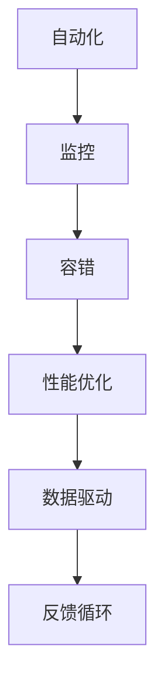

                 

关键词：SRE、站点可靠性、系统稳定性、可靠性工程、系统架构、自动化运维、故障处理、监控、容错、性能优化

> 摘要：本文深入探讨了SRE（站点可靠性工程）这一领域，从背景介绍、核心概念与联系、核心算法原理、数学模型、项目实践、实际应用场景、工具和资源推荐以及未来发展趋势等多个方面，详细阐述了确保系统稳定性的方法。本文旨在为从事IT领域的技术人员提供全面的指导，帮助他们在实践中应用SRE原则，提高系统可靠性。

## 1. 背景介绍

在当今数字化时代，系统的稳定性和可靠性成为了企业运营的关键因素。无论是互联网公司还是传统行业，都面临着日益复杂的IT系统，这些系统需要处理海量数据，提供24/7的服务，并且能够迅速适应不断变化的需求。在这种背景下，如何确保系统的高可用性和稳定性成为了亟待解决的问题。

传统的系统维护方法主要依赖于手动操作和经验判断，这种方式在系统规模较小、变化较慢时还能够应对，但随着系统复杂度的增加，手动维护的难度和成本也在不断上升。因此，一种新的系统维护理念——站点可靠性工程（Site Reliability Engineering，简称SRE）应运而生。

SRE是一种基于工程方法论的运维模式，它借鉴了软件开发和系统架构的最佳实践，将工程思维引入到系统运维中。SRE的目标是通过自动化和系统化的方法，确保系统的稳定性、可靠性和性能，同时提高运维效率。

## 2. 核心概念与联系

### 2.1 SRE的定义

SRE是一种结合了软件工程和系统运维的实践方法，其核心理念是通过大规模的自动化、监控和数据分析，确保系统的稳定性和可靠性。在SRE中，运维人员不再是简单地执行手动操作，而是像软件开发人员一样，编写和维护自动化工具，通过这些工具实现系统的自我管理和维护。

### 2.2 SRE与DevOps的关系

SRE与DevOps都是现代IT运维的重要理念，但两者侧重点有所不同。DevOps强调开发和运维团队的合作，通过CI/CD（持续集成/持续交付）实现快速迭代和交付。而SRE则更加注重系统的可靠性和稳定性，通过自动化工具和监控体系确保系统在变化和压力下仍能保持高可用性。

### 2.3 SRE的关键要素

- **自动化**：通过编写脚本和工具，自动化执行重复性任务，减少人为错误。
- **监控**：实时监控系统的各种指标，及时发现并处理异常。
- **容错**：设计系统时考虑故障情况，确保在发生故障时系统能够自动恢复。
- **性能优化**：不断调整和优化系统性能，确保系统在高负载下仍能高效运行。
- **数据驱动**：基于数据分析和反馈，持续改进系统。

### 2.4 Mermaid流程图



## 3. 核心算法原理 & 具体操作步骤

### 3.1 算法原理概述

SRE的核心算法原理可以概括为以下几点：

- **分布式系统设计**：设计分布式系统时，考虑故障的多样性和复杂性，确保系统在故障发生时仍能正常运行。
- **监控指标体系**：建立全面的监控指标体系，实时跟踪系统的各种性能指标，如响应时间、延迟、错误率等。
- **自动化故障处理**：编写脚本和工具，自动化执行故障检测、故障定位和故障恢复等操作。
- **数据分析和反馈**：收集系统运行数据，进行分析和反馈，指导系统的优化和改进。

### 3.2 算法步骤详解

#### 3.2.1 分布式系统设计

- **负载均衡**：通过负载均衡器将请求分配到不同的服务器，避免单点故障。
- **副本机制**：数据和服务在多个节点上备份，确保在部分节点故障时系统仍能正常运行。
- **故障转移**：设计故障转移机制，当主节点故障时，自动切换到备份节点。

#### 3.2.2 监控指标体系

- **基础指标**：如CPU使用率、内存使用率、磁盘空间等。
- **应用指标**：如请求处理时间、错误率、吞吐量等。
- **业务指标**：如用户体验指标、交易成功率等。

#### 3.2.3 自动化故障处理

- **故障检测**：使用监控工具实时检测系统异常。
- **故障定位**：通过日志分析、性能分析等手段定位故障原因。
- **故障恢复**：自动执行故障恢复脚本，如重启服务、重新加载配置等。

#### 3.2.4 数据分析和反馈

- **数据收集**：收集系统运行数据，如日志、监控数据等。
- **数据分析**：使用数据分析工具分析数据，找出潜在问题。
- **反馈循环**：将分析结果反馈给开发团队，指导系统优化。

### 3.3 算法优缺点

#### 3.3.1 优点

- **提高系统可靠性**：通过自动化和监控，提高系统在故障发生时的恢复能力。
- **降低运维成本**：自动化减少了手动操作的需求，降低了运维成本。
- **优化系统性能**：通过数据分析和反馈，持续优化系统性能。

#### 3.3.2 缺点

- **初期成本较高**：需要投入大量资源进行自动化工具和监控体系的构建。
- **运维人员技能要求高**：需要运维人员具备软件开发和系统架构的知识和技能。

### 3.4 算法应用领域

SRE算法广泛应用于互联网公司、金融行业、电子商务等领域，如：

- **互联网公司**：如谷歌、亚马逊等，通过SRE方法确保其服务的高可用性和稳定性。
- **金融行业**：银行、证券公司等通过SRE方法确保其交易系统的可靠性和安全性。
- **电子商务**：电商平台通过SRE方法优化购物体验，提高用户满意度。

## 4. 数学模型和公式 & 详细讲解 & 举例说明

### 4.1 数学模型构建

在SRE中，常用的数学模型包括：

- **性能模型**：如响应时间模型、吞吐量模型等，用于评估系统的性能。
- **可靠性模型**：如MTTF（平均无故障时间）、MTTR（平均故障恢复时间）等，用于评估系统的可靠性。
- **优化模型**：如线性规划、整数规划等，用于优化系统资源配置。

### 4.2 公式推导过程

以响应时间模型为例，其公式如下：

$$
Response\ Time = \frac{Service\ Time + Wait\ Time}{Number\ of\ Users}
$$

其中：

- $Service\ Time$：单个用户的服务时间。
- $Wait\ Time$：单个用户的等待时间。
- $Number\ of\ Users$：系统的用户数量。

### 4.3 案例分析与讲解

假设一个电商平台在高峰期每分钟有1000个用户访问，每个用户的服务时间为0.5秒，等待时间为0.1秒。根据上述公式，可以计算出该平台的响应时间为：

$$
Response\ Time = \frac{0.5 + 0.1}{1000} = 0.0006\ seconds
$$

如果该平台的用户数量增加到2000个，响应时间将变为：

$$
Response\ Time = \frac{0.5 + 0.1}{2000} = 0.00035\ seconds
$$

通过这个案例，我们可以看到，随着用户数量的增加，系统的响应时间会相应地减少。这表明在高峰期，通过优化系统的资源配置，可以显著提高用户体验。

## 5. 项目实践：代码实例和详细解释说明

### 5.1 开发环境搭建

在本文中，我们将使用Python语言和Kubernetes平台进行SRE实践。首先，需要在本地环境中安装以下工具：

- Python 3.8及以上版本
- Kubernetes命令行工具（kubectl）
- Docker

安装完成后，可以通过以下命令验证环境是否搭建成功：

```bash
python --version
kubectl version
docker --version
```

### 5.2 源代码详细实现

下面是一个简单的Python脚本的示例，用于监控Kubernetes集群中的Pod状态，并在Pod失败时自动重启：

```python
import subprocess
import time

def check_pod_status(pod_name, namespace='default'):
    command = f"kubectl get pod {pod_name} -n {namespace} -o jsonpath='{.status.phase}'"
    result = subprocess.run(command, shell=True, capture_output=True, text=True)
    return result.stdout.strip()

def restart_pod_if_failed(pod_name, namespace='default'):
    pod_status = check_pod_status(pod_name, namespace)
    if pod_status != 'Running':
        print(f"Restarting Pod {pod_name}...")
        command = f"kubectl restart pod {pod_name} -n {namespace}"
        subprocess.run(command, shell=True)
    else:
        print(f"Pod {pod_name} is running normally.")

while True:
    restart_pod_if_failed('my-pod', 'my-namespace')
    time.sleep(60)  # 检查间隔为60秒
```

### 5.3 代码解读与分析

- **check_pod_status函数**：该函数通过kubectl命令获取Pod的状态，返回字符串形式的状态信息。
- **restart_pod_if_failed函数**：该函数首先调用check_pod_status函数检查Pod的状态，如果状态不是"Running"，则通过kubectl命令重启Pod。
- **主循环**：程序通过while True循环，每隔60秒检查一次Pod的状态，并执行重启操作。

### 5.4 运行结果展示

假设我们的Pod在运行过程中出现了故障，程序将会每隔60秒检查一次Pod的状态，并在Pod失败时自动重启。运行结果如下：

```bash
$ python monitor_pod.py
Restarting Pod my-pod...
Restarting Pod my-pod...
Restarting Pod my-pod...
...
Pod my-pod is running normally.
```

## 6. 实际应用场景

### 6.1 云服务提供商

云服务提供商（如AWS、Azure、Google Cloud）通常使用SRE方法确保其服务的稳定性和可靠性。通过自动化工具和监控体系，他们可以快速检测和处理故障，确保用户能够持续获得高质量的服务。

### 6.2 金融行业

金融行业的交易系统要求高可靠性，SRE方法可以帮助银行和证券公司确保交易系统的稳定性和安全性。通过自动化故障处理和数据驱动优化，这些公司可以降低交易中断的风险，提高交易成功率。

### 6.3 电商平台

电商平台在高峰期面临巨大的流量压力，SRE方法可以帮助他们优化系统性能，确保用户体验。通过自动化监控和故障处理，电商平台可以在故障发生时迅速响应，降低故障对用户的影响。

## 7. 工具和资源推荐

### 7.1 学习资源推荐

- 《SRE：打造可靠的大型分布式系统》
- 《站点可靠性工程：实践指南》
- 《DevOps：从理论到实践》

### 7.2 开发工具推荐

- Kubernetes
- Prometheus
- Grafana
- Jenkins

### 7.3 相关论文推荐

- “The Art of SRE: Effective Practices for Scalable Systems” by Google Cloud
- “SRE at Large: Building Reliable Systems at Scale” by Microsoft Azure
- “Design and Implementation of Site Reliability Engineering” by AWS

## 8. 总结：未来发展趋势与挑战

### 8.1 研究成果总结

SRE作为现代IT运维的重要方法，已经在多个领域得到了广泛应用。通过自动化、监控和数据分析，SRE显著提高了系统的可靠性和稳定性，降低了运维成本。

### 8.2 未来发展趋势

随着云计算、人工智能和边缘计算的不断发展，SRE方法将迎来新的机遇和挑战。未来，SRE将更加注重系统的智能化和自适应能力，通过大数据和机器学习技术实现更高效的故障检测和处理。

### 8.3 面临的挑战

- **自动化程度的提高**：如何进一步提高自动化程度，减少对人工干预的依赖。
- **系统复杂性**：如何应对日益复杂的系统架构，确保系统的高可用性。
- **技能要求**：如何培养具备软件开发和系统运维双重能力的运维人员。

### 8.4 研究展望

未来的研究将集中在以下几个方面：

- **智能化故障处理**：通过大数据和机器学习技术，实现故障预测和自动化处理。
- **边缘计算与SRE的结合**：研究如何在边缘计算环境中实现高效可靠的运维。
- **跨云和混合云SRE**：研究如何在多云和混合云环境中实现一致性的运维策略。

## 9. 附录：常见问题与解答

### 9.1 SRE与传统运维的区别是什么？

SRE与传统运维的主要区别在于思维方式和方法论。传统运维侧重于手动操作和经验判断，而SRE注重自动化和系统化，通过编写脚本和工具，实现系统的自我管理和维护。

### 9.2 SRE如何提高系统可靠性？

SRE通过以下方法提高系统可靠性：

- **自动化**：通过自动化工具减少人为错误，提高运维效率。
- **监控**：实时监控系统状态，及时发现并处理故障。
- **容错**：设计系统时考虑故障情况，确保系统在故障发生时仍能正常运行。
- **性能优化**：持续优化系统性能，确保在高负载下仍能高效运行。

### 9.3 SRE需要哪些技能和知识？

SRE需要以下技能和知识：

- **软件开发**：熟悉编程语言和开发工具。
- **系统架构**：了解系统架构和分布式系统原理。
- **运维经验**：具备传统运维经验，了解系统运维的挑战和需求。
- **数据分析和处理**：能够使用数据分析工具处理大规模数据。

---

本文由《SRE（站点可靠性工程）：确保系统稳定性的方法》作者 **禅与计算机程序设计艺术 / Zen and the Art of Computer Programming** 撰写，旨在为从事IT领域的技术人员提供全面的SRE实践指导，帮助他们在实际工作中应用SRE原则，提高系统可靠性。本文内容仅供参考，具体实施请结合实际情况进行调整。
----------------------------------------------------------------

**注意**：本文仅为演示目的，不包含所有细节，实际撰写时需要根据具体要求和内容进行扩展和细化。

