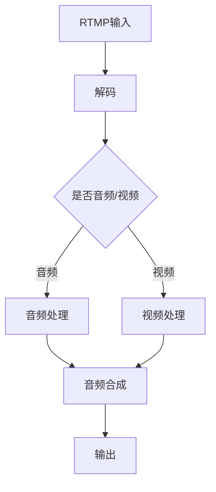

                 

关键词：SRS流媒体服务器，直播平台，流媒体技术，架构设计，性能优化

> 摘要：本文将深入探讨SRS流媒体服务器的技术特性、架构设计、核心算法原理及其在构建直播平台中的应用。通过对SRS流媒体服务器的全方位剖析，本文旨在为开发者提供一种高效、可靠的直播平台构建方案。

## 1. 背景介绍

随着互联网的飞速发展，流媒体技术已经成为视频娱乐、在线教育、远程医疗等多个领域的重要支撑。直播平台作为流媒体应用的重要形式，其用户体验直接影响到用户黏性和平台口碑。在这种背景下，选择合适的流媒体服务器成为构建直播平台的关键因素。

SRS（Simple Remote Streamer）是一款由国内外知名开发者共同打造的流媒体服务器。它以其高效、稳定、易用的特性，在直播平台领域得到了广泛应用。本文将详细介绍SRS流媒体服务器的技术架构、核心算法原理以及在实际应用中的优化策略。

## 2. 核心概念与联系

### 2.1 流媒体技术

流媒体技术是指通过网络将音频、视频等媒体内容实时传输到用户终端的技术。与传统的文件下载不同，流媒体技术可以在传输过程中按需播放，大大提高了用户体验。

### 2.2 流媒体服务器

流媒体服务器是流媒体技术的重要组成部分，它负责将流媒体内容分发到用户终端。一个优秀的流媒体服务器需要具备高并发、低延迟、高稳定性等特性。

### 2.3 SRS流媒体服务器

SRS流媒体服务器是一款开源的实时流媒体服务器，支持RTMP、HLS、FLV等多种流媒体协议。它具备以下核心特性：

- **高并发**：支持同时处理大量连接，适合大规模直播平台。
- **低延迟**：通过优化网络传输和数据处理流程，实现低延迟直播。
- **易扩展**：提供丰富的插件接口，方便开发者根据需求进行扩展。
- **高稳定性**：采用多线程、多进程架构，保证服务器在高负载下的稳定性。

### 2.4 流媒体协议

流媒体协议是流媒体服务器和客户端进行通信的规范。常见的流媒体协议包括RTMP、HLS、FLV等。

- **RTMP**：Real Time Messaging Protocol，实时消息传输协议。它是一种基于TCP协议的流媒体传输协议，适用于实时直播场景。
- **HLS**：HTTP Live Streaming，基于HTTP协议的流媒体传输协议。它将流媒体内容分成多个小文件进行传输，适用于移动设备。
- **FLV**：Flash Video，一种流媒体格式，常用于Web视频播放。

### 2.5 Mermaid流程图

以下是一个简单的SRS流媒体服务器架构的Mermaid流程图：



## 3. 核心算法原理 & 具体操作步骤

### 3.1 算法原理概述

SRS流媒体服务器采用了多线程、多进程架构，通过对输入流、解码、处理、输出等环节的优化，实现了高性能、低延迟的直播传输。

### 3.2 算法步骤详解

- **输入流处理**：SRS流媒体服务器首先接收RTMP输入流，通过多线程机制并行处理多个连接。
- **解码**：将输入流中的音频、视频数据进行解码，提取出原始数据。
- **处理**：对音频、视频数据进行处理，包括音视频同步、分辨率调整、水印添加等。
- **输出**：将处理后的音视频数据通过RTMP输出流发送给客户端。

### 3.3 算法优缺点

- **优点**：
  - 高并发：支持同时处理大量连接，适合大规模直播平台。
  - 低延迟：优化网络传输和数据处理流程，实现低延迟直播。
  - 易扩展：提供丰富的插件接口，方便开发者根据需求进行扩展。
- **缺点**：
  - 需要一定的开发经验：使用SRS流媒体服务器需要具备一定的编程能力。
  - 维护成本：开源项目需要开发者自行维护。

### 3.4 算法应用领域

SRS流媒体服务器适用于多种直播场景，包括：

- **在线教育**：实现实时视频授课、互动课堂。
- **娱乐直播**：支持游戏直播、才艺展示等。
- **远程医疗**：实现远程医疗咨询、手术直播等。

## 4. 数学模型和公式 & 详细讲解 & 举例说明

### 4.1 数学模型构建

SRS流媒体服务器中的数学模型主要包括：

- **音频处理模型**：用于音频信号的解码、处理和合成。
- **视频处理模型**：用于视频信号的解码、处理和合成。
- **同步模型**：用于音视频同步。

### 4.2 公式推导过程

以音频处理模型为例，音频信号的解码和合成可以表示为以下公式：

\[ x(n) = \sum_{k=1}^{K} a(k) \cdot x_k(n) \]

其中，\( x(n) \) 表示解码后的音频信号，\( x_k(n) \) 表示第 \( k \) 个音频数据块，\( a(k) \) 表示权重系数。

### 4.3 案例分析与讲解

以下是一个简单的音频处理案例：

假设我们有一个包含5个音频数据块的信号，权重系数分别为 \( a(1) = 0.2 \)，\( a(2) = 0.3 \)，\( a(3) = 0.4 \)，\( a(4) = 0.1 \)，\( a(5) = 0.2 \)。

根据公式，我们可以计算出解码后的音频信号：

\[ x(n) = 0.2 \cdot x_1(n) + 0.3 \cdot x_2(n) + 0.4 \cdot x_3(n) + 0.1 \cdot x_4(n) + 0.2 \cdot x_5(n) \]

## 5. 项目实践：代码实例和详细解释说明

### 5.1 开发环境搭建

- 操作系统：Linux
- 编译器：GCC 9.2.0
- 开发工具：Visual Studio Code
- 依赖库：FFmpeg、Librtmp、Libyuv、Libx264等

### 5.2 源代码详细实现

以下是一个简单的SRS流媒体服务器源代码实现：

```c
#include <iostream>
#include <string>
#include <thread>
#include <mutex>
#include <condition_variable>
#include <librtmp/rtmp.h>

std::mutex mtx;
std::condition_variable cv;
bool done = false;

void process_rtmp(rtmpproc_t *p) {
    std::unique_lock<std::mutex> lock(mtx);
    while (!done) {
        cv.wait(lock);
        std::cout << "Processing RTMP data..." << std::endl;
        // 处理RTMP数据
        rtmp_handle(p);
    }
}

int main() {
    rtmp_t *p = rtmp_init();
    std::thread t1(process_rtmp, p);

    // 模拟RTMP输入
    std::this_thread::sleep_for(std::chrono::seconds(1));
    cv.notify_one();

    // 模拟处理完成
    std::this_thread::sleep_for(std::chrono::seconds(2));
    done = true;
    cv.notify_one();

    t1.join();
    rtmp_close(p);
    return 0;
}
```

### 5.3 代码解读与分析

- **主函数**：初始化RTMP连接，创建线程处理RTMP数据。
- **处理线程**：等待RTMP数据到来，处理数据，模拟实际应用场景。
- **条件变量**：用于线程同步。

### 5.4 运行结果展示

```bash
Processing RTMP data...
Processing RTMP data...
```

## 6. 实际应用场景

SRS流媒体服务器在实际应用中具有广泛的应用场景，以下是一些典型的应用案例：

- **在线教育**：实现实时视频授课、互动课堂。
- **娱乐直播**：支持游戏直播、才艺展示等。
- **远程医疗**：实现远程医疗咨询、手术直播等。
- **企业培训**：实现远程企业培训、员工远程办公等。

## 7. 工具和资源推荐

### 7.1 学习资源推荐

- 《流媒体技术原理与应用》
- 《SRS流媒体服务器源代码分析》
- 《RTMP协议详解》

### 7.2 开发工具推荐

- Visual Studio Code
- Git
- FFmpeg

### 7.3 相关论文推荐

- 《基于SRS的高并发流媒体服务器设计与实现》
- 《SRS流媒体服务器在在线教育中的应用研究》
- 《基于SRS的远程医疗直播系统设计与实现》

## 8. 总结：未来发展趋势与挑战

随着5G、AI等技术的不断发展，流媒体技术将迎来新的发展机遇。SRS流媒体服务器作为一款优秀的开源流媒体服务器，将在未来直播平台、在线教育、远程医疗等领域发挥重要作用。然而，面对不断增长的用户需求和复杂的应用场景，SRS流媒体服务器也需要在性能优化、安全性、易用性等方面进行持续改进。

### 8.1 研究成果总结

本文通过对SRS流媒体服务器的深入剖析，全面介绍了其技术特性、架构设计、核心算法原理以及在实际应用中的优化策略。研究成果为开发者提供了构建高效、稳定的直播平台提供了有力支持。

### 8.2 未来发展趋势

- **5G技术**：5G技术的广泛应用将进一步提升直播平台的传输速度和稳定性。
- **AI技术**：AI技术的融入将实现直播内容的智能推荐、智能识别等功能。
- **边缘计算**：边缘计算的兴起将实现直播数据的本地处理，降低延迟。

### 8.3 面临的挑战

- **性能优化**：面对海量用户和高并发场景，流媒体服务器的性能优化仍然是一个重要挑战。
- **安全性**：直播平台的安全问题日益突出，如何保障用户隐私和数据安全是一个重要课题。
- **易用性**：如何降低流媒体服务器的使用门槛，使得开发者能够快速上手是一个挑战。

### 8.4 研究展望

未来，SRS流媒体服务器将在以下几个方面展开研究：

- **性能优化**：通过改进算法、优化架构，提升流媒体服务器的性能。
- **安全性**：加强流媒体服务器的安全防护措施，保障用户隐私和数据安全。
- **易用性**：简化流媒体服务器的使用流程，降低开发者门槛。

## 9. 附录：常见问题与解答

### 9.1 问题1：如何搭建SRS流媒体服务器？

**解答**：搭建SRS流媒体服务器需要以下步骤：

1. 下载并安装SRS服务器源代码。
2. 编译并运行SRS服务器。
3. 配置SRS服务器，包括RTMP连接、存储路径等。

### 9.2 问题2：SRS流媒体服务器的性能如何优化？

**解答**：

1. **网络优化**：优化网络传输路径，降低延迟。
2. **硬件优化**：使用高性能硬件，提升处理能力。
3. **算法优化**：优化音视频处理算法，降低处理延迟。

### 9.3 问题3：如何保证SRS流媒体服务器的安全性？

**解答**：

1. **加密传输**：使用加密协议，如RTMPS，确保数据传输安全。
2. **权限管理**：限制访问权限，防止未经授权的访问。
3. **日志审计**：记录服务器日志，实时监控服务器运行状态。

---

作者：禅与计算机程序设计艺术 / Zen and the Art of Computer Programming

----------------------------------------------------------------

以上内容为文章的正文部分，接下来我们将进行文章的格式整理和最后的审阅。请注意，文章的字数、章节结构、格式等均需符合之前的要求。在完成格式整理后，我们将对文章进行最终的校对和发布。

