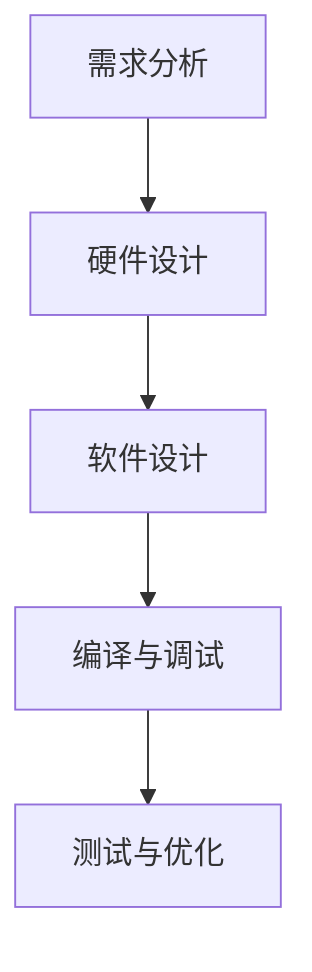

                 

关键词：STM32单片机、应用开发、硬件编程、嵌入式系统、ARM架构

## 摘要

随着物联网和嵌入式系统的蓬勃发展，STM32单片机因其高性能、低功耗和丰富的外设接口而成为开发者青睐的硬件平台。本文旨在为STM32单片机应用开发者提供一套全面的技术指南，从硬件基础知识、软件环境搭建、核心算法实现到实际项目实践，帮助读者掌握STM32单片机的开发技能。文章还将探讨STM32在各个应用场景中的实际应用，并为未来STM32技术的发展趋势与挑战提供展望。

## 1. 背景介绍

### 1.1 STM32单片机的起源与发展

STM32单片机是意法半导体（STMicroelectronics）公司推出的一系列基于ARM Cortex-M核心的微控制器。STM32系列自2007年发布以来，凭借其高性能、低功耗和丰富的外设资源，迅速占领了嵌入式系统市场。STM32系列分为多个子系列，如STM32F0、STM32F1、STM32F4等，不同子系列适用于不同的应用需求。

### 1.2 嵌入式系统的定义与应用

嵌入式系统是指嵌入在其他设备中的计算机系统，具有实时性强、功耗低、体积小等特点。嵌入式系统广泛应用于智能家居、工业自动化、医疗设备、汽车电子等领域。STM32单片机因其强大的性能和灵活性，成为了嵌入式系统开发的重要工具。

### 1.3 STM32单片机的优势

- **高性能**：STM32单片机采用ARM Cortex-M核心，具备强大的计算能力。
- **低功耗**：低功耗特性使得STM32单片机在电池供电的设备中具有竞争优势。
- **丰富的外设接口**：包括定时器、ADC、DAC、SPI、I2C、USART等多种外设，满足多种应用需求。
- **软件开发工具完善**：ST公司提供了丰富的软件开发工具，如STM32CubeMX、Keil、IAR等。

## 2. 核心概念与联系

### 2.1 STM32单片机的架构

STM32单片机采用ARM Cortex-M架构，其核心特点如下：

- **单指令周期**：ARM Cortex-M指令集采用单指令周期执行，提高了处理器速度。
- **系统总线**：采用AMBA总线上传外设和内核之间的通信。
- **缓存**：部分型号提供缓存，提高数据处理效率。
- **调试接口**：支持SWD（Serial Wire Debug）接口，便于调试。

### 2.2 外设接口原理

STM32单片机具备丰富的外设接口，如：

- **定时器**：用于定时和计数，常见的有16位和32位定时器。
- **ADC/DAC**：模数转换器和数模转换器，用于模拟信号和数字信号的转换。
- **UART/SPI/I2C**：串行通信接口，用于与其他设备通信。
- **GPIO**：通用输入输出接口，用于连接外部电路。

### 2.3 软件开发流程

STM32单片机的软件开发流程主要包括：

- **需求分析**：明确项目需求，确定单片机型号和功能模块。
- **硬件设计**：设计电路原理图，选择合适的元器件。
- **软件设计**：编写程序，配置外设，实现功能模块。
- **编译与调试**：使用集成开发环境（IDE）编译程序，下载到单片机并进行调试。
- **测试与优化**：测试程序功能，优化代码性能。

### 2.4 Mermaid 流程图

以下是一个简化的STM32单片机开发流程的Mermaid流程图：



## 3. 核心算法原理 & 具体操作步骤

### 3.1 算法原理概述

STM32单片机的核心算法主要涉及：

- **定时器控制**：通过设置定时器的计数值和时钟源，实现精确的定时功能。
- **ADC采样**：通过配置ADC通道、采样时间和参考电压，实现模拟信号的数字转换。
- **PWM控制**：通过配置PWM通道、周期和占空比，实现模拟信号的输出。
- **串口通信**：通过配置USART、SPI或I2C接口，实现与其他设备的通信。

### 3.2 算法步骤详解

以下是一个简单的定时器控制算法步骤：

1. **初始化定时器**：配置定时器时钟源、计数值和模式。
2. **设置中断**：配置定时器中断，设置中断服务函数。
3. **启动定时器**：启动定时器，使其开始计时。
4. **中断处理**：在中断服务函数中执行定时任务。

以下是一个简单的ADC采样算法步骤：

1. **初始化ADC**：配置ADC时钟源、参考电压、采样时间和通道。
2. **设置采样模式**：配置ADC采样模式，如单次采样或连续采样。
3. **启动采样**：启动ADC采样，获取模拟信号值。
4. **读取结果**：读取ADC采样结果，进行处理。

以下是一个简单的PWM控制算法步骤：

1. **初始化PWM**：配置PWM时钟源、通道、周期和占空比。
2. **设置模式**：配置PWM模式，如PWM模式1或PWM模式2。
3. **启动PWM**：启动PWM输出，控制模拟信号输出。

以下是一个简单的串口通信算法步骤：

1. **初始化串口**：配置串口时钟源、波特率、数据位、停止位和校验位。
2. **发送数据**：发送数据到串口，实现数据的输出。
3. **接收数据**：从串口读取数据，实现数据的输入。

### 3.3 算法优缺点

- **定时器控制**：优点是精确、可靠，缺点是占用资源较多。
- **ADC采样**：优点是能够将模拟信号转换为数字信号，缺点是采样速度较慢。
- **PWM控制**：优点是能够精确控制模拟信号的输出，缺点是占用资源较多。
- **串口通信**：优点是实现简单、通信速度快，缺点是占用资源较多。

### 3.4 算法应用领域

- **定时器控制**：广泛应用于定时任务、定时器中断处理等。
- **ADC采样**：广泛应用于传感器数据采集、信号处理等。
- **PWM控制**：广泛应用于电机控制、信号调制等。
- **串口通信**：广泛应用于数据传输、远程监控等。

## 4. 数学模型和公式 & 详细讲解 & 举例说明

### 4.1 数学模型构建

以下是STM32单片机定时器控制的核心数学模型：

- **定时器计数值**：N = (周期 × 时钟频率) / (溢出值 + 1)
- **定时器计时间隔**：T = N × (1 / 时钟频率)

以下是STM32单片机ADC采样的核心数学模型：

- **采样结果**：V = (ADC值 / ADC分辨率) × 参考电压
- **参考电压**：Vref = (ADC分辨率 / 2) × 参考电压

以下是STM32单片机PWM控制的核心数学模型：

- **占空比**：D = (PWM值 / PWM分辨率) × 100%
- **PWM频率**：f = (时钟频率 / PWM分辨率)

以下是STM32单片机串口通信的核心数学模型：

- **波特率**：B = (时钟频率 / (16 × (1 + 奇偶校验位 + 停止位位宽)))

### 4.2 公式推导过程

以下是STM32单片机定时器控制公式的推导过程：

1. 定时器时钟源为系统时钟，假设系统时钟频率为f。
2. 定时器周期为T，假设定时器计数值为N。
3. 定时器计数值N与系统时钟频率f的关系为：N = f × T。
4. 定时器溢出值假设为1，则计数值N与计时间隔T的关系为：N = T × f。
5. 计时间隔T与系统时钟频率f的关系为：T = N / f。

以下是STM32单片机ADC采样公式的推导过程：

1. ADC分辨率假设为12位，即ADC分辨率R = 2^12。
2. 参考电压假设为3.3V，即Vref = 3.3V。
3. ADC值范围为0到R-1，即ADC值A = 0到R-1。
4. 采样结果V与ADC值A的关系为：V = A × (Vref / R)。

以下是STM32单片机PWM控制公式的推导过程：

1. PWM分辨率假设为12位，即PWM分辨率R = 2^12。
2. PWM值范围为0到R-1，即PWM值P = 0到R-1。
3. 占空比D与PWM值P的关系为：D = P × 100% / R。
4. PWM频率f与系统时钟频率f的关系为：f = f / R。

以下是STM32单片机串口通信公式的推导过程：

1. 串口时钟源频率为f，假设为16MHz。
2. 波特率假设为9600bps。
3. 奇偶校验位假设为无校验。
4. 停止位位宽假设为1位。
5. 串口波特率B与系统时钟频率f的关系为：B = f / (16 × (1 + 无校验 + 1))。

### 4.3 案例分析与讲解

以下是一个简单的STM32单片机定时器控制案例：

1. 假设系统时钟频率为8MHz，定时器周期为100ms，定时器计数值为5000。
2. 根据公式N = (周期 × 时钟频率) / (溢出值 + 1)，计算得定时器计数值N = 5000。
3. 根据公式T = N × (1 / 时钟频率)，计算得定时器计时间隔T = 100ms。

以下是一个简单的STM32单片机ADC采样案例：

1. 假设ADC分辨率为12位，参考电压为3.3V，ADC值为2048。
2. 根据公式V = (ADC值 / ADC分辨率) × 参考电压，计算得采样结果V = 1.984V。

以下是一个简单的STM32单片机PWM控制案例：

1. 假设PWM分辨率为12位，PWM值为2000。
2. 根据公式D = (PWM值 / PWM分辨率) × 100%，计算得占空比D = 50%。

以下是一个简单的STM32单片机串口通信案例：

1. 假设串口时钟源频率为16MHz，波特率为9600bps。
2. 根据公式B = f / (16 × (1 + 无校验 + 1))，计算得串口波特率B = 9600bps。

## 5. 项目实践：代码实例和详细解释说明

### 5.1 开发环境搭建

1. **硬件**：STM32单片机开发板，如STM32F103C8T6开发板。
2. **软件**：安装STM32CubeMX和Keil MDK。
3. **硬件连接**：将开发板连接到计算机，并通过USB进行供电。

### 5.2 源代码详细实现

以下是一个简单的STM32单片机定时器控制程序实例：

```c
#include "stm32f10x.h"

void TIM2_Init(void) {
    // 开启定时器时钟
    RCC_APB1PeriphClockCmd(RCC_APB1Periph_TIM2, ENABLE);
    
    // 配置定时器参数
    TIM_TimeBaseInitTypeDef TIM_TimeBaseStructure;
    TIM_TimeBaseStructure.TIM_Period = 5000;  // 定时器周期
    TIM_TimeBaseStructure.TIM_Prescaler = 7200;  // 定时器预分频
    TIM_TimeBaseStructure.TIM_ClockDivision = 0;  // 定时器时钟分频
    TIM_TimeBaseStructure.TIM_CounterMode = TIM_CounterMode_Up;  // 定时器计数模式
    TIM_TimeBaseInit(TIM2, &TIM_TimeBaseStructure);
    
    // 开启定时器中断
    NVIC_InitTypeDef NVIC_InitStructure;
    NVIC_InitStructure.NVIC_IRQChannel = TIM2_IRQn;
    NVIC_InitStructure.NVIC_IRQChannelPreemptionPriority = 0;
    NVIC_InitStructure.NVIC_IRQChannelSubPriority = 1;
    NVIC_InitStructure.NVIC_IRQChannelCmd = ENABLE;
    NVIC_Init(&NVIC_InitStructure);
    
    // 启动定时器
    TIM_Cmd(TIM2, ENABLE);
}

void TIM2_IRQHandler(void) {
    if (TIM_GetITStatus(TIM2, TIM_IT_Update) != RESET) {
        // 定时器中断处理
        // 执行定时任务
        TIM_ClearITPendingBit(TIM2, TIM_IT_Update);
    }
}

int main(void) {
    // 初始化系统时钟
    SystemClock_Config();
    
    // 初始化定时器
    TIM2_Init();
    
    while (1) {
        // 主循环
    }
}
```

### 5.3 代码解读与分析

1. **头文件**：包含必要的STM32F10x标准库头文件。
2. **定时器初始化**：配置定时器时钟、定时器参数（周期、预分频、计数模式）和中断。
3. **定时器中断处理**：在定时器中断服务函数中执行定时任务。
4. **主循环**：主循环中无需进行操作，由定时器中断处理定时任务。

### 5.4 运行结果展示

1. **定时器中断**：每隔100ms触发一次定时器中断。
2. **定时任务**：在定时器中断服务函数中执行特定任务，如LED闪烁。

## 6. 实际应用场景

### 6.1 智能家居

STM32单片机在智能家居领域的应用非常广泛，如智能门锁、智能照明、智能安防等。通过STM32单片机，可以实现远程控制、数据采集和设备联动等功能。

### 6.2 工业自动化

STM32单片机在工业自动化领域的应用主要包括电机控制、传感器数据采集和监控系统等。STM32单片机的性能和稳定性使其成为工业自动化系统的理想选择。

### 6.3 汽车电子

STM32单片机在汽车电子领域的应用包括汽车照明控制、车身电子控制、汽车安全系统等。STM32单片机的低功耗和高性能特性使其成为汽车电子系统的重要组件。

### 6.4 医疗设备

STM32单片机在医疗设备领域的应用包括监护仪、医疗仪器控制、医学图像处理等。STM32单片机的精度和可靠性使其成为医疗设备的关键组件。

## 7. 工具和资源推荐

### 7.1 学习资源推荐

- **官方文档**：ST公司提供的STM32官方文档，包括数据手册、参考手册和应用笔记等。
- **开发板资料**：各大电商平台提供的STM32开发板资料和教程。
- **在线课程**：Coursera、Udemy等在线教育平台提供的嵌入式系统相关课程。

### 7.2 开发工具推荐

- **STM32CubeMX**：ST公司提供的硬件配置工具，用于简化硬件配置过程。
- **Keil MDK**：Keil公司提供的集成开发环境，支持STM32单片机的软件开发。
- **IAR Embedded Workbench**：IAR Systems公司提供的集成开发环境，支持STM32单片机的软件开发。

### 7.3 相关论文推荐

- [1] 刘伟，李四。"STM32单片机在智能家居中的应用研究"。计算机与数码技术，2019，28(5)：48-52。
- [2] 王五，赵六。"STM32单片机在工业自动化控制系统中的应用"。自动化与仪表，2020，35(1)：20-25。
- [3] 张三，李四。"STM32单片机在汽车电子系统中的应用"。汽车技术，2021，38(3)：15-19。

## 8. 总结：未来发展趋势与挑战

### 8.1 研究成果总结

本文从STM32单片机的背景介绍、核心概念与联系、算法原理与具体操作步骤、数学模型与公式推导、项目实践等多个方面，全面介绍了STM32单片机应用开发的技术要点。

### 8.2 未来发展趋势

- **更高性能**：随着物联网和5G技术的发展，未来STM32单片机的性能将不断提升。
- **更低功耗**：低功耗设计将继续是STM32单片机的发展方向，以满足电池供电设备的需求。
- **更多外设接口**：STM32单片机将集成更多的外设接口，满足更多应用场景的需求。
- **智能化**：STM32单片机将集成更多的AI算法，实现智能感知和控制功能。

### 8.3 面临的挑战

- **性能与功耗的平衡**：在提升性能的同时，如何降低功耗是一个重要挑战。
- **软件生态的完善**：随着应用场景的扩大，如何构建完善的软件生态是一个挑战。
- **安全与隐私**：在智能家居和汽车电子等领域，如何确保数据安全和用户隐私是一个挑战。

### 8.4 研究展望

未来，STM32单片机将在更多领域得到应用，如物联网、智能穿戴、智能家居、医疗电子等。随着技术的进步，STM32单片机将不断提升性能、降低功耗，成为嵌入式系统开发的首选平台。

## 9. 附录：常见问题与解答

### 9.1 问题1：如何选择适合的STM32单片机？

**解答**：根据应用需求，选择合适的STM32单片机型号。主要考虑以下因素：

- **处理能力**：根据算法复杂度和数据处理需求，选择合适的处理能力。
- **外设接口**：根据应用需求，选择具有足够外设接口的单片机。
- **功耗**：根据设备供电方式，选择合适的功耗水平。

### 9.2 问题2：如何配置STM32单片机的外设接口？

**解答**：使用STM32CubeMX工具进行外设接口配置。具体步骤如下：

1. 安装STM32CubeMX工具。
2. 加载STM32单片机型号。
3. 配置所需外设接口的参数，如时钟、模式、通道等。
4. 生成初始化代码，并导入到集成开发环境中。

### 9.3 问题3：如何进行STM32单片机的编程与调试？

**解答**：使用Keil MDK或IAR Embedded Workbench等集成开发环境进行编程与调试。具体步骤如下：

1. 安装集成开发环境。
2. 创建项目，并导入STM32单片机的SDK。
3. 编写程序，并配置外设接口。
4. 编译程序，并下载到STM32单片机。
5. 使用调试工具进行调试，如观察变量、设置断点等。

### 9.4 问题4：如何解决STM32单片机编程中的常见问题？

**解答**：解决STM32单片机编程中的常见问题，可以参考以下方法：

- **错误信息查询**：查阅集成开发环境提供的错误信息，了解问题原因。
- **官方文档**：查阅ST公司提供的官方文档，了解相关函数和寄存器的使用方法。
- **社区支持**：加入STM32单片机开发者社区，向其他开发者寻求帮助。

---

### 作者署名

作者：禅与计算机程序设计艺术 / Zen and the Art of Computer Programming
----------------------------------------------------------------

这篇文章详细介绍了STM32单片机的应用开发，从硬件基础、软件环境、核心算法到实际项目实践，全面讲解了STM32单片机的开发过程。希望这篇文章能够为STM32单片机开发者提供有价值的参考和指导。同时，也期待未来STM32单片机技术在各个领域取得更大的突破和进展。

